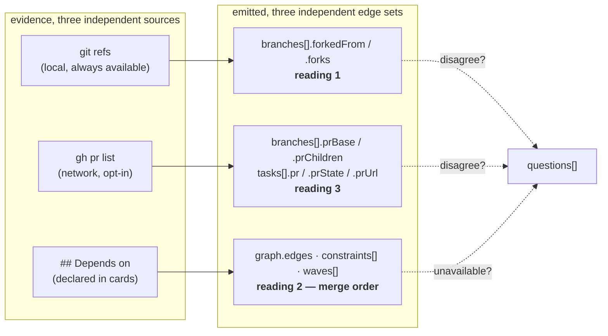

# Treko: the analyzer's up/down traversal, with PRs

Planned 2026-08-23 on `main` @ `984e7ac`, after cards 1 (PR #64) and the store-location follow-on
(PR #68) merged. This is **card 5** of the numbered set carried in `treko-rename.md` §Deferred.
Model-switch checkpoint 1 (entering planning): **asked and answered** — stay on Opus 5, because
this card adds the analyzer's first network dependency and changes an emitted schema three tests
assert by set equality.

> **Gate status: CLOSED.** No branch. No implementation. The planning → implementation transition
> opens only on the literal phrase `gate confirmed` (`rules/gates.md`).

## Why

Treko's board answers "what is in flight, and in what order can it land?" Today it answers that
from **one** relation — an explicit `## Depends on` section in a feature card — and it measures
every branch against `main`. Both of those are true statements about the repo; neither is
sufficient, and in this repository both are currently **empty**.

Measured at `984e7ac`, in this checkout:

| Signal the board could show | Present today |
|---|---|
| Card dependency edges (`graph.edges`) | **0** — no card in `docs/features/` has a `## Depends on` section |
| Ordering constraints (`constraints[]`) | **0** |
| Merge-order waves | **1 wave holding all 24 cards** — i.e. "everything is independent" |
| PR number / state / URL on any task | `—` / `—` / `""` — hardcoded, for all 24 cards |
| Branch stacking | not computed at all |

So the tool's headline output — the merge order — currently says *nothing is ordered*, and the
page's entire PR column renders an em dash. Both are honest (the analyzer refuses to guess), and
both are useless. The information exists in the repository; nothing reads it.

The concrete cost, with real numbers from this checkout:

```
chore/judge-ledger-commitability   vs main               →  ahead 10, behind 75   ("needs rebase")
chore/judge-ledger-commitability   vs chore/jlc-guard    →  ahead  6, behind  0   (fully current)
```

That branch is stacked on `chore/jlc-guard`, which is stacked on `main`. The board reports it as
**75 behind and needing a rebase**. It is not behind anything it will merge into; it is six commits
of its own on top of a parent it is exactly level with. `_ahead_behind` (`analyze.py:147-157`)
compares `base...branch` where `base` is always the first of `[requested, "main", "master"]` found
in local heads (`_base_branch`, `:134`), so **every branch is measured against `main` and stacked
branches all look parallel.**

## What "up/down traversal" was never defined as

The phrase *"the analyzer's up/down traversal with PRs"* appears three times in this repo —
`treko-rename.md:15`, `treko-rename.md:359`, `treko-store-location.md:75` (verified at `984e7ac`).
**Every occurrence is a forward reference to this card. No ADR ever defined it.** Three readings
were possible:

1. **Branch ancestry** — for each branch, walk UP to what it forks from and DOWN to what forks off
   it, so the board shows "this branch sits on top of that one".
2. **Card dependency chains** — walk the `## Depends on` graph up (blockers) and down (blocked-by).
3. **PR stacking** — follow each PR's base ref up to its parent PR and down to its children.

Asked directly on 2026-08-23, the user's answer was verbatim:

> **"It's all 1, 2, and 3. It will vary depending on the repository and branch."**

Turning that sentence into something buildable is this card's central design job, and it is D1 and
D2 below. The short version: **all three are computed, always; none is selected; what varies by
repository and branch is which of them is *available*, and availability is measured, not
configured.**

## Scope

### In

- **Reading 1 — branch ancestry.** `forkedFrom` / `forks` on every `branches[]` row, computed from
  git alone, no network. This is the only one of the three that yields edges in this repo today.
- **Reading 3 — PR data.** One `gh pr list` call behind an opt-in flag, filling the task-level
  `pr` / `prState` / `prUrl` fields and the wave-item `pr` / `prState` fields **that the page
  already renders**, plus `prBase` / `prChildren` on `branches[]`.
- **Reading 2 — emission only.** It already exists and works (D4). No re-derivation, no new parser.
- The **degradation contract**: every new field falls back to today's `NO_VALUE` / `""` / `[]`, and
  the run still emits, when the data cannot be obtained.
- The **disagreement questions**: where two relations contradict each other on the same branch.
- **ADR 0037**, and the `--prs` / `TREKO_GH_TIMEOUT` rows in `skills/treko/SKILL.md`.

### Out

- **Changing what `ahead` / `behind` measure.** They stay `base...branch`. Re-pointing a rendered
  number at a different base without renaming it is a silent reinterpretation; see §Risks and the
  inherited `null`-vs-`0` defect in D7.
- **Feeding readings 1 or 3 into `_layer`.** The merge order stays reading-2-only. This is the load-
  bearing exclusion of the whole card — D1 defends it.
- **Writing PR data to the analyzed repo, or anywhere except the store.** `analyze.py` writes
  nothing, and `test_analyzer_writes_nothing_to_the_analyzed_repo` (`test_analyze.py:590`) proves it.
- **Any non-GitHub forge, `gh auth login`, or credential handling.** Treko reads whatever `gh` is
  already authenticated as; it never authenticates, prompts, or stores a token.
- **Rendering `forkedFrom` / `forks` / `prBase` / `prChildren` on the page.** They are emitted; the
  page change to draw them is a separate task and, per §Suggested split, arguably a separate card.
- **Anything the Ledger, dashboard, or agent panel own** (cards 2-4).

## Background: the five facts the design turns on

Each verified in the tree at `984e7ac`.

**1. The page is already fully wired for PRs — only the producer is missing.**
`analyze.py:384-386` hardcodes, for every task:

```python
"pr": NO_VALUE, "prState": NO_VALUE, "prUrl": "",
```

`NO_VALUE` is the literal `"—"` (`:43`). Wave items are `{"t": name, "pr": "", "prState": ""}`
(`:681`, `:689`). Meanwhile `Treko.dc.html` carries the complete consumer side:

```js
// :307
const PC={'Draft':TONES.neutral,'Open':TONES.info,'Approved':TONES.ok,'Changes req.':TONES.warn,
          'Merged':TONES.accent,'Closed':TONES.bad,'—':{c:'var(--color-neutral-700)',bg:'transparent'}};
// :318
const OPEN_PR=['Draft','Open','Approved','Changes req.'];
```

plus the `t.prHref` / `t.pr` / `t.prState` row at `:139-140`, wave PR chips at `:186`, the
`openPRs` stat at `:520`, `t.pr` inside the search predicate at `:532`, and the derivations at
`:548-549` and `:569`. **Filling these five fields is immediately visible with zero page changes.**
That is the cheapest real value in this card, and the task order reflects it.

**2. `analyze.py` has exactly one subprocess helper, and it only runs `git`.**

```python
# :92-103
def _git(root, *args, allow_failure=False):
    """Run a read-only git command in `root`. Never mutates."""
    result = subprocess.run(
        ["git", "-C", str(root), *args], capture_output=True, text=True,
    )
```

Its eight call sites are all read-only git: `:126` `worktree list`, `:143` `for-each-ref`,
`:150-153` `rev-list --left-right --count`, `:163` `diff --shortstat`, `:177-180` `log`, `:437`
`status --porcelain`, `:440` `log -1 --format=%cr`, `:468` `rev-parse --git-dir`. **`gh` appears
nowhere in `treko/*.py` or `treko/*.html`** (0 hits for the whole word), and the literal `origin/`
appears in no `treko/*.py` (0 hits — the 34 substring matches for "origin" are all HTTP
`Origin` / `same-origin` header handling in `server.py`). `_git` has **no timeout**.

**3. Reading 2 already exists in full. Do not rebuild it.** `_declared_edges` (`:604`) reads
`## Depends on` bullets only (`_depends_on`, `:231-248`); `_layer` (`:316-330`) is Kahn's algorithm
returning `(layers, cycle_members)` with the docstring *"leftovers are a cycle, not an order"*;
it is rendered by `_build_waves` (`:669`), `_build_constraints` (`:695`) and `_build_graph`
(`:717`), with blocking in `_blocked_cards` (`:628`). Its tests already pin that prose never
creates an edge, that the section stops at the next heading, that an unknown target is a question
rather than an edge, and that a cycle is a question rather than a hang. **Reading 2 is a UI and
emission change at most.**

**4. The analyzer's first principle forbids merging the three.** From the module docstring,
`analyze.py:17-20`:

> DEPENDENCIES COME ONLY FROM `## Depends on`. Prose that says "must land after X" is not a
> dependency; it is unreadable to a machine, and guessing produces a confident wrong merge order,
> which is worse than an admitted gap.

A branch fork point is not a declared dependency. Feeding it into `_layer` would change the tool's
headline output on evidence the module explicitly refuses. D1 is that sentence applied.

**5. The `null`-vs-`0` rule is already written, already violated, and already pinned by a test.**
`docs/features/tracking-feature-state.spec.md:198` says of a branch with no readable upstream:

> `ahead`/`behind` are `null` — **not** `0`, which would falsely read as "in sync". `note` says no
> upstream.

`skills/treko/SKILL.md` repeats it ("`branches[]`: `null` is not `0`"). But `_ahead_behind` returns
`0, 0` on every failure path (`:149`, `:155`), `analyze()` at `:474-479` states in a `questions[]`
entry that counts "are reported as 0 rather than guessed", and `test_analyze.py:555` asserts
`isinstance(entry["ahead"], int)` — which **`None` fails**. So the spec, the skill, the code and
the test do not agree, and the test currently pins the behaviour the spec forbids. See D7: this
card does not fix that, and must not deepen it.

## Design

### The shape, before the detail



The three arrows never converge. That is the design.

### D1 — Three relations, three edge sets, never merged

**Decision: readings 1, 2 and 3 are computed independently and emitted as parallel, separately-named
edge sets. There is no merged graph and no precedence order.**

They are not three measurements of one thing. They are three different things:

| | Reading 1 — ancestry | Reading 2 — cards | Reading 3 — PRs |
|---|---|---|---|
| Evidence | git commit topology | a human wrote `## Depends on` | whoever opened the PR picked a base |
| Kind of claim | **observed** | **declared intent** | **published intent** |
| Fails by | being stale after a rebase | being absent (24/24 cards here) | being unavailable (no `gh`) |
| Answers | "does this sit on that?" | "must this land after that?" | "does this PR target that PR?" |

Three arguments for keeping them apart:

**Merging would violate the analyzer's stated first principle.** Fact 4 above: a fork point is not
a declared dependency. In this repo, where `graph.edges` is empty and one wave holds all 24 cards,
merging reading 1 in would instantly produce a populated merge order derived entirely from *where
branches happened to be cut*. That order would look authoritative and be unearned.

**Disagreement is the most valuable signal the tool can produce, and merging destroys it.** If a
card declares it depends on B, but its branch forks off `main` and its PR bases on `main`, the
declaration and the topology disagree — and that is worth a `questions[]` entry, because it usually
means either the card is stale or someone forgot to stack the branch. A merged graph must pick one
edge and silently discard the other.

**Neither precedence order survives contact with reality.** "Declared beats observed" is wrong the
moment a card outlives a rebase. "Observed beats declared" is wrong the moment a branch is cut from
whatever happened to be checked out. Any fixed order is wrong roughly half the time, and wrong
invisibly.

**The failure mode of the choice not taken — merging with precedence:** the merge-order proposal in
`waves[]`, which is the tool's headline output and the thing a human acts on, would start carrying
edges that no human ever asserted. In a repo like this one — 24 cards, zero declarations — the
board would flip from an honest *"nothing is ordered, and here is a question about why"* to a
confident wrong ordering with no visible provenance. That is precisely the failure `analyze.py`'s
docstring names, and it is worse than the empty board it replaces.

**The failure mode of the choice taken — parallel edge sets:** a reader sees three relations and
must reconcile them, and may assume their union is "the" dependency graph. Two mitigations, both
structural rather than advisory:

- **`graph.edges` — the merge-order graph — is not touched by this card.** Readings 1 and 3 land on
  `branches[]` rows; reading 2 stays on `features[]` / `graph` / `constraints` / `waves`. They live
  in different arrays, so they *cannot* be unioned by accident.
- The disagreements that matter are computed and named (D9), rather than left to the reader.

### D2 — What "it will vary depending on the repository and branch" means, precisely

**Nothing selects a relation. All three are attempted for every branch on every run. What varies is
which of them is *available*, and availability is a measured property of the repository and branch —
never a flag, a config file, or a heuristic.**

| Relation | Available when | Unavailable → emitted as | Question? |
|---|---|---|---|
| 1. Ancestry | ≥2 local branches sharing history | `forkedFrom: []`, `forks: []` | only on a tie-free orphan in a multi-branch repo |
| 2. Card deps | a card has `## Depends on` naming a real card | today's behaviour, unchanged | today's behaviour, unchanged |
| 3. PR stacking | `--prs` passed **and** `gh` present, authenticated, in time | `pr`/`prState` = `NO_VALUE`, `prUrl` = `""`, `prBase`/`prChildren` = `[]` | one, naming the reason, when `--prs` was asked for and could not be served |

That table is the whole answer, and every row of it is a scenario below. It is testable in a way a
precedence order is not: for any given repository and branch you can enumerate which rows are
populated and assert exactly that set.

**Proof that the variation is real, measured in this repo at `984e7ac`:**

| Relation | Edges here today |
|---|---|
| 1. Ancestry | **2 genuine stacks** — `judge-ledger-commitability` → `jlc-guard` + `jlc-union`; `hook-wiring-health-check` → `post-merge-63` + `main` |
| 2. Card deps | **0** — no card has a `## Depends on` section |
| 3. PR stacking | **0** — all 68 PRs base on `main`; there is not one stacked PR |

So in the repository Treko lives in, exactly one of the three relations produces an edge, and the
other two are structurally empty. A design that merged them would be a design whose behaviour is
untestable here. A design that emits them separately reports "one populated, two empty" — which is
the true answer.

### D3 — Reading 1: ancestry, from tip containment, in n + k git calls

**Definition.** Branch `X` sits on top of branch `B` when `B`'s tip commit is an ancestor of `X`'s
tip commit. `forkedFrom(X)` is the set of **maximal** such `B` — those that no other qualifying
ancestor descends from. `forks(B)` is the inverse: every `X` with `B ∈ forkedFrom(X)`.

**`forkedFrom` is a list, not a scalar.** A branch really can sit on top of two incomparable
branches at once, and this repo contains two such cases. Making it a list removes an entire class
of wrong answers — there is no tie to break, so there is no tie to break *badly* — and it makes
"up" and "down" symmetric, which is what the user's phrasing asks for. `[]` means nothing was
found; it never means zero.

**Algorithm — n+1 git calls, not n².**

```
1.  one  `git for-each-ref --format='%(refname:short)\t%(objectname)' refs/heads`
2.  per branch B: `git for-each-ref --contains <tip_B> --format='%(refname:short)' refs/heads`
        -> descendants(B), the branches containing B's tip.       [n calls]
3.  invert to ancestors(X); drop any B already merged into base (base ∈ descendants(B))
4.  forkedFrom(X) = { x in ancestors(X) : no other ancestor descends from x }
5.  if forkedFrom(X) is empty and `git merge-base <base> X` succeeds: forkedFrom(X) = [base]
                                                                       [<= n calls, usually far fewer]
6.  forks(B) = inverse of step 4. Pure Python; zero extra git calls.
```

**Step 3 — why merged branches are excluded.** `chore/rule-surface-trim` is already merged into
`main`, so its tip is an ancestor of nearly every live branch. Without the exclusion it appears as
the parent of everything. It is history, not a stack level: it will never merge again, so "X sits
on rule-surface-trim" is a true statement about the past and a useless one about merge order. The
cost is that this card **cannot report a historical fork point once the parent has merged** — that
is a deliberate trade, stated here so it is not rediscovered as a bug.

**Step 5 — why the fallback exists.** Tip containment fails once the parent moves on: if `X` forked
from `main` and `main` has since advanced, `main`'s tip is no longer an ancestor of `X`, and steps
2-4 find nothing. The fallback asks one question — does `X` share any history with the base? — and
answers `[base]` if so. `base` itself never gets a parent.

**Measured, in this checkout, at `984e7ac`:**

```
28 git calls, 0.38s, 15 branches
  chore/judge-ledger-commitability   up=['chore/jlc-guard','chore/jlc-union']   down=[]
  chore/jlc-guard                    up=['main']    down=['chore/judge-ledger-commitability']
  chore/hook-wiring-health-check     up=['docs/post-merge-63','main']           down=[]
  main                               up=[]          down=[13 branches]
```

Compare the naive pairwise formulation on the same 15 branches: **105 `merge-base` calls (1.29s) +
210 `rev-list --count` calls (2.47s) = 3.76s**, against a whole-analyzer baseline of **0.81s**. The
containment form is ~10× cheaper and is the reason this reading can be **on by default with no
flag** — it costs 0.38s and touches no network.

> **The obvious wrong version, recorded because it was written first.** Selecting the ancestor that
> *nothing else descends from* returns the **oldest** ancestor, not the nearest: on this repo it
> made `docs/post-merge-53` the parent of all 15 branches, including `main`. Scenario
> "the nearest ancestor wins, not the oldest" exists to fail against that inversion.

### D4 — Reading 2: emission only, no new analysis

`_declared_edges`, `_layer`, `_build_waves`, `_build_constraints`, `_build_graph` and
`_blocked_cards` are unchanged. This card adds **nothing** to reading 2's analysis and removes
nothing. The only reading-2 work in scope is that wave items gain their PR chip content from
reading 3 (D5) — a value change to two existing keys, not a new relation.

Stated explicitly because "up/down traversal" reads like it needs a card-graph walk, and that walk
is already written, already tested, and already correct.

### D5 — Reading 3: one `gh` call, mapped into a closed vocabulary

**One subprocess for the whole run, not one per branch.**

```python
# new helper, alongside _git; the only non-git subprocess in the module
subprocess.run(
    ["gh", "pr", "list", "--state", "all",
     "--limit", str(MAX_PRS),
     "--json", "number,state,isDraft,reviewDecision,url,baseRefName,headRefName"],
    cwd=str(root), capture_output=True, text=True, timeout=GH_TIMEOUT_SECS,
)
```

`cwd=str(root)` rather than a `--repo <name>` argument: `gh` resolves the forge from the checkout's
remotes, so **no repository name or URL is ever interpolated into an argument list** (§Security).

**Requested fields are exactly the ones the page consumes, and no free text.** No `title`, no
`body`, no `author`. Every requested field is either an integer this code formats itself, a member
of a closed enum, a ref name matched against a known local branch, or a URL that is scheme-and-host
validated. Dropping `title` removes the entire hostile-string surface at the source rather than
sanitizing it downstream.

**State mapping — total, into the page's `PC` vocabulary at `Treko.dc.html:307`:**

| `gh` fields | emitted `prState` |
|---|---|
| `isDraft: true` | `Draft` |
| `state: MERGED` | `Merged` |
| `state: CLOSED` | `Closed` |
| `state: OPEN`, `reviewDecision: APPROVED` | `Approved` |
| `state: OPEN`, `reviewDecision: CHANGES_REQUESTED` | `Changes req.` |
| `state: OPEN`, anything else (incl. `""`) | `Open` |
| no PR for this branch | `NO_VALUE` (`"—"`) |
| anything unrecognised | `NO_VALUE`, plus one `questions[]` entry naming the value |

The last row matters: the page does `PC[t.prState]||PC['—']`, so an unmapped state renders as the
"no PR" dash **silently**. Mapping defensively and asking is the difference between a new GitHub
state showing up as a question and showing up as nothing.

**Verified against the real forge, 2026-08-23, one call from this checkout:** 68 PRs, 20,270 bytes,
**1.72s**. `state` values seen: `OPEN`, `CLOSED`, `MERGED`. `reviewDecision` seen: `""` only — this
repo uses no reviews, so `Approved` and `Changes req.` will never appear here. `baseRefName` values
seen: `main` only, on all 68.

**`--limit MAX_PRS` is a cap, and a cap that is hit says so.** `gh pr list` returns newest first, so
truncation silently drops the oldest PRs. When the returned count equals `MAX_PRS`, a `questions[]`
entry names the cap and the count. A silent truncation reads as "there were no others".

**A `headRefName` that does not exactly match a local branch is ignored**, and a `baseRefName` that
does not match a local branch yields no `prBase` edge. So no string from `gh` reaches the store
except the validated `url`.

### D6 — `gh` is opt-in. The default stays offline.

**Decision: PR data requires an explicit `--prs` flag (`analyze.py`) / `TREKO_PRS=1` (`server.py`).
Without it, no network call is attempted and the PR fields hold today's values.**

Recommended, and defended:

- **`analyze.py` is documented as a pure read** — "Return one schema-conforming `run` object for
  `repo_root`. Read-only." (`:464`), "The analyzer never writes to the repo it analyzes" (`:22`).
  A module with that contract acquiring a silent authenticated network call as its *default* is a
  trust-boundary change made by omission. The flag is the record that a human asked.
- **It is the difference between a 0.81s tool and a 2.9s tool** — measured: 0.81s baseline, +0.38s
  ancestry, +1.72s `gh`. `reanalyze` is a button on a page; tripling its latency should be a choice.
- **Surveying an arbitrary repo must not phone home about it.** `--repo` points the analyzer
  anywhere. Reaching GitHub with the user's credentials about a directory they merely pointed at is
  not something to do by default.
- **It fails closed and stays legible.** With no flag there is no ambiguity about why the PR column
  is empty: nobody asked. With a network default, an empty column could mean no PRs, no `gh`, no
  auth, no network, or a timeout — five states behind one em dash.

The counter-argument — *"a flag nobody remembers is a feature nobody gets"*, the exact reasoning
that moved the store's default out of the repo in `treko-store-location.md` decision 1 — does not
transfer, because the outcomes are not symmetric. Forgetting the store flag **silently dirtied a
git repository**. Forgetting `--prs` leaves a column showing the em dash it shows today. The
failure of the flag here is *no new information*; there, it was *damage*.

### D7 — Degradation: every new field falls back, the run always emits

A missing `gh` is a normal condition, not an error.

| Condition | Detected by | `pr`/`prState`/`prUrl` | `prBase`/`prChildren` | Run emits? | Question? |
|---|---|---|---|---|---|
| `--prs` not passed | flag absent | `—` / `—` / `""` | `[]` | yes | **no** — nobody asked |
| `gh` not installed | `FileNotFoundError` | `—` / `—` / `""` | `[]` | yes | yes, naming `gh` |
| `gh` not authenticated | non-zero exit, stderr captured | `—` / `—` / `""` | `[]` | yes | yes, naming exit code |
| offline / DNS failure | non-zero exit | `—` / `—` / `""` | `[]` | yes | yes |
| rate-limited | non-zero exit | `—` / `—` / `""` | `[]` | yes | yes, quoting the first line of stderr |
| slower than `GH_TIMEOUT_SECS` | `subprocess.TimeoutExpired` | `—` / `—` / `""` | `[]` | yes | yes, naming the timeout |
| output is not JSON | `json.JSONDecodeError` | `—` / `—` / `""` | `[]` | yes | yes |
| output is JSON of the wrong shape | per-record validation | that record dropped | `[]` for it | yes | yes, naming the field |
| no PR exists for this branch | branch absent from the map | `—` / `—` / `""` | `[]` | yes | no |
| `git` itself fails (ancestry) | `_git(allow_failure=True)` | n/a | `forkedFrom: []` | yes | yes |

**A `questions[]` entry never carries a credential, a token, or a URL beyond the repository's own.**
Where `gh` stderr is quoted it is the first line only, truncated to a named constant.

**Can the page tell "no PR exists" from "we could not ask"? No — and this card does not invent a
field to pretend otherwise.** Both render as the same `—` at `Treko.dc.html:140`, because `PC` has
exactly one dash entry and no "unknown" tone. The honest disclosure is the `questions[]` entry,
which the page *does* render and which `skills/treko/SKILL.md` already instructs readers to read
**first**. Adding a `prUnknown` boolean that nothing draws would be a field that reads as a
distinction while making none — the failure `rules/core-conduct.md` names as never rendering a
metric the payload cannot source. **If that distinction is later judged worth showing, it is a page
change and it earns its own card.** Recorded here rather than smuggled in.

**The inherited `null`-vs-`0` defect (fact 5) is not fixed here, and must not be deepened.**
`ahead` / `behind` keep returning `0, 0` on failure, because changing them means changing
`test_analyze.py:555`'s `isinstance(..., int)` assertion, which is a spec-vs-test contradiction
with its own blast radius. What this card binds itself to:

> **Every count this card introduces reports `null` when it cannot be measured. Never `0`, never
> `[]`-as-zero, never an em dash standing in for a number.** Acceptance criterion 12 asserts it,
> and §Risks carries the escalation.

### D8 — Where each relation lands, and which pinned assertions flip

`test_analyze.py:36-41` defines the pinned key sets, asserted as **set equality** at `:525`, `:552`
and `:554`.

| Level | Change | Pinned? | Effect |
|---|---|---|---|
| Task | fill existing `pr`, `prState`, `prUrl` | **no** — there is no `TASK_KEYS` | **breaks nothing** |
| Wave item | fill existing `pr`, `prState` | **no** | **breaks nothing** |
| Branch row | add `forkedFrom`, `forks`, `prBase`, `prChildren` | **yes** — `BRANCH_KEYS`, `:554` | **intentionally flips**; `BRANCH_KEYS` gains four names |
| Run top level | **nothing added** | `RUN_KEYS`, `:525` | **must not flip** |
| Feature | **nothing added** | `FEATURE_KEYS`, `:552` | **must not flip** |

**Two of the three set-equality assertions must survive untouched.** `RUN_KEYS` and `FEATURE_KEYS`
are guard rails, not obstacles: if either flips, the change has put a relation somewhere it does not
belong. Only `BRANCH_KEYS` moves, and it moves because readings 1 and 3 are properties of a branch.

Also pinned and **must not flip**: `UI_TONES` (`:32`) and `UI_STATES` (`:34`) as subsets at
`:537-541`; `analyzedAt == ""` (`:576`); JSON-serializability (`:587`); and
`test_analyzer_writes_nothing_to_the_analyzed_repo` (`:590`), which runs `git status --porcelain`
before and after — **a network call must not break that invariant.** `UI_STATES` already contains
`"Merged"`, a state the analyzer has never emitted; this card still does not emit it as a *task*
state (`state` is derived from the card's phase, not its PR), so that stays a subset assertion that
passes for a reason worth knowing.

The four new branch keys are **not rendered by the page today** (`Treko.dc.html:237-239` draws
`b.wt`, `b.ahead`, `b.behind`, `b.note` only). That is stated in the criteria, not hidden: a task
adds the `note` suffix, which *is* rendered, and drawing the graph edges is a later task or a later
card (§Suggested split).

### D9 — When two relations apply to the same branch at once

All applicable relations are emitted. Agreement and disagreement are then computed, and only the
disagreements that indicate a real problem become questions.

| Situation | Emitted | Question? |
|---|---|---|
| `forkedFrom` and `prBase` name the same branch | both, unchanged | no — they agree |
| `forkedFrom` names B, `prBase` names C ≠ B | both, unchanged | **yes** — names both; usually a retargeted PR or a rebase |
| `forkedFrom` names B, no PR exists | ancestry only | no |
| A card declares a dependency on a card whose branch is **not** in `forkedFrom` | both, unchanged | **no** |
| A card declares a dependency, and `forkedFrom` names the same branch | both | no |
| `forkedFrom` has >1 element | all of them | no — a diamond is a fact, not an error |

**The fourth row is the one that has to be stated, or the tool becomes unusable.** Declaring a
merge-order dependency does not oblige anyone to stack the branch: "A must merge before B" and "B's
branch is cut from A's" are different claims, and the first is routinely true while the second is
false. Emitting a question for every such pair would fire on nearly every declared dependency in
every repo. Reading 2's declarations and reading 1's topology are allowed to differ.

**The sixth row likewise.** `chore/hook-wiring-health-check` sits on top of both
`docs/post-merge-63` and `main`, neither of which contains the other. That is a merge commit in its
history, correctly described by a two-element list, and it is not a defect.

### D10 — Where the new code lives

`treko/analyze.py` is **797 lines against this repo's 800-line hard maximum**
(`rules/core-conduct.md`), measured at `984e7ac`. Three lines of headroom. Neither reading 1 nor
reading 3 fits.

Both ship as **`treko/branch_graph.py`**, a new module with two independent entry points and no
shared state:

```
ancestry(git, root, branches, base)   -> {branch: {"forkedFrom": [...], "forks": [...]}}
pull_requests(root, branches, timeout) -> ({branch: PrFacts}, [questions])   # or ({}, [reason])
```

It takes `_git` as an argument rather than importing it, so its tests need no repo fixture for the
pure parts and no network for any part. `analyze.py` gains an import, two calls, the field
assignments, and the `--prs` argument: **roughly a dozen lines**, keeping it under 800. Verified by
`wc -l` in the final task, not assumed.

## Scenarios

```gherkin
# --- Reading 1: ancestry -----------------------------------------------------

Scenario: a stacked branch names its parent
  Given branch B is cut from branch A, and A is cut from main
  When  the repo is analyzed
  Then  B's branches[] row has forkedFrom == ["A"]
  And   A's row has forks == ["B"] and forkedFrom == ["main"]
  And   main's row has forkedFrom == []

Scenario: the nearest ancestor wins, not the oldest
  Given main -> A -> B -> C, each cut from the last
  When  the repo is analyzed
  Then  C's forkedFrom is ["B"], not ["A"] and not ["main"]

Scenario: a branch on two incomparable parents lists both
  Given branch X contains the tips of both P and Q, and neither P nor Q contains the other
  When  the repo is analyzed
  Then  X's forkedFrom is ["P", "Q"], sorted, and no question is asked

Scenario: a parent that has already merged is not reported as a parent
  Given branch M is fully merged into main, and branch X was cut from M before that
  When  the repo is analyzed
  Then  X's forkedFrom is ["main"], not ["M"]

Scenario: a branch whose base has moved on still names the base
  Given X was cut from main, and main has since gained a commit X does not have
  When  the repo is analyzed
  Then  X's forkedFrom is ["main"]
  And   X's ahead/behind are unchanged from today's values

Scenario: a repository with one branch
  Given the repo has only main
  When  it is analyzed
  Then  main's forkedFrom and forks are both []
  And   no question is asked -- nothing to fork from is not a gap

Scenario: an unrelated history
  Given branch U shares no commit with main
  When  the repo is analyzed
  Then  U's forkedFrom is []
  And   a questions[] entry names U as sharing no history with the base

Scenario: ancestry needs no network and no flag
  Given gh is not installed and --prs was not passed
  When  the repo is analyzed
  Then  forkedFrom and forks are still computed for every branch

# --- Reading 3: PR data ------------------------------------------------------

Scenario: PR fields are filled for a branch with an open PR
  Given --prs is passed and gh returns an OPEN, non-draft PR #7 for branch X
  And   card C declares branch: X
  When  the repo is analyzed
  Then  every task of C has pr == "#7", prState == "Open", prUrl == that PR's url
  And   the wave item for C has pr == "#7" and prState == "Open"

Scenario: draft beats state
  Given gh returns a PR with state OPEN and isDraft true
  Then  prState is "Draft"

Scenario: an approved PR
  Given gh returns state OPEN and reviewDecision APPROVED
  Then  prState is "Approved"

Scenario: an unrecognised PR state degrades to the dash and asks
  Given gh returns a state this mapping does not know
  Then  prState is "—"
  And   a questions[] entry names the unmapped value
  And   the run still emits

Scenario: no PR exists for the branch
  Given --prs is passed, gh succeeds, and no PR has this branch as its head
  Then  pr, prState and prUrl hold today's values
  And   no question is asked

Scenario: the PR cap was reached
  Given gh returns exactly MAX_PRS records
  Then  a questions[] entry names the cap and the count

Scenario: a PR head ref that matches no local branch is ignored
  Given gh returns a PR whose headRefName is not a local branch
  Then  no task, wave item or branch row references it

# --- Degradation -------------------------------------------------------------

Scenario: gh is not installed
  Given --prs is passed and gh is not on PATH
  When  the repo is analyzed
  Then  the run emits with today's PR values
  And   exactly one questions[] entry names gh as absent
  And   the process exit code is 0

Scenario: gh is unauthenticated
  Given --prs is passed and gh exits non-zero with an auth message
  Then  the run emits, one question names the exit code, and no credential text is emitted

Scenario: gh is slower than the timeout
  Given --prs is passed and gh has not returned within GH_TIMEOUT_SECS
  Then  the subprocess is killed
  And   the run emits within GH_TIMEOUT_SECS + the analyzer's own runtime
  And   one question names the timeout in seconds

Scenario: gh returns malformed JSON
  Given --prs is passed and gh writes text that is not JSON
  Then  the run emits with today's PR values and one question, and nothing unparsed is stored

Scenario: no flag, no network
  Given --prs is not passed
  When  the repo is analyzed
  Then  no gh process is spawned at all
  And   no question mentions gh

# --- Invariants that must survive --------------------------------------------

Scenario: the analyzer still writes nothing to the analyzed repo
  Given --prs is passed and gh returns real data
  When  the repo is analyzed
  Then  git status --porcelain in that repo is byte-identical before and after

Scenario: the merge order is untouched by readings 1 and 3
  Given a repo with stacked branches, open PRs, and no ## Depends on section anywhere
  When  the repo is analyzed
  Then  graph.edges is [] and constraints is []
  And   waves holds exactly one wave containing every card

Scenario: a hostile PR URL never reaches the store
  Given gh returns a PR whose url is "javascript:alert(1)"
  Then  the emitted prUrl is ""
  And   a questions[] entry names the rejected scheme

Scenario: the run is still JSON-serializable and the top-level keys are unchanged
  When  any of the above runs
  Then  json.loads(json.dumps(run)) == run
  And   set(run) is unchanged from RUN_KEYS
  And   every feature has exactly FEATURE_KEYS

# --- Disagreement ------------------------------------------------------------

Scenario: ancestry and the PR base disagree
  Given X's forkedFrom is ["A"] and X's PR bases on main
  Then  both are emitted unchanged
  And   one questions[] entry names X, A and main

Scenario: a declared dependency without a stacked branch is not a question
  Given card C declares a dependency on card D, and C's branch is cut from main
  Then  no question is asked about that pair
```

## Acceptance criteria

1. **Reading 1 is computed for every branch, offline, with no flag.** Every `branches[]` row carries
   `forkedFrom` and `forks` as lists of branch names, sorted, possibly empty.
2. **Nearest, not oldest.** On a `main → A → B → C` chain, `C.forkedFrom == ["B"]`. The inverted
   selection recorded in D3 fails this.
3. **Multi-parent is a list, not an error.** A branch containing two incomparable tips lists both,
   and no question is asked for it.
4. **Merged branches are not parents**; a branch cut from an already-merged branch reports the base.
5. **Reading 1 costs at most `n + 1 + k` git invocations** for `n` local branches and `k` branches
   needing the base fallback — asserted by counting `_git` calls, not by timing. Measured here:
   28 calls / 0.38s for 15 branches, against a naive 315 calls / 3.76s.
6. **Reading 2 is byte-identical.** For a repo with stacked branches and PRs but no `## Depends on`
   section, `graph.edges == []`, `constraints == []`, and `waves` holds one wave of every card.
   No reading-1 or reading-3 edge ever enters `_layer`.
7. **Task-level `pr` / `prState` / `prUrl` and wave-item `pr` / `prState` are filled** from `gh`
   when `--prs` is passed, using the D5 mapping, **with no change to `Treko.dc.html`.**
8. **`prState` is always a member of the `PC` vocabulary at `Treko.dc.html:307`** — an unmapped
   `gh` value yields `NO_VALUE` plus a `questions[]` entry, never a passthrough.
9. **Exactly one `gh` subprocess per run, ever**, with `cwd=root`, no `--repo` argument, and an
   explicit `timeout=`. Asserted by counting spawns, not by reading the code.
10. **Without `--prs`, no `gh` process is spawned**, no question mentions `gh`, and the PR fields
    hold today's values.
11. **Every row of D7's degradation table holds**: the run emits, exit code is `0`, PR fields fall
    back, and the stated question appears. A missing `gh` is not an error.
12. **No new count reports `0` for "could not measure".** Any count this card introduces is `null`
    when unmeasurable. Asserted directly, and separately from criterion 11.
13. **`RUN_KEYS` and `FEATURE_KEYS` set-equality assertions (`:525`, `:552`) still pass unmodified.**
    `BRANCH_KEYS` (`:554`) intentionally gains exactly `forkedFrom`, `forks`, `prBase`,
    `prChildren` and nothing else.
14. **`UI_TONES` / `UI_STATES` subset assertions (`:537-541`), `analyzedAt == ""` (`:576`) and
    JSON-serializability (`:587`) all still pass.**
15. **`test_analyzer_writes_nothing_to_the_analyzed_repo` (`:590`) passes with `--prs` active and a
    real `gh` response** — the network call writes nothing, anywhere.
16. **No string from `gh` output is emitted verbatim except a validated URL.** `prUrl` is `""`
    unless the URL parses with scheme `https` and a host matching the repository's own forge host;
    ref names are emitted only when they exactly equal a known local branch. Asserted with hostile
    fixtures including `javascript:`, a scheme-relative `//evil/`, and a look-alike host.
17. **No `gh`-supplied value reaches a shell.** `subprocess.run` is called with a list argument
    vector and `shell=False`; asserted by a test that greps the module for `shell=True` and for
    string-formatted command construction.
18. **The full suite passes with no test lost** — node-ID set diff against the pre-change set, not a
    total. A changed total is not a regression; a lost node is.
19. **`skills/treko/SKILL.md` documents `--prs`, `TREKO_PRS`, `TREKO_GH_TIMEOUT`, the degradation
    table, and the fact that the page cannot distinguish "no PR" from "could not ask"**; its live
    test (no `nohup`/`setsid`/`2>`/`&` on any `server.py` line) still passes.
20. **`wc -l treko/analyze.py` is under 800** after the change, measured rather than assumed. It is
    **797** today — three lines of headroom, which is the whole reason D10 exists.

## Security

`gh` is a **network call carrying the user's GitHub credentials**, added to a module that today
shells only read-only local `git` and whose test suite asserts it writes nothing. That is a
trust-boundary change, and it is the reason this card earns an ADR.

**1. Opt-in, not opt-out.** See D6. The default remains a pure local read; the network is reached
only when a human passes `--prs` / sets `TREKO_PRS=1`. Recommended and defended there.

**2. Nothing is interpolated into a command.** `subprocess.run` is called with a list argument
vector and `shell=False` (the default) — the same shape `_git` already uses. **No repository name,
URL, remote, branch name, or any other value derived from `gh` output is ever placed in an argument
list.** `gh` resolves the forge from `cwd=str(root)`, which is a path the caller supplied and
`analyze()` already resolved and validated (`:465-468`). Criterion 17 asserts this by inspection of
the module, because a future `--repo %s` is exactly the kind of edit that looks harmless.

**3. A timeout is mandatory: `GH_TIMEOUT_SECS = 10`, and it is new.** `_git` has none today, and a
local git command against a local repo is bounded by disk. A network call is not: an unreachable
host, a captive portal, or a hung TLS handshake blocks forever, and `reanalyze` is a button on a
page — a hung analyzer is a hung server thread. **10 seconds** is chosen as roughly 6× the measured
p50 of `1.72s` for 68 PRs against the real forge, which leaves headroom for a cold auth check and a
slow link while bounding the worst case at ~11s total — inside a human's patience for a button
press, and well inside the server's 1800s idle timeout. Overridable via `TREKO_GH_TIMEOUT` with a
floor, in the shape `TREKO_IDLE_SECS` already uses. On expiry the subprocess is killed and the run
emits with today's values.

**4. PR data is written to exactly one place: the store, via `store.py`.** No cache, no temp file,
no `~/.treko/pr-cache`, no log. The store already lives outside every repository
(`${XDG_STATE_HOME:-~/.local/state}/treko/`, mode `0o700`, ADR 0034), which is the correct home for
data about which branches and PRs a user has open across every repo they survey. Criterion 15
re-asserts that the analyzed repo is untouched **with the network call active**.

**5. The emitted payload contains no free text from `gh`.** The `--json` field list is
`number,state,isDraft,reviewDecision,url,baseRefName,headRefName` — no `title`, `body`, or `author`.
Of those:

| Field | How it reaches the store |
|---|---|
| `number` | validated as an `int`, formatted by this code as `"#%d"` — never a passthrough |
| `state`, `isDraft`, `reviewDecision` | mapped into the closed `PC` vocabulary; unknown → `NO_VALUE` + a question |
| `url` | **the only string emitted verbatim**, and only after validation (point 6) |
| `headRefName`, `baseRefName` | used as lookup keys; emitted only when they exactly equal a known local branch |

A malformed or hostile payload therefore cannot inject a string into the store, because there is no
path by which an arbitrary `gh` string becomes an emitted value. A record failing validation is
dropped with a question naming the field, never coerced.

**6. `prUrl` is the one real injection surface, and it is validated at the boundary.**
`Treko.dc.html:549` does `prHref: t.prUrl || '#'` and `:139` renders it as
`<a href="{{ t.prHref }}">`. A `javascript:` URL there executes on click. So `prUrl` is emitted only
when `urllib.parse.urlparse` yields scheme `https` **and** a netloc equal to the repository's own
forge host; otherwise `""` and a question. `//evil/x` (scheme-relative, no scheme) and a look-alike
host both fail closed. Hostile fixtures are criterion 16.

**7. The `</script>` breakout does not apply here, and that is worth knowing rather than assuming.**
`store.py` renders `window.TRACKER_DATA = <json>;` into `tracker-data.js`, which the page loads with
an **external** `<script src="tracker-data.js">` (`Treko.dc.html:16`) — not an inline block — so a
`</script>` sequence inside a JSON string is inert. `store.dumps` also sets `ensure_ascii=True`,
which escapes U+2028/U+2029 (`store.py:75-77`). Neither is a reason to relax point 5; both are
reasons the residual risk is low if point 5 is ever weakened.

**8. `store.py` will not catch a schema mistake.** `_validate_run` (`store.py:52-58`) checks only
that `run["id"]` is a non-empty string, and `store.py:5-6` documents the envelope as pinned to the
`task-tracker v0.4.1` export with the instruction that "this module never redesigns it" (ADR 0023
owns the contract). The store is not a second line of defence; validation happens in
`branch_graph.py`, at the boundary where the data arrives.

**9. No credential ever appears in output.** Where `gh` stderr is surfaced in a `questions[]` entry
it is the first line only, truncated to a named constant, and the module never reads `GH_TOKEN`,
`GITHUB_TOKEN`, or any auth file. Treko does not authenticate; it uses whatever `gh` already is.

**10. `gh` is not a new dependency of this repository.** It is an external tool the user already
has (2.96.0, verified 2026-08-23), invoked only if present, degrading cleanly if not. No package is
added, no registry is contacted, and `rules/core-conduct.md`'s never-add-a-dependency-unilaterally
rule is not engaged — but a reviewer should confirm that reading rather than take it on trust.

## Suggested split

**Recommendation: split this into two cards, C1 and C2, before `gate confirmed`.** Written as one
file per the one-canonical-file discipline; the split is proposed here, not executed.

| | **C1 — fill the PR fields the page already renders** | **C2 — the three-way traversal** |
|---|---|---|
| Scope | D5, D6, D7, §Security; task-level and wave-item PR fields | D1, D2, D3, D9; `forkedFrom`/`forks`/`prBase`/`prChildren`; the page change |
| Page change | **none** | required, to draw the edges |
| Pinned assertions flipped | **none** | `BRANCH_KEYS` (`:554`) |
| Criteria | 7-12, 15-17, 19 | 1-6, 13, 14, 18, 20 |
| Value on merge | the PR column, the `openPRs` stat and PR search all go live | the stacking the board cannot show today |
| ADR | 0037 — the network dependency | its own, or an amendment |

Three reasons the seam is here and not elsewhere:

- **C1 changes no pinned assertion and no page markup.** Task-level `pr`/`prState`/`prUrl` are not
  covered by any key set — there is no `TASK_KEYS` — so C1 is a pure value change to fields that
  already exist and are already drawn. It can ship, be seen working, and be judged on its own.
- **They fail differently.** C1's risk is entirely the network boundary (auth, timeout, injection).
  C2's risk is entirely graph correctness (the inverted-maximality bug in D3 is the proof). Mixing
  them means one review round covering two unrelated failure modes.
- **C2 is where the page change lives**, and the page change is the part this card most wants to
  under-specify. Keeping it in its own card forces it to be designed rather than appended.

**The argument against splitting** — that reading 3's `prBase`/`prChildren` edges belong with the
PR fetch, so C1 fetches data C2 uses and the `gh` call gets designed twice — is real but weak here:
**all 68 PRs in this repo base on `main`, so reading 3's stacking edges are empty today.** C1 would
be fetching a relation that has no instances. Splitting costs a second card; not splitting costs a
single card whose two halves have nothing in common but a subprocess.

## Pinned versions

| Tool | Version | Where it is fixed |
|---|---|---|
| Python | 3.9.6 | the interpreter this repo's suite runs under; `analyze.py` is stdlib-only |
| pytest | 8.4.2 | test runner |
| git | 2.50.1 (Apple Git-155) | the ancestry reading is `for-each-ref --contains` + `merge-base`, both long-stable |
| `gh` | **2.96.0 (2026-07-02)** | **external tool the user already has — not a dependency this repo introduces.** Invoked only when present, degrades cleanly when absent. Verified with `gh --version` on 2026-08-23 |
| Phosphor Icons | 2.1.1 | already vendored under `vendor/phosphor/` — do not re-fetch |
| Inter | vendored `inter-latin.woff2` | `vendor/inter/` — no version upstream; the file is the pin |
| Nocturne export | `73641b21-c7ad-488a-8264-a28262dfe83e`, schema `version: 1` | `_ds/` directory name; ADR 0023 |

No new dependency is added to the repository by this card. Adding one would need a separate ask
(`rules/core-conduct.md`, Parallel-Agent Invariants). The `--json` field set is itself a pin: the
seven names in D5 were verified against `gh pr list --json` on 2026-08-23 and are asserted by a
test, so a `gh` upgrade that renames one fails loudly instead of silently emitting dashes.

## Tasks

- [ ] 0. Branch + worktree. **Only after `gate confirmed`.** Before that: no branch, no code.
- [ ] 1. Record the pre-change baseline in §Verification: full node-ID set and per-module counts,
      `wc -l treko/analyze.py`, and a saved `analyze.py . --pretty` run to diff against.
- [ ] 2. **Red tests for reading 1** (`test_branch_graph.py`): the eight ancestry scenarios,
      including the nearest-not-oldest case that catches the inverted maximality, the multi-parent
      list, the merged-parent exclusion, and the git-call-count cap (criterion 5).
- [ ] 3. Create `treko/branch_graph.py` with `ancestry()`; task 2 goes green. No `analyze.py` edit
      yet — the module is testable alone by design (D10).
- [ ] 4. **Red tests for the reading-2 invariant** (criterion 6): a fixture with stacked branches
      and PRs but no `## Depends on` anywhere must still emit `graph.edges == []` and one wave.
      **This is green today** — record that it passes on the pre-change tree and why, rather than
      manufacturing a red state. It is a regression guard, not a driver.
- [ ] 5. Wire `ancestry()` into `analyze.py`; update `BRANCH_KEYS` (criterion 13) **in a separate
      commit from the implementation**, per the never-edit-tests-and-implementation-together rule.
- [ ] 6. **Red tests for reading 3's mapping and degradation** — the D5 table, every row of the D7
      table, the spawn count (criterion 9), and the no-flag-no-spawn case. All against a faked `gh`;
      no test touches the network.
- [ ] 7. **Red tests for §Security** — criteria 16 and 17: `javascript:`, `//evil/`, a look-alike
      host, a non-`int` `number`, a `headRefName` matching no local branch, a `MAX_PRS`-length
      response, and the `shell=True` / string-formatting inspection.
- [ ] 8. Implement `pull_requests()` in `branch_graph.py`; tasks 6 and 7 go green.
- [ ] 9. Wire `--prs` / `TREKO_PRS` / `TREKO_GH_TIMEOUT` and the field assignments into
      `analyze.py`. Confirm criterion 7 **with no edit to `Treko.dc.html`** — if the page needs a
      change to show a PR chip, the mapping is wrong.
- [ ] 10. **Red tests for D9's disagreement rules**, including the fourth row: a declared dependency
      with an unstacked branch produces **no** question.
- [ ] 11. Implement D9; task 10 goes green.
- [ ] 12. **ADR 0037** — the analyzer's first network dependency, the opt-in default, the three-
      relations-never-merged decision, and the accepted "the page cannot distinguish no-PR from
      could-not-ask" degradation. **0037 verified free against `origin/main` and against all 20
      remote refs on 2026-08-23** (max is 0035; note 0026 is duplicated and 0028 unused, so
      "next free" is genuinely ambiguous and was checked by enumeration, not arithmetic).
- [ ] 13. `skills/treko/SKILL.md`: criterion 19's rows, and a correction to its existing
      "`branches[]`: `null` is not `0`" claim, which the shipped code does not honour (fact 5).
- [ ] 14. Post-change suite: node-ID set diff vs task 1 (criterion 18), per-module counts, zero lost
      nodes, and `wc -l treko/analyze.py` under 800 (criterion 20).
- [ ] 15. Launch for real (`--open`) with and without `--prs`, confirm the PR column and the
      `openPRs` stat populate, and confirm by `git status` that neither repo was touched.
- [ ] 16. Observability judge, then the PR.

## Risks

- **The merge order silently acquires reading-1 edges.** The single worst outcome of this card:
  `waves[]` is what a human acts on, and an ordering derived from fork points would look earned and
  not be. Criterion 6 is the guard, and task 4 pins it *before* any ancestry code exists.
- **`analyze.py` has three lines of headroom.** 797 of 800 at `984e7ac`. D10 keeps the logic out,
  but the wiring in tasks 5 and 9 still adds lines to a nearly-full file. If task 14's `wc -l`
  returns 800 or more, the answer is to move more into `branch_graph.py` — never to delete comments,
  which in this module carry the reasoning behind its refusals.
- **The inverted-maximality bug is easy to reintroduce.** "Pick the ancestor nothing descends from"
  reads correct and returns the repo root. It made `docs/post-merge-53` the parent of all 15
  branches here, *including `main`*, and the output still looked plausible. Criterion 2 is its
  falsifier and must be seen failing.
- **Two of the three relations are empty in the only repo available to test in.** 0 card
  dependencies, 0 non-`main` PR bases. So readings 2 and 3's *edge* behaviour is exercised only by
  synthetic fixtures — which is correct practice, but it means a live run here will never
  demonstrate them. Task 15 must say so rather than reporting "no edges" as a pass.
- **`gh`'s JSON field names are an external contract that can be renamed.** A rename yields an empty
  column and a question, not a crash — which is the desired failure, but it is also a quiet one. The
  §Pinned versions row and the field-set assertion in task 6 are the tripwire.
- **The `null`-vs-`0` contradiction is inherited and left open.** The spec
  (`tracking-feature-state.spec.md:198`), the skill, the code (`analyze.py:149`, `:155`) and the
  test (`test_analyze.py:555`) do not agree, and the test pins the behaviour the spec forbids. This
  card binds only its own new counts (criterion 12) and corrects the skill text (task 13). **If the
  implementer finds themselves reinterpreting `ahead`/`behind` to make ancestry useful, that is the
  signal to stop and escalate — it is a different card.**
- **Opt-in means the feature is invisible until someone opts in.** Accepted, and the mitigation is
  documentation (criterion 19) rather than a changed default. If it proves to be the wrong call in
  practice, flipping the default later is a one-line change plus an ADR amendment; flipping it back
  after a survey has phoned home about someone's private repo is not.

## Verification

Nothing is implemented. This section holds only what was **measured during planning**, so the
implementation has a baseline to diff against rather than a remembered number.

### Pre-change baseline — measured 2026-08-23 in this worktree at `984e7ac`, tree clean

Python 3.9.6, pytest 8.4.2, git 2.50.1, gh 2.96.0.

```
cd treko && python3 -m pytest --collect-only -q            # 221 tests collected in 0.05s
cd treko && python3 -m pytest --collect-only -q | grep '::' | sort   # the node-ID set
```

| Module | Collected |
|---|---|
| `test_analyze.py` | **26** |
| `test_autolaunch.py` | 10 |
| `test_rename.py` | 19 |
| `test_server.py` | 89 |
| `test_server_lifetime.py` | 10 |
| `test_store.py` | 30 |
| `test_store_location.py` | 21 |
| `test_store_writer.py` | 1 |
| `test_ui_commands.py` | 15 |
| **total** | **221** |

Criterion 18 diffs the **node-ID set**, not the total. Task 1 must regenerate and store the sorted
set with its `sha256` from the branch point; the totals above are the sanity check, not the
comparison. The set was not hashed during planning, deliberately — a hash recorded here would be
against `main` rather than against the branch the work starts from.

Line counts at `984e7ac`: `analyze.py` **797**, `server.py` **799**, `store.py` **212**,
`store_location.py` **146**. Criterion 20's budget is **three lines**.

### Current emitted values — `python3 treko/analyze.py .` at `984e7ac`

```
features: 24        graph edges: 0      constraints: 0
waves: [('1', 24)]  branches: 15
task pr fields:  {'pr': '—', 'prState': '—', 'prUrl': ''}
wave item:       {'t': 'falsifier-base-pin', 'pr': '', 'prState': ''}
branch row keys: repo, branch, wt, ahead, behind, dirty, note, tone, last
```

### Reading 1 — algorithm validated during planning, not implemented

The D3 algorithm was run as a throwaway script against this checkout (not committed, no file
written). Result: **28 git calls, 0.38s, 15 branches**, finding two genuine stacks —
`chore/judge-ledger-commitability` on `chore/jlc-guard` + `chore/jlc-union`, and
`chore/hook-wiring-health-check` on `docs/post-merge-63` + `main`. The naive pairwise formulation on
the same input: **105 `merge-base` calls (1.29s) + 210 `rev-list --count` calls (2.47s)**.

The first version of that script inverted the maximality test and returned `docs/post-merge-53` as
the parent of all 15 branches. That is recorded in D3 and is criterion 2's falsifier.

### Reading 3 — shape and latency verified against the real forge

One `gh pr list --state all --limit 100 --json …` call from this checkout, 2026-08-23:
**rc=0, 1.72s, 20,270 bytes, 68 PRs.** `state` values seen: `OPEN`, `CLOSED`, `MERGED`.
`reviewDecision` values seen: `""` only. `baseRefName` values seen: `main` only — **zero stacked
PRs**. The seven `--json` field names in D5 were confirmed against `gh pr list --json`'s own field
listing, which `gh` prints locally when the flag is given no value.

### What was NOT verified during planning

- **No test was written or run against any new code** — none exists.
- **The `gh` degradation paths were not exercised.** Absent, unauthenticated, rate-limited, offline
  and timed-out `gh` were reasoned about from its documented exit behaviour and the shape of
  `subprocess.run`, **not observed.** Task 6 must observe each one.
- **The `10s` timeout is a judgement from one measured sample (1.72s), not a distribution.** If task
  6 finds a cold-cache or slow-link p95 anywhere near it, raise it and say so.
- **No page rendering was checked in a browser.** Criterion 7's "zero page changes" claim is derived
  from reading `Treko.dc.html:139-140`, `:186`, `:307`, `:318`, `:520`, `:532`, `:548-549`, `:569`
  — it is a code read, not a render. Task 15 is where it becomes a fact.
