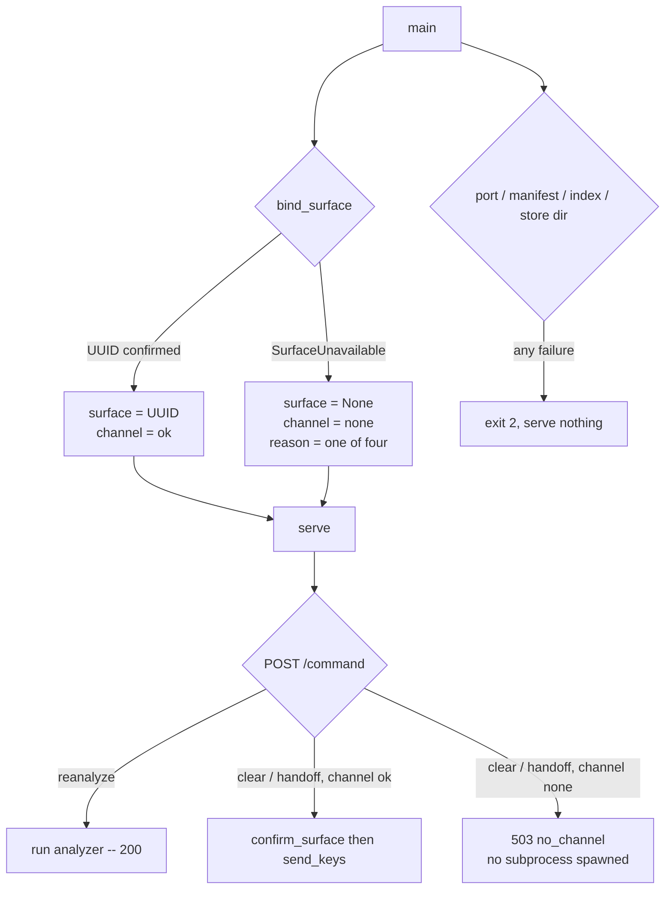

# Treko: serve a degraded, no-control-channel board instead of refusing to start

Planned 2026-08-23 on `main` @ `984e7ac`, after PR #68 (card `treko-store-location`) merged. The
work was **deferred from card 1** and the deferral is recorded in the tree itself: the test that
pins today's refusal says in its own docstring that §Deferred proposes changing it.

Model-switch checkpoint 1 (entering planning): the dispatching session fixed `model_tier: high`
for this card, and the planning was done there. **Checkpoint 2 (planning → implementation) has
not been asked** and must be asked before any branch is cut.

> **Gate status: `gate confirmed` given, transition deferred by the user's own direction.** The
> user gave the literal phrase and then directed that the compliance judge re-run first, so there
> is still no branch, no task 1 and no source edit; frontmatter stays `phase: planning` until a
> compliance `pass`. The spec-compliance gate (`running-the-compliance-judge`) **has** run against
> this card, repeatedly. **This banner is deliberately not a round count** — round 9's finding was
> this banner stating "has not run yet" against nine already-recorded verdicts, and round 11 found
> a *replacement* banner already stale by two rounds within the same commit that wrote it, because
> a number written into prose is wrong the moment the round after it runs. The count is never
> restated here again; it is read, not recorded:
> `python3 -c "import json; print(sum(1 for l in open('coding-memory/compliance-judge/verdicts.jsonl') if l.strip() and json.loads(l).get('spec_path')=='docs/features/treko-degraded-no-cmux.md'))"`
> against this repo's `coding-memory/compliance-judge/verdicts.jsonl` is the one source of truth
> for how many rounds have run and what each one found — see task 1a clause (c).

**This card almost certainly earns an ADR.** It converts a startup abort into a served page —
a direction-pivoting change to the trust boundary, which is exactly the class
`rules/gates.md` requires a decision record for. The number is **0038**, checked against
`origin/main` @ `2a0c45904f1f775a67e7bc2444e24f704f8ca544`, whose `docs/decisions/` tops out at
`0037-a-named-token-allowlist-not-every-mark-and-not-what-passes-today.md`; `0038` was
additionally confirmed absent from all 28 `refs/remotes/*` and `refs/heads/*` in this checkout,
each ref queried separately. Note that "the next free number" is ambiguous here
for the same reason card `treko-store-location` recorded: **`0026` is duplicated**
(`…symbolic-ref…` and `…the-gate-does-no-json-parsing…`) and **`0028` is unused**. 0038 is
max+1, matching the precedent 0034 set, not a gap-fill.

> **This number was 0036 until 2026-08-26 and had to be corrected.** `0036` and `0037` both
> landed on `main` in the 125 commits between this card's planning baseline (`984e7ac`) and
> `2a0c459`. The correction matters more than a renumber usually would: two ADRs sharing a
> number **merge cleanly** — different filenames, no conflict, no warning — so the collision
> would never have surfaced. Re-run `git ls-tree origin/main docs/decisions/` at the moment
> task 10 is written and use the number that check returns, not this one.

## Why

Treko cannot run outside cmux at all. `bind_surface()` is called unconditionally at
`server.py:728`, every failure inside it raises `StartupAbort`, and the handler at
`server.py:738-740` writes the reason to stderr and returns `2`. Nothing is served. The browser is
never opened. The user asked to see which cards are in flight and got an exit code.

That is the wrong trade. The *survey* — the board, the merge order, the blocked filter — is the
part of Treko that carries the stated value, and it needs no control channel at all. The control
channel drives two keystroke commands. Refusing to render the board because two buttons cannot
work withholds the feature to protect a garnish.

The page is already most of the way there. `Treko.dc.html:571` computes `hasChannel` from the
presence of the injected token and `:574` already falls back to copyable text without one; the
comment at `:509-511` calls that mode "a supported runtime mode, not a degradation". The
`file://` path exercises it every day. What is missing is the *server* half: over `http://` the
server never gets far enough to serve the page it already knows how to degrade.

## The user decision that settles the scope — 2026-08-23

**All abort conditions in `bind_surface` degrade, each surfacing its own distinct reason.** Not
just the unset case.

From the user's seat every one of them means the same thing — no control channel — so serving in
all of them is what makes Treko *always* show the board, which is the whole point. But the page
must state **which** condition fired, because "you are not in cmux" and "cmux is broken" are very
different fixes and a single "no channel" message would send the user looking in the wrong place.

> **Finding: there are four conditions, not three.** The dispatch brief for this card named
> three. `bind_surface` has a fourth: `server.py:231-232` raises on `OSError` from
> `subprocess.run` — the `cmux` binary is missing, not executable, or `CMUX_BIN` points at
> nothing. It is a distinct reason with a distinct fix and it is trivially testable, because the
> harness already injects `CMUX_BIN` (`server_harness.py:256`). The user's decision reads on its
> own terms — every condition that means "no control channel" degrades — so this card takes all
> **four**. Flagged rather than silently absorbed: if the user meant literally three and wanted
> the fourth to stay fatal, this is the line to correct.

## Scope

### In

- All four `bind_surface` conditions become **degraded launches**, not aborts, each carrying its
  own closed-enum reason token.
- A new module `treko/channel.py` holding `bind_surface`, a `SurfaceUnavailable` exception and the
  reason enum — because `server.py` is at **799 of an 800-line hard ceiling** (D6).
- `config["surface"] is None` as the explicit no-surface representation, and a banner that says so.
- A **server-side refusal** of `clear` and `handoff` in degraded mode: `503`, error code
  `no_channel`, reached before any `cmux` subprocess.
- `reanalyze` continues to work, authenticated by the same token.
- Page-side: a second injected meta, a per-verb live/copy split, and a `no_channel` outcome row.
- Flipping four existing tests that were written to be flipped, plus the two prose blocks that
  describe them.
- **ADR 0038**, and the degraded-launch table in `skills/treko/SKILL.md`.

### Out

- **A fourth command verb.** `server.py:67-68` states that the three-row allowlist *is* the
  authorization set and that a fourth row is a spec change plus a judge round. This card adds no
  verb; it changes which of the existing three are *routable*.
- **Deducing a surface, ever.** See §Security. This is not a scope call that could be revisited
  cheaply; it is the reason `bind_surface` exists in its current shape.
- **Any change to the token, the CSP, the host check, the origin check, the manifest, or the
  audit-line format.** Degraded mode is a narrower server, not a looser one.
- **Making genuinely fatal startup problems non-fatal.** An unreadable index, an unmapped
  extension, a busy port, a store directory that is a file — all still exit `2` and serve nothing.
- **The Configuration drawer and the Ledger's artifacts-path field** (deferred in
  `treko-store-location.md` §Deferred). Unrelated, and still blocked on a verb this card refuses
  to add.

## Background: the facts the design turns on

Each was measured in this worktree at `984e7ac` on 2026-08-23. Line numbers were re-derived, not
copied; §Corrections lists every one that had moved.

**1. There are four abort conditions, all inside `bind_surface` (`server.py:211-238`).**

```python
219:    surface = (env.get(SURFACE_ENV) or "").strip()
220:    if not surface:
221:        raise StartupAbort(
222:            "%s is unset or empty -- the server was detached or launched outside cmux, and "
223:            "a send with no target defaults to whatever surface it inherits" % SURFACE_ENV)
224:    try:
225:        probe = subprocess.run(
226:            [CMUX_BIN, "read-screen", "--surface", surface],
227:            capture_output=True, text=True, timeout=timeout,
228:        )
229:    except subprocess.TimeoutExpired:
230:        raise StartupAbort("`%s read-screen` exceeded %ds probing the surface" % (CMUX_BIN, timeout))
231:    except OSError as exc:
232:        raise StartupAbort("cannot run `%s`: %s" % (CMUX_BIN, exc.strerror))
233:    if probe.returncode != 0:
234:        raise StartupAbort(
235:            "`%s read-screen --surface %s` exited %d -- the control channel does not exist "
236:            "for this target (an agent-session surface is not a terminal)"
237:            % (CMUX_BIN, surface, probe.returncode))
```

`SURFACE_ENV = "CMUX_SURFACE_ID"` (`server.py:55`).

**2. The rationale at `server.py:214-216` is load-bearing and this card does not weaken it.**

> *The UUID is inherited, never deduced. A send targeted at a deduced surface was delivered to a
> different live Claude session at exit 0 during task 1's spike; the fix is to delete the
> inference, not to check it harder.*

**Degraded mode must not deduce a surface. It serves with no surface at all.**

**3. The send/local split already exists** (`server.py:67-76`), so "reanalyze still works" is a
routing condition, not a redesign — condensed below, the real `SEND_COMMANDS` spans `:69-74` with
its escaping comment intact:

```python
SEND_COMMANDS = {"clear": "/clear\\n", "handoff": "/handoff\\n"}
LOCAL_COMMANDS = ("reanalyze",)
ALLOWED_IDS = frozenset(SEND_COMMANDS) | frozenset(LOCAL_COMMANDS)
```

The dispatch tail is `server.py:579-581`: `if command_id in LOCAL_COMMANDS: return
self._run_local(command_id)` / `return self._run_send(command_id)`. `_run_local` (`:626-634`)
touches no surface — it calls `run_reanalyze(repo_root, store_path, analyze_secs)`. `_run_send`
(`:636-657`) is the only caller of `confirm_surface` (`:299`) and `send_keys` (`:321`), the two
functions that shell out to `cmux`.

**4. `503` does not exist in the response vocabulary today.** The statuses in use are 200, 204,
400, 403, 404, 405, 409, 413, 415, 500 and 502. `CONFIRM_REFUSAL_REASONS` (`server.py:296`) holds
only `confirm_failed` and `confirm_timeout`. `501` is explicitly excluded — `server.py:400-401`:
*"405 rather than the base class's 501, so an unusual verb is answered the same way as a wrong
one — the status table admits no 501."*

**5. The page maps by error *code*, never by status.** `trackerOutcomeForBody`
(`Treko.dc.html:456-466`) reads `body.error` and looks it up in `TRACKER_ERROR_OUTCOMES`
(`:428-435`), which has no `no_channel` row — so a `503` resolves to `'unexpected'` → "Unexpected
error." today. The lookup is `hasOwnProperty`-guarded (`:460`) and a code with no row is
**never rendered back** (`:462-465`), which `test_ui_commands.py:290` falsifies.

**6. The other places that assume a surface.** `build_config` (`server.py:694`) takes `surface` as
its first positional and stores it at `:697`; the banner at `:786-787` prints `surface=%s`; the
audit line carries `surface=` (`server_harness.py:240` parses it) and already emits `-` for every
non-send request via `_fail`'s default (`server.py:432`).

**7. `server.py` is 799 lines against an 800-line hard maximum** (`rules/core-conduct.md`), and
`test_server.py` is 774. Measured today. This is not a footnote — it dictates D6.

## Design



### D1 — `bind_surface` reports *why*, and the caller decides

`bind_surface` keeps its current behaviour of never deducing anything. What changes is the shape
of its failure: it raises **`SurfaceUnavailable`, a subclass of `StartupAbort`**, carrying a
machine-readable `reason` drawn from a closed set of four.

```yaml
class: Reason(enum.Enum)      # a plain Enum, not a str mixin -- see "Wire format", below
reasons:                      # the closed set; a fifth is a spec change
  surface_unset:    CMUX_SURFACE_ID is unset or empty
  probe_timeout:    `cmux read-screen` exceeded CMUX_TIMEOUT_SECS (5s)
  probe_failed:     `cmux read-screen` exited non-zero -- not a terminal
  cmux_unrunnable:  the cmux binary could not be run at all (OSError)
exception:
  class: SurfaceUnavailable(StartupAbort)
  carries: [reason (a Reason member -- always serialized via .value, never bare),
            message (the existing human string)]
  message: unchanged from today, verbatim -- it still goes to stderr
```

**Wire format — stated once, here, so every boundary below just uses it.** On this repo's pinned
interpreter (Python 3.9.6 — confirmed `hasattr(enum, "StrEnum") is False`; `enum.StrEnum` does not
exist before 3.11), the obvious ways to turn a `Reason` member into text do not agree with each
other, and the disagreement is not the same for a plain `Enum` and a `str`-mixin `Enum`. Measured
directly against this interpreter, not assumed:

```
form              plain Enum             str-mixin Enum
"%s" %            Reason.surface_unset   Reason.surface_unset   -- class-qualified either way
"{}".format()     Reason.surface_unset   surface_unset          -- diverges by mixin
f"{e}"            Reason.surface_unset   surface_unset          -- diverges by mixin
str()             Reason.surface_unset   Reason.surface_unset   -- class-qualified either way
.value            surface_unset          surface_unset          -- the only form both agree on
```

**`.value` is the mandated form, at every boundary — the second stderr line, `config["channel"]`,
and the `tracker-channel` meta's content — and `Reason` is declared as a plain `Enum`, not a `str`
mixin, so that requirement is enforced rather than merely correct.** A `str`-mixin enum would make
`f"{}"` and `.format()` *coincidentally* render the bare token today, which is worse than being
wrong: it is a correctness that depends on a declaration style nothing in this spec or its tests
asserts, and it breaks silently the day anyone changes that declaration. A plain `Enum` fails every
shortcut identically, so `.value` reads as required, not optional, to whoever implements this.

**`CHANNEL_OK` is the fifth token, and it is deliberately not a `Reason` member.**
`CHANNEL_OK = "ok"` is a plain module-level string constant in `channel.py`, sibling to `Reason`.
Success is not a failure reason, so it does not belong in the closed set of *why the channel is
unavailable* — putting it there would make `len(Reason)` describe something other than "how many
ways `bind_surface` can fail." Because both `CHANNEL_OK` and every `Reason` member's `.value` are
plain `str`, `channel` (D2) and `config["channel"]` (D4) are always a `str` — never sometimes a
bare string and sometimes an enum member depending on which branch ran.

**Subclassing rather than adding a flag is what keeps the change narrow.** `main()` wraps *only*
the `bind_surface()` call in a `except SurfaceUnavailable` — every other `StartupAbort` raised
anywhere in the existing `try` block (`server.py:720-737`) reaches the existing handler at `:738`
untouched, so criterion 9 holds by construction rather than by a list of conditions someone has to
remember to keep in sync.

**The human message is not changed and not truncated.** It still goes to stderr. Degraded mode
adds a channel, it does not remove the one that already reports the cause.

### D2 — Startup: one narrow `try`, and a banner that cannot be misread

```python
try:
    surface, channel = bind_surface(), CHANNEL_OK
except SurfaceUnavailable as exc:
    sys.stderr.write("server: %s\n" % exc)                       # unchanged text, same stream
    sys.stderr.write("server: degraded -- no control channel (%s)\n" % exc.reason.value)
    surface, channel = None, exc.reason.value                    # .value: see D1's wire format
```

| Condition | Today | After |
|---|---|---|
| `CMUX_SURFACE_ID` unset/empty | exit 2 | serves, `reason=surface_unset` |
| probe exceeded 5s | exit 2 | serves, `reason=probe_timeout` |
| probe exited non-zero | exit 2 | serves, `reason=probe_failed` |
| `cmux` unrunnable (`OSError`) | exit 2 | serves, `reason=cmux_unrunnable` |
| bad port / busy port | exit 2 | **exit 2, unchanged** |
| unmapped manifest extension | exit 2 | **exit 2, unchanged** |
| index unreadable / no `<head>` | exit 2 | **exit 2, unchanged** |
| store dir is a file / unwritable | exit 2 | **exit 2, unchanged** |
| corrupt legacy store | exit 2 | **exit 2, unchanged** |

**The banner names the state, not just the surface.** Today `server.py:786-787` prints
`surface=%s`. With no surface that would print `surface=None`, which reads like a bug rather than
a decision. It becomes:

```
server: http://127.0.0.1:8422/ surface=<uuid> idle=1800s poll=5s store=<dir>
server: http://127.0.0.1:8422/ surface=none reason=surface_unset idle=1800s poll=5s store=<dir>
```

`reason=` appears **only** in the degraded form. A launch with a channel is byte-identical to
today's banner, which is what lets the existing `test_autolaunch.py` / `test_server_lifetime.py`
serving assertions stay untouched.

`build_config` gains a `channel` parameter, appended after `store_dir`; the call at `server.py:734`
becomes `build_config(surface, token, repo_root, port, analyze_secs, store_dir, channel)`, and the
function stores it verbatim as `config["channel"]`. Because `channel` is already a bare `str` by
the time it reaches `build_config` — `CHANNEL_OK` or `exc.reason.value`, never the enum member
itself — no further conversion happens here or anywhere downstream; this is the point of D1
mandating `.value` at the source rather than leaving it to whichever boundary happens to render the
value last.

`config["surface"]` stores `None` on the same branch as always, which is unrelated to the channel
value above and untouched by it: `None` is the representation, not `""` and not `"-"`: an empty
string is what an *unset environment variable* looks like after `.strip()` (`server.py:219`), and
reusing it would make "no surface" and "a surface the user failed to set" indistinguishable inside
the process. The audit line keeps printing `-`, which is already its value for every non-send
request.

### D3 — `clear` and `handoff` are refused by the server, at `503 no_channel`

The guard goes at the **top of `_run_send`**, before `confirm_surface`:

```python
def _run_send(self, command_id):
    if self.config["surface"] is None:
        return self._fail(503, "no_channel", "no_channel", command_id=command_id)
    ...
```

Three properties, and each earns a test:

- It is checked against **`config["surface"] is None`**, the same value the rest of the code would
  use to send. A guard keyed off `config["channel"]` could disagree with the surface it is
  guarding; keyed off the surface itself it cannot.
- It precedes **every** `cmux` invocation, so a degraded server spawns no subprocess on this path
  at all. Asserted by the fake-cmux invocation log the harness already keeps (`cmux_log`), not by
  reading the code.
- It reuses `_fail`, so the body is `{"ok": false, "error": "no_channel"}` and **echoes no request
  content** (`server.py:425-429`), and the audit line records `reason=no_channel`.

**Why `503` and not one of the statuses already in use.**

| Candidate | Why not |
|---|---|
| `403 forbidden` | Collapses with `bad_token`/`host_mismatch`, which the page maps to `stale_token` → *"reload to reconnect"*. Reloading cannot help; it sends the user into a loop. |
| `409 unresolved_surface` | The page renders *"The session this page controls has ended."* The session did not end — there never was one. A false statement about state is the failure `rules/core-conduct.md` names. |
| `501` | `server.py:400-401` states the status table admits no 501. Adding one contradicts a documented decision for no gain. |
| `502 send_failed` | Means "we tried and could not confirm". Nothing was tried. |
| **`503`** | Unused today, and semantically exact: the capability is absent from **this server**, for its whole lifetime. |

### D4 — The central design problem: how the page learns the channel state

**`!!cmdToken` stops being the right discriminator.** A degraded page still needs a token, because
`reanalyze` is local and stays live — so `cmdToken` is truthy while `clear` and `handoff` are not
routable. The page needs a second, independent signal.

**Chosen: a second injected meta, carrying a closed-enum token.**

```html
<meta name="tracker-token"   content="<per-launch secret>">
<meta name="tracker-channel" content="ok | surface_unset | probe_timeout | probe_failed | cmux_unrunnable">
```

Injected by `_serve_index` at `server.py:495`, the same one-line `<head>` replacement that
already carries the token, so `check_index_injectable` (`server.py:196-208`) already guards its
precondition and no new startup check is needed.

**The `config["channel"]` → meta-content mapping, stated explicitly because nothing else states
it.** `_serve_index` appends a second `<meta>` line to the same `<head>` replacement that already
injects the token (`server.py:495`), using the identical `%s`-interpolation idiom:
`'<meta name="tracker-channel" content="%s">' % self.config["channel"]`. No conversion happens at
this boundary, because none is needed — `config["channel"]` already holds the bare token by
construction (D1's `.value` rule, applied at D2), so the meta's `content` is byte-identical to it.
The closure this buys is the one §Security calls the entire risk of this card: `CHANNEL_OK` and the
four `Reason` values are the *only* five strings that can ever reach `.channel`, so the four human
messages that interpolate `CMUX_BIN`, `exc.strerror`, `probe.returncode` and the surface UUID have
no path to this attribute — not "are filtered out of it", but structurally cannot reach it, because
nothing on the way from `bind_surface`'s `raise` to this `%s` ever reads those messages.

**One meta, not two.** An earlier shape used `content="ok|none"` plus a separate reason meta. Two
metas admit a state that means nothing — `channel=ok` with a reason, or `channel=none` without one
— and the page would need a rule for it. One attribute over a five-member closed set has no
unrepresentable-state problem to solve.

**The content is an enum token, never the server's message. This is a security requirement, not a
style choice.** The human strings at `server.py:222-223`, `:230`, `:232` and `:235-237` interpolate
`CMUX_BIN` (read from the environment at `server.py:54`), `exc.strerror`, `probe.returncode` and
the surface UUID (also from the environment). Writing any of them into an HTML attribute is an
injection gadget on an environment-controlled path. The closed enum makes that structurally
impossible, and it is the *same* discipline the page already applies to error codes — fixed
strings mapped page-side, the server's bytes never rendered (`Treko.dc.html:462-465`, falsified by
`test_ui_commands.py:290`). The page **must** treat an unrecognised `tracker-channel` value the
way it treats an unrecognised error code: fall to a fixed generic string, render nothing from the
attribute.

**Alternatives considered and rejected.**

| Alternative | Why not |
|---|---|
| **A capability field on the run payload** (`tracker-data.js`) | The envelope schema is owned externally (ADR 0023) and is written by `analyze.py`, which knows nothing about cmux. Worse, the store is a *file* that outlives the process: it would report the channel state of whichever launch last wrote it. A cached answer to a per-launch question. |
| **A `GET /channel` endpoint** | Adds a route to a deliberately closed surface, and makes the page's first render depend on a round-trip that can fail — a new state to design for, to answer a question the page could have been told at load. |
| **Injecting the live id set** (`<meta name="tracker-commands" content="reanalyze">`) | Genuinely attractive: it makes the button set a projection of the server's authorization set instead of a rule the page re-derives. Rejected on two counts. It gives the page *what* but not *why*, so the reason meta comes back and we are at two metas again. And it requires the page to parse a list and intersect it against `TRACKER_COMMAND_IDS` — new boundary-validation code inside the node-loadable slice, to express a two-way split the page can hold as a constant. Worth revisiting only if a fourth verb ever exists, which §Out forbids. |

**`componentDidMount` (`state` at `:506`, the method itself at `:507`) must read the new meta too,
and this is where the implement-list below most needs correcting, not just here.** Today it reads
exactly one meta, at `:512-513`:

```js
const meta=document.querySelector('meta[name="tracker-token"]');
if(meta&&meta.content)this.setState({cmdToken:meta.content});
```

It gains a second, parallel read for `tracker-channel`:

```js
const chMeta=document.querySelector('meta[name="tracker-channel"]');
if(chMeta&&chMeta.content)this.setState({cmdChannel:chMeta.content});
```

and `state` (`:506`) gains the field it initialises: `cmdChannel:null` next to the existing
`cmdToken:null,cmdView:null`. **Without both of these, `S.cmdChannel` is `undefined` forever,
`channelOk` (below) is always `false`, and a perfectly healthy server renders as degraded** —
Re-analyze live, `/clear` and `/handoff` demoted to copy chips, criterion 10 broken on the one path
this card is not supposed to touch at all, with every test in task 8 passing, because none of them
launch a healthy server and check what the *button* set looks like. Confirmed against the running
text of this file as of `2a0c459`: `state` (`:506`) declares `cmdToken` and `cmdView` and nothing
else, and `componentDidMount`'s only `querySelector` (`:512`) is the token's. Task 9's
implement-list is corrected below to name `componentDidMount` explicitly, because it is the item
in this card most likely to be implemented by analogy — get the token read right, assume the
channel read is the same shape, and skip actually adding it.

**The page-side split, and the one rule that generalises it.** `commandProps`
(`Treko.dc.html:566-585`) is rewritten around three values instead of one — but the
value-*selection* does not live in `commandProps`. It moves **inside** the node-loadable fence
(`:399-492`), as a new pure function, so it gets a real automated check rather than a promise:

```js
// inside the fence, beside TRACKER_COMMAND_IDS -- pure, no S, no document, no window
var TRACKER_LOCAL_IDS = ['reanalyze'];
var TRACKER_SEND_IDS  = ['clear', 'handoff'];
function trackerLiveIds(hasToken, channelOk) {
  return !hasToken ? [] : (channelOk ? TRACKER_COMMAND_IDS : TRACKER_LOCAL_IDS);
}
```

```js
// commandProps, still outside the fence -- now a caller, not the owner of the rule
const hasToken = !!S.cmdToken;                    // was: hasChannel
const channelOk = S.cmdChannel === 'ok';
const liveIds = trackerLiveIds(hasToken, channelOk);
```

`trackerLiveIds` takes two booleans and returns one of the two constants above, or `[]` — nothing
else, which is what "dependency-free" (`:400-406`) requires of anything added to the fence. It is
also where this card's anti-injection guarantee actually lives on the button axis: `channelOk` is
a strict `=== 'ok'` comparison, so *every* value the meta could ever carry other than the literal
string `'ok'` — all four real reasons, and, if D1/D4's closure were ever broken by a later edit,
anything else — resolves to the same safe, local-only id set. The function does not need to know
the five-token closed set to be safe; it only needs to recognise the one string it treats as
privileged, which is exactly why it is small enough to be both pure and completely tested
(task 8).

and then **one rule replaces the current two**:

> A command is offered as a **button** when it is in `liveIds` and the current view still offers
> buttons. Every command that has no button is offered as a **copy chip**.

That rule reproduces all three existing modes exactly, which is why it is worth preferring to a
new branch:

| Mode | `liveIds` | Buttons | Copy chips | Reason text (D5) |
|---|---|---|---|---|
| `file://` — no token | `[]` | none | all three (today's behaviour) | none — `hasToken` is `false` |
| served, channel ok, idle | all three | all three | none (today's behaviour) | none — no chips to show it beside |
| served, channel ok, terminal outcome | all three | none (`offersButton` false) | all three (today's behaviour) | none — `channelOk` is `true` |
| **served, degraded** | `['reanalyze']` | Re-analyze | `/clear`, `/handoff` | **`trackerChannelReason(S.cmdChannel)`** |

The last column is stated precisely, once, in D5 — this table only summarises it. Three of the
four chip-rendering rows above render no reason text at all; only the fourth does.

**`module.exports` (`:487-491`) grows to expose the new functions and the two constants above:**

```js
if(typeof module!=='undefined'&&module.exports){
  module.exports={IDS:TRACKER_COMMAND_IDS,COPY_TEXT:TRACKER_COPY_TEXT,
                  MESSAGES:TRACKER_MESSAGES,idleView:trackerIdleView,
                  applyCommand:trackerApplyCommand,
                  LOCAL_IDS:TRACKER_LOCAL_IDS,SEND_IDS:TRACKER_SEND_IDS,
                  liveIds:trackerLiveIds,
                  channelReason:trackerChannelReason,
                  CHANNEL_REASONS:TRACKER_CHANNEL_REASONS};
}
```

**`CHANNEL_REASONS` exports the table itself, not only the lookup function, and that is
load-bearing.** Added 2026-08-26. Task 8's two-sided check has to compare *key sets*. With only
`channelReason` exported, the strongest available test is "call it once per `Reason` member and
see that each returns a mapped string" — which catches a **renamed** member and is blind to an
**extra** key on the page side, the exact one-sided blindness the send/local partition check was
written to avoid. Exporting the table makes the set comparison possible.

`test_ui_commands.py`'s `NODE_BRIDGE` must grow to match: its `process.stdout.write` payload
currently emits `before`, `after`, `messages`, `ids`, `copyText` and nothing else
(`test_ui_commands.py:114-120`), so `localIds`, `sendIds` and `channelReasons` are added there
alongside them. Without that the constants are exported into a bridge that never forwards them,
and both set-equality assertions in task 8 are unimplementable as written.
`TRACKER_LOCAL_IDS` / `TRACKER_SEND_IDS` are the page's mirror of `server.py`'s `LOCAL_COMMANDS` /
`SEND_COMMANDS` — a duplication — and D7 already commits to a test that reads both sides rather
than trusting either; exporting them from the node bridge is what makes that test possible without
a third, hand-written copy of the partition living in the test file itself.

**The fence grows by a few lines, and that is a deliberate cost of this design, not an
oversight, but the budget it spends is far smaller than this card originally costed.**
At this card's planning baseline (`984e7ac`) `Treko.dc.html` was **639 lines** with the fence at
`:325-418`, leaving **161 lines** of headroom under criterion 14's 800-line ceiling. That baseline
is gone: as of `2a0c459` the file is **740 lines** and the fence is at `:399-492`, so the real
headroom is **60 lines**, not 161. The design is still affordable — the constants D5 adds are a
handful of lines — but it is no longer comfortably so, and task 12's re-measurement is now a
genuine gate rather than a formality. Both numbers move again once `trackerLiveIds`,
`TRACKER_CHANNEL_REASONS` and `trackerChannelReason` land inside the marker pair (D5). `wc -l`
under 800 still has to hold (criterion 14;
task 12 re-measures it), and this document's own citations to `:399-492` must be re-derived after
implementation rather than assumed unchanged — the same discipline §Corrections already applies to
every other line number in this document. Nothing about the *test* needs updating for this:
`test_the_handler_slice_is_fenced_exactly_once_and_loads_standalone` re-derives the fence's
boundaries from the marker text at run time (`test_ui_commands.py:68-78`), never from a stored byte
count, so a longer fence is not a broken assumption anywhere except in this spec's own prose.

`runCommand`'s guard (`Treko.dc.html:588`) becomes `if(!S.cmdToken || liveIds.indexOf(id)<0)
return;` — the same belt-and-braces the existing comment at `:590-591` explains, extended to the
new axis. It is **presentation only**: the authorization control is D3's server-side refusal.

### D5 — `no_channel` is a page outcome, and it is deliberately **not** terminal

> **The reason-line element carries no `id` attribute.** Settled here 2026-08-26 because it is
> asserted elsewhere and was previously unstated: `test_drawer.py:571`
> (`test_criterion14_the_page_has_exactly_seven_ids_all_sec_anchors`) pins the page's `id="…"`
> count at exactly **7**, all `sec-*` scroll anchors, over the very file this decision edits.
> Nothing in D5 needs an `id` — the reason text is rendered from state, reached by React, and
> never by `getElementById`. Giving it one would turn a green structural guard red for no gain.
> If a later change genuinely needs one, that change owns updating the count and its rationale.

Three page-side additions:

```js
TRACKER_MESSAGES.no_channel  = 'No control channel — /clear and /handoff cannot be sent from here. Copy them instead.'
TRACKER_ERROR_OUTCOMES.no_channel = 'no_channel'      // keyed by the server's error code
CMD_TONES.no_channel = 'var(--warn)'                  // presentation, outside the slice
```

plus, **inside the marker-fenced region** (`:399-492`, beside `trackerLiveIds` — D4), the four-row
map from the meta's enum token to the standing explanation shown beside the copy chips, and the
pure function that selects from it:

```js
// inside the fence, beside trackerLiveIds -- pure, no S, no document, no window
var TRACKER_CHANNEL_REASONS = {
  surface_unset:   'Launched outside cmux, so there is no session to type into.',
  probe_timeout:   'cmux did not answer within 5s — the control channel may be wedged.',
  probe_failed:    'This surface is not a terminal; an agent-session surface has no control channel.',
  cmux_unrunnable: 'cmux could not be run on this host.'
};
var TRACKER_CHANNEL_REASON_FALLBACK = 'No control channel.';
function trackerChannelReason(token) {
  return TRACKER_CHANNEL_REASONS.hasOwnProperty(token) ? TRACKER_CHANNEL_REASONS[token]
                                                        : TRACKER_CHANNEL_REASON_FALLBACK;
}
```

| token | shown |
|---|---|
| `surface_unset` | Launched outside cmux, so there is no session to type into. |
| `probe_timeout` | cmux did not answer within 5s — the control channel may be wedged. |
| `probe_failed` | This surface is not a terminal; an agent-session surface has no control channel. |
| `cmux_unrunnable` | cmux could not be run on this host. |
| *(unrecognised)* | `trackerChannelReason` falls to the fixed string above — `No control channel.` |

**The render condition, stated once, so the table above is read exactly one way.** The lookup —
and the whole reason-text block — is gated on `hasToken && !channelOk`, the same two booleans D4
already computes in `commandProps` (`hasToken = !!S.cmdToken`, `channelOk = S.cmdChannel === 'ok'`):
a token must exist (the page was served, not opened `file://`) **and** the channel must not be
`ok` (the launch is degraded). This is narrower than "copy chips are rendered" — D4's own mode
table lists three chip-rendering modes, and the gate is `true` in exactly one of them:

- `file://` — no token — `hasToken` is `false` (there is no `<meta name="tracker-token">` at all,
  because the page was never served, so `_serve_index` never ran), so the gate is `false`
  regardless of `channelOk`. No reason text. This is the mode `Treko.dc.html:509-511` calls "a
  supported runtime mode, not a degradation" — the gate must never fire here.
- served, channel ok, terminal outcome — `hasToken` is `true` but `channelOk` is also `true`
  (`S.cmdChannel === 'ok'`), so the gate is `false`. Copy chips render, for D5's pre-existing
  terminality rule below, which has nothing to do with the channel — but no reason text joins
  them.
- served, degraded — `hasToken` is `true` and `channelOk` is `false` (`S.cmdChannel` holds one of
  the four reason tokens), so the gate is `true`. This is the only mode the table above is ever
  read for.

`trackerChannelReason(S.cmdChannel)` is called only when the gate is `true`; its unrecognised-token
fallback is folded into the same pure function (task 8), not a second call site. When the gate is
`false`, nothing beside the copy chips is rendered at all: not the fallback string, not an empty
string standing in for it, nothing.

**`TRACKER_CHANNEL_REASONS` now lives inside the fence, next to `trackerLiveIds()` — this reverses
this card's own earlier scope decision, and the reasoning for reversing it matters more than the
change itself.** The decision to keep it outside (recorded in this section, reviewed and left
uncited in round 3 of this card's compliance review) was reasonable when it was made: the one
function this card had added to the fence was `trackerLiveIds()`, for the button axis, and moving
a second table in to chase a second automated check looked like scope growth for its own sake. The
cost was stated plainly there, not discovered later: the "unrecognised token falls to the page's
fixed string, and its bytes are absent from the returned string" half of criterion 7 would be
"verified by task 13's real browser launch." Round 4 priced that cost precisely, and it turned out
to be unpayable: a real server can only ever emit one of the five legal tokens (D1's closed enum),
so no launch task 13 runs can ever *produce* an unrecognised one — the browser receipt the earlier
revision promised cannot exist, on any implementation, no matter how carefully task 13 is written.
A claimed verification path that cannot be exercised is worse than an admitted gap, so the boundary
moves: `trackerChannelReason(token)` (above) is a pure, dependency-free function inside the fence,
and task 8 drives it directly with a token outside the five-member set — a real red-then-green
test, not a promise. `test_ui_commands.py` no longer stops short of this half of criterion 7; only
the DOM-level question of whether the mapped or fallback *string* actually reaches the rendered
page without the raw attribute leaking elsewhere in the markup stays task 13's, because that is a
question about React's render output, not about the lookup.

**The render wire, named explicitly — round 11 finding, not settled anywhere before this.**
`commandProps` gains two new fields, following the exact precedent `cmdMsg`/`cmdMsgC` already set
for the command-status text beside it (`Treko.dc.html:576`, consumed at `:112`):

```js
// inside commandProps' returned object, alongside cmdMsg/cmdMsgC/cmdButtons/cmdCopies
cmdReason: (hasToken && !channelOk) ? trackerChannelReason(S.cmdChannel) : '',
cmdReasonC: 'var(--warn)',
```

`cmdReasonC` is a fixed tone, not a lookup: D5 has exactly one reason state (degraded), not a
palette per token, so there is nothing for a second constants table to select between.
`CMD_TONES.no_channel` (§"Three page-side additions", above) lives at `Treko.dc.html:500` —
**outside** the fence (`:399-492`), same as `cmdReasonC` — and the two are independent constants
for different things: `CMD_TONES` keys the *command-status* color (`cmdMsgC`) by outcome,
`cmdReasonC` is a single fixed color for the reason line, never keyed at all.

**Round 12 correction (observability round 8's finding, measured, not argued):** the first
revision of this section said `cmdReason` renders "unconditionally with no `sc-if`" because an
empty string "renders nothing" — that is wrong for a flexbox row. `#dc-root`'s command cluster
uses `gap:14px` between children; an empty `<div>` is still a flex item and still consumes a gap
slot. Measured in headless Chrome: the healthy/idle header's existing gap is `28.00px`; an
unconditionally-rendered empty `cmdReason` div widens it to `42.00px` — on the exact path
criterion 10 calls "byte-identical to today." **The element is instead gated with `sc-if`**, the
same mechanism this file already uses 17 times elsewhere (`Treko.dc.html:44,47,56,58,…`), so a
`false` gate emits **no node at all** — consistent with the render-condition paragraph above
("not an empty string standing in for it, nothing"):

```html
<div style="flex:none;font-size:11.5px;line-height:1.35;max-width:300px;text-align:right;color:{{ cmdMsgC }}">{{ cmdMsg }}</div>
<sc-if value="{{ cmdReason }}">
  <div style="flex:none;font-size:11.5px;line-height:1.35;max-width:220px;text-align:right;color:{{ cmdReasonC }}">{{ cmdReason }}</div>
</sc-if>
<sc-for list="{{ cmdButtons }}" as="c">
```

No `id`, matching task 1a's floor row on `test_drawer.py:571`'s exact-7 count — the element is
reached by React state, never `getElementById`, so it needs none. `value="{{ cmdReason }}"` takes
a plain name, matching this file's other 17 `sc-if` usages (`Treko.dc.html:44,47,56,58,…`) rather
than an explicit `!!`, since the engine's own truthiness test already does that work; no
`hint-placeholder-val` either — that attribute is only consulted when the value resolves
`undefined`, which a boolean/string coercion never does, so on the other 17 usages it does real
work and on this one it would have been inert. Criterion 7 and task 13's "the reason line matches
the table" receipt (§Verification) now name what they check: this element's rendered text, read
from `#dc-root`'s mounted subtree. **No flex item is emitted when the gate is `false`, so the
healthy-board header's geometry is unchanged** — stated this way, not as "byte-identical", because
observability round 9 measured that every `data-dc-tpl` index after the insertion point shifts by
2; nothing reads those indices today, but the claim is scoped to what was actually verified.

**`no_channel` must not go into `TRACKER_TERMINAL_OUTCOMES`, and the reasoning matters more than
the answer.** The dispatch brief suggested it should, on the ground that a 503 from a channel-less
server is permanent for that process's lifetime. That is true, and it is still the wrong row,
because `trackerViewFor` (`Treko.dc.html:444-455`) applies terminality **globally**:

```js
var terminal=TRACKER_TERMINAL_OUTCOMES[outcome]===true;
...
offersButton:!terminal,
offersCopyText:terminal,
```

`offersButton:false` empties `cmdButtons` for *every* id (`:577`). So marking `no_channel`
terminal would withdraw the **Re-analyze** button — in the exact mode where re-analyze is the one
thing that still works. The card would defeat its own purpose on any stray 503.

Terminality is a property of the *whole channel*, and it is already correct for the two rows that
hold it: `session_ended` and `server_gone` both mean nothing further can be done at all. Degraded
mode is per-verb, and D4 handles it per-verb, which is the right axis. Making `offersButton`
itself per-verb was the alternative; it is a larger change to the slice, to the node bridge's
output shape (`test_ui_commands.py:114-120`) and to `assert_row`'s contract (`:150-170`), for no
behaviour D4 does not already give. Rejected on KISS.

### D6 — Where the new code lives: `treko/channel.py`, and a new test module

**`treko/server.py` is 799 lines against an 800-line hard maximum.** Measured 2026-08-23 at
`984e7ac`. There is one line of headroom, and this card adds a guard in `_run_send`, a branch in
`main()`, a key in `build_config`, a meta in `_serve_index` and a banner variant. It does not fit.

So `bind_surface`, `SurfaceUnavailable`, the `Reason` enum and `CHANNEL_OK` move to
**`treko/channel.py`**, which is a *net removal* from `server.py`: lines 211-238 leave, an import
arrives. It is the same shape D5 of `treko-store-location.md` used for `store_location.py`, and for
the same reason.

**`CMUX_BIN` and `CMUX_TIMEOUT_SECS` move with it, and `channel.py` is their single owner.**
Added 2026-08-26. Both are declared at `server.py:53-54` and read by **three** functions, not one:
`bind_surface` (`:226`, `:230`, `:232`, `:237`) which leaves, and `confirm_surface` (`:299`) and
`send_keys` (`:321`) which stay. So the split cannot simply carry them along — if `channel.py`
re-declares its own copy, the health probe and the send can resolve `CMUX_BIN` to two different
binaries, and nothing in the suite would say so, because each module would be internally
consistent.

**`SURFACE_ENV` moves too — found round 11, and it is not a duplication risk, it is a crash.**
`SURFACE_ENV = "CMUX_SURFACE_ID"` (`server.py:55`) is read once, at `:219`, inside `bind_surface`
itself. `bind_surface` is the function this decision moves to `channel.py`; if `SURFACE_ENV` is
left behind, `channel.py`'s copy of `bind_surface` raises `NameError` on its very first call. Not
a silent narrowing like the two constants above — a hard failure task 2's red tests would catch
immediately, but only if task 2 runs before someone notices the module doesn't import at all.

`channel.py` therefore declares both and `server.py` imports them, exactly as `server.py:37`
already imports `StartupAbort` from `store_location.py` for the same "two modules, one definition"
reason. `server_harness.py:256` injects `CMUX_BIN` into the environment and is unaffected — it sets
the variable the declaration reads, not the declaration.

`channel.py` imports `StartupAbort` from `store_location` (where card `treko-store-location`
already moved it — `server.py:37`), so nothing is duplicated and the existing handler at
`server.py:738` still catches the base class.

**New server-side tests need a new module: `treko/test_degraded.py`.** `test_server.py` is 774
lines and this card's server-side surface — four launch conditions × (serves, banner, config) plus
the 503 path, plus a watchdog/idle-bound check on a degraded launch (criterion 17) — is not a
handful of cases. `test_server_lifetime.py` (270 lines) receives the *flips*, not the new coverage:
its subject is aborts, and these stop being aborts.

**Budget check is a task, not an assumption.** Task 12 runs `wc -l` on every file this card
touches and the result goes in §Verification. If `server.py` comes back at 800 or more, the answer
is to move more logic into `channel.py` — **never** to delete comments, which in this file carry
the reasoning behind its security decisions.

### D7 — What the existing tests become

Four tests were written to be flipped. Two prose blocks describe them and go stale silently.

**`test_autolaunch.py:355`**, whose docstring names this card:

> *Pre-existing behaviour, asserted rather than assumed.*
>
> *§Deferred proposes changing this to a degraded no-control-channel page. Pinning it now means
> that change flips a test rather than filling a gap.*

Its three assertions — `run.wait() == EXIT_ABORT`, `"CMUX_SURFACE_ID" in run.stderr`,
`browser_log.opens == []` — invert to: the server serves, stderr still names `CMUX_SURFACE_ID`
(that assertion **survives**, because D1 keeps the message), and `--open` **does** open a browser.
Rename it to say what it now pins.

**`test_server_lifetime.py` loses all three of its surface aborts, not two.** The brief named
`test_an_unset_surface_id_aborts_before_serving` (`:61`) and
`test_a_failing_read_screen_probe_aborts_before_serving` (`:68`). There is a third:
`test_a_hanging_read_screen_probe_aborts_before_serving` (`:73`). All three call `assert_aborted`
(`:47-53`), whose final clause —

```python
assert harness.refuses_connection(srv.port), "aborted server served anyway"
```

— is precisely what degraded mode inverts. They move to `test_degraded.py` as serving assertions.
`assert_aborted` itself **stays exactly as it is**: it is still correct for the **three**
configuration aborts that remain in that file — `test_a_manifest_row_with_an_unmapped_extension_aborts_before_serving`
(`test_server_lifetime.py:84`), `test_an_index_with_no_head_aborts_before_serving` (`:100`) and
`test_a_disabled_timeout_is_refused_at_startup` (`:109`) — and criterion 9 depends on it staying
strict. **Corrected 2026-08-26: this said "five".** Counted from the file, `assert_aborted` has six
call sites (`:65`, `:70`, `:76`, `:97`, `:106`, `:112`); three of those belong to the surface tests
being flipped, leaving three. The remaining abort test in the module,
`test_a_second_server_on_the_same_port_aborts_and_leaves_the_first_intact` (`:120`), never calls
`assert_aborted` at all, so no reading of the file yields five.

Two prose blocks become false the moment those three tests move, and neither is asserted by
anything:

- the module docstring's inventory at `test_server_lifetime.py:14` — *"the three surface-binding
  startup aborts"*;
- the section header at `:56-58` — *"the three surface-binding aborts"*.

The docstring's blanket claim at `:19-21` — *"Every abort is asserted the same three ways: exit
non-zero, name its cause, and serve **nothing**"* — stays true of what remains, and must be
re-read after the move rather than assumed.

**`test_ui_commands.py` gains a row and must really drive it.** `ROW_OUTCOMES` (`:41-50`) is a
completeness contract enforced by `test_zz_every_table_row_was_driven_by_a_real_response`
(`:322-330`), which asserts `ROW_OUTCOMES - OBSERVED_OUTCOMES == []`. Adding `no_channel` to the
set without a real degraded server driving it fails that test — correctly. So the new row is
driven against a server launched with no surface, in the same spirit as
`test_a_stopped_server_is_a_terminal_state_with_the_copyable_text` (`:258`), which stops a real
server rather than mocking a rejection.

**And the drift guard gets a second half.** `test_ui_commands.py:190` asserts
`result["ids"] == ["clear","handoff","reanalyze"]` — *"the allowlist drifted"*. D4 adds
`TRACKER_LOCAL_IDS` / `TRACKER_SEND_IDS`, a page-side mirror of a `server.py` constant, which is a
new drift surface. It gets a test that reads **both** sides — `server.SEND_COMMANDS` and
`server.LOCAL_COMMANDS` imported in Python, the slice's partition read out of the node bridge —
and asserts they are the same partition. A hand-written expected list would pin the copy, not the
agreement.

#### The six modules that did not exist when this card was planned

Added 2026-08-26. `test_guards.py`, `test_nontext_contrast.py`, `test_drawer_sections.py`,
`test_theme.py`, `test_sidebar.py` and `test_drawer.py` — 89 tests — arrived in the 125 commits
between `984e7ac` and `2a0c459`. **All six read `Treko.dc.html`**, the file D4/D5 edit. Everything
above this heading was written against a 221-test suite that did not contain them.

Five of the six assert mostly on presentation — theme tokens, contrast ratios, drawer and sidebar
structure — and this card adds no styling. **That is not the same as "they stay green", and an
earlier revision of this paragraph wrongly said so.** Corrected 2026-08-26: at least one of them
asserts *structure*, not style — `test_drawer.py:571` pins the page's `id="…"` count at exactly 7,
over the very file D4/D5 edit. A reassurance is worse than silence here, because it tells the
implementer not to look. Task 1a enumerates these properly; task 12's node-ID set diff is the
backstop, not the proof.

**`test_guards.py` is the exception, and it fails by construction.** Two of its assertions pin the
fenced region by cryptographic digest:

```python
BASE_COMMIT = "a5a66a75204f334fff09462e931981431b39081a"
BASE_FENCE_BYTES = 4851
BASE_FENCE_SHA256 = "f0a37389f08f31dfdf18a0a1676657919a01272746d5ab28dbd65a53dae7c136"

def test_criterion15_fence_region_byte_identical_to_base_commit():
```

`test_criterion15_fence_region_byte_identical_to_base_commit` (`test_guards.py:193`) and its
sibling `test_criterion15_node_bridge_span_also_matches_base_commit_secondary` (`:208`) both
assert the fence is **byte-identical** to its form at `a5a66a7`. D5 deliberately places
`trackerLiveIds`, `TRACKER_CHANNEL_REASONS` and `trackerChannelReason` **inside the marker pair**.
The moment task 9 lands, both digests differ and both tests go red.

That is the guard working, not breaking: it exists to catch fence drift nobody intended, and this
card intends it. The resolution is to **re-baseline the pins, never to weaken or skip the tests** —
task 9a below. Two constraints on how:

- The new digest must be measured **from the implemented file**, after task 9 is green, and
  committed **separately** from the implementation itself. A digest computed in the same edit that
  changes the bytes proves only that the edit is self-consistent.
- `BASE_COMMIT` moves to the commit that lands task 9. Leaving it at `a5a66a7` while changing the
  digests would make the constant lie about what the digests describe.

**A third sealed door: `test_server.py` scrapes `server.py`'s source for refusal reasons.**
Added 2026-08-26, after a third consecutive review round turned up a currently-green test this
card invalidates with no task owning it. `reasons_emitted_in_source()` (`test_server.py:741-753`)
reads every reason `server.py` can emit — string literals in `_fail(...)`, literals in
`audit(...)`, and the computed `CONFIRM_REFUSAL_REASONS` values — and
`test_the_enum_and_the_status_table_cover_each_other` (`:756`) asserts that set equals
`REASON_STATUS`'s keys, **and** that `REASON_STATUS`'s values equal `CONTRACT_STATUSES`.

D3 adds `no_channel` at `503`. Measured: the scrape returns 16 reasons today and 17 with D3's
guard in place, against a 16-key table; and `CONTRACT_STATUSES` (`test_server.py:77`) is
`{400, 403, 404, 405, 409, 413, 415, 500, 502}` — no `503`. Both assertions go red.

Three repairs, all in `test_server.py`, owned by **task 7a**:

1. `REASON_STATUS` (`:56-73`) gains `"no_channel": 503`.
2. `CONTRACT_STATUSES` (`:77`) gains `503`.
3. `test_zz_every_reason_value_was_driven_by_a_real_request` (`:766`) compares against
   `OBSERVED_REASONS` (`:81`), a set filled in **by that module's own tests**. So the
   `no_channel` refusal must be driven from inside `test_server.py`, not only from
   `test_degraded.py`.

Point 3 is a genuine tension with D6, which routes degraded tests to a new module precisely to
keep `test_server.py` under its line ceiling. **The tension is resolved in favour of the guard:**
one `no_channel` request driven from `test_server.py` is the price of keeping a
coverage-from-what-actually-ran assertion honest, and a `zz` gate satisfied from another module's
observations is not satisfied at all. Task 7a adds that single request there; every other degraded
test still lives in `test_degraded.py`.

⚠️ **Naming trap.** `test_guards.py`'s "criterion 15" is the fence-identity criterion of a
*different* card. **This** card's criterion 15 is the `skills/treko/SKILL.md` table split (task 11).
Same number, unrelated meaning — do not conflate them when reading either file.

**A second sealed door: criterion 16's render-site guards also fail by construction.**
Corrected 2026-08-26 — an earlier revision of this section claimed they would stay green, which is
wrong. `test_guards.py` carries `test_criterion16_command_ids_unchanged` (`:320`) and
`test_criterion16_cmdButtons_and_cmdCopies_map_the_same_three_ids` (`:329`). The first checks the
id *array* and is genuinely safe — this card re-partitions which ids are live (`trackerLiveIds`),
it does not add or rename one. The second does not check behaviour at all. It pins the **literal
source text** of the function D4 rewrites:

```python
CMD_BUTTONS_RE = re.compile(r"cmdButtons:\(hasChannel&&view\.offersButton\)\?TRACKER_COMMAND_IDS\.map\(")
CMD_COPIES_RE  = re.compile(r"cmdCopies:showCopies\?TRACKER_COMMAND_IDS\.map\(")
```

Measured, not reasoned: `CMD_BUTTONS_RE` matches the working tree exactly once today, and matches
**zero** times after D4's `hasChannel` → `hasToken` rename is applied. The rename alone breaks it,
before `liveIds` is even threaded through. Task 9b owns the repair.

The repair must not be "loosen the regex until it passes." Nothing guards that: criterion 16's own
falsifier (`test_criterion16_falsifiers_are_caught`, `:369`) mutates a *different* function, so a
weakened `CMD_BUTTONS_RE` would still show a green falsifier row. The regex must be re-pinned to
the new literal text, and the falsifier extended to prove the new pin can fail.

## Security

This card **widens what the server does when it cannot verify its control channel**: it binds a
port and serves in a state it previously refused. That is the entire risk, and every control below
exists because of it.

- **No surface is ever deduced. The abort became a degraded launch; the inference stayed
  deleted.** `bind_surface` still reads the UUID from the environment and still proves it is a
  terminal before returning it. When it cannot, `config["surface"]` is `None` — not a guess, not
  a "first available" surface, not the parent's. The failure that motivated this design (a send
  at a deduced surface delivered to a *different live Claude session*, at exit 0, during card 1's
  spike — `server.py:214-216`) is reachable only by re-introducing inference, which this card does
  not.

- **`clear` and `handoff` are *unreachable*, not hidden. A hidden button is not an authorization
  control.** The page not rendering a button proves nothing: the token is in the DOM, the endpoint
  is `POST /command`, and anything that can read the page can post. So the server refuses:
  **`503`, error code `no_channel`, audit reason `no_channel`**, at the top of `_run_send`
  (D3) — before `confirm_surface`, before `send_keys`, before any subprocess. Criterion 4 tests
  this by posting with a **valid** token, and criterion 5 asserts the fake-cmux log recorded no
  invocation. A test that only checked the page's rendering would pass against a server with no
  guard at all.

- **The token is still minted and still required — including for `reanalyze`.** Degraded mode
  changes nothing about authentication. `reanalyze` runs the analyzer as a subprocess against a
  resolved repository path; unauthenticated, it is both an arbitrary-repo survey trigger and a
  cheap way to make a machine do work. `secrets.token_urlsafe(32)` at startup, memory only, never
  on disk, never an argv element, `hmac.compare_digest` on every POST — all unchanged, and the
  degraded page carries the same `Cache-Control: no-store` and CSP because it is served by the
  same `_serve_index`.

- **Nothing server-generated crosses into the page as text.** The `tracker-channel` meta carries
  one of five fixed tokens (D4), and it can only ever be one of the five: `CHANNEL_OK` or a
  `Reason` member's `.value` (D1), never a formatted or interpolated string, so there is no code
  path between a human message and this attribute for a serialization bug to open up. The four
  human messages interpolate `CMUX_BIN`, a surface UUID and an `errno` string — all
  environment-influenced — and they go to stderr, where they already go, and nowhere else. The
  `503` body is produced by `_fail`, which echoes no request content by construction
  (`server.py:425-429`). The page maps both the meta token and the error code to its own fixed
  strings and renders neither back.

- **The reachable surface does not grow.** No route is added. No manifest row is added. No verb is
  added. `ALLOWED_IDS` is unchanged — `clear` and `handoff` remain *allowlisted*, and are refused
  after the allowlist check, at the routing layer. The only new reachable response in the whole
  card is a `503` on a path that already answered `409`/`502` for adjacent reasons.

- **A server that serves in more situations must not also live longer.** The watchdog
  (`server.py:676-691`) is untouched: a degraded server still exits on parent death within
  `poll_secs` and still exits after `idle_secs`. The bound-lifetime argument in
  `tracking-feature-state.spec.md` §Security applies unchanged, and it applies *more* strongly
  here — a server that starts in more environments is a server that can be forgotten in more
  environments. Criterion 17 is what turns that into a check run against a degraded launch
  specifically, not only inferred from the two existing tests that both launch a healthy one.

- **Genuinely fatal problems stay fatal.** Widening one abort into a served page is a one-off
  decision about one condition, and D1's narrow `except SurfaceUnavailable` is what stops it
  generalising. A bad port, an unmapped extension, an unreadable index, a `<head>`-less page, a
  store directory that is a file, a corrupt legacy store — every one still exits `2` and serves
  nothing. Criterion 9 pins this, and it is the criterion most likely to rot: it is the one that
  proves the change *did not* spread.

- **A degraded launch is announced on stderr, twice.** The original cause, verbatim, and a
  `degraded -- no control channel (<reason>)` line. A server that quietly starts in a reduced mode
  is one an operator uses for a week before noticing the buttons never worked.

## Scenarios

Good, bad and edge, in the order they run.

```gherkin
Scenario: launched outside cmux
  Given CMUX_SURFACE_ID is unset
  When  the server starts
  Then  it serves on its port and does not exit
  And   config["surface"] is None
  And   the banner reads surface=none reason=surface_unset
  And   stderr still names CMUX_SURFACE_ID

Scenario: the liveness probe times out
  Given the cmux probe hangs past CMUX_TIMEOUT_SECS
  When  the server starts
  Then  it serves, with reason probe_timeout
  And   stderr still says "exceeded 5s probing the surface"

Scenario: the surface is not a terminal
  Given `cmux read-screen --surface <id>` exits non-zero
  When  the server starts
  Then  it serves, with reason probe_failed
  And   stderr still says the control channel does not exist for this target

Scenario: cmux cannot be run at all
  Given CMUX_BIN points at a path that does not exist
  When  the server starts
  Then  it serves, with reason cmux_unrunnable
  And   stderr still says "cannot run"

Scenario: the board is served with no channel
  Given the server started degraded
  When  the browser requests /
  Then  the response is 200 with the CSP, nosniff and no-store
  And   it carries a tracker-token meta and a tracker-channel meta naming the reason

Scenario: reanalyze still works with no channel
  Given the server started degraded
  When  a POST /command with a valid token asks for reanalyze
  Then  the response is 200 {"ok": true, "id": "reanalyze"}
  And   the store is rewritten

Scenario: clear is refused server-side, with a valid token
  Given the server started degraded
  When  a POST /command with a valid token asks for clear
  Then  the response is 503 {"ok": false, "error": "no_channel"}
  And   the audit line reads reason=no_channel sent=no
  And   no cmux subprocess was invoked

Scenario: handoff is refused identically
  Given the server started degraded
  When  a POST /command with a valid token asks for handoff
  Then  the response is 503 with error no_channel
  And   no cmux subprocess was invoked

Scenario: an unknown id is still 403, not 503
  Given the server started degraded
  When  a POST /command asks for an id outside ALLOWED_IDS
  Then  the response is 403 unknown_id
  And   the allowlist check still runs before the routing guard

Scenario: the page shows the cause and the right controls
  Given a page served by a degraded server
  When  it renders
  Then  a live Re-analyze button is offered
  And   copy chips are offered for /clear and /handoff
  And   the standing message names the condition that fired, from the page's own strings

Scenario: an unrecognised token never reaches the reason string
  Given trackerChannelReason is called with the probe token "zz_not_a_channel_token",
        which is outside the five-member set
  When  it returns
  Then  the returned string is the fixed "No control channel." string
  And   the probe token's own text is absent from the returned string

Scenario: the rendered board shows the reason text but never the raw token
  Given a page served by a degraded server, carrying one of the four degraded tokens
  When  the page has mounted
  Then  it shows the reason string trackerChannelReason maps from that token
  And   the raw token's text appears nowhere inside #dc-root, the mounted subtree
        (read as document.getElementById('dc-root').innerHTML, never whole-document
        view source — see task 13 for why the page's own bytes carry it twice)

Scenario: a file:// launch shows no reason text
  Given the page is opened as a local file, not served by server.py
  When  it renders
  Then  no tracker-token or tracker-channel meta exists, so hasToken is false
  And   Re-analyze, /clear and /handoff are all offered as copy chips, exactly as today
  And   no reason text is shown beside them

Scenario: a direct 503 does not withdraw the Re-analyze button
  Given a degraded page whose last command returned 503 no_channel
  When  the view is recomputed
  Then  the Re-analyze button is still offered
  And   the copy chips are still offered

Scenario: nothing changes when there is a channel
  Given CMUX_SURFACE_ID names a live terminal surface
  When  the server starts and the page renders
  Then  the banner has no reason= field
  And   all three buttons are offered and no copy chip is
  And   clear and handoff reach cmux exactly as before

Scenario: a fatal startup problem is still fatal
  Given the index is unreadable, or the port is busy, or TREKO_STORE_DIR names a file
  When  the server starts
  Then  it exits 2 naming the cause
  And   the port refuses a connection

Scenario: the handler slice is still extractable
  When  test_ui_commands.py cuts the marker-fenced region and loads it in node
  Then  it loads with no React, no DCLogic, no document and no window
  And   its exported ids are still exactly clear, handoff, reanalyze
  And   its send/local partition equals server.py's
```

## Acceptance criteria

1. Each of the four `bind_surface` conditions serves instead of aborting, and each is
   distinguishable: `config["channel"]` and the banner's `reason=` carry `surface_unset`,
   `probe_timeout`, `probe_failed`, `cmux_unrunnable` respectively.
2. In every degraded launch `config["surface"] is None` — never `""`, never a string.
3. `POST /command` with a valid token and `id=reanalyze` returns `200` on a degraded server, and
   the store is rewritten.
4. `POST /command` with a **valid** token and `id=clear` or `id=handoff` returns
   `503 {"ok": false, "error": "no_channel"}` on a degraded server, with audit `reason=no_channel`.
5. No `cmux` subprocess is invoked on that path — asserted from the fake-cmux invocation log, not
   from the source.
6. `GET /` on a degraded server carries both metas; `tracker-channel` holds one of the five
   tokens and no server-generated text.
7. On a degraded server — `hasToken && !channelOk`, D5's render condition, stated once there —
   the page offers a live Re-analyze button plus `/clear` and `/handoff` copy chips, and displays
   the reason `trackerChannelReason(S.cmdChannel)` maps from the meta token; an unrecognised token
   falls to the page's own fixed generic string and the attribute's bytes are absent from that
   returned string — checked directly by task 8's node test against `trackerChannelReason`, not
   inferred
   from a real launch, because a real server can only ever emit one of the five legal tokens (D1)
   and no launch can produce the sixth. In the other two copy-chip-rendering modes — `file://`
   (`hasToken` is `false`, verified by task 13's third launch) and served/channel-ok/
   terminal-outcome (`channelOk` is `true`, verified per criterion 10) — copy chips render but no
   reason text does, ever.
8. `no_channel` is **absent** from `TRACKER_TERMINAL_OUTCOMES`, and a `no_channel` outcome leaves
   `offersButton` true (D5).
9. Every non-surface startup failure still exits `2` and still refuses a connection: bad port,
   busy port, unmapped manifest extension, unreadable index, `<head>`-less index, disabled
   timeout, store directory that is a file, unwritable store directory, corrupt legacy store.
   `assert_aborted` is unchanged and still used for all of them.
10. With a live surface and an idle view, behaviour is byte-identical to today: the banner has no
    `reason=` field, all three buttons render, no copy chip renders, and `clear`/`handoff` reach
    `cmux` — verified end to end by task 13's healthy launch, the only place the full meta →
    `componentDidMount` → state → `commandProps` wire is observable together. This also holds,
    unchanged by this card, in the pre-existing served/channel-ok/terminal-outcome sub-mode: copy
    chips render for the terminality reason D5 already states — not because the channel is
    degraded — which is pre-existing `trackerViewFor` behaviour this card does not touch. On the
    axis this card *does* change, `trackerLiveIds(true, true)` (task 8, one of the four
    combinations already required) resolves to the full command set, not the degraded subset —
    node-level proof that a channel-ok surface is never handed the degraded button set, even at a
    terminal outcome. `channelOk` stays `true` in this sub-mode — task 13's healthy launch already
    confirms `cmdChannel` reads `'ok'` for a genuine live surface — so D5's once-stated gate
    (`hasToken && !channelOk`) evaluates `false` and `trackerChannelReason` is never called; that
    follows from the gate being written in exactly one place (D5), the same way D4's anti-injection
    closure is structural rather than independently tested, and it is not re-verified by a
    dedicated receipt. A healthy server whose last command ended the session must never be
    mistaken, on screen, for a degraded channel.
11. The marker-fenced region still loads in node with no page dependency, still exports exactly
    `clear`, `handoff`, `reanalyze`, and its send/local partition is asserted equal to
    `server.SEND_COMMANDS` / `server.LOCAL_COMMANDS` read from Python.
12. `ROW_OUTCOMES` gains `no_channel` and `test_zz_every_table_row_was_driven_by_a_real_response`
    passes — meaning the row was driven against a really-degraded server, not a stub.
13. The full suite passes with **no test lost** — node-ID set diff against the pre-change set,
    both sides run with `TREKO_CHROME_DENY_BIRD=1` (task 1). A
    changed total is not a regression; a lost node is. The three flipped
    `test_server_lifetime.py` nodes are *renamed and relocated*, so the diff must show them
    accounted for by name, not merely absorbed into a larger total. **The three are named here
    so the diff cannot be satisfied by hand-waving** (added 2026-08-26, read from the current
    file): `test_an_unset_surface_id_aborts_before_serving` (`test_server_lifetime.py:61`),
    `test_a_failing_read_screen_probe_aborts_before_serving` (`:68`), and
    `test_a_hanging_read_screen_probe_aborts_before_serving` (`:73`). Each must appear in the
    diff as a named disappearance paired with a named arrival, never as a bare count.
14. `wc -l` is under 800 for `server.py`, `channel.py`, `test_degraded.py`, `test_server.py`,
    `test_guards.py` (tasks 9a/9b edit it),
    `test_server_lifetime.py`, `test_ui_commands.py` and `Treko.dc.html` — measured, not assumed.
15. `skills/treko/SKILL.md` splits its refusal table. **This criterion is the single
    authoritative statement of the split; task 11 executes it and repeats nothing.** Measured
    2026-08-26, the table has exactly **two** surface rows — `SKILL.md:190`
    (`CMUX_SURFACE_ID is unset or empty`) and `:191` (`read-screen --surface … exited N`). Those
    two **move** to a new "When it starts degraded" table. The other two degraded reasons — probe
    timeout and unrunnable cmux — have **no row today and are added**, not moved. Everything else
    stays under "When it refuses to start". Its live test (`test_autolaunch.py:400`
    `test_the_skill_documents_a_launch_command_that_does_not_detach` — no `nohup`/`setsid`/`2>`/`&`
    on any `server.py` line) still passes.
    *This criterion said "the four surface rows move" from the planning commit through round 9.
    Round 8 cited it; the repair annotated task 11 and left the false sentence standing here, so
    the document then asserted both readings 265 lines apart. Corrected at the source in round 9,
    and the duplicate removed rather than synced.*
16. **The ADR** records the pivot: why a startup abort became a served page, why all four
    conditions and not one, why `503`, and why no surface is deduced. Its *number* is whatever
    task 10's re-verification returns at the moment of writing — `0038` as of 2026-08-26, but
    this criterion is met by the record existing and being correctly numbered then, not by the
    literal string `0038`. Pinning the number here would contradict task 10, which forbids
    trusting a number recorded in advance.
17. A degraded launch is still bounded by the watchdog: it exits within `poll_secs` of its parent
    process dying, and within `idle_secs` of its last request — exactly as a healthy launch does
    (`server.py:676-691`, unchanged by this card).
18. **The enumeration exists and is honoured.** Task 1a's D2-D6 table is present in
    §Verification with pasted command output, every row names an owning task, and no test in the
    final suite is red for a reason the table does not predict. Added 2026-08-26: without this,
    nothing in these criteria fails when task 1a is skipped, which would leave the card's central
    anti-regression control unenforced — three review rounds each found one more currently-green
    assertion this card breaks, and the table is what replaces finding them one at a time.

## Pinned versions

Carried forward from `docs/features/treko-rename.md` §"Pinned versions"; each re-checked in this
worktree on 2026-08-23.

| Tool | Version | Where it is fixed |
|---|---|---|
| Python | 3.9.6 | the interpreter this repo's suite runs under; `server.py` targets stdlib only |
| pytest | 8.4.2 | test runner |
| node | v26.5.0 | `test_ui_commands.py` loads the sliced handler here; absent, criterion 11-12 report NOT VERIFIED rather than pass |
| Phosphor Icons | 2.1.1 | already vendored under `vendor/phosphor/` — do not re-fetch |
| Inter | vendored `inter-latin.woff2` | `vendor/inter/` — no version upstream; the file is the pin |
| Nocturne export | `73641b21-c7ad-488a-8264-a28262dfe83e`, schema `version: 1` | `_ds/` directory name; ADR 0023 |

**No new dependency.** `subprocess`, `pathlib` and `enum` are stdlib. Adding one would need a
separate ask (`rules/core-conduct.md`, Parallel-Agent Invariants).

## Tasks

- [ ] 1. Pre-change baseline in this tree: full node-ID set (`--collect-only -q`), per-module
      counts, and `wc -l` for every file in criterion 14. Record the set's `sha256`.
      **Export `TREKO_CHROME_DENY_BIRD=1` for every run that executes tests** (collection alone
      does not need it). Without it the 64 nodes that route through `cdp_harness.py` fail on this
      machine against the macOS iCloud (`com.apple.bird`) hang, and a red baseline makes
      criterion 13's node-ID diff unreadable. Measured 2026-08-26 in this worktree at `6adf470`:

      ```
      pytest test_guards.py test_drawer.py                      -> 4 failed, 30 passed in 84.45s
        all four: cdp_harness.py:235 "chrome never reported a page target on the devtools endpoint"
      TREKO_CHROME_DENY_BIRD=1 pytest test_guards.py test_drawer.py -> 34 passed in 7.31s
      ```

      This is environmental, not a defect in the tree — `cdp_harness.py:235`'s own assertion
      message names the diagnosis and the remedy — but the card previously asserted a green
      baseline without naming the precondition that makes it green. Found by observability
      round 5.
- [ ] 1a. **Enumerate every currently-green assertion this card invalidates, before writing any
      test.** Three separate review rounds each surfaced exactly one more such assertion — the
      fence digests (`test_guards.py`), the `cmdButtons` source-text regex (`test_guards.py`), and
      the reason-scrape (`test_server.py`) — which is the signal to stop finding them one at a
      time. For **each** of D2, D3, D4, D5 and D6, list every existing assertion the decision
      breaks, the file and node it lives in, and which task repairs it. An empty list for a
      decision is a valid answer only if it is stated explicitly.
      **The two shapes that do not announce themselves, and must be searched for by shape rather
      than by reading test names:**
      (a) **source-scraping guards** — a test that reads another file's *text* and asserts
      against a hand-maintained table, a compiled pattern, **or a bare Python containment check**.
      Search for **`read_text()`/`read_bytes()` plus ANY assertion over that text** — not "plus a
      regex", and emphatically not `re.findall` alone. The recipe has now been narrowed twice by
      review and widened twice in response; each narrowing hid a door:
      - `re.findall` alone → missed `CMD_BUTTONS_RE`, used via `.search()` (`test_guards.py:340`).
        Corroborating measurement, 2026-08-26: `test_theme.py`, `test_drawer.py`, `test_sidebar.py`
        and `test_autolaunch.py` carry **zero** `re.findall` between them while carrying 5, 2, 1
        and 2 `re.compile` over `read_text()` respectively.
      - "plus any regex" → **still** missed `test_rename.py:85`, which is
        `source = Path(server.__file__).read_text()` followed by `assert retired not in source`.
        Measured 2026-08-26: `test_rename.py` contains **0** `re.findall`, **0** `re.compile` and
        **0** `.search(` against **3** `read_text()` calls — the file is wholly invisible to any
        regex-keyed search. Exactly **three** sites assert over `server.py`'s own source:
        `test_server.py:311` (`"env=" not in source`), `test_server.py:750` (`re.findall`) and
        `test_rename.py:86` (`retired not in source`); a regex recipe sees **one** of the three.
        (`test_server_lifetime.py:88` also reads `server.py` but to *mutate* it, not to assert
        over it — it is a mutation harness, not a guard.)
      The lesson the recipe must carry forward: **key the search on the read, never on the
      matcher.** `read_text()` is the thing every one of these has in common; `re.*` is not.
      **Observability round 6 pushed this one step further and found a fifth door by running the
      recipe, not by trusting it: keying on the *Python read call* is still a matcher assumption
      wearing a disguise.** Two of the six new modules (`§Verification`) assert over
      `Treko.dc.html` — the file D4/D5 edit — through **neither** `read_text()` **nor**
      `read_bytes()`:
      - `test_ui_commands.py` reads it via `fs.readFileSync` inside a JavaScript string handed to
        `node` — already owned (tasks 8/9/9b own 17 of its citations), found by review rather than
        the recipe, which is itself evidence the recipe still needs (b)'s digest sweep as a
        cross-check, not a replacement.
      - `test_nontext_contrast.py` (16 tests, criterion 7's 334-dark/347-light exact mark counts,
        `test_nontext_contrast.py:432-442`) never reads the file as text at all — it renders it in
        headless Chrome and counts painted marks. It is **unowned**: it appears only in the
        module-count table and the blast-radius list, in no task. Its safety currently rests on
        D4's `file://` row "reproducing today's behaviour," which no criterion asserts. Added to
        the known-rows floor below rather than left as a gap the enumeration must rediscover.
      So (a)'s search is two-legged, not one: **every read of `Treko.dc.html` by any means** —
      `read_text()`/`read_bytes()` in Python, `fs.readFileSync` in the embedded node harness, and
      headless-Chrome rendering that asserts on the rendered result — is a candidate source-
      scraping guard, and the enumeration must sweep for all three before it is trusted;
      (b) **digest and byte-identity pins** — a test that hashes a region and compares to a stored
      constant (`test_guards.py:130-137`).
      Both are invisible to "does this test mention the thing I changed", because neither mentions
      it. **Before trusting the recipe on unknowns, run it and confirm it rediscovers all three
      already-known doors** (`test_guards.py`'s digests, `test_guards.py`'s `CMD_BUTTONS_RE`,
      `test_server.py`'s reason scrape). A recipe that cannot re-find what is already known is not
      evidence about what is not.
      **(c) A parallel sweep for factual prose claims — not only counted ones, and not only ones
      about source files.** Compliance rounds 5-9 kept finding a second species that (a) and (b)
      do not cover: not a broken test, but a broken *sentence*. Clause (c) was first written
      scoped to "the N <things> in `<file>`", and round 9 proved that scope one category too
      narrow in **both** directions:
      - **The claim need not be counted.** Round 9's finding was the gate-status banner asserting
        the compliance judge "has not run against this card yet". Nine verdicts were on disk. No
        number appeared in the sentence, so a counted-claims sweep would never have reached it.
      - **The claim need not be about a source file.** That banner is a claim about *this card's
        own process state*. Claims of that shape — which gate has run, which checkpoint was asked,
        what a prior round concluded, what phase the card is in — are exactly the ones no
        code-facing sweep looks at, and they had gone unchallenged since the original planning
        commit `3ca9b8c`, surviving all nine rounds.
      So the rule is: **every factual assertion in this document is re-derived by a command whose
      output is pasted into §Verification beside it** — counts, `file:line` spans, "the only X",
      "verified, not assumed", and the card's own claims about gates, rounds, branches and phase.
      An assertion with no pasted output is treated as unverified. Claims about process state are
      settled against `coding-memory/*/verdicts.jsonl` and `git log`, not from recollection.
      **(d) Freshly-minted citations are re-opened before the commit that writes them.** Round 9's
      second finding, `Treko.dc.html:590-592` for a comment that occupies `:590-591`, appears in
      **no revision before `0580403`** — the commit that re-derived every *inherited* citation. It
      was written **by** the audit and then never audited, because the discipline only ever looked
      backwards. Rounds 7 and 8 both passed over it. Every `file:line` written or edited in a
      revision is re-opened in that same revision, before it is committed; "I just derived it" is
      the condition under which this has failed, not an exemption from it.
      Record the enumeration in §Verification; tasks 2 onward may not start until it exists.
      **Known rows this enumeration must already contain** (found by review, not by the recipe —
      they are the floor, not the ceiling):
      D5 -> `test_drawer.py:571` `test_criterion14_the_page_has_exactly_seven_ids_all_sec_anchors`
      asserts the page carries exactly **7** `id="…"` attributes. If D5's reason-line element
      carries an `id`, it breaks. **D5 must state explicitly whether it does** — see §D5.
      D6 -> `test_server.py:311` asserts `"env=" not in server.py`'s source. D6 moves the
      `subprocess.run` at `server.py:225` into `channel.py`, so this guard stays green while
      silently covering one fewer spawn site — and the one it loses is the cmux probe. Decide
      whether it extends to `channel.py`; a shrinking security guard that stays green is worse
      than a red one.
      D6 -> `server_harness.py:45`'s comment "CMUX_TIMEOUT_SECS (5s, pinned in `server.py`)" goes
      false once D6 moves that constant.
      D4/D5 -> `test_nontext_contrast.py:432-442` pins the scored-mark count at exactly 334
      dark / 347 light by rendering `Treko.dc.html` in headless Chrome, not by reading its text.
      Unowned by any task today. Verify D4/D5's markup changes leave the scored population
      unchanged, or extend §D8's exclusion list if they don't; an empty diff is a valid answer
      only if task 1a states it. Found by observability round 6.
      D6 -> `test_rename.py:85-86` reads `server.py`'s source and asserts `retired not in source`
      for every retired name. It scans `server.py` **only**, so once D6 moves `bind_surface` and
      the cmux constants into `channel.py` this guard covers one fewer file while staying green —
      the same shrinking-guard failure as `test_server.py:311`. **Owned by task 3**, alongside it.
      Verified 2026-08-26 that it stays green through the move: all four `RETIRED_NAMES`
      (`test_rename.py:44-49` — `TASK_TRACKER_PORT`, `_IDLE_SECS`, `_POLL_SECS`, `_ANALYZE_SECS`)
      score `grep -c TASK_TRACKER treko/server.py` = **0** across the whole file, so every one of
      the four parametrised cases passes before the move and passes after it — which is precisely
      why nothing would surface the narrowing. Found by observability round 5, **not** by the recipe — the fourth review round
      running to find one more door by hand, which is the whole argument for clause (a)'s rewrite.
      **Round 11: naming this row on the floor did not widen the test — task 3 now says so
      explicitly, closing the gap between enumerating a risk and remediating it.**
- [ ] 2. Red tests (`test_degraded.py`) for D1: `bind_surface` raises `SurfaceUnavailable` with
      each of the four reason tokens, and the reason set is closed. Drive `cmux_unrunnable` by
      pointing `CMUX_BIN` at a non-existent path.
- [ ] 3. Create `treko/channel.py`; move `bind_surface`, add `SurfaceUnavailable`, the `Reason`
      enum (a plain `Enum`, D1), `CHANNEL_OK = "ok"`, and — per D6 — `CMUX_BIN`,
      `CMUX_TIMEOUT_SECS` **and `SURFACE_ENV`**, moved from `server.py:53-55`, with `channel.py`
      as their single owner. `server.py` imports all **seven**. Task 2 goes green. Confirm
      `server.py` **dropped** below 799. **Also widen the two guards D6 narrows** (task 1a's known
      rows): `test_server.py:311`'s `"env=" not in source` and `test_rename.py:85-86`'s
      `retired not in source` both scan `server.py` only; extend both to scan `channel.py` as
      well, in this same task, before task 2/3's green run is trusted as complete.
      *Round 10 finding: this task previously listed four symbols and omitted `CMUX_BIN`/
      `CMUX_TIMEOUT_SECS`, so following the task list left both constants declared in `server.py`
      -- the exact two-different-binaries state D6 exists to prevent. Round 11 findings: `confirm_
      surface` (`server.py:299`) and `send_keys` (`:321`) keep reading `CMUX_BIN` after the move --
      via the import, not a re-declaration; `SURFACE_ENV` (`:55`) is a seventh symbol `bind_surface`
      needs and was never named; and the two known-shrinking-guard rows on task 1a's floor had no
      task actually widening them -- naming a gap on the floor is not the same as closing it, and
      nothing enforced that distinction until this task said so explicitly.*
- [ ] 4. Red tests for D2: each of the four conditions serves, `config["surface"] is None`, the
      banner carries `reason=<token>`, and — the other half — the nine fatal conditions in
      criterion 9 still exit 2 and still refuse a connection.
      **Assert the served bytes, not only `config`** (added 2026-08-26): for each of the four
      conditions, `GET /` and assert the injected `<meta name="tracker-channel">` carries *that
      condition's own token*. Checking `config["channel"]` alone leaves the `config` → meta hop
      untested, and asserting only "the value is one of the five legal tokens" would pass a
      swapped mapping that renders a wrong-but-plausible sentence for every failure.
- [ ] 5. Wire `main()`'s narrow `except SurfaceUnavailable`, `build_config`'s `channel` key and
      the banner variant. Task 4 goes green. **Then** flip `test_autolaunch.py:355` and move
      `test_server_lifetime.py`'s three surface tests, updating that module's docstring
      inventory (`:14`) and section header (`:56-58`). Flip in a commit separate from the
      implementation — the tests are the baseline, per `rules/core-conduct.md`.
- [ ] 6. Red tests for D3: `clear`/`handoff` with a valid token on a degraded server → `503`
      `no_channel`, audit `reason=no_channel`, and **zero** entries in the fake-cmux log;
      `reanalyze` → `200`; an unknown id → `403` (the allowlist check still runs first).
- [ ] 7. Implement `_run_send`'s guard. Task 6 goes green.
- [ ] 7a. **Repair `test_server.py`'s reason contract for `503 no_channel`** (D7, third sealed
      door): add `"no_channel": 503` to `REASON_STATUS` (`test_server.py:56-73`), add `503` to
      `CONTRACT_STATUSES` (`:77`), and drive one real `no_channel` refusal **from inside
      `test_server.py`** so `OBSERVED_REASONS` (`:81`) records it and
      `test_zz_every_reason_value_was_driven_by_a_real_request` (`:766`) stays honest. Confirm
      `test_the_enum_and_the_status_table_cover_each_other` (`:756`) is red before the fix and
      green after — it is currently green (verified by running it), so a run that is green both
      times means the guard never saw the change.
      **`test_server.py` is at 774 of its 800-line ceiling** (measured 2026-08-26) and this task
      adds to it. If the additions cross 800, the remedy is to move the single `no_channel`
      request into `test_degraded.py` and accept that `OBSERVED_REASONS` cannot then see it —
      which means `test_zz_every_reason_value_was_driven_by_a_real_request` must gain an explicit,
      commented exemption for `no_channel` rather than being left quietly unsatisfiable. Do not
      discover this at the ceiling; check the delta before writing.
- [ ] 8. Red tests in `test_ui_commands.py` for D4/D5/D7, all callable directly off the grown node
      bridge: `trackerLiveIds(hasToken, channelOk)` resolves to `[]` / `LOCAL_IDS` / `IDS` for all
      four combinations, including the fail-closed case — `channelOk=false` for every value other
      than the literal `'ok'`, which is the automated half of D4's anti-injection guarantee —
      **and** `trackerLiveIds(true, true) === IDS`, which is criterion 10's second half: proof that
      a channel-ok surface is never handed the degraded button set, even at a terminal outcome; the
      `no_channel` row driven against a really-degraded server (so `ROW_OUTCOMES` grows and the
      `zz` gate is satisfied honestly); `no_channel` leaves `offersButton` true; the send/local
      partition (`LOCAL_IDS`/`SEND_IDS`) matches `server.py`'s, read from both sides;
      **and — added 2026-08-26 — `TRACKER_CHANNEL_REASONS`' key set matches the `Reason` enum's
      member values, read from both sides the same way the partition is**: the enum imported from
      `channel.py` in Python, the keys read out of the node bridge, asserted equal as sets. Without
      this the reason text degrades silently — rename a `Reason` member and every lookup falls
      through to the fixed fallback string, which is a *legal, designed* outcome, so the whole
      suite stays green while the feature quietly stops telling anyone which of the four things
      broke. The card's §Risks flagged this; until now no task owned it.
      Also assert `TRACKER_COMMAND_IDS` is unchanged, so `test_guards.py`'s two criterion-16
      assertions (`:320`, `:329`) are pinned from this side too;
      `trackerChannelReason(token)` returns each of the four mapped strings for its own token, and
      — criterion 7's security clause — returns the fixed fallback string for a token outside the
      five-member set, with the input token's own text asserted absent from the returned string.
      **Use the probe token `zz_not_a_channel_token`, and pin it — do not let the test invent one.**
      The assertion is "the probe token does not appear in the returned string", so a probe of
      `control` or `No` **is** itself a substring of the fallback and would fail a *correct*
      implementation. `zz_not_a_channel_token` is safe because the **whole token** is not a
      substring of `No control channel.` — which is what the assertion actually tests.
      **Corrected 2026-08-26: this previously claimed the probe "shares no substring" with the
      fallback, "(verified, not assumed)". That was false and had not been run.** The two share
      `channel` (7 chars), among others. The test is still sound; the justification was not.
      Assert whole-token absence, never substring-disjointness.
      This last case is what closes criterion 7's "unrecognised token" clause: a real server can
      only ever emit one of the five legal tokens (D1), so this is the only way that clause is
      exercised at all. What this task does **not** cover — the mapped or fallback text actually
      reaching the rendered page without the raw meta attribute leaking elsewhere in the markup —
      is task 13's: that is a question about React's render output, not about the lookup, and
      stays outside the fence the same way `CMD_TONES` and `commandProps` itself do (D5).
- [ ] 9. Implement the fence additions (`trackerLiveIds`, `TRACKER_LOCAL_IDS`, `TRACKER_SEND_IDS`,
      `TRACKER_CHANNEL_REASONS`, `trackerChannelReason`, the grown `module.exports`),
      **`TRACKER_MESSAGES.no_channel` and `TRACKER_ERROR_OUTCOMES.no_channel`** (D5's "three
      page-side additions" — the implement-list named only `CMD_TONES` of the three before round
      11), `commandProps` (now calling `trackerChannelReason(S.cmdChannel)` under D5's gate instead
      of indexing the table directly, **and returning the new `cmdReason`/`cmdReasonC` fields** —
      D5's "render wire" section, above), **the new template element that renders `cmdReason`**
      (D5, same section — this is what actually puts the reason text on screen; every symbol above
      it was plumbing with nowhere to surface), **`componentDidMount`'s second meta read and
      `cmdChannel:null` on `state`** (D4 — the one omission that would ship a healthy server
      rendering as degraded), `runCommand`'s guard, `CMD_TONES`, and `_serve_index`'s second meta.
      Task 8 goes green. Keep the fenced region dependency-free — `test_ui_commands.py:182` is the
      guard on the guard.
      *Round 11 finding: this list previously named the lookup function and its fence-side table
      but never the template element that displays the result, so following it literally shipped
      every mechanism and no visible reason line — the exact gap D5's render-wire section now
      closes.*
- [ ] 9a. **Re-baseline `test_guards.py`'s fence digests, in a commit of its own, after task 9 is
      green.** Recompute `BASE_FENCE_BYTES` / `BASE_FENCE_SHA256` and
      `BASE_FENCE_NODE_BRIDGE_BYTES` / `BASE_FENCE_NODE_BRIDGE_SHA256` from the implemented
      `Treko.dc.html`, and move `BASE_COMMIT` to the commit that landed task 9.
      **Bound the edit to exactly five names — `BASE_COMMIT`, `BASE_FENCE_BYTES`,
      `BASE_FENCE_SHA256`, `BASE_FENCE_NODE_BRIDGE_BYTES`, `BASE_FENCE_NODE_BRIDGE_SHA256` —
      and change nothing else in the file.** In particular do not touch `extract_fence`,
      `extract_fence_node_bridge`, or the `_locate_markers` helper (`test_guards.py:140`) they
      share — that helper is the single best place to make the guard vacuous: collapsing an extractor's span still lets every falsifier
      fire while quietly moving the marker comments outside the guarded region, which is a
      vacuous guard that looks green. **Derive the digests with `git show <task-9-sha>:treko/Treko.dc.html`,
      not from the working tree**, so the recorded bytes and the recorded commit are the same
      artifact — `BASE_COMMIT` is used only in the failure message and nothing ever checks that
      it describes the digests. Do not edit the assertions, the falsifiers, or the marker text.
      **One exception to "change nothing else":** the module docstring describes the digests as
      pinning the *base-commit* form and goes false the moment they are re-baselined. Update it in
      this same commit — a whitelist that mandates leaving a now-false docstring in a guard file
      trades one silent lie for another. The exception covers `test_guards.py:21-24`, `:29`,
      `:35-36`, **and `:41-45`** — the third figure (4727 bytes / `5409d62e…`) that no test
      asserts against, together with the sentence calling it "one byte off from the other two".
      Re-baselining two of three digests makes that arithmetic false, and omitting it from the
      exception is exactly the trade this paragraph forbids.
      Note also `test_guards.py:15-16` and `:196-197` state the fence is at `:348-441`; it is
      really `:399-492`. That staleness is **pre-existing, not caused by this card** — but 9a is
      the commit that locks those lines in, so correct them here too. Confirm
      `test_criterion15_falsifiers_are_caught` and
      `test_criterion15_marker_text_mutation_is_reported_honestly` still fail on a mutated fence
      afterwards — a re-baseline that also disarms the falsifiers has replaced a guard with a
      constant. Record the old and new digest pairs in the commit message.
- [ ] 9b. **Re-pin `test_guards.py`'s criterion-16 render-site regexes** (`CMD_BUTTONS_RE` at
      `test_guards.py:302`, `CMD_COPIES_RE` at `:303` — note `:301` is `COMMAND_IDS_RE`, which this
      task must **not** touch) to D4's rewritten `commandProps` text, in the
      same commit as task 9a and under the same discipline. Then add a **new** falsifier test with a
      `CMD_BUTTONS_RE` oracle. Do **not** try to extend `test_criterion16_falsifiers_are_caught`
      (`:369`): it judges through `extract_command_ids`, which reads only the ids array, so a
      mutation of the `cmdButtons` render site leaves the ids unchanged and that test reports
      *"falsifier NOT caught"*. It cannot be widened to cover a render site; it has to be joined
      by one that owns that oracle. **This task, unlike 9a, is explicitly permitted to add tests
      to `test_guards.py`** — 9a's "change nothing else" whitelist governs 9a only. Record in the
      commit message which assertion caught which mutation, not just the count.
      **Also add the header-child-count assertion observability round 9 built and verified catches
      the D5 `sc-if` gate being silently deleted:** render the healthy/idle path and assert the
      command cluster's flex-child count (or the equivalent gap measurement) matches today's,
      **and** render the degraded path and assert it grows by exactly one. Without this, nothing
      in the suite notices if a later edit removes the `sc-if` wrapper — the suite stays green and
      the regression this card spent two rounds finding and fixing comes back invisibly.
- [ ] 10. **ADR 0038** — re-verify free against `origin/main` at the moment of writing, and
      against every `refs/heads/*` and `refs/remotes/*`, each ref queried separately. Do NOT
      trust the number recorded here: it was 0036 at planning time and 0036/0037 have since
      been taken. A duplicate ADR number merges cleanly and is never reported.
- [ ] 11. `skills/treko/SKILL.md`: split the table exactly as **criterion 15** specifies — which
      rows move and which are added is stated there and only there — and document that the board is
      always served.
- [ ] 12. Post-change suite: node-ID set diff vs task 1 with the three renamed nodes accounted for
      by name — `test_an_unset_surface_id_aborts_before_serving`,
      `test_a_failing_read_screen_probe_aborts_before_serving` and
      `test_a_hanging_read_screen_probe_aborts_before_serving`, each an old name paired with its
      new one (criterion 13); per-module counts; `wc -l` for criterion 14 — including `Treko.dc.html`, which is
      what re-captures the fence's grown byte range (D4); if its own end marker has moved from
      `:492`, this document's citations to it must be corrected in the same pass.
- [ ] 13. Launch for real **three times**. For the two that go through `server.py`, never with
      `nohup`/`setsid`/`&` (any of the three detaches the server from the parent whose death its
      watchdog is watching for via `getppid()`). Once outside cmux (`env -u CMUX_SURFACE_ID
      python3 treko/server.py --open`): confirm the board renders, the reason line matches the
      table, Re-analyze works, the two copy chips copy, and — the half no node test can reach,
      because it is a question about React's actual render output, not about `trackerChannelReason`
      itself (task 8) — that the raw `tracker-channel` attribute value appears nowhere inside
      **`#dc-root`, the mounted subtree**, read as `document.getElementById('dc-root').innerHTML`
      after mount. **Scope the check to that subtree; never to whole-document view source.**
      A correct degraded launch carries the raw token in the served bytes **twice**, and neither
      copy is a leak: the injected `<meta name="tracker-channel">` in `<head>` (D4 `:369`, built
      exactly as the `tracker-token` sibling at `server.py:495` is), and the
      `TRACKER_CHANNEL_REASONS` **keys** (D5, above) — which *are* the token literals — riding
      inside the marker-fenced inline script that `_serve_index` serves verbatim
      (`server.py:490`). A whole-page check therefore fails against correct code; three rounds of
      carving out exceptions each missed one of these, which is why the scope moves instead.
      `#dc-root` excludes both **structurally, not by exception**: the DC runtime creates that div
      and *replaces* `<x-dc>` with it (`treko/support.js:165-168`), then mounts React into it
      (`:195-198`), so the `<head>` meta and the `<script type="text/x-dc">` sibling at
      `Treko.dc.html:371` are outside it by construction. Note `dc-root` appears **zero** times in
      `Treko.dc.html` — it exists only at runtime, so read it from the live DOM, never from the
      served text. Once with a live surface: confirm the banner
      carries no `reason=`, all three buttons render live, no copy chip renders, and `cmdChannel`
      reads `'ok'` — this is the only place the full meta → `componentDidMount` → state →
      `commandProps` wire is observable end to end, so a passing degraded run alone does not clear
      this task. Once by opening `Treko.dc.html` directly as a `file://` URL — no server, no
      `--open` flag: confirm no `tracker-token` or `tracker-channel` meta exists, `hasToken` is
      `false`, all three commands render as copy chips exactly as today, and — the render
      condition D5 and criterion 7 name explicitly (`hasToken && !channelOk`) — no reason text
      renders beside them. This third launch is what keeps criterion 7's `file://` clause and the
      "a file:// launch shows no reason text" Gherkin scenario from being unverified promises.
- [ ] 14. Red test in `test_degraded.py` for criterion 17: a server launched with no surface still
      exits within `poll_secs` of its parent dying, and still exits after `idle_secs` of
      inactivity — the same two assertions `test_server_lifetime.py` already makes for a healthy
      server (`:157`, `:195`), run again against a degraded one. Never `nohup`/`setsid`/`&` the
      server under test, for the same reason as task 13.
- [ ] 15. Observability judge, then the PR.

## Risks

- **The narrow `except` widens by accident.** The whole "fatal stays fatal" property is one
  `except SurfaceUnavailable` around one call. Catching `StartupAbort` there instead — a one-word
  slip that reads fine — silently converts the port, manifest, index and store-dir aborts into
  degraded launches, and every one of them would then serve a broken page instead of saying why.
  Criterion 9's nine cases are the guard, and they must be seen failing before D2 is written.
- **A hidden button mistaken for a control.** The page-side split (D4) is the visible half and the
  easy half. If the server-side guard (D3) is skipped, forgotten, or placed *after*
  `confirm_surface`, every page-level test still passes. Criterion 5's "no subprocess was invoked"
  is the assertion that can tell the difference; a rendering assertion cannot.
- **The channel meta needs a second read, and it is the one easy to skip by analogy.** The token
  meta and the channel meta are read the same way, in the same lifecycle method, so
  `componentDidMount` reading only the first one *looks* complete — the diff is small enough to
  miss in review, and this card's own first draft missed it (D4 corrects it). Task 9 names
  `componentDidMount` explicitly for this reason. Criterion 10's healthy-path assertions are what
  would catch it if it slipped through anyway; a suite that only ever launches degraded servers
  would not.
- **`server.py` has one line of headroom.** 799 of 800. D6 moves 28 lines out before adding any,
  but the wiring still lands in a nearly-full file. If task 12's `wc -l` reaches 800, move more
  into `channel.py` — never delete comments, which in this file carry the reasoning behind its
  security decisions.
- **The three flipped lifetime tests disappear rather than move.** Criterion 13's node-ID diff
  catches a *lost* node, but a renamed-and-relocated node looks identical to a deleted one plus an
  unrelated new one. Task 12 must account for the three by name, which is why the criterion says
  so explicitly.
- **`ROW_OUTCOMES` grown without a real drive.** Adding `no_channel` to the set is one line;
  driving it against a genuinely degraded server needs a fixture. The `zz` gate will fail if the
  drive is missing — but it can be *satisfied* by a stub, which would pin the page's mapping while
  proving nothing about the server's 503. Task 8 says "really-degraded server" for that reason.
- **The reason enum drifts from the four raise sites.** Four conditions, four tokens, in two
  files after D6. A fifth condition added to `bind_surface` later with no token is a launch that
  degrades with `reason=None`. Worth a test that the enum's membership equals the set of tokens
  the four raise sites actually produce.
- **`CMUX_TIMEOUT_SECS` is 5s and now runs on every launch that will succeed anyway.** Degraded
  mode does not change the probe's cost, but it changes who pays it: today a wedged cmux means a
  5-second wait and an exit; after this card it means a 5-second wait before a *working* board.
  Not a defect — worth stating so nobody reports it as one.

## Verification

### What was measured for this card — re-measured 2026-08-26, worktree `treko-ui-update` @ `2a0c459`

Planning-phase measurements only. No implementation has been done and no task above is started.

```
python3 --version                                  # Python 3.9.6
python3 -m pytest --version                        # pytest 8.4.2
node --version                                     # v26.5.0
cd treko && python3 -m pytest --collect-only -q    # 310 tests collected in 0.04s
```

No `addopts`, `testpaths` or `-m` selector exists in `pytest.ini`, `setup.cfg`, `pyproject.toml`,
`tox.ini` or `conftest.py`, so nothing is deselected and the collected total is the whole suite.

| Module | Collected | At `984e7ac` |
|---|---|---|
| `test_server.py` | 89 | 89 |
| `test_store.py` | 30 | 30 |
| `test_analyze.py` | 26 | 26 |
| `test_guards.py` | **25** | — |
| `test_store_location.py` | 21 | 21 |
| `test_rename.py` | 19 | 19 |
| `test_nontext_contrast.py` | **16** | — |
| `test_ui_commands.py` | 15 | 15 |
| `test_drawer_sections.py` | **15** | — |
| `test_theme.py` | **14** | — |
| `test_sidebar.py` | **10** | — |
| `test_autolaunch.py` | 10 | 10 |
| `test_server_lifetime.py` | 10 | 10 |
| `test_drawer.py` | **9** | — |
| `test_store_writer.py` | 1 | 1 |
| **total** | **310** | **221** |

**Six test modules and `cdp_harness.py` did not exist when this card was planned** — 89 tests
arrived from the treko UI cards that merged in the intervening 125 commits. All six read
`Treko.dc.html`, which is the file this card edits. §D7 and task 8 are scoped against them.

Collection only for the **whole** suite — `test_server_lifetime.py` alone costs at least a minute
by design (`test_server_lifetime.py:23-25`), and a planning card does not need a full green run;
task 1 owes one, with the node-ID set and its `sha256`. Two modules **were** run, in round 9, to
settle the baseline-precondition question observability round 5 raised:

```
$ pytest test_guards.py test_drawer.py
4 failed, 30 passed in 84.45s
  all four in test_drawer.py, all four cdp_harness.py:235
  "chrome never reported a page target on the devtools endpoint"

$ TREKO_CHROME_DENY_BIRD=1 pytest test_guards.py test_drawer.py
34 passed in 7.31s
```

So the tree is green and the failure is the documented macOS iCloud (`com.apple.bird`) hang, which
`cdp_harness.py:235`'s own assertion message names along with the remedy. **The blast radius is
64 of the 310 nodes** — the five modules that import `cdp_harness` (`test_drawer.py`,
`test_drawer_sections.py`, `test_nontext_contrast.py`, `test_sidebar.py`, `test_theme.py`):

```
$ pytest --collect-only -q $(grep -ln cdp_harness test_*.py)   ->  64 tests collected
$ pytest --collect-only -q                                     -> 310 tests collected
```

Task 1 and criterion 13 now name the env var; before round 9 the card asserted a green baseline
without it.

Line counts, `wc -l`:

```
treko/server.py             799     # 1 line of headroom against the 800 ceiling (unchanged)
treko/analyze.py            797     # unchanged
treko/test_server.py        774     # unchanged
treko/test_guards.py        540     # added round 9 -- criterion 14 requires it and 9a/9b edit it
treko/Treko.dc.html         740     # was 639 at 984e7ac -- only 60 lines of headroom now, not 161
treko/test_autolaunch.py    417     # unchanged
treko/test_ui_commands.py   330     # unchanged
treko/test_server_lifetime.py 270   # unchanged
treko/store.py              212     # unchanged
treko/store_location.py     146     # unchanged
skills/treko/SKILL.md       220     # was 194 at 984e7ac
```

Only two of the ten moved. `server.py` at 799/800 is what D6's whole argument rests on, and it
holds exactly.

ADR number, checked against the deciding ref rather than the local tree:

```
git ls-tree origin/main docs/decisions/ --name-only   # tops out at 0037-a-named-token-allowlist-...
git rev-parse origin/main                             # 2a0c45904f1f775a67e7bc2444e24f704f8ca544
```

`0038` is additionally absent from all 28 `refs/heads/*` and `refs/remotes/*` in this checkout —
each ref queried separately, because extra refs passed to one `git ls-tree` are read as pathspecs
and silently match nothing — and from the working tree. `0028` is likewise absent everywhere: an
unused gap, not a free slot this card should claim.

**`0036` was this card's number until 2026-08-26 and is now taken**, as is `0037`. Both landed
between `984e7ac` and `2a0c459`. Task 10 re-verifies at the moment of writing rather than
trusting `0038`.

### What each task owes

**Task 1a owes the enumeration itself** — the D2-D6 table of broken assertions with file, node
and owning task; the pasted output of the widened search recipe; the proof it rediscovers all
three known doors; and the pasted output of every re-derived counted prose claim. An enumeration
with no pasted command output is not an enumeration.
**Task 7a owes the red-then-green pair for `test_the_enum_and_the_status_table_cover_each_other`**
(green today, so a both-green run is a null result), plus `test_server.py`'s line count against
its 800 ceiling.
**Task 9a owes the old and new digest pairs, the `git show <sha>:` command that produced the new
ones, and a re-run of the criterion-15 falsifiers proving they still fire.**
**Task 9b owes the new falsifier's name and which assertion caught which mutation** — a count is
not a receipt.

Task 1 owes the node-ID set and its `sha256`. Tasks 2, 4, 6 and 8 each owe a **red-for-the-right-
reason** record: a collection error cannot distinguish "N tests red" from "one broken file", so
each red round is confirmed test-by-test against a throwaway stub, as
`treko-store-location.md` §"Tasks 2-3" and §"Task 5" did. Tasks 3, 5, 7 and 9 owe the green run
plus the running total against task 1's baseline. Task 12 owes the set diff with the three renamed
nodes named, plus `Treko.dc.html`'s new line count and the fence's corrected line range. Task 13
owes what it saw on screen, not what it expected to, for **all three** launches — degraded,
healthy, and `file://`. The `file://` receipt is the one this card added specifically so D5's
render condition is verified rather than promised: it owes the view-source check showing no
`tracker-channel` meta and no reason text on screen. A missing third receipt is what turns the
new scenario back into an unverified claim, which is why it is named here and not left implied.
Criterion 10's second half — the served/channel-ok/terminal-outcome sub-mode — is **not** owed by
task 13. It is owed by task 8: `trackerLiveIds(true, true)` (one of the four combinations task 8
already requires) resolving to the full command set is the node-level evidence that a channel-ok
surface is never handed the degraded button set, even at a terminal outcome. The sub-mode's other
half — that no reason text joins the chips — is not independently re-verified by any task; it
follows by construction from D5's gate (`hasToken && !channelOk`) being written in exactly one
place, combined with task 13's healthy launch already confirming `cmdChannel` reads `'ok'` for a
genuine live surface. An earlier revision of this section instead asked task 13's healthy launch to
produce a screen receipt for this sub-mode, while that same launch's own step never drove a healthy
server into the terminal outcome needed to observe it — an obligation with no step behind it, cited
in round 4. It is removed here rather than given a step, because the step it would need (reliably
ending a real cmux session mid-launch, inside a "launch the app for real" task) is itself the kind
of fragile, underspecified instruction this card elsewhere avoids; the node-level and structural
evidence above is what actually backs the claim.
Task 14 owes the same red-for-the-right-reason discipline as 2/4/6/8, and its own green run,
folded into one task rather than split: the watchdog code itself is untouched (§Security), only
the case run against it is new.

### Round-9 claim receipts (clause (c) and (d))

The two claims round 9 cited, and the commands that settle them — pasted per clause (c), which
round 9 itself forced to be widened past counted, source-file-only claims:

```
$ python3 - <<'EOF'   # every compliance verdict recorded for this spec_path
(1, 'fail', '3ca9b8c')  (2, 'fail', '3ca9b8c')  (3, 'fail', '3ca9b8c')
(4, 'fail', 'f759832')  (5, 'fail', '2a0c459')  (6, 'fail', '2a0c459')
(7, 'fail', '2a0c459')  (8, 'fail', '0580403')  (9, 'fail', '6adf470')
TOTAL rows for this spec: 9
EOF
```
The gate-status banner said the gate "has not run against this card yet". Nine rounds had run;
rounds 5-9 cite the same two violation ids. Banner corrected.

```
$ awk 'NR>=590 && NR<=592' treko/Treko.dc.html
590|  // A terminal outcome has already withdrawn the button; a stray call must not revive
591|  // the channel behind it. The guard is here as well as in the render for that reason.
592|  if(!view.offersButton)return;          <-- executable, not comment
```
§D4 called `:590-592` "the existing comment"; the comment is `:590-591`. Corrected. This citation
was **written by** `0580403`, the commit that re-derived every inherited citation — which is the
gap clause (d) now closes.

```
$ grep -c re.findall test_rename.py   -> 0
$ grep -c re.compile test_rename.py   -> 0
$ grep -c '.search(' test_rename.py   -> 0
$ grep -c 'read_text()' test_rename.py -> 3
$ grep -c TASK_TRACKER treko/server.py -> 0
```
`test_rename.py:85-86` scrapes `server.py`'s source with a bare `not in` and no regex anywhere in
the file — invisible to clause (a)'s previous "read_text() plus a regex" recipe, and the fourth
door found by review rather than by the recipe. Clause (a) is now keyed on the **read**, not the
matcher. Found by observability round 5.

### Clause (d) applied to round 9 (this section is scoped to that round, not renewed since)

**Round 13 finding: this section's own heading claimed present tense ("applied to this
revision") while the document moved three revisions past it** — rounds 10, 11 and 12 each minted
new citations (`Treko.dc.html:500`, `:44`, `:47`, `:56`, `:58`, `:566`, `:576`, `:112`,
`support.js:165-168`, `:195-198`, `server.py:53-55`, among others) with no audit receipt here,
even though clause (d) requires exactly that. Retitled to say what it actually covers. Each
later round's commit message carries its own citation self-audit inline instead (see `git log`
on this file) — that is where clause (d)'s discipline for rounds 10-13 actually lives; it is not
consolidated into this section, which is retained only as the round-9 record it always was.

Every `file:line` written or edited in round 9 was re-opened **before** the commit, by a script
that asserts the named line contains what the card says it does — the discipline that `:590-592`
escaped because it was minted by the audit that only looked backwards:

```
17/17 citations resolve to what they name
  test_rename.py:44,:49,:85,:86   test_server.py:311,:750   test_guards.py:340
  test_server_lifetime.py:23,:88  Treko.dc.html:590,:591,:592
  cdp_harness.py:235  SKILL.md:190,:191  test_autolaunch.py:400  test_drawer.py:571
```

The script was falsified before its result was trusted: shifting one entry `Treko.dc.html:592`
-> `:593` makes it print `BAD` and exit 1, so a green run is a measurement rather than a
tautology. Two entries reported `BAD` on the first pass; both were wrong *expectation strings in
the probe*, not wrong citations in the card — `test_guards.py:340` is the `.search()` assert
itself and `cdp_harness.py:235` is the `raise AssertionError(` that pytest names in its own
traceback. The mismatch was chased to a cause rather than edited away.

## Corrections to the dispatch brief

Every line number in the brief was re-derived against `984e7ac`, and **the whole table was
refreshed against `2a0c459` on 2026-08-26** — so the "Actually" column below states where each
symbol is *today*, not where it was at the planning baseline. Reported because a copied citation
is laundered, not verified — five of these would have been carried into the card unchecked.

The refresh was not cosmetic. `Treko.dc.html` grew 639 → 740 lines in the intervening 125
commits, moving every page-side anchor by roughly +75; the `server.py` anchors did not move at
all. Two `server.py` citations were additionally **wrong at `984e7ac` itself** and are corrected
in D4: the `<head>` replacement that injects the token is `:495` (`:493` is the `errno_name=`
kwarg on the 500 path), and the verbatim read `_serve_index` serves is `:490` (`:489` is a bare
`try:`). That site is now cited one way, as `:495`, in all three places.

| Brief said | Actually | Note |
|---|---|---|
| three abort conditions in `bind_surface` | **four** | `server.py:231-232`, `OSError` → `cmux` unrunnable. The card takes all four; see §The user decision. |
| `server.py:218-223` (unset) | `:219-223` | `:218` is the `env =` assignment, not part of the quoted block. |
| `server.py:228-236` (probe timeout) | `:229-230` | |
| `server.py:228-236` (probe non-zero) | `:233-237` | |
| `server.py:213-216` (the rationale) | `:214-216` | `:213` is blank. |
| `server.py:731` (`surface = bind_surface()`) | `:728` | |
| `server.py:735` (`build_config(surface, …)`) | def at `:694`, call at `:734` | |
| `server.py:788` (banner) | `:786-787` | |
| `server.py:293` (`CONFIRM_REFUSAL_REASONS`) | `:296` | |
| `server.py:295` (`confirm_surface`) | `:299` | |
| `server.py:322` (`send_keys`) | `:321` | |
| `server.py:582-584` (dispatch tail) | `:579-581` | |
| `server.py:66-75` (send/local split) | `:66-76`; comment at `:67-68`, `SEND_COMMANDS` at `:69` | `:66` is a blank line. |
| `Treko.dc.html:353-360` (`TRACKER_ERROR_OUTCOMES`) | `:428-435` | |
| `Treko.dc.html:363` (`TRACKER_TERMINAL_OUTCOMES`) | `:438` | |
| `Treko.dc.html:386` (`trackerOutcomeForBody`) | def at `:456`; `:460` is its `hasOwnProperty` line | |
| `Treko.dc.html:333-339` (`TRACKER_COPY_TEXT`) | `:408-413`; `:407` is `TRACKER_COMMAND_IDS` | |
| `Treko.dc.html:325-333` (contract comment) | `:399-406`; `:407` is the first code line | |
| `Treko.dc.html:494` (`runCommand`'s guard) | `:588`; `runCommand` starts at `:586` | |
| `Treko.dc.html:475-483` (`hasChannel`) | `commandProps` at `:566`; `hasChannel` at `:571`, `showCopies` at `:574` | |
| `test_server_lifetime.py:62-65` | def at `:61`, body `:64-65` | |
| two lifetime tests flip | **three** | `test_a_hanging_read_screen_probe_aborts_before_serving` (`:73`) is the third. |
| `test_server.py` is 777 lines | **774** | |
| the store-location card has a §Security section | it has **no** `## Security` heading | Its trust-boundary reasoning is distributed across D2, D3, §Risks and §"The one thing that must be settled". The §Security section here is modelled on `docs/features/tracking-feature-state.spec.md:675` and on that card's tone. **Corrected 2026-08-26: that file was called "the repo's only one"; it is not.** `git grep -ln '^## Security' origin/main -- docs/features/` returns three cards — `tracking-feature-state.spec.md`, `treko-branch-graph-traversal.md` (`:741`) and this one. |

Everything else in the brief held: `SURFACE_ENV` at `server.py:55`; the abort handler at
`:738-740`; the quoted `bind_surface` rationale; the `test_autolaunch.py:355` docstring, verbatim;
`test_ui_commands.py:190`'s `"the allowlist drifted"` assertion; the marker-fence contract at
`Treko.dc.html:399`; `componentDidMount`'s meta read at `:512-513` and its "supported runtime
mode, not a degradation" comment; and no `503` anywhere in the response vocabulary. The suite
baseline did **not** hold: it was 221 tests across 9 modules at `984e7ac` and is **310 across 15**
at `2a0c459` — see §Verification.
