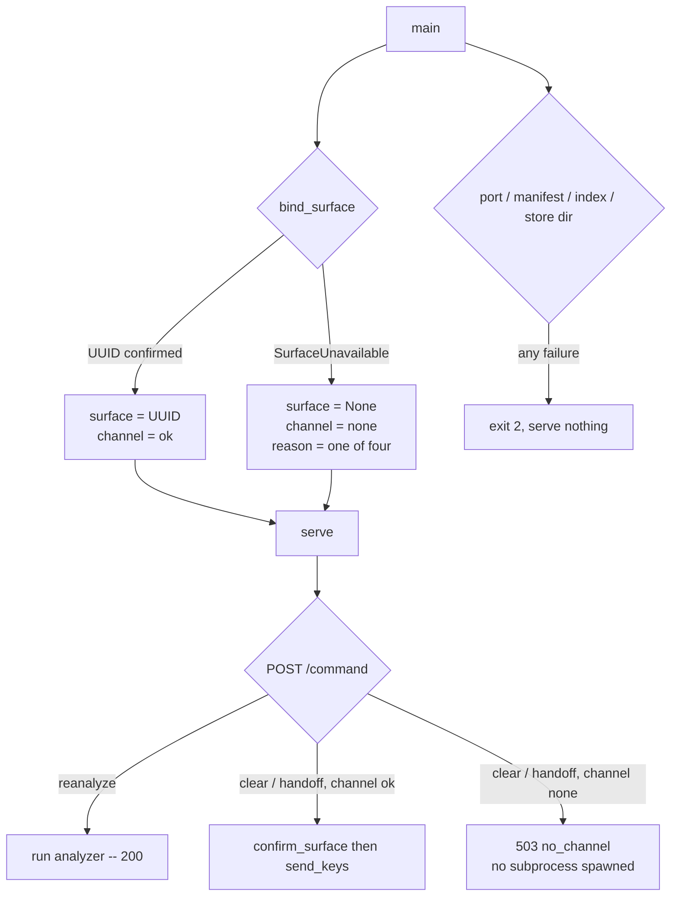

# Treko: serve a degraded, no-control-channel board instead of refusing to start

Planned 2026-08-23 on `main` @ `984e7ac`, after PR #68 (card `treko-store-location`) merged. The
work was **deferred from card 1** and the deferral is recorded in the tree itself: the test that
pins today's refusal says in its own docstring that §Deferred proposes changing it.

Model-switch checkpoint 1 (entering planning): the dispatching session fixed `model_tier: high`
for this card, and the planning was done there. **Checkpoint 2 (planning → implementation) has
not been asked** and must be asked before any branch is cut.

> **Gate status: CLOSED.** No branch, no task 1, no source edit until the literal user phrase
> `gate confirmed`. The spec-compliance gate (`running-the-compliance-judge`) has not run against
> this card yet; it must, before the user review gate.

**This card almost certainly earns an ADR.** It converts a startup abort into a served page —
a direction-pivoting change to the trust boundary, which is exactly the class
`rules/gates.md` requires a decision record for. The number is **0036**, checked against
`origin/main` @ `984e7ac6bf89f521c3cfd9fd69994564a515ff9a`, whose `docs/decisions/` tops out at
`0035-model-aware-context-thresholds.md`; it was additionally confirmed absent from every remote
ref and every local branch in this checkout. Note that "the next free number" is ambiguous here
for the same reason card `treko-store-location` recorded: **`0026` is duplicated**
(`…symbolic-ref…` and `…the-gate-does-no-json-parsing…`) and **`0028` is unused**. 0036 is
max+1, matching the precedent 0034 set, not a gap-fill.

## Why

Treko cannot run outside cmux at all. `bind_surface()` is called unconditionally at
`server.py:728`, every failure inside it raises `StartupAbort`, and the handler at
`server.py:738-740` writes the reason to stderr and returns `2`. Nothing is served. The browser is
never opened. The user asked to see which cards are in flight and got an exit code.

That is the wrong trade. The *survey* — the board, the merge order, the blocked filter — is the
part of Treko that carries the stated value, and it needs no control channel at all. The control
channel drives two keystroke commands. Refusing to render the board because two buttons cannot
work withholds the feature to protect a garnish.

The page is already most of the way there. `Treko.dc.html:480` computes `hasChannel` from the
presence of the injected token and `:483` already falls back to copyable text without one; the
comment at `:434-436` calls that mode "a supported runtime mode, not a degradation". The
`file://` path exercises it every day. What is missing is the *server* half: over `http://` the
server never gets far enough to serve the page it already knows how to degrade.

## The user decision that settles the scope — 2026-08-23

**All abort conditions in `bind_surface` degrade, each surfacing its own distinct reason.** Not
just the unset case.

From the user's seat every one of them means the same thing — no control channel — so serving in
all of them is what makes Treko *always* show the board, which is the whole point. But the page
must state **which** condition fired, because "you are not in cmux" and "cmux is broken" are very
different fixes and a single "no channel" message would send the user looking in the wrong place.

> **Finding: there are four conditions, not three.** The dispatch brief for this card named
> three. `bind_surface` has a fourth: `server.py:231-232` raises on `OSError` from
> `subprocess.run` — the `cmux` binary is missing, not executable, or `CMUX_BIN` points at
> nothing. It is a distinct reason with a distinct fix and it is trivially testable, because the
> harness already injects `CMUX_BIN` (`server_harness.py:256`). The user's decision reads on its
> own terms — every condition that means "no control channel" degrades — so this card takes all
> **four**. Flagged rather than silently absorbed: if the user meant literally three and wanted
> the fourth to stay fatal, this is the line to correct.

## Scope

### In

- All four `bind_surface` conditions become **degraded launches**, not aborts, each carrying its
  own closed-enum reason token.
- A new module `treko/channel.py` holding `bind_surface`, a `SurfaceUnavailable` exception and the
  reason enum — because `server.py` is at **799 of an 800-line hard ceiling** (D6).
- `config["surface"] is None` as the explicit no-surface representation, and a banner that says so.
- A **server-side refusal** of `clear` and `handoff` in degraded mode: `503`, error code
  `no_channel`, reached before any `cmux` subprocess.
- `reanalyze` continues to work, authenticated by the same token.
- Page-side: a second injected meta, a per-verb live/copy split, and a `no_channel` outcome row.
- Flipping four existing tests that were written to be flipped, plus the two prose blocks that
  describe them.
- **ADR 0036**, and the degraded-launch table in `skills/treko/SKILL.md`.

### Out

- **A fourth command verb.** `server.py:67-68` states that the three-row allowlist *is* the
  authorization set and that a fourth row is a spec change plus a judge round. This card adds no
  verb; it changes which of the existing three are *routable*.
- **Deducing a surface, ever.** See §Security. This is not a scope call that could be revisited
  cheaply; it is the reason `bind_surface` exists in its current shape.
- **Any change to the token, the CSP, the host check, the origin check, the manifest, or the
  audit-line format.** Degraded mode is a narrower server, not a looser one.
- **Making genuinely fatal startup problems non-fatal.** An unreadable index, an unmapped
  extension, a busy port, a store directory that is a file — all still exit `2` and serve nothing.
- **The Configuration drawer and the Ledger's artifacts-path field** (deferred in
  `treko-store-location.md` §Deferred). Unrelated, and still blocked on a verb this card refuses
  to add.

## Background: the facts the design turns on

Each was measured in this worktree at `984e7ac` on 2026-08-23. Line numbers were re-derived, not
copied; §Corrections lists every one that had moved.

**1. There are four abort conditions, all inside `bind_surface` (`server.py:211-238`).**

```python
219:    surface = (env.get(SURFACE_ENV) or "").strip()
220:    if not surface:
221:        raise StartupAbort(
222:            "%s is unset or empty -- the server was detached or launched outside cmux, and "
223:            "a send with no target defaults to whatever surface it inherits" % SURFACE_ENV)
224:    try:
225:        probe = subprocess.run(
226:            [CMUX_BIN, "read-screen", "--surface", surface],
227:            capture_output=True, text=True, timeout=timeout,
228:        )
229:    except subprocess.TimeoutExpired:
230:        raise StartupAbort("`%s read-screen` exceeded %ds probing the surface" % (CMUX_BIN, timeout))
231:    except OSError as exc:
232:        raise StartupAbort("cannot run `%s`: %s" % (CMUX_BIN, exc.strerror))
233:    if probe.returncode != 0:
234:        raise StartupAbort(
235:            "`%s read-screen --surface %s` exited %d -- the control channel does not exist "
236:            "for this target (an agent-session surface is not a terminal)"
237:            % (CMUX_BIN, surface, probe.returncode))
```

`SURFACE_ENV = "CMUX_SURFACE_ID"` (`server.py:55`).

**2. The rationale at `server.py:214-216` is load-bearing and this card does not weaken it.**

> *The UUID is inherited, never deduced. A send targeted at a deduced surface was delivered to a
> different live Claude session at exit 0 during task 1's spike; the fix is to delete the
> inference, not to check it harder.*

**Degraded mode must not deduce a surface. It serves with no surface at all.**

**3. The send/local split already exists** (`server.py:67-76`), so "reanalyze still works" is a
routing condition, not a redesign — condensed below, the real `SEND_COMMANDS` spans `:69-74` with
its escaping comment intact:

```python
SEND_COMMANDS = {"clear": "/clear\\n", "handoff": "/handoff\\n"}
LOCAL_COMMANDS = ("reanalyze",)
ALLOWED_IDS = frozenset(SEND_COMMANDS) | frozenset(LOCAL_COMMANDS)
```

The dispatch tail is `server.py:579-581`: `if command_id in LOCAL_COMMANDS: return
self._run_local(command_id)` / `return self._run_send(command_id)`. `_run_local` (`:626-634`)
touches no surface — it calls `run_reanalyze(repo_root, store_path, analyze_secs)`. `_run_send`
(`:636-657`) is the only caller of `confirm_surface` (`:299`) and `send_keys` (`:321`), the two
functions that shell out to `cmux`.

**4. `503` does not exist in the response vocabulary today.** The statuses in use are 200, 204,
400, 403, 404, 405, 409, 413, 415, 500 and 502. `CONFIRM_REFUSAL_REASONS` (`server.py:296`) holds
only `confirm_failed` and `confirm_timeout`. `501` is explicitly excluded — `server.py:400-401`:
*"405 rather than the base class's 501, so an unusual verb is answered the same way as a wrong
one — the status table admits no 501."*

**5. The page maps by error *code*, never by status.** `trackerOutcomeForBody`
(`Treko.dc.html:382-392`) reads `body.error` and looks it up in `TRACKER_ERROR_OUTCOMES`
(`:354-361`), which has no `no_channel` row — so a `503` resolves to `'unexpected'` → "Unexpected
error." today. The lookup is `hasOwnProperty`-guarded (`:386`) and a code with no row is
**never rendered back** (`:388-391`), which `test_ui_commands.py:290` falsifies.

**6. The other places that assume a surface.** `build_config` (`server.py:694`) takes `surface` as
its first positional and stores it at `:697`; the banner at `:786-787` prints `surface=%s`; the
audit line carries `surface=` (`server_harness.py:240` parses it) and already emits `-` for every
non-send request via `_fail`'s default (`server.py:432`).

**7. `server.py` is 799 lines against an 800-line hard maximum** (`rules/core-conduct.md`), and
`test_server.py` is 774. Measured today. This is not a footnote — it dictates D6.

## Design



### D1 — `bind_surface` reports *why*, and the caller decides

`bind_surface` keeps its current behaviour of never deducing anything. What changes is the shape
of its failure: it raises **`SurfaceUnavailable`, a subclass of `StartupAbort`**, carrying a
machine-readable `reason` drawn from a closed set of four.

```yaml
reasons:                      # the closed set; a fifth is a spec change
  surface_unset:    CMUX_SURFACE_ID is unset or empty
  probe_timeout:    `cmux read-screen` exceeded CMUX_TIMEOUT_SECS (5s)
  probe_failed:     `cmux read-screen` exited non-zero -- not a terminal
  cmux_unrunnable:  the cmux binary could not be run at all (OSError)
exception:
  class: SurfaceUnavailable(StartupAbort)
  carries: [reason (enum member), message (the existing human string)]
  message: unchanged from today, verbatim -- it still goes to stderr
```

**Subclassing rather than adding a flag is what keeps the change narrow.** `main()` wraps *only*
the `bind_surface()` call in a `except SurfaceUnavailable` — every other `StartupAbort` raised
anywhere in the existing `try` block (`server.py:720-737`) reaches the existing handler at `:738`
untouched, so criterion 9 holds by construction rather than by a list of conditions someone has to
remember to keep in sync.

**The human message is not changed and not truncated.** It still goes to stderr. Degraded mode
adds a channel, it does not remove the one that already reports the cause.

### D2 — Startup: one narrow `try`, and a banner that cannot be misread

```python
try:
    surface, channel = bind_surface(), CHANNEL_OK
except SurfaceUnavailable as exc:
    sys.stderr.write("server: %s\n" % exc)                # unchanged text, same stream
    sys.stderr.write("server: degraded -- no control channel (%s)\n" % exc.reason)
    surface, channel = None, exc.reason
```

| Condition | Today | After |
|---|---|---|
| `CMUX_SURFACE_ID` unset/empty | exit 2 | serves, `reason=surface_unset` |
| probe exceeded 5s | exit 2 | serves, `reason=probe_timeout` |
| probe exited non-zero | exit 2 | serves, `reason=probe_failed` |
| `cmux` unrunnable (`OSError`) | exit 2 | serves, `reason=cmux_unrunnable` |
| bad port / busy port | exit 2 | **exit 2, unchanged** |
| unmapped manifest extension | exit 2 | **exit 2, unchanged** |
| index unreadable / no `<head>` | exit 2 | **exit 2, unchanged** |
| store dir is a file / unwritable | exit 2 | **exit 2, unchanged** |
| corrupt legacy store | exit 2 | **exit 2, unchanged** |

**The banner names the state, not just the surface.** Today `server.py:786-787` prints
`surface=%s`. With no surface that would print `surface=None`, which reads like a bug rather than
a decision. It becomes:

```
server: http://127.0.0.1:8422/ surface=<uuid> idle=1800s poll=5s store=<dir>
server: http://127.0.0.1:8422/ surface=none reason=surface_unset idle=1800s poll=5s store=<dir>
```

`reason=` appears **only** in the degraded form. A launch with a channel is byte-identical to
today's banner, which is what lets the existing `test_autolaunch.py` / `test_server_lifetime.py`
serving assertions stay untouched.

`build_config` stores `surface=None` and gains `"channel": CHANNEL_OK | <reason>`. `None` is the
representation, not `""` and not `"-"`: an empty string is what an *unset environment variable*
looks like after `.strip()` (`server.py:219`), and reusing it would make "no surface" and "a
surface the user failed to set" indistinguishable inside the process. The audit line keeps
printing `-`, which is already its value for every non-send request.

### D3 — `clear` and `handoff` are refused by the server, at `503 no_channel`

The guard goes at the **top of `_run_send`**, before `confirm_surface`:

```python
def _run_send(self, command_id):
    if self.config["surface"] is None:
        return self._fail(503, "no_channel", "no_channel", command_id=command_id)
    ...
```

Three properties, and each earns a test:

- It is checked against **`config["surface"] is None`**, the same value the rest of the code would
  use to send. A guard keyed off `config["channel"]` could disagree with the surface it is
  guarding; keyed off the surface itself it cannot.
- It precedes **every** `cmux` invocation, so a degraded server spawns no subprocess on this path
  at all. Asserted by the fake-cmux invocation log the harness already keeps (`cmux_log`), not by
  reading the code.
- It reuses `_fail`, so the body is `{"ok": false, "error": "no_channel"}` and **echoes no request
  content** (`server.py:425-429`), and the audit line records `reason=no_channel`.

**Why `503` and not one of the statuses already in use.**

| Candidate | Why not |
|---|---|
| `403 forbidden` | Collapses with `bad_token`/`host_mismatch`, which the page maps to `stale_token` → *"reload to reconnect"*. Reloading cannot help; it sends the user into a loop. |
| `409 unresolved_surface` | The page renders *"The session this page controls has ended."* The session did not end — there never was one. A false statement about state is the failure `rules/core-conduct.md` names. |
| `501` | `server.py:400-401` states the status table admits no 501. Adding one contradicts a documented decision for no gain. |
| `502 send_failed` | Means "we tried and could not confirm". Nothing was tried. |
| **`503`** | Unused today, and semantically exact: the capability is absent from **this server**, for its whole lifetime. |

### D4 — The central design problem: how the page learns the channel state

**`!!cmdToken` stops being the right discriminator.** A degraded page still needs a token, because
`reanalyze` is local and stays live — so `cmdToken` is truthy while `clear` and `handoff` are not
routable. The page needs a second, independent signal.

**Chosen: a second injected meta, carrying a closed-enum token.**

```html
<meta name="tracker-token"   content="<per-launch secret>">
<meta name="tracker-channel" content="ok | surface_unset | probe_timeout | probe_failed | cmux_unrunnable">
```

Injected by `_serve_index` at `server.py:494-495`, the same one-line `<head>` replacement that
already carries the token, so `check_index_injectable` (`server.py:196-208`) already guards its
precondition and no new startup check is needed.

**One meta, not two.** An earlier shape used `content="ok|none"` plus a separate reason meta. Two
metas admit a state that means nothing — `channel=ok` with a reason, or `channel=none` without one
— and the page would need a rule for it. One attribute over a five-member closed set has no
unrepresentable-state problem to solve.

**The content is an enum token, never the server's message. This is a security requirement, not a
style choice.** The human strings at `server.py:222-223`, `:230`, `:232` and `:235-237` interpolate
`CMUX_BIN` (read from the environment at `server.py:54`), `exc.strerror`, `probe.returncode` and
the surface UUID (also from the environment). Writing any of them into an HTML attribute is an
injection gadget on an environment-controlled path. The closed enum makes that structurally
impossible, and it is the *same* discipline the page already applies to error codes — fixed
strings mapped page-side, the server's bytes never rendered (`Treko.dc.html:388-391`, falsified by
`test_ui_commands.py:290`). The page **must** treat an unrecognised `tracker-channel` value the
way it treats an unrecognised error code: fall to a fixed generic string, render nothing from the
attribute.

**Alternatives considered and rejected.**

| Alternative | Why not |
|---|---|
| **A capability field on the run payload** (`tracker-data.js`) | The envelope schema is owned externally (ADR 0023) and is written by `analyze.py`, which knows nothing about cmux. Worse, the store is a *file* that outlives the process: it would report the channel state of whichever launch last wrote it. A cached answer to a per-launch question. |
| **A `GET /channel` endpoint** | Adds a route to a deliberately closed surface, and makes the page's first render depend on a round-trip that can fail — a new state to design for, to answer a question the page could have been told at load. |
| **Injecting the live id set** (`<meta name="tracker-commands" content="reanalyze">`) | Genuinely attractive: it makes the button set a projection of the server's authorization set instead of a rule the page re-derives. Rejected on two counts. It gives the page *what* but not *why*, so the reason meta comes back and we are at two metas again. And it requires the page to parse a list and intersect it against `TRACKER_COMMAND_IDS` — new boundary-validation code inside the node-loadable slice, to express a two-way split the page can hold as a constant. Worth revisiting only if a fourth verb ever exists, which §Out forbids. |

**The page-side split, and the one rule that generalises it.** `commandProps`
(`Treko.dc.html:475-494`) is rewritten around three values instead of one:

```js
const hasToken = !!S.cmdToken;                    // was: hasChannel
const channelOk = S.cmdChannel === 'ok';
const liveIds = !hasToken ? [] : (channelOk ? TRACKER_COMMAND_IDS : TRACKER_LOCAL_IDS);
```

and then **one rule replaces the current two**:

> A command is offered as a **button** when it is in `liveIds` and the current view still offers
> buttons. Every command that has no button is offered as a **copy chip**.

That rule reproduces all three existing modes exactly, which is why it is worth preferring to a
new branch:

| Mode | `liveIds` | Buttons | Copy chips |
|---|---|---|---|
| `file://` — no token | `[]` | none | all three (today's behaviour) |
| served, channel ok, idle | all three | all three | none (today's behaviour) |
| served, channel ok, terminal outcome | all three | none (`offersButton` false) | all three (today's behaviour) |
| **served, degraded** | `['reanalyze']` | Re-analyze | `/clear`, `/handoff` |

`TRACKER_LOCAL_IDS` and `TRACKER_SEND_IDS` are added to the slice as the page's mirror of
`server.py`'s `LOCAL_COMMANDS` / `SEND_COMMANDS`. They are a duplication, and D7 pins them with a
test that reads both sides rather than trusting either.

`runCommand`'s guard (`Treko.dc.html:497`) becomes `if(!S.cmdToken || liveIds.indexOf(id)<0)
return;` — the same belt-and-braces the existing comment at `:499-501` explains, extended to the
new axis. It is **presentation only**: the authorization control is D3's server-side refusal.

### D5 — `no_channel` is a page outcome, and it is deliberately **not** terminal

Three page-side additions:

```js
TRACKER_MESSAGES.no_channel  = 'No control channel — /clear and /handoff cannot be sent from here. Copy them instead.'
TRACKER_ERROR_OUTCOMES.no_channel = 'no_channel'      // keyed by the server's error code
CMD_TONES.no_channel = 'var(--warn)'                  // presentation, outside the slice
```

plus `TRACKER_CHANNEL_REASONS`, the four-row map from the meta's enum token to the standing
explanation shown beside the copy chips:

| token | shown |
|---|---|
| `surface_unset` | Launched outside cmux, so there is no session to type into. |
| `probe_timeout` | cmux did not answer within 5s — the control channel may be wedged. |
| `probe_failed` | This surface is not a terminal; an agent-session surface has no control channel. |
| `cmux_unrunnable` | cmux could not be run on this host. |
| *(unrecognised)* | No control channel. |

**`no_channel` must not go into `TRACKER_TERMINAL_OUTCOMES`, and the reasoning matters more than
the answer.** The dispatch brief suggested it should, on the ground that a 503 from a channel-less
server is permanent for that process's lifetime. That is true, and it is still the wrong row,
because `trackerViewFor` (`Treko.dc.html:370-381`) applies terminality **globally**:

```js
var terminal=TRACKER_TERMINAL_OUTCOMES[outcome]===true;
...
offersButton:!terminal,
offersCopyText:terminal,
```

`offersButton:false` empties `cmdButtons` for *every* id (`:486`). So marking `no_channel`
terminal would withdraw the **Re-analyze** button — in the exact mode where re-analyze is the one
thing that still works. The card would defeat its own purpose on any stray 503.

Terminality is a property of the *whole channel*, and it is already correct for the two rows that
hold it: `session_ended` and `server_gone` both mean nothing further can be done at all. Degraded
mode is per-verb, and D4 handles it per-verb, which is the right axis. Making `offersButton`
itself per-verb was the alternative; it is a larger change to the slice, to the node bridge's
output shape (`test_ui_commands.py:114-120`) and to `assert_row`'s contract (`:150-170`), for no
behaviour D4 does not already give. Rejected on KISS.

### D6 — Where the new code lives: `treko/channel.py`, and a new test module

**`treko/server.py` is 799 lines against an 800-line hard maximum.** Measured 2026-08-23 at
`984e7ac`. There is one line of headroom, and this card adds a guard in `_run_send`, a branch in
`main()`, a key in `build_config`, a meta in `_serve_index` and a banner variant. It does not fit.

So `bind_surface`, `SurfaceUnavailable` and the reason enum move to **`treko/channel.py`**, which
is a *net removal* from `server.py`: lines 211-238 leave, an import arrives. It is the same shape
D5 of `treko-store-location.md` used for `store_location.py`, and for the same reason.

`channel.py` imports `StartupAbort` from `store_location` (where card `treko-store-location`
already moved it — `server.py:37`), so nothing is duplicated and the existing handler at
`server.py:738` still catches the base class.

**New server-side tests need a new module: `treko/test_degraded.py`.** `test_server.py` is 774
lines and this card's server-side surface — four launch conditions × (serves, banner, config) plus
the 503 path — is not a handful of cases. `test_server_lifetime.py` (270 lines) receives the
*flips*, not the new coverage: its subject is aborts, and these stop being aborts.

**Budget check is a task, not an assumption.** Task 12 runs `wc -l` on every file this card
touches and the result goes in §Verification. If `server.py` comes back at 800 or more, the answer
is to move more logic into `channel.py` — **never** to delete comments, which in this file carry
the reasoning behind its security decisions.

### D7 — What the existing tests become

Four tests were written to be flipped. Two prose blocks describe them and go stale silently.

**`test_autolaunch.py:355`**, whose docstring names this card:

> *Pre-existing behaviour, asserted rather than assumed.*
>
> *§Deferred proposes changing this to a degraded no-control-channel page. Pinning it now means
> that change flips a test rather than filling a gap.*

Its three assertions — `run.wait() == EXIT_ABORT`, `"CMUX_SURFACE_ID" in run.stderr`,
`browser_log.opens == []` — invert to: the server serves, stderr still names `CMUX_SURFACE_ID`
(that assertion **survives**, because D1 keeps the message), and `--open` **does** open a browser.
Rename it to say what it now pins.

**`test_server_lifetime.py` loses all three of its surface aborts, not two.** The brief named
`test_an_unset_surface_id_aborts_before_serving` (`:61`) and
`test_a_failing_read_screen_probe_aborts_before_serving` (`:68`). There is a third:
`test_a_hanging_read_screen_probe_aborts_before_serving` (`:73`). All three call `assert_aborted`
(`:47-53`), whose final clause —

```python
assert harness.refuses_connection(srv.port), "aborted server served anyway"
```

— is precisely what degraded mode inverts. They move to `test_degraded.py` as serving assertions.
`assert_aborted` itself **stays exactly as it is**: it is still correct for the five configuration
aborts that remain in that file, and criterion 9 depends on it staying strict.

Two prose blocks become false the moment those three tests move, and neither is asserted by
anything:

- the module docstring's inventory at `test_server_lifetime.py:14` — *"the three surface-binding
  startup aborts"*;
- the section header at `:56-58` — *"the three surface-binding aborts"*.

The docstring's blanket claim at `:19-21` — *"Every abort is asserted the same three ways: exit
non-zero, name its cause, and serve **nothing**"* — stays true of what remains, and must be
re-read after the move rather than assumed.

**`test_ui_commands.py` gains a row and must really drive it.** `ROW_OUTCOMES` (`:41-50`) is a
completeness contract enforced by `test_zz_every_table_row_was_driven_by_a_real_response`
(`:322-330`), which asserts `ROW_OUTCOMES - OBSERVED_OUTCOMES == []`. Adding `no_channel` to the
set without a real degraded server driving it fails that test — correctly. So the new row is
driven against a server launched with no surface, in the same spirit as
`test_a_stopped_server_is_a_terminal_state_with_the_copyable_text` (`:258`), which stops a real
server rather than mocking a rejection.

**And the drift guard gets a second half.** `test_ui_commands.py:190` asserts
`result["ids"] == ["clear","handoff","reanalyze"]` — *"the allowlist drifted"*. D4 adds
`TRACKER_LOCAL_IDS` / `TRACKER_SEND_IDS`, a page-side mirror of a `server.py` constant, which is a
new drift surface. It gets a test that reads **both** sides — `server.SEND_COMMANDS` and
`server.LOCAL_COMMANDS` imported in Python, the slice's partition read out of the node bridge —
and asserts they are the same partition. A hand-written expected list would pin the copy, not the
agreement.

## Security

This card **widens what the server does when it cannot verify its control channel**: it binds a
port and serves in a state it previously refused. That is the entire risk, and every control below
exists because of it.

- **No surface is ever deduced. The abort became a degraded launch; the inference stayed
  deleted.** `bind_surface` still reads the UUID from the environment and still proves it is a
  terminal before returning it. When it cannot, `config["surface"]` is `None` — not a guess, not
  a "first available" surface, not the parent's. The failure that motivated this design (a send
  at a deduced surface delivered to a *different live Claude session*, at exit 0, during card 1's
  spike — `server.py:214-216`) is reachable only by re-introducing inference, which this card does
  not.

- **`clear` and `handoff` are *unreachable*, not hidden. A hidden button is not an authorization
  control.** The page not rendering a button proves nothing: the token is in the DOM, the endpoint
  is `POST /command`, and anything that can read the page can post. So the server refuses:
  **`503`, error code `no_channel`, audit reason `no_channel`**, at the top of `_run_send`
  (D3) — before `confirm_surface`, before `send_keys`, before any subprocess. Criterion 4 tests
  this by posting with a **valid** token, and criterion 5 asserts the fake-cmux log recorded no
  invocation. A test that only checked the page's rendering would pass against a server with no
  guard at all.

- **The token is still minted and still required — including for `reanalyze`.** Degraded mode
  changes nothing about authentication. `reanalyze` runs the analyzer as a subprocess against a
  resolved repository path; unauthenticated, it is both an arbitrary-repo survey trigger and a
  cheap way to make a machine do work. `secrets.token_urlsafe(32)` at startup, memory only, never
  on disk, never an argv element, `hmac.compare_digest` on every POST — all unchanged, and the
  degraded page carries the same `Cache-Control: no-store` and CSP because it is served by the
  same `_serve_index`.

- **Nothing server-generated crosses into the page as text.** The `tracker-channel` meta carries
  one of five fixed tokens (D4). The four human messages interpolate `CMUX_BIN`, a surface UUID
  and an `errno` string — all environment-influenced — and they go to stderr, where they already
  go, and nowhere else. The `503` body is produced by `_fail`, which echoes no request content by
  construction (`server.py:425-429`). The page maps both the meta token and the error code to its
  own fixed strings and renders neither back.

- **The reachable surface does not grow.** No route is added. No manifest row is added. No verb is
  added. `ALLOWED_IDS` is unchanged — `clear` and `handoff` remain *allowlisted*, and are refused
  after the allowlist check, at the routing layer. The only new reachable response in the whole
  card is a `503` on a path that already answered `409`/`502` for adjacent reasons.

- **A server that serves in more situations must not also live longer.** The watchdog
  (`server.py:676-691`) is untouched: a degraded server still exits on parent death within
  `poll_secs` and still exits after `idle_secs`. The bound-lifetime argument in
  `tracking-feature-state.spec.md` §Security applies unchanged, and it applies *more* strongly
  here — a server that starts in more environments is a server that can be forgotten in more
  environments.

- **Genuinely fatal problems stay fatal.** Widening one abort into a served page is a one-off
  decision about one condition, and D1's narrow `except SurfaceUnavailable` is what stops it
  generalising. A bad port, an unmapped extension, an unreadable index, a `<head>`-less page, a
  store directory that is a file, a corrupt legacy store — every one still exits `2` and serves
  nothing. Criterion 9 pins this, and it is the criterion most likely to rot: it is the one that
  proves the change *did not* spread.

- **A degraded launch is announced on stderr, twice.** The original cause, verbatim, and a
  `degraded -- no control channel (<reason>)` line. A server that quietly starts in a reduced mode
  is one an operator uses for a week before noticing the buttons never worked.

## Scenarios

Good, bad and edge, in the order they run.

```gherkin
Scenario: launched outside cmux
  Given CMUX_SURFACE_ID is unset
  When  the server starts
  Then  it serves on its port and does not exit
  And   config["surface"] is None
  And   the banner reads surface=none reason=surface_unset
  And   stderr still names CMUX_SURFACE_ID

Scenario: the liveness probe times out
  Given the cmux probe hangs past CMUX_TIMEOUT_SECS
  When  the server starts
  Then  it serves, with reason probe_timeout
  And   stderr still says "exceeded 5s probing the surface"

Scenario: the surface is not a terminal
  Given `cmux read-screen --surface <id>` exits non-zero
  When  the server starts
  Then  it serves, with reason probe_failed
  And   stderr still says the control channel does not exist for this target

Scenario: cmux cannot be run at all
  Given CMUX_BIN points at a path that does not exist
  When  the server starts
  Then  it serves, with reason cmux_unrunnable
  And   stderr still says "cannot run"

Scenario: the board is served with no channel
  Given the server started degraded
  When  the browser requests /
  Then  the response is 200 with the CSP, nosniff and no-store
  And   it carries a tracker-token meta and a tracker-channel meta naming the reason

Scenario: reanalyze still works with no channel
  Given the server started degraded
  When  a POST /command with a valid token asks for reanalyze
  Then  the response is 200 {"ok": true, "id": "reanalyze"}
  And   the store is rewritten

Scenario: clear is refused server-side, with a valid token
  Given the server started degraded
  When  a POST /command with a valid token asks for clear
  Then  the response is 503 {"ok": false, "error": "no_channel"}
  And   the audit line reads reason=no_channel sent=no
  And   no cmux subprocess was invoked

Scenario: handoff is refused identically
  Given the server started degraded
  When  a POST /command with a valid token asks for handoff
  Then  the response is 503 with error no_channel
  And   no cmux subprocess was invoked

Scenario: an unknown id is still 403, not 503
  Given the server started degraded
  When  a POST /command asks for an id outside ALLOWED_IDS
  Then  the response is 403 unknown_id
  And   the allowlist check still runs before the routing guard

Scenario: the page shows the cause and the right controls
  Given a page served by a degraded server
  When  it renders
  Then  a live Re-analyze button is offered
  And   copy chips are offered for /clear and /handoff
  And   the standing message names the condition that fired, from the page's own strings

Scenario: the page never renders the meta's bytes
  Given a tracker-channel meta whose content is not one of the five tokens
  When  the page renders
  Then  it shows its own fixed "No control channel." string
  And   no part of the rendered view contains the attribute's text

Scenario: a direct 503 does not withdraw the Re-analyze button
  Given a degraded page whose last command returned 503 no_channel
  When  the view is recomputed
  Then  the Re-analyze button is still offered
  And   the copy chips are still offered

Scenario: nothing changes when there is a channel
  Given CMUX_SURFACE_ID names a live terminal surface
  When  the server starts and the page renders
  Then  the banner has no reason= field
  And   all three buttons are offered and no copy chip is
  And   clear and handoff reach cmux exactly as before

Scenario: a fatal startup problem is still fatal
  Given the index is unreadable, or the port is busy, or TREKO_STORE_DIR names a file
  When  the server starts
  Then  it exits 2 naming the cause
  And   the port refuses a connection

Scenario: the handler slice is still extractable
  When  test_ui_commands.py cuts the marker-fenced region and loads it in node
  Then  it loads with no React, no DCLogic, no document and no window
  And   its exported ids are still exactly clear, handoff, reanalyze
  And   its send/local partition equals server.py's
```

## Acceptance criteria

1. Each of the four `bind_surface` conditions serves instead of aborting, and each is
   distinguishable: `config["channel"]` and the banner's `reason=` carry `surface_unset`,
   `probe_timeout`, `probe_failed`, `cmux_unrunnable` respectively.
2. In every degraded launch `config["surface"] is None` — never `""`, never a string.
3. `POST /command` with a valid token and `id=reanalyze` returns `200` on a degraded server, and
   the store is rewritten.
4. `POST /command` with a **valid** token and `id=clear` or `id=handoff` returns
   `503 {"ok": false, "error": "no_channel"}` on a degraded server, with audit `reason=no_channel`.
5. No `cmux` subprocess is invoked on that path — asserted from the fake-cmux invocation log, not
   from the source.
6. `GET /` on a degraded server carries both metas; `tracker-channel` holds one of the five
   tokens and no server-generated text.
7. The page offers a live Re-analyze button plus `/clear` and `/handoff` copy chips, and displays
   the reason mapped from the meta by the page's own table; an unrecognised token falls to the
   page's fixed generic string and the attribute's bytes appear nowhere in the rendered view.
8. `no_channel` is **absent** from `TRACKER_TERMINAL_OUTCOMES`, and a `no_channel` outcome leaves
   `offersButton` true (D5).
9. Every non-surface startup failure still exits `2` and still refuses a connection: bad port,
   busy port, unmapped manifest extension, unreadable index, `<head>`-less index, disabled
   timeout, store directory that is a file, unwritable store directory, corrupt legacy store.
   `assert_aborted` is unchanged and still used for all of them.
10. With a live surface, behaviour is byte-identical to today: the banner has no `reason=` field,
    all three buttons render, no copy chip renders, and `clear`/`handoff` reach `cmux`.
11. The marker-fenced region still loads in node with no page dependency, still exports exactly
    `clear`, `handoff`, `reanalyze`, and its send/local partition is asserted equal to
    `server.SEND_COMMANDS` / `server.LOCAL_COMMANDS` read from Python.
12. `ROW_OUTCOMES` gains `no_channel` and `test_zz_every_table_row_was_driven_by_a_real_response`
    passes — meaning the row was driven against a really-degraded server, not a stub.
13. The full suite passes with **no test lost** — node-ID set diff against the pre-change set. A
    changed total is not a regression; a lost node is. The three flipped
    `test_server_lifetime.py` nodes are *renamed and relocated*, so the diff must show them
    accounted for by name, not merely absorbed into a larger total.
14. `wc -l` is under 800 for `server.py`, `channel.py`, `test_degraded.py`, `test_server.py`,
    `test_server_lifetime.py`, `test_ui_commands.py` and `Treko.dc.html` — measured, not assumed.
15. `skills/treko/SKILL.md` splits its refusal table: the four surface rows move to a new
    "When it starts degraded" table, the rest stay under "When it refuses to start". Its live
    test (`test_autolaunch.py:400` — no `nohup`/`setsid`/`2>`/`&` on any `server.py` line) still
    passes.
16. **ADR 0036** records the pivot: why a startup abort became a served page, why all four
    conditions and not one, why `503`, and why no surface is deduced.

## Pinned versions

Carried forward from `docs/features/treko-rename.md` §"Pinned versions"; each re-checked in this
worktree on 2026-08-23.

| Tool | Version | Where it is fixed |
|---|---|---|
| Python | 3.9.6 | the interpreter this repo's suite runs under; `server.py` targets stdlib only |
| pytest | 8.4.2 | test runner |
| node | v26.5.0 | `test_ui_commands.py` loads the sliced handler here; absent, criterion 11-12 report NOT VERIFIED rather than pass |
| Phosphor Icons | 2.1.1 | already vendored under `vendor/phosphor/` — do not re-fetch |
| Inter | vendored `inter-latin.woff2` | `vendor/inter/` — no version upstream; the file is the pin |
| Nocturne export | `73641b21-c7ad-488a-8264-a28262dfe83e`, schema `version: 1` | `_ds/` directory name; ADR 0023 |

**No new dependency.** `subprocess`, `pathlib` and `enum` are stdlib. Adding one would need a
separate ask (`rules/core-conduct.md`, Parallel-Agent Invariants).

## Tasks

- [ ] 1. Pre-change baseline in this tree: full node-ID set (`--collect-only -q`), per-module
      counts, and `wc -l` for every file in criterion 14. Record the set's `sha256`.
- [ ] 2. Red tests (`test_degraded.py`) for D1: `bind_surface` raises `SurfaceUnavailable` with
      each of the four reason tokens, and the reason set is closed. Drive `cmux_unrunnable` by
      pointing `CMUX_BIN` at a non-existent path.
- [ ] 3. Create `treko/channel.py`; move `bind_surface`, add `SurfaceUnavailable` and the enum;
      `server.py` imports it. Task 2 goes green. Confirm `server.py` **dropped** below 799.
- [ ] 4. Red tests for D2: each of the four conditions serves, `config["surface"] is None`, the
      banner carries `reason=<token>`, and — the other half — the nine fatal conditions in
      criterion 9 still exit 2 and still refuse a connection.
- [ ] 5. Wire `main()`'s narrow `except SurfaceUnavailable`, `build_config`'s `channel` key and
      the banner variant. Task 4 goes green. **Then** flip `test_autolaunch.py:355` and move
      `test_server_lifetime.py`'s three surface tests, updating that module's docstring
      inventory (`:14`) and section header (`:56-58`). Flip in a commit separate from the
      implementation — the tests are the baseline, per `rules/core-conduct.md`.
- [ ] 6. Red tests for D3: `clear`/`handoff` with a valid token on a degraded server → `503`
      `no_channel`, audit `reason=no_channel`, and **zero** entries in the fake-cmux log;
      `reanalyze` → `200`; an unknown id → `403` (the allowlist check still runs first).
- [ ] 7. Implement `_run_send`'s guard. Task 6 goes green.
- [ ] 8. Red tests in `test_ui_commands.py` for D4/D5/D7: the channel meta drives `liveIds`; the
      `no_channel` row driven against a really-degraded server (so `ROW_OUTCOMES` grows and the
      `zz` gate is satisfied honestly); `no_channel` leaves `offersButton` true; an unrecognised
      meta token renders the page's own string and leaks no bytes; the send/local partition
      matches `server.py`'s, read from both sides.
- [ ] 9. Implement the slice changes, `commandProps`, `runCommand`'s guard, `CMD_TONES`, and
      `_serve_index`'s second meta. Task 8 goes green. Keep the fenced region dependency-free —
      `test_ui_commands.py:182` is the guard on the guard.
- [ ] 10. **ADR 0036** — verified free against `origin/main` @ `984e7ac` and every other ref.
- [ ] 11. `skills/treko/SKILL.md`: split the table (criterion 15), and document that the board is
      always served.
- [ ] 12. Post-change suite: node-ID set diff vs task 1 with the three renamed nodes accounted for
      by name; per-module counts; `wc -l` for criterion 14.
- [ ] 13. Launch for real outside cmux (`env -u CMUX_SURFACE_ID python3 treko/server.py --open`),
      confirm the board renders, the reason line is right, Re-analyze works and the two copy chips
      copy. The criterion-7 check nothing automated can make.
- [ ] 14. Observability judge, then the PR.

## Risks

- **The narrow `except` widens by accident.** The whole "fatal stays fatal" property is one
  `except SurfaceUnavailable` around one call. Catching `StartupAbort` there instead — a one-word
  slip that reads fine — silently converts the port, manifest, index and store-dir aborts into
  degraded launches, and every one of them would then serve a broken page instead of saying why.
  Criterion 9's nine cases are the guard, and they must be seen failing before D2 is written.
- **A hidden button mistaken for a control.** The page-side split (D4) is the visible half and the
  easy half. If the server-side guard (D3) is skipped, forgotten, or placed *after*
  `confirm_surface`, every page-level test still passes. Criterion 5's "no subprocess was invoked"
  is the assertion that can tell the difference; a rendering assertion cannot.
- **`server.py` has one line of headroom.** 799 of 800. D6 moves 28 lines out before adding any,
  but the wiring still lands in a nearly-full file. If task 12's `wc -l` reaches 800, move more
  into `channel.py` — never delete comments, which in this file carry the reasoning behind its
  security decisions.
- **The three flipped lifetime tests disappear rather than move.** Criterion 13's node-ID diff
  catches a *lost* node, but a renamed-and-relocated node looks identical to a deleted one plus an
  unrelated new one. Task 12 must account for the three by name, which is why the criterion says
  so explicitly.
- **`ROW_OUTCOMES` grown without a real drive.** Adding `no_channel` to the set is one line;
  driving it against a genuinely degraded server needs a fixture. The `zz` gate will fail if the
  drive is missing — but it can be *satisfied* by a stub, which would pin the page's mapping while
  proving nothing about the server's 503. Task 8 says "really-degraded server" for that reason.
- **The reason enum drifts from the four raise sites.** Four conditions, four tokens, in two
  files after D6. A fifth condition added to `bind_surface` later with no token is a launch that
  degrades with `reason=None`. Worth a test that the enum's membership equals the set of tokens
  the four raise sites actually produce.
- **`CMUX_TIMEOUT_SECS` is 5s and now runs on every launch that will succeed anyway.** Degraded
  mode does not change the probe's cost, but it changes who pays it: today a wedged cmux means a
  5-second wait and an exit; after this card it means a 5-second wait before a *working* board.
  Not a defect — worth stating so nobody reports it as one.

## Verification

### What was measured for this card — 2026-08-23, worktree `treko-ui-update` @ `984e7ac`

Planning-phase measurements only. No implementation has been done and no task above is started.

```
python3 --version                                  # Python 3.9.6
python3 -m pytest --version                        # pytest 8.4.2
node --version                                     # v26.5.0
cd treko && python3 -m pytest --collect-only -q    # 221 tests collected in 0.03s
```

| Module | Collected |
|---|---|
| `test_server.py` | 89 |
| `test_store.py` | 30 |
| `test_analyze.py` | 26 |
| `test_store_location.py` | 21 |
| `test_rename.py` | 19 |
| `test_ui_commands.py` | 15 |
| `test_autolaunch.py` | 10 |
| `test_server_lifetime.py` | 10 |
| `test_store_writer.py` | 1 |
| **total** | **221** |

Collection only — **the suite was not run for this card.** `test_server_lifetime.py` alone costs
at least a minute by design (`test_server_lifetime.py:23-25`), and a planning card does not need
a green run; task 1 owes one, with the node-ID set and its `sha256`.

Line counts, `wc -l`:

```
treko/server.py             799     # 1 line of headroom against the 800 ceiling
treko/analyze.py            797
treko/test_server.py        774
treko/Treko.dc.html         639
treko/test_autolaunch.py    417
treko/test_ui_commands.py   330
treko/test_server_lifetime.py 270
treko/store.py              212
treko/store_location.py     146
skills/treko/SKILL.md       194
```

ADR number, checked against the deciding ref rather than the local tree:

```
git ls-tree origin/main docs/decisions/ --name-only   # tops out at 0035-model-aware-context-thresholds.md
git rev-parse origin/main                             # 984e7ac6bf89f521c3cfd9fd69994564a515ff9a
```

`0036` is additionally absent from every `refs/remotes/*` and `refs/heads/*` in this checkout, and
from the working tree. `0028` is likewise absent everywhere — an unused gap, not a free slot this
card should claim.

### What each task owes

Task 1 owes the node-ID set and its `sha256`. Tasks 2, 4, 6 and 8 each owe a **red-for-the-right-
reason** record: a collection error cannot distinguish "N tests red" from "one broken file", so
each red round is confirmed test-by-test against a throwaway stub, as
`treko-store-location.md` §"Tasks 2-3" and §"Task 5" did. Tasks 3, 5, 7 and 9 owe the green run
plus the running total against task 1's baseline. Task 12 owes the set diff with the three renamed
nodes named. Task 13 owes what it saw on screen, not what it expected to.

## Corrections to the dispatch brief

Every line number in the brief was re-derived against `984e7ac`. Reported because a copied
citation is laundered, not verified — five of these would have been carried into the card
unchecked.

| Brief said | Actually | Note |
|---|---|---|
| three abort conditions in `bind_surface` | **four** | `server.py:231-232`, `OSError` → `cmux` unrunnable. The card takes all four; see §The user decision. |
| `server.py:218-223` (unset) | `:219-223` | `:218` is the `env =` assignment, not part of the quoted block. |
| `server.py:228-236` (probe timeout) | `:229-230` | |
| `server.py:228-236` (probe non-zero) | `:233-237` | |
| `server.py:213-216` (the rationale) | `:214-216` | `:213` is blank. |
| `server.py:731` (`surface = bind_surface()`) | `:728` | |
| `server.py:735` (`build_config(surface, …)`) | def at `:694`, call at `:734` | |
| `server.py:788` (banner) | `:786-787` | |
| `server.py:293` (`CONFIRM_REFUSAL_REASONS`) | `:296` | |
| `server.py:295` (`confirm_surface`) | `:299` | |
| `server.py:322` (`send_keys`) | `:321` | |
| `server.py:582-584` (dispatch tail) | `:579-581` | |
| `server.py:66-75` (send/local split) | `:66-76`; comment at `:67-68`, `SEND_COMMANDS` at `:69` | `:66` is a blank line. |
| `Treko.dc.html:353-360` (`TRACKER_ERROR_OUTCOMES`) | `:354-361` | |
| `Treko.dc.html:363` (`TRACKER_TERMINAL_OUTCOMES`) | `:364` | |
| `Treko.dc.html:386` (`trackerOutcomeForBody`) | def at `:382`; `:386` is its `hasOwnProperty` line | |
| `Treko.dc.html:333-339` (`TRACKER_COPY_TEXT`) | `:334-339`; `:333` is `TRACKER_COMMAND_IDS` | |
| `Treko.dc.html:325-333` (contract comment) | `:325-332`; `:333` is the first code line | |
| `Treko.dc.html:494` (`runCommand`'s guard) | `:497`; `runCommand` starts at `:495` | |
| `Treko.dc.html:475-483` (`hasChannel`) | `commandProps` at `:475`; `hasChannel` at `:480`, `showCopies` at `:483` | |
| `test_server_lifetime.py:62-65` | def at `:61`, body `:64-65` | |
| two lifetime tests flip | **three** | `test_a_hanging_read_screen_probe_aborts_before_serving` (`:73`) is the third. |
| `test_server.py` is 777 lines | **774** | |
| the store-location card has a §Security section | it has **no** `## Security` heading | Its trust-boundary reasoning is distributed across D2, D3, §Risks and §"The one thing that must be settled". The §Security section here is modelled on `docs/features/tracking-feature-state.spec.md:675`, the repo's only one, and on that card's tone. |

Everything else in the brief held: `SURFACE_ENV` at `server.py:55`; the abort handler at
`:738-740`; the quoted `bind_surface` rationale; the `test_autolaunch.py:355` docstring, verbatim;
`test_ui_commands.py:190`'s `"the allowlist drifted"` assertion; the marker-fence contract at
`Treko.dc.html:325`; `componentDidMount`'s meta read at `:437-438` and its "supported runtime
mode, not a degradation" comment; no `503` anywhere in the response vocabulary; and the suite
baseline — 221 tests, every per-module count exact.
