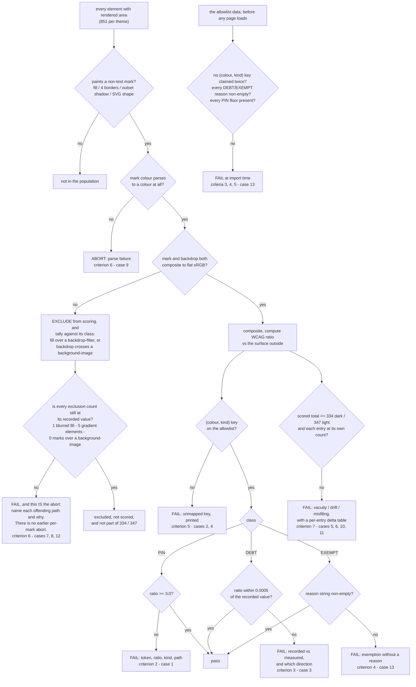

# Treko: a non-text contrast guard, on a named token allowlist

Planned 2026-08-25 in the `treko-ui-update` worktree on `feat/treko-theme-and-layout` @ `d7eda4b`,
immediately after card A (`treko-theme-and-layout.md`) merged as PR #79 (`82a9315`). Scope approved
by the user the same day. Written at `model_tier: high` (Opus 5) per the planning handoff.

**Model-switch checkpoint 2 (planning → implementation) was run 2026-08-26; the user chose to stay
at `model_tier: high` (Opus 5), on the grounds that the hard part is the measurement being correct.**

> **Gate status: OPEN.** The user said `gate confirmed` on 2026-08-26, after ten compliance rounds
> (31 violations cited, 31 closed) and three observability architecting reads (risk=low each time).
> Implementation proceeds on `feat/treko-non-text-contrast`, branched from the twelve planning
> commits on `feat/treko-theme-and-layout`.

## Why

> Throughout this card, **card A's criterion 5** means the existing test
> `test_criterion5_light_mode_contrast_meets_wcag`. This card's own numbered criteria live in
> §Acceptance criteria.

The board can be read in two themes. Only one of them has ever been checked for whether you can
actually see anything on it — and that one check only looks at **text**.

`test_criterion5_light_mode_contrast_meets_wcag` (`treko/test_theme.py:338`) is the entire contrast
surface of this repo. Its own name says `light_mode`, and its own docstring says it scores
"every element with non-zero rendered area" that "paint[s] a mark in their own `color`". So:

- **Dark theme has zero contrast coverage of any kind.** It is the default theme.
- **Non-text marks are unchecked in both themes.** The dot that says a branch is dirty, the border
  around a merge-wave badge, the line between two graph nodes, the five dots that say which phase a
  card is in — none of them paint in an element's `color`, so card A's criterion 5 never sees
  them.

Measured on this page at `d7eda4b`: 368 elements paint text and are scored. **336 non-text marks in
dark and 349 in light are scored by nothing.** A palette edit can wash out any of them and the whole
suite stays green — which is exactly what card A's own re-tint task did to text before card A's
criterion 5 caught it (127 violations, worst 1.64:1).

This card does not make Treko conform to WCAG 1.4.11. It makes a specific, named, human-classified
set of tokens **unable to silently regress**.

## Decisions taken during brainstorming (2026-08-25)

Each was a user decision. The implementation does not relitigate them.

1. **Scope is a regression guard on tokens, not WCAG 1.4.11 conformance.** The card says so in its
   title, its criteria, and its test docstrings. A reader who takes a green suite as a conformance
   claim has been misled by us, not by themselves. §D1.
2. **The population is a named token allowlist, classified once by a human.** Not "all marks", not
   sibling-contrast, not blanket pin-whatever-passes-today. §Background 2 is the measurement that
   forces this; §D2 is the list.
3. **The three measured defects are recorded as debt, not fixed here.** Repairing an inverted
   palette ramp is a design pass with its own card. §D5. (The planning note behind this decision
   said "two"; the measurement it was taken on lists three tokens — `--color-accent-700`,
   `--color-neutral-700`, `--color-neutral-800` — and every operative section of this card says
   three. The count was a slip in the note, not a narrower decision; the decision itself — record,
   do not fix — is unchanged.)
4. **Focus rings are out of scope and get their own card.** §D9.
5. **The dot population is cited by content, never by line number.** Line numbers in this file have
   drifted twice already (card A §"Review-phase addendum").

## Scope

### In

- One new browser-driven test module scoring **non-text marks** in **both** themes against a
  named token allowlist (§D2, §D8).
- The allowlist itself, as data in the test module: **23 entries** — 6 PIN, 3 DEBT and 14 EXEMPT,
  each with per-theme declared colours, a per-theme mark count, and a reason string on every DEBT
  and EXEMPT entry (§D2, §D8).
- A loud-failure rule for marks the probe cannot composite — a `background-image` backdrop, and a
  fill painted over a `backdrop-filter`. **§D7 is the normative statement of what that rule does**;
  this card states it there and nowhere else.
- A vacuity floor: the check must assert it found marks at all, in each theme (§D8).
- The three debt entries recorded in this file, with their measured ratios and their call sites
  (§D5). No palette edit.
- An ADR for the allowlist decision (why a named list beats both "all marks" and "pin what passes").

### Out

- **Any palette change.** Not a re-tint, not a ramp repair, not a one-token nudge. §D5.
- **Focus rings / `:focus-visible`.** §D9. They are drivable and they pass — and saying so with a
  green tick would hide that most click targets cannot be focused at all.
- **WCAG 1.4.11 conformance.** §D1. A correct implementation of the actual success criterion fails
  261 of 336 marks in dark today; see §Background.
- **Anything only visible after an interaction.** There are **three** such regions, not one, and
  all three are out:
  1. **The settings drawer** — its own marks, its scrim, its selection ring (an inset shadow) and
     its two theme-preview swatches (§Background 5, 6).
  2. **The agent panel** — `<sc-if value="{{ agentOpen }}">` at `Treko.dc.html:302`, with
     `agentOpen` initialised `false` at `:506`. Its `--hair-3` top border (`:303`) and its grab
     handle paint only when it is open.
  3. **Hover and focus states**, including the genuine `style-hover` rules on `--hover` /
     `--hover-soft` (§D4) and every `:focus-visible` ring (§D9).

  The probe scores the page at mount, so none of the three is in the population. This is the same
  blind spot card A's criterion 5 already has; widening it is a separate card. **It is stated here
  rather than closed** — a guard that silently omits a third of the chrome is the failure mode this
  card exists to argue against, so the omission is named, enumerated and bounded instead.
- **`Treko.dc.html` command-handler region.** Card A §Risks hazard 1 still holds.

## Background: the facts the design turns on

Everything numbered here was **re-measured in this session** at `d7eda4b`, tree clean, by re-running
the planning probe and diffing its output against the stored artifact. The re-run was
**byte-identical**. Derivation is recorded in §Verification rather than only its results.

**1. The page, at mount, pinned Chrome `152.0.7977.54`:**

| | dark | light |
|---|---|---|
| elements with non-zero rendered area | 851 | 851 |
| of those, elements that paint text (the population card A's criterion 5 scores) | 368 | 368 |
| **non-text marks painted** (fill, 4 border sides, outset shadow, SVG fill/stroke) | **336** | **349** |
| distinct **declared** colour strings among those marks | 24 | 26 |
| distinct **composited** colours among those marks | 25 | 27 |
| gradient-painted elements (uncompositable) | 5 | 5 |
| colour-parse failures | 0 | 0 |

**1a. Those 336 / 349 marks reconcile exactly, and two of them are never scored.** The §D2 tables
account for **334 in dark and 347 in light**; the remaining two per theme are handled without being
scored, for two different reasons. The reconciliation is arithmetic, not narrative — it must close,
and it does:

| source | dark | light | handled by |
|---|---|---|---|
| 6 PIN tokens | 55 | 55 | §D2, floor 3.0 |
| 3 DEBT tokens | 78 | 78 | §D2, recorded value |
| 13 palette EXEMPT tokens | 188 | 188 | §D2, reason string |
| `--shadow-sm` (a *shadow* token, not a colour token) | 13 | 26 | §D2 EXEMPT, 14th entry |
| **subtotal — the scored population** | **334** | **347** | |
| sticky-header fill, over a `backdrop-filter` | 1 | 1 | §D7 — **enumerated exclusion, count asserted** |
| `<svg>` root element, `rgb(0, 0, 0)` | 1 | 1 | **a probe defect** — deleted, see below |
| **total the planning probe found** | **336** | **349** | |

Two numbers, and the card means both. **334 / 347 is the scored population** — what the assertions
in §D8 run over. **336 / 349 is what the planning probe found**, and it is larger for two reasons
that are not the same reason:

- The `<svg>` root mark **is not real**. The root element paints nothing; the probe scored its
  inherited `rgb(0, 0, 0)`. §D7 and §Acceptance criteria 8 fix the predicate, so this mark stops
  existing — it is a bug being removed, not a mark being excluded.
- The sticky-header fill **is real and is deliberately not scored**, because what sits behind it
  is blurred page content rather than a flat surface (§Background 6). **§D7 says what happens to
  it**; this section only records that it is not part of the scored 334 / 347.

Stating both is deliberate: a later reader comparing an implementation run against §Background 1
would otherwise read a correct 334 as a two-mark regression.

`--shadow-sm` contributes 13 marks in dark (one colour) and 26 in light (**two** colours, from
`--shadow-sm: 0 1px 2px rgba(15,18,35,.06), 0 0 0 1px rgba(15,18,35,.07)` at `Treko.dc.html:40`) —
which is why the allowlist schema in §D8 must let one token own more than one declared colour
string in a theme.

**2. A correct "every mark ≥ 3:1 against its outside surface" rule is unshippable today.** Not
argued — measured on the real page:

- **261 of 336 marks fail in dark (78%)**; **258 of 349 fail in light (74%)**.
- Restricted to borders, and requiring failure against **both** adjacent surfaces (the strictest
  honest reading, since a border only needs to separate one of them): **140 of 174 in dark**,
  **132 of 174 in light**.

This is the whole justification for §D2. It is not a claim that the page is unreadable; it is a
claim that a blanket rule scores hairlines and dividers — marks whose entire job is to be nearly
invisible — as defects.

**3. Every dark/light asymmetry traces to one cause: the light palette is a hand-inverted ramp, not
a re-tinted one.** In `Treko.dc.html`, dark `--color-accent-700` is `#227a93` (a dark teal) and
light `--color-accent-700` is `#a4e2f3` (a pale blue). The light neutral ramp inverts mid-way —
`--color-neutral-700` is `#6e727e` (ink) while `--color-neutral-800` is `#e3e6ef` (paper). The ramps
are non-monotonic in light: `--color-accent-400` (`#1298b8`) is lighter than `--color-accent-500`
(`#007492`). A token that is a border in dark can be a background-weight colour in light, which is
why the same token scores 2.88 in one theme and 1.27 in the other.

**4. Interactive controls, counted in source.** Three counts, kept separate because composing them
is where the earlier draft went wrong:

- **29 elements carry an `onClick`**: 16 `<div>`, 6 `<button>`, 5 `<span>`, 1 `<i>`, 1 `<a>`.
- **9 elements are natively focusable**: 6 `<button>`, 2 `<input>`, 1 `<a>`.
- **0 `tabindex` attributes** anywhere in the file.

The intersection is what matters and it is **7**, not 9: the two `<input>`s are focusable but carry
no `onClick` (they use `onChange` / `onKeyDown`). So **7 of the 29 click targets can take keyboard
focus and 22 cannot.** §D9.

**5. Circular marks ("dots") in source: 5 `border-radius:50%` sites.** Three are live board
marks — the source dot, the five-per-row phase dots, the branch dot. **Two are the drawer's
theme-preview swatches, and they are hard-coded hex (`#38c4e3`, `#0e93b2`), deliberately: a preview
of the *other* theme cannot use a token, because a token would render the current theme in both
previews.** Neither appears in the measured population (drawer closed at mount) — confirmed by
searching the marks for a 7px `rgb(56, 196, 227)`: zero.

**6. Surfaces no probe can composite, and marks that do not exist at mount. The first group is
never scored — §D7 says what happens to it instead; the second is simply outside the population:**

- **5 gradient-painted elements**, from two declarations: the progress-bar fill
  (`linear-gradient(90deg, var(--color-accent-700), var(--color-accent))`, one element, 31x6) and
  the section-header rule (`linear-gradient(to right, var(--color-divider), transparent)`, four
  elements, each 1px tall). **All five are leaves in the paint order: measured, exactly 0 scored
  marks sit over one as backdrop, in either theme.** They are enumerated so that stops being true
  loudly rather than silently (§D7).
- **The sticky header**, `background: color-mix(in srgb, var(--color-bg) 90%, transparent)` with
  `backdrop-filter: blur(10px)` (`Treko.dc.html:102`). Its **fill** has no flat surface behind it —
  the `backdrop-filter` blurs whatever scrolls under it — so there is nothing to score the fill
  against. Its 1px `border-bottom` **is** scored: a border is measured against the surface *outside*
  the element, which the blur does not touch. §D7.

  Chrome serialises the fill as `color(srgb 0.0862745 0.0941176 0.14902 / 0.9)`, arithmetically
  `--color-bg` at 90%. **An earlier revision of this card made that serialisation the reason for
  the exclusion, and it is the wrong reason** — see §Verification, "The §D7 exclusion rule named
  the wrong mechanism".
- **The drawer scrim**, `background: rgba(0,0,0,.45)` with `backdrop-filter: blur(2px)` — not
  painted at mount.
- **0 inset shadows at mount.** The drawer's selection ring is an inset shadow, so it is outside the
  population for the same reason.

**7. Exactly one declared colour is shared by two tokens that both paint — and it splits cleanly.**
The allowlist indexes marks by their declared colour string (§D8), so a string two *painting*
tokens share would be unattributable by machine. Measured, there is one such string:

**`--shadow-sm` in dark is the literal hex `#3f424d`** (`treko/_ds/nocturne-.../styles.css:78`,
`--shadow-sm: 0 0 0 1px #3f424d`), which is exactly `--color-neutral-800`'s dark value. The 13 dark
card shadows therefore look like `--color-neutral-800` marks and are not: editing
`--color-neutral-800` would not move them, and editing `--shadow-sm` would. **An earlier draft of
this card filed those 13 marks under `--color-neutral-800`; §D2 now files them under
`--shadow-sm`.**

**It splits on mark kind, exactly.** All 22 of the token's dark marks are `fill` and all 13 of the
shadow's are `shadow-outset` — an exact partition, no overlap. So the allowlist index keys on
**(declared colour, mark kind)**, not on colour alone, and both entries can claim `rgb(63, 66, 77)`
without ambiguity (§D8). Across both themes this is the **only** colour claimed by two entries;
every other multi-kind colour belongs to a single token painting several kinds.

**A second collision was claimed by an earlier draft of this card and is false. It is recorded here
rather than deleted, because the way it was wrong is instructive.** `--color-accent` and
`--color-accent-500` *are* the same hex in both themes (`#38c4e3` / `#007492`,
`Treko.dc.html:25,36`), and from that the card concluded a live ambiguity, wrote it into
§Background, §D8, §Risks and an acceptance criterion, and would have committed it as a comment in
the test data. **It never checked whether `--color-accent-500` paints anything.** It does not:

```
git grep -c 'var(--color-accent-500' -- treko/   ->  no matches (exit 1)
git grep -c 'var(--color-accent)'    -- treko/Treko.dc.html  ->  20
```

The token is declared four times (`Treko.dc.html:25,36`, `nocturne.css:35`,
`_ds/nocturne-*/styles.css:35`) and consumed nowhere, so it paints no mark, shares no kind with
anything, and cannot be misattributed. **This is the same check that already cleared `--hair-2` and
`--hair-3` in §D2** — the card ran it for those two and did not run it here. A shared value is not a
collision; a shared value between two tokens that both *paint* is. §Risks 3.

**8. Card A's criterion-5 comment and this probe disagree on the denominator — resolved
2026-08-26, and the predicates were not the cause.** The comment says "848 elements with rendered
area … 367 paint a mark in their own color"; this card's walk measures **851 / 368**.

During implementation both numbers were re-measured on one page load, and the text count was taken
by running **card A's own `CONTRAST_CHECK_JS`**, unmodified, rather than a re-implementation of it.
It reports **368**, in both themes, against 851 elements with rendered area. So the difference is
not two predicates disagreeing: card A's predicate agrees with this card's measurement today. **The
comment records an older state of the page**, from before the drawer and sidebar work landed, and
its numbers went stale in place — the same class of defect as a recorded line number. No assertion
depends on 848 or 367 (card A's floor is `>= 200`), so this is a stale comment, not a live bug, and
this card does not edit `treko/test_theme.py` to correct it — criterion 10 forbids it, and a
drive-by fix in another card's file is its own task.

## Design

### D1 — What "guard", not "conformance", buys and costs

WCAG 1.4.11 asks whether a user can perceive a control's boundary. Answering it needs a human to say
which marks are load-bearing; §Background 2 shows what happens when a machine guesses instead —
three quarters of the page fails, including hairlines that are *designed* to be barely visible.

So this card answers a narrower, fully machine-checkable question: **for a named list of tokens that
pass today, does a future edit make them worse?** That is a real guarantee with a real failure mode
it catches (card A's re-tint), and it is honest about what it does not cover.

The cost is stated in the criteria and in every test docstring: a green run means *these tokens have
not regressed*, not *the board is accessible*.

### D2 — Three classes, one table, classified by hand once

**Twenty-three entries: 6 PIN, 3 DEBT, 14 EXEMPT.** Twenty-two are palette colour tokens; the
twenty-third is `--shadow-sm`, a *shadow* token whose value contains one colour in dark and two in
light (§Background 1a).

`--hair-2` and `--hair-3` are declared in `:root` and paint **zero** marks at mount, so they are not
on the list — but not because they are unused. **Each has a live call site behind an interaction
gate:** `--hair-2` on the command-copy chip (`Treko.dc.html:117`, inside `sc-for cmdCopies`, empty
at mount) and on the settings drawer's left edge (`:325`, drawer closed); `--hair-3` on the agent
panel's top border (`:303`, inside `sc-if agentOpen`, and `agentOpen` initialises `false` at
`:506`). They are gated, not dormant, and §Scope/Out puts every interaction-gated region out of this
card's population. §Risks 3.

**PIN (6)** — pass today; the guard holds them at a **3.0 floor**, which is not the same as
freezing them. `--ok` may slide from 10.30 to 3.01 with the suite green. That is deliberate — a
floor is the property this card claims and can defend, and pinning six healthy tokens to four
decimal places would make every legitimate re-tint a failure — but it is the honest limit of what a
green PIN assertion means

| Token | marks dk / lt | min ratio dk | min ratio lt | Where it paints |
|---|---|---|---|---|
| `--color-accent` | 34 / 34 | 8.01 | 4.63 | filled phase dot (28 x 5px), sidebar item left-rail, primary button border |
| `--color-accent-300` | 2 / 2 | 10.26 | 5.93 | PR-link dot (7px), tab underline (95x27 border-bottom) |
| `--ok` | 4 / 4 | 10.30 | 5.44 | status dot (3 x 7px), tab underline |
| `--warn` | 7 / 7 | 8.15 | 5.53 | status dot (3 x 7px), graph node border (180x49) |
| `--bad` | 7 / 7 | 7.23 | 6.01 | status dot (2 fills), tab underline, 2 outset shadows, SVG edge stroke, SVG node fill — **min via the SVG stroke** |
| `--info` | 1 / 1 | 7.78 | 7.19 | tab underline (95x27 border-bottom) |

**DEBT (3)** — fail today; recorded, not fixed on this card

| Token | marks dk / lt | min ratio dk | min ratio lt | Where it paints |
|---|---|---|---|---|
| `--color-accent-700` | 21 / 21 | **2.88** | **1.27** | 5 merge-wave badges x 4 border sides (20 marks) + **1 outset shadow, which is where the minimum comes from** |
| `--color-neutral-700` | 35 / 35 | **2.53** | 4.80 | 7 graph nodes x 4 border sides (28), 4 SVG fills, 3 SVG strokes — **min via an SVG stroke** |
| `--color-neutral-800` | 22 / 22 | **1.65** | **1.25** | unfilled phase dot (22 x 5px fills), and nothing else — the 13 dark card shadows that an earlier draft listed here belong to `--shadow-sm` (§Background 7) |

**EXEMPT (14)** — scored by nothing here beyond a reason string and a mark count

| Token | marks dk / lt | min ratio dk | min ratio lt | Where it paints |
|---|---|---|---|---|
| `--hair` | 42 / 42 | **1.17** | **1.20** | 1px hairlines, 4 sides |
| `--hover` | 30 / 30 | **1.13** | **1.11** | **static row separators** — `border-top:1px solid var(--hover)` at `Treko.dc.html:97,156,205,237,257,292`, repeated by `sc-for` |
| `--hover-soft` | 2 / 2 | **1.07** | **1.06** | **the selected row's fill** — computed at `:687,694,711` and applied through `:84`'s `background:{{ r.bg }}` |
| `--color-divider` | 40 / 40 | **1.55** | **1.28** | 1px dividers, 4 sides |
| `--color-bg` | 18 / 18 | **1.06** | **1.08** | page ground |
| `--color-surface` | 14 / 14 | **1.06** | **1.08** | card ground |
| `--rail` | 1 / 1 | **1.05** | **1.07** | sidebar ground |
| `--color-neutral-900` | 11 / 11 | **1.17** | **1.04** | inset well ground (progress track) |
| `--ok-bg` | 5 / 5 | **1.23** | **1.17** | ok badge fill |
| `--warn-bg` | 5 / 5 | **1.23** | **1.15** | warn badge fill |
| `--bad-bg` | 6 / 6 | **1.15** | **1.23** | bad badge fill |
| `--info-bg` | 3 / 3 | **1.14** | **1.22** | info badge fill |
| `--color-accent-900` | 11 / 11 | **1.32** | **1.03** | accent badge fill |
| `--shadow-sm` | 13 / 26 | **1.76** | **1.13** | card elevation hairline: 13 cards, one colour in dark, **two in light**; matched on kind `shadow-outset`, because its dark colour is `--color-neutral-800`'s (§Background 7) |
"Min ratio" is the **minimum, over every mark that token paints, of the WCAG ratio between the mark
and the surface immediately outside it** — the strictest single number the token has to survive.
**Bold** marks a value below 3:1. `dk` = dark, `lt` = light.

The minimum is taken over *all* kinds a token paints, not over borders alone, which is why two of
the three DEBT minima come from a mark the token's name does not suggest — an outset shadow for
`--color-accent-700` and an SVG stroke for `--color-neutral-700`. The "Where it paints" column
names the kind the minimum came from, so a later reader repairing a debt entry edits the right mark.

**The recorded DEBT values, to the precision the assertion uses (§D8):**

| Token | dark | light |
|---|---|---|
| `--color-accent-700` | 2.8791 | 1.2718 |
| `--color-neutral-700` | 2.5253 | 4.8042 |
| `--color-neutral-800` | 1.6519 | 1.2477 |

These six figures were recomputed from the probe's composited colour pairs during planning; the
probe's own dump rounds to 2 dp, which is why the tables above show 2.88 and this one shows 2.8791.
Task 6 asserts these values and a mismatch is a finding to explain, never a number to overwrite.

### D3 — Why exempting the five `*-bg` fills loses no coverage

`--ok-bg`, `--warn-bg`, `--bad-bg`, `--info-bg` and `--color-accent-900` are badge fills. Each sits
directly behind badge text, and **card A's criterion 5 already scores that text against its
effective, alpha-composited background — and that background *is* this fill.** If a future edit
moves `--ok-bg` toward `--ok`, card A's criterion 5 goes red on the text before anything here would
have fired.

That is the justification, and it is a measurement about the existing check, not an aesthetic
judgement. It is deliberately *not* "these are decorative" — the word "decorative" is how an
exemption list stops being auditable.

### D4 — Why hairlines and surfaces are exempt

`--hair` at 1.17:1 and `--color-divider` at 1.55:1 are not failures; they are the design. A 1px
divider pushed to 3:1 would be a visible regression, and a guard that demanded it would be a guard
nobody could keep green. The four ground tokens (`--color-bg`, `--color-surface`, `--rail`,
`--color-neutral-900`) are what other marks are measured *against*; scoring a surface against itself
is not a meaningful question — every one of them lands at 1.04–1.08:1 for exactly that reason.

**`--hover` and `--hover-soft` are named for a state they are not in.** Despite the names, every
one of their 32 measured marks is painted at mount, with no pointer over the page: `--hover` is the
1px `border-top` separating table rows, and `--hover-soft` is the fill of the *selected* sidebar
row. Both tokens are also used in genuine `style-hover` rules elsewhere, and those marks are outside
this card's population like every other interaction-gated mark. The distinction matters because
§Risks 4 puts hover states out of scope: what is out of scope is the hover *state*, not these two
tokens, which are in the population and on the list.

Each exempt token carries its reason string in the test data (§D8), so the exemption is reviewable
in the same place the list is.

### D5 — The three defects are recorded as debt, and this card fixes none of them

- `--color-accent-700` — merge-wave badge border, **2.88 dk / 1.27 lt**. The light value `#a4e2f3`
  is a pale blue drawn on a white card.
- `--color-neutral-700` — graph node border and SVG edge, **2.53 dk** / 4.80 lt.
- `--color-neutral-800` — unfilled phase dot, **1.65 dk / 1.25 lt**. This token paints the 22 dots
  and nothing else; the 13 dark card shadows that share its hex are `--shadow-sm` (§Background 7),
  so repairing this entry means repainting the dots, not the card elevation.

**Why not fix them here:** card A's task 4 is the evidence. That re-tint moved the light text check
from **127 violations to 0** — and moved dark from **104 to 18** on the same narrowed check, which
card A records explicitly as "**not** a claim that dark passes". A palette pass on an inverted ramp
resolves one theme and leaves the other, because the ramps are non-monotonic (§Background 3). That
is a design task with its own card, its own user value-decisions, and its own before/after
measurement — not a rider on a test-only change.

**A note on the phase dot specifically, so a later reader does not "fix" the wrong thing:** measured
directly, the *filled vs unfilled* dot ratio is **4.85 dk / 4.30 lt** — a five-segment meter is read
by comparing its segments to each other, and on that reading it passes comfortably. The failing
number (1.65 / 1.25) is unfilled-dot-vs-surface. Both are true; they answer different questions.
The debt entry records the vs-surface number **and this limitation**, so nobody repaints a meter
that is already legible.

### D6 — Both themes, symmetrically, in one module

Dark is the default theme and has no contrast coverage at all. Every assertion in this card runs
**twice** — once per theme, seeded the way the app seeds it (`localStorage`, then reload; never
`data-theme` set directly), which is the pattern card A's criterion 5 establishes in its Proof C,
and the only way the check exercises the app's own mount logic rather than simulating its result.

A token whose ratio differs between themes gets **two** allowlist entries' worth of assertion, one
per theme, because §Background 3 means the two numbers have no relationship to each other.

### D7 — Uncompositable marks are excluded and tallied; only a parse failure aborts directly

> **This section is the single normative statement of what happens to a mark the check cannot
> composite.** Every **prose** mention in this card — §Scope/In, §Background 1a, §Background 6,
> §D8, acceptance criterion 6, the scenarios — **points here and does not restate the mechanism.**
> The flowchart and the falsifier table necessarily carry a compressed form of it, because a diagram
> node and a table cell cannot be pointers; the requirement on those two is that they must not
> *diverge* from this section.** That rule exists because this exact statement drifted in three
> consecutive compliance rounds, each time in a different duplicate: first the prose, then a
> scenario, then the diagram, then this heading. A statement made in seven places is a statement
> that will disagree with itself.

A silent skip is indistinguishable from a passing check. This is not a hypothetical: the planning
probe's first version copied `parseColor` verbatim from `test_theme.py`, could not read Chrome's
`color(srgb r g b / a)` serialisation of `color-mix()`, returned alpha 0, and the caller read that
as "not painted" — **silently dropping 41 painted marks in dark (295 counted instead of 336)**. The
hardened version returns `null` and counts failures; it now reports `parseFailures: 0`.

The rule the implementation inherits:

1. A colour string the parser cannot read → **count it and fail the test**, never treat as
   transparent.
2. A mark that cannot be composited — because its backdrop chain crosses a `background-image`,
   or because it is a **fill** painted on an element carrying a `backdrop-filter` (behind which is
   blurred page content, not a flat colour) — is handled by exactly one of two paths, and which one
   is decided by whether this card has already enumerated it.

   **The predicate is about what is BEHIND the mark, never about how the mark's own colour is
   spelled.** A token declared with `color-mix()` composites perfectly well and is scored like any
   other: `--color-divider`'s dark value *is* a `color-mix()` (`treko/nocturne.css:17`) and §D2
   scores its 40 marks. A rule keyed on the `color(srgb …)` serialisation excludes 41 marks in dark
   rather than 1 — measured, §Verification.
   - **On the enumerated list → excluded, and the exclusion's own count is asserted.** The list is
     closed and short, and it has **two kinds of entry that are counted differently** — conflating
     them is how an earlier draft produced `334 + 6 ≠ 336`:
     - **The sticky-header fill** (`Treko.dc.html:102`) is a real mark that is excluded from
       scoring, because the `backdrop-filter` on that element means there is no flat surface behind
       it. **Asserted: exactly 1 excluded fill per theme, at that path.** As with the gradient
       count below, **that assertion *is* the abort for a new blurred fill**, not a second competing
       behaviour: a second such mark takes the count to 2, the run fails, and the message names its
       path and why it could not be composited. "Not on the enumerated list → abort" and "the
       exclusion count went up" are one event described from two sides, and the card states it once
       so falsifier case 8 is constructible.
     - **The 5 gradient-painted elements** paint no scoreable mark at all — a gradient is not a
       flat colour, so no fill mark is emitted for them — and **measured, exactly 0 scored marks
       sit over one as backdrop**, in either theme (§Background 6). **Asserted: exactly 5
       gradient-painted elements, and exactly 0 scored marks whose backdrop chain crosses one.**

       **That count *is* the abort for this case — it is not a second, competing behaviour.** A
       mark whose backdrop chain crosses a `background-image` is exactly what the count counts, so
       when it goes to 1 the run fails, listing each such mark's path and the ancestor that
       carries the image. There is no separate path that aborts first and leaves the count
       unconstructible, which matters because falsifier case 12 must be able to fire (below).

     An exclusion whose count grows is a failure, so the list cannot quietly absorb new marks.
     Neither number is part of the scored total: 334 / 347 is the whole scored population.
   - **Not on the enumerated list → abort, naming the path and why it could not be composited.**
     A newly-uncompositable mark is a change to the page that a human has not classified. **The
     abort is raised by the exclusion counts going above their recorded values** — 1 excluded mark,
     0 marks over a `background-image` — never by a separate earlier check, so every enumerated
     count is also the falsifier for its own class.

   The distinction is the whole point: an enumerated exclusion is a decision this card made and can
   be audited against; an un-enumerated one is a silent skip wearing the same clothes.
3. An allowlist token that matched **zero** marks in a theme → **fail**. A token that stopped
   painting is either a regression or a stale list; both need a human.
4. The one instance of rule 2's *blurred-fill* half today is the sticky header at
   `Treko.dc.html:102`, whose `backdrop-filter: blur(10px)` leaves its fill nothing flat to be
   scored against. It is enumerated, excluded, and its count asserted at 1 per theme — it is
   **not** scored, and it is **not** an abort, because this card has classified it. **Its
   `border-bottom: 1px solid var(--hair)` is scored**, and must be: §D2 records `--hair` at 42
   marks, and excluding the border would give 41.

   **What rule 2 does *not* cover, stated because a reader will assume it does:** a mark that is a
   **descendant** of a `backdrop-filter` element is still scored, against that element's declared
   background colour rather than against the blurred paint the viewer actually sees. That is a real
   approximation and it is not asserted away — the header's fill composites to `--color-bg` at 90%
   over the page ground, so today the error is negligible, but "negligible today" is a measurement
   rather than a design, and a heavier blur or a translucent header over busy content would make it
   wrong with nothing going red. Widening the exclusion to descendants was rejected: it would
   silently remove marks from the scored population, which is the failure this card exists to argue
   against. Disclosing it is the honest half-measure.

The whole pipeline, from a rendered element to a verdict — every path either asserts or aborts, and
none of them silently drops a mark:



Three further probe defects are recorded here so the implementation does not re-ship them:

- **The SVG predicate scored `rgb(0, 0, 0)` on the `<svg>` root element**, which paints nothing.
  Gate on an explicit, closed list of shape tags — `circle`, `ellipse`, `line`, `path`, `polygon`,
  `polyline`, `rect` — and not on `svg`, `g`, `defs`, `title` or any other container. The list is
  closed rather than illustrative because the counts it feeds are asserted exactly (§D8): a
  trailing "…" would let two implementations produce two different totals and both call themselves
  correct. A shape tag outside this list appearing on the page is an unmapped key, so criterion 5
  surfaces it rather than the predicate silently widening.
- **A box-shadow regex read only the first colour of a multi-shadow list.** 13 of 16 outset shadows
  in light are multi-valued.
- **`effectiveBackground()` ignores `background-image` entirely** — it accumulates
  `background-color` up the ancestor chain and stops at the first opaque one, so a mark sitting
  over a gradient is scored against a ground that is not what is painted, with no warning. Today
  that is harmless *by measurement, not by design*: 0 scored marks cross a gradient in either
  theme. The implementation does not have to composite gradients; it has to **assert that count is
  still 0**, which converts a latent wrong answer into a loud failure the day the layout changes.

  **Two things make that assertion real rather than decorative, and both are requirements, not
  advice:**

  1. **The backdrop predicate reads `background-image !== 'none'`, not "is a gradient".** A `url()`
     backdrop defeats compositing exactly as a gradient does; there are zero on the page today, so
     a gradient-only predicate would be silently wrong the first time one appears.
  2. **A "0 of something" assertion is worthless until it has been seen to fail**, and it is
     uniquely easy to write one that *cannot*: a detector built with the same ancestor walk
     `effectiveBackground()` uses returns 0 on every page, forever, green. **Falsifier case 12 is
     therefore not optional and may not be waived** — and its record must name the predicate that
     caught it, not merely that something did. A detector that reports 0 because it never looks is
     the exact failure this whole card was written about, reappearing inside the fix for it.

### D8 — Where it lives and what it asserts

New module `treko/test_nontext_contrast.py`, alongside `test_theme.py`, reusing `cdp_harness` +
`server_harness` exactly as card A's criterion 5 does. The allowlist is module-level data:

**Marks are indexed by `(declared colour, mark kind)`, not by colour alone.** One colour on this
page is claimed by two different entries — dark `rgb(63, 66, 77)`, which is `--color-neutral-800`'s
22 fills and `--shadow-sm`'s 13 outset shadows (§Background 7) — and keying on colour alone makes
criterion 5 ("exactly one entry") and criterion 7 (per-entry counts) impossible to satisfy at the
same time. Keying on the pair splits them exactly, with no overlap and nothing left over.

An entry therefore carries a class, the declared colours that identify its marks, an **optional**
`kinds` filter, the exact mark count, and the recorded ratio — and **each of the last three is per
theme**, because §Background 3 means a token's dark and light figures have no relationship to each
other. `colors` is a list because a token may own more than one string in a theme (`--shadow-sm`
owns two in light). `kinds` is omitted unless the entry needs it: an entry with no `kinds` claims
every kind its colours paint, and **today exactly two entries need one.**

```yaml
# shape, with the three entries that exercise every field. Figures come from §D2.
- token: "--color-accent"
  klass: pin                                  # pin | debt | exempt
  floor: 3.0                                  # pin only
  reason: null                                # required non-empty for debt and exempt
  # no kinds filter needed: nothing else paints this colour. --color-accent-500 declares
  # the same hex but has zero var() consumers, so it paints nothing (§Background 7)
  dark:  {colors: ["rgb(56, 196, 227)"], kinds: null, marks: 34, min_ratio: null}
  light: {colors: ["rgb(0, 116, 146)"],  kinds: null, marks: 34, min_ratio: null}

- token: "--color-neutral-800"
  klass: debt
  floor: null
  reason: "unfilled phase dot; an inverted-ramp defect, recorded not fixed (§D5)"
  dark:  {colors: ["rgb(63, 66, 77)"],     kinds: ["fill"], marks: 22, min_ratio: 1.6519}
  light: {colors: ["rgb(227, 230, 239)"],  kinds: ["fill"], marks: 22, min_ratio: 1.2477}

- token: "--shadow-sm"
  klass: exempt
  floor: null
  reason: "card elevation hairline; same species as --hair (§D4). Not a colour token."
  # dark value is the literal hex #3f424d, identical to --color-neutral-800's:
  # the kinds filter is what separates them (§Background 7)
  dark:  {colors: ["rgb(63, 66, 77)"], kinds: ["shadow-outset"], marks: 13, min_ratio: null}
  light: {colors: ["rgba(15, 18, 35, 0.06)", "rgba(15, 18, 35, 0.07)"],
          kinds: ["shadow-outset"], marks: 26, min_ratio: null}
```

`min_ratio` is populated for `debt` entries only, to 4 decimal places, from the §D2 table.
`--color-neutral-800` and `--shadow-sm` are the only two entries that need a `kinds` filter today.

Assertions, per theme:

- **Key uniqueness** — no `(colour, kind)` pair is claimed by two entries, asserted over the
  allowlist data itself before any page is loaded. This is the machine-checkable form of criterion
  5's "exactly one entry", and it fails at import time rather than at measurement time, so a stale
  list is caught even in a run where the page did not render.
- **Exact mark counts, not a floor** — the **scored** total is asserted at **334 dark / 347 light**,
  and every entry at its own `marks` figure. "Scored" excludes the enumerated exclusions (§D7),
  which are asserted separately and in their own units: **1 excluded header mark**, **5
  gradient-painted elements**, and **0 scored marks over a gradient backdrop**. Those are not
  addends of 334 — the header mark is the only real mark among them, so what the page paints is
  334 scored + 1 excluded = 335, plus the `<svg>`-root artefact the probe wrongly emitted = the 336
  the planning probe reported (§Background 1a). A floor is the wrong instrument here: `≥ 200`
  against a real 334 would stay green after 134 marks disappeared, and `≥ 1` per token would stay
  green after 41 of `--hair`'s 42 went.

  **The failure message is part of the requirement.** This assertion is the one most likely to fire
  first, and `333 != 334` across 23 entries tells a reader nothing. It prints a per-entry delta
  table — token, theme, expected, measured, difference — with unchanged entries omitted, so the
  first thing a reader sees is *which* entry moved and by how much.

  **This is only sound because the page is deterministic**: it is
  served from the fixed tree fixture (`server_harness.build_tree`), and two independent probe runs
  in two different sessions produced byte-identical output (§Verification). **Task 3 re-confirms it
  with the implementation's own walk** — run twice, dumps diffed — rather than with the planning
  probe, which is a throwaway this card neither commits nor locates and which the mandatory `/clear`
  at the gate destroys. If it does not reproduce, the counts become floors at the measured value and
  the card records why.
- **PIN** — every mark of every `pin` token is ≥ 3.0:1 against its outside surface. Failure message
  names the token, the ratio, the mark's kind and its path.
- **DEBT** — asserted at its **recorded measured value to 4 dp**, not at 3.0, **tolerance
  ±0.0005**, so the debt is pinned in place: it goes red if the token gets *worse*, and it also goes
  red if it gets *better* — because that means someone repaired it and the debt entry in this card
  is now a lie. The failure message states the recorded value, the measured value, and which
  direction it moved.

  **Where ±0.0005 comes from, and why it is not load-bearing.** The tolerance absorbs float
  formatting, nothing else: the ratio is pure arithmetic over composited sRGB triples, and the two
  byte-identical probe runs show there is no measurement noise to absorb. It is *not* sized to catch
  the smallest possible palette edit and cannot be — a one-step (1/255) change on a single channel
  moves these six minima by between **0.0009 and 0.0057** (measured, §Verification), so ±0.0005 is
  under the smallest of them, but only by a factor of 1.8, and a lateral hue change at equal
  luminance would not move the ratio at all. **The tolerance is not what catches an edited token
  value — see the Coverage bullet below, which is this card's single normative statement of that
  rule.** This assertion guards the case that survives it: the token untouched, its surroundings
  moved.
- **EXEMPT** — asserted only to have a non-empty `reason`, and to match its `marks` count. No ratio.
- **Every DEBT and EXEMPT entry** is asserted to carry a non-empty `reason` and every PIN entry to
  carry a `floor`, over the allowlist data alone, before any page loads. The schema in this section
  requires both; without an assertion the requirement is a comment. This is what criteria 3 and 4
  are checked by.
- **Coverage** — every `(colour, kind)` key among the scored marks maps to exactly one allowlist
  entry, and every entry matches at least one mark, or the test fails with the offending key
  printed. This is what stops the list going stale as the page grows.

  > **This bullet is the single normative statement of which assertion catches an edited token
  > value.** The rule has two halves and the second is what makes the first safe to state:
  >
  > 1. **An edit to a token's value that does *not* also update its allowlist entry is caught by
  >    Coverage** — the edited token's declared colour string is new, its key is unmapped, and
  >    neither the PIN floor nor the DEBT ratio ever sees a ratio to compare.
  > 2. **An edit that *does* update the entry to match passes Coverage by construction, and is
  >    caught by the PIN floor or the DEBT ratio instead.** This is the diligent edit. **Falsifier
  >    case 1 constructs it for PIN; there is no DEBT analogue in the table, and that is a stated
  >    gap** — case 2 is the *careless* DEBT edit (Coverage fires) and case 3 is the DEBT token left
  >    untouched under a moved surface. So do not read half 1 as "any edit"; without the
  >    qualifying clause it would say the floor is unreachable, which is the false premise round 5
  >    of this card's compliance loop had to correct.
  >
  > The PIN floor and the DEBT ratio therefore fire in exactly two situations: the token's own value
  > is unchanged and the surface under it moved, or the token changed *and* the entry changed with
  > it.
  >
  > **Every prose mention of this rule — the PIN and DEBT bullets above, the scenario comment
  > block — points here and does not restate the mechanism.** The flowchart and the falsifier table
  > necessarily carry a compressed form of it, because a diagram node and a table cell cannot be
  > pointers; the requirement on those two is that they must not *diverge* from this bullet, and
  > round 10 of the compliance loop checked that they do not. This statement is single-sourced
  > deliberately: §D7's identical shape drifted in three consecutive rounds before being demoted.

### D9 — Focus rings are out, and the reason is not "they fail"

They pass. A real `Input.dispatchKeyEvent` (rawKeyDown/keyUp, VK 9) makes `:focus-visible` match and
paints a 2px `rgb(56, 196, 227)` ring. The reason to exclude them is §Background 4: **7 of the 29
click targets can take keyboard focus, 22 cannot, and there are 0 `tabindex` attributes on the
page.** A green focus-ring tick would certify the ring on the 7 while saying nothing about the 22
that can never show one — a guard that is most reassuring exactly where the coverage is worst.

Their own card should fix the tabindex gap first, then guard the ring. It is also worth noting that
no existing code drives focus at all — `cdp_harness` sends only Page and Runtime methods today, so
that card adds an `Input` capability to the harness.

## Scenarios

```gherkin
Scenario: The board is untouched and the guard is quiet
  Given Treko.dc.html is unmodified at the implementation HEAD
  And the pinned Chrome 152.0.7977.54 renders the fixed tree fixture
  When the non-text check runs
  Then it scores exactly 334 marks in dark and 347 in light
  And it excludes exactly 1 sticky-header mark per theme
  And it finds exactly 5 gradient-painted elements and 0 scored marks over a gradient backdrop
  And all 23 allowlist entries match their recorded mark counts in both themes
  And every (colour, kind) key among the scored marks maps to exactly one entry
  And the 6 PIN tokens are all at or above 3.0:1
  And the 3 DEBT tokens are all within 0.0005 of their recorded values
  And the check passes

Scenario: A pinned token is dulled toward its background, and the list is updated with it
  Given --color-accent passes at 8.01:1 in dark and 4.63:1 in light
  When an edit moves --color-accent to a value 2.4:1 against --color-surface
  And the allowlist entry's declared colours are updated to match, so coverage passes
  Then the PIN floor assertion fails in both themes
  And the message names --color-accent, the measured ratio, the mark's kind and its path

# The "and the list is updated" line is load-bearing: without it Coverage fires instead and the
# floor never sees a ratio. Why that is so is stated once, in §D8's Coverage bullet. The failure
# this card defends against is the diligent edit -- someone re-tints a token AND dutifully
# re-records it -- and the floor is what refuses 2.4:1. Falsifier case 1 constructs this state.

Scenario: A recorded defect is edited in either direction
  Given --color-accent-700 is recorded as debt at 1.2718 in light
  When any edit changes its value, whether it dulls it to 1.10 or lifts it to 3.4
  Then the coverage assertion fails, not the debt ratio assertion
  And the message prints the unmapped (colour, kind) key and the entry that no longer matches
  And the message says a debt entry cannot be edited without re-recording it in this card

Scenario: A recorded defect gets worse without its own value changing
  Given --color-neutral-800 is recorded as debt at 1.6519 in dark
  And it is unchanged, but the surface its dots sit on has been re-tinted
  When the non-text check runs
  Then the coverage assertion passes
  And the debt assertion fails on the ratio moving outside +/- 0.0005
  And the message states the recorded value, the measured value, and which direction it moved

Scenario: A new token starts painting a mark
  Given the allowlist's 23 entries cover every mark painted today
  When an edit introduces a mark whose (colour, kind) key is on no allowlist entry
  Then the coverage assertion fails with the unmapped key printed

Scenario: A mark is filed under the wrong entry and the total does not move
  Given dark rgb(63, 66, 77) is painted by --color-neutral-800 as 22 fills
  And by --shadow-sm as 13 outset shadows
  When an implementation keys on colour alone and files all 35 under one entry
  Then that entry's recorded mark count assertion fails
  And the other entry's "matches at least one mark" assertion fails
  And the scored total of 334 does not move, so the total alone would not have caught it

Scenario: An allowlisted token stops painting
  Given --info paints exactly one mark, a tab underline
  When an edit removes that underline
  Then the vacuity assertion fails rather than passing on an empty set

Scenario: A backdrop becomes uncompositable and nobody classified it
  Given a mark is scored against a flat surface today
  And exactly 0 scored marks cross a background-image in either theme
  When an edit puts a gradient behind that mark
  Then the "0 scored marks over a background-image" count goes to 1 and the run fails
  And the message names that mark's path and the ancestor carrying the image
  And it does not silently drop the mark or score it against a guessed colour

Scenario: An enumerated exclusion quietly grows
  Given the sticky-header fill is the only fill excluded for sitting over a blur, 1 per theme
  When an edit gives a second element a backdrop-filter
  Then the excluded-fill count assertion fails at 2 against a recorded 1
  And the message names the new mark's path and why it could not be composited
  And the new mark is not absorbed into the exclusion list without a human

Scenario: The check runs on the default theme
  Given no taskTracker.theme is set
  When the suite runs
  Then dark is scored with the same assertions as light
```

## Acceptance criteria

1. `treko/test_nontext_contrast.py` exists and runs both themes through the app's own seed-and-
   reload path, never by setting `data-theme` directly.
2. Every one of the 6 PIN tokens is asserted ≥ 3.0:1 in both themes, against the surface outside
   the mark, on every mark it paints.
3. Every one of the 3 DEBT tokens is asserted at its recorded 4-dp value with a tolerance of
   **±0.0005**, and the assertion fails on movement in **either** direction.
4. Every one of the 14 EXEMPT tokens carries a non-empty, specific reason string. No exemption reads
   "decorative".
5. Every `(colour, kind)` key among the **scored** marks maps to exactly one allowlist entry, and
   every entry matches at least one mark; either failure prints the offending key. The check also
   asserts, over the allowlist data alone, that no key is claimed by two entries — dark
   `rgb(63, 66, 77)` is claimed by both `--color-neutral-800` (`fill`) and `--shadow-sm`
   (`shadow-outset`), and the `kinds` filter is what makes that unambiguous.
6. Uncompositable marks are handled exactly as **§D7** specifies — §D7 is the normative statement
   and this criterion deliberately does not restate the mechanism. What is checked here is that the
   implementation matches it: the three exclusion counts (1 sticky-header mark, 5 gradient-painted
   elements, 0 scored marks over a `background-image` backdrop) are each asserted in their own unit,
   none is an addend of the scored 334 / 347, and falsifier cases 7, 8, 9 and 12 each go red.
7. Mark counts are asserted **exactly**, not as floors: the scored population is **334 in dark and
   347 in light**, and every one of the 23 entries sits at its own per-theme figure. The exclusion
   counts are asserted separately. If **task 3** finds the page is not reproducible run to run, the
   counts become floors at the measured value and this card records that it did. **Task 3** owns
   that re-measurement and is the only task that can produce that finding; task 1 is the baseline
   only. 334 / 347 is
   336 / 349 minus the one `<svg>`-root artefact (criterion 8, a deleted bug) and the one
   sticky-header fill (criterion 6, an enumerated exclusion) per theme — §Background 1a.
8. The SVG predicate scores only real shape elements; the `<svg>` root is never scored.
9. Box-shadow parsing reads every colour in a multi-shadow list, not only the first.
10. **Exactly one file added under `treko/`, and no other file under `treko/` changed:**
    `treko/test_nontext_contrast.py`. The criterion is scoped to `treko/` deliberately — this
    card's own scope changes four things outside it (an ADR under `docs/decisions/`, this file's
    falsifier record from §Tasks 8, the `docs/features/` links, and the `treko` skill's UI notes),
    and an unscoped "no other file changed" could never pass. The new
    module reuses `cdp_harness` and `server_harness` the way `test_theme.py` already does and needs
    **no edit to `treko/conftest.py`**, which other test modules share; if the implementation finds
    it does need one, that is a finding to report before making it, not a licence in this criterion.
    **Zero palette edits**, proven by a diff that names its files and blocks, because the tokens
    this card newly depends on are not all in one of them:
    - `treko/Treko.dc.html` — **both** `:root` blocks (`:21` and `:27`) and the
      `body[data-theme="light"]` block (`:33`).
    - `treko/nocturne.css` — the `:root` block, which is where dark `--color-neutral-800` (`:28`)
      is declared.
    - `treko/_ds/nocturne-*/styles.css` — where dark `--shadow-sm` (`:78`) and
      `--color-neutral-800` (`:28`) are declared.

    Expect zero changed lines across all three. An earlier draft diffed only `Treko.dc.html`, which
    would have proven nothing about the two tokens the round-1 revision added.
11. Each test docstring states plainly that a green run means "these tokens have not regressed", not
    "the board is accessible".
12. Full suite green, on the pinned Chrome, recording **which tests ran** and the passed/failed/
    deselected counts against the pre-change baseline — a bare pass count cannot show that the new
    module was collected.
13. The one live colour collision (§Background 7) is stated in the test data as a comment on the
    two affected entries: `--shadow-sm`'s dark value is the literal hex `#3f424d`, identical to
    `--color-neutral-800`'s, and the `kinds` filter is what separates them. **No other collision is
    claimed** — an earlier draft asserted one between `--color-accent` and `--color-accent-500`,
    which is false because `--color-accent-500` has zero `var()` consumers and paints nothing
    (§Background 7).

## Pinned versions

Carried forward from `docs/features/treko-theme-and-layout.md` §"Pinned versions", unchanged.

| Tool | Version | Where it is fixed |
|---|---|---|
| Python | 3.9.6 | the interpreter this repo's suite runs under |
| pytest | 8.4.2 | test runner |
| Chrome | `152.0.7977.54` | `treko/cdp_harness.py:60`, `PINNED_VERSION`; asserted before launch |

**No new dependency.** The check needs `cdp_harness`, `server_harness` and the stdlib only.

**Chrome drift is a hard blocker, not a flake.** `cdp_harness.Chrome.__init__` asserts the pin
before it launches anything, so an auto-update fails every browser test at construction — before any
of them reaches a page. If that happens mid-implementation, re-pin and **re-measure the allowlist
table**; ratios from two builds are not comparable, and the DEBT assertions in criterion 3 are
recorded numbers.

## Tasks

Red half and green half are separate commits throughout; never the same commit
(`rules/core-conduct.md`, Testing).

1. ✅ **Baseline.** Full suite on the pinned Chrome; record passed / failed / deselected **and which
   tests ran**. No measurement here — the re-measurement belongs to task 3, which owns the walk that
   produces it. The planning probe is deliberately not a dependency of any task: it is a throwaway
   this card does not commit, and the mandatory `/clear` at the planning→implementation gate ends
   the session holding it.
2. ✅ **Red:** the harness and the count assertions — walk the page, collect non-text marks in both
   themes, assert the exact totals and `parseFailures == 0`. No allowlist yet. Must fail first for a
   stated reason.
3. ✅ **Green:** land the walk. Confirm a scored **334 / 347**, alongside 1 excluded header mark, 5
   gradient-painted elements and 0 scored marks over a gradient backdrop per theme, and that the
   four §D7 probe defects are absent (SVG root not
   scored; multi-shadow read in full; `color(srgb …)` parsed; 0 marks over a gradient).
   **Then run the walk a second time and diff its two dumps against each other** — both runs from
   the implementation's own walk, never a comparison against the planning artefact, which would test
   agreement with a throwaway rather than reproducibility. §D8's exact counts and criterion 7's
   floors-fallback both rest on this, and this is where it is established rather than inherited. **A scored total other than 334 / 347 cannot tell you
   which criterion is unmet, and must not be read as if it could:** either single failure yields
   335 / 348 and both together yield 336 / 349, so read the *excluded-mark count* (criterion 6) and
   the SVG predicate (criterion 8) to tell them apart. Falsifier case 10 agrees: re-scoring the
   `<svg>` root alone gives 335 / 348.
4. ✅ **Red:** the coverage assertion — every distinct declared colour maps to an allowlist entry.
5. ✅ **Green:** land the allowlist data, all 23 entries with class, per-theme colours, per-theme mark
   count, and reason; the two collision comments required by criterion 13.
6. ✅ **Red:** PIN and DEBT assertions.
7. ✅ **Green:** land them; both themes go green with zero palette edits.
8. ✅ **Falsify — thirteen cases.** For each: introduce the defect in a throwaway copy, confirm the test
   goes red, and **record which assertion caught it**. A count of "13 of 13 caught" without naming
   the catching assertion is not evidence.

   | # | Defect introduced | Assertion expected to catch it |
   |---|---|---|
   | 1 | a PIN token dulled below 3.0:1 **and its allowlist entry updated to match**, so coverage passes | PIN floor |
   | 2 | a DEBT token's value edited (either direction) | Coverage — its key is new |
   | 3 | a DEBT token untouched, its backdrop re-tinted | DEBT ratio, ±0.0005 |
   | 4 | a new mark in a colour on no entry | Coverage — unmapped key |
   | 5 | a mark deleted from the page | that entry's exact count |
   | 6 | **a mark misfiled under the wrong entry, total unchanged** | per-entry counts + "matches at least one mark" |
   | 7 | **the sticky header's `backdrop-filter` removed** | excluded-fill count, 0 against a recorded 1 — a stale enumeration in the *shrinking* direction |
   | 8 | **a second element given a `backdrop-filter`** | excluded-fill count, 2 against a recorded 1 (§D7) |
   | 9 | **a colour string the parser cannot read** | parse-failure abort |
   | 10 | **the `<svg>` root scored again** | scored total 335 / 348 against 334 / 347 |
   | 11 | **a multi-shadow list read as single** | `--shadow-sm` light count, 13 against 26 |
   | 12 | **a scored mark moved over a gradient backdrop** | "0 scored marks over a gradient", 1 against 0 — **record the predicate that caught it** |
   | 13 | an EXEMPT entry's `reason` emptied, and a PIN entry's `floor` removed | the data-only reason/floor assertion, before any page loads (criteria 3 and 4) |

   Cases 9, 10 and 11 are on this list because they are the card's own origin story: the planning
   probe shipped all three (§D7), and criteria 6, 8 and 9 would otherwise ship with no falsifier at
   all. Case 6 is here because the round-1 revision of this card *was* that bug — 13 marks filed
   under `--color-neutral-800` by hex collision, with the total unchanged and every total-based
   check green (§Background 7). Case 8 exists because an exclusion list that can grow silently is
   the same failure as a silent skip.

   **Record all thirteen cases and their catching assertions in this file**, not only in the throwaway
   copy — a falsifier that is discarded proves the check worked once, on a day nobody can revisit.
9. ✅ Prove criterion 10 — diff the three files and blocks it names (`treko/Treko.dc.html` `:root` at
   `:21` and `:27` and `body[data-theme="light"]` at `:33`; `treko/nocturne.css` `:root`;
   `treko/_ds/nocturne-*/styles.css`) against the base branch; expect zero changed lines in all
   three. Also confirm `treko/conftest.py` is unchanged.
10. ✅ ADR; update `docs/features/` links and the `treko` skill's UI notes.
11. ⬜ Observability judge, then PR.

## Risks

1. **The list goes stale as the page grows.** Mitigated by the coverage criterion (§Acceptance
   criteria 5) — a new colour fails loudly. Not mitigated for a token that changes *role* while
   keeping its value.
2. **The DEBT assertions are recorded numbers and will need re-recording after any Chrome re-pin.**
   Stated in §Pinned versions; the failure is loud, not silent.
3. **Attribution by colour string is ambiguous in principle, and one collision is live today.**
   `--shadow-sm`'s dark value is the same hex as `--color-neutral-800`'s (§Background 7). That one
   splits exactly on mark kind, so the index resolves it. What remains unsolved is the *general*
   case: if a future token shares both a value and a kind with an existing entry, marks are filed
   under whichever entry claims the key and nothing would surface it. **The guarantee is over the
   `(colour, kind)` key; the token name beside it is this card's attribution.** The alternative —
   indexing by CSS custom-property name — is not available: `getComputedStyle` does not give the
   property name back for a resolved mark. Accepted, disclosed, not solved.

   A shared *value* alone is not a collision, and this card got that wrong once: it claimed
   `--color-accent` / `--color-accent-500` as live without checking whether the latter paints. It
   does not — zero `var()` consumers (§Background 7). The check that settles it is one `git grep`,
   and it is the same one the card already ran for `--hair-2` and `--hair-3`.

   The same ambiguity is what limits the coverage criterion's reach over `--hair-2` and `--hair-3`,
   which paint nothing at mount (§D2). If their gated call sites ever paint, criterion 5 catches
   them only because their colour strings are genuinely new; a future token sharing a value with an
   existing entry would be filed silently under that entry instead.
4. **Marks only visible after interaction are outside the population** — the drawer, its scrim,
   its selection ring, hover states, and the two theme-preview swatches. This is the blind spot
   card A's criterion 5 already has, inherited deliberately (§Scope/Out) and stated rather than
   closed.
5. **A green suite will be read as an accessibility claim** by someone who does not read the
   docstrings. Mitigated by criteria 1 and 11 and by the card's title; not eliminated.

## Verification

### Findings made during implementation, 2026-08-26

Five subsections follow, in this order: the suite against its baseline, the palette diff, the
Chrome re-pin, the thirteen falsifier cases, and the one spec defect the implementation found.

### Criterion 12 — the full suite, against the task-1 baseline

|  | baseline (`355904b`) | after (`feat/treko-non-text-contrast`) |
|---|---|---|
| collected | 294 | 310 |
| passed | 259 | **310** |
| failed | **35** | 0 |
| deselected | 0 | 0 |

**A pass count cannot show the new module was collected, so the node-ID sets were diffed rather
than the totals.** Result: **0 lost, 16 gained, all 16 from `treko/test_nontext_contrast.py`**. The
35 baseline failures were the Chrome pin, every one of them raised in `Chrome.__init__` before a
page loaded; they pass on the re-pinned build. There is no pytest config in this repo — no
`pytest.ini`, `setup.cfg`, `pyproject.toml` or `tox.ini`, and no `collect_ignore` — so nothing is
deselected and the count is the whole suite.

(One node ID collapses in that diff, `test_criterion17_falsifiers_are_caught[CSS …]`, whose
parameter contains a space. It collapses identically on both sides, so the set difference is
unaffected: 294 rows / 293 ids before, 310 / 309 after.)

### Criterion 10 — the palette diff

Measured with `git diff origin/main...HEAD`:

| file | changed lines |
|---|---|
| `treko/Treko.dc.html` — both `:root` blocks and `body[data-theme="light"]` | **0** |
| `treko/nocturne.css` — the `:root` block | **0** |
| `treko/_ds/nocturne-*/styles.css` | **0** |
| `treko/conftest.py` | **0** |
| `treko/test_nontext_contrast.py` | +1044 (new file) |
| `treko/cdp_harness.py` | +12 / −2 — 11 comment lines and the one `PINNED_VERSION` string |

Two files under `treko/` change rather than one. The second is the re-pin, and it is the exception
§Pinned versions declares; see the finding above. **Zero palette edits**, which is what the
criterion is actually protecting.

**The module is 1044 lines, over the 800-line ceiling in `rules/core-conduct.md`.** Recorded rather
than quietly ignored: criterion 10 requires exactly one new file under `treko/`, so the two rules
disagree and the card's explicit, specific requirement wins. About 220 lines are the allowlist data
and about 230 are the browser-side walk; the rest is assertions and the docstrings criterion 11
requires. If a later card relaxes criterion 10, the data and the walk are the two clean seams.

### The Chrome pin moved mid-implementation, and every figure was re-measured

Chrome
auto-updated `152.0.7977.54` → `152.0.7977.65` between planning and implementation — a patch bump
inside the same build — and `cdp_harness.Chrome.__init__` asserts the pin before launch, so the
task-1 baseline was **259 passed / 35 failed / 0 deselected**, every one of the 35 failing at
construction without reaching a page. The user approved re-pinning to `.65` in preference to
downgrading Chrome. §Pinned versions obliges a re-measurement of the allowlist on a re-pin, and it
was done. The scored population came back at **334 dark / 347 light**, and **all six** DEBT minima
reproduced to 4 dp, each over the mark count §D2 records for it:

| token | theme | recorded | measured on `.65` | marks |
|---|---|---|---|---|
| `--color-accent-700` | dark | 2.8791 | 2.8791 | 21 |
| `--color-neutral-700` | dark | 2.5253 | 2.5253 | 35 |
| `--color-neutral-800` | dark | 1.6519 | 1.6519 | 22 |
| `--color-accent-700` | light | 1.2718 | 1.2718 | 21 |
| `--color-neutral-700` | light | 4.8042 | 4.8042 | 35 |
| `--color-neutral-800` | light | 1.2477 | 1.2477 | 22 |

Two consecutive walks in one session produced **byte-identical dumps** in both themes, which is
what task 3 owed and what §D8's exact counts rest on. **That is evidence the patch bump moved
nothing this card measures — it is not evidence that no Chrome bump ever could**, which is why
§Pinned versions keeps demanding the re-measurement rather than reasoning from this one.

**Criterion 10 is amended by §Pinned versions, and the amendment is this paragraph.** Criterion 10
says exactly one file changes under `treko/`. The re-pin changes a second, `treko/cdp_harness.py`.
The two clauses of this card disagree and §Pinned versions is the specific one, so it wins; the
criterion-10 diff is therefore run over the palette files it names, and `cdp_harness.py`'s one-line
pin change is the single declared exception. Card A's re-pin comment justified moving the pin on
the grounds that "nothing stores a Chrome-derived constant" — **that stops being true with this
card**, and the comment now says so in place.

### The thirteen falsifier cases, run 2026-08-26 — 13 of 13 caught

Each defect was introduced into a private copy of the tree (`server_harness.build_tree`) or into a
freshly reloaded copy of the module, and **every** assertion was then run, not only the one
expected to fire. The table names the assertion the card predicted and, where others also went
red, what they said — a count of "13 of 13" without the catching assertion is not evidence, and
neither is one that hides which *other* checks were doing the catching.

| # | defect | predicted catcher | what actually fired |
|---|---|---|---|
| 1 | `--color-accent` dulled to `#565a6d` (2.42:1) **and its entry updated to match** | PIN floor | **PIN floor, dark, alone.** Coverage passed by construction — this is the diligent edit §D8 describes, and the floor is the only thing standing in its way |
| 2 | `--color-neutral-800` dark edited to `#4f5260`, entry not updated | Coverage | Coverage (unmapped key), per-entry count, and the DEBT assertion failing loudly on "matched no marks" rather than skipping |
| 3 | `--color-surface` re-tinted and **its own** entry updated; `--color-neutral-800` untouched | DEBT ratio ±0.0005 | **DEBT ratio, dark, alone** — 2 debts moved, coverage green. The isolation the scenario asks for |
| 4 | a `#ff00ff` `border-top` added to the progress track | Coverage | Coverage in both themes, plus the scored total at 335 / 348 |
| 5 | the sticky header's `border-bottom: 1px solid var(--hair)` deleted | that entry's exact count | per-entry count (`--hair` 41 against 42) in both themes, plus the total at 333 / 346 |
| 6 | `kinds` filters swapped so colour alone decides | per-entry counts + "matches at least one mark" | **both**, exactly as predicted: `--shadow-sm` matched zero marks and two entries were off their counts, **while the scored total stayed 334** |
| 7 | the header's `backdrop-filter` removed | excluded-fill count, 0 against 1 | excluded-fill count in both themes, plus coverage and the total at 335 / 348 |
| 8 | a second element given a `backdrop-filter` | excluded-fill count, 2 against 1 | excluded-fill count in both themes, plus per-entry counts and the total at 333 / 346 |
| 9 | `--rail` set to `color(display-p3 …)`, which this parser cannot read | parse-failure abort | parse failures = 6 in dark, plus `--rail` matching zero marks and the total at 333 |
| 10 | `svg` added to the shape-tag list | scored total 335 / 348 | the total at exactly **335 / 348** in both themes, plus coverage on the root's `rgb(0, 0, 0)` |
| 11 | `splitShadows` truncated to its first entry | `--shadow-sm` light count, 13 against 26 | per-entry count in light, plus the light total at 334 against 347 — **a drop of exactly 13** |
| 12 | a 4x4 magenta span placed inside the progress-bar gradient | "0 scored marks over a background-image", 1 against 0 | **that predicate, in both themes, and nothing else.** Constructed to move nothing else: the span carries no `background-image` of its own, so the gradient-element count stays 5 and the scored total stays 334 |
| 13 | `--hair`'s reason emptied **and** `--warn`'s floor removed | the data-only assertion, before any page loads | the data-only assertion, reporting **both** — and it reported both only after the fix below |

**Two of the thirteen did not go red on the first attempt, and both are recorded because the near
miss is the useful part.**

- **Case 5 fired nothing at all.** Its first version deleted a `--hair` `border-right` from the
  icon rail at `Treko.dc.html:59` — an element that is not rendered at mount, so the mark it
  removed was never in the population. Nothing was wrong with the assertion; the *falsifier* was
  testing a mark that does not exist. Re-pointed at the sticky header's `border-bottom`, which is
  in the population, it goes red immediately. **A falsifier that mutates outside the population
  proves the check is quiet, not that it is broken** — and it is indistinguishable from a passing
  check unless you notice nothing turned red.
- **Case 13's second half was masked by its first.** The data-only assertion asserted inside its
  loops, so the missing PIN floor raised before the emptied reason was ever examined: the case
  reported one of the two defects it introduced. The assertion now collects every violation and
  asserts once. **A test that stops at the first of N independent checks cannot be falsified by a
  case that breaks two of them**, which is exactly what criteria 3 and 4 asked case 13 to do.


Recorded here rather than fixed silently: each changed something this card had asserted, and the
way each was wrong is more useful than the fact of it.

### The §D7 exclusion rule named the wrong mechanism

**§D7 said a mark is excluded when its own colour is a `color-mix()`.** Applied literally that
excludes **41 marks in dark, not 1** — measured, with the walk this card specifies. The reason is
`--color-divider`, whose dark value is `color-mix(in srgb, #e9e9ed 16%, transparent)`
(`treko/nocturne.css:17`) and which Chrome serialises exactly like the header's fill. §D2 lists
`--color-divider` as an EXEMPT entry with 40 marks per theme, and 294 + 40 = 334 — so the card's
own scored total requires those 40 scored. The two halves of the card could not both be satisfied.

**The rule that reproduces every figure the card recorded is narrower and is now what §D7 says:**
exclude a **fill** painted on an element carrying a `backdrop-filter`. It was already in §D7's own
list of uncompositable reasons, and it is the physically honest one — behind a blur is page
content, not a flat colour. It leaves the header's `border-bottom` scored, which is required:
§D2 records `--hair` at 42 marks and excluding that border would give 41.

Measured both ways, same page, same build:

| exclusion predicate | scored dark | scored light | excluded dark | excluded light |
|---|---|---|---|---|
| own colour serialises as `color(srgb …)` — §D7 as written | 294 | 347 | 41 | 1 |
| **fill over a `backdrop-filter`** — §D7 as amended | **334** | **347** | **1** | **1** |

Light was 347 under both, which is why a single-theme check would have missed this entirely: the
light palette declares `--color-divider` as a plain `rgba()` (`Treko.dc.html:34`). **The card's own
§D6 argument — that dark and light have no relationship to each other and both must be scored — is
what surfaced the defect**, on the first run.

The class, worth more than the instance: **the rule was written from the one mark it was invented
to explain, and never checked against the population it would run over.** The check that settles it
is narrow and was never run. Counting occurrences answers nothing: `color-mix` appears **44 times
across the two CSS sources** — hover tints, pressed states, muted text — and exactly **two of those
44 declare a custom property, both of them the same token**:

```
git grep -nE '^[[:space:]]*--[A-Za-z0-9_-]+:[[:space:]]*color-mix' -- 'treko/*.css' 'treko/_ds/*/styles.css'
  treko/nocturne.css:17                    --color-divider: color-mix(in srgb, #e9e9ed 16%, transparent);
  treko/_ds/nocturne-*/styles.css:17       --color-divider: color-mix(in srgb, #e9e9ed 16%, transparent);
```

That is the same shape as §Background 7's `--color-accent-500` error — a claim about a mechanism,
taken from a single example, never counted.

**This paragraph has now been wrong twice, in two different ways, and both are worth keeping.** Its
first draft said the grep "returns three declarations" — what a bare `git grep color-mix` looks like
at a glance — when the real answers are 44 occurrences and 1 token, two numbers that point in
opposite directions. Its second draft fixed that and then quoted a repo-wide total, **which went
stale inside a day**: the count rose as this card's own test module gained mentions of the word, so
the paragraph warning about figures rotting in place had one rotting in it. The number above is
therefore scoped to `treko/*.css` and `treko/_ds/*/styles.css` — the population the claim is
actually about, and one that no test file can move.


### What was measured during planning, and how to re-run it

The probe is `nontext_probe.py` in this session's scratch directory — **throwaway, not committed,
not a test**. It walks the real board in the pinned headless Chrome via `cdp_harness` +
`server_harness` and dumps every painted non-text mark in both themes with its adjacent surfaces and
ratios, to `nontext_marks.json`. `allowlist.py` reduces that dump to the per-token rows in §D2.

Run as: `TREKO_CHROME_DENY_BIRD=1 python3 nontext_probe.py`, then `python3 allowlist.py`.

**Re-run receipt, 2026-08-25, at `d7eda4b`, tree clean:** the probe was re-run in this session and
its output compared to the stored artifact from the earlier planning session.
`json.dumps(a, sort_keys=True) == json.dumps(b, sort_keys=True)` → **True**; the reduced allowlist
rows likewise compared **equal**. Every number in §Background 1, §Background 2 and the §D2 tables
comes from that re-run, not from a copied note.

### Corrections to the planning notes, made by that re-measurement

Recorded because a wrong number in an audit trail costs more than the error it describes.

- **Distinct colours are 24 dk / 26 lt declared, 25 dk / 27 lt composited.** The planning notes gave
  "25 / 27" without saying which; both figures are now stated with their predicate.
- **Borders failing against both adjacent surfaces are 140/174 dk and 132/174 lt.** The planning
  notes said "154/159"; that does not reproduce, and there are 174 border marks in each theme with
  none unscorable.
- **Filled-vs-unfilled phase dot is 4.85 dk / 4.30 lt.** The planning notes read "8.01 vs 1.65";
  those two numbers are filled-vs-*surface* and unfilled-vs-*surface*, a different comparison. The
  conclusion (the meter is legible segment-to-segment) survives; the number did not.
- **There are 5 `border-radius:50%` sites, not 6**, and two of them are drawer preview swatches
  outside the measured population (§Background 5).
- **"13 exempt" was a count of *palette* tokens that actually paint.** The planning notes listed 15
  names; two of them (`--hair-2`, `--hair-3`) paint zero marks at mount. **The compliance round then
  raised it to 14** by adding `--shadow-sm`, which is a shadow token rather than a colour token and
  was missing from the population entirely.
- **The drawer scrim is `background: rgba(0,0,0,.45)`, not an element at `opacity: .45`.**

### Corrections made in the compliance round, 2026-08-25 (round 1 verdict: fail)

Both judges ran against `3a791ac` and the compliance judge returned **fail** with 7 violations. Each
was re-measured against `nontext_marks.json` before it was accepted; these are the ones that changed
a number or a claim, not merely wording:

- **The §D2 tables did not account for every measured mark.** They summed to 334 dark / 321 light
  against a measured 336 / 349, so criterion 5 would have failed on the module's first run. The
  reconciliation is now §Background 1a and it closes exactly. The missing marks are `--shadow-sm`
  (13 dark / 26 light), the sticky-header `color-mix()` ground (1 each) and the `<svg>`-root
  artefact (1 each).
- **`--color-neutral-800` paints 22 marks in dark, not 35.** The other 13 are `--shadow-sm`, whose
  dark value is the literal hex `#3f424d` (`treko/_ds/nocturne-.../styles.css:78`) — the same hex,
  a different token. Its recorded minimum, 1.65, is unchanged: it comes from the dots, and the
  shadows sit at 1.76.
- **`--color-accent-700`'s minimum comes from an outset shadow, not a border**, and
  `--color-neutral-700`'s from an SVG stroke. Both tables previously described only the borders.
- **`--hover` and `--hover-soft` are not hover marks.** All 32 measured marks are painted at mount:
  `--hover` is the static row separator at `Treko.dc.html:97,156,205,237,257,292`, `--hover-soft`
  the selected row's fill (`:687,694,711` through `:84`). §D4.
- **`--hair-2` and `--hair-3` are gated, not dormant** — three live call sites (`:117`, `:303`,
  `:325`), which also surfaced the agent panel (`sc-if agentOpen`, `:302`) as a second
  interaction-gated region missing from §Scope/Out.
- **Two colour collisions are live** (§Background 7), one of them on a PIN token.

### Corrections made in compliance round 2 (verdict: fail, 6 violations; 5 of round 1's 7 closed)

Round 2 judged `3e21d55` at `d841364`. Two of the six were created by round 1's own fix — recorded
here because a revision that introduces a defect while closing another is the failure mode this
card's §D7 argues about, and it happened inside the card itself.

- **Keying marks by declared colour alone made criteria 5 and 7 unsatisfiable together.** Round 1
  added `--shadow-sm` while leaving `--color-neutral-800` claiming the same dark hex, so one colour
  had to map to two entries. Measured resolution: the 35 dark marks split **exactly** by kind, 22
  `fill` and 13 `shadow-outset`, with no overlap — so the index keys on `(colour, kind)` and both
  entries are unambiguous. Across both themes this is the **only** colour claimed by two entries.
- **The sticky-header mark had three different specified behaviours.** §Background 1a counted it
  inside the totals, §D7 rule 2 excluded it, rule 4 aborted on it, and criterion 6 failed the test
  on it — so the happy-path scenario could not pass. Resolved as an **enumerated exclusion with its
  own asserted count**: it is not scored, not an abort, and the exclusion cannot grow silently. The
  scored totals are therefore **334 / 347**, which is exactly what the §D2 tables sum to.
- **"The §D2 tables account for 321 in each theme" was stale** the moment `--shadow-sm` joined them.
  They sum to 334 dark and 347 light.
- **Both DEBT scenarios asserted the wrong mechanism.** Editing a DEBT token's value changes its
  declared colour string, so **Coverage** fires, not the ratio assertion — which could not report
  the measured value the scenarios demanded, because no mark would match the entry at all. The DEBT
  ratio assertion guards the other case: the token untouched, its backdrop moved. Both scenarios
  were rewritten to the mechanism the design actually produces.
- **"9 of 29 click targets can take focus" was a composed metric, and wrong.** The 29 `onClick`
  elements and the 9 natively focusable elements are two separately-measured populations; their
  intersection is **7** (6 `<button>` + 1 `<a>`), because the two `<input>`s carry no `onClick`.
  So 22 click targets cannot take focus, not "~20". §Background 4 now keeps the three counts apart.
- **The zero-palette-edits proof diffed a surface that does not contain the tokens it guards.**
  It named no file, `Treko.dc.html` has two `:root` blocks, and dark `--shadow-sm` and
  `--color-neutral-800` are declared in `treko/_ds/nocturne-*/styles.css:78,28` and
  `treko/nocturne.css:28` — outside the diff entirely. Criterion 10 now names three files.

Falsification went from nine cases to eleven, adding the misfiled-mark-at-unchanged-total case
(case 6 — literally this round's own bug) and the growing-exclusion-list case (case 8).

### Corrections made in compliance round 3 (verdict: fail, 3 violations; all 6 of round 2's closed)

Round 3 is the capped round, and the three findings were escalated to the user before being fixed,
per `running-the-compliance-judge`. The user directed all three fixes and a fourth round.

- **The exclusion list counted elements as if they were marks.** §D8 claimed "1 header mark + 5
  gradient elements … the two numbers together are what the page actually paints", which is
  334 + 6 = 340 against a measured 336. **Measured this round** with a fresh probe over the real
  page in both themes: the 5 gradient-painted elements are leaves — one 31x6 progress fill and four
  1px header rules — they emit no scoreable mark of their own, and **exactly 0 scored marks sit
  over one as backdrop**. So the exclusions are asserted in three separate units, none of them an
  addend of the scored total: 1 excluded mark, 5 gradient elements, 0 marks over a gradient.
  334 / 347 did not move.
- **That measurement surfaced a fourth planning-probe defect**, and it is the most consequential of
  the four: `effectiveBackground()` ignores `background-image` entirely, so a mark over a gradient
  is scored against a ground that is not painted, silently. It is harmless today **by measurement,
  not by design** — hence the new assertion and falsifier case 12.
- **Criterion 10's "no other file changed" was an absolute the card's own tasks break four times**
  (an ADR, this file, `docs/features/` links, the `treko` skill). Scoped to `treko/`.
- **Task 1 depended on a probe this card declares throwaway and never locates**, and the mandatory
  `/clear` at the gate destroys the session holding it — while criterion 7's floors-fallback and
  §D8's determinism argument both rested on that re-run. The re-measurement now belongs to **task
  3**, done with the implementation's own walk, run twice and diffed. The card previously
  attributed the step to task 1 and task 2 in different places; it is task 3 everywhere now.

### The DEBT tolerance is a measured number, not a chosen one

`±0.0005` at 4 dp comes from measuring what the smallest expressible palette edit does. Perturbing
each DEBT token's minimum-ratio mark by one 8-bit step on each channel, in both directions, in both
themes, moves the ratio by:

| Token | dark | light |
|---|---|---|
| `--color-accent-700` | 0.0023 | 0.0010 |
| `--color-neutral-700` | 0.0033 | 0.0057 |
| `--color-neutral-800` | 0.0022 | 0.0009 |

The smallest is **0.0009**, so ±0.0005 sits under every one of them — but by a factor of 1.8, not by
an order of magnitude, and it says nothing about an equal-luminance hue change. That is why §D8
records the Coverage assertion, not this tolerance, as the guard against an edited token value.

### Corrections made in compliance round 4 (verdict: fail, 3 violations; 2 of round 3's 3 closed)

All three were internal contradictions a reader could act on wrongly, and all three were one-line.

- **§Tasks 3 claimed a scored total could identify *which* criterion failed. It cannot.** Either the
  `<svg>`-root fix or the header exclusion failing alone gives 335 / 348; both failing gives
  336 / 349. The card said 336 meant the SVG fix and 335 meant the header — and falsifier case 10
  said the opposite. Now it says what the number can and cannot source, and points at the two
  assertions that *can* tell them apart.
- **Criterion 7 still attributed the floors-fallback to task 1** one sentence before the card said
  task 1 is the baseline only. Worse, §Verification's round-3 record claimed "it is task 3
  everywhere now" — **a claim written into this file that this file falsified.** Both fixed; the
  claim is recorded here rather than deleted, because the failure mode it demonstrates is the one
  this card's §D7 argues about.
- **Decision 3 said "the two measured defect classes"** where every operative section says three
  DEBT tokens. It had been wrong since the first commit and was never cited in rounds 1–3. The
  planning note behind it said "two" while listing three; the count was a slip, the decision was not.

### Changes made from the round-4 observability read (advisory, risk=low)

Its first finding is the sharpest thing either judge produced, and it is about the round-3 fix:

- **"0 scored marks over a gradient" can be green forever without being able to fail.** A detector
  built with the same `background-image`-blind ancestor walk that `effectiveBackground()` already
  has returns 0 on every page, always. §D7 now makes falsifier case 12 **non-waivable** and requires
  its record to name the predicate that caught it. A "0 of something" assertion that has never been
  seen to fail is not evidence.
- The uncompositable predicate reads **`background-image !== 'none'`**, not "is a gradient" — a
  `url()` backdrop defeats compositing identically, and there are zero today.
- The exact-count assertion **prints a per-entry delta table**, not `333 != 334` across 23 entries.
- **§D2 no longer says PIN "freezes"** its tokens: it is a 3.0 floor, so `--ok` may slide 10.30 →
  3.01 green. That is the deliberate limit, now stated where the claim is made.
- Task 3's two runs are **both the implementation's own walk**, diffed against each other — not
  against the planning artefact, which would test agreement with a throwaway rather than
  reproducibility.

### Corrections made in compliance round 5 (verdict: fail, 2 violations; all 3 of round 4's closed)

Both findings predate round 4 and surfaced only because round 4's edits made the surrounding
mechanisms precise enough to contradict each other. The first is the most serious thing any round
found, and it is about this card's headline guarantee.

- **Nothing in the card could ever exercise the 3:1 PIN floor.** The PIN scenario and falsifier
  case 1 both dulled `--color-accent` below 3.0 and expected the floor to catch it — but by §D8's
  own Coverage rule, editing a token's value makes its declared colour string new, its key
  unmapped, and Coverage fires first. The entry matches zero marks, so the floor has no ratio to
  print. **The fix names the failure the guard actually defends against:** not the careless edit
  (Coverage catches that, earlier and louder) but the *diligent* one — someone re-tints a token and
  dutifully updates the allowlist to match, so Coverage passes, and the floor is what refuses to let
  2.4:1 through. Both the scenario and case 1 now construct that state explicitly.
- **A mark drifting over a gradient had two incompatible outcomes.** §D7 rule 2 and falsifier case 7
  said it aborts; §D7's "0 scored marks over a gradient" and case 12 said the count goes 1 against
  0. If the abort fired first, case 12 — the case §D7 declares *non-waivable because it must be seen
  to fail* — would be unconstructible, which is precisely the unfalsifiability that requirement
  exists to close. Resolved by saying it once: **the count is the abort for this case.** Case 7 now
  covers a genuinely different path — a mark whose *own* colour becomes uncompositable and is not
  enumerated.

### Corrections made in compliance round 6 (verdict: fail, 2 violations; both of round 5's closed)

One of the two is a claim this card asserted for five rounds and never checked. It is corrected in
place and the error is recorded, because how it happened is more useful than the fact of it.

- **The "two live colour collisions" claim was half false.** `--color-accent` and
  `--color-accent-500` do share a hex — and from that the card concluded a live ambiguity, wrote it
  into §Background, §D8's schema comment, §Risks 3 and acceptance criterion 13, and would have
  committed it as a comment inside `treko/test_nontext_contrast.py`. **It never asked whether
  `--color-accent-500` paints anything.** It does not: `git grep -c 'var(--color-accent-500' --
  treko/` returns no matches, against 20 for `var(--color-accent)`. It is declared four times and
  consumed nowhere, so it paints no mark and cannot be misattributed. **Only the `--shadow-sm` /
  `--color-neutral-800` collision is real**, and that one splits exactly on mark kind. The check
  that settles it is one `git grep` — the same one this card had already run for `--hair-2` and
  `--hair-3` two sections earlier, and did not think to run here. A shared value is not a collision;
  a shared value between two tokens that both *paint* is.
- **A second `color-mix()` mark had two specified outcomes** — abort as un-enumerated (§D7 rule 2,
  criterion 6) or the exclusion count going 2 against 1 (the scenario, case 8) — the same shape as
  round 5's gradient finding, one level over. Resolved the same way: **the count is the abort**,
  raised by an enumerated count exceeding its recorded value and never by a separate earlier check.
  Falsifier case 7 was re-pointed at the shrinking direction — the header's `color-mix()` removed,
  count 0 against 1 — so cases 7 and 8 no longer take the same input.

Three non-blocking notes from the same round were also acted on: criterion 4 had no falsifier and
the DEBT/EXEMPT `reason` the schema requires was asserted nowhere (both now covered by a data-only
assertion and falsifier case 13); §Background was numbered 6, 8, 7 and is now 6, 7, 8; and the
SVG shape-tag list ended in "…" inside a predicate whose output is asserted exactly — it is now a
closed list of seven tags, with the reason it must be closed.

### Corrections made in compliance round 7 (verdict: fail, 1 violation; both of round 6's closed)

One violation, and it is the same id round 6 raised — recurring in the one site the round-6
revision did not reach. **The Mermaid flowchart still drew the design the prose had spent two
rounds deleting**: it routed an un-enumerated uncompositable mark to a separate, earlier, per-mark
`ABORT` box, while the surrounding prose says in six places that the exclusion counter going out of
range *is* the abort and that there is "no separate path that aborts first". An implementer building
from the picture rather than the paragraphs would make falsifier cases 8 and 12 unconstructible —
the unfalsifiability §D7 declares non-waivable, arriving through the diagram instead of the text.

That is worth recording as a class, not just a fix: **a diagram is a requirement, and it drifts the
way any other duplicated statement drifts.** Rounds 5 and 6 each closed this contradiction once, in
prose, and neither round looked at the picture.

Fixed in three places: the flowchart now sends both branches into a tally node whose count
comparison is the failure; a `W` node asserts all three exclusion counts, which the diagram
previously asserted nowhere; and §Scope/In's "must abort the check" is restated as exclude-and-tally
with the parse failure named as the one direct abort. The diagram also gained the data-only
assertion node (criteria 3, 4, 5 before any page loads) and now names the falsifier case behind
each failure box.

### Corrections made in compliance round 8 (verdict: fail, 2 violations)

- **The same excluded-vs-abort statement drifted for a third consecutive round**, this time in the
  §D7 *heading* ("Uncompositable surfaces abort; they never score") and §Background 6's lead-in
  ("must fail loudly"), both contradicting §D7 rule 4's "it is **not** an abort". Rounds 6, 7 and 8
  each closed this in a different duplicate — prose, then the diagram, then the label on the door.
  **The durable fix is structural, not another edit to another copy:** §D7 now carries an explicit
  note that it is the *single normative statement* of the mechanism, and §Scope/In and acceptance
  criterion 6 were rewritten as pointers that check conformance without restating it. A statement
  made in seven places is a statement that will disagree with itself.
- **The round-7 record in this section overclaimed what that edit did.** It said the flowchart "now
  names the falsifier case behind each failure box"; four of the eight boxes named none — including
  the PIN-floor box, whose falsifier (case 1) is the most-argued item in this card. The claim was
  written into a durable artefact without being checked against the artefact it described. It is
  now true — all eight boxes carry their criterion and case — and the overclaim is recorded here
  rather than quietly repaired, because the failure is the same one §D7 argues about: a statement
  that reads as settled while nothing checked it.

### Corrections made in compliance round 9 (verdict: fail, 2 violations)

Round 8's structural fix worked — `writing-specs/exclusion-abort-vs-count` closed after three
rounds, and every site now agrees. Both of round 9's findings are about the *repair*, not the
original design.

- **The round-8 record in this section overclaimed, in the paragraph recording an overclaim.** It
  said "all eight boxes carry their criterion and case"; two of the eight (`FN`, `F2`) named only a
  case. That is precisely the fault round 8 had cited against round 7's record, committed one round
  later while writing it down. Both nodes now carry criterion 6. **The pattern is worth naming: a
  changelog entry that grades its own edit is a claim like any other, and re-reading the artefact
  it grades is not optional.** Three consecutive rounds have now caught one.
- **§D7's single-source note was itself false.** It promised every other mention points at §D7 and
  does not restate the mechanism — while §Background 1a restated it, the "enumerated exclusion
  quietly grows" scenario asserted it in a `Then` step, and acceptance criterion 6 restated it three
  sentences after promising not to. All three reduced to pointers, and §Background 1a added to
  §D7's list.

**Acting on the round-9 judge's answer to a question this card asked it:** the next statement with
the same shape is *"an edit to a token's value is caught by Coverage, not by the PIN floor or the
DEBT ratio"* — stated normatively in six places that agree today (§D8's DEBT bullet, §D8's Coverage
bullet, both scenario comment blocks, falsifier case 2, and the flowchart's `G → F3` branch). It has
been demoted the same way §D7 was, **before** it drifted rather than after: §D8's Coverage bullet is
now the single normative statement, and the DEBT bullet and the one Gherkin comment block point at
it. (Round 10 corrected this paragraph: an earlier version said "both scenario comment blocks" and
"both scenarios point at it" — there is one comment block in the whole Gherkin section, and the
scenarios themselves are steps, not pointers. The paragraph was describing an edit without
re-reading the file it described, for the third round running.)

### What was NOT verified at the end of planning

**Read this list as of the planning gate, 2026-08-25.** Two of its three items were closed by the
implementation on 2026-08-26 and say so inline; leaving them unmarked would make this the one
section of the card that disagrees with the rest of it.

- **"902 body descendants."** Carried in the planning notes, not reproducible from the stored
  artifact (which records `elementsWithArea` and `textPainters` only) and not re-measured in that
  session. **Dropped from this card rather than repeated.** The related discrepancy — 851/368
  against card A's inline comment of 848/367 — **is now closed**: §Background 8 records the
  resolution, and card A's own unmodified predicate returns 368 on today's page, so its comment is
  a stale snapshot rather than a competing definition.
- ~~**No implementation exists.** Nothing in §Tasks has been run.~~ **Closed 2026-08-26**: tasks 1
  through 10 are done and ticked, the suite is at 310 passed / 0 failed / 0 deselected, and all 13
  falsifier cases go red. The standing part of this bullet is unchanged and is not a temporary
  gap: the allowlist's **classification** — which token is PIN, DEBT or EXEMPT — is a human
  decision recorded here and is not measurable by any run. Only its **ratios and counts** are
  measured.
- **The focus-ring behaviour in §D9** was established in the earlier planning session and is not
  re-measured here. It is out of scope, so no assertion in this card depends on it.
