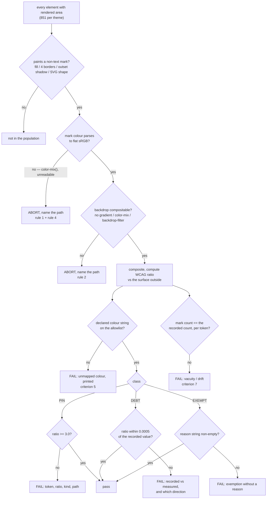

# Treko: a non-text contrast guard, on a named token allowlist

Planned 2026-08-25 in the `treko-ui-update` worktree on `feat/treko-theme-and-layout` @ `d7eda4b`,
immediately after card A (`treko-theme-and-layout.md`) merged as PR #79 (`82a9315`). Scope approved
by the user the same day. Written at `model_tier: high` (Opus 5) per the planning handoff.

**Model-switch checkpoint 2 (planning → implementation) is still owed and is unconditional.**

> **Gate status: CLOSED.** No branch, no source edit, no commit. Implementation opens only on the
> literal user phrase `gate confirmed`, and only after the compliance judge and the observability
> judge's architecting read have both recorded a verdict against this file.

## Why

> Throughout this card, **card A's criterion 5** means the existing test
> `test_criterion5_light_mode_contrast_meets_wcag`. This card's own numbered criteria live in
> §Acceptance criteria.

The board can be read in two themes. Only one of them has ever been checked for whether you can
actually see anything on it — and that one check only looks at **text**.

`test_criterion5_light_mode_contrast_meets_wcag` (`treko/test_theme.py:338`) is the entire contrast
surface of this repo. Its own name says `light_mode`, and its own docstring says it scores
"every element with non-zero rendered area" that "paint[s] a mark in their own `color`". So:

- **Dark theme has zero contrast coverage of any kind.** It is the default theme.
- **Non-text marks are unchecked in both themes.** The dot that says a branch is dirty, the border
  around a merge-wave badge, the line between two graph nodes, the five dots that say which phase a
  card is in — none of them paint in an element's `color`, so card A's criterion 5 never sees
  them.

Measured on this page at `d7eda4b`: 368 elements paint text and are scored. **336 non-text marks in
dark and 349 in light are scored by nothing.** A palette edit can wash out any of them and the whole
suite stays green — which is exactly what card A's own re-tint task did to text before card A's
criterion 5 caught it (127 violations, worst 1.64:1).

This card does not make Treko conform to WCAG 1.4.11. It makes a specific, named, human-classified
set of tokens **unable to silently regress**.

## Decisions taken during brainstorming (2026-08-25)

Each was a user decision. The implementation does not relitigate them.

1. **Scope is a regression guard on tokens, not WCAG 1.4.11 conformance.** The card says so in its
   title, its criteria, and its test docstrings. A reader who takes a green suite as a conformance
   claim has been misled by us, not by themselves. §D1.
2. **The population is a named token allowlist, classified once by a human.** Not "all marks", not
   sibling-contrast, not blanket pin-whatever-passes-today. §Background 2 is the measurement that
   forces this; §D2 is the list.
3. **The two measured defect classes are recorded as debt, not fixed here.** Repairing an inverted
   palette ramp is a design pass with its own card. §D5.
4. **Focus rings are out of scope and get their own card.** §D9.
5. **The dot population is cited by content, never by line number.** Line numbers in this file have
   drifted twice already (card A §"Review-phase addendum").

## Scope

### In

- One new browser-driven test module scoring **non-text marks** in **both** themes against a
  named token allowlist (§D2, §D8).
- The allowlist itself, as data in the test module: **23 entries** — 6 PIN, 3 DEBT and 14 EXEMPT,
  each with per-theme declared colours, a per-theme mark count, and a reason string on every DEBT
  and EXEMPT entry (§D2, §D8).
- A loud-failure rule for surfaces the probe cannot composite — gradients, `color-mix()` grounds,
  `backdrop-filter` — which must abort the check, never score (§D7).
- A vacuity floor: the check must assert it found marks at all, in each theme (§D8).
- The three debt entries recorded in this file, with their measured ratios and their call sites
  (§D5). No palette edit.
- An ADR for the allowlist decision (why a named list beats both "all marks" and "pin what passes").

### Out

- **Any palette change.** Not a re-tint, not a ramp repair, not a one-token nudge. §D5.
- **Focus rings / `:focus-visible`.** §D9. They are drivable and they pass — and saying so with a
  green tick would hide that most click targets cannot be focused at all.
- **WCAG 1.4.11 conformance.** §D1. A correct implementation of the actual success criterion fails
  261 of 336 marks in dark today; see §Background.
- **Anything only visible after an interaction.** There are **three** such regions, not one, and
  all three are out:
  1. **The settings drawer** — its own marks, its scrim, its selection ring (an inset shadow) and
     its two theme-preview swatches (§Background 5, 6).
  2. **The agent panel** — `<sc-if value="{{ agentOpen }}">` at `Treko.dc.html:302`, with
     `agentOpen` initialised `false` at `:506`. Its `--hair-3` top border (`:303`) and its grab
     handle paint only when it is open.
  3. **Hover and focus states**, including the genuine `style-hover` rules on `--hover` /
     `--hover-soft` (§D4) and every `:focus-visible` ring (§D9).

  The probe scores the page at mount, so none of the three is in the population. This is the same
  blind spot card A's criterion 5 already has; widening it is a separate card. **It is stated here
  rather than closed** — a guard that silently omits a third of the chrome is the failure mode this
  card exists to argue against, so the omission is named, enumerated and bounded instead.
- **`Treko.dc.html` command-handler region.** Card A §Risks hazard 1 still holds.

## Background: the facts the design turns on

Everything numbered here was **re-measured in this session** at `d7eda4b`, tree clean, by re-running
the planning probe and diffing its output against the stored artifact. The re-run was
**byte-identical**. Derivation is recorded in §Verification rather than only its results.

**1. The page, at mount, pinned Chrome `152.0.7977.54`:**

| | dark | light |
|---|---|---|
| elements with non-zero rendered area | 851 | 851 |
| of those, elements that paint text (the population card A's criterion 5 scores) | 368 | 368 |
| **non-text marks painted** (fill, 4 border sides, outset shadow, SVG fill/stroke) | **336** | **349** |
| distinct **declared** colour strings among those marks | 24 | 26 |
| distinct **composited** colours among those marks | 25 | 27 |
| gradient-painted elements (uncompositable) | 5 | 5 |
| colour-parse failures | 0 | 0 |

**1a. Those 336 / 349 marks reconcile exactly against the allowlist, and three of the sources are
not palette tokens.** The §D2 tables account for 321 of them in each theme; this is where the rest
go. The reconciliation is arithmetic, not narrative — it must close, and it does:

| source | dark | light | handled by |
|---|---|---|---|
| 6 PIN tokens | 55 | 55 | §D2, floor 3.0 |
| 3 DEBT tokens | 78 | 78 | §D2, recorded value |
| 13 palette EXEMPT tokens | 188 | 188 | §D2, reason string |
| `--shadow-sm` (a *shadow* token, not a colour token) | 13 | 26 | §D2 EXEMPT, 14th entry |
| sticky-header `color-mix()` ground | 1 | 1 | §D7 — aborts, never scores |
| `<svg>` root element, `rgb(0, 0, 0)` | 1 | 1 | **a probe defect** — see below |
| **total** | **336** | **349** | |

The `<svg>` root mark is not real: the root element paints nothing, and the probe scored its
inherited `rgb(0, 0, 0)`. §D7 and §Acceptance criteria 8 delete it. **So the implementation's own
totals will be 335 dark / 348 light, not 336 / 349** — this card states both numbers deliberately,
because a later reader comparing an implementation run against §Background 1 would otherwise read a
correct implementation as a one-mark regression.

`--shadow-sm` contributes 13 marks in dark (one colour) and 26 in light (**two** colours, from
`--shadow-sm: 0 1px 2px rgba(15,18,35,.06), 0 0 0 1px rgba(15,18,35,.07)` at `Treko.dc.html:40`) —
which is why the allowlist schema in §D8 must let one token own more than one declared colour
string in a theme.

**2. A correct "every mark ≥ 3:1 against its outside surface" rule is unshippable today.** Not
argued — measured on the real page:

- **261 of 336 marks fail in dark (78%)**; **258 of 349 fail in light (74%)**.
- Restricted to borders, and requiring failure against **both** adjacent surfaces (the strictest
  honest reading, since a border only needs to separate one of them): **140 of 174 in dark**,
  **132 of 174 in light**.

This is the whole justification for §D2. It is not a claim that the page is unreadable; it is a
claim that a blanket rule scores hairlines and dividers — marks whose entire job is to be nearly
invisible — as defects.

**3. Every dark/light asymmetry traces to one cause: the light palette is a hand-inverted ramp, not
a re-tinted one.** In `Treko.dc.html`, dark `--color-accent-700` is `#227a93` (a dark teal) and
light `--color-accent-700` is `#a4e2f3` (a pale blue). The light neutral ramp inverts mid-way —
`--color-neutral-700` is `#6e727e` (ink) while `--color-neutral-800` is `#e3e6ef` (paper). The ramps
are non-monotonic in light: `--color-accent-400` (`#1298b8`) is lighter than `--color-accent-500`
(`#007492`). A token that is a border in dark can be a background-weight colour in light, which is
why the same token scores 2.88 in one theme and 1.27 in the other.

**4. Interactive controls, counted in source:** 29 `onClick` attributes, 9 natively focusable
elements (6 `<button>`, 2 `<input>`, 1 `<a>`), and **0 `tabindex` attributes**. Roughly twenty
click targets cannot receive keyboard focus at all. §D9.

**5. Circular marks ("dots") in source: 5 `border-radius:50%` sites.** Three are live board
marks — the source dot, the five-per-row phase dots, the branch dot. **Two are the drawer's
theme-preview swatches, and they are hard-coded hex (`#38c4e3`, `#0e93b2`), deliberately: a preview
of the *other* theme cannot use a token, because a token would render the current theme in both
previews.** Neither appears in the measured population (drawer closed at mount) — confirmed by
searching the marks for a 7px `rgb(56, 196, 227)`: zero.

**6. Surfaces no probe can composite, and marks that do not exist at mount. The first group must
fail loudly and never score (§D7); the second is simply outside the population:**

- **5 gradient-painted elements**, from two declarations: the progress-bar fill
  (`linear-gradient(90deg, var(--color-accent-700), var(--color-accent))`) and the section-header
  rule (`linear-gradient(to right, var(--color-divider), transparent)`, repeated by `sc-for`).
- **The sticky header**, `background: color-mix(in srgb, var(--color-bg) 90%, transparent)` with
  `backdrop-filter: blur(10px)`. Chrome serialises this as `color(srgb 0.0862745 0.0941176 0.14902
  / 0.9)` — arithmetically `--color-bg` at 90%, but it does not string-match the token's declared
  value, so a raw-string allowlist index files it as UNMAPPED. §D7.
- **The drawer scrim**, `background: rgba(0,0,0,.45)` with `backdrop-filter: blur(2px)` — not
  painted at mount.
- **0 inset shadows at mount.** The drawer's selection ring is an inset shadow, so it is outside the
  population for the same reason.

**8. Two declared colours are shared by more than one token today — so the "Token" column is an
attribution, not a measurement.** The allowlist indexes marks by their declared colour string
(§D8), and a string that two tokens share cannot be attributed to one of them by machine:

- `--color-accent` and `--color-accent-500` are the **same hex in both themes** (`#38c4e3` dark,
  `#007492` light — `Treko.dc.html:25,36`); `--color-accent-2` and `--color-accent-2-500` likewise.
  `--color-accent` is a PIN token, so its 34 marks are correctly guarded either way — but a reader
  must not conclude that `--color-accent-500` is guarded, because nothing names it.
- **`--shadow-sm` in dark is the literal hex `#3f424d`** (`treko/_ds/nocturne-.../styles.css:78`,
  `--shadow-sm: 0 0 0 1px #3f424d`), which is exactly `--color-neutral-800`'s dark value. The 13
  dark card shadows therefore look like `--color-neutral-800` marks and are not: editing
  `--color-neutral-800` would not move them, and editing `--shadow-sm` would. **An earlier draft of
  this card filed those 13 marks under `--color-neutral-800`; §D2 now files them under
  `--shadow-sm`.**

The consequence is stated rather than solved: a same-value collision files a mark under whichever
entry claims the string, so the *guarantee* is over the colour, and the token name beside it is
this card's best attribution. §Risks 3.

**7. Card A's criterion-5 comment and this probe disagree on the denominator.** The comment says
"848 elements with rendered area … 367 paint a mark in their own color". This probe measures
**851 / 368** on the same page and the same Chrome build. The two predicates are not identical (this
probe's element walk is its own), so this is a discrepancy to resolve during implementation, not a
proven error in the test — **but the test's `>= 200` floor is unaffected either way**, and no
assertion depends on 848 or 367.

## Design

### D1 — What "guard", not "conformance", buys and costs

WCAG 1.4.11 asks whether a user can perceive a control's boundary. Answering it needs a human to say
which marks are load-bearing; §Background 2 shows what happens when a machine guesses instead —
three quarters of the page fails, including hairlines that are *designed* to be barely visible.

So this card answers a narrower, fully machine-checkable question: **for a named list of tokens that
pass today, does a future edit make them worse?** That is a real guarantee with a real failure mode
it catches (card A's re-tint), and it is honest about what it does not cover.

The cost is stated in the criteria and in every test docstring: a green run means *these tokens have
not regressed*, not *the board is accessible*.

### D2 — Three classes, one table, classified by hand once

**Twenty-three entries: 6 PIN, 3 DEBT, 14 EXEMPT.** Twenty-two are palette colour tokens; the
twenty-third is `--shadow-sm`, a *shadow* token whose value contains one colour in dark and two in
light (§Background 1a).

`--hair-2` and `--hair-3` are declared in `:root` and paint **zero** marks at mount, so they are not
on the list — but not because they are unused. **Each has a live call site behind an interaction
gate:** `--hair-2` on the command-copy chip (`Treko.dc.html:117`, inside `sc-for cmdCopies`, empty
at mount) and on the settings drawer's left edge (`:325`, drawer closed); `--hair-3` on the agent
panel's top border (`:303`, inside `sc-if agentOpen`, and `agentOpen` initialises `false` at
`:506`). They are gated, not dormant, and §Scope/Out puts every interaction-gated region out of this
card's population. §Risks 3.

**PIN (6)** — pass today; the guard freezes them

| Token | marks dk / lt | min ratio dk | min ratio lt | Where it paints |
|---|---|---|---|---|
| `--color-accent` | 34 / 34 | 8.01 | 4.63 | filled phase dot (28 x 5px), sidebar item left-rail, primary button border |
| `--color-accent-300` | 2 / 2 | 10.26 | 5.93 | PR-link dot (7px), tab underline (95x27 border-bottom) |
| `--ok` | 4 / 4 | 10.30 | 5.44 | status dot (3 x 7px), tab underline |
| `--warn` | 7 / 7 | 8.15 | 5.53 | status dot (3 x 7px), graph node border (180x49) |
| `--bad` | 7 / 7 | 7.23 | 6.01 | status dot (2 fills), tab underline, 2 outset shadows, SVG edge stroke, SVG node fill — **min via the SVG stroke** |
| `--info` | 1 / 1 | 7.78 | 7.19 | tab underline (95x27 border-bottom) |

**DEBT (3)** — fail today; recorded, not fixed on this card

| Token | marks dk / lt | min ratio dk | min ratio lt | Where it paints |
|---|---|---|---|---|
| `--color-accent-700` | 21 / 21 | **2.88** | **1.27** | 5 merge-wave badges x 4 border sides (20 marks) + **1 outset shadow, which is where the minimum comes from** |
| `--color-neutral-700` | 35 / 35 | **2.53** | 4.80 | 7 graph nodes x 4 border sides (28), 4 SVG fills, 3 SVG strokes — **min via an SVG stroke** |
| `--color-neutral-800` | 22 / 22 | **1.65** | **1.25** | unfilled phase dot (22 x 5px fills), and nothing else — the 13 dark card shadows that an earlier draft listed here belong to `--shadow-sm` (§Background 8) |

**EXEMPT (14)** — scored by nothing here beyond a reason string and a mark count

| Token | marks dk / lt | min ratio dk | min ratio lt | Where it paints |
|---|---|---|---|---|
| `--hair` | 42 / 42 | **1.17** | **1.20** | 1px hairlines, 4 sides |
| `--hover` | 30 / 30 | **1.13** | **1.11** | **static row separators** — `border-top:1px solid var(--hover)` at `Treko.dc.html:97,156,205,237,257,292`, repeated by `sc-for` |
| `--hover-soft` | 2 / 2 | **1.07** | **1.06** | **the selected row's fill** — computed at `:687,694,711` and applied through `:84`'s `background:{{ r.bg }}` |
| `--color-divider` | 40 / 40 | **1.55** | **1.28** | 1px dividers, 4 sides |
| `--color-bg` | 18 / 18 | **1.06** | **1.08** | page ground |
| `--color-surface` | 14 / 14 | **1.06** | **1.08** | card ground |
| `--rail` | 1 / 1 | **1.05** | **1.07** | sidebar ground |
| `--color-neutral-900` | 11 / 11 | **1.17** | **1.04** | inset well ground (progress track) |
| `--ok-bg` | 5 / 5 | **1.23** | **1.17** | ok badge fill |
| `--warn-bg` | 5 / 5 | **1.23** | **1.15** | warn badge fill |
| `--bad-bg` | 6 / 6 | **1.15** | **1.23** | bad badge fill |
| `--info-bg` | 3 / 3 | **1.14** | **1.22** | info badge fill |
| `--color-accent-900` | 11 / 11 | **1.32** | **1.03** | accent badge fill |
| `--shadow-sm` | 13 / 26 | **1.76** | **1.13** | card elevation hairline: 13 cards, one colour in dark, **two in light** |
"Min ratio" is the **minimum, over every mark that token paints, of the WCAG ratio between the mark
and the surface immediately outside it** — the strictest single number the token has to survive.
**Bold** marks a value below 3:1. `dk` = dark, `lt` = light.

The minimum is taken over *all* kinds a token paints, not over borders alone, which is why two of
the three DEBT minima come from a mark the token's name does not suggest — an outset shadow for
`--color-accent-700` and an SVG stroke for `--color-neutral-700`. The "Where it paints" column
names the kind the minimum came from, so a later reader repairing a debt entry edits the right mark.

**The recorded DEBT values, to the precision the assertion uses (§D8):**

| Token | dark | light |
|---|---|---|
| `--color-accent-700` | 2.8791 | 1.2718 |
| `--color-neutral-700` | 2.5253 | 4.8042 |
| `--color-neutral-800` | 1.6519 | 1.2477 |

These six figures were recomputed from the probe's composited colour pairs during planning; the
probe's own dump rounds to 2 dp, which is why the tables above show 2.88 and this one shows 2.8791.
Task 6 asserts these values and a mismatch is a finding to explain, never a number to overwrite.

### D3 — Why exempting the five `*-bg` fills loses no coverage

`--ok-bg`, `--warn-bg`, `--bad-bg`, `--info-bg` and `--color-accent-900` are badge fills. Each sits
directly behind badge text, and **card A's criterion 5 already scores that text against its
effective, alpha-composited background — and that background *is* this fill.** If a future edit
moves `--ok-bg` toward `--ok`, card A's criterion 5 goes red on the text before anything here would
have fired.

That is the justification, and it is a measurement about the existing check, not an aesthetic
judgement. It is deliberately *not* "these are decorative" — the word "decorative" is how an
exemption list stops being auditable.

### D4 — Why hairlines and surfaces are exempt

`--hair` at 1.17:1 and `--color-divider` at 1.55:1 are not failures; they are the design. A 1px
divider pushed to 3:1 would be a visible regression, and a guard that demanded it would be a guard
nobody could keep green. The four ground tokens (`--color-bg`, `--color-surface`, `--rail`,
`--color-neutral-900`) are what other marks are measured *against*; scoring a surface against itself
is not a meaningful question — every one of them lands at 1.04–1.08:1 for exactly that reason.

**`--hover` and `--hover-soft` are named for a state they are not in.** Despite the names, every
one of their 32 measured marks is painted at mount, with no pointer over the page: `--hover` is the
1px `border-top` separating table rows, and `--hover-soft` is the fill of the *selected* sidebar
row. Both tokens are also used in genuine `style-hover` rules elsewhere, and those marks are outside
this card's population like every other interaction-gated mark. The distinction matters because
§Risks 4 puts hover states out of scope: what is out of scope is the hover *state*, not these two
tokens, which are in the population and on the list.

Each exempt token carries its reason string in the test data (§D8), so the exemption is reviewable
in the same place the list is.

### D5 — The three defects are recorded as debt, and this card fixes none of them

- `--color-accent-700` — merge-wave badge border, **2.88 dk / 1.27 lt**. The light value `#a4e2f3`
  is a pale blue drawn on a white card.
- `--color-neutral-700` — graph node border and SVG edge, **2.53 dk** / 4.80 lt.
- `--color-neutral-800` — unfilled phase dot, **1.65 dk / 1.25 lt**. This token paints the 22 dots
  and nothing else; the 13 dark card shadows that share its hex are `--shadow-sm` (§Background 8),
  so repairing this entry means repainting the dots, not the card elevation.

**Why not fix them here:** card A's task 4 is the evidence. That re-tint moved the light text check
from **127 violations to 0** — and moved dark from **104 to 18** on the same narrowed check, which
card A records explicitly as "**not** a claim that dark passes". A palette pass on an inverted ramp
resolves one theme and leaves the other, because the ramps are non-monotonic (§Background 3). That
is a design task with its own card, its own user value-decisions, and its own before/after
measurement — not a rider on a test-only change.

**A note on the phase dot specifically, so a later reader does not "fix" the wrong thing:** measured
directly, the *filled vs unfilled* dot ratio is **4.85 dk / 4.30 lt** — a five-segment meter is read
by comparing its segments to each other, and on that reading it passes comfortably. The failing
number (1.65 / 1.25) is unfilled-dot-vs-surface. Both are true; they answer different questions.
The debt entry records the vs-surface number **and this limitation**, so nobody repaints a meter
that is already legible.

### D6 — Both themes, symmetrically, in one module

Dark is the default theme and has no contrast coverage at all. Every assertion in this card runs
**twice** — once per theme, seeded the way the app seeds it (`localStorage`, then reload; never
`data-theme` set directly), which is the pattern card A's criterion 5 establishes in its Proof C,
and the only way the check exercises the app's own mount logic rather than simulating its result.

A token whose ratio differs between themes gets **two** allowlist entries' worth of assertion, one
per theme, because §Background 3 means the two numbers have no relationship to each other.

### D7 — Uncompositable surfaces abort; they never score

A silent skip is indistinguishable from a passing check. This is not a hypothetical: the planning
probe's first version copied `parseColor` verbatim from `test_theme.py`, could not read Chrome's
`color(srgb r g b / a)` serialisation of `color-mix()`, returned alpha 0, and the caller read that
as "not painted" — **silently dropping 41 painted marks in dark (295 counted instead of 336)**. The
hardened version returns `null` and counts failures; it now reports `parseFailures: 0`.

The rule the implementation inherits:

1. A colour string the parser cannot read → **count it and fail the test**, never treat as
   transparent.
2. A mark whose backdrop includes a gradient, a `color-mix()` ground, or a `backdrop-filter` →
   **exclude by explicit, enumerated path and say so in the failure message**, never score it as if
   the backdrop were flat.
3. An allowlist token that matched **zero** marks in a theme → **fail**. A token that stopped
   painting is either a regression or a stale list; both need a human.
4. A mark whose **own colour** is a `color-mix()` or otherwise not a flat sRGB value → **abort with
   its path named**, never score. This is a separate rule from 2, which is about a mark's
   *backdrop*, and it has exactly one instance today: the sticky header's own fill,
   `color-mix(in srgb, var(--color-bg) 90%, transparent)`, one mark per theme (§Background 1a). It
   is the mark, not the ground, so rule 2 would not have caught it.

The whole pipeline, from a rendered element to a verdict — every path either asserts or aborts, and
none of them silently drops a mark:



Two further probe defects are recorded here so the implementation does not re-ship them:

- **The SVG predicate scored `rgb(0, 0, 0)` on the `<svg>` root element**, which paints nothing.
  Gate on real shape tags (`circle`, `path`, `rect`, `line`, …), not on the root.
- **A box-shadow regex read only the first colour of a multi-shadow list.** 13 of 16 outset shadows
  in light are multi-valued.

### D8 — Where it lives and what it asserts

New module `treko/test_nontext_contrast.py`, alongside `test_theme.py`, reusing `cdp_harness` +
`server_harness` exactly as card A's criterion 5 does. The allowlist is module-level data:

The allowlist entry has to carry four things the assertions read — a class, the declared colour
strings that identify the token's marks, the exact number of marks it paints, and the recorded
ratio — and **each of the last three is per theme**, because §Background 3 means a token's dark and
light figures have no relationship to each other. A token may own **more than one** colour string in
a theme (`--shadow-sm` owns two in light), so `colors` is a list:

```yaml
# shape, with two real entries. Every figure comes from the tables in §D2.
- token: "--color-accent"
  klass: pin                                  # pin | debt | exempt
  floor: 3.0                                  # pin only
  reason: null                                # required non-empty for debt and exempt
  dark:  {colors: ["rgb(56, 196, 227)"],  marks: 34, min_ratio: null}
  light: {colors: ["rgb(0, 116, 146)"],   marks: 34, min_ratio: null}

- token: "--shadow-sm"
  klass: exempt
  floor: null
  reason: "card elevation hairline; same species as --hair (§D4). Not a colour token."
  dark:  {colors: ["rgb(63, 66, 77)"], marks: 13, min_ratio: null}
  light: {colors: ["rgba(15, 18, 35, 0.06)", "rgba(15, 18, 35, 0.07)"], marks: 26, min_ratio: null}
```

`min_ratio` is populated for `debt` entries only, to 4 decimal places, from the §D2 table.

Assertions, per theme:

- **Exact mark counts, not a floor** — the total is asserted at **335 dark / 348 light**, and every
  entry is asserted at its own `marks` figure. A floor is the wrong instrument here: `≥ 200` against
  a real 335 would stay green after 134 marks disappeared, and `≥ 1` per token would stay green
  after 41 of `--hair`'s 42 went. **This is only sound because the page is deterministic**: it is
  served from the fixed tree fixture (`server_harness.build_tree`), and two independent probe runs
  in two different sessions produced byte-identical output (§Verification). Task 2 re-confirms that
  before the counts are written in; if it does not reproduce, the counts become floors at the
  measured value and the card records why.
- **PIN** — every mark of every `pin` token is ≥ 3.0:1 against its outside surface. Failure message
  names the token, the ratio, the mark's kind and its path.
- **DEBT** — asserted at its **recorded measured value to 4 dp**, not at 3.0, **tolerance
  ±0.0005**, so the debt is pinned in place: it goes red if the token gets *worse*, and it also goes
  red if it gets *better* — because that means someone repaired it and the debt entry in this card
  is now a lie. The failure message states the recorded value, the measured value, and which
  direction it moved.

  **Where ±0.0005 comes from, and why it is not load-bearing.** The tolerance absorbs float
  formatting, nothing else: the ratio is pure arithmetic over composited sRGB triples, and the two
  byte-identical probe runs show there is no measurement noise to absorb. It is *not* sized to catch
  the smallest possible palette edit and cannot be — a one-step (1/255) change on a single channel
  moves these six minima by between **0.0009 and 0.0057** (measured, §Verification), so ±0.0005 is
  under the smallest of them, but only by a factor of 1.8, and a lateral hue change at equal
  luminance would not move the ratio at all. **The assertion that actually catches a changed token
  value is Coverage**, below: any edit to a DEBT token changes its declared colour string, the
  string stops matching the entry's `colors`, and the test fails with it printed. The DEBT ratio
  assertion guards the other direction — the token is untouched but what it sits on moved.
- **EXEMPT** — asserted only to have a non-empty `reason`, and to match its `marks` count. No ratio.
- **Coverage** — every distinct declared colour among the measured marks maps to exactly one
  allowlist entry, and every entry's `colors` match at least one mark, or the test fails with the
  offending string printed. This is what stops the list going stale as the page grows, and it is the
  assertion that makes an edit to *any* token's value fail loudly.

### D9 — Focus rings are out, and the reason is not "they fail"

They pass. A real `Input.dispatchKeyEvent` (rawKeyDown/keyUp, VK 9) makes `:focus-visible` match and
paints a 2px `rgb(56, 196, 227)` ring. The reason to exclude them is §Background 4: **9 of 29 click
targets can take focus, and there are 0 `tabindex` attributes on the page.** A green focus-ring tick
would certify the ring on the 9 while saying nothing about the ~20 that can never show one — a
guard that is most reassuring exactly where the coverage is worst.

Their own card should fix the tabindex gap first, then guard the ring. It is also worth noting that
no existing code drives focus at all — `cdp_harness` sends only Page and Runtime methods today, so
that card adds an `Input` capability to the harness.

## Scenarios

```gherkin
Scenario: The board is untouched and the guard is quiet
  Given Treko.dc.html is unmodified at the implementation HEAD
  And the pinned Chrome 152.0.7977.54 renders the fixed tree fixture
  When the non-text check runs
  Then it finds exactly 335 marks in dark and 348 in light
  And all 23 allowlist entries match their recorded mark counts in both themes
  And every distinct declared colour among those marks maps to exactly one entry
  And the 6 PIN tokens are all at or above 3.0:1
  And the 3 DEBT tokens are all within 0.0005 of their recorded values
  And the check passes

Scenario: A pinned token is dulled toward its background
  Given --color-accent passes at 8.01:1 in dark and 4.63:1 in light
  When an edit moves --color-accent to a value 2.4:1 against --color-surface
  Then the non-text check fails in both themes
  And the message names --color-accent, the ratio, and the 5px span it paints

Scenario: A recorded defect is silently made worse
  Given --color-accent-700 is recorded as debt at 1.27:1 in light
  When an edit takes it to 1.10:1
  Then the debt assertion fails
  And the message says the recorded value is 1.27 and the measured value is 1.10

Scenario: A recorded defect is repaired
  Given --color-accent-700 is recorded as debt at 1.27:1 in light
  When a later palette card lifts it to 3.4:1
  Then the debt assertion fails
  And the message says to move the token from debt to pin and update this card

Scenario: A new token starts painting a mark
  Given the allowlist's 23 entries cover every mark painted today
  When an edit introduces a mark in a colour on no allowlist entry
  Then the coverage assertion fails with the unmapped colour string printed

Scenario: An allowlisted token stops painting
  Given --info paints exactly one mark, a tab underline
  When an edit removes that underline
  Then the vacuity assertion fails rather than passing on an empty set

Scenario: A backdrop becomes uncompositable
  Given a mark is scored against a flat surface today
  When an edit puts a gradient behind it
  Then the check fails naming that mark as unscoreable
  And it does not silently drop the mark or score it against a guessed colour

Scenario: The check runs on the default theme
  Given no taskTracker.theme is set
  When the suite runs
  Then dark is scored with the same assertions as light
```

## Acceptance criteria

1. `treko/test_nontext_contrast.py` exists and runs both themes through the app's own seed-and-
   reload path, never by setting `data-theme` directly.
2. Every one of the 6 PIN tokens is asserted ≥ 3.0:1 in both themes, against the surface outside
   the mark, on every mark it paints.
3. Every one of the 3 DEBT tokens is asserted at its recorded 4-dp value with a tolerance of
   **±0.0005**, and the assertion fails on movement in **either** direction.
4. Every one of the 14 EXEMPT tokens carries a non-empty, specific reason string. No exemption reads
   "decorative".
5. Every distinct declared colour among the measured marks maps to exactly one allowlist entry, and
   every entry's declared colours match at least one mark; either failure prints the offending
   string. `--shadow-sm` maps **two** colours in light and one in dark, and the check handles that
   without a special case.
6. A parse failure, a gradient backdrop, a `color-mix()` ground or a `backdrop-filter` backdrop
   **fails** the test; none of them is scored and none is silently skipped.
7. Mark counts are asserted **exactly**, not as floors: 335 in dark and 348 in light, and every one
   of the 23 entries at its own per-theme figure. If task 2 finds the page is not reproducible run
   to run, the counts become floors at the measured value and this card records that it did.
   The 335/348 figures are 336/349 minus the one `<svg>`-root artefact per theme (criterion 8).
8. The SVG predicate scores only real shape elements; the `<svg>` root is never scored.
9. Box-shadow parsing reads every colour in a multi-shadow list, not only the first.
10. No file under `treko/` other than the new test module and its registration changes. **Zero
    palette edits** — verified by a diff over `:root` and the `body[data-theme="light"]` block.
11. Each test docstring states plainly that a green run means "these tokens have not regressed", not
    "the board is accessible".
12. Full suite green, on the pinned Chrome, recording **which tests ran** and the passed/failed/
    deselected counts against the pre-change baseline — a bare pass count cannot show that the new
    module was collected.
13. The two live colour collisions (§Background 8) are stated in the test data as a comment on the
    affected entries: `--color-accent` shares its value with `--color-accent-500`, and
    `--shadow-sm`'s dark value equals `--color-neutral-800`'s. A reader must not conclude from a
    green run that `--color-accent-500` is guarded.

## Pinned versions

Carried forward from `docs/features/treko-theme-and-layout.md` §"Pinned versions", unchanged.

| Tool | Version | Where it is fixed |
|---|---|---|
| Python | 3.9.6 | the interpreter this repo's suite runs under |
| pytest | 8.4.2 | test runner |
| Chrome | `152.0.7977.54` | `treko/cdp_harness.py:60`, `PINNED_VERSION`; asserted before launch |

**No new dependency.** The check needs `cdp_harness`, `server_harness` and the stdlib only.

**Chrome drift is a hard blocker, not a flake.** `cdp_harness.Chrome.__init__` asserts the pin
before it launches anything, so an auto-update fails every browser test at construction — before any
of them reaches a page. If that happens mid-implementation, re-pin and **re-measure the allowlist
table**; ratios from two builds are not comparable, and the DEBT assertions in criterion 3 are
recorded numbers.

## Tasks

Red half and green half are separate commits throughout; never the same commit
(`rules/core-conduct.md`, Testing).

1. **Baseline.** Full suite on the pinned Chrome; record passed / failed / deselected **and which
   tests ran**. Re-run the measurement and confirm the table in §Background 1 still reproduces at
   the implementation HEAD. **Run it twice and diff the two dumps** — the exact counts in §D8
   depend on that reproducibility, and it is cheap to re-establish rather than inherit.
2. **Red:** the harness and the count assertions — walk the page, collect non-text marks in both
   themes, assert the exact totals and `parseFailures == 0`. No allowlist yet. Must fail first for a
   stated reason.
3. **Green:** land the walk. Confirm **335 / 348** — 336 / 349 minus the one `<svg>`-root artefact
   per theme — and that the three §D7 probe defects are absent (SVG root not scored; multi-shadow
   read in full; `color(srgb …)` parsed). If the totals come back 336 / 349, the SVG-root fix did
   not land and criterion 8 is unmet, whatever the other assertions say.
4. **Red:** the coverage assertion — every distinct declared colour maps to an allowlist entry.
5. **Green:** land the allowlist data, all 23 entries with class, per-theme colours, per-theme mark
   count, and reason; the two collision comments required by criterion 13.
6. **Red:** PIN and DEBT assertions.
7. **Green:** land them; both themes go green with zero palette edits.
8. **Falsify — nine cases, not six.** For each of: PIN below floor, DEBT worse, DEBT better,
   coverage (unmapped colour), count drift, uncompositable backdrop, **colour-parse failure**,
   **`<svg>`-root scored**, and **multi-shadow read as single** — introduce the defect in a
   throwaway copy, confirm the test goes red, and **record which assertion caught it**. A count of
   "9 of 9 caught" without naming the catching assertion is not evidence.

   The last three are on this list because they are the card's own origin story: the planning probe
   shipped all three (§D7), and criteria 6, 8 and 9 would otherwise ship with no falsifier at all.
   **Record the nine cases and their catching assertions in this file**, not only in the throwaway
   copy — a falsifier that is discarded proves the check worked once, on a day nobody can revisit.
9. Prove criterion 10 — diff `:root` and the light block against the base; expect zero lines.
10. ADR; update `docs/features/` links and the `treko` skill's UI notes.
11. Observability judge, then PR.

## Risks

1. **The list goes stale as the page grows.** Mitigated by the coverage criterion (§Acceptance
   criteria 5) — a new colour fails loudly. Not mitigated for a token that changes *role* while
   keeping its value.
2. **The DEBT assertions are recorded numbers and will need re-recording after any Chrome re-pin.**
   Stated in §Pinned versions; the failure is loud, not silent.
3. **Attribution by colour string is ambiguous, and two collisions are live today — not
   hypothetical.** `--color-accent` and `--color-accent-500` are the same hex in both themes, and
   `--shadow-sm`'s dark value is the same hex as `--color-neutral-800` (§Background 8). Marks are
   filed under whichever entry claims the string, so **the guarantee is over the colour; the token
   name beside it is this card's attribution, and criterion 13 makes that explicit in the data.**
   The alternative — indexing by CSS custom-property name — is not available: `getComputedStyle`
   does not give the property name back for a resolved mark. Accepted, disclosed, not solved.

   The same ambiguity is what limits the coverage criterion's reach over `--hair-2` and `--hair-3`,
   which paint nothing at mount (§D2). If their gated call sites ever paint, criterion 5 catches
   them only because their colour strings are genuinely new; a future token sharing a value with an
   existing entry would be filed silently under that entry instead.
4. **Marks only visible after interaction are outside the population** — the drawer, its scrim,
   its selection ring, hover states, and the two theme-preview swatches. This is the blind spot
   card A's criterion 5 already has, inherited deliberately (§Scope/Out) and stated rather than
   closed.
5. **A green suite will be read as an accessibility claim** by someone who does not read the
   docstrings. Mitigated by criteria 1 and 11 and by the card's title; not eliminated.

## Verification

### What was measured during planning, and how to re-run it

The probe is `nontext_probe.py` in this session's scratch directory — **throwaway, not committed,
not a test**. It walks the real board in the pinned headless Chrome via `cdp_harness` +
`server_harness` and dumps every painted non-text mark in both themes with its adjacent surfaces and
ratios, to `nontext_marks.json`. `allowlist.py` reduces that dump to the per-token rows in §D2.

Run as: `TREKO_CHROME_DENY_BIRD=1 python3 nontext_probe.py`, then `python3 allowlist.py`.

**Re-run receipt, 2026-08-25, at `d7eda4b`, tree clean:** the probe was re-run in this session and
its output compared to the stored artifact from the earlier planning session.
`json.dumps(a, sort_keys=True) == json.dumps(b, sort_keys=True)` → **True**; the reduced allowlist
rows likewise compared **equal**. Every number in §Background 1, §Background 2 and the §D2 tables
comes from that re-run, not from a copied note.

### Corrections to the planning notes, made by that re-measurement

Recorded because a wrong number in an audit trail costs more than the error it describes.

- **Distinct colours are 24 dk / 26 lt declared, 25 dk / 27 lt composited.** The planning notes gave
  "25 / 27" without saying which; both figures are now stated with their predicate.
- **Borders failing against both adjacent surfaces are 140/174 dk and 132/174 lt.** The planning
  notes said "154/159"; that does not reproduce, and there are 174 border marks in each theme with
  none unscorable.
- **Filled-vs-unfilled phase dot is 4.85 dk / 4.30 lt.** The planning notes read "8.01 vs 1.65";
  those two numbers are filled-vs-*surface* and unfilled-vs-*surface*, a different comparison. The
  conclusion (the meter is legible segment-to-segment) survives; the number did not.
- **There are 5 `border-radius:50%` sites, not 6**, and two of them are drawer preview swatches
  outside the measured population (§Background 5).
- **"13 exempt" was a count of *palette* tokens that actually paint.** The planning notes listed 15
  names; two of them (`--hair-2`, `--hair-3`) paint zero marks at mount. **The compliance round then
  raised it to 14** by adding `--shadow-sm`, which is a shadow token rather than a colour token and
  was missing from the population entirely.
- **The drawer scrim is `background: rgba(0,0,0,.45)`, not an element at `opacity: .45`.**

### Corrections made in the compliance round, 2026-08-25 (round 1 verdict: fail)

Both judges ran against `3a791ac` and the compliance judge returned **fail** with 7 violations. Each
was re-measured against `nontext_marks.json` before it was accepted; these are the ones that changed
a number or a claim, not merely wording:

- **The §D2 tables did not account for every measured mark.** They summed to 334 dark / 321 light
  against a measured 336 / 349, so criterion 5 would have failed on the module's first run. The
  reconciliation is now §Background 1a and it closes exactly. The missing marks are `--shadow-sm`
  (13 dark / 26 light), the sticky-header `color-mix()` ground (1 each) and the `<svg>`-root
  artefact (1 each).
- **`--color-neutral-800` paints 22 marks in dark, not 35.** The other 13 are `--shadow-sm`, whose
  dark value is the literal hex `#3f424d` (`treko/_ds/nocturne-.../styles.css:78`) — the same hex,
  a different token. Its recorded minimum, 1.65, is unchanged: it comes from the dots, and the
  shadows sit at 1.76.
- **`--color-accent-700`'s minimum comes from an outset shadow, not a border**, and
  `--color-neutral-700`'s from an SVG stroke. Both tables previously described only the borders.
- **`--hover` and `--hover-soft` are not hover marks.** All 32 measured marks are painted at mount:
  `--hover` is the static row separator at `Treko.dc.html:97,156,205,237,257,292`, `--hover-soft`
  the selected row's fill (`:687,694,711` through `:84`). §D4.
- **`--hair-2` and `--hair-3` are gated, not dormant** — three live call sites (`:117`, `:303`,
  `:325`), which also surfaced the agent panel (`sc-if agentOpen`, `:302`) as a second
  interaction-gated region missing from §Scope/Out.
- **Two colour collisions are live** (§Background 8), one of them on a PIN token.

### The DEBT tolerance is a measured number, not a chosen one

`±0.0005` at 4 dp comes from measuring what the smallest expressible palette edit does. Perturbing
each DEBT token's minimum-ratio mark by one 8-bit step on each channel, in both directions, in both
themes, moves the ratio by:

| Token | dark | light |
|---|---|---|
| `--color-accent-700` | 0.0023 | 0.0010 |
| `--color-neutral-700` | 0.0033 | 0.0057 |
| `--color-neutral-800` | 0.0022 | 0.0009 |

The smallest is **0.0009**, so ±0.0005 sits under every one of them — but by a factor of 1.8, not by
an order of magnitude, and it says nothing about an equal-luminance hue change. That is why §D8
records the Coverage assertion, not this tolerance, as the guard against an edited token value.

### What was NOT verified

- **"902 body descendants."** Carried in the planning notes, not reproducible from the stored
  artifact (which records `elementsWithArea` and `textPainters` only) and not re-measured this
  session. **Dropped from this card rather than repeated.** The related discrepancy — this probe's
  851/368 against card A's inline comment of 848/367 — is recorded at §Background 7 as a discrepancy
  to resolve during implementation, not as a proven error.
- **No implementation exists.** Nothing in §Tasks has been run. The allowlist's *classification* is
  a human decision recorded here; only its *ratios* are measured.
- **The focus-ring behaviour in §D9** was established in the earlier planning session and is not
  re-measured here. It is out of scope, so no assertion in this card depends on it.
