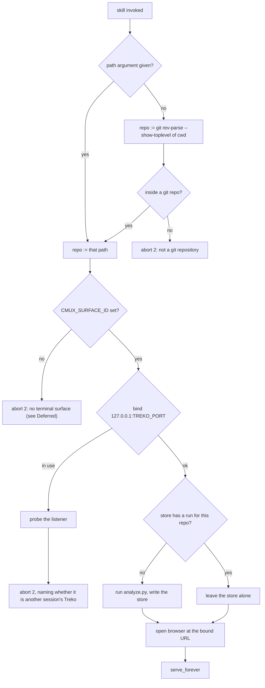

# Treko: rename the tracker, and launch it without being asked

This is **card 1 of 5** in the Treko series. It renames the feature-state tracker to Treko across
every layer this repo owns, ports the Treko-branded page in from the design prototype, and makes the
skill start the server and open the browser itself instead of printing instructions.

It deliberately ships **no new tracker behaviour**. The Ledger list, the dashboard upgrades, the
agent panel and the analyzer's up/down traversal are cards 2–5; see §Deferred.

## Why

The tool is called Treko now. Today it is called `tracking-feature-state` as a skill,
`task-tracker` as a directory, `TASK_TRACKER_PORT` as an environment variable, and "Task Tracker" on
its own page. Four names for one thing is four chances to look up the wrong one, and the four
remaining cards all touch these files — renaming later means renaming a moving target.

The launch change has a separate reason. The skill currently ends by printing a command for a human
to run and a URL for a human to paste. That is a survey tool asking you to do three steps before it
answers the question you asked. Every one of those steps is a place to stop.

## What already exists, measured

The design prototype at `~/Other Docs/AI/AI_Projx/Prototypes/Treko/Treko/` is **ahead of this repo**.
Re-derive rather than trusting this paragraph:

```sh
diff "$PROTO/Task Tracker.dc.html" task-tracker/"Task Tracker.dc.html"
```

On 2026-08-21 that diff showed the prototype already carrying: the Treko icon in place of the
`ph-crosshair` glyph, the sidebar title "Treko", nested feature → story → task rows with Rally
links, a per-run delete affordance, a re-analyze button, and a retinted accent palette
(`--color-accent:#38c4e3`). It also carries markup this card does **not** adopt — an agent panel
(`agentOpen`, `agentMsgs`, `agentH`), a resizable sidebar (`taskTracker.sidebar`) and an expand
overlay — all of which are card 3 and card 4 work with no backend behind them.

Two requested behaviours exist in **neither** place, and are named as future work rather than
silently assumed: renaming a run (`grep -ci 'pencil\|rename'` over the prototype page returns `0`)
and the agent token counter (`grep -oi 'token[a-z]*'` returns nothing).

The prototype's `Ledger.dc.html` has no counterpart in this repo at all. It is card 2.

## Decision: the data contract does not get renamed

**ADR 0023** records that the `tracker-data` shape — the file `tracker-data.js`, the global
`window.TRACKER_DATA`, and the `runs[]`/`features[]`/`branches[]`/`waves[]` schema inside it — is
owned by the Nocturne export, not by this repo, and that this repo's analyzer is a *producer*
conforming to it. Its stated rule is "read the schema, do not redesign it."

The owner has not moved. Measured in the prototype on 2026-08-21:

| identifier | occurrences |
|---|---|
| `tracker-data.js` | 11 |
| `window.TRACKER_DATA` | 7 |
| `taskTracker.*` localStorage keys | 24 across 7 distinct keys |

Three of those keys — `taskTracker.sidebar`, `taskTracker.agentH`, `taskTracker.resolved` — are
**new in the prototype**, added for the very features cards 3 and 4 will build. So the owner is
actively extending the old namespace, not retiring it.

Renaming these on our side would therefore not complete the rename; it would fork us from the design
source and turn every future export into a manual merge — the exact cost ADR 0023 exists to prevent.
**The data contract keeps its current names.** Card 1 records this in a new ADR and moves on.

## Scope: the rename map

Four layers change. Everything is `git mv` so history follows the file.

| Layer | From | To |
|---|---|---|
| Skill directory | `skills/tracking-feature-state/` | `skills/treko/` |
| Skill frontmatter | `name: tracking-feature-state` | `name: treko` |
| Code directory | `task-tracker/` | `treko/` |
| Served page | `Task Tracker.dc.html` | `Treko.dc.html` |
| Port variable | `TASK_TRACKER_PORT` | `TREKO_PORT` |
| Idle timeout | `TASK_TRACKER_IDLE_SECS` | `TREKO_IDLE_SECS` |
| Poll interval | `TASK_TRACKER_POLL_SECS` | `TREKO_POLL_SECS` |
| Analyzer timeout | `TASK_TRACKER_ANALYZE_SECS` | `TREKO_ANALYZE_SECS` |

Unchanged, by the decision above: `tracker-data.js`, `tracker-data-fallback.js`,
`tracker-data.sample.js`, `tracker-data.json`, `window.TRACKER_DATA`, every `taskTracker.*`
localStorage key, and the `store.py` constants `ASSIGNMENT` and `SCHEMA_VERSION`.

`store.py`'s `TOOL` string (`"task-tracker v0.4.1"`) is a **producer identifier written into the
store**, so it is part of the contract's payload, not its shape. Change it to `"treko v0.5.0"` only
after confirming no consumer reads it; if in doubt it stays and becomes a `questions[]` note. Do not
guess — `grep -rn 'TOOL\|tool' ` the prototype before deciding.

### Files that change

Re-derive the set; do not trust a count written here:

```sh
git grep -l -iE 'task[-_ ]tracker' | grep -vE '^(docs/decisions/|coding-memory/|docs/features/(tracking-feature-state|readme-roadmap-upkeep))'
```

That is the in-scope set. It resolved to the `task-tracker/` tree plus
`skills/tracking-feature-state/SKILL.md`, `PORTS.md` and a `.gitignore` comment on 2026-08-21.
`CLAUDE.md`'s skills-catalog line and `README.md`'s roadmap entry also change; neither contains the
literal string, so neither appears in that grep — check both by hand.

### Files that deliberately do NOT change

| Path | Why |
|---|---|
| `docs/decisions/0022`, `0023`, `0024`, `0025` | An ADR records what was decided when it was decided. Rewriting the name inside a merged decision falsifies the record. The rename gets its own ADR instead. |
| `coding-memory/*/verdicts.jsonl` | The frozen, append-only judge ledgers (ADR 0031). Never edited in place. |
| `docs/features/tracking-feature-state.md` / `.spec.md` | That card is `phase: implementation` on branch `fix/tracker-frontmatter-comment`. It belongs to that branch. Touching it here guarantees a conflict and violates the phase gate. |
| `docs/features/readme-roadmap-upkeep.md` | `phase: review` on `docs/readme-roadmap-task-tracker`. Same reason. |
| `task-tracker/tracker-data.js` content | Generated. It moves with the folder; its contents are rewritten by the next analysis, not by hand. |

This leaves the repo with correct-but-old names in its decision history and in two in-flight cards.
That is intended and is recorded here so a later reader does not "fix" it.

## Design: auto-launch



Three points on that flow are load-bearing.

**Resolving no-path.** `git rev-parse --show-toplevel` run in the cwd, not `$PWD` itself — a skill
invoked from a subdirectory should survey the repo, not the subdirectory. Outside a repository it is
an abort with that reason named, never a survey of an arbitrary directory.

**First-run analysis.** A no-path launch into a repo with no run would otherwise open an empty page,
which reads as "nothing is in flight" rather than "nothing has been measured". The analyzer runs
first in that case only. A repo that already has a run is **not** re-analyzed on launch — that would
make every launch pay the analyzer's cost and would silently overwrite a survey the user was reading.
Re-running is what the existing `reanalyze` button is for.

**The busy port does not auto-open.** When the bind fails because something already holds the port,
the server probes it and reports what it found, then exits `2`. It does **not** open a browser at the
existing server. That server belongs to a different Claude session and its command buttons type into
*that* session — opening it would hand the user a control channel aimed at a session they did not
launch. The skill's own docs record the precedent: a send at a *deduced* surface once reached a
different live Claude session at exit `0`. Naming the situation is the fix; routing around it is not.

The probe is `GET /` with a 2s timeout, and it may only distinguish two outcomes: *a Treko page came
back* or *it did not*. It must not attempt to identify **which** session owns it — nothing in the
response can answer that, and a confident-sounding guess there is worse than none.

### Serving a `.png`

`server.py` serves a closed list (`STATIC_MANIFEST`) and refuses to start if any entry's extension is
absent from `EXTENSION_TYPES` (`check_manifest_types`). `treko-icon.png` therefore needs **both** a
manifest row and an `.png: image/png` type entry. Copy only `treko-icon.png` (~91 KB);
`treko-logo.png` is ~1.2 MB and is used by the prototype's landing page, which is out of scope.

### Re-vendoring the ported markup

The prototype loads Phosphor from `unpkg.com` and Inter from `fonts.googleapis.com`. This repo
vendors both. Porting the prototype's page must swap those back:

| prototype | repo |
|---|---|
| `https://unpkg.com/@phosphor-icons/web@2.1.1/src/regular/style.css` | `vendor/phosphor/regular/style.css` |
| `https://unpkg.com/@phosphor-icons/web@2.1.1/src/fill/style.css` | `vendor/phosphor/fill/style.css` |
| `@import url('https://fonts.googleapis.com/css2?family=Inter…')` | `@import url('vendor/inter/inter.css')` |

and must re-add the two script tags the prototype does not have: `./vendor-resources.js` and
`tracker-data-fallback.js`.

A launched page that reaches the network at all is a defect, not a cosmetic issue: the server binds
`127.0.0.1` precisely so a survey of a private repo never leaves the machine.

## Acceptance criteria

1. **Given** the repo at this card's merge commit, **when** `git grep -iE 'task[-_ ]tracker'` runs
   excluding `docs/decisions/`, `coding-memory/` and the two out-of-scope cards, **then** it returns
   no results.
2. **Given** the same commit, **when** `ls skills/` runs, **then** `treko/` exists and
   `tracking-feature-state/` does not.
3. **Given** the same commit, **when** `git log --follow treko/server.py` runs, **then** it shows
   commits predating this card — the move preserved history.
4. **Given** the five existing test modules, **when** the suite runs from `treko/`, **then** every
   test that passed before the rename passes after it, with the same count. Record the count from a
   run, not from this document.
5. **Given** `TREKO_PORT=9001`, **when** the server starts, **then** it binds 9001; **and given**
   `TASK_TRACKER_PORT=9001` with `TREKO_PORT` unset, **then** it binds the default 8422 — the old
   name is dead, not silently honoured.
6. **Given** a repo with no run in the store and a valid cmux surface, **when** the skill is invoked
   with no path from a subdirectory of that repo, **then** the analyzer runs once against the repo
   root, the store gains exactly one run, and a browser opens at the bound URL.
7. **Given** a repo that already has a run, **when** the skill is invoked with no path, **then** the
   analyzer does **not** run and the store's `generated_at` is unchanged.
8. **Given** the cwd is not inside a git repository, **when** the skill is invoked with no path,
   **then** the server exits `2` with a message naming that reason, and no browser opens.
9. **Given** `TREKO_PORT` is already held by another process, **when** the server starts, **then** it
   exits `2`, its message states whether a Treko page answered the probe, and **no browser opens**.
10. **Given** the served page, **when** it is loaded with the network unavailable, **then** it renders
    with correct icons and typography — no request leaves `127.0.0.1`.
11. **Given** `STATIC_MANIFEST` contains `treko-icon.png`, **when** the server starts, **then**
    `check_manifest_types` passes; **and when** `GET /treko-icon.png` is requested, **then** the
    response carries `Content-Type: image/png`.
12. **Given** the renamed page, **when** the server starts, **then** `check_index_injectable` finds a
    `<head>` in `Treko.dc.html` and the per-launch token is injected at request time — never written
    to disk.
13. **Given** the store written by the renamed tool, **when** the prototype's unmodified
    `Ledger.dc.html` and `Task Tracker.dc.html` load it over `file://`, **then** both render — proving
    the data contract was not forked.
14. **Given** this card's branch, **when** `docs/decisions/` is listed, **then** exactly one new ADR
    exists recording the rename and the ADR 0023 ruling, and ADRs 0022–0025 are byte-identical to
    their state on `main`.

## Deferred

Named here so cards 2–5 inherit them explicitly, and so no reader mistakes them for oversights.

- **Treko cannot run outside cmux.** The server exits `2` when `CMUX_SURFACE_ID` is unset, because the
  keystroke surface is inherited and never deduced. Auto-launch does not change this, so
  "always launches" is true inside cmux and **false** outside it. Making Treko serve a
  degraded, no-control-channel page outside cmux — buttons become copy-chips, `reanalyze` still
  works because it sends no keystroke, `POST /command` returns `503` — is agreed follow-up work and
  is not in this card. Decided 2026-08-21.
- **Renaming a run** (card 3) exists in neither the repo nor the prototype.
- **The agent panel's token counter** (card 4) has **no data source today**. The cmux channel is
  write-only: it types characters at a terminal and cannot read a token count back. Any number shown
  in that top bar while the panel drives the launching session would be fabricated. Card 4 must
  resolve this before the counter is built — see `rules/core-conduct.md`, "never render a metric the
  payload cannot source".
- **Agent-panel persistence past session close** (card 4) contradicts the server's parent-pid
  watchdog, which exists so a channel that can type into a full-permission session cannot outlive
  that session. Card 4 must decide this deliberately; the likely shape is a separate Claude process
  Treko owns rather than the borrowed cmux surface.
- **The Ledger list and its persistent queue** (card 2), **the dashboard upgrades** (card 3), and
  **the analyzer's up/down traversal with PRs** (card 5).

## Pinned versions

| Tool | Version | Where it is fixed |
|---|---|---|
| Python | 3.9.6 | the interpreter this repo's suite runs under; `server.py` targets stdlib only |
| pytest | 8.4.2 | test runner |
| Phosphor Icons | 2.1.1 | already vendored under `vendor/phosphor/` — do not re-fetch |
| Inter | vendored `inter-latin.woff2` | `vendor/inter/` — no version upstream; the file is the pin |
| Nocturne export | `73641b21-c7ad-488a-8264-a28262dfe83e`, schema `version: 1` | `_ds/` directory name; ADR 0023 |

No new dependency is added by this card. Adding one would need a separate ask
(`rules/core-conduct.md`, Parallel-Agent Invariants).

## Tasks

- [ ] 0. Branch `feat/treko-rename` + worktree. **Only after `gate confirmed`.**
- [ ] 1. **Red first.** Add the failing tests for criteria 5, 6, 7, 8, 9 and 11 against the *current*
      names, and confirm each fails for the stated reason. Do not touch implementation in this step.
- [ ] 2. Record the pre-rename suite count from an actual run; paste the output into §Verification.
- [ ] 3. `git mv task-tracker treko` and `git mv skills/tracking-feature-state skills/treko`. Fix
      `SERVE_ROOT`-relative paths, `conftest.py`, `server_harness.py` and the five test modules until
      the suite is green again at the same count as task 2.
- [ ] 4. Rename the four environment variables in `server.py`. Assert the old names are **not** read
      (criterion 5) — a silent fallback is the failure mode here.
- [ ] 5. `git mv "treko/Task Tracker.dc.html" treko/Treko.dc.html`; update `INDEX_FILE` and
      `check_index_injectable`'s message.
- [ ] 6. Port the prototype page's markup: Treko icon, sidebar title, retinted accent palette, nested
      rows. Swap the three CDN references back to vendored paths and re-add the two script tags
      (§Re-vendoring). Copy `treko-icon.png` in; add its manifest row and `.png` type entry.
- [ ] 7. **Prove no network egress** (criterion 10). A grep for `http` in the page is not sufficient
      evidence — load the served page with the network down, or assert on the request log. State
      which check was run and what it cannot see.
- [ ] 8. Implement auto-launch: `--open`, no-path repo resolution via `git rev-parse --show-toplevel`,
      first-run-only analysis, and the busy-port probe that reports and exits without opening.
- [ ] 9. Rewrite `skills/treko/SKILL.md`: `name: treko`, the description, the single launch command,
      and the trigger phrases. Keep the two "both fail silently" warnings about detaching and
      redirecting stderr — auto-launch does not retire either.
- [ ] 10. `PORTS.md` row, `README.md:62` roadmap entry, `CLAUDE.md` skills-catalog line, `.gitignore`
      comment.
- [ ] 11. Verify criterion 13 by hand: load the prototype's two unmodified pages against the store
      this tool writes.
- [ ] 12. ADR `docs/decisions/0033-…` — the rename, and why the data contract was exempted. Confirm
      `0033` is still free against `origin/main` **and** every other ref at the moment of writing;
      `0032` is already taken on another branch, `0028` is a gap, and `0030` exists on `origin/main` but
      not in this worktree — so the next number is not derivable from a local `ls`.
- [ ] 13. Full suite green; record the post-rename count run, not read. Fill §Verification.
- [ ] 14. Observability judge, then draft PR.
- [ ] 15. Close the card: set `phase: review`, and record here which of §Deferred card 2 inherits.

## Risks

- **A silent env-var fallback.** Renaming a variable while leaving `os.environ.get` reading the old
  name too is the easy, invisible mistake: everything passes, and the rename is half-done in the one
  layer nobody re-reads. Criterion 5 asserts the negative deliberately.
- **The suite passing for the wrong reason.** After a directory move, an import that silently resolves
  to the *old* tree still on disk would pass. Task 3 must run from a clean checkout, or delete the old
  path before running.
- **Forking the data contract by accident.** A find-and-replace over `task.tracker` case-insensitively
  will also hit `taskTracker.*` and `tracker-data`. Scope every replacement; criterion 13 is the
  backstop that catches it.
- **The prototype moving underneath us.** It is a live design source outside this repo and outside
  version control here. Task 6 should record the prototype's file mtimes it ported from, so a later
  reader can tell whether the source has changed since.

## Verification

_Filled during implementation. Nothing here is written before the command that produces it has been
run and its output re-read._
