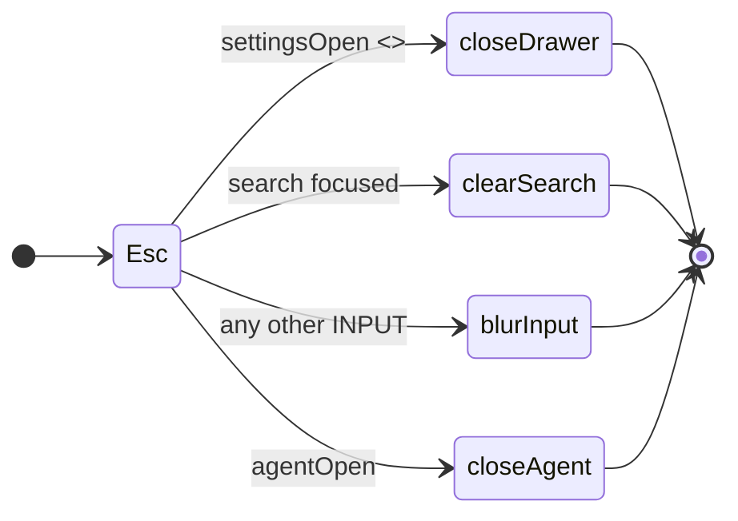

# Treko: a Configuration drawer, a light theme, and a sidebar you can drag

Planned 2026-08-23 on `main` @ `984e7ac`, in the `treko-ui-update` worktree, immediately after
card 1 (`treko-rename`, PR #64) and the store-location follow-on (PR #68) merged. Scope approved by
the user the same day.

**Model-switch checkpoint 1 (entering planning): not separately asked.** The user directed this card
be written at `model_tier: high` in the same instruction that set its scope, and it was. Recorded as
what happened rather than as a checkpoint that was run — checkpoint 2 (planning → implementation) is
still owed and is unconditional.

> **Gate status: CLOSED.** No branch, no source edit, no commit. Implementation opens only on the
> literal user phrase `gate confirmed`, and only after the compliance judge and the observability
> judge's architecting read have both recorded a verdict against this file.

This is the **UI half deferred by `treko-store-location.md` §"Deferred — the UI half"**. That section
promised three drawer sections; this card ships **two**, and §D9 records why the third is dropped
rather than deferred again.

## Why

Two complaints, one root cause.

**The board is dark-only, and it cannot be otherwise.** Not because anyone chose that, but because
the colours are typed into the markup. `data-theme` has **0 occurrences** anywhere under `treko/`
(verified at `984e7ac`; the only two hits in the repo are a judge ledger and the store-location
card's own prose). Twenty-seven colour literals sit inline in `Treko.dc.html` — three copies of
`#12131e` and twenty-four `rgba(255,255,255,·)` hairlines and hovers. A theme switch is a
find-and-replace across a 639-line file every time, which is not a feature anyone can ship.

**The sidebar is 236px, forever.** `mainML:S.collapsed?'56px':'236px'` (`Treko.dc.html:621`) is the
whole of the layout logic. Long feature-card names — the thing the sidebar exists to show —
ellipsize, and there is nothing the reader can do about it.

Both are cheap once the tokens exist, and neither is possible before. **So the tokens are the
feature**; the drawer is what makes them reachable.

## Decisions taken during brainstorming (2026-08-23)

Each was a user decision. The implementation does not relitigate them.

1. **Two drawer sections, not three.** Appearance and Layout. Artifacts is dropped, not deferred —
   see §D9.
2. **Take the prototype's whole palette**, including the cyan accent and the re-tinted `--ok` /
   `--info`. Not a subset, not "the neutral parts only".
3. **Tokenize first, re-tint second — as two tasks and two commits.** The user's "take the whole
   thing" and the tokenize pass's "prove nothing moved" cannot both be true of one diff. §D1.
4. **Dark stays the default.** An unset `taskTracker.theme` is dark, so today's users see no change
   until they ask for one.

## Scope

### In

- Eight surface tokens in the page's own `:root`, replacing all 27 inline literals (§D2).
- A `body[data-theme="light"]` block covering every token the page reads (§D3).
- Sidebar drag-resize: clamp 190–440, persist on mouseup, Reset to 236 (§D4).
- A Configuration drawer — gear button, right-hand sheet, scrim, Esc — with **Appearance** and
  **Layout** sections only (§D5, §D6, §D7).
- Exactly two new `localStorage` keys: `taskTracker.sideW`, `taskTracker.theme` (§D8).
- The palette re-tint, as its own task and its own commit (§D1).
- Three light-theme overrides for `--shadow-sm` / `--shadow-md` / `--shadow-lg`, which the prototype
  does **not** ship and which our page reads eight times (§D3).
- ADR for the theming decision; the `treko` skill's UI notes.

### Out

- **The Artifacts section.** §D9. This is a deliberate omission with a stated reason, not an
  oversight, and re-adding it is a spec change.
- **A kill / stop-run button.** The prototype's (`Task Tracker.dc.html:535-538`) sets
  `killed:true` in browser state and calls no server. Ours would need a real `/command` verb that
  can interrupt a running analysis — a trust-boundary change of the same weight as
  `treko-store-location.md`'s D3, and its own card.
- **`prefers-color-scheme`.** Neither tree has a media query today; an explicit choice that
  persists is the whole point of §D8. Following the OS is a later, separate ask.
- **Any change inside `Treko.dc.html:325-418`.** §Risks, hazard 1. This is the hardest boundary in
  the card.
- **Anything the numbered cards 2-5 own** — the Ledger, the dashboard upgrades, the agent panel's
  content, the analyzer's traversal.
- **Any new dependency.** Phosphor and Inter are already vendored and already sufficient (§Pinned
  versions).

## Background: the facts the design turns on

Each was measured in this tree at `984e7ac`. Re-measure before citing; do not re-derive.

**1. Our page and the prototype are siblings, not copies.** `treko/Treko.dc.html` (639 lines) and
`/Users/marksuyat/Other Docs/AI/AI_Projx/Prototypes/Treko/Treko/Task Tracker.dc.html` (723 lines)
diverged: ours has the real command handler and the real reanalyze; theirs has Rally rows, a fake
reanalyze, and the drawer. **Overwriting ours with theirs already cost a rework during card 1.**
Every port in this card is a deliberate, diffed lift of a named region.

**2. `nocturne.css` is byte-identical to the prototype's except one line.** Verified by `diff`:

```
2c2
< @import url('vendor/inter/inter.css');
---
> @import url('https://fonts.googleapis.com/css2?family=Inter:wght@400;500;600;700&display=swap');
```

Ours is the vendored side. Neither file defines a light theme, a `data-theme` selector, or a
`prefers-color-scheme` block. **All theming in this card lives in the page's own `<style>` block
(`Treko.dc.html:18-22`), not in `nocturne.css`** — which stays untouched, so the design-system
export stays the design-system export (ADR 0023).

**3. The status hexes are already tokens.** `Treko.dc.html:21` declares
`--ok:#8fcaa8; --ok-bg:#17352a; --warn:#d8b06c; --warn-bg:#3a2d15; --bad:#e8968e; --bad-bg:#42201d;
--info:#9ec2ec; --info-bg:#1d2c44`, consumed through `TONES` at `:305`. A light block overrides them
in place; no rule in the page changes for them.

**4. The layout DOM is already parameterised.** `Treko.dc.html:80` is
`margin-left:{{ mainML }}`, `:281` is `left:{{ mainML }}` on the agent panel, and `:514` sets
`mainML:'0px'` for the not-ready state. Only `:621` hardcodes the number. **Drag-resize is three
template substitutions plus one handler — no new DOM structure**, and `:514` must not change.

**5. `--panel` has no readers.** The prototype declares `--panel:#1c1e2b` at its `:26` and
`var(--panel)` appears **0 times** in either page. Our card surfaces already use
`var(--color-surface)`. It is not ported. (`rules/core-conduct.md`: a declared value nothing reads
is not a state.)

**6. Nothing tests the page's appearance.** Of 221 collected tests under `treko/`, exactly one file
reads `Treko.dc.html` — `test_ui_commands.py:36` — and only to cut out the fenced handler slice. No
test asserts a colour, a token, a CDN URL in the markup, or a computed style. The existing CDN guard
(`test_server.py:177`) checks `support.js`'s `cdnScriptFor(...)` map, **not** the page or the CSS.
Every criterion in this card that is called "automated" needs a test file that does not exist yet.

## Design

### D1 — Tokenize first, re-tint second: why the order *is* the design

The tokenize pass and the palette re-tint touch the same lines, and they have opposite properties:

| Pass | Property | How a reviewer checks it |
|---|---|---|
| Tokenize | **Zero pixels move.** Pure substitution. | Mechanical: expand the new `var()`s, compare bytes (§Verification, Proof A). |
| Re-tint | **Pixels move on purpose** — cyan accent, `#1c1e2b` surfaces, new `--ok` / `--info`. | Human judgement, on a diff that is one `:root` block. |

Combined into one commit, the reviewer gets neither: they cannot tell a typo in a hairline alpha
from an intended re-tint, because both look like "a colour changed". **So they are two tasks and two
commits, tokenize first.** This is decision 3, and it is the reason the task list is ordered the way
it is.

There is one consequence that must be stated rather than discovered. Our `rgba(255,255,255,.1)`
hairline (`:281`, the agent panel's top border) maps to the prototype's `--hair-3`, whose dark value
is `.12`. To keep the tokenize pass exactly no-op, **`--hair-3` is declared at our current `.1`**;
the re-tint task moves it to `.12` along with the rest of the `:root` block. Same literal, two
commits, and each commit's property stays true.

### D2 — The token set: eight names, twenty-seven call sites

Seven names are the prototype's, at `Task Tracker.dc.html:26` (**not `:25`, which is the comment
above it**). Two are ours, for values the prototype's page does not have (its analogue at `:166` is
still a literal). `--panel` is not ported (§Background 5).

Dark values are exactly what the page renders today, so the substitution is value-preserving.

| Literal today | × | Lines in `Treko.dc.html` | Token | Light value |
|---|---|---|---|---|
| `#12131e` | 3 | 39, 56, 281 | `--rail` | `#eceef5` |
| `rgba(255,255,255,.06)` | 8 | 39, 56, 81, 144, 257, 282, 288, 295 | `--hair` | `rgba(15,18,35,.09)` |
| `rgba(255,255,255,.08)` | 1 | 96 | `--hair-2` | `rgba(15,18,35,.13)` |
| `rgba(255,255,255,.1)` | 1 | 281 | `--hair-3` | `rgba(15,18,35,.16)` |
| `rgba(255,255,255,.05)` | 8 | 40, 60, 77, 134, 183, 215, 235, 270 | `--hover` | `rgba(15,18,35,.05)` |
| `rgba(255,255,255,.03)` | 4 | 64, **596, 603, 620** | `--hover-soft` | `rgba(15,18,35,.03)` |
| `rgba(255,255,255,.025)` | 1 | 134 | `--hover-faint` *(ours)* | `rgba(15,18,35,.025)` |
| `rgba(255,255,255,.02)` | 1 | 216 | `--hover-ghost` *(ours)* | `rgba(15,18,35,.02)` |

**Total 27** — 3 hex + 24 rgba, matching the counts in §Why. Line 134 carries two of them.

**Three of the twenty-seven are JavaScript, not markup.** `:596`, `:603` and `:620` are string
literals inside computed-value objects (`bg:active?'rgba(255,255,255,.03)':'transparent'`), assigned
into inline `style` bindings. They become `'var(--hover-soft)'`. The prototype already did exactly
this at its `:694`. A tokenize pass that only walks HTML attributes misses these three — which is
why Proof A operates on the whole file's bytes.

**The two new tokens' light values follow the prototype's own dark→light rule, not an invention.**
Reading its `:26` against its `:29`: hairlines *strengthen* (`.06→.09`, `.08→.13`, `.12→.16`, since
ink on white needs more weight than white on ink) while hovers *keep their alpha* (`.05→.05`,
`.03→.03`) and only swap `255,255,255` for the ink `15,18,35`. `--hover-faint` and `--hover-ghost`
are hovers, so they keep `.025` and `.02`.

**The drawer's preview cards are the one place literals stay literal.** `Task Tracker.dc.html:431-433`
and `:438-440` hardcode `#161826`, `#38c4e3`, `rgba(255,255,255,.22)`, `#f5f6fa`, `#0e93b2`,
`rgba(15,18,35,.14)`, `rgba(15,18,35,.2)`. That is deliberate: each card is a miniature of the
*other* theme, so it must not follow the active one. Tokenizing them would make both previews look
identical and the control would stop meaning anything. **Do not tokenize them, and say so in a
comment.**

### D3 — The light block, and the three tokens the prototype forgot

`body[data-theme="light"]` (the prototype's `:27-34`) declares 48 custom properties plus
`color-scheme:light`. Measured against `nocturne.css`'s `:root`:

- **51** custom properties declared in `nocturne.css`.
- **33** of them overridden by the prototype's light block (`--color-bg`, `--color-surface`,
  `--color-text`, `--color-divider`, `--color-accent`, `--color-accent-2`, and the three 9-step
  ramps).
- **18** not overridden: 12 non-colour (`--font-*`, `--space-*`, `--radius-*` — correctly left
  alone), 3 `--color-section*` (deck-scale fills, **0 readers in our page** — correctly left alone),
  and **3 shadows**.

The shadows are a real gap, not a judgement call:

```css
--shadow-sm: 0 0 0 1px #3f424d;                                  /* nocturne.css:78 */
--shadow-md: 0 0 0 1px #595d6c, 0 6px 18px rgba(0,0,0,0.55);     /* :79 */
--shadow-lg: 0 0 0 1px #9397ab, 0 16px 40px rgba(0,0,0,0.65);    /* :80 */
```

Those are hardcoded dark hexes — unlike `.btn-secondary:hover`, which is
`color-mix(in srgb, var(--color-text) 7%, transparent)` (`nocturne.css:153`) and therefore
self-adapts when `--color-text` flips. `var(--shadow-sm)` appears **8 times** in our page, on every
stat tile and card, and the ported drawer takes `var(--shadow-lg)` — the same token `nocturne.css`'s
own `.dialog` uses at `:286`. Left alone, light mode renders charcoal rings on white cards and a
`rgba(0,0,0,0.65)` bloom under a white drawer.

**We override all three. The prototype does not; this is a deliberate divergence.** The values
follow the rule `nocturne.css:76-77` states for itself — "soft ink-tinted shadows on a light theme,
a hairline edge + ambient darkness on a dark one":

```css
--shadow-sm: 0 1px 2px rgba(15,18,35,.06), 0 0 0 1px rgba(15,18,35,.07);
--shadow-md: 0 4px 12px rgba(15,18,35,.09), 0 0 0 1px rgba(15,18,35,.08);
--shadow-lg: 0 16px 40px rgba(15,18,35,.16), 0 0 0 1px rgba(15,18,35,.10);
```

Our light block therefore declares **52** custom properties: 33 nocturne + 3 shadows + 8 status
(`--ok`…`--info-bg`, from `Treko.dc.html:21`) + 8 chrome (§D2).

**Where the block lives, and why it works.** In the page's `<style>` at `Treko.dc.html:18-22`, after
`:root`. Every element that reads a token is a descendant of `<body>`, and custom properties
inherit, so a `body[data-theme]` declaration reaches all of them and beats `:root` for anything
inside the body. Two things ride on this and both already work: `body{background:var(--color-bg)}`
(`Treko.dc.html:19`) is the `body` element itself, and the sticky header's
`color-mix(in srgb, var(--color-bg) 90%, transparent)` (`:81`) resolves against the overridden value.

Applied exactly as the prototype does it — `document.body.setAttribute('data-theme', t)`
(`Task Tracker.dc.html:529`), called from `componentDidMount` (`:485`) and from the setter (`:530`).
The `try/catch` is kept: it is what keeps a DOM-less test environment from throwing.

### D4 — Sidebar drag-resize

Ported from `Task Tracker.dc.html:531-534`, unchanged:

```js
sideHandleDown = e => { e.preventDefault();
  const move = ev => { const w = Math.max(190, Math.min(440, ev.clientX)); this.setState({sideW:w}) };
  const up = () => { removeEventListener('mousemove',move); removeEventListener('mouseup',up);
                     lsSet('taskTracker.sideW', String(this.state.sideW)) };
  addEventListener('mousemove',move); addEventListener('mouseup',up); };
```

**Persist on mouseup, never per frame.** A drag fires `mousemove` at frame rate; a `lsSet` per frame
is a synchronous localStorage write per frame. The prototype already made this call and we keep it.

Seed: `sideW:+(ls('taskTracker.sideW')||236)` (`:480`). The three computed substitutions
(`:695-696`):

```js
mainML: (S.collapsed ? 56 : S.sideW) + 'px',      // replaces Treko.dc.html:621's literal
sideW:  S.sideW + 'px',
sideHandleL: (S.sideW - 3) + 'px',
resetSideW: () => { lsSet('taskTracker.sideW','236'); this.setState({sideW:236}) },   // :697
```

Handle markup, from `Task Tracker.dc.html:70-72` — a 7px `position:fixed` strip centred on the
sidebar's edge, `z-index:31` (one above the sidebar's 30), `cursor:col-resize`, invisible until
hover. **It lives inside `<sc-if value="{{ expandedBar }}">`, so it does not exist while the sidebar
is collapsed** — which is also why the collapsed rail stays a hard 56px in both trees and is not part
of this feature.

`Treko.dc.html:514`'s `mainML:'0px'` (the loading / missing state) **does not change**: there is no
sidebar to be flush against before the data arrives.

### D5 — The drawer

Ported from `Task Tracker.dc.html:406-455`. The `</sc-if>` closes at **`:455`**, on the same line as
`</x-dc>` — `treko-store-location.md` cited `:406-460`, which overshoots by five lines into the
script tag.

Shape: `<sc-if value="{{ settingsOpen }}">` → full-viewport scrim (`position:fixed;inset:0;
z-index:75; background:rgba(0,0,0,.45); backdrop-filter:blur(2px)`) with `justify-content:flex-end`
→ panel (`width:min(400px,92vw); height:100%; overflow-y:auto; background:var(--color-surface);
border-left:1px solid var(--hair-2); box-shadow:var(--shadow-lg)`). Scrim carries
`onClick="{{ closeSettings }}"`, panel carries `onClick="{{ stopEvt }}"` so a click inside does not
bubble out and close it. `stopEvt` already exists in our page (`Treko.dc.html:288`).

**Appearance** (`:428-444`): two clickable preview cards side by side, `setDark` / `setLight`, each
a miniature mock chrome bar (§D2 — literals, deliberately) with a `ph-moon` / `ph-sun` label. Six
computed values drive selection styling (`:704-705`): `darkEdge` / `darkBg` / `darkC` and
`lightEdge` / `lightBg` / `lightC`, each a ternary on `S.theme`.

**Layout** (`:448-452`): a read-only `{{ sideW }}` readout — the *actual* state, `S.sideW + 'px'`,
not a stored duplicate — plus a `btn-ghost` Reset wired to `resetSideW`.

**No DOM `id` attributes anywhere in the drawer.** Every control binds by DC template expression.
The page's only seven `id="…"` attributes are the `sec-*` scroll anchors that `goTo` and the scroll
spy read via `getElementById` (`Treko.dc.html:458`, `:468`); adding an eighth for a drawer control
would put a second, unrelated convention into that lookup.

**All four Phosphor glyphs are already vendored.** `ph-gear-six`, `ph-moon`, `ph-sun` and `ph-x`
each resolve in both `treko/vendor/phosphor/regular/style.css` and the fill variant (1,530 glyph
classes vendored — the full set, not a subset). No CDN fetch, no manifest change.

### D6 — Esc: the drawer goes *first* in our chain, not second

The prototype's chain (`Task Tracker.dc.html:495-502`) has six arms; ours (`Treko.dc.html:448-452`)
has three, because we have no `confirm` and no `graphExpanded` state:



`treko-store-location.md`'s brief described the drawer as "second, after `confirm`" — true of the
prototype, false of us. The **intent** the prototype encodes is what ports: modal overlays are
dismissed before field-level Esc. With no `confirm` above it, our drawer arm is **first**.

The existing three arms keep their relative order and their bodies unchanged; the new arm is a pure
prepend. That is what criterion 12 asserts, and it is checkable by diffing the four arms rather than
by reading the whole handler.

**Edge case, and why the Artifacts omission helps here.** Open the drawer while the search input
still holds focus and press Esc: the drawer closes and the search text survives. That is the
better outcome, and it is uncontentious *only because the drawer contains no inputs*. Had the
Artifacts path field shipped (§D9), Esc inside it would have closed the drawer and discarded a
half-typed path.

### D7 — The gear button grafts *beside* `cmdButtons`, never into it

The header's command cluster is `Treko.dc.html:91-97` — but that span is three separate things, and
only one of them is the button row:

| Lines | What |
|---|---|
| `:90` | the static Agent `<button>` — **the precedent this graft follows** |
| `:91` | the `{{ cmdMsg }}` status div |
| `:92-94` | `<sc-for list="{{ cmdButtons }}">` — the command buttons |
| `:95-97` | `<sc-for list="{{ cmdCopies }}">` — the copy-text chips |

`cmdButtons` is built at `:486` from `TRACKER_COMMAND_IDS`, and **`TRACKER_COMMAND_IDS` is declared
at `:333`, inside the fenced region** (§Risks, hazard 1). Adding a `'settings'` id to reach the
button row would edit a 94-line block that `test_ui_commands.py` extracts verbatim and loads in
node, and would put a DOM concern inside a slice whose contract is that it has none.

So: the gear is a **static `<button class="btn btn-ghost btn-icon" onClick="{{ openSettings }}">`
inserted after `:97`** — rightmost in the header — exactly like the Agent button at `:90`. Nothing in
`cmdButtons` or `cmdCopies` changes. `.btn`, `.btn-ghost` and `.btn-icon` all exist in
`nocturne.css` (`:137`, `:155`, `:158`); no new class is needed.

The precedent for keeping chrome out of the slice is already written in the file, at
`Treko.dc.html:420-422`:

> `// Presentation only, and deliberately outside the slice: the node tests load behaviour,`
> `// not labels, and a slice that grows chrome stops being loadable without a DOM.`

### D8 — localStorage: exactly two new keys

We persist four today, all through the `ls` / `lsSet` helpers at `Treko.dc.html:319-320` (byte-identical
to the prototype's `:472-473`):

| Key | Today | Read at |
|---|---|---|
| `taskTracker.run` | ✔ | `:432` |
| `taskTracker.sidebar` | ✔ | `:432` |
| `taskTracker.resolved` | ✔ | `:432` |
| `taskTracker.agentH` | ✔ | `:432` |
| `taskTracker.sideW` | **new** | seed `+(ls(…)||236)` |
| `taskTracker.theme` | **new** | seed `ls(…)||'dark'` |

The prototype also writes `taskTracker.artifactsPath` (§D9) and `taskTracker.deletedRuns` (part of
the run-delete feature, out of scope). **Neither is added.**

Both new keys degrade the same way the existing four do: `ls` returns `null` inside its `try/catch`
when storage is unavailable, so the seeds fall through to `236` and `'dark'` and the page works
unpersisted. No new failure mode.

### D9 — Why the Artifacts section is omitted, not deferred

`treko-store-location.md` promised three sections. This card ships two, and the third is dropped
outright.

**It is a stub even in the prototype.** `saveArtPath` (`Task Tracker.dc.html:701`) writes
`taskTracker.artifactsPath` to `localStorage`, sets `artSaved:true`, and stops. Nothing reads the key
back — not the queue form, not the analyzer, not anything. Meanwhile the copy beside the field
(`:420`) reads:

> "Where analysis snapshots are written. The Ledger queues new runs into this directory."

Neither clause is true of any code in either tree.

**Our side makes it worse, not better.** Since PR #68, the store directory is resolved **once at
startup** by `treko/store_location.py` — from `TREKO_STORE_DIR`, canonicalized, validated, created
`0o700`, and announced on the startup banner. There is no runtime setter and no `/command` verb that
takes a filesystem path (the endpoint does `clear`, `handoff`, `reanalyze`, and nothing else).
A path typed into the drawer would change a browser key while the server kept writing exactly where
it always did.

That is the failure `rules/core-conduct.md` names directly:

> Never render a metric the payload cannot source. […] it reads as a measurement while being a
> substitute that silently rots as the underlying facts change.

A control that accepts input, says "Saved", and configures nothing is the same defect wearing a
button. **Show the real thing or show nothing.**

**What would make it real, if someone wants it later.** A new `/command` verb carrying a path, which
means the server creates and writes a directory at an address the browser supplied — a trust-boundary
extension of the same weight as `treko-store-location.md`'s D3, earning its own design and its own
judge round. Until that exists, the honest cheap version is **display-only**: render the resolved
`store_dir` the server already knows, with no input and no Save. That is also out of scope here,
because the page has no channel that carries it today.

## Scenarios

Good, bad and edge, in the order they run.

```gherkin
# --- the tokenize pass (task 2) ---

Scenario: tokenizing moves nothing
  Given the page at the commit before the tokenize task
  When  every var(--rail|--hair*|--hover*) in the tokenized page is textually expanded
  And   the eight declarations the task added to :root are removed
  Then  the result is byte-identical to the pre-change file

Scenario: the mapping is exhaustive
  Given the tokenized page
  When  it is searched for "#12131e" and "rgba(255,255,255,"
  Then  the only hits are the eight :root declarations
  And   the drawer's two preview cards, which are exempt by name

# --- the light theme (task 3) ---

Scenario: dark is still the default
  Given taskTracker.theme is unset
  When  the page mounts
  Then  body carries no data-theme attribute, or carries data-theme="dark"
  And   every computed colour equals the dark-mode value

Scenario: no token is left dark on a white ground
  Given data-theme="light"
  When  every custom property the page reads via var() is collected
  Then  each one is declared in the light block, or on the named exception list
  And   the exception list contains only --font-*, --space-*, --radius-*

Scenario: light-mode text stays readable
  Given data-theme="light"
  When  each (colour token, ground token) pair that co-occurs in one inline style is composited
  Then  its WCAG contrast ratio is at least 4.5:1 below 18px, and at least 3:1 at or above 18px

Scenario: the card shadows are not dark rings on white
  Given data-theme="light"
  Then  --shadow-sm, --shadow-md and --shadow-lg each resolve to an ink-tinted rgba value
  And   none of them contains #3f424d, #595d6c or #9397ab

Scenario: the theme survives a reload
  Given the user picks Light
  When  the page is reloaded
  Then  body carries data-theme="light" before first paint of the board

Scenario: storage is unavailable
  Given localStorage.getItem throws
  When  the page mounts
  Then  it renders in dark mode and does not throw

# --- the palette re-tint (task 4) ---

Scenario: the re-tint is one block
  Given the re-tint commit
  Then  its diff touches only the :root and body[data-theme="light"] declarations
  And   no inline style attribute changes

# --- the sidebar (task 5) ---

Scenario: dragging resizes the sidebar
  Given the sidebar is expanded at 236px
  When  the handle is dragged to clientX 300
  Then  the sidebar is 300px wide
  And   the main column's margin-left is 300px

Scenario: the drag clamps at both ends
  When  the handle is dragged to clientX 40, then to clientX 900
  Then  the width is 190px, then 440px

Scenario: the width is written once, not per frame
  Given a drag that fires 60 mousemove events
  Then  lsSet is called exactly once, on mouseup

Scenario: the width survives a reload
  Given the sidebar was left at 300px
  When  the page is reloaded
  Then  it is 300px

Scenario: Reset returns 236
  Given the sidebar is 300px
  When  Reset is pressed in the Layout section
  Then  the sidebar is 236px and taskTracker.sideW reads "236"

Scenario: a corrupt stored width
  Given taskTracker.sideW is "banana"
  When  the page mounts
  Then  the sidebar is 236px

Scenario: no handle while collapsed
  Given the sidebar is collapsed
  Then  no col-resize element is in the DOM
  And   the rail is 56px and the main column's margin-left is 56px

Scenario: the pre-data state is untouched
  Given tracker-data has not loaded
  Then  mainML is "0px" regardless of taskTracker.sideW

# --- the drawer (tasks 6-7) ---

Scenario: the gear opens it
  When  the gear button in the header is pressed
  Then  the drawer is visible at the right edge over a scrim

Scenario: the scrim closes it, the panel does not
  When  the scrim is clicked
  Then  the drawer closes
  When  it is reopened and the panel body is clicked
  Then  the drawer stays open

Scenario: Esc closes it first
  Given the drawer is open and the search box holds text and focus
  When  Esc is pressed
  Then  the drawer closes
  And   the search text is unchanged

Scenario: the existing Esc arms are undisturbed
  Given the drawer is closed
  Then  Esc clears-and-blurs the focused search box, blurs any other input,
        and closes the agent panel — in that order, exactly as before

Scenario: the Layout readout is the real width
  Given the sidebar is 317px
  When  the drawer is opened
  Then  the Layout section reads "317px"

# --- regression guards (task 8) ---

Scenario: the command-handler region is unchanged
  Given the page at this card's merge commit
  When  bytes 'slice begins' … 'slice ends' are extracted
  Then  they are identical to the same region at this card's base commit

Scenario: no CDN URL reaches a fetching position
  Given Treko.dc.html, nocturne.css and every vendored .css
  When  each @import url(), src=, href= and CSS url() target is resolved
  Then  none has an external scheme
  And   the provenance comment at vendor/inter/inter.css:3 is not a false positive
```

## Acceptance criteria

1. **The tokenize pass is provably a no-op.** Expanding the eight new `var()`s in the tokenized
   page and deleting the eight `:root` declarations yields the base commit's file **byte for byte**.
   Automated (§Verification, Proof A). Corroborated, not proven, by a rendered screenshot hash.
2. **All 27 literals are gone.** `#12131e` and `rgba(255,255,255,` appear only in the eight `:root`
   declarations and in the drawer's two preview cards, which are exempt by explicit name and
   comment. The 27 are 3 hex + 24 rgba, and 3 of the 24 are JS string literals (`:596`, `:603`,
   `:620`) — a check that only walks HTML attributes fails this criterion.
3. **Dark is unchanged for an existing user.** With `taskTracker.theme` unset, every computed colour
   on the board equals its value at the base commit.
4. **The light block covers everything the page reads.** Every custom property reachable through
   `var()` from `Treko.dc.html` or from a `nocturne.css` rule the page's classes hit is declared
   under `body[data-theme="light"]`, or appears on an exception list whose only members are
   `--font-*`, `--space-*` and `--radius-*`. `--color-section*` may join the list only with the
   measured "0 readers" evidence attached.
5. **No invisible-on-white surface.** For every (colour token, ground token) pair that co-occurs in
   one inline style, WCAG contrast under the light block is ≥ 4.5:1 below 18px and ≥ 3:1 at or above
   it, with alpha composited over the nearest opaque ground. **What this does not prove:** that the
   page looks good. A human opens it once (task 9) and that is recorded as eyeballed, not measured.
6. **The three shadow tokens are overridden in light mode** and none of the light values contains
   `#3f424d`, `#595d6c` or `#9397ab`.
7. **The theme survives a reload**, and an unavailable `localStorage` yields dark mode without
   throwing.
8. **The re-tint is a separate commit** whose diff touches only `:root` and the light block — zero
   changed inline style attributes. Criterion 1 is asserted at the tokenize commit, not at HEAD.
9. **Sidebar drag clamps at 190 and 440**, updates both the sidebar and `mainML` in the same frame,
   and survives a reload.
10. **The width is persisted once per drag, on mouseup** — not once per `mousemove`.
11. **Reset returns 236**, in both the DOM and `taskTracker.sideW`. A non-numeric stored value also
    yields 236. No drag handle exists while collapsed, and `Treko.dc.html:514`'s `mainML:'0px'` is
    unchanged.
12. **The drawer opens on the gear, closes on the scrim and on Esc, and does not close on a click
    inside the panel.** The Esc arm is **prepended**; the three existing arms keep their bodies and
    their relative order, verified by diffing the four arms.
13. **The Layout readout is the live `S.sideW`**, not a second stored copy — there is exactly one
    source for the number on screen.
14. **The drawer carries no `id` attribute.** The page's `id="…"` count stays at 7, all `sec-*`.
15. **`Treko.dc.html:325-418` is byte-identical to its base-commit form.** A regression guard in the
    same shape as `treko-rename.md`'s criterion 17. **What it proves:** the realistic failure — a
    port that reaches into the slice to add a `'settings'` command id. **What it does not:** that the
    slice is still *correct*; `test_ui_commands.py`'s 11 tests own that, and all 11 still pass.
16. **`TRACKER_COMMAND_IDS` is still exactly `['clear','handoff','reanalyze']`**, and `cmdButtons` /
    `cmdCopies` render the same three rows they render today.
17. **No CDN URL in a fetching position** in `Treko.dc.html`, `nocturne.css` or any vendored `.css`
    — checking `@import url()`, `src=`, `href=` and CSS `url()`. The provenance comment at
    `vendor/inter/inter.css:3` is a documented non-hit and the check must not flag it. `CSP` at
    `server.py:114-118` stays `default-src 'self'`; `STATIC_MANIFEST` keeps its 17 rows.
18. **The suite passes with no test lost** — node-ID set diff against the 221 collected at
    `984e7ac`, per the lesson in card 1's criterion 4. A changed total is not a regression; a lost
    node is.
19. **`wc -l treko/Treko.dc.html` is under 800**, measured rather than assumed. It is 639 today and
    the drawer plus handle is the largest markup addition this page has taken.

## Pinned versions

Carried forward from `docs/features/treko-rename.md` §"Pinned versions", unchanged.

| Tool | Version | Where it is fixed |
|---|---|---|
| Python | 3.9.6 | the interpreter this repo's suite runs under; `server.py` targets stdlib only |
| pytest | 8.4.2 | test runner |
| Phosphor Icons | 2.1.1 | already vendored under `vendor/phosphor/` — do not re-fetch |
| Inter | vendored `inter-latin.woff2` | `vendor/inter/` — no version upstream; the file is the pin |
| Nocturne export | `73641b21-c7ad-488a-8264-a28262dfe83e`, schema `version: 1` | `_ds/` directory name; ADR 0023 |

**No new dependency.** All four glyphs the drawer needs (`gear-six`, `moon`, `sun`, `x`) resolve in
the vendored Phosphor set (1,530 classes, regular and fill). Adding a dependency would need a
separate ask (`rules/core-conduct.md`, Parallel-Agent Invariants).

## Tasks

- [ ] 0. Branch `feat/treko-theme-and-layout` + worktree. **Only after `gate confirmed`**, and after
      model-switch checkpoint 2.
- [ ] 1. **Baseline.** Record the full node-ID set and per-module counts from `pytest treko/`, the
      base commit SHA, `wc -l treko/Treko.dc.html`, and the extracted bytes of `:325-418`. Nothing
      else in this card can be checked without them.
- [ ] 2. **Tokenize.** Add the eight `:root` declarations; replace all 27 literals — including the
      three JS string literals. **No light block, no palette change, no DOM change.** Commit alone.
      Proof A must pass on this commit and is asserted against it forever after.
- [ ] 3. **Red first, then the light block.** Write the failing tests for criteria 4, 5 and 6
      against the *current* dark-only page and confirm each fails for the stated reason. Then add
      `body[data-theme="light"]` with all 52 declarations, `applyTheme` / `setTheme`, and the mount
      call. Do not touch implementation and tests in the same step.
- [ ] 4. **Palette re-tint.** Replace `:root` with the prototype's block (cyan accent, `#1c1e2b`
      surface, lifted neutrals, `--ok:#82dfa9`, `--info:#89b4f2`, `--hair-3` to `.12`). One commit,
      `:root` and the light block only. **Pixels move here, by design.**
- [ ] 5. **Sidebar.** Red tests for criteria 9, 10 and 11 first. Then the handle markup, the
      handler, the seed, and the three computed substitutions replacing `:621`.
- [ ] 6. **Drawer shell.** Gear button grafted after `:97`; scrim; panel; `openSettings` /
      `closeSettings`; the prepended Esc arm. Red tests for criterion 12 first, including the
      "existing arms undisturbed" diff.
- [ ] 7. **Drawer sections.** Appearance (two preview cards, six selection values, literals kept and
      commented) and Layout (readout + Reset). **No Artifacts section** — §D9.
- [ ] 8. **Regression guards.** Criteria 15, 16 and 17 as tests. Criterion 15 compares against the
      bytes captured in task 1.
- [ ] 9. **Launch for real** (`--open`): drag the sidebar, flip to light, reload, press Esc from
      three states, and look at the light board. Record what was eyeballed as eyeballed.
- [ ] 10. **Post-change suite**: node-ID set diff vs task 1, zero lost nodes, `wc -l` under 800.
- [ ] 11. **ADR** — the token layer, the tokenize/re-tint split, the shadow divergence from the
      prototype, and the Artifacts omission. **Check the next free number against `origin/main`, not
      a stale local ref**; 0026 is duplicated and 0028 is unused, so "highest + 1" is not the
      answer on its own.
- [ ] 12. `skills/treko/SKILL.md`: the two new `localStorage` keys and the theme default.
- [ ] 13. Compliance judge on this spec (before task 0), observability judge on the change (before
      the PR), then the PR.

## Risks

- **Hazard 1 — `Treko.dc.html:325-418`.** Ninety-four lines that `test_ui_commands.py:68-87` cuts out
  verbatim, writes to a temp `.js`, and `require()`s in node. Its contract comment is at `:326-332`
  and says why:

  > `// Task 10 / criterion 15. test_ui_commands.py cuts this region out of this file verbatim`
  > `// and loads it in node, so it must stay dependency-free: no React, no DCLogic, no`
  > `// document, no window. It cannot live in its own .js file (the servable set is a closed`
  > `// manifest pinned in both server.py and the spec half, so a new row is a spec change and`
  > `// reopens criterion 13) and it cannot be an inline <script> (the CSP carries no`
  > `// 'unsafe-inline' for scripts). fetch arrives as an argument for the same reason: one`
  > `// row is driven by genuinely stopping the server, the rest by a stub.`

  The realistic breach is not malice — it is §D7's shortcut. `TRACKER_COMMAND_IDS` is at `:333`,
  four lines below that comment, and adding `'settings'` to it is the obvious way to get a gear
  button into a row that already renders buttons. It would also break the node load, because the
  slice would then reach a DOM concern. Criterion 15 is the guard; §D7 is the alternative that
  makes the guard unnecessary.

- **Hazard 2 — the prototype's `reanalyze` is theatre.** `RE_STEPS`
  (`Task Tracker.dc.html:471`) is five strings animated by a `setInterval` at `:527-528`. Ours is a
  real server round-trip with 11 tests behind it. The header must be **grafted into**, never lifted
  from — anyone porting the prototype's header wholesale silently replaces a tested feature with an
  animation. Same for the kill button at `:535-538`, which sets `killed:true` and calls nothing.

- **Hazard 3 — CSP.** `server.py:114-118` is `default-src 'self'; connect-src 'self'; img-src 'self'
  data:; style-src 'self' 'unsafe-inline'; script-src 'self' 'unsafe-eval'; frame-ancestors 'none'`.
  The prototype pulls Phosphor from unpkg and Inter from Google Fonts; either would be blocked, and
  a blocked font or icon sheet fails **silently** — boxes and tofu, no console error the page
  surfaces. Criterion 17 is the guard. The good news, measured: all four glyphs are already
  vendored, so the correct port adds no fetch at all.

- **Hazard 4 — port, never copy.** Ours is a sibling revision, not a stale copy. Overwriting ours
  with theirs cost a rework during card 1. Every lift in this card names its source lines; take those
  and diff, never the file.

- **Nothing tests appearance today.** §Background 6: 221 tests, one of which reads the page, and only
  for the fenced slice. Criteria 1, 2, 4, 5, 6, 15 and 17 all need a test file that does not exist
  yet. The risk is quietly downgrading them to "looked right" — the exact failure
  `rules/core-conduct.md` warns about. If a criterion cannot be automated, task 9 records it as
  eyeballed **and says so in the PR body**; it does not get written down as verified.

- **The light theme is a new surface with no users.** Every rule the page has ever rendered has been
  rendered against one ground. The first light-mode bug will be a token nobody thought to override —
  which is why criterion 4 is a coverage assertion over `var()` call sites rather than a list
  somebody maintains by hand.

- **Screenshot hashes are not a stable oracle.** Proof B compares two PNG hashes. The page renders
  live timestamps and a `backdrop-filter: blur`, and Chrome's rasteriser is not contractually
  deterministic across versions. A **match** is strong corroboration; a **mismatch** opens an
  investigation, and must never on its own fail the build. Proof A is the oracle.

## Verification

*Filled in during implementation, task by task, with the command and its real output. Nothing is
recorded here before it has been run and its output re-read (`rules/core-conduct.md`).*

### Proof A — the tokenize pass moves nothing (criterion 1)

The oracle. A Python check, run at the task-2 commit and pinned as a test:

1. Read the base file: `git show <base>:treko/Treko.dc.html`.
2. Read the tokenized file.
3. From the tokenized file's `:root`, build `{token: value}` for the eight new names.
4. In the tokenized file's **whole text** — markup, attributes and script alike — replace every
   `var(--rail)`, `var(--hair*)`, `var(--hover*)` with its value.
5. Delete the eight declarations the task added to `:root`.
6. Assert the result equals the base file byte for byte.

Falsifiable by construction: change one alpha and step 6 fails. Confirm that before trusting a pass
— mutate `--hair` to `.07` and see the assertion fire (`rules/core-conduct.md`: confirm the check
*can* fail).

**What Proof A does not see.** It is a textual identity, so it says nothing about a change that is
value-preserving but structurally different — moving a `style` attribute to another element, for
instance. Task 2's "no DOM change" constraint is what closes that, and the byte comparison in step 6
enforces it directly: any DOM edit changes the base-file comparison too.

### Proof B — rendered corroboration (criterion 1, secondary)

Headless Chrome against the running server, before and after task 2, hashes compared:

```
python3 treko/server.py &            # note the port from the banner
"/Applications/Google Chrome.app/Contents/MacOS/Google Chrome" \
  --headless --disable-gpu --window-size=1600,1200 \
  --screenshot=/tmp/treko-<label>.png http://127.0.0.1:<port>/
shasum -a 256 /tmp/treko-before.png /tmp/treko-after.png
```

`file://` is not an option — the browser tool refuses it, and the page needs the server for
`tracker-data.js` anyway. Record the Chrome version alongside the hashes; two hashes from different
Chrome builds are not comparable. Per §Risks, a mismatch is a lead, not a verdict.

### Criteria 4 and 5 — the light block's coverage and contrast

Both are static analyses over token values, not renders:

- **Coverage (4):** collect every `--name` appearing inside a `var(--name)` in `Treko.dc.html`, plus
  every `--name` read by a `nocturne.css` rule whose selector matches a class the page uses. Assert
  each is declared under `body[data-theme="light"]` or is on the `--font-*` / `--space-*` /
  `--radius-*` exception list.
- **Contrast (5):** for each inline `style` attribute, pair its colour-valued property with its
  ground (the nearest `background` in the same attribute, else the enclosing surface token).
  Composite any alpha over that ground, compute WCAG relative luminance, assert the ratio floor for
  the attribute's own `font-size`.

Both need the falsification step before their first green run: break one override, see the coverage
test fire; darken one light-mode text token, see the contrast test fire. A "0 failures" from a check
that has never been shown able to fail is not evidence.

### Criterion 15 — the command-handler region

`test_ui_commands.py` already refuses to load if the marker pair is not exactly one-and-one
(`:73-78`). The new guard is stricter: extract `START`…`END` from the page at HEAD and compare to the
bytes captured in task 1. Report the diff, not just a boolean — a failure here is someone editing a
region they were told not to, and the reviewer needs to see what they changed.

### Task 10 — the suite

`python3 -m pytest treko/` at HEAD, node-ID set diffed against task 1's 221. Report per-module counts
and the diff of the two sets, not the totals: a total can stay level while a node is lost and another
gained.
