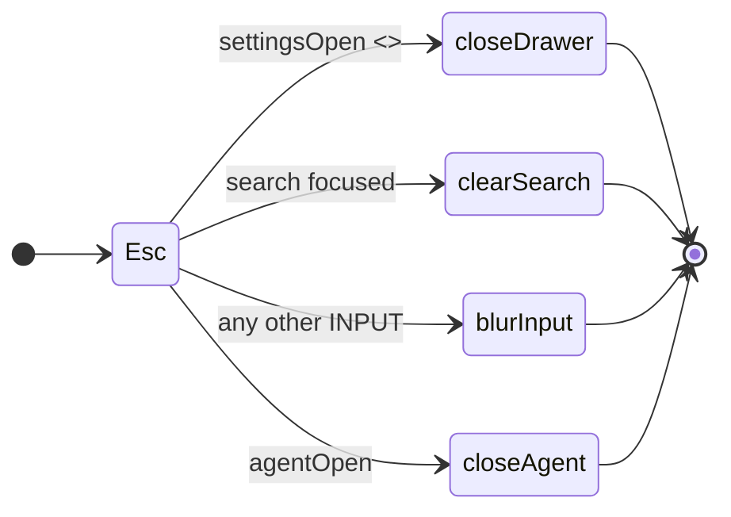

# Treko: a Configuration drawer, a light theme, and a sidebar you can drag

Planned 2026-08-23 on `main` @ `984e7ac`, in the `treko-ui-update` worktree, immediately after
card 1 (`treko-rename`, PR #64) and the store-location follow-on (PR #68) merged. Scope approved by
the user the same day.

**Model-switch checkpoint 1 (entering planning): not separately asked.** The user directed this card
be written at `model_tier: high` in the same instruction that set its scope, and it was. Recorded as
what happened rather than as a checkpoint that was run — checkpoint 2 (planning → implementation) is
still owed and is unconditional.

> **Gate status: CLOSED.** No branch, no source edit, no commit. Implementation opens only on the
> literal user phrase `gate confirmed`, and only after the compliance judge and the observability
> judge's architecting read have both recorded a verdict against this file.

This is the **UI half deferred by `treko-store-location.md` §"Deferred — the UI half"**. That section
promised three drawer sections; this card ships **two**, and §D9 records why the third is dropped
rather than deferred again.

## Why

Two complaints, one root cause.

**The board is dark-only, and it cannot be otherwise.** Not because anyone chose that, but because
the colours are typed into the markup. `data-theme` has **0 occurrences** anywhere under `treko/`
(verified at `984e7ac`; the only two hits in the repo are a judge ledger and the store-location
card's own prose). Twenty-seven colour literals sit inline in `Treko.dc.html` — three copies of
`#12131e` and twenty-four `rgba(255,255,255,·)` hairlines and hovers. A theme switch is a
find-and-replace across a 639-line file every time, which is not a feature anyone can ship.

**The sidebar is 236px, forever.** `mainML:S.collapsed?'56px':'236px'` (`Treko.dc.html:621`) is the
whole of the layout logic. Long feature-card names — the thing the sidebar exists to show —
ellipsize, and there is nothing the reader can do about it.

Both are cheap once the tokens exist, and neither is possible before. **So the tokens are the
feature**; the drawer is what makes them reachable.

## Decisions taken during brainstorming (2026-08-23)

Each was a user decision. The implementation does not relitigate them.

1. **Two drawer sections, not three.** Appearance and Layout. Artifacts is dropped, not deferred —
   see §D9.
2. **Take the prototype's whole palette**, including the cyan accent and the re-tinted `--ok` /
   `--info`. Not a subset, not "the neutral parts only".
3. **Tokenize first, re-tint second — as two tasks and two commits.** The user's "take the whole
   thing" and the tokenize pass's "prove nothing moved" cannot both be true of one diff. §D1.
4. **Dark stays the default mode, not the default colours.** An unset `taskTracker.theme` renders
   with `body[data-theme="dark"]` — the seed defaults to the string `'dark'` (§D8) and `applyTheme`
   sets the attribute **unconditionally**, on every mount (§D3) — both before and after task 4. What
   task 4 changes is what "dark" itself looks like: the re-tint repaints the dark palette (cyan
   accent, `#1c1e2b` surfaces, new `--ok` / `--info`) for every user, including one who never opens
   the drawer. A non-choosing user is guaranteed the mode they have today, never the exact colours
   they have today.

## Scope

### In

- Eight surface tokens in the page's own `:root`, replacing all 27 inline literals (§D2).
- A `body[data-theme="light"]` block covering every token the page reads (§D3).
- Sidebar drag-resize: clamp 190–440, persist on mouseup, Reset to 236 (§D4).
- A Configuration drawer — gear button, right-hand sheet, scrim, Esc — with **Appearance** and
  **Layout** sections only (§D5, §D6, §D7).
- Exactly two new `localStorage` keys: `taskTracker.sideW`, `taskTracker.theme` (§D8).
- The palette re-tint, as its own task and its own commit (§D1).
- Two light-theme overrides, `--shadow-sm` and `--shadow-lg`, which the prototype does **not** ship
  (§D3). `--shadow-sm` is read eight times in our page and `--shadow-lg` is what the drawer takes.
  `--shadow-md` is **not** overridden — it has zero readers in our page, the same reasoning
  §Background 5 used to exclude `--panel` (§D3).
- ADR for the theming decision; the `treko` skill's UI notes.

### Out

- **The Artifacts section.** §D9. This is a deliberate omission with a stated reason, not an
  oversight, and re-adding it is a spec change.
- **A kill / stop-run button.** The prototype's (`Task Tracker.dc.html:535-538`) sets
  `killed:true` in browser state and calls no server. Ours would need a real `/command` verb that
  can interrupt a running analysis — a trust-boundary change of the same weight as
  `treko-store-location.md`'s D3, and its own card.
- **`prefers-color-scheme`.** Neither tree has a media query today; an explicit choice that
  persists is the whole point of §D8. Following the OS is a later, separate ask.
- **Any change inside `Treko.dc.html:325-418`.** §Risks, hazard 1. This is the hardest boundary in
  the card.
- **Anything the numbered cards 2-5 own** — the Ledger, the dashboard upgrades, the agent panel's
  content, the analyzer's traversal.
- **Any new dependency.** Phosphor and Inter are already vendored and already sufficient (§Pinned
  versions).

## Background: the facts the design turns on

Each was measured in this tree at `984e7ac`. Re-measure before citing; do not re-derive.

**1. Our page and the prototype are siblings, not copies.** `treko/Treko.dc.html` (639 lines) and
`/Users/marksuyat/Other Docs/AI/AI_Projx/Prototypes/Treko/Treko/Task Tracker.dc.html` (723 lines)
diverged: ours has the real command handler and the real reanalyze; theirs has Rally rows, a fake
reanalyze, and the drawer. **Overwriting ours with theirs already cost a rework during card 1.**
Every port in this card is a deliberate, diffed lift of a named region. That absolute path — and
every other citation of it in this card — falls under the named out-of-repo-prototype-provenance
carve-out to the no-absolute-paths rule; the portability cost (no other clone can resolve it) is
accepted for the traceability this card leans on.

**2. `nocturne.css` is byte-identical to the prototype's except one line.** Verified by `diff`:

```
2c2
< @import url('vendor/inter/inter.css');
---
> @import url('https://fonts.googleapis.com/css2?family=Inter:wght@400;500;600;700&display=swap');
```

Ours is the vendored side. Neither file defines a light theme, a `data-theme` selector, or a
`prefers-color-scheme` block. **All theming in this card lives in the page's own `<style>` block
(`Treko.dc.html:18-22`), not in `nocturne.css`** — which stays untouched, so the design-system
export stays the design-system export (ADR 0023).

**3. The status hexes are already tokens.** `Treko.dc.html:21` declares
`--ok:#8fcaa8; --ok-bg:#17352a; --warn:#d8b06c; --warn-bg:#3a2d15; --bad:#e8968e; --bad-bg:#42201d;
--info:#9ec2ec; --info-bg:#1d2c44`, consumed through `TONES` at `:305`. A light block overrides them
in place; no rule in the page changes for them.

**4. The layout DOM is already parameterised.** `Treko.dc.html:80` is
`margin-left:{{ mainML }}`, `:281` is `left:{{ mainML }}` on the agent panel, and `:514` sets
`mainML:'0px'` for the not-ready state. Only `:621` hardcodes the number. **Drag-resize is three
template substitutions plus one handler — no new DOM structure**, and `:514` must not change.

**5. `--panel` has no readers.** The prototype declares `--panel:#1c1e2b` at its `:26` and
`var(--panel)` appears **0 times** in either page. Our card surfaces already use
`var(--color-surface)`. It is not ported. (`rules/core-conduct.md`: a declared value nothing reads
is not a state.)

**6. Nothing tests the page's appearance.** Of 221 collected tests under `treko/`, exactly one file
reads `Treko.dc.html` — `test_ui_commands.py:36` — and only to cut out the fenced handler slice. No
test asserts a colour, a token, a CDN URL in the markup, or a computed style. The existing CDN guard
(`test_server.py:177`) checks `support.js`'s `cdnScriptFor(...)` map, **not** the page or the CSS.
Every criterion in this card that is called "automated" needs a test file that does not exist yet.

## Design

### D1 — Tokenize first, re-tint second: why the order *is* the design

The tokenize pass and the palette re-tint touch the same lines, and they have opposite properties:

| Pass | Property | How a reviewer checks it |
|---|---|---|
| Tokenize | **Zero pixels move.** Pure substitution. | Mechanical: expand the new `var()`s, compare bytes (§Verification, Proof A). |
| Re-tint | **Pixels move on purpose** — cyan accent, `#1c1e2b` surfaces, new `--ok` / `--info`. | Human judgement, on a diff that is one `:root` block. |

Combined into one commit, the reviewer gets neither: they cannot tell a typo in a hairline alpha
from an intended re-tint, because both look like "a colour changed". **So they are two tasks and two
commits, tokenize first.** This is decision 3, and it is the reason the task list is ordered the way
it is.

There is one consequence that must be stated rather than discovered. Our `rgba(255,255,255,.1)`
hairline (`:281`, the agent panel's top border) maps to the prototype's `--hair-3`, whose dark value
is `.12`. To keep the tokenize pass exactly no-op, **`--hair-3` is declared at our current `.1`**;
the re-tint task moves it to `.12` along with the rest of the `:root` block. Same literal, two
commits, and each commit's property stays true.

### D2 — The token set: eight names, twenty-seven call sites

Seven names are the prototype's, at `Task Tracker.dc.html:26` (**not `:25`, which is the comment
above it**). Two are ours, for values the prototype's page does not have (its analogue at `:166` is
still a literal). `--panel` is not ported (§Background 5).

Dark values are exactly what the page renders today, so the substitution is value-preserving.

| Literal today | × | Lines in `Treko.dc.html` | Token | Light value |
|---|---|---|---|---|
| `#12131e` | 3 | 39, 56, 281 | `--rail` | `#eceef5` |
| `rgba(255,255,255,.06)` | 8 | 39, 56, 81, 144, 257, 282, 288, 295 | `--hair` | `rgba(15,18,35,.09)` |
| `rgba(255,255,255,.08)` | 1 | 96 | `--hair-2` | `rgba(15,18,35,.13)` |
| `rgba(255,255,255,.1)` | 1 | 281 | `--hair-3` | `rgba(15,18,35,.16)` |
| `rgba(255,255,255,.05)` | 8 | 40, 60, 77, 134, 183, 215, 235, 270 | `--hover` | `rgba(15,18,35,.05)` |
| `rgba(255,255,255,.03)` | 4 | 64, **596, 603, 620** | `--hover-soft` | `rgba(15,18,35,.03)` |
| `rgba(255,255,255,.025)` | 1 | 134 | `--hover-faint` *(ours)* | `rgba(15,18,35,.025)` |
| `rgba(255,255,255,.02)` | 1 | 216 | `--hover-ghost` *(ours)* | `rgba(15,18,35,.02)` |

**Total 27** — 3 hex + 24 rgba, matching the counts in §Why. Line 134 carries two of them.

**Three of the twenty-seven are JavaScript, not markup.** `:596`, `:603` and `:620` are string
literals inside computed-value objects (`bg:active?'rgba(255,255,255,.03)':'transparent'`), assigned
into inline `style` bindings. They become `'var(--hover-soft)'`. The prototype already did exactly
this at its `:694`. A tokenize pass that only walks HTML attributes misses these three — which is
why Proof A operates on the whole file's bytes.

**The two new tokens' light values follow the prototype's own dark→light rule, not an invention.**
Reading its `:26` against its `:29`: hairlines *strengthen* (`.06→.09`, `.08→.13`, `.12→.16`, since
ink on white needs more weight than white on ink) while hovers *keep their alpha* (`.05→.05`,
`.03→.03`) and only swap `255,255,255` for the ink `15,18,35`. `--hover-faint` and `--hover-ghost`
are hovers, so they keep `.025` and `.02`.

**The drawer's preview cards are the one place literals stay literal.** `Task Tracker.dc.html:431-433`
and `:438-440` hardcode `#161826`, `#38c4e3`, `rgba(255,255,255,.22)`, `#f5f6fa`, `#0e93b2`,
`rgba(15,18,35,.14)`, `rgba(15,18,35,.2)`. That is deliberate: each card is a miniature of the
*other* theme, so it must not follow the active one. Tokenizing them would make both previews look
identical and the control would stop meaning anything. **Do not tokenize them, and say so in a
comment.**

### D3 — The light block, and the three tokens the prototype forgot

`body[data-theme="light"]` (the prototype's `:27-34`) declares 48 custom properties plus
`color-scheme:light`. Measured against `nocturne.css`'s `:root`:

- **51** custom properties declared in `nocturne.css`.
- **33** of them overridden by the prototype's light block (`--color-bg`, `--color-surface`,
  `--color-text`, `--color-divider`, `--color-accent`, `--color-accent-2`, and the three 9-step
  ramps).
- **18** not overridden: 12 non-colour (`--font-*`, `--space-*`, `--radius-*` — correctly left
  alone), 3 `--color-section*` (deck-scale fills, **0 readers in our page** — correctly left alone),
  and **3 shadows**.

The shadows are a real gap, not a judgement call:

```css
--shadow-sm: 0 0 0 1px #3f424d;                                  /* nocturne.css:78 */
--shadow-md: 0 0 0 1px #595d6c, 0 6px 18px rgba(0,0,0,0.55);     /* :79 */
--shadow-lg: 0 0 0 1px #9397ab, 0 16px 40px rgba(0,0,0,0.65);    /* :80 */
```

Those are hardcoded dark hexes — unlike `.btn-secondary:hover`, which is
`color-mix(in srgb, var(--color-text) 7%, transparent)` (`nocturne.css:153`) and therefore
self-adapts when `--color-text` flips. `var(--shadow-sm)` appears **8 times** in our page, on every
stat tile and card, and the ported drawer takes `var(--shadow-lg)` — the same token `nocturne.css`'s
own `.dialog` uses at `:286`. Left alone, light mode renders charcoal rings on white cards and a
`rgba(0,0,0,0.65)` bloom under a white drawer — for the two of these our page actually reads.
`--shadow-md` has **zero readers**: `.elev-md{box-shadow:var(--shadow-md)}` is `nocturne.css:218`,
and no `elev-*` class appears anywhere in `Treko.dc.html` (verified: 0 hits). Left dark-hardcoded, it
changes nothing anyone sees, because nothing paints it.

**We override the two tokens with a reader, `--shadow-sm` and `--shadow-lg`. The prototype overrides
neither; this is a deliberate divergence.** `--shadow-md` is **not** ported, for the same reason
§Background 5 excluded `--panel`: a declared value nothing reads is not a state
(`rules/core-conduct.md`). The values follow the rule `nocturne.css:76-77` states for itself —
"soft ink-tinted shadows on a light theme, a hairline edge + ambient darkness on a dark one":

```css
--shadow-sm: 0 1px 2px rgba(15,18,35,.06), 0 0 0 1px rgba(15,18,35,.07);
--shadow-lg: 0 16px 40px rgba(15,18,35,.16), 0 0 0 1px rgba(15,18,35,.10);
```

Our light block therefore declares **51** custom properties: 33 nocturne + 2 shadows + 8 status
(`--ok`…`--info-bg`, from `Treko.dc.html:21`) + 8 chrome (§D2). That total coincidentally matches
`nocturne.css`'s own count of 51 declared properties, above — a different 51, not a copy-paste of it:
33 of nocturne's 51 are the ones we override here, the other 18 are unrelated to this count.

**Where the block lives, and why it works.** In the page's `<style>` at `Treko.dc.html:18-22`, after
`:root`. Every element that reads a token is a descendant of `<body>`, and custom properties
inherit, so a `body[data-theme]` declaration reaches all of them and beats `:root` for anything
inside the body. Two things ride on this and both already work: `body{background:var(--color-bg)}`
(`Treko.dc.html:19`) is the `body` element itself, and the sticky header's
`color-mix(in srgb, var(--color-bg) 90%, transparent)` (`:81`) resolves against the overridden value.

Applied exactly as the prototype does it — `document.body.setAttribute('data-theme', t)`
(`Task Tracker.dc.html:529`), called from `componentDidMount` (`:484`) and from the setter (`:530`).
The `try/catch` is kept: it is what keeps a DOM-less test environment from throwing.

**The seed, validated at mount — corrected, not copied, the identical defect §D4 corrects for
`taskTracker.sideW`.** The prototype's seed is `theme:ls('taskTracker.theme')||'dark'` (its `:481`):
`||` only substitutes for `null` or `''`, so any other stored string — anything a user or a browser
extension can write directly into `localStorage`, a boundary this page does not control — passes
straight through and into `setAttribute('data-theme', …)` unchanged. §D5's six selection values are
ternaries on exact equality against `S.theme` (`darkEdge`/`darkBg`/`darkC` test `=== 'dark'`,
`lightEdge`/`lightBg`/`lightC` test `=== 'light'`, `Task Tracker.dc.html:704-705`); a value that is
neither matches none of the six, and the Appearance section renders with *both* preview cards
unselected — a UI state no scenario described until this revision. `localStorage` is user-editable
input crossing a system boundary (`rules/core-conduct.md`), so the seed is validated against its own
closed set, `{'dark','light'}`, the same discipline §D4 applies to `sideW`'s numeric range:

```js
const THEME_DEFAULT = 'dark';
```

```js
theme: (t => t === 'light' ? 'light' : THEME_DEFAULT)(ls('taskTracker.theme'))
```

Anything other than the literal string `'light'` — `null`, `''`, `'banana'`, `'Dark'`, `'true'` —
falls to `THEME_DEFAULT`, so `S.theme` is always exactly one of the two strings the six selection
ternaries test for. `setTheme` (§D5) only ever writes the literal `'dark'` or `'light'` back to
storage, so this check exists entirely for a value that reached storage some other way — the same
reasoning §D4 gives for validating `sideW`'s seed even though the drag handler already clamps.

### D4 — Sidebar drag-resize

Ported from `Task Tracker.dc.html:531-534`, with two changes from the prototype: the bounds and the
default become named module constants, and the seed is **corrected, not copied**. The prototype's
`+(ls('taskTracker.sideW')||236)` (its `:480`) cannot satisfy criterion 11: `localStorage` is
user-editable input crossing a system boundary, and `+("banana")` is `NaN`, not 236, so `mainML`
would render `"NaNpx"`. This page already has the right pattern for exactly this at `:432`
(`agentH:parseInt(ls('taskTracker.agentH'))||300`) — the seed below follows it, and goes one step
further: the prototype's 190–440 clamp lives only inside the drag handler, so a stored `"0"` or
`"99999"` reaches `mainML` unclamped at mount. Ours clamps at mount too.

Three named module constants, declared alongside `OPEN_PR` / `TRACKER_COMMAND_IDS` / `TONES` — this
page's existing pattern for a value used more than once:

```js
const SIDE_W_MIN = 190, SIDE_W_MAX = 440, SIDE_W_DEFAULT = 236;
```

```js
sideHandleDown = e => { e.preventDefault();
  const move = ev => { const w = Math.max(SIDE_W_MIN, Math.min(SIDE_W_MAX, ev.clientX)); this.setState({sideW:w}) };
  const up = () => { removeEventListener('mousemove',move); removeEventListener('mouseup',up);
                     lsSet('taskTracker.sideW', String(this.state.sideW)) };
  addEventListener('mousemove',move); addEventListener('mouseup',up); };
```

**Persist on mouseup, never per frame.** A drag fires `mousemove` at frame rate; a `lsSet` per frame
is a synchronous localStorage write per frame. The prototype already made this call and we keep it.

**Seed, validated at mount:**

```js
sideW: (w => isNaN(w) ? SIDE_W_DEFAULT : Math.max(SIDE_W_MIN, Math.min(SIDE_W_MAX, w)))
       (parseInt(ls('taskTracker.sideW')))
```

A non-numeric stored value — `parseInt` returns `NaN` — falls to `SIDE_W_DEFAULT`, matching
criterion 11. A numeric-but-out-of-range value (`"0"`, `"99999"`) is clamped to `SIDE_W_MIN` /
`SIDE_W_MAX` at mount, the same bound the drag handler already enforces; the clamp is no longer
something only a drag can produce. The three computed substitutions (`:695-696`):

```js
mainML: (S.collapsed ? 56 : S.sideW) + 'px',      // replaces Treko.dc.html:621's literal
sideW:  S.sideW + 'px',
sideHandleL: (S.sideW - 3) + 'px',
resetSideW: () => { lsSet('taskTracker.sideW', String(SIDE_W_DEFAULT)); this.setState({sideW:SIDE_W_DEFAULT}) },   // :697
```

Handle markup, from `Task Tracker.dc.html:70-72` — a 7px `position:fixed` strip centred on the
sidebar's edge, `z-index:31` (one above the sidebar's 30), `cursor:col-resize`, invisible until
hover. **It lives inside `<sc-if value="{{ expandedBar }}">`, so it does not exist while the sidebar
is collapsed** — which is also why the collapsed rail stays a hard 56px in both trees and is not part
of this feature.

`Treko.dc.html:514`'s `mainML:'0px'` (the loading / missing state) **does not change**: there is no
sidebar to be flush against before the data arrives.

### D5 — The drawer

Ported from `Task Tracker.dc.html:406-455`. The `</sc-if>` closes at **`:455`**, on the same line as
`</x-dc>` — `treko-store-location.md` cited `:406-460`, which overshoots by five lines into the
script tag.

Shape: `<sc-if value="{{ settingsOpen }}">` → full-viewport scrim (`position:fixed;inset:0;
z-index:75; background:rgba(0,0,0,.45); backdrop-filter:blur(2px)`) with `justify-content:flex-end`
→ panel (`width:min(400px,92vw); height:100%; overflow-y:auto; background:var(--color-surface);
border-left:1px solid var(--hair-2); box-shadow:var(--shadow-lg)`). Scrim carries
`onClick="{{ closeSettings }}"`, panel carries `onClick="{{ stopEvt }}"` so a click inside does not
bubble out and close it. `stopEvt` already exists in our page (`Treko.dc.html:288`).

**Appearance** (`:428-444`): two clickable preview cards side by side, `setDark` / `setLight`, each
a miniature mock chrome bar (§D2 — literals, deliberately) with a `ph-moon` / `ph-sun` label. Six
computed values drive selection styling (`:704-705`): `darkEdge` / `darkBg` / `darkC` and
`lightEdge` / `lightBg` / `lightC`, each a ternary on `S.theme`. Because §D3 validates the seed
against `{'dark','light'}`, `S.theme` is always exactly one of those two strings, so exactly one
card is always marked selected — the "neither card selected" state a corrupt stored value used to
produce cannot occur.

**Layout** (`:448-452`): a read-only `{{ sideW }}` readout — the *actual* state, `S.sideW + 'px'`,
not a stored duplicate — plus a `btn-ghost` Reset wired to `resetSideW`.

**No DOM `id` attributes anywhere in the drawer.** Every control binds by DC template expression.
The page's only seven `id="…"` attributes are the `sec-*` scroll anchors that `goTo` and the scroll
spy read via `getElementById` (`Treko.dc.html:458`, `:468`); adding an eighth for a drawer control
would put a second, unrelated convention into that lookup.

**All four Phosphor glyphs are already vendored.** `ph-gear-six`, `ph-moon`, `ph-sun` and `ph-x`
each resolve in both `treko/vendor/phosphor/regular/style.css` and the fill variant (1,530 glyph
classes vendored — the full set, not a subset). No CDN fetch, no manifest change.

### D6 — Esc: the drawer goes *first* in our chain, not second

The prototype's chain (`Task Tracker.dc.html:495-502`) has six arms; ours (`Treko.dc.html:448-452`)
has three, because we have no `confirm` and no `graphExpanded` state:



`treko-store-location.md`'s brief described the drawer as "second, after `confirm`" — true of the
prototype, false of us. The **intent** the prototype encodes is what ports: modal overlays are
dismissed before field-level Esc. With no `confirm` above it, our drawer arm is **first**.

The existing three arms keep their relative order and their bodies unchanged; the new arm is a pure
prepend. That is what criterion 12 asserts, and it is checkable by diffing the four arms rather than
by reading the whole handler.

**Edge case, and why the Artifacts omission helps here.** Open the drawer while the search input
still holds focus and press Esc: the drawer closes and the search text survives. That is the
better outcome, and it is uncontentious *only because the drawer contains no inputs*. Had the
Artifacts path field shipped (§D9), Esc inside it would have closed the drawer and discarded a
half-typed path.

### D7 — The gear button grafts *beside* `cmdButtons`, never into it

The header's command cluster is `Treko.dc.html:91-97` — but that span is three separate things, and
only one of them is the button row:

| Lines | What |
|---|---|
| `:90` | the static Agent `<button>` — **the precedent this graft follows** |
| `:91` | the `{{ cmdMsg }}` status div |
| `:92-94` | `<sc-for list="{{ cmdButtons }}">` — the command buttons |
| `:95-97` | `<sc-for list="{{ cmdCopies }}">` — the copy-text chips |

`cmdButtons` is built at `:486` from `TRACKER_COMMAND_IDS`, and **`TRACKER_COMMAND_IDS` is declared
at `:333`, inside the fenced region** (§Risks, hazard 1). Adding a `'settings'` id to reach the
button row would edit a 94-line block that `test_ui_commands.py` extracts verbatim and loads in
node, and would put a DOM concern inside a slice whose contract is that it has none.

So: the gear is a **static `<button class="btn btn-ghost btn-icon" onClick="{{ openSettings }}">`
inserted after `:97`** — rightmost in the header — exactly like the Agent button at `:90`. Nothing in
`cmdButtons` or `cmdCopies` changes. `.btn`, `.btn-ghost` and `.btn-icon` all exist in
`nocturne.css` (`:137`, `:155`, `:158`); no new class is needed.

The precedent for keeping chrome out of the slice is already written in the file, at
`Treko.dc.html:420-422`:

> `// Presentation only, and deliberately outside the slice: the node tests load behaviour,`
> `// not labels, and a slice that grows chrome stops being loadable without a DOM.`

### D8 — localStorage: exactly two new keys

We persist four today, all through the `ls` / `lsSet` helpers at `Treko.dc.html:319-320` (byte-identical
to the prototype's `:472-473`):

| Key | Today | Read at |
|---|---|---|
| `taskTracker.run` | ✔ | `:432` |
| `taskTracker.sidebar` | ✔ | `:432` |
| `taskTracker.resolved` | ✔ | `:432` |
| `taskTracker.agentH` | ✔ | `:432` |
| `taskTracker.sideW` | **new** | seed: `parseInt` + `NaN` fallback + clamp, validated at mount (§D4) |
| `taskTracker.theme` | **new** | seed: validated against `{'dark','light'}`, falls back to `THEME_DEFAULT` (§D3) |

The prototype also writes `taskTracker.artifactsPath` (§D9) and `taskTracker.deletedRuns` (part of
the run-delete feature, out of scope). **Neither is added.**

Both new keys degrade the same way the existing four do: `ls` returns `null` inside its `try/catch`
when storage is unavailable, so `parseInt(null)` is `NaN` and the seeds fall through to
`SIDE_W_DEFAULT` (236) and `THEME_DEFAULT` (`'dark'`), and the page works unpersisted. No new
failure mode.

**Every `ls()` read is validated at its point of use — the rule for this page, stated once.**
`ls()` (`Treko.dc.html:319`) is `function ls(k){try{return localStorage.getItem(k)}catch(_){return
null}}`: its `try/catch` guards only the `getItem` call itself. It guarantees the *read* did not
throw; it says nothing about whether the string that comes back is well-formed for whatever the
caller does with it next, because a browser's storage is a boundary this page's own code does not
control. Two consecutive review rounds each found exactly one call site that skipped that guard —
`sideW`, then `theme` — which is the pattern of patching instances instead of closing the class.
Measured in this checkout, here is every `ls()` read that exists or will exist once this card lands,
all four of today's on the same line:

| Key | Expression | Guard |
|---|---|---|
| `taskTracker.run` | `ls('taskTracker.run')\|\|''` | defaulted — safe |
| `taskTracker.sidebar` | `ls('taskTracker.sidebar')==='1'` | compared — safe |
| `taskTracker.agentH` | `parseInt(ls('taskTracker.agentH'))\|\|300` | parsed + defaulted — safe |
| `taskTracker.resolved` | `JSON.parse(ls('taskTracker.resolved')\|\|'{}')` | **unguarded — throws on invalid JSON** (§Risks, hazard 5 — pre-existing, out of scope for this card) |
| `taskTracker.sideW` | `parseInt` + `NaN` fallback + range clamp (§D4) | validated — added by this card |
| `taskTracker.theme` | validated against `{'dark','light'}` (§D3) | validated — added by this card |

All six sit at `Treko.dc.html:432` today except the two this card adds. The rule that closes the
class rather than the instance: **validate every `ls()` result at the point of use, against the
domain the caller actually needs — a boolean comparison, a numeric parse with range clamp, or (as
here) a closed-set membership check — because `ls()` promises only that reading did not throw, never
that what it read is usable.** Both keys this card adds follow it. `taskTracker.resolved` does not,
and it predates this card; §Risks records why it is left alone rather than fixed here.

### D9 — Why the Artifacts section is omitted, not deferred

`treko-store-location.md` promised three sections. This card ships two, and the third is dropped
outright.

**It is a stub even in the prototype.** `saveArtPath` (`Task Tracker.dc.html:701`) writes
`taskTracker.artifactsPath` to `localStorage`, sets `artSaved:true`, and stops. Nothing reads the key
back — not the queue form, not the analyzer, not anything. Meanwhile the copy beside the field
(`:420`) reads:

> "Where analysis snapshots are written. The Ledger queues new runs into this directory."

Neither clause is true of any code in either tree.

**Our side makes it worse, not better.** Since PR #68, the store directory is resolved **once at
startup** by `treko/store_location.py` — from `TREKO_STORE_DIR`, canonicalized, validated, created
`0o700`, and announced on the startup banner. There is no runtime setter and no `/command` verb that
takes a filesystem path (the endpoint does `clear`, `handoff`, `reanalyze`, and nothing else).
A path typed into the drawer would change a browser key while the server kept writing exactly where
it always did.

That is the failure `rules/core-conduct.md` names directly:

> Never render a metric the payload cannot source. […] it reads as a measurement while being a
> substitute that silently rots as the underlying facts change.

A control that accepts input, says "Saved", and configures nothing is the same defect wearing a
button. **Show the real thing or show nothing.**

**What would make it real, if someone wants it later.** A new `/command` verb carrying a path, which
means the server creates and writes a directory at an address the browser supplied — a trust-boundary
extension of the same weight as `treko-store-location.md`'s D3, earning its own design and its own
judge round. Until that exists, the honest cheap version is **display-only**: render the resolved
`store_dir` the server already knows, with no input and no Save. That is also out of scope here,
because the page has no channel that carries it today.

## Scenarios

Good, bad and edge, in the order they run.

```gherkin
# --- the tokenize pass (task 2) ---

Scenario: tokenizing moves nothing
  Given the page at the commit before the tokenize task
  When  every var(--rail|--hair*|--hover*) in the tokenized page is textually expanded
  And   the eight declarations the task added to :root are removed
  Then  the result is byte-identical to the pre-change file

Scenario: the mapping is exhaustive
  Given the tokenized page
  When  it is searched for "#12131e" and "rgba(255,255,255,"
  Then  the only hits are the eight :root declarations
  And   the drawer's two preview cards, which are exempt by name

# --- the light theme (task 3) ---

Scenario: dark is still the default
  Given taskTracker.theme is unset
  When  the page mounts
  Then  body carries data-theme="dark"
  And   every computed colour equals the dark-mode value

Scenario: no token is left dark on a white ground
  Given data-theme="light"
  When  every custom property the page reads via var() is collected
  Then  each one is declared in the light block, or on the named exception list
  And   the exception list contains only --font-*, --space-*, --radius-* and --mono

Scenario: light-mode text stays readable
  Given data-theme="light", set in localStorage and mounted for real in headless Chrome
  When  every element under body with non-zero rendered area is resolved to its getComputedStyle
        color and its effective background (walking ancestors for the first opaque background,
        alpha-compositing any translucent layer crossed)
  Then  its WCAG contrast ratio is at least 4.5:1 below 18px, and at least 3:1 at or above 18px

Scenario: the card shadows are not dark rings on white
  Given data-theme="light"
  Then  --shadow-sm and --shadow-lg each resolve to an ink-tinted rgba value
  And   neither contains #3f424d or #9397ab
  And   --shadow-md is left at its nocturne.css dark value, unread by anything in the page

Scenario: the theme survives a reload
  Given the user picks Light
  When  the page is reloaded
  Then  body carries data-theme="light" before first paint of the board

Scenario: storage is unavailable
  Given localStorage.getItem throws
  When  the page mounts
  Then  it renders in dark mode and does not throw

Scenario: a corrupt stored theme
  Given taskTracker.theme is "banana"
  When  the page mounts
  Then  body carries data-theme="dark"
  And   the Appearance section's Dark preview card is marked selected, not neither card

# --- the palette re-tint (task 4) ---

Scenario: the re-tint is one block
  Given the re-tint commit
  Then  its diff touches only the :root and body[data-theme="light"] declarations
  And   no inline style attribute changes

# --- the sidebar (task 5) ---

Scenario: dragging resizes the sidebar
  Given the sidebar is expanded at 236px
  When  the handle is dragged to clientX 300
  Then  the sidebar is 300px wide
  And   the main column's margin-left is 300px

Scenario: the drag clamps at both ends
  When  the handle is dragged to clientX 40, then to clientX 900
  Then  the width is 190px, then 440px

Scenario: the width is written once, not per frame
  Given a drag that fires 60 mousemove events
  Then  lsSet is called exactly once, on mouseup

Scenario: the width survives a reload
  Given the sidebar was left at 300px
  When  the page is reloaded
  Then  it is 300px

Scenario: Reset returns 236
  Given the sidebar is 300px
  When  Reset is pressed in the Layout section
  Then  the sidebar is 236px and taskTracker.sideW reads "236"

Scenario: a corrupt stored width
  Given taskTracker.sideW is "banana"
  When  the page mounts
  Then  the sidebar is 236px

Scenario: a stored width outside the clamp range is corrected at mount
  Given taskTracker.sideW is "0", then separately "99999"
  When  the page mounts
  Then  the sidebar is 190px, then 440px

Scenario: no handle while collapsed
  Given the sidebar is collapsed
  Then  no col-resize element is in the DOM
  And   the rail is 56px and the main column's margin-left is 56px

Scenario: the pre-data state is untouched
  Given tracker-data has not loaded
  Then  mainML is "0px" regardless of taskTracker.sideW

# --- the drawer (tasks 6-7) ---

Scenario: the gear opens it
  When  the gear button in the header is pressed
  Then  the drawer is visible at the right edge over a scrim

Scenario: the scrim closes it, the panel does not
  When  the scrim is clicked
  Then  the drawer closes
  When  it is reopened and the panel body is clicked
  Then  the drawer stays open

Scenario: Esc closes it first
  Given the drawer is open and the search box holds text and focus
  When  Esc is pressed
  Then  the drawer closes
  And   the search text is unchanged

Scenario: the existing Esc arms are undisturbed
  Given the drawer is closed
  Then  Esc clears-and-blurs the focused search box, blurs any other input,
        and closes the agent panel — in that order, exactly as before

Scenario: the Layout readout is the real width
  Given the sidebar is 317px
  When  the drawer is opened
  Then  the Layout section reads "317px"

# --- regression guards (task 8) ---

Scenario: the command-handler region is unchanged
  Given the page at this card's merge commit
  When  bytes 'slice begins' … 'slice ends' are extracted
  Then  they are identical to the same region at this card's base commit

Scenario: no CDN URL reaches a fetching position
  Given Treko.dc.html, nocturne.css and every vendored .css
  When  each @import url(), src=, href= and CSS url() target is resolved
  Then  none has an external scheme
  And   the provenance comment at vendor/inter/inter.css:3 is not a false positive
```

## Acceptance criteria

1. **The tokenize pass is provably a no-op.** Expanding the eight new `var()`s in the tokenized
   page and deleting the eight `:root` declarations yields the base commit's file **byte for byte**.
   Automated (§Verification, Proof A). Corroborated, not proven, by a rendered screenshot hash.
2. **All 27 literals are gone.** `#12131e` and `rgba(255,255,255,` appear only in the eight `:root`
   declarations and in the drawer's two preview cards, which are exempt by explicit name and
   comment. The 27 are 3 hex + 24 rgba, and 3 of the 24 are JS string literals (`:596`, `:603`,
   `:620`) — a check that only walks HTML attributes fails this criterion.
3. **Dark is unchanged for an existing user — at the tokenize commit, not at HEAD.** With
   `taskTracker.theme` unset, every computed colour on the board equals its value at the base commit.
   Scoped exactly as criterion 1 is scoped by criterion 8: asserted at the tokenize commit (task 2)
   and never re-checked after task 4, whose entire purpose is to change those colours for every user.
   What survives task 4 is the **default mode** (see Decisions §4) — an unset `taskTracker.theme`
   still renders dark, and `body` still carries `data-theme="dark"` (§D3's setAttribute is
   unconditional; §D8 seeds the state to `'dark'`) — never that the rendered colours themselves are
   unchanged.
4. **The light block covers everything the page reads.** Every custom property reachable through
   `var()` from `Treko.dc.html` or from a `nocturne.css` rule the page's classes hit is declared
   under `body[data-theme="light"]`, or appears on an exception list whose only members are
   `--font-*`, `--space-*`, `--radius-*` and `--mono`. `--color-section*` may join the list only
   with the measured "0 readers" evidence attached.

   **`--mono` joins the list by measurement, 2026-08-24 — the resolution of the gate task 3
   raised.** It is declared in `Treko.dc.html:21` beside the eight status hues, which is the only
   reason a colour-shaped rule catches it; its value is `ui-monospace,Menlo,Consolas,monospace`, a
   font stack with no light or dark form. It is genuinely reachable (33 `var(--mono)` uses,
   measured on this branch) and §D3's 51-property block does not declare it, so **without this
   entry criterion 4 could never pass against a correct implementation** — the same defect class
   the compliance judge flagged on card B's task 13. The exception is scoped to this one literal
   name, **not** to a `--mono-*` pattern: nothing else matches it today, and a pattern would
   pre-approve tokens nobody has weighed. Full accounting of all 40 reachable names, and the split
   between what this criterion measures and what it does not: §Verification, "Criterion 4".
5. **No invisible-on-white surface.** Render the page in headless Chrome with `data-theme="light"`
   applied exactly as the app applies it — `taskTracker.theme` set in `localStorage` before mount,
   never simulated by setting the attribute directly. For every element under `<body>` that has
   non-zero rendered area **and paints a mark in its own `color`** — defined as: it has at least one
   direct child text node whose content is not entirely whitespace, **or** its `::before`/`::after`
   resolves a `content` other than `none`/`normal`/`""` (which is how an icon font paints a glyph) —
   its resolved `getComputedStyle().color` and its effective background — the first
   non-transparent `getComputedStyle().backgroundColor` found walking up from the element through its
   ancestors, alpha-compositing any translucent layer crossed on the way — meet WCAG contrast ≥ 4.5:1
   below an 18px resolved `font-size`, ≥ 3:1 at or above it, ≥ 4.5:1 when `font-size` cannot be
   resolved. This is a rendered check over the whole page, inline-styled and class-styled colour
   alike, reading the foreground/background pair from the browser's own paint rather than inferring
   it from markup proximity — there is no "one inline style" scope left to disagree about
   (§Verification, Proof C).
   **Why the population is elements that paint, not elements that exist** (narrowed 2026-08-24,
   after implementation measured the original wording as unsatisfiable). `color` inherits, so an
   element that paints no mark still reports one. Nine 7×7px decorative dots
   (`Treko.dc.html:251`) inherit `--color-neutral-200` from their parent and render only a
   background-colour disc; scoring that inherited colour against the disc's own fill demanded a
   foreground of 249..255 from a token whose 59 other uses need it near-black, so no palette
   assignment could satisfy the criterion — it was failing on colours nobody can see. The
   `::before`/`::after` arm is what keeps this from over-narrowing: a Phosphor `<i>` has no text
   node but does paint a glyph in its `color`, and 25 such elements stay in scope. Measured on
   this page: 848 elements have area, **367** paint a mark.
   **What this does not prove:** that the page looks good. A human opens it
   once (task 9) and that is recorded as eyeballed, not measured.
6. **The two shadow tokens with a reader, `--shadow-sm` and `--shadow-lg`, are overridden in light
   mode**, and neither light value contains `#3f424d` or `#9397ab`. `--shadow-md` is not overridden —
   it has zero readers in our page (§D3), the same reasoning that excluded `--panel` (§Background 5).
7. **The theme survives a reload**, and an unavailable `localStorage` yields dark mode without
   throwing. **A stored value outside the closed set `{'dark','light'}` also yields dark mode** — in
   the applied `data-theme` attribute and in the drawer's Appearance selection state, where it leaves
   the Dark card selected rather than neither card — the identical validate-at-the-boundary treatment
   criterion 11 already requires for `taskTracker.sideW`.
8. **The re-tint is a separate commit** whose diff touches only `:root` and the light block — zero
   changed inline style attributes. Criteria 1 and 3 are asserted at the tokenize commit, not at
   HEAD — task 4 is exactly the commit at which criterion 3 stops holding, by design. This depends on
   both commits reaching `main` unsquashed (task 13 — no squash merge).
9. **Sidebar drag clamps at 190 and 440**, updates both the sidebar and `mainML` in the same frame,
   and survives a reload.
10. **The width is persisted once per drag, on mouseup** — not once per `mousemove`.
11. **Reset returns `SIDE_W_DEFAULT` (236)**, in both the DOM and `taskTracker.sideW`. A non-numeric
    stored value also yields `SIDE_W_DEFAULT`. A numeric stored value outside `SIDE_W_MIN`–
    `SIDE_W_MAX` (190–440) is clamped to the nearer bound **at mount**, not only during a drag. No
    drag handle exists while collapsed, and `Treko.dc.html:514`'s `mainML:'0px'` is unchanged.
12. **The drawer opens on the gear, closes on the scrim and on Esc, and does not close on a click
    inside the panel.** The Esc arm is **prepended**; the three existing arms keep their bodies and
    their relative order, verified by diffing the four arms.
13. **The Layout readout is the live `S.sideW`**, not a second stored copy — there is exactly one
    source for the number on screen.
14. **The drawer carries no `id` attribute.** The page's `id="…"` count stays at 7, all `sec-*`.
15. **`Treko.dc.html:325-418` is byte-identical to its base-commit form.** A regression guard in the
    same shape as `treko-rename.md`'s criterion 17. **What it proves:** the realistic failure — a
    port that reaches into the slice to add a `'settings'` command id. **What it does not:** that the
    slice is still *correct*; `test_ui_commands.py`'s 11 tests own that, and all 11 still pass.
16. **`TRACKER_COMMAND_IDS` is still exactly `['clear','handoff','reanalyze']`**, and `cmdButtons` /
    `cmdCopies` render the same three rows they render today.
17. **No CDN URL in a fetching position** in `Treko.dc.html`, `nocturne.css` or any vendored `.css`
    — checking `@import url()`, `src=`, `href=` and CSS `url()`. The provenance comment at
    `vendor/inter/inter.css:3` is a documented non-hit and the check must not flag it. `CSP` at
    `server.py:114-118` stays `default-src 'self'`; `STATIC_MANIFEST` keeps its 17 rows.
18. **The suite passes with no test lost** — node-ID set diff against the 221 collected at
    `984e7ac`, per the lesson in card 1's criterion 4. A changed total is not a regression; a lost
    node is.
19. **`wc -l treko/Treko.dc.html` is under 800**, measured rather than assumed. It is 639 today and
    the drawer plus handle is the largest markup addition this page has taken.

## Pinned versions

Carried forward from `docs/features/treko-rename.md` §"Pinned versions", unchanged.

| Tool | Version | Where it is fixed |
|---|---|---|
| Python | 3.9.6 | the interpreter this repo's suite runs under; `server.py` targets stdlib only |
| pytest | 8.4.2 | test runner |
| Phosphor Icons | 2.1.1 | already vendored under `vendor/phosphor/` — do not re-fetch |
| Inter | vendored `inter-latin.woff2` | `vendor/inter/` — no version upstream; the file is the pin |
| Nocturne export | `73641b21-c7ad-488a-8264-a28262dfe83e`, schema `version: 1` | `_ds/` directory name; ADR 0023 |
| Chrome | `151.0.7922.172` | measured in this checkout: `"/Applications/Google Chrome.app/Contents/MacOS/Google Chrome" --version`. Both Proof B and Proof C invoke this exact build — two hashes, or two contrast reads, from different Chrome builds are not comparable. |

**No new dependency.** All four glyphs the drawer needs (`gear-six`, `moon`, `sun`, `x`) resolve in
the vendored Phosphor set (1,530 classes, regular and fill). Adding a dependency would need a
separate ask (`rules/core-conduct.md`, Parallel-Agent Invariants).

## Tasks

- [x] 0. Branch `feat/treko-theme-and-layout` + worktree. **Only after `gate confirmed`**, and after
      model-switch checkpoint 2.
      Done: branch cut from `main` @ `a5a66a7`; this worktree carries it. Both checkpoints on record.
- [x] 1. **Baseline.** Record the full node-ID set and per-module counts from `pytest treko/`, the
      base commit SHA, `wc -l treko/Treko.dc.html`, and the extracted bytes of `:325-418`. Nothing
      else in this card can be checked without them.
      Done: recorded under §Verification "Task 1 baseline". 221/221 green, no deselections.
- [x] 2. **Tokenize.** Add the eight `:root` declarations; replace all 27 literals — including the
      three JS string literals. **No light block, no palette change, no DOM change.** Commit alone.
      Proof A must pass on this commit and is asserted against it forever after.
      Done: one `:root` line (8 tokens at today's dark values), 27 literals replaced, 639->640
      lines. Proof A byte-identical; see §Verification "Proof A — result". Record this commit's
      SHA; once task 4 lands, Proof A becomes a frozen comparison between it and the base-commit SHA
      from task 1 — label it **ARCHIVED RECEIPT** in the test itself (§Verification, Proof A), not a
      live regression guard.
- [x] 3. **Red first, then the light block.** Write the failing tests for criteria 4, 5, 6 and 7
      (including the corrupt-stored-theme case) against the *current* dark-only page and confirm each
      fails for the stated reason. Then add `body[data-theme="light"]` with all 51 declarations,
      `THEME_DEFAULT`, the validated seed, `applyTheme` / `setTheme`, and the mount call. Do not touch
      implementation and tests in the same step.
      Red half PARTIALLY done (`treko/test_theme.py`, `treko/cdp_harness.py`). **Criterion 7's tests
      were written and run** in `5cc3bc2` — the dispatch brief that omitted them said "4, 5 and 6",
      taken from this task's pre-revision text, and round 3 added criterion 7 here. All 14 collected
      tests fail, and as of `9ad983c` all 14 are red for their own stated reason — the
      headless-Chrome blocker that had killed 11 of them was diagnosed and worked around.
      **The evidence, the diagnosis and the falsifiable-not-satisfiable caveat are recorded once,
      in §Verification "Task 3 red half" — do not restate them here.**
      **Second half done in `af5321a`: 13 of 14 green.** The light block (51 properties),
      `THEME_DEFAULT`, the validated seed, `applyTheme`/`setTheme` and the mount call are all in,
      at §D3's values. Criterion 5 is the one still red and **is not this task's to close** — it
      needs a light-palette redesign, which task 4 now owns; the numbers are in §Verification
      "Task 3 second half".
      **GATE — RESOLVED 2026-08-24 by a spec change, not a workaround.** The conflict: criterion 4
      required every `var()`-reachable custom property be declared under `body[data-theme="light"]`,
      with an exception list of only `--font-*`, `--space-*`, `--radius-*` (+ `--color-section*` with
      evidence). `--mono` IS reachable — 33 `var(--mono)` uses in `Treko.dc.html` — matched no
      exception pattern, yet §D3's 51-property plan never declares it, so the criterion-4 test could
      never have passed against a correct implementation.
      **Resolution:** the card was returned to `phase: planning` at `model_tier: high`, the user was
      asked the entering-planning model-switch question and chose the high tier, and `--mono` was
      added to criterion 4's exception list by literal name with its evidence attached. Three sites
      were updated together — criterion 4, the Gherkin step in §Scenarios, and §Verification's
      "Criterion 4". A fourth mention (§Background's "12 non-colour") was deliberately left alone:
      it measures `nocturne.css`'s own inventory, and `--mono` is declared in `Treko.dc.html:21`,
      not in `nocturne.css` — changing it would have corrupted a recorded measurement.
      **Measured while resolving, and worth keeping:** of the 40 distinct `var()`-reachable names in
      `Treko.dc.html`, 38 are declared by §D3's light block and 2 are excepted (`--font-heading`,
      `--mono`) — `--mono` was the only uncovered name. The eight status hues on the same `:root`
      line ARE covered, by §D3's "8 status"; that was checked, not assumed. Table in §Verification.
- [x] 4. **Palette re-tint, and the contrast pass criterion 5 needs.** Replace `:root` with the
      prototype's block (cyan accent, `#1c1e2b` surface, lifted neutrals, `--ok:#82dfa9`,
      `--info:#89b4f2`, `--hair-3` to `.12`). One commit, `:root` and the light block only.
      **Pixels move here, by design.**
      **This task also owns criterion 5.** Task 3 landed the light block at §D3's prototype values
      and measured **127** contrast violations under the narrowed criterion — four text tokens,
      every one of them a real defect: `--color-neutral-700` at **1.64:1** on white (18 elements,
      the "invisible on white" this criterion is named for), `--color-neutral-600` at 3.06 (82),
      `--color-accent` at 3.23 (16), `--color-accent-300` at 3.87 (11). It is this task and not
      task 3 because criterion 5 is a card-level criterion, because the fix is a design pass on
      the palette rather than wiring, and because this task already owns the light block.
      **It is a redesign, not a scaling.** A trial darkening of exactly those four tokens was
      measured, not assumed: it took the *unnarrowed* count 205 → 40 rather than → 9, because
      `--color-accent` is also a background under `--color-text` (28 new violations at 3.33), and
      three tokens solved to exactly 4.50 with no margin. Re-derive the values against the real
      render; do not reuse those trial numbers.
      **Done in `4adfda4`. Both halves of that warning were re-checked against the narrowed
      render before acting on them, and they did not survive intact** — the accent-as-background
      clause turned out to be an artefact of the unnarrowed population and does not apply here
      (§Verification, "Task 4"). The margin clause did hold and drove the 4.8 target. The reason
      it is still a redesign is a different one, found by measurement: fixing
      `--color-neutral-600` alone lands it *darker* than `--color-neutral-500` and inverts the
      ramp, so the ink ramp had to be re-spaced rather than four values patched.
      **Dark mode fails the same check 104 times and is out of scope here** — measured on the
      untouched page, so it predates this card. Criterion 5 is light-only by its own wording.
      Recording it so the next reader does not mistake it for a regression this card caused.
- [ ] 5. **Sidebar.** Red tests for criteria 9, 10 and 11 first. Then the handle markup, the
      handler, the seed, and the three computed substitutions replacing `:621`.
      **Red half done** in `treko/test_sidebar.py`: 8 red, each on its own assertion, plus 2 source
      guards that pass by design. Evidence, the two Gherkin scenarios that are not runtime-testable,
      and the Reset clause task 7 now owes are recorded once, in §Verification "Task 5 red half" —
      do not restate them here.
      **`:621` is `:650` today**, and every other line number this card cites has moved with it
      (`:514`→`:543`, `:432`→`:455`). Re-derive them; do not copy.
- [ ] 6. **Drawer shell.** Gear button grafted after `:97`; scrim; panel; `openSettings` /
      `closeSettings`; the prepended Esc arm. Red tests for criterion 12 first, including the
      "existing arms undisturbed" diff.
- [ ] 7. **Drawer sections.** Appearance (two preview cards, six selection values, literals kept and
      commented) and Layout (readout + Reset). **No Artifacts section** — §D9.
- [x] 8. **Regression guards.** Criteria 15, 16 and 17 as tests. Criterion 15 compares against the
      bytes captured in task 1.
      **Pulled forward, ahead of tasks 5-7.** It is test-only and independent of every remaining
      implementation task, and criterion 15 exists to catch exactly the failure tasks 6-7 could
      cause — a drawer port reaching into the fenced slice — so it is worth more standing before
      that port than after it.
      Done in `treko/test_guards.py`: **25 tests, all green**, every check falsified before its
      pass was believed. Two findings are recorded in §Verification "Task 8" and are the reason
      this task took a second pass: the card's 4851-byte fence figure is **confirmed correct** (it
      names the marker-inclusive span, and base lines 325/418 *are* the marker lines), and the
      criterion-17 scanner had a real case-sensitivity hole — `<LINK HREF="https://…">` was
      invisible to it — found by falsification and closed. **Do not restate either here.**
- [ ] 9. **Launch for real** (`--open`): drag the sidebar, flip to light, reload, press Esc from
      three states, and look at the light board. Record what was eyeballed as eyeballed.
- [ ] 10. **Post-change suite**: node-ID set diff vs task 1, zero lost nodes, `wc -l` under 800.
- [ ] 11. **ADR** — the token layer, the tokenize/re-tint split, the shadow divergence from the
      prototype, and the Artifacts omission. **Check the next free number against `origin/main`, not
      a stale local ref**; 0026 is duplicated and 0028 is unused, so "highest + 1" is not the
      answer on its own.
- [ ] 12. `skills/treko/SKILL.md`: the two new `localStorage` keys and the theme default.
- [ ] 13. Compliance judge on this spec (before task 0), observability judge on the change (before
      the PR), then the PR. **Do not squash-merge.** The tokenize and re-tint commits are the design's
      whole rollback point (§D1), and criterion 8 pins an assertion to the tokenize commit
      specifically — a squash deletes both. Use a merge or rebase-merge, and state in the PR body
      that both commits must reach `main` intact.

## Risks

- **Hazard 1 — `Treko.dc.html:325-418`.** Ninety-four lines that `test_ui_commands.py:68-87` cuts out
  verbatim, writes to a temp `.js`, and `require()`s in node. Its contract comment is at `:326-332`
  and says why:

  > `// Task 10 / criterion 15. test_ui_commands.py cuts this region out of this file verbatim`
  > `// and loads it in node, so it must stay dependency-free: no React, no DCLogic, no`
  > `// document, no window. It cannot live in its own .js file (the servable set is a closed`
  > `// manifest pinned in both server.py and the spec half, so a new row is a spec change and`
  > `// reopens criterion 13) and it cannot be an inline <script> (the CSP carries no`
  > `// 'unsafe-inline' for scripts). fetch arrives as an argument for the same reason: one`
  > `// row is driven by genuinely stopping the server, the rest by a stub.`

  The realistic breach is not malice — it is §D7's shortcut. `TRACKER_COMMAND_IDS` is at `:333`,
  four lines below that comment, and adding `'settings'` to it is the obvious way to get a gear
  button into a row that already renders buttons. It would also break the node load, because the
  slice would then reach a DOM concern. Criterion 15 is the guard; §D7 is the alternative that
  makes the guard unnecessary.

- **Hazard 2 — the prototype's `reanalyze` is theatre.** `RE_STEPS`
  (`Task Tracker.dc.html:471`) is five strings animated by a `setInterval` at `:527-528`. Ours is a
  real server round-trip with 11 tests behind it. The header must be **grafted into**, never lifted
  from — anyone porting the prototype's header wholesale silently replaces a tested feature with an
  animation. Same for the kill button at `:535-538`, which sets `killed:true` and calls nothing.

- **Hazard 3 — CSP.** `server.py:114-118` is `default-src 'self'; connect-src 'self'; img-src 'self'
  data:; style-src 'self' 'unsafe-inline'; script-src 'self' 'unsafe-eval'; frame-ancestors 'none'`.
  The prototype pulls Phosphor from unpkg and Inter from Google Fonts; either would be blocked, and
  a blocked font or icon sheet fails **silently** — boxes and tofu, no console error the page
  surfaces. Criterion 17 is the guard. The good news, measured: all four glyphs are already
  vendored, so the correct port adds no fetch at all.

- **Hazard 4 — port, never copy.** Ours is a sibling revision, not a stale copy. Overwriting ours
  with theirs cost a rework during card 1. Every lift in this card names its source lines; take those
  and diff, never the file.

- **Hazard 5 — `taskTracker.resolved` is unguarded and pre-existing; measured, not assumed.**
  `JSON.parse(ls('taskTracker.resolved')||'{}')` at `Treko.dc.html:432` has no `try/catch` on that
  expression — `||'{}'` only substitutes when `ls()` returns `null` or `''`; a stored value that is
  *present* but not valid JSON is neither. Confirmed under `node`: a stored `"banana"` throws
  `SyntaxError: Unexpected token 'b', "banana" is not valid JSON`, and a stored `"[1,2"` throws
  `SyntaxError: Expected ',' or ']' after array element`. The expression sits inside `state={...}`, a
  class field initializer, so the throw happens during construction — `Component` never finishes
  mounting, and it takes down the whole board, not one control. That is strictly worse than either
  unvalidated-`localStorage` finding raised against this card (§D8's class-level rule, above), and it
  is **pre-existing**: `taskTracker.resolved` is one of the four keys this page already reads, not
  one of the two this card adds (§D8). **It is out of scope for this card.** Fixing it here would be
  a drive-by against a section this card does not otherwise touch, on a page already at 639 of
  criterion 19's 800-line ceiling. It needs its own card; this entry is that card's evidence, not its
  fix.

- **Nothing tests appearance today.** §Background 6: 221 tests, one of which reads the page, and only
  for the fenced slice. Criteria 1, 2, 4, 5, 6, 15 and 17 all need a test file that does not exist
  yet. The risk is quietly downgrading them to "looked right" — the exact failure
  `rules/core-conduct.md` warns about. If a criterion cannot be automated, task 9 records it as
  eyeballed **and says so in the PR body**; it does not get written down as verified.

- **The light theme is a new surface with no users.** Every rule the page has ever rendered has been
  rendered against one ground. The first light-mode bug will be a token nobody thought to override —
  which is why criterion 4 is a coverage assertion over `var()` call sites rather than a list
  somebody maintains by hand.

- **Screenshot hashes are not a stable oracle.** Proof B compares two PNG hashes. The page renders
  live timestamps and a `backdrop-filter: blur`, and Chrome's rasteriser is not contractually
  deterministic across versions. A **match** is strong corroboration; a **mismatch** opens an
  investigation, and must never on its own fail the build. Proof A is the oracle.

## Verification

*Filled in during implementation, task by task, with the command and its real output. Nothing is
recorded here before it has been run and its output re-read (`rules/core-conduct.md`).*

### Proof A — the tokenize pass moves nothing (criterion 1)

The oracle. A Python check, run at the task-2 commit and pinned as a test:

1. Read the base file: `git show 2b96d60:treko/Treko.dc.html`.
2. Read the tokenized file: `git show 76c3772:treko/Treko.dc.html` — the tokenize commit
   specifically, never the working tree, so the comparison stays pinned to the same two commits once
   task 4 changes `:root` again.
3. From the tokenized file's `:root`, build `{token: value}` for the eight new names.
4. In the tokenized file's **whole text** — markup, attributes and script alike — replace every
   `var(<token>)` with its value, iterating the map from step 3. **Match the full literal string
   including the closing paren, and never a pattern.** The wildcard shorthand this step used to
   carry (`var(--hair*)`) is not a specification: `--hair`, `--hair-2` and `--hair-3` are three
   distinct tokens with three distinct values, and a reader who turns that shorthand into a regex
   gets a wrong answer either way — measured, `var\(--hair.*\)` (greedy) swallows the rest of the
   declaration, and `var\(--hair.*?\)` (lazy) silently rewrites all three hairlines to `--hair`'s
   value. Exact literal `str.replace` per key is correct precisely because the `)` terminates the
   name, so `var(--hair)` cannot match inside `var(--hair-2)`.
   This fails *closed* — a botched expansion mismatches at step 6 rather than passing — but it
   fails **misattributed**: the red looks like "the tokenize moved a pixel" when it is really
   "the oracle's own substitution is wrong." Do not chase it by editing token values.
5. Delete the eight declarations the task added to `:root`.
6. Assert the result equals the base file byte for byte.

Falsifiable by construction: change one alpha and step 6 fails. Confirm that before trusting a pass
— mutate `--hair` to `.07` and see the assertion fire (`rules/core-conduct.md`: confirm the check
*can* fail).

**What Proof A does not see.** It is a textual identity, so it says nothing about a change that is
value-preserving but structurally different — moving a `style` attribute to another element, for
instance. Task 2's "no DOM change" constraint is what closes that, and the byte comparison in step 6
enforces it directly: any DOM edit changes the base-file comparison too.

**After task 4, Proof A is an archived receipt, not a live guard.** Once the re-tint changes `:root`
again, step 2's `76c3772` and step 1's `2b96d60` are both fixed history — Proof A is comparing two
frozen snapshots and will pass forever, regardless of what happens to the live page. That is fine as a
record of what the tokenize commit did, but it is not evidence about anything after it. Name both SHAs
in the test's own docstring or header comment once they exist, and mark it **ARCHIVED RECEIPT**
there — a permanently-green check sitting unlabelled next to tests that still guard something is
exactly the failure this note exists to prevent.

### Proof B — rendered corroboration (criterion 1, secondary)

Headless Chrome against the running server, before and after task 2, hashes compared:

```
python3 treko/server.py &            # note the port from the banner
"/Applications/Google Chrome.app/Contents/MacOS/Google Chrome" \
  --headless --disable-gpu --window-size=1600,1200 \
  --screenshot=/tmp/treko-<label>.png http://127.0.0.1:<port>/
shasum -a 256 /tmp/treko-before.png /tmp/treko-after.png
```

`file://` is not an option — the browser tool refuses it, and the page needs the server for
`tracker-data.js` anyway. Chrome is pinned in §Pinned versions, measured rather than assumed; use
that exact build for both Proof B and Proof C, and record the version alongside the hashes here —
two hashes from different Chrome builds are not comparable. Per §Risks, a mismatch is a lead, not a
verdict.

### Criterion 4 — the light block's coverage

A static analysis over token values, not a render: collect every `--name` appearing inside a
`var(--name)` in `Treko.dc.html`, plus every `--name` read by a `nocturne.css` rule whose selector
matches a class the page uses. Assert each is declared under `body[data-theme="light"]` or is on the
`--font-*` / `--space-*` / `--radius-*` / `--mono` exception list.

**The `Treko.dc.html` half of that set, measured on this branch at `16faaa4`** — distinct names
inside a `var(--…)` in `Treko.dc.html`:

| Group | Count | Covered by |
|---|---|---|
| Status hues, `Treko.dc.html:21` | 8 | light block — §D3's "8 status" |
| Chrome tokens, `Treko.dc.html:22` | 8 | light block — §D3's "8 chrome" (§D2) |
| Nocturne colour tokens | 21 | light block — within §D3's "33 nocturne" |
| `--shadow-sm` | 1 | light block — one of §D3's 2 shadows |
| `--font-heading` | 1 | exception list, via `--font-*` |
| `--mono` | 1 | exception list, by literal name |
| **Total** | **40** | 38 declared + 2 excepted, 0 uncovered |

`--mono` was the only uncovered name, which is what the task 3 gate recorded and what this
revision fixes.

**What this table does not establish.** It measures only the `var()` calls written in
`Treko.dc.html`. The criterion's *other* source — properties read by a `nocturne.css` rule whose
selector matches a class the page uses — was **not** enumerated here, so the 12 properties in
§D3's 33 that no local `var()` reaches are unverified by this table. Enumerating that second
source is the coverage test's job, not this table's; a green run of the test, not this row count,
is what discharges criterion 4.

Needs the falsification step before its first green run: break one override, see the coverage test
fire. A "0 failures" from a check that has never been shown able to fail is not evidence.

### Proof C — contrast, via headless Chrome computed style (criterion 5)

Unlike criterion 4, this is not a static analysis. A static checker has to guess which background a
colour sits on, and a wrong guess produces a comfortable passing ratio instead of an error — the
sharpest concern raised against the original draft. This check removes the guess entirely by
rendering the page for real and reading resolved styles, never inferring them from markup:

1. Start `python3 treko/server.py &`, note the port from the banner (as Proof B does).
2. Drive Chrome **headlessly from the command line** — a `--headless --dump-dom` /
   `--virtual-time-budget` style invocation, or the headless `--repl` console piped a script — never
   through the interactive browser tool. That tool is for interactive use and already refuses
   `file://` in this card (Proof B, above); an automated Verification step cannot depend on it
   regardless of URL scheme.
3. In-page: `localStorage.setItem('taskTracker.theme','light')`, then reload, so `data-theme` is
   applied exactly the way `applyTheme` / `componentDidMount` apply it — never simulated by setting
   the attribute directly.
4. After mount, walk every element under `<body>` with non-zero rendered area **that paints a mark
   in its own `color`** (criterion 5's definition: a non-whitespace direct child text node, or a
   `::before`/`::after` `content` other than `none`/`normal`/`""`). For each, read
   `getComputedStyle(el).color`, then resolve its effective background by walking from `el` up
   through its ancestors for the first non-transparent `getComputedStyle(ancestor).backgroundColor`,
   alpha-compositing any translucent layer crossed on the way. `body{background:var(--color-bg)}`
   (`Treko.dc.html:19`, §D3) guarantees the walk always terminates in an opaque colour.
5. Compute WCAG contrast on that resolved pair and assert the floor: ≥ 4.5:1 below an 18px resolved
   `font-size`, ≥ 3:1 at or above it, ≥ 4.5:1 when `font-size` cannot be resolved.

This covers inline-styled and class-styled colour identically, so it needs no separate accounting of
"the 13 sites that co-occur in one inline style" versus the rest — every element the browser actually
paints with a distinct foreground colour is in scope, full stop.

Falsifiable by construction, the same discipline as Proof A: darken one light-mode text token below
its resolved ground's floor and confirm this check reports that specific element before trusting a
pass. A "0 failures" from a check that has never been shown able to fail is not evidence.

### Criterion 15 — the command-handler region

`test_ui_commands.py` already refuses to load if the marker pair is not exactly one-and-one
(`:73-78`). The new guard is stricter: extract `START`…`END` from the page at HEAD and compare to the
bytes captured in task 1. Report the diff, not just a boolean — a failure here is someone editing a
region they were told not to, and the reviewer needs to see what they changed.

### Task 3 red half — criterion 7 added, a Chrome blocker, and its cause (2026-08-24)

Criterion 7's tests were added to `treko/test_theme.py` (the original task-3 brief said "4, 5 and
6", copied from this task's pre-revision text). The file went from 3 collected tests to **14**:
9 parametrised corrupt-stored-theme cases, a reload-persistence case, and an
unavailable-`localStorage` case installed via a new `Chrome.add_startup_script` (CDP
`Page.addScriptToEvaluateOnNewDocument`) so the poison is in place before the page's seed runs.

**First run: `python3 -m pytest treko/test_theme.py` → 14 failed in 230.56s.** Red was not the
whole claim, because only 3 of the 14 were red for the reason they state: criterion 4 (static,
39 non-exempt reachable tokens, no light block), criterion 6 (static, no light block so no
`--shadow-sm`/`--shadow-lg` override), and criterion 7 `[Dark]`. The other 11 died on the
harness — Chrome never started — so their failure proved nothing about the page.

**The blocker, and its cause.** Every CDP test failed at "chrome never reported a page target on
the devtools endpoint": the process stayed alive, never bound its `--remote-debugging-port`,
never wrote a `DevToolsActivePort`, and printed nothing. Identical under `--headless=new`,
`--headless=old`, bare `--headless`, and with `--no-sandbox`. Ruled out first: the tool sandbox
(same failure with it disabled), orphaned Chrome processes (none), the version pin (`Google
Chrome 151.0.7922.172`, exactly the pinned build, and its assert never fires), and the Claude
Chrome extension (the harness launches its own process with its own `--user-data-dir`).

None of those was the cause. `sample` on the hung process parked **2612 of 2612 main-thread
frames** in this stack:

```
-[NSFileManager ubiquityIdentityToken] → LBCopyUbiquityAccountToken (CloudDocs)
  → +[BRAccount _refreshCurrentLoggedInAccountForcingRefresh:personaID:error:]
  → __NSXPCCONNECTION_IS_WAITING_FOR_A_SYNCHRONOUS_REPLY__ → mach_msg2_trap
```

Chrome's browser process asks macOS which iCloud Drive account is signed in, **synchronously**,
over XPC to the launchd agent `com.apple.bird` — and on this machine bird is crash-looping.
`launchctl print gui/$UID/com.apple.bird` reported `runs = 48`, `successive crashes = 48`,
`state = spawn scheduled`, `minimum runtime = 1200`; the crash reports show `EXC_BREAKPOINT`
inside CloudKit's `-[NSXPCEncoder _encodeObject:]`, recurring all day. launchd therefore queues
Chrome's message for a service that never comes up, and Chrome blocks *before* the DevTools HTTP
handler binds. `launchctl kickstart -k` does not clear it — the call itself blocks, and `runs`
stayed at 48 with no new crash report.

**This is not a Chrome fault and not a harness defect.** A standalone stdlib-only Python program
calling `-[NSFileManager ubiquityIdentityToken]` and nothing else hangs identically (no reply in
10s), which is what rules Chrome out. Measured on macOS 26.5.2 (25F84).

**The escape hatch.** `TREKO_CHROME_DENY_BIRD=1` relaunches Chrome under `sandbox-exec` with
`^com\.apple\.bird` denied (`treko/cdp_harness.py`, `BIRD_DENY_PROFILE`); the lookup then fails
and the call returns nil in 0s instead of hanging. It is opt-in rather than an automatic retry
on purpose — a silent relaunch under a weakened sandbox would let a genuine Chrome fault look
like a pass. macOS forbids nesting seatbelt profiles, so Chrome cannot initialise its own child
sandbox inside ours; `--no-sandbox` is therefore required and is added **only** on that path,
which is acceptable here and nowhere else because the harness renders a local `file://` page out
of this repo, headless, in a throwaway profile, killed at teardown. The machine-side fix (stop
bird crash-looping) is owed separately and is not this branch's to make.

**Second run, with the hatch: `TREKO_CHROME_DENY_BIRD=1 python3 -m pytest treko/test_theme.py`
→ 14 failed in 17.51s, and all 14 are now red for their own stated reason** — the 2 static tests
plus all 12 CDP tests, every CDP failure reporting `got None` against the missing `data-theme`
(the 11 that had died on the harness, and criterion 7 `[Dark]`, which had attached once), with no
harness error anywhere in the run. What this proves is that the suite is **falsifiable**: it can
execute and fail for the documented reason. It does not prove the suite is **satisfiable** —
that these tests go green against a correct light theme — and that half stays unproven until
task 3's second half lands.

**The criterion 4 exemption count also changed here**, and the two figures in this document count
different source sets rather than disagreeing. Measured by running `test_theme._reachable_tokens()`
at this HEAD, not reasoned about: the **union** of both of criterion 4's sources reaches 46 names,
of which 7 are exempt, leaving **39** non-exempt — the number the test reports. `Treko.dc.html`
**alone** reaches **40**, of which 2 are exempt (`--font-heading`, `--mono`), leaving **38** — the
non-exempt subset of the 40-name table above. So 39 is one larger than **38**, not one larger than
40, because the second source contributes exactly one further non-exempt name: `--color-text`.
Do not "correct" either number to match the other.

The 848-visible-elements figure measured while writing `16faaa4` is recorded at
`treko/test_theme.py:305` and `:353`, not in this document. (There is no §"Criterion 5" here to
cite: Proof C is criterion 5's *plan* and records no run.)

Task 3's red half is **verified red** as of the second run above. It is still **not signed off**
as complete: the second half — the light block, `THEME_DEFAULT`, the validated seed,
`applyTheme`/`setTheme` and the mount call — is unwritten.

### Task 3 second half — the light block lands, criterion 5 escalates (2026-08-24)

`af5321a`. `TREKO_CHROME_DENY_BIRD=1 python3 -m pytest treko/test_theme.py` → **13 passed,
1 failed in 17.38s**. Criterion 4 passes with **51** properties declared under
`body[data-theme="light"]` and all **39** non-exempt `var()`-reachable tokens covered (re-derived
by running `test_theme._reachable_tokens()` at this HEAD, not copied); criterion 6 passes with
`--shadow-sm` and `--shadow-lg` overridden, no dark ring hex in either, and `--shadow-md` absent;
all 11 criterion-7 cases pass. No test file was touched in that commit.

**Criterion 5 was unsatisfiable as originally worded, and the criterion was narrowed rather than
the palette bent to it.** What the measurement showed, in the order it was taken:

| Measurement | Result |
|---|---|
| Light, original wording | 205 violations of 848 elements |
| **Dark, untouched page, same check** | **196** of 848 — pre-existing, not caused by this card |
| Light, narrowed to elements that paint | **127** of 367 |
| Dark, narrowed | 104 of 367 |

Nine of the original 205 were 7×7px decorative dots (`Treko.dc.html:251`) that inherit
`--color-neutral-200` and render only a background disc. Solved numerically: clearing 4.5:1
against their four status-colour grounds needs a foreground of **249..255**, while the token's 59
other uses need it near-black — so **no palette assignment satisfied the criterion**. That is a
defect in the criterion's population, not in the palette, which is why criterion 5 and Proof C
now score only elements that paint a mark in their own `color`. The `::before`/`::after` arm
keeps icon fonts in scope: **25** Phosphor `<i>` elements have no text node but do paint a glyph,
and they are still measured.

**The remaining 127 are real and belong to task 4.** A trial darkening of the four offending
tokens was run against the live render rather than reasoned about, and it is recorded here
because its *failure* is the useful part: it took the unnarrowed count 205 → **40**, not → 9.
`--color-accent` turns out to be a background under `--color-text` as well as a foreground, so
darkening it created 28 new violations at 3.33, and three tokens solved to exactly 4.50 with no
margin. Task 4 must re-derive against the render; the trial values are not a starting point.

### Task 4 — the re-tint and the contrast pass (2026-08-24)

`4adfda4`. One commit, `:root` and the light block only; 4 lines out, 9 in, **zero inline `style`
attributes changed** — criterion 8 holds, and criterion 3 stops holding here exactly as it was
designed to. `TREKO_CHROME_DENY_BIRD=1 python3 -m pytest treko/test_theme.py` → **14 passed in
17.64s**, criterion 5 green for the first time with no edit to the assertion, the floors or
`paintsText`. Full suite → **235 passed in 138.13s**, against the 234-passed/1-failed baseline.

**Criterion 5, re-derived against the live render rather than reasoned from task 3's numbers.**
The walk is `test_theme.CONTRAST_CHECK_JS`'s own helpers, re-used verbatim by the diagnostic so
the two agree by construction rather than by copy.

| | before (`dd0c0d7`) | after (`4adfda4`) |
|---|---|---|
| painted elements scored | 367 | 367 |
| distinct (fg, bg, floor) pairs | 47 | 47 |
| **violations** | **127** | **0** |
| worst pair in the whole render | 1.64 | 4.66 — `--ok` on `--ok-bg`, untouched by this commit |

**The values, and why the ramp moved and not just four tokens.** Fixing `--color-neutral-600`
alone lands it darker than `--color-neutral-500`, inverting the light ramp (100 darkest → 900
lightest). So the ink ramp was re-spaced in OKLab, holding `--color-neutral-300` as the anchor and
`--color-neutral-700` at its contrast ceiling; darkening was done in OKLCH so hue and chroma
survived the move. White contrast now falls monotonically **18.04 · 14.28 · 10.26 · 8.54 · 7.17 ·
5.95 · 4.80** across 100→700.

| token | before | after | worst real ground, after |
|---|---|---|---|
| `--color-neutral-400` | `#4e5468` | `#464c5f` | 7.37 on `--rail` |
| `--color-neutral-500` | `#646a80` | `#51576c` | 6.18 on `--rail` |
| `--color-neutral-600` | `#7d8398` | `#5e6377` | **4.84** on hover-over-rail (was 3.06) |
| `--color-neutral-700` | `#c6cad8` | `#6e727e` | **4.80** on white (was 1.64) |
| `--color-accent` / `-500` | `#0e93b2` | `#007492` | **4.81** on `--color-accent-900` (was 3.23) |
| `--color-accent-300` | `#0d7d99` | `#006d88` | **4.82** on hover-over-rail (was 3.87) |

Six light tokens moved; the **four that were failing** now clear at **4.80–4.84**, not at a
bare 4.50 — the no-margin outcome task 3's trial is recorded to warn about. The other two
(`--color-neutral-400`, `--color-neutral-500`) were already passing and moved only to keep the
re-spaced ramp monotonic.

**The inherited accent-as-background warning did not survive re-checking, and that is the finding
worth keeping.** Task 3 recorded that darkening `--color-accent` created 28 new violations at 3.33
because it is also a background under `--color-text`. Checked before acting on it: the render's
full 47-pair table contains **no accent background and no light foreground at all**, so those 28
came from elements that paint no mark and left the population when criterion 5 was narrowed. The
only accent-as-ground pair that exists is `--color-accent` *text* on `--color-accent-900`
(`Treko.dc.html:199`), which the darkening improves. The warning was true of the population it was
measured on and false of this one; it was neither obeyed nor deleted.

**Known limits, stated rather than left to be discovered.**
- The new `--color-neutral-700` clears 4.5 on white, the only ground it lands on today, but reads
  **3.89** on the hover-over-rail ground. Making it robust there would collapse it onto
  `--color-neutral-600`. Criterion 5 is a rendered check, so this is compliant — but a later
  layout that puts the `—` placeholder on the rail re-opens it.
- `--color-accent-400` `#1298b8` remains *lighter* than `--color-accent-500`, a pre-existing
  inversion in the light accent ramp. Nothing paints it, so no measurement backs changing it; left
  alone rather than swept into this diff.

**Dark mode, same narrowed check: 104 → 18 violations**, measured on the same 367 elements. A side
effect of the lifted greys in the re-tint, not a goal of this task. Recorded so the number does not
drift unrecorded — it is **not** a claim that dark passes, and criterion 5 remains light-only by
its own wording.

**The three value decisions were the user's, asked before any value was picked**, as this task's
entry required: the re-spaced ramp over minimum churn; a 4.8 target over 4.5; and yes to the one
unavoidable visual consequence — the em-dash no-PR placeholder (18 spans, `Treko.dc.html:322` and
`:573`) stops being invisible at 1.64:1 and becomes a legible mid-grey at 4.80:1. Re-routing those
elements to a different token would have edited markup, which criterion 8 forbids in this commit.

### Task 5 red half — the sidebar's tests (2026-08-24)

`treko/test_sidebar.py`, 10 tests: **8 failed, 2 passed in 12.04s**, and every one of the 8 fails on
its own assertion with a diagnostic message — none errored in setup, timed out, or died in the
harness. The 3 drag tests fail on "no element with `cursor:col-resize` exists in the DOM"; the 4
mount-seed tests fail on the sidebar rendering 236 where a stored width should have been honoured or
clamped; `test_no_handle_while_collapsed` fails on finding 0 handles while *expanded*, which is the
paired precondition that stops it passing vacuously.

The 2 that pass are the source guard for criterion 11's last clause and its own falsification test —
see below. They guard something unchanged, so passing is the correct state.

**Seven of the nine Gherkin scenarios are covered at runtime. The other two are not, and neither is
quietly dropped.**

**"The pre-data state is untouched" is a source assertion, because the value is unobservable.**
`mainML` is consumed at exactly two sites, `Treko.dc.html:100` and `:301`, and both sit inside
`<sc-if value="{{ ready }}">` (opens `:56`); `renderVals()` returns `ready:false` whenever `!data`.
So in the precise state the scenario describes, no element carrying `mainML` renders at all — there
is no node to read the value from, before this task or after it. This is not a fallback: criterion
11's wording is itself a claim about the source (*"`Treko.dc.html:514`'s `mainML:'0px'` is
unchanged"*), so a source check is the faithful test. It anchors on the `if(!data)return
{ready:false,` early-return text rather than on a line number — `:514` is a base-commit number, it
is `:543` today, and tasks 6-7 will move it again. **Falsified before its pass was believed**, all
four cases run against mutated text with the real file never touched: the unmodified control returns
true; `mainML:'236px'` is rejected; `mainML:S.sideW+'px'` is rejected; deleting the clause entirely
is rejected. **What it does not prove:** that the pre-data branch *renders* correctly — nothing in
this file covers that.

**"Reset returns 236" is owed at task 7, and is stated as owed in the test file itself.** `resetSideW`
ships in task 5 because §D4 places it there, but its only caller is the drawer's Layout Reset button
(§D5), which does not exist until task 7 — and no global handle to the mounted component exists to
invoke it through (checked: no `window.__DC*`, nothing exposed in `support.js`). So **criterion 11's
Reset clause is not proven by task 5**, and task 7 owes both the button and its test. The deferral is
written into `test_sidebar.py`'s module docstring so the reader who arrives at task 7 knows they are
the one who owes it, rather than it living only in a report read once.

**Size.** 578 lines, against the 400-line preference and the 800-line maximum — in family with
`test_theme.py`'s 549. It has a real seam (the 5 drag-interaction tests against the 5 mount-time and
source tests), but `_MEASURE_LAYOUT_JS`, `SIDE_W_MIN`/`MAX`/`DEFAULT` and `SIDEW_KEY` are used by
both halves, so splitting it would mean a third shared module for a file already under the maximum.
Left whole, deliberately.

### Task 8 — the regression guards (2026-08-24)

`treko/test_guards.py`, 25 tests, all green. These guard things that must **not** change, so a green
run proves nothing on its own — every check was falsified before its pass was believed, and the case
list is recorded here beside the count.

**Criterion 15 — the fence span is three numbers, and the card's is the right one.** At the base
commit `a5a66a7`, lines **325 and 418 are themselves the START and END marker comments**, so
criterion 15's `:325-418` names the **marker-inclusive** span. That span is **4851 bytes**, sha256
`f0a37389f08f31dfdf18a0a1676657919a01272746d5ab28dbd65a53dae7c136` — re-derived here against both
the base commit and HEAD, identical at each, so the recorded baseline is confirmed rather than
copied. Two other spans exist and neither is the criterion's:

| span | bytes | sha256 | what it is |
|---|---|---|---|
| marker-inclusive | **4851** | `f0a37389…` | the criterion's span; what the guard pins |
| marker-exclusive, byte offset | 4728 | `1aa22b5f…` | what `test_ui_commands.py`'s `NODE_BRIDGE.loadHandler` actually `require()`s — it keeps the `\n` after the START marker |
| marker-exclusive, line-based | 4727 | `5409d62e…` | a line-based cut; drops that same `\n`. Recorded for provenance; asserted by nothing |

The guard pins the inclusive span because it is what the criterion says **and** because it is
strictly stronger: it also guards the two fence comments, which the node loader needs in order to
locate the slice at all. The 4728-byte span is kept as an explicitly subsumed secondary assertion.
The markers sit at `:348-441` on this branch — the test locates them by marker text, never by line
number, because they have already moved once and tasks 6-7 will move them again.

**Falsifiers, all executed:** a one-byte edit inside the fence — caught; a line added inside the
fence — caught; `'settings'` appended to `TRACKER_COMMAND_IDS` (Hazard 1's exact scenario) — caught.
One case came back **differently from the prediction, and is recorded as it happened**: mutating a
marker comment's own text (`begins` → `starts`) was expected to be caught by the inclusive check and
missed by the exclusive one. In fact **both** fail, identically and loudly — each locates the fence
by searching for the literal marker bytes, so a corrupted marker yields `found 0 start / 1 end`
rather than a digest mismatch. There is no asymmetry between the two spans here. Asserted directly
via `pytest.raises` rather than left as prose.

**Criterion 16.** `TRACKER_COMMAND_IDS` pinned to exactly `['clear','handoff','reanalyze']`, and
both `cmdButtons` and `cmdCopies` verified to `.map()` over that one array rather than a second
list. Falsified with a fourth id and with a renamed id; both caught. **What this does not prove:**
that the three rows *render* correctly — that is `test_ui_commands.py`'s 11 tests, unchanged here.

**Criterion 17.** No CDN URL in a fetching position in `Treko.dc.html`, `nocturne.css`, or any
vendored `.css`; `server.CSP` still opens `default-src 'self'`; `STATIC_MANIFEST` measured at **17**
rows against the live constant, matching the recorded figure.

The scanner was falsified against a 26-case list, not a spot check, and **one real gap was found and
closed by it**: attribute matching was case-sensitive, so `<LINK HREF="https://…">` and
`<script SRC="…">` were invisible, as were CSS `URL(` and `@IMPORT`. HTML attribute names and CSS
function names are both case-insensitive, so this was a genuine hole in a criterion that claims to
check `src=` and `href=`. Fixed with `re.IGNORECASE`; all four uppercase forms are now permanent
cases. Re-scanning the real tree after the widening still yields zero hits on every file.

Cases that must fire, and do: protocol-relative `//cdn…` in both `src=` and `url()`; `@import "…";`
with no `url()` wrapper; `url()` with single quotes and with internal whitespace; `@font-face`
`src:url(…)`. Cases that must stay silent, and do: `data:` URIs, `#fragment` hrefs, relative paths,
and bare URLs in CSS or HTML comment prose.

**One behaviour is deliberate, not accidental:** a *commented-out* fetching construct — 
`/* @import url(https://…); */` — **does** fire. That is correct for a supply-chain guard, which is
not a renderer; stripping comments would create somewhere to hide one. It is also why the
`vendor/inter/inter.css:3` false-positive test is meaningful: that line passes because it states its
upstream URL as **bare prose with no fetching construct around it**, not because comments are
exempt. A future edit that wraps it in `url()` should, and will, fail.

### Task 10 — the suite

`python3 -m pytest treko/` at HEAD, node-ID set diffed against task 1's 221. Report per-module counts
and the diff of the two sets, not the totals: a total can stay level while a node is lost and another
gained.

### Task 1 baseline — recorded, measured on this branch

Everything else in this card is asserted against these. Captured at the base commit, before any
edit to `treko/`.

| quantity | value |
|---|---|
| base commit | `a5a66a75204f334fff09462e931981431b39081a` |
| `wc -l treko/Treko.dc.html` | **639** |
| fence `:325-418` | **4851 bytes**, sha256 `f0a37389f08f31dfdf18a0a1676657919a01272746d5ab28dbd65a53dae7c136` |
| collected node IDs | **221** |
| sorted node-ID set | sha256 `5f03a015bd6d7b4e86d5214acf8d3e8c6d83c722b9396ba8af721d276dbbb311` |
| suite result | **221 passed in 120.36s** |

Per-module counts, so task 10 can diff composition and not merely the total: `test_server.py` 89,
`test_store.py` 30, `test_analyze.py` 26, `test_store_location.py` 21, `test_rename.py` 19,
`test_ui_commands.py` 15, `test_server_lifetime.py` 10, `test_autolaunch.py` 10,
`test_store_writer.py` 1.

**Checked for a hidden deselection, not assumed:** `pytest.ini`, `pyproject.toml`, `setup.cfg`,
`tox.ini` and both `conftest.py` files carry no `addopts`, and the run reported zero
`deselected`/`skipped`/`xfailed`/`error`. Collected (221) equals passed (221), so the baseline is
the whole suite rather than a filtered subset — which matters because every later claim in this
card is a comparison against that number.

### Proof A — result at the tokenize commit

**PASS — byte-identical.** Verified twice by independent implementations: the implementing agent's
oracle, and a separate one written by the coordinator that parses the eight declarations out of the
`:root` rule rather than assuming them, substitutes exact full literal keys longest-name-first, and
diffs against `git show HEAD:treko/Treko.dc.html`. Per-token replacement counts matched §D2's table
exactly and summed to 27.

**The oracle was falsified before its pass was believed**, against four known-bad mutations — all
four fired:

| mutation | why it is in the list |
|---|---|
| a declared alpha `.06` → `.07` | the ordinary case: a value that moved |
| `--hair-3` `.1` → `.12` | the task-4 re-tint leaking in early — the specific mistake §D1 warns about |
| one `var(--hair-3)` → `var(--hair)` | the prefix-collision case step 4 exists to prevent |
| a stray DOM edit | task 2's "no DOM change" constraint |

The third is why substitution runs **longest-token-name-first**: `--hair` would otherwise shadow
`--hair-2` and `--hair-3`. A pass observed without that case in the list would not have meant much.

Suite at this commit: **221 passed, 0 deselected/skipped/xfailed/error**, and the sorted node-ID
set is **identical** to task 1's — 0 lost, 0 gained, checked as a set diff rather than a total.
