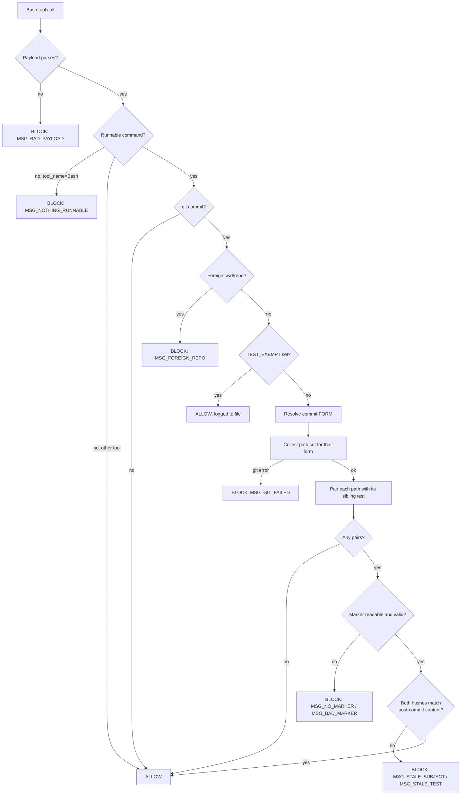

# verification-marker gate

A PreToolUse hook that blocks a `git commit` when a file with a sibling test is being committed at a
version its test suite has never passed against.



## Background — why this exists

`rules/core-conduct.md` already says to reproduce before fixing and to verify before claiming. That is
the weak form of this control, and this repo established over four judge rounds on PR #34 that **a
warning placed where the mistake keeps being made is a disproven control** — the apostrophe trap fired
three times *inside the block carrying the warning against it*.

The strong form is computational: a passing test run leaves a machine-readable record of exactly which
file contents it certified, and a hook refuses a commit whose contents do not match. It cannot be
rationalised past, and it reads content rather than intent.

**Deliberately narrow.** This gate would **not** have caught the narration defect that prompted its
reordering, and the user accepted that explicitly. A narration control is a separate, later design.
Do not widen this feature to cover it.

**Spec location deviates from `writing-specs`** (which defers to `docs/superpowers/specs/`) because
`rules/gates.md` one-canonical-file discipline puts feature-scale work in `docs/features/<name>.md`.
The gate rule wins; there is no second spec location. *Round 1 compliance judged this adequate — do
not "fix" it.*

## Scope

**In:** any repo path with a sibling test under the `X.sh`↔`X.test.sh` / `X.py`↔`X.test.py`
convention. Enumerated from `git ls-files`, not recalled — **13 tracked suite files, 11 conforming
pairs (10 shell + 1 Python), 2 orphan suites.** The 11 pairs, which are the completion criterion for
checklist task 8:

| # | subject | suite |
|---|---|---|
| 1 | `hooks/context-handoff-watch.sh` | `hooks/context-handoff-watch.test.sh` |
| 2 | `hooks/judge-guard.sh` | `hooks/judge-guard.test.sh` |
| 3 | `hooks/memsearch-nudge.sh` | `hooks/memsearch-nudge.test.sh` |
| 4 | `hooks/pane-dispatch-guard.sh` | `hooks/pane-dispatch-guard.test.sh` |
| 5 | `hooks/phase-guard.sh` | `hooks/phase-guard.test.sh` |
| 6 | `hooks/lib/classify-pr-command.py` | `hooks/lib/classify-pr-command.test.py` |
| 7 | `panes/adapters/cmux-layout.sh` | `panes/adapters/cmux-layout.test.sh` |
| 8 | `panes/dispatch-pane-agent.sh` | `panes/dispatch-pane-agent.test.sh` |
| 9 | `panes/run-pane-agent.sh` | `panes/run-pane-agent.test.sh` |
| 10 | `panes/terminal-detect.sh` | `panes/terminal-detect.test.sh` |
| 11 | `statusline-command.sh` | `statusline-command.test.sh` |

The suite files live under four different directory depths, which is why the call site cannot use a
`$0`-relative path (see §1).

**Out, and stated so nobody later assumes coverage:**

- **Two orphan suites — tests with no sibling subject.** `panes/adapters.test.sh` exercises the whole
  `panes/adapters/` directory, and `panes/adapters/cmux-exec.test.sh` exercises
  `panes/adapters/cmux.sh`. Neither `panes/adapters.sh` nor `panes/adapters/cmux-exec.sh` exists.
  Behaviour is defined below (§"Test with no subject"), not left to inference: they write no marker
  and are never gated.
- 🔴 **`panes/adapters/cmux.sh` is gated by nothing.** It is the largest adapter in the repo and it
  *does* have a test — but that test is named `cmux-exec.test.sh`, so the strict 1:1 rule cannot see
  the relationship. `panes/` is therefore **partially** covered, and this file is the hole. Renaming
  the suite would close it and is deliberately **not** in this feature; it is a follow-up task.
- `memsearch/tests/test_*.py` uses a non-sibling layout, so the gate never fires there. Its own
  follow-up task — not forgotten, just not v1.
- Files with no sibling test. The gate never demands a test that does not exist.
- Deletions: every collector uses `--diff-filter=d`, so removing a file needs no test run. Measured:
  on a rename this keeps the **new** path and drops the old one, which is correct — the new path is
  what will exist after the commit.
- Every write path that is not a Bash `git commit` — `sed -i`, the Edit/Write tools, an editor outside
  the session. **This is a momentum guardrail, not a security boundary**, exactly like `judge-guard.sh`.

## Architecture

Three components, mirroring the `judge-guard.sh` / `judge-guard.test.sh` / `hooks/lib/` trio the repo
already knows how to build and test.

### 1. `hooks/lib/write-test-marker.py` — the writer

Python because `hooks/lib/` is Python by convention, and because extracting `classify-pr-command.py`
already proved the payoff: an importable module gets asserted directly instead of probed through a hook.

**Contract:** `python3 -I hooks/lib/write-test-marker.py <test-file-path>` → exit 0 on success,
non-zero with a message on stderr otherwise. Pure function `write_marker(test_path) -> Path | None`
plus a thin `main()`.

**Path normalisation is mandatory and was the round-1 gap.** The suite passes `$0`, which is relative
to the suite's cwd — measured: running `bash adapters/cmux-layout.test.sh` from inside `panes/` yields
`$0 = adapters/cmux-layout.test.sh`, while the store key must be `panes/adapters/cmux-layout.test.sh`.
The writer therefore resolves every path through `git ls-files --full-name -- <path>` before using it.
Measured: from a subdirectory this returns the repo-relative path, and for an untracked path
`--error-unmatch` exits 1 with a message.

**Test with no subject.** After deriving the sibling subject, the writer checks it with
`git ls-files --error-unmatch`. If the subject is not a tracked file, the writer prints a one-line
notice to stderr, **writes no marker, and exits 0** — a green suite must not be turned red by the
absence of a file it never claimed to own. This is not a coverage map and does not re-open the
ratified strict-1:1 rule; it is the defined behaviour for the non-conforming case the repo actually
contains. The gate's mirror of the same rule (below) means those two suites are simply never gated.

**The orphan set is frozen by a test, not by prose.** `write-test-marker.test.py` enumerates
`git ls-files '*.test.sh' '*.test.py'`, derives each subject, and asserts the orphan set is exactly
`{panes/adapters.test.sh, panes/adapters/cmux-exec.test.sh}` and the pair count is exactly 11. A new
orphan — or a rename that silently drops a subject out of the gate — turns that test red. Round 1
failed on an inventory claim that no test could contradict; correcting the number without adding the
control would repeat it.

Otherwise: hashes both files with `git hash-object`, and writes the marker atomically (temp file in
the same directory + `os.replace`).

**Call site — one line per suite, after the tally:**

```sh
[ "$fail" -eq 0 ] && { python3 -I "$(git rev-parse --show-toplevel)/hooks/lib/write-test-marker.py" \
  "$0" || { printf 'marker write FAILED\n' >&2; exit 1; }; }
```

Resolved from the **repo root**, not `$(dirname "$0")/lib` — that round-1 form resolves only for the
5 suites under `hooks/`, and with the mandated `|| exit 1` it would have turned the other 8 red. The
snippet must run with the suite's original cwd intact (`$0` and `rev-parse` both depend on it); a
suite that `cd`s during its run captures both at the top instead.

A failed marker write **fails the suite**. A silent no-marker would surface later as a confusing block.

### 2. `<repo>/hooks/state/test-markers/` — the store

- **One file per subject**, so two concurrent sessions never read-modify-write the same file.
- Filename is the repo-relative subject path, percent-encoded (`/`→`%2F`, `%`→`%25`).
- Resolved from `git rev-parse --show-toplevel`, **never `$HOME`**. Reading `$HOME`'s copy instead of
  the target repo's was literally the bug `fix/judge-guard-verdict-lookup` existed to fix; a marker
  written inside a worktree must be read back inside that worktree.
- Directory mode `0700`, marker files `0600` — core-conduct's default-deny for a generated store. The
  real defence is read-side validation, but the store is the sole authority for letting a commit
  through and there is no reason for it to be world-readable.
- Already gitignored by `/hooks/state/` at `.gitignore:17` — no new ignore rule needed.

**Marker schema** (JSON; two levels deep, so YAML buys nothing here):

```json
{
  "version": 1,
  "subject": { "path": "hooks/judge-guard.sh",      "blob": "<hex>" },
  "test":    { "path": "hooks/judge-guard.test.sh", "blob": "<hex>" },
  "written_at": "2026-08-01T00:00:00Z"
}
```

`written_at` is **informational only and MUST NOT influence any decision.** Freshness is decided by
content hashes alone — a timestamp rule would re-admit the staleness problem the blob key dissolves.

Read-side validation: `version == 1`, both `blob` values match `^([0-9a-f]{40}|[0-9a-f]{64})$` (40
today, 64 leaves room for a SHA-256 repo), both `path` values equal the expected pair. Anything else →
**INVALID → block**.

### 3. `hooks/test-marker-guard.sh` — the gate

PreToolUse, matcher `Bash`. Classification lives in `hooks/lib/classify-commit-command.py`, importable
and unit-tested.

**Wire contract — one helper, one line of JSON.** Round 1 split payload parsing from classification
across a two-line `OK`/command protocol. That protocol cannot carry a multi-line bash command or a
free-text exemption reason without a sanitising step at every boundary — `classify-pr-command.py:96`
already carries a `val.replace("\n", " ")` for exactly this reason. One helper reading the payload and
emitting one JSON object removes the desync class instead of defending against it, and is *more*
unit-testable, not less. The four reused fail-open defences survive intact; only the framing changes.

- **stdin:** the raw PreToolUse payload, decoded UTF-8 with `errors="replace"`.
- **stdout:** exactly one line, a JSON object.
- **exit:** `0` whenever it produced a line; non-zero (with stderr) on an unreadable payload.

```json
{ "v": 1, "tool": "Bash", "kind": "COMMIT",
  "form": "PLAIN", "amend": false, "paths": [], "exempt": "" }
```

| field | domain | meaning |
|---|---|---|
| `v` | `1` | schema sentinel — status *and* shape, because three rounds on `judge-guard` showed a status check alone accepts a component that answers and then dies |
| `tool` | string | `tool_name` from the payload; only ever used to settle what an **absent** command means |
| `kind` | `COMMIT` \| `OTHER` \| `NOTHING_RUNNABLE` | `NOTHING_RUNNABLE` = command absent, empty, or only whitespace/control characters |
| `form` | `PLAIN` \| `PATHSPEC` \| `ALL` \| `INVALID` \| `FOREIGN` | see the resolution table |
| `amend` | bool | `--amend` present |
| `paths` | list of strings | the pathspec operands; empty unless `form == PATHSPEC` |
| `exempt` | string, ≤200 chars, no control characters | `TEST_EXEMPT` value parsed from the command **string** — a `VAR=x` prefix never reaches a hook's environment. The classifier strips control characters and truncates; the hook re-validates and blocks on violation rather than trusting it |

Read-side validation in the hook: output parses as a JSON object, `v == 1`, every field present and
inside its domain, `paths` a list of strings, `exempt` matching `^[^\x00-\x1f\x7f]{0,200}$`. Anything
else → `MSG_CLASSIFIER_BAD_OUTPUT` → block. Existence is not usability.

**`python3 -I`** at every call site, so a stray `json.py` in the working directory cannot shadow the
helper and block every Bash command.

**The command decides; `tool_name` only settles what an ABSENT command means.** Runnable command →
classify it whatever the tool is called; `NOTHING_RUNNABLE` + `Bash` → block; `NOTHING_RUNNABLE` + any
other tool → allow. Keying the skip on the name instead was a measured regression on that branch.

#### Which paths, and which content — measured, not assumed

Round 1 had one column here and it was wrong in both directions: it branched *which file it hashed*
without branching *which paths it looked at*, and it routed `git commit -- <path>` — the form this
repo mandates on every commit — down the index branch, where the gate reads content git will not
commit. Every row below was reproduced on git 2.50.1 in a throwaway
repo; each bullet states the setup and the observed result, and checklist task 6 turns each into a
test that commits for real rather than simulating.

`<base>` is `HEAD`; with `amend: true` it is `HEAD^`, and if `HEAD^` does not resolve (amending a root
commit — measured: exit 128) it is the empty-tree oid `4b825dc642cb6eb9a060e54bf8d69288fbee4904`.

| `form` | path set | content of each path |
|---|---|---|
| `PLAIN` | `git diff --cached --name-only --diff-filter=d <base>` | index blob: `git ls-files --stage -- <path>` |
| `PATHSPEC` | `git diff --name-only --diff-filter=d <base> -- <paths>` | worktree blob: `git hash-object -- <path>` |
| `ALL` (`-a`/`--all`) | `git diff --name-only --diff-filter=d <base>` | worktree blob |
| `INVALID` (`-a` **and** a pathspec) | — | — — git itself exits 128 and commits nothing, so the hook allows and lets git refuse |
| `FOREIGN` | — | — — block, see below |

What each row is defending, with the measurement:

- **`PATHSPEC` content.** Index `v2`, worktree `v3`, then `git commit -m x -- foo.sh` → `git show
  HEAD:foo.sh` is **`v3`**. Round 1 would have hashed `v2`, matched the marker, and allowed a version
  no test ever saw — a silent fail-open in the repo's own house style.
- **`PATHSPEC` path set.** A pathspec also *narrows*: with `foo.sh` staged, `git commit -m x -- bar.md`
  commits **`bar.md` only**, while the index collector returns `foo.sh` and would have raised a false
  block on a file not being committed. `git diff <base> -- <paths>` returns exactly `bar.md`.
- **`PATHSPEC` on an unchanged file.** `git commit -m x -- foo.sh bar.md` with `foo.sh` identical to
  HEAD commits `bar.md` only, and the collector returns `bar.md` only. No false block from a broad
  pathspec such as `-- hooks/`.
- **`ALL` path set.** With a never-staged worktree edit, `git diff --cached --name-only` returns
  **zero paths** while the commit contains the file. Round 1's collection would have found no pairs
  and allowed — the `-a` scenario it wrote was unreachable against its own collector.
- **`amend` base.** Staging a sidecar and amending: `git diff --cached <base=HEAD>` returns the
  sidecar alone, `<base=HEAD^>` returns the sidecar **and** the file from the amended commit, which
  is exactly the amended commit's contents. All three forms combine with `--amend` unchanged;
  `--amend` alters only the base.

**`FOREIGN` — which repo is this commit for?** A PreToolUse hook sees `cd /other/repo && git commit
-m x` as one command string and cannot follow the `cd`; resolving `--show-toplevel` from its own cwd
would read a different repo's index and a different repo's markers, and both allowing and blocking on
that basis would be wrong. The classifier therefore reports `form: FOREIGN` when the command contains
a `cd`, a `git -C`, `--git-dir`, or `--work-tree` anywhere before the commit, and the hook **blocks**
with `MSG_FOREIGN_REPO`, whose message says to run the commit as its own command from the target repo
or to set `TEST_EXEMPT`. Failing closed on "cannot determine" is the whole point of the control.

**Pairing rule.** The unit is the `(subject, test)` pair, not the single file. If **either** member is
in the path set, that pair needs a valid marker whose two blobs equal the post-commit content of both
members. Pairing on the file alone would let a test file ship at a version that was never run. A test
file whose derived subject is not tracked forms no pair — the gate's mirror of the writer's rule, so
the two orphan suites are never gated rather than permanently unsatisfiable.

**Every git invocation is status-checked.** Measured: outside a repo, `git diff --cached --name-only`
prints **nothing** on stdout and exits 128 — indistinguishable from "no files to check" to any caller
that reads only stdout, and therefore an allow. That is `judge-guard` fail-open #3 reborn in the one
subsystem this hook adds. A non-zero exit from *any* collection or hashing command → `MSG_GIT_FAILED`
→ block. Never pipe one of these into another command: the pipeline's status is the last stage's.

## Scenarios

### Correct behaviour

```gherkin
Scenario: fresh marker allows the commit
  Given hooks/foo.sh has a sibling hooks/foo.test.sh
    And the suite passed against the current content of both
   When "git commit -m msg" is staged with hooks/foo.sh
   Then the hook exits 0

Scenario: a file with no sibling test is never gated
  Given docs/notes.md is staged and has no sibling test
   When "git commit -m msg" runs
   Then the hook exits 0

Scenario: partial staging is not a false block
  Given the suite passed against hooks/foo.sh
    And hooks/foo.sh is staged while other files are modified but unstaged
   When "git commit -m msg" runs
   Then the hook exits 0
   # staged ⊆ tested; this is why the key is per-file blobs, not a whole-tree hash

Scenario: untracked scratch files are irrelevant
  Given the suite passed against hooks/foo.sh and a scratch file was written afterwards
   When "git commit -m msg" runs with hooks/foo.sh staged
   Then the hook exits 0

Scenario: a pathspec narrows the gate to what is actually being committed
  Given hooks/foo.sh is staged with no marker
    And docs/notes.md is modified and has no sibling test
   When "git commit -m msg -- docs/notes.md" runs
   Then the hook exits 0
   # index-based collection would have demanded a marker for a file this commit does not touch

Scenario: a pathspec covering an unchanged sibling-tested file does not block
  Given hooks/foo.sh is identical to HEAD and has no marker
    And hooks/bar.md is modified
   When "git commit -m msg -- hooks/" runs
   Then the hook exits 0

Scenario: an orphan suite is never gated
  Given panes/adapters.test.sh is staged and panes/adapters.sh does not exist
   When "git commit -m msg" runs
   Then the hook exits 0
   # no derivable subject means no pair; the writer likewise skips it and leaves the suite green
```

### Incorrect behaviour the gate must catch

```gherkin
Scenario: no marker at all
  Given hooks/foo.sh is staged and its suite has never been run
   When "git commit -m msg" runs
   Then the hook exits 2 with MSG_NO_MARKER naming hooks/foo.sh and "bash hooks/foo.test.sh"

Scenario: the remedy names the right interpreter for a Python pair
  Given hooks/lib/classify-pr-command.py is staged with no marker
   When "git commit -m msg" runs
   Then the hook exits 2 with MSG_NO_MARKER naming "python3 hooks/lib/classify-pr-command.test.py"
   # the remedy is derived from the suite's extension, never hardcoded to bash

Scenario: the subject changed after the run
  Given the suite passed, then hooks/foo.sh was edited and staged
   When "git commit -m msg" runs
   Then the hook exits 2 with MSG_STALE_SUBJECT

Scenario: a test version that was never run is being shipped
  Given the suite passed against hooks/foo.test.sh v1
    And hooks/foo.test.sh was then edited to v2 and staged without re-running
   When "git commit -m msg" runs
   Then the hook exits 2 with MSG_STALE_TEST

Scenario: a pathspec commit is gated on worktree content, not the index
  Given the suite passed against hooks/foo.sh v1
    And hooks/foo.sh v1 is staged, then edited to v2 in the worktree without staging
   When "git commit -m msg -- hooks/foo.sh" runs
   Then the hook exits 2 with MSG_STALE_SUBJECT
   # measured: this commit ships v2; reading the index would compare v1 and wrongly allow

Scenario: git commit -a does not escape the gate
  Given the suite passed, then hooks/foo.sh was edited but never staged
   When "git commit -a -m msg" runs
   Then the hook exits 2 with MSG_STALE_SUBJECT
   # measured: "git diff --cached" returns zero paths here, so the path set must come from
   # "git diff HEAD" or the gate finds no pairs and allows

Scenario: an amend re-commits a file from the amended commit at an untested version
  Given hooks/foo.sh was committed, then edited and staged
    And the suite has not been re-run
   When "git commit --amend --no-edit" runs
   Then the hook exits 2 with MSG_STALE_SUBJECT
   # measured: the amended commit's contents are "git diff --cached HEAD^", not HEAD

Scenario: a commit aimed at another repo cannot be verified, so it blocks
  Given hooks/foo.sh has a valid marker in this repo
   When "cd /other/repo && git commit -m msg" runs
   Then the hook exits 2 with MSG_FOREIGN_REPO
```

### Edges

```gherkin
Scenario: a corrupt marker fails closed
  Given the marker for hooks/foo.sh is truncated, empty, or wrong-shaped
   When "git commit -m msg" runs with hooks/foo.sh staged
   Then the hook exits 2 with MSG_BAD_MARKER
   # existence is not usability — the lesson from four fail-opens on judge-guard

Scenario: a git failure is never read as "nothing to check"
  Given a collection command exits non-zero with empty stdout
   When "git commit -m msg" runs
   Then the hook exits 2 with MSG_GIT_FAILED

Scenario: a classifier that answers with the wrong shape fails closed
  Given classify-commit-command.py prints valid JSON whose "v" is not 1
   When the hook runs
   Then it exits 2 with MSG_CLASSIFIER_BAD_OUTPUT

Scenario: an exemption reason carrying control characters is rejected
  Given the command sets TEST_EXEMPT to a value containing a newline
   When the hook runs
   Then it exits 2 with MSG_CLASSIFIER_BAD_OUTPUT
   # the classifier strips; the hook re-validates and does not trust the strip

Scenario: a deletion needs no test run
  Given hooks/foo.sh and hooks/foo.test.sh are both staged as deletions
   When "git commit -m msg" runs
   Then the hook exits 0

Scenario: a rename is gated at its new path only
  Given hooks/foo.sh is staged as a rename to hooks/foo2.sh
   When "git commit -m msg" runs
   Then the path set contains hooks/foo2.sh and not hooks/foo.sh
   # measured: --diff-filter=d drops the D half of the rename and keeps the A half

Scenario: half a pair is deleted while the other half changes
  Given hooks/foo.sh is staged as a modification
    And hooks/foo.test.sh is staged as a deletion
   When "git commit -m msg" runs
   Then the hook exits 2 with MSG_STALE_TEST
   # the test resolves to ABSENT, so the pair cannot be certified; deleting BOTH passes instead

Scenario: -a combined with a pathspec is left to git
  Given any staged state
   When "git commit -a -m msg -- hooks/foo.sh" runs
   Then the hook exits 0
   # measured: git itself exits 128 with "paths ... with -a does not make sense" and commits nothing

Scenario: an explicit exemption is honoured and logged to a file
  Given hooks/foo.sh is staged with no marker
   When "TEST_EXEMPT=vendored upstream git commit -m msg" runs
   Then the hook exits 0
    And one line is appended to <repo>/hooks/state/test-exempt.log
   # parsed out of the command STRING — a VAR=x prefix never reaches a hook's environment

Scenario: a Bash payload with nothing runnable blocks
  Given a Bash payload whose command is absent, empty, or only whitespace/control characters
   When the hook runs
   Then it exits 2 with MSG_NOTHING_RUNNABLE

Scenario: a non-Bash tool with no command passes
  Given an Edit payload with no command field
   When the hook runs
   Then it exits 0

Scenario: a suite run from a subdirectory writes a key the gate can find
  Given "bash adapters/cmux-layout.test.sh" is run from inside panes/
   When the suite passes and writes its marker
   Then the marker key is panes%2Fadapters%2Fcmux-layout.sh
   # measured: $0 is "adapters/cmux-layout.test.sh" there; without git ls-files --full-name
   # normalisation the marker lands under a key the gate never looks up
```

## Fail-closed contract

Scoped honestly, because RUN 4 and RUN 5 both caught this hook family overclaiming coverage in its own
header.

**These block:** missing or unusable `python3`; an unreadable payload; a missing, empty, truncated,
unreadable, or wrong-output classifier; **a non-zero exit from any git command the gate runs**; an
unreadable or malformed marker; a stale subject or test blob; a commit whose target repository cannot
be determined; a Bash payload with nothing runnable.

**These do not, and are accepted:** command shapes the classifier cannot lex (quoted substitution
`X="$(git commit …)"`, backticks, `eval`, function/alias indirection, path-qualified `/usr/bin/git`,
and the `sudo`/`env`/`timeout` wrapper denylist gap); a **hanging** helper, which needs a timeout and is
deferred; any write that does not arrive as a Bash `git commit`; `panes/adapters/cmux.sh`, which no
naming-conforming suite claims.

### The doors

`exit 2` is not one door. Round 1 stated that rule and then named five constants against at least
eight implied doors — a spec that states the rule without the table lets an implementation satisfy the
letter while collapsing exactly the doors that were collapsed last time. The full set is eleven:

| constant | fires when |
|---|---|
| `MSG_BAD_PAYLOAD` | the PreToolUse payload does not parse |
| `MSG_NOTHING_RUNNABLE` | `Bash` payload with no runnable command |
| `MSG_NO_PYTHON` | `python3` missing or not executable |
| `MSG_CLASSIFIER_MISSING` | the classifier file is absent or unreadable |
| `MSG_CLASSIFIER_FAILED` | the classifier exits non-zero or prints nothing |
| `MSG_CLASSIFIER_BAD_OUTPUT` | output is not one JSON object passing every field check |
| `MSG_FOREIGN_REPO` | the commit's target repository cannot be determined |
| `MSG_GIT_FAILED` | any collection or hashing git command exits non-zero |
| `MSG_NO_MARKER` | a pair is in the path set with no marker file |
| `MSG_BAD_MARKER` | the marker exists but fails schema or path validation |
| `MSG_STALE_SUBJECT` / `MSG_STALE_TEST` | the marker is valid but a blob does not match |

The suite asserts **the message, not just the code** — mutation testing on `judge-guard` showed 48
assertions that could not tell one door from another, and a mutant survived a happy 101/0 suite.
**Mutation floor: one mutant per door**, each rerouting that door's message to another door's, plus
emptying the classifier. A two-mutant minimum against eleven doors establishes nothing about the other
nine.

`MSG_NO_MARKER`'s remedy string is derived from the suite path and its extension — `bash <path>` for
`.sh`, `python3 <path>` for `.py` — never hardcoded to `bash`.

**Exemption logging.** `TEST_EXEMPT` appends one tab-separated line — ISO-8601 UTC, the sanitised
reason, the pairs skipped — to `<repo>/hooks/state/test-exempt.log`, in addition to stderr. Stderr
alone is what `judge-guard` does and is tolerable there because its exemptions are rare and human;
here they will be routine, and an unauditable exemption count is the exact erosion path the control
exists to prevent.

## Pinned versions

Measured on this machine, not recalled: **bash 3.2.57** (macOS system bash — no associative arrays, no
`mapfile`, no `${var,,}`), **Python 3.9.6** (stdlib only; `-I` drops the script directory from
`sys.path`, so no sibling imports), **git 2.50.1**, **shellcheck 0.11.0** (`/opt/homebrew/bin/shellcheck`
— check sets differ across releases and it gates checklist task 10).

## Testing requirements

- `hooks/test-marker-guard.test.sh` — throwaway git repo, payload on **stdin**, which is the production
  path. A hook tested only through its CLI path is a bug that has already shipped in this repo. Covers
  every `form` row against a real commit, not a simulated one.
- `hooks/lib/write-test-marker.test.py` — sibling derivation, `--full-name` normalisation from a
  subdirectory, the no-subject skip, atomic write, schema, file mode, failure exits, **and the frozen
  inventory assertion** (11 pairs, exactly 2 named orphans).
- `hooks/lib/classify-commit-command.test.py` — direct unit assertions on the JSON contract: every
  `form`, `--amend`, `exempt` sanitisation, the `FOREIGN` triggers, and the accepted-open shapes, so
  closing one later is a conscious decision with a failing test rather than drift.
- **Mutation check before the PR:** one mutant per door (eleven), plus emptying the classifier.

## Checklist

- [ ] 1. ADR under `docs/decisions/` — record the marker-as-receipt framing, the three rejected
      designs (PostToolUse observer, `bin/run-tests` wrapper, mutual certification), the accepted-open
      shapes, and the `cmux.sh` coverage hole. Check the next free ADR number against `main` first.
- [ ] 2. Red: `classify-commit-command.test.py` — every `form`, `--amend`, `exempt` sanitisation,
      `FOREIGN` triggers, ignored shapes, accepted-open shapes.
- [ ] 3. Green: `hooks/lib/classify-commit-command.py`.
- [ ] 4. Red: `write-test-marker.test.py` — derivation, normalisation, no-subject skip, atomic write,
      schema, mode, failure exits, frozen inventory.
- [ ] 5. Green: `hooks/lib/write-test-marker.py`.
- [ ] 6. Red: `hooks/test-marker-guard.test.sh` — every scenario above, asserting message **and** code.
- [ ] 7. Green: `hooks/test-marker-guard.sh`.
- [ ] 8. Wire the one-line call into all **11 paired suites** (the table in §Scope is the completion
      criterion; the 2 orphan suites are deliberately not wired). **Own commit**, measured
      behaviour-neutral against the unmodified hook — never bundled with a green step. ⚠️ Tasks 7 and
      8 must be reverted **as a pair**: reverting the hook alone leaves 11 suites calling a deleted
      writer, and reverting the wiring alone blocks every commit.
- [ ] 9. Mutation check — one mutant per door (eleven) plus an emptied classifier; record the result
      in the checklist annotation.
- [ ] 10. `shellcheck -x` (0.11.0) clean apart from pre-existing findings; confirm which are
      pre-existing by blame **before** claiming it, not after.
- [ ] 11. Gate stub in `rules/gates.md`; `hooks/README.md` entry.
- [ ] 12. Register in `settings.json` via `update-config`, preserving `"model": "opus[1m]"`.
- [ ] 13. **First-arming check** — pipe a real `git commit` payload into the *installed* hook and
      expect a readable exit 2, not a silent 0 and not a hang. `judge-guard` shipped with this untested
      and the installed copy had no `lib/` at all.
- [ ] 14. Obs judge (implementation stage) pinning the final HEAD → PR.

**Follow-ups this feature deliberately does not do:** rename `panes/adapters/cmux-exec.test.sh` to
match `cmux.sh` and close that coverage hole; bring `memsearch/tests/` under a sibling layout; give the
helper invocations a timeout.

**Bootstrap note.** This gate covers `hooks/*.sh`, which includes its own files. It is not armed during
development because the harness loads the primary checkout's copy — the same reason a `judge-guard` fix
could not be gated by `judge-guard` until the primary checkout pulled it. Expect it to arm only after
merge, and treat task 13 as the first real test of that.
