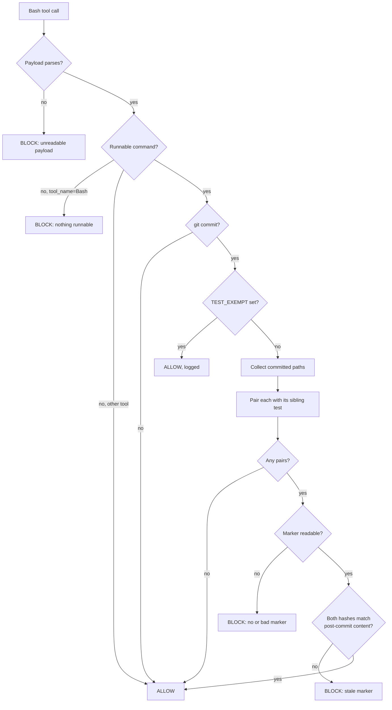

# verification-marker gate

A PreToolUse hook that blocks a `git commit` when a file with a sibling test is being committed at a
version its test suite has never passed against.



## Background — why this exists

`rules/core-conduct.md` already says to reproduce before fixing and to verify before claiming. That is
the weak form of this control, and this repo established over four judge rounds on PR #34 that **a
warning placed where the mistake keeps being made is a disproven control** — the apostrophe trap fired
three times *inside the block carrying the warning against it*.

The strong form is computational: a passing test run leaves a machine-readable record of exactly which
file contents it certified, and a hook refuses a commit whose contents do not match. It cannot be
rationalised past, and it reads content rather than intent.

**Deliberately narrow.** This gate would **not** have caught the narration defect that prompted its
reordering, and the user accepted that explicitly. A narration control is a separate, later design.
Do not widen this feature to cover it.

**Spec location deviates from `writing-specs`** (which defers to `docs/superpowers/specs/`) because
`rules/gates.md` one-canonical-file discipline puts feature-scale work in `docs/features/<name>.md`.
The gate rule wins; there is no second spec location.

## Scope

**In:** any repo path with a sibling test under the `X.sh`↔`X.test.sh` / `X.py`↔`X.test.py` convention.
Today that is 9 shell pairs and 1 Python pair (`hooks/`, `panes/`, `statusline-command.sh`,
`hooks/lib/classify-pr-command.py`).

**Out, and stated so nobody later assumes coverage:**

- `memsearch/tests/test_*.py` uses a non-sibling layout, so the gate never fires there. Tracked as its
  own follow-up task — not forgotten, just not v1.
- Files with no sibling test. The gate never demands a test that does not exist.
- Deletions (`--diff-filter` excludes `D`): removing a file needs no test run.
- Every write path that is not a Bash `git commit` — `sed -i`, the Edit/Write tools, an editor outside
  the session. **This is a momentum guardrail, not a security boundary**, exactly like `judge-guard.sh`.

## Architecture

Three components, mirroring the `judge-guard.sh` / `judge-guard.test.sh` / `hooks/lib/` trio the repo
already knows how to build and test.

### 1. `hooks/lib/write-test-marker.py` — the writer

Python because `hooks/lib/` is Python by convention, and because extracting `classify-pr-command.py`
already proved the payoff: an importable module gets asserted directly instead of probed through a hook.

**Contract:** `python3 hooks/lib/write-test-marker.py <test-file-path>` → exit 0 on success, non-zero
with a message on stderr otherwise. Pure function `write_marker(test_path) -> Path` plus a thin `main()`.

Derives the subject from the test path by the sibling rule, hashes both files with `git hash-object`,
and writes the marker atomically (temp file + `os.replace`).

**Call site — one line per suite, after the tally:**

```sh
[ "$fail" -eq 0 ] && { python3 "$(dirname "$0")/lib/write-test-marker.py" "$0" \
  || { printf 'marker write FAILED\n'; exit 1; }; }
```

A failed marker write **fails the suite**. A silent no-marker would surface later as a confusing block.

### 2. `<repo>/hooks/state/test-markers/` — the store

- **One file per subject**, so two concurrent sessions never read-modify-write the same file.
- Filename is the repo-relative subject path, percent-encoded (`/`→`%2F`, `%`→`%25`).
- Resolved from `git rev-parse --show-toplevel`, **never `$HOME`**. Reading `$HOME`'s copy instead of
  the target repo's was literally the bug `fix/judge-guard-verdict-lookup` existed to fix; a marker
  written inside a worktree must be read back inside that worktree.
- Already gitignored by `/hooks/state/` at `.gitignore:17` — no new ignore rule needed.

**Marker schema** (JSON; two levels deep, so YAML buys nothing here):

```json
{
  "version": 1,
  "subject": { "path": "hooks/judge-guard.sh",      "blob": "<hex>" },
  "test":    { "path": "hooks/judge-guard.test.sh", "blob": "<hex>" },
  "written_at": "2026-08-01T00:00:00Z"
}
```

`written_at` is **informational only and MUST NOT influence any decision.** Freshness is decided by
content hashes alone — a timestamp rule would re-admit the staleness problem the blob key dissolves.

Read-side validation: `version == 1`, both `blob` values match `^[0-9a-f]{40,64}$` (40 today, 64 leaves
room for a SHA-256 repo), both `path` values equal the expected pair. Anything else → **INVALID → block**.

### 3. `hooks/test-marker-guard.sh` — the gate

PreToolUse, matcher `Bash`. Classification lives in `hooks/lib/classify-commit-command.py`, importable
and unit-tested, returning `(kind, exempt)` with `kind ∈ {COMMIT, NO}`.

It reuses, rather than reinvents, the four fail-open fixes `judge-guard.sh` paid for:

- **Sentinel-guarded payload parse** — parser prints `OK` on line 1, command on line 2; the hook checks
  `case "$parse_rc:$parse_ok" in 0:OK)`. Status *and* shape, because three separate rounds on that
  branch showed a status check alone accepts a component that answers and then dies.
- **Output-validated classifier** — `kind` is only ever `COMMIT` or `NO`; existence is not usability.
- **`python3 -I`** at every call site, so a stray `json.py` in the working directory cannot shadow the
  parser and block every Bash command.
- **The command decides, `tool_name` only settles what an ABSENT command means.** Runnable command →
  classify it whatever the tool is called; nothing runnable + `Bash` → block; nothing runnable + any
  other tool → allow. Keying the skip on the name instead was a measured regression on that branch.

**Which content the gate compares.** For each committed path `P`, resolve the content that *will exist
after this commit*:

| condition | hash source |
|---|---|
| `-a`/`--all` present and `P` modified in the worktree | `git hash-object` of the worktree file |
| otherwise | the index entry from `git ls-files --stage` (equals HEAD for untouched files) |
| `P` absent from the index | `ABSENT` |

The `-a` row is the whole reason that flag needs its own branch: `git commit -a` commits worktree
content, but a PreToolUse hook reading the index sees a **stale** value — measured, not assumed.

**Pairing rule.** The unit is the `(subject, test)` pair, not the single file. If **either** member is
in the commit, that pair needs a valid marker whose two blobs equal the post-commit content of both
members. Pairing on the file alone would let a test file ship at a version that was never run.

## Scenarios

### Correct behaviour

```gherkin
Scenario: fresh marker allows the commit
  Given hooks/foo.sh has a sibling hooks/foo.test.sh
    And the suite passed against the current content of both
   When "git commit -m msg" is staged with hooks/foo.sh
   Then the hook exits 0

Scenario: a file with no sibling test is never gated
  Given docs/notes.md is staged and has no sibling test
   When "git commit -m msg" runs
   Then the hook exits 0

Scenario: partial staging is not a false block
  Given the suite passed against hooks/foo.sh
    And hooks/foo.sh is staged while other files are modified but unstaged
   When "git commit -m msg" runs
   Then the hook exits 0
   # staged ⊆ tested; this is why the key is per-file blobs, not a whole-tree hash

Scenario: untracked scratch files are irrelevant
  Given the suite passed against hooks/foo.sh and a scratch file was written afterwards
   When "git commit -m msg" runs with hooks/foo.sh staged
   Then the hook exits 0
```

### Incorrect behaviour the gate must catch

```gherkin
Scenario: no marker at all
  Given hooks/foo.sh is staged and its suite has never been run
   When "git commit -m msg" runs
   Then the hook exits 2 with MSG_NO_MARKER naming hooks/foo.sh and "bash hooks/foo.test.sh"

Scenario: the subject changed after the run
  Given the suite passed, then hooks/foo.sh was edited and staged
   When "git commit -m msg" runs
   Then the hook exits 2 with MSG_STALE_SUBJECT

Scenario: a test version that was never run is being shipped
  Given the suite passed against hooks/foo.test.sh v1
    And hooks/foo.test.sh was then edited to v2 and staged without re-running
   When "git commit -m msg" runs
   Then the hook exits 2 with MSG_STALE_TEST

Scenario: git commit -a does not escape the gate
  Given the suite passed, then hooks/foo.sh was edited but never staged
   When "git commit -a -m msg" runs
   Then the hook exits 2 with MSG_STALE_SUBJECT
   # reading the index here would compare stale content and wrongly allow
```

### Edges

```gherkin
Scenario: a corrupt marker fails closed
  Given the marker for hooks/foo.sh is truncated, empty, or wrong-shaped
   When "git commit -m msg" runs with hooks/foo.sh staged
   Then the hook exits 2 with MSG_BAD_MARKER
   # existence is not usability — the lesson from four fail-opens on judge-guard

Scenario: a deletion needs no test run
  Given hooks/foo.sh and hooks/foo.test.sh are both staged as deletions
   When "git commit -m msg" runs
   Then the hook exits 0

Scenario: half a pair is deleted while the other half changes
  Given hooks/foo.sh is staged as a modification
    And hooks/foo.test.sh is staged as a deletion
   When "git commit -m msg" runs
   Then the hook exits 2 with MSG_STALE_TEST
   # the test resolves to ABSENT, so the pair cannot be certified; deleting BOTH passes instead

Scenario: an explicit exemption is honoured and logged
  Given hooks/foo.sh is staged with no marker
   When "TEST_EXEMPT=vendored upstream git commit -m msg" runs
   Then the hook exits 0 and logs the reason
   # parsed out of the command STRING — a VAR=x prefix never reaches a hook's environment

Scenario: a Bash payload with nothing runnable blocks
  Given a Bash payload whose command is absent, empty, or only whitespace/control characters
   When the hook runs
   Then it exits 2 with MSG_NOTHING_RUNNABLE

Scenario: a non-Bash tool with no command passes
  Given an Edit payload with no command field
   When the hook runs
   Then it exits 0
```

## Fail-closed contract

Scoped honestly, because RUN 4 and RUN 5 both caught this hook family overclaiming coverage in its own
header. **These block:** missing or unusable `python3`; an unreadable payload; a missing, empty,
truncated, unreadable, or wrong-output classifier; an unreadable or malformed marker; a Bash payload
with nothing runnable.

**These do not, and are accepted:** command shapes the classifier cannot lex (quoted substitution
`X="$(git commit …)"`, backticks, `eval`, function/alias indirection, path-qualified `/usr/bin/git`,
and the `sudo`/`env`/`timeout` wrapper denylist gap); a **hanging** helper, which needs a timeout and is
deferred; any write that does not arrive as a Bash `git commit`.

`exit 2` is not one door. Every block reason gets its own named constant and its own message, and the
suite asserts **the message, not just the code** — mutation testing on `judge-guard` showed 48
assertions that could not tell one door from another, and a mutant survived a happy 101/0 suite.

## Pinned versions

Measured on this machine, not recalled: **bash 3.2.57** (macOS system bash — no associative arrays, no
`mapfile`, no `${var,,}`), **Python 3.9.6** (stdlib only; `-I` drops the script directory from
`sys.path`, so no sibling imports), **git 2.50.1**.

## Testing requirements

- `hooks/test-marker-guard.test.sh` — throwaway git repo, payload on **stdin**, which is the production
  path. A hook tested only through its CLI path is a bug that has already shipped in this repo.
- `hooks/lib/write-test-marker.test.py` and `hooks/lib/classify-commit-command.test.py` — direct unit
  assertions, including the accepted-open shapes so closing one is a conscious decision with a failing
  test rather than drift.
- **Mutation check before the PR:** at minimum, rerouting one block door to another reason's message,
  and emptying the classifier, must each be caught by the suite.

## Checklist

- [ ] 1. ADR under `docs/decisions/` — record the marker-as-receipt framing, the three rejected
      designs (PostToolUse observer, `bin/run-tests` wrapper, mutual certification), and the
      accepted-open shapes. Check the next free ADR number against `main` first.
- [ ] 2. Red: `classify-commit-command.test.py` — guarded shapes, ignored shapes, accepted-open shapes.
- [ ] 3. Green: `hooks/lib/classify-commit-command.py`.
- [ ] 4. Red: `write-test-marker.test.py` — sibling derivation, atomic write, schema, failure exits.
- [ ] 5. Green: `hooks/lib/write-test-marker.py`.
- [ ] 6. Red: `hooks/test-marker-guard.test.sh` — every scenario above, asserting message **and** code.
- [ ] 7. Green: `hooks/test-marker-guard.sh`.
- [ ] 8. Wire the one-line call into all 10 existing suites. **Own commit**, measured behaviour-neutral
      against the unmodified hook — never bundled with a green step.
- [ ] 9. Mutation check (two mutants above); record the result in the checklist annotation.
- [ ] 10. `shellcheck -x` clean apart from pre-existing findings; confirm which are pre-existing by
      blame **before** claiming it, not after.
- [ ] 11. Gate stub in `rules/gates.md`; `hooks/README.md` entry.
- [ ] 12. Register in `settings.json` via `update-config`, preserving `"model": "opus[1m]"`.
- [ ] 13. **First-arming check** — pipe a real `git commit` payload into the *installed* hook and
      expect a readable exit 2, not a silent 0 and not a hang. `judge-guard` shipped with this untested
      and the installed copy had no `lib/` at all.
- [ ] 14. Obs judge (implementation stage) pinning the final HEAD → PR.

**Bootstrap note.** This gate covers `hooks/*.sh`, which includes its own files. It is not armed during
development because the harness loads the primary checkout's copy — the same reason a `judge-guard` fix
could not be gated by `judge-guard` until the primary checkout pulled it. Expect it to arm only after
merge, and treat task 13 as the first real test of that.
