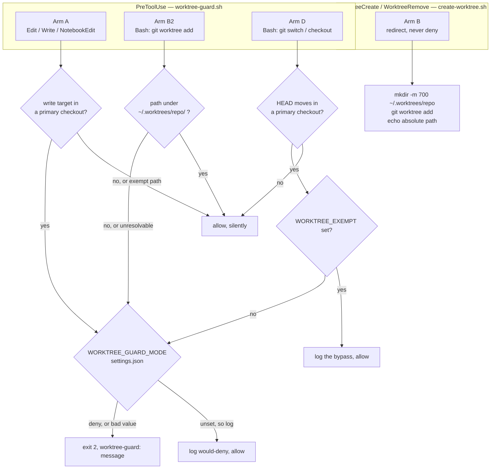
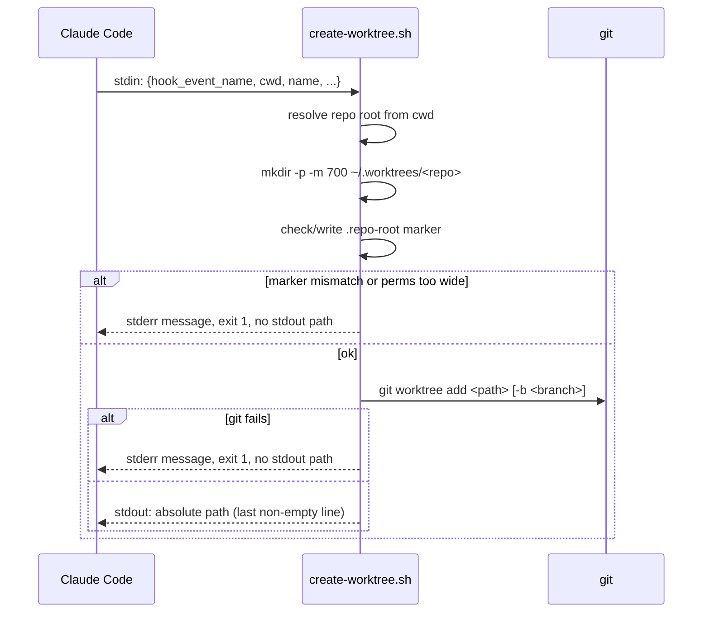

# worktree-guard.sh — worktrees are mandatory, and they live in one place

> Closes the TODO recorded at `session-state.md:79-82`: the standing worktree rule (memory
> `feedback_always_work_in_a_worktree`, 2026-08-23) has lived only in memory and prose. Memory is
> advisory and does not survive into every session's attention; this feature gives the rule a
> computational home.

> **⚠️ Reconciled card, 2026-08-24.** This document is the merge of two versions that were developed
> in parallel and diverged from the same planning commit — a live demonstration of the very problem
> it exists to solve. One line (`docs/plan-worktree-location-guard`, PRs #76 and #77, on `main`) ran
> the probes and recorded measurements. The other (`docs/close-pane-dispatch-model-flag`) ran three
> compliance-judge rounds and reworked the design. **Neither was a superset of the other, and the
> probe line's facts contradicted the design line's assumptions in three places** — the
> `WorktreeCreate` payload shape, `--path-format` support detection, and what `WorktreeRemove`
> actually does. Measurements won every such conflict. Provenance is marked inline where it
> matters; do not "restore" anything from either parent without re-reading this note.

## Problem

Two related rules currently hold only by convention, and both fail the same way — silently, in the
exact session that forgot them.

**Rule 1 — work happens in a worktree, never the primary checkout.** Several Claude sessions run
against one repo at once. The primary checkout has a single HEAD, so a session that parks it on a
new branch changes the branch out from under every other session sharing it. This has already
happened: one session moved `~/.claude` to a new branch while another had uncommitted `panes/*.sh`
edits in that same checkout, so that session's next commit would have landed on a branch it never
chose.

**Rule 2 — every worktree lives at `~/.worktrees/<repo-name>/<worktree-name>`.** Today they nest
*inside* the working tree at `.claude/worktrees/`, which puts checkouts inside the repo they are
checkouts of. Centralizing them gets worktrees out of the tree entirely and makes "what am I
working on, machine-wide" a single `ls`.

## Design at a glance



The diagram cannot show the two things most likely to bite: Arm A resolves the repo from the
**write target**, never the session cwd (`phase-guard.sh:191-197` records this as its one bug
class, found in round 6), and the primary-vs-linked test is a **fail-open** unless paths are
normalized first (see Detection).

## Decisions taken (user, 2026-08-24)

Settled explicitly via `AskUserQuestion`. Recorded here because several are deliberate acceptances
of a known cost, and a later reader will otherwise re-litigate them.

| Decision | Choice | Note |
|---|---|---|
| Enforcement | **Hard deny** (exit 2) | Arm D alone carries a bypass — see below |
| Trigger surface | `Edit`/`Write`/`NotebookEdit` + two **git-command** Bash arms | The heuristic Bash write arm was **dropped** — see Non-goals |
| Path exemptions | Explicit list, below — **not** "reuse phase-guard verbatim" | Round-1 compliance fix; the prose and the list disagreed |
| Repo opt-in | **None — every git repo on this machine** | Deliberate divergence from `phase-guard.sh:248`; blast radius accepted, see below |
| `<repo-name>` segment | **Directory basename**, collision-detected | A `.repo-root` marker makes a collision a deny, not a silent share |
| Existing 4 worktrees | **Not migrated** | Guard applies to new `git worktree add` only |
| Branch switching | **Arm D added** (2026-08-24, round-1 revision) | The original design never covered the incident in Problem |
| Arm D bypass | `WORKTREE_EXEMPT=<reason>`, logged | User: "I can bypass by manually switching the branch if I really need to" |
| Arming | **Log-only first, then flip to deny** | `settings.json` `env.WORKTREE_GUARD_MODE`; absent means `log` |
| Switch location | **`settings.json`, not `hooks/state/`** | Round-2 fix: `.gitignore:17` ignores `/hooks/state/`, so arming would have left no record in git |
| What the log records | **Refusals only** — never allows | Round-2 fix: one line per evaluation measured at 10–20 MB per three days |
| Dirty worktree on removal | **Refuse, never `--force`** | Boundary 26. A stale directory is recoverable; silently destroyed work is not |

### The exemption list, stated in full

`docs/*`, `.claude/*`, `settings.json`, `projects/*/memory/*`, `rules/*`, `skills/*`,
`CODING_MEMORY.md`, `coding-memory/*`.

The last two matter and were **missing** from the round-1 draft, which claimed to reuse
`phase-guard.sh:294-298` "verbatim" while printing a shorter list beside it. `coding-memory/` holds
`observability-judge/verdicts.jsonl` and `compliance-judge/verdicts.jsonl` — under the shorter
list, a judge running with its cwd in a primary checkout would be denied permission to write its
own verdict, and this feature's own gate would jam. The list is now written out rather than
incorporated by reference, so the two can no longer drift.

### The accepted blast radius

`phase-guard.sh:248` exits silently unless the repo has a `docs/features/` directory — an opt-in
signal, so a repo that never heard of the phase workflow is never blocked by it. **This hook has no
such signal, by explicit user decision.** The consequence was stated plainly before the choice and
is restated here so it is not discovered later as a bug:

> Every fresh `git clone` on this machine will deny guarded writes from its primary checkout until
> a worktree exists for it.

That is the intended behavior, not an oversight. Two things bound it: the guard ships in **log-only
mode**, so the first days produce evidence rather than friction; and `settings.json` is on the
exemption list, so the hook's own registration always remains editable — the same reasoning
`phase-guard.sh:280-283` gives for exempting it there ("a guard that can block edits to its own off
switch is a footgun").

## Detection — verified, not assumed

The primary-vs-linked test is `git rev-parse --git-dir` against `--git-common-dir`. Probed on
git 2.50.1 (Apple Git-155):

| Where | `--git-dir` | `--git-common-dir` |
|---|---|---|
| Primary checkout, at root | `.git` | `.git` |
| Primary checkout, **in a subdirectory** | `~/.claude/.git` | `../../.git` |
| Linked worktree | `<common>/worktrees/close-model-re` | `~/.claude/.git` |

**The naive string compare is a fail-open, and it is the first thing to get right.** From any
subdirectory of a primary checkout the two values differ *in form only* — absolute vs. relative —
so `[ "$d" != "$c" ]` reads "these differ" → "this is a linked worktree" → **allow**. The guard
would be silently off in every subdirectory of every primary checkout, which is most writes. This
is the same fail-open class that cost `phase-guard.sh` six judge rounds, arriving here on day one.

**Fix:** `git rev-parse --path-format=absolute --git-dir` and `--git-common-dir`, which normalize
both sides. Verified above — primary-in-subdirectory collapses to two identical absolute paths, and
the linked worktree still differs.

`--path-format` requires git ≥ 2.31. **Below that floor the guard denies, it does not allow**
(round-1 compliance fix; the draft said fail-open). A guard that switches itself off precisely when
it cannot verify its own precondition is indistinguishable from the feature being absent, and
`git-guard.sh` already fails closed on a checkout it cannot name (ADR 0026).

### Task 2 — re-probed independently, 2026-08-24

Re-probed from scratch in a throwaway repo rather than copied forward, since these are the numbers
the guard is built on. Every case above reproduced:

| Case | naive verdict | `--path-format=absolute` verdict |
|---|---|---|
| Primary, at root | PRIMARY ✓ | PRIMARY ✓ |
| **Primary, in subdirectory** | **LINKED ✗ (the fail-open)** | **PRIMARY ✓** |
| Linked worktree, at root | LINKED ✓ | LINKED ✓ |
| Linked worktree, in subdirectory | LINKED ✓ | LINKED ✓ |
| Primary, **detached HEAD** | PRIMARY ✓ | PRIMARY ✓ |
| Not a git repository | `rc=128 fatal: not a git repository` | same |

**The support probe is ambiguous, and a naive one takes the wrong branch.**
`git rev-parse --path-format=absolute --git-dir` exits **128 in both** failure modes: git < 2.31
(`fatal: unknown argument to --path-format: …`) and no-repo (`fatal: not a git repository`). A guard
that detects support **by exit code alone reads every non-repo directory as "old git"** and takes
whichever branch that leads to. This is why Arm A step 2 compares the numeric version from
`git --version`, and why step 4 narrows "not a git repo" to a match on the *diagnostic text* rather
than on a non-zero exit — the two must be told apart by something other than the exit status.

**Version floor — honest gap.** Both gits on this machine are ≥ 2.31 (`/usr/bin/git` 2.50.1 Apple
Git-155; `/opt/homebrew/bin/git` 2.54.0), so **the sub-floor branch has never been executed.** Task
3 must cover it by **stubbing `git` on `PATH`**, not by hoping. The same is true of the git-absent
case.

### Repo shapes that are out of scope

- **Bare repository** → **allow**. No working tree exists to write into, so neither rule can be
  violated. **The signal is `--show-toplevel`'s diagnostic, not `--is-bare-repository`** — measured
  in task 2a, a bare repo makes step 4's `git rev-parse --show-toplevel` exit **128** printing
  `fatal: this operation must be run in a work tree`. Step 4 runs first, so an implementation that
  waited to ask `--is-bare-repository` would already have denied; step 4 therefore recognizes that
  second diagnostic itself. `--is-bare-repository` is **not** part of the recipe: it also exits 128
  on a non-repo, so it cannot tell "bare" from "not a repo" without the same text match, and one
  copy of that rule is enough. (Revised 2026-08-26 on the task-2a measurement; the original recipe
  named `--is-bare-repository` and was unreachable.)
- **Submodule** (`git rev-parse --show-superproject-working-tree` non-empty) → **allow**. A
  submodule's `--git-common-dir` points into the superproject's `.git/modules/<name>` and equals
  its `--git-dir`, so it reads as "primary checkout" and would be denied wholesale. Excluding
  submodules is a deliberate under-block; the alternative is blocking all submodule work machine
  -wide for a collision risk that does not apply to them.
- **A linked worktree checked out *from* a bare repo is neither**, and needs no special case:
  measured in task 2a it is not bare, `--show-toplevel` succeeds, and its `--git-dir`
  (`<bare>/worktrees/<name>`) differs from its `--git-common-dir` (`<bare>`), so it reaches step 7
  and reads as a linked worktree → allow. Pinned by its own scenario so a later revision cannot
  collapse it into the bare case.

The submodule probe runs **before** the primary-vs-linked compare. Both claims were untested when
first written; **task 2a measured them** (git 2.50.1, throwaway repos, 2026-08-26) — the submodule
claim reproduced exactly and the bare claim produced the revision above.

## Scope of rule 2 — where worktrees may live

Target layout, nested in this order:

```
~/.worktrees/<repo-name>/<worktree-name>
```

`git worktree add` accepts an arbitrary `<path>` (verified: `git worktree add --help`), so git
itself imposes no obstacle. The obstacle is the harness.

### `~/.worktrees` is a new data store — created default-deny

It does not exist yet (verified). `create-worktree.sh` owns it:

- Creates `~/.worktrees` and `~/.worktrees/<repo-name>` with `mkdir -p -m 700`. It will hold
  working copies of every repo on this machine, including any secrets those trees carry, so it
  starts at owner-only rather than at the ambient umask.
- If either directory already exists with any group or other permission bit set, the hook
  **refuses** and names the fix (`chmod 700 <path>`). It does not silently re-`chmod` a directory
  the user may have widened deliberately.

### Basename collisions are detected, not tolerated

Two repos named `api` in different orgs would share `~/.worktrees/api/`, and two worktrees named
`main` under them would collide outright. On first use, `create-worktree.sh` writes
`~/.worktrees/<repo-name>/.repo-root` containing the absolute repo root. On every later use it
compares; a mismatch is a **refusal** naming both roots, not a silent share. Arm B2 performs the
same check before allowing a hand-rolled `git worktree add`.

### RESOLVED — `WorktreeCreate` is the mechanism; re-entry is one-shot

Probe complete (pane `general-purpose`, against installed Claude Code **2.1.241**). Two claims
independently re-verified here against the binary before being built on, per zero-trust: subagent
output is data.

**There is no setting that moves the CLI's worktree directory.** A `worktree.location` key exists
in the schema, and its own description rules itself out — re-verified verbatim by
`strings <binary> | grep "Directory under which"`:

> "Directory under which **Claude Code Desktop** creates the worktrees of **SSH sessions** … Read
> by the desktop app from the SSH host user settings … **The CLI (`--worktree`, `EnterWorktree`,
> agent isolation) does not read it yet.**"

Complete `worktree.*` key set (probe, from the settings zod schema): `symlinkDirectories`,
`sparsePaths`, `baseRef`, `bgIsolation`, `location`. Only `location` concerns paths, and the CLI
ignores it. The managed path is hardcoded as `join(repoRoot, ".claude", "worktrees")`, taking no
settings or env lookup. No `CLAUDE_CODE_WORKTREE_*` env var exists.

**`WorktreeCreate` / `WorktreeRemove` hooks DO work inside a git repo, and are the only supported
relocation mechanism.** Both re-verified as real event literals in the binary. The tool description
("outside a git repository") is misleading: the creator checks for the hook *before* it checks for
a git repo, so the hook branch wins everywhere. All three creation surfaces — `--worktree`,
`EnterWorktree name:`, and Agent/workflow `isolation: "worktree"` — route through it.

**This inverts the design.** A `WorktreeCreate` hook *redirects* rather than blocks, which is
strictly better than a `PreToolUse` deny: the session gets a worktree in the right place instead of
an error telling it to go make one.

#### The limitation to design around

`EnterWorktree path:` into a path outside the repo, by case:

| Case | Verdict | Detail |
|---|---|---|
| (a) First entry from launch directory | **works** | Only gate is `git worktree list` registration. But `checkPermissions` returns `ask` for any path outside `.claude/worktrees/`, and it is **not** auto-approvable — expect an interactive prompt |
| (b) Switching while already in a worktree | **blocked** | "Switching from this session is limited to worktrees managed by Claude Code" |
| (c) Pinned / `Agent(isolation:"worktree")` subagent | **blocked** | Same error |

Critically, the `requireManagedLocation` branch computes its allowed root as
`<repo>/.claude/worktrees` **with no `WorktreeCreate` hook consultation at all** — so even a
worktree our own hook legitimately created at `~/.worktrees/…` is unreachable in (b) and (c).

Two consequences — **but read the correction first**:

> ⚠️ **CORRECTED 2026-08-24 (open question 7, now resolved).** An earlier revision read
> "`Agent(isolation: "worktree")` cannot reach one." **That is wrong, and the distinction matters:**
> the (b)/(c) block governs *switching into an existing* worktree via `EnterWorktree path:`. It does
> **not** govern *creation*. An agent dispatched with `isolation: "worktree"` fires the
> `WorktreeCreate` hook like any other surface and lands in the centralized worktree the hook
> creates — verified live (it created `agent-a55a3192caab741ed` under the central path, and
> `<repo>/.claude/worktrees` was never created). Isolation-based subagents work under this design;
> only re-entry into an *already existing* centralized worktree stays blocked.

- No mid-session switching between centralized worktrees. Route through a fresh session launched
  with `cwd` at the worktree instead.
- `Agent(isolation: "worktree")` cannot *switch into an existing* one. **Note this is not the same
  as pane dispatch** — `dispatch-pane-agent.sh` passes `--cwd`, launching a fresh session.
  **CONFIRMED — task 1a, by code and live** (2026-08-24):
  - `run-pane-agent.sh:47` does a plain `cd "$run_cwd"`, then invokes `"$CLAUDE_BIN" -p … --agent …`
    as a fresh OS process. `EnterWorktree` is never called on this path, so `requireManagedLocation`
    is never consulted — (b)/(c) cannot apply.
  - Live check: a `general-purpose` pane dispatched with `--cwd` at a worktree *outside* its repo
    returned `VERDICT: FULLY_FUNCTIONAL` — `show-toplevel`, `HEAD`, both `--path-format` reads,
    `status`, `log`, and a file write all succeeded, with no guard block and no permission prompt.

**The cost of taking the hook path:** our hook owns the entire lifecycle — creating the git
worktree, choosing the branch, and cleanup on `WorktreeRemove`. `worktree.baseRef` and
`worktree.sparsePaths` are **not applied** on the hook path; the hook branch returns before that
code runs. Today `baseRef` is unset (no `worktree` key in `settings.json`), so nothing is lost yet,
but re-implementing `fresh`-vs-`head` base selection is now our job.

## Design sketch

**Two files, not one.** `worktree-guard.sh` handles the three `PreToolUse` arms;
`create-worktree.sh` handles the `WorktreeCreate`/`WorktreeRemove` lifecycle. They share no logic
and fire on different events; a single `worktree-guard.sh` name for both would invite a reader to
expect coupling that does not exist. (Resolves round-1 open question #3.)

**Arm A — the worktree requirement** (`PreToolUse` on `Edit|Write|NotebookEdit`):

1. Read the payload's `file_path` / `notebook_path`; no path → allow, silently.
2. `git --version` — **git absent from `PATH`, or version < 2.31 → deny.** This runs *before* any
   `rev-parse`, because a missing or too-old git makes every later probe fail in a way that is
   indistinguishable from "not a git repository" (round-2 fix: the recipe and the scenarios
   disagreed on exactly this).
3. Resolve the owning repo **from the write target**, never from the session cwd.
4. `git rev-parse --show-toplevel`, and **branch on the diagnostic text, never on the exit code**:
   exit 0 → continue; non-zero with the "not a git repository" diagnostic → **not in a git repo**,
   allow silently; non-zero with the "this operation must be run in a work tree" diagnostic →
   **bare repo**, allow silently; any other non-zero exit is a validation failure and denies (see
   Failure boundaries). The bare branch was added 2026-08-26 on the task-2a measurement — it was
   step 5's job in the original recipe, which step 4 denied before step 5 could run.
5. Submodule (`git rev-parse --show-superproject-working-tree` non-empty) → allow, silently.
6. Path matches the exemption list → allow, silently.
7. `--path-format=absolute` compare: git-dir == common-dir → **deny** (subject to mode).

**Arm B — the location, by redirect** (`WorktreeCreate` hook — *not* a deny):



Registered with no `matcher`:

```json
"WorktreeCreate": [ { "hooks": [ { "type": "command", "command": "<abs path>/create-worktree.sh" } ] } ]
```

Contract — **task 1b DONE, executed first-hand** against Claude Code **2.1.241**, 2026-08-24, and
extended by the question 7–9 probes the same day. The falsifier was "the hook never fires, and the
session lands in `<repo>/.claude/worktrees/` instead" — it did fire, and it did not.

> **The probe harnesses were session-scratchpad scripts and are not durable** — do not go looking
> for them. Everything they established is written out below; task 3 rebuilds the parts worth
> keeping as `hooks/worktree-guard.test.sh`, which is where they should have lived.

- **Input** on stdin — **the key set varies by surface.** Five keys are always present:

  ```json
  { "session_id": "…", "transcript_path": "…",
    "cwd": "<repo root the session launched from>",
    "hook_event_name": "WorktreeCreate", "name": "probewt" }
  ```

  `prompt_id` is present **only when creation is triggered mid-session** (`EnterWorktree name:`,
  `Agent(isolation: "worktree")`) and absent at launch time (`--worktree`). Observed across seven
  runs; `permission_mode`, `agent_id`, `agent_type` and `effort` never appeared on **any** surface —
  including the agent-isolation one, where `agent_*` would have been the natural place for them.
  **The safe rule: build only on `cwd` and `name`**, which is all the target-path computation needs,
  and treat everything else as may-or-may-not-be-there.
- **Output — confirmed.** The **last non-empty trimmed line** of stdout is taken. Verified
  adversarially: the probe hook printed `this line should be ignored`, then a blank line, then the
  target path; the session landed on the target path. A path outside the repository is accepted —
  `<repo>/.claude/worktrees` was never created.
- **The hook must create the worktree itself — confirmed.** The probe hook ran `git worktree add`;
  the new worktree appeared in `git worktree list` and the session's own `pwd` was the target path.
  `hookBased: true` means no branch is created and none is reported — branch selection is ours.
- **All three creation surfaces confirmed** (open question 7). Each fired the hook and each landed
  in the hook's centralized path, with `<repo>/.claude/worktrees` never created:

  | Surface | Hook fired | `name` it passed |
  |---|---|---|
  | `--worktree <name>` (launch time) | ✅ | the name given |
  | `EnterWorktree name:` (mid-session) | ✅ | the name given |
  | `Agent(isolation: "worktree")` | ✅ | auto-generated `agent-<hex>` |

  ⚠️ **Probe-design note.** The agent-isolation case first came back "blocked" — but by
  `hooks/pane-dispatch-guard.sh`, which denies an Agent dispatch when no pane-split policy is
  recorded. That is *our own guard*, not a worktree limit, and it fired before the hook could be
  reached. Re-run with `CLAUDE_PANE_AGENT=1` (`pane-dispatch-guard.sh:76`) it routed through the
  hook normally. **A probe that measures our own guard instead of the harness reads as a harness
  limitation** — worth remembering for tasks 3–7.

- **Failure modes — all fail closed but one** (open question 8):

  | Hook behavior | Result | Session error |
  |---|---|---|
  | exits non-zero | rc=1, no worktree entered | `WorktreeCreate hook failed: <script>: <its stderr>` |
  | prints nothing | rc=1 | `hook succeeded but returned no worktree path` |
  | prints a **relative** path | rc=1 | resolved against the repo root, then `does not exist or is not a directory` |
  | prints a path it never created | rc=1 | same `does not exist` error |
  | prints a path **inside the repo** | **rc=0 — ACCEPTED** | none |

  Three things follow. **(1)** Arm B can rely on fail-closed behavior for every malformed output —
  a broken hook stops the session rather than silently falling back to the managed path. This
  settles what failure boundaries 15–24 depend on. **(2)** The in-repo case is *not* rejected, so
  the hook is the only thing keeping worktrees out of the tree; there is no harness-side backstop.
  **(3) A hook that creates the worktree and then reports a bad path leaves an orphan registered in
  `git worktree list`** — observed twice. Our hook must create and report **atomically**, and clean
  up after itself on its own failure paths.

  The empty-output error also revealed a second hook transport: *"command: echo the path to stdout;
  **http/callback: return `hookSpecificOutput.worktreePath`**"*. Not needed here, but the stdout
  contract is one of two, not the only one.

- **`WorktreeRemove` fires — and removes nothing** (open question 9). It fired on an explicit
  `ExitWorktree action: "remove"`, carrying `session_id`, `transcript_path`, `cwd`, `prompt_id`,
  `hook_event_name`, `worktree_path`. **But with a hook registered, Claude performs no cleanup of
  its own.** The probe hook only logged, and afterwards the directory still existed with all its
  contents, `git worktree list` still registered it, the branch still existed, and
  `git worktree prune --dry-run` found nothing to prune —

  > while the session reported: *"Exited and removed worktree at …"*.

  **That success message is false on the hook path.** Cleanup is entirely the hook's job. If our
  `WorktreeRemove` hook does not run `git worktree remove` and delete the branch, centralized
  worktrees accumulate silently while the UI says they were removed. **The single most load-bearing
  finding for task 7.**

**Branch and base selection — the contract, since it is now ours.** `hookBased: true` means Claude
creates no branch and reports none, so the hook must decide. Round 2 found this asserted twice and
defined nowhere.

| Question | Answer |
|---|---|
| Branch name | The payload's `name`, **verbatim** |
| Deliberately *not* applied | The managed path's rename to `worktree-<name>` with `/`→`+` (memory `reference_enterworktree_renames_the_branch_you_asked_for`). We own naming now; silently renaming the caller's branch is the surprise that memory exists to record |
| Base ref | `origin/HEAD`, resolved via `git symbolic-ref refs/remotes/origin/HEAD` |
| `origin/HEAD` unresolvable | **Fail** (boundary 23), naming the ref. Do not silently fall back to local `HEAD` — that is how a worktree gets based on whatever branch the primary checkout happened to be parked on, which is the class of bug this whole feature exists to stop |
| Branch already exists | Reuse it, never `-b` over it, never force (boundary 22) |
| Directory already exists | `git worktree add` fails on its own; boundary 21 reports it |

**Arm B2 — hand-rolled `git worktree add`** (`PreToolUse` on `Bash`), to stop the other route:

1. Lex into segments via `hooks/lib/shell_segments.py`, as `git-guard`/`merge-guard`/`doc-guard`
   already do, so `foo && git worktree add ...` is caught and a flag binds to its own segment.
2. Classify via an extended `hooks/lib/classify-git-command.py` rather than a fourth inline
   classifier (ADR 0029 moved `merge-guard` off exactly that pattern).
3. For each `SEG_WORKTREE_ADD<tab><i><tab><path>`, compute **the effective repo for segment `i`**
   using the shared resolution rule in the classifier contract below. Round 4 found this arm had no
   cwd-resolution step at all while Arm D had one, so `cd /repos/other && git worktree add
   ~/.worktrees/.claude/x` was judged against the session repo and allowed — the exact case the
   discriminating scenario exists to deny. **Neither arm derives this for itself any more.**
4. `<path>` is `UNRESOLVABLE`, or the effective repo does not resolve → **deny**, naming the
   segment. Fail closed: a `git worktree add` whose target the guard cannot identify is precisely
   the case it exists to catch.
5. Require the resolved absolute path to be under `~/.worktrees/<repo-name>/` **for that effective
   repo**, with a matching `.repo-root` marker. Anything else → **deny**, naming the correct path in
   the message.

**Arm D — moving a primary checkout's HEAD** (`PreToolUse` on `Bash`) — added in the round-1
revision, widened in round 2. Arms A/B/B2 block *editing files* and *misplacing worktrees*, but the
incident in Problem is a session **moving the primary checkout's HEAD**, which none of them touch.

**The principle, which governs anything the list below misses:** deny a command that changes what
*other* sessions sharing this checkout would see — HEAD moving to a different branch or commit, or
the shared working tree being overwritten wholesale.

- **In scope** (denied when the effective repo is a primary checkout): `git switch` in every form
  (`<branch>`, `-c`/`-C`, `-`, `--detach`, `--orphan`); `git checkout` in its HEAD-moving forms
  (`<branch|sha>`, `-b`/`-B`, `-`, `--detach`, `--orphan`); `git merge`; `git pull`; `git rebase`;
  `git reset` in every form **except** one carrying a `--` pathspec; `git cherry-pick`;
  `git revert`; `git stash pop`/`apply`.
- **Out of scope** (allowed — these touch named paths, not HEAD): `git checkout -- <path>`,
  `git checkout <ref> -- <path>`, `git restore` in any form, `git reset -- <path>`, and every
  read-only git command.
- **The list is a known under-block, and that direction is deliberate.** An unrecognized `git`
  subcommand is **allowed**, because the alternative is denying every git command the classifier
  has not been taught. Recorded in Non-goals rather than left to be discovered.
- **`git merge` matters specifically:** the incident logged at `session-state.md:85` was a stray
  `git merge --ff-only`, which the round-1 design and the first version of this arm both missed.

**Which repository Arm D judges.** Unlike Arm A — which resolves from the *write target* — Arm D
has no target path, so for each `SEG_BRANCH_MOVE<tab><i><tab><subcommand>` it computes **the
effective repo for segment `i`** using the shared resolution rule in the classifier contract below.
It does not carry its own recipe.

Round 4's advisory read found the old private recipe reading `-C` out of a fact
(`GIT_DIR_OPT<tab><path>`) that carried no segment identity, so `git -C /other log && git switch
main` from the primary checkout would have applied segment 0's redirect to segment 1's `switch` and
**allowed** it — the exact incident this feature exists to stop. Under the shared rule, `-C` binds
only to the segment that carries it, and that line denies.

**Bypass:** `WORKTREE_EXEMPT=<reason> git switch main` allows the command and records the reason in
the log. Same shape as `MERGE_EXEMPT`/`TEST_EXEMPT`/`JUDGE_EXEMPT`.

**Stated limit:** this arm governs commands Claude runs through the `Bash` tool. A human typing in
their own terminal is never intercepted by any `PreToolUse` hook, so the user's escape hatch exists
whether or not `WORKTREE_EXEMPT` does. The deny message must not imply otherwise.

#### Arm D is two layers, not one (user decision, 2026-08-25)

Rounds 3–7 all cited the same defect: this classifier **fails open** on any shape it cannot lex, so
every missed shape is a live HEAD move. Round 8's pivot proposed replacing it with a git-layer hook.
The second measurement pass found the replacement has its own defect — vetoing a HEAD write does
**not** roll back the checkout, so a refusal leaves the destination branch's content staged in the
shared tree (measured; see "The blocking finding" below). One mechanism is clean but leaky; the
other is comprehensive but messy.

**Decision: run both, in order.** They are complementary rather than redundant, and the ordering is
the whole point.

| | Layer 1 — `worktree-guard.sh` (`PreToolUse` on `Bash`) | Layer 2 — `reference-transaction` git hook |
|---|---|---|
| Fires | **before git runs at all** | during git's ref transaction |
| Sees | the command text | the ref update, never the command |
| Covers | the shapes it can lex | everything that reaches a `HEAD` write |
| On refusal | **tree untouched** — nothing has run | tree holds destination content, staged |
| Fails | **open** (unlexable ⇒ allowed) | **closed** for HEAD writes it sees |

**What layering buys — and the boundary it does not cross.** For a **`HEAD` move**, layer 1's
fail-open stops being load-bearing, which is the property every one of the five citations was really
about: a shape layer 1 cannot lex is no longer a live HEAD move, it is a HEAD move layer 2 refuses.
There, layer 2's dirty tree is also rare and diagnostic — **a dirty tree after a refusal is the
signal that layer 1 needs widening**, and it arrives with `rc=128` and a message rather than
silently.

⚠️ **That claim holds for HEAD moves and nothing else, and the difference is the whole risk.**
Layer 2 gates ref transactions on `HEAD`. Six commands in Arm D's own scope overwrite the shared
working tree while producing **no `HEAD` transaction at all**, so layer 2 never sees them and
**layer 1 remains the sole defence — still failing open**. Measured 2026-08-25,
`scratchpad/verify_lockgaps.sh` and `scratchpad/verify_ffmerge.sh`, each with controls that fired
the other way:

| Command | `HEAD` txn? | Layer 2 denies? | Shared tree changed |
|---|---|---|---|
| `git stash pop` | **no** | no (rc=0) | yes — `MAIN2 → DIRTY` |
| `git stash apply` | **no** | no (rc=0) | yes — `MAIN2 → DIRTY` |
| `git reset --hard HEAD` | **no** | no (rc=0) | yes — `DIRTY → MAIN2`, uncommitted work destroyed |
| `git revert` | **no** | no (rc=0) | yes — `MAIN2 → MAIN1` |
| `git merge --ff-only` | **no** | no (rc=0) | yes — whole manifest, a new file appears |
| `git cherry-pick` | **no** | no (rc=0) | yes — whole manifest |
| — controls — | | | |
| `git switch <b>` | yes | **deny** rc=128 | — |
| `git checkout --detach` | yes (**raw sha**) | **deny** rc=128 | — |
| `git checkout <sha>` | yes (**raw sha**) | **deny** rc=128 | — |
| `git worktree add <p> <b>` | yes | allow rc=0, worktree created | — |

The raw-sha rows matter on their own: because the rule keys on the **lock** rather than on the
shape of the new value, it catches OID writes to `HEAD` as well as symref writes. A rule written as
"deny `HEAD → ref:refs/heads/…`" would be blind to all three detach forms. That was measured
separately and is why the rule is phrased as it is.

**So the honest summary of the layering is two sentences, not one.** Against a HEAD move, layer 2
is a real backstop and layer 1 may be incomplete without that being a hole. Against a working-tree
overwrite that leaves `HEAD` alone — half of Arm D's stated command list — **there is no backstop
at all**, and every previous round's criticism of layer 1's fail-open applies to those six commands
undiminished. Any statement that "the pivot fixed the fail-open" is false as a general claim and
must not be written anywhere in this card.

**What it does not buy.** It is not defence in depth against an adversary. Four one-flag bypasses
defeat layer 2 and `WORKTREE_EXEMPT` clears layer 1, all measured. Layering raises the floor on
*accidents*, which is the entire threat model here — the logged incident was a stray
`git merge --ff-only`, not an attack.

**Consequences for the sections above — stated once, here, and nowhere else.** Layer 1 keeps the
classifier contract, the seven indexed facts, the shared effective-repo rule, and derivations 1–4
**as its rule**, with exactly one amendment: the unresolvable-token relaxation recorded in
"Layer 1's unresolvable-token deny is relaxed" below. Nothing else about them changes, and
derivation 3 in particular is **not** superseded — it is what layer 1 does, and layer 1 still ships
and still fires first.

What the pivot changed is the *claim* attached to those derivations, not the derivations: they no
longer have to be exhaustive, and the card must stop describing a gap in them as a hole in the
feature. The two residuals in Non-goals (`./myscript.sh`, an interpreter-built git call) are
**caught by layer 2 when and only when they move `HEAD`**, and must be re-described that way —
never as "layer 2 covers them", which is false for the six working-tree commands in the table above.

⚠️ **Round 8's own section below said the opposite** — that "the derivation-3 text above is now
superseded for Arm D and must not be treated as the design". That sentence was written before the
design was written into this body, and it is **withdrawn**; this paragraph governs. Task 5 builds
derivation 3's `SEG_OPAQUE` as specified.

#### Layer 2 — the `reference-transaction` hook

**The rule, entire:**

> Judge only the **primary context** — `git rev-parse --absolute-git-dir` equals
> `git rev-parse --path-format=absolute --git-common-dir`. There, at stage `prepared`, for a
> transaction line whose ref is `HEAD`: **deny if `<that common dir>/HEAD.lock` exists.**
> Otherwise allow.

🚩 **Two corrections to this rule, both measured 2026-08-25 — the earlier wording disabled the
guard entirely.**

1. **`--path-format=absolute` is load-bearing, not tidiness.** The rule previously compared
   `--absolute-git-dir` against a bare `--git-common-dir`. Those are **never equal**, in the primary
   checkout or anywhere else, because the second returns a path relative to the cwd. Measured in
   this repo: `--absolute-git-dir` → `/Users/marksuyat/.claude/.git`; `--git-common-dir` → `.git`
   at the root and `../.git` from `hooks/`. The hook would therefore have failed its scope test on
   **every** invocation, bailed, and allowed every HEAD move — while the liveness check went on
   reporting it armed. That is precisely the failure mode this card names twice: a guard whose
   absence is indistinguishable from its success. Layer 1's boundary 6 already uses
   `--path-format=absolute`; layer 2 must use it too.
   **The corrected form discriminates in both directions, both measured:** in the primary,
   `/Users/marksuyat/.claude/.git` == `/Users/marksuyat/.claude/.git` → judged; in the linked
   worktree `…/.claude/worktrees/rule-surface-trim`, `--absolute-git-dir` →
   `/Users/marksuyat/.claude/.git/worktrees/rule-surface-trim` ≠ `/Users/marksuyat/.claude/.git` →
   bailed. A check only verified in the direction that passes is not verified.
   ⚠️ `--path-format` requires git ≥ 2.31, the same floor task 2 established, and task 2 recorded
   that probing for its support **by exit code is ambiguous against a non-repo** — so layer 2 must
   detect it the way layer 1 does, not by re-inventing the probe.
2. **`$GIT_COMMON_DIR` is not an environment variable here.** The rule was written as though the
   hook could read it from its environment. The second measurement pass measured `GIT_DIR`
   **unset** in the hook's environment at the gated write, and nothing establishes
   `GIT_COMMON_DIR` is set either. The path must come from the `rev-parse` above — the same value
   the scope test just computed — never from the environment. Boundary 33 covers the case where
   something sets it anyway.

No token, no nonce, no expiry, no ledger, no command inspection. `git worktree add` holds
`worktrees/<name>/HEAD.lock` and not the primary's, so it passes; `switch`, `checkout`,
`switch --detach` and `symbolic-ref` all hold the primary's, so they refuse. Measured 10/10 with
both clauses shown firing — table in the second measurement pass below.

**Only `prepared` can veto.** Exiting non-zero at `aborted` or `committed` is ignored by git
(rc=0, ref moves anyway), so the stage guard is load-bearing, not defensive tidiness.

**Installation — global `core.hooksPath`, with a liveness check** (user decision, 2026-08-25).

⚠️ **Every claim in this subsection is ⬜ — probe-reported, not independently re-run.** The card's
convention: ✅ means re-run and reproduced, ⬜ means it came back from a probe and has not been
re-derived since. The four claims below were reported by the second measurement pass and are
restated here **at that strength, not upgraded**. They are load-bearing for the installation
decision, so each carries the probe that would settle it.

- Global reaches every repo including ones cloned later, with no per-repo setup ⬜, and there is no
  per-repo alternative that does not mean shimming every hook name in every repo ⬜.
  *Settles it:* clone a fresh repo after arming and assert the hook fires there.
- It **replaces** `.git/hooks` rather than adding to it ⬜. Blast radius reported as 12 `.git/hooks`
  directories under `$HOME`, **0** holding a non-sample executable hook, **0** setting
  `core.hooksPath` locally ⬜. Nothing on this machine breaks; the cost is latent.
  ⚠️ **The 12 is a floor, not a measurement.** Round 8's compliance judge could not reproduce it —
  a depth-6 scan found 11 and an unbounded scan timed out. Nothing turns on 11 vs 12; both zeroes
  are what the decision rests on, and those are the numbers to re-run.
  *Settles it:* an unbounded `find $HOME -type d -name hooks -path '*/.git/*'` run to completion,
  with the executable-hook and local-`core.hooksPath` counts derived from its output.
- The sharper risk is reciprocal ⬜. `husky` and `lefthook` install by setting `core.hooksPath`
  **locally**, and local beats global — so the first repo to run `husky install` does not get broken
  by the guard, it **silently removes** the guard from the one repo where work is happening. This
  is why the liveness check below is a requirement and not a nicety.
  *Settles it:* `git config --local core.hooksPath .husky` in a throwaway repo, then assert a HEAD
  move there is no longer refused. This one is the reason the liveness check exists, so it should be
  run before task 8 rather than left ⬜.

**The liveness check — layer 1 checks layer 2.** Every arm of `worktree-guard.sh` already runs on
the relevant tool calls, so it is the natural place to assert layer 2 is actually armed: resolve the
effective repo's `core.hooksPath`, and confirm a `reference-transaction` file exists there and is
executable. If it does not, **say so** — a guard whose absence is indistinguishable from its success
is the failure this card has already recorded once, in task 10's note about a refusal-only log
reading *flawless* when the guard has gone blind.

Three measured failure modes make this non-optional, all silent, all rc=0 with HEAD moved: hook file
missing; hook present but not executable; entire `hooksPath` directory missing.

⚠️ **The check is not self-hosting.** If `worktree-guard.sh` itself is unregistered, nothing checks
either layer. That regress terminates at `settings.json`, which is tracked and reviewable — the same
place task 9 registers the hook and task 8 arms it.

**Mode and bypass must reach a different process.** `WORKTREE_GUARD_MODE` and `WORKTREE_EXEMPT` are
read by layer 1 from its own environment, but layer 2 runs as a child of `git`, not of the hook.
Measured: an assignment prefix on the git command line (`WORKTREE_EXEMPT=x git switch main`) **does**
reach the `reference-transaction` hook, including `worktree add`'s internal sub-invocations. **Not
measured, and required before task 8 can claim the mode switch works end to end:** whether a
`settings.json` `env` entry, which reaches the Bash *tool* process, is still in git's environment by
the time the hook runs. It should be — env is inherited — but the card asserts nothing it has not
run, and this is the switch that arms a machine-wide deny.

**The deny message describes the state and prescribes no destructive command** (revised 2026-08-25,
after the observability judge ran the remedy this card used to name). Because a veto leaves the
destination branch's content staged (below), the message is the only thing standing between the user
and a commit that mixes two branches — but the remedy this card previously named,
`git reset --hard HEAD`, is **withdrawn**. It was run: another session's staged
`other-session-work.txt` was **destroyed**. Three separate reasons, any one of which is
disqualifying:

1. **Arm D denies it.** `git reset` in every form except one carrying a `--` pathspec is on Arm D's
   own in-scope list (`git reset --hard HEAD` has no pathspec). The card would be prescribing a
   command it also blocks.
2. **Nothing can tell the residue from real work.** After the veto, the destination content and any
   pre-existing staged work carry identical `git status` markers — the measured table below shows
   `A featonly.txt / M marker.txt / M shared.txt` with no field distinguishing origin. A blanket
   recovery command therefore cannot be safe, because it cannot see what it is discarding.
3. **It reports success on a state it did not clean.** After a vetoed `git rebase` the reset exits 0
   while `$GIT_COMMON_DIR/rebase-merge` survives ⬜, so the user is told they recovered and has not.

**What the message says instead** — state, then the two exits, each with its precondition, and the
choice left to the human:

- HEAD did not move; name the branch it is still on.
- The index and working tree now hold the destination's content, **staged** — name the destination.
- If `$GIT_COMMON_DIR/rebase-merge`, `rebase-apply`, `CHERRY_PICK_HEAD`, `REVERT_HEAD` or
  `MERGE_HEAD` exists, name it: a sequencer operation is in progress and its own `--abort` is the
  only thing that ends it.
- **Exit A — complete forward:** re-run with `WORKTREE_EXEMPT=<reason>`. The tree already holds the
  destination's content, so letting the switch finish makes the checkout self-consistent instead of
  mixed. The honest cost is stated in the message: this is the guard being overridden, not the guard
  being satisfied.
- **Exit B — roll back:** offered **only** when the tree was clean before the command ran, and the
  message says which case it is in. Nothing else may claim rollback is safe.

**Why exit B is conditional, and what would make it unconditional.** Layer 2 sees only the ref
update, never the prior tree, so from inside the veto the two cases are indistinguishable — that is
reason 2 above. Layer 1 *can* distinguish them, because it runs **before** git touches anything, and
a pre-command `git status --porcelain` there is the whole discriminator. Carrying that fact into
layer 2 means a cross-process handoff, which is exactly the token/ledger machinery the second
measurement pass deleted, so it is **declined for v1** and recorded here as the known way to close
this rather than left to be rediscovered. Until it exists, layer 2's message states the precondition
it cannot check and names no rollback command.

**A `PostToolUse` restore is rejected, not deferred.** It runs into reason 2 unchanged, and makes it
worse: it would execute the destructive command automatically instead of putting the choice in front
of a human who can see the tree.

**Backend caveat.** Under `--ref-format=reftable` there is no `.git/HEAD.lock`, so the rule allows
everything: it **fails open on an entire backend**. This repo is `files` (verified with
`git rev-parse --show-ref-format`), so the gap is latent; the reported equivalent signal is
`reftable/tables.list.lock`. Layer 2 must detect the backend and refuse to arm on one it does not
implement, rather than silently passing everything.

### Classifier contract — the new facts

`classify-git-command.py` reads a command line on stdin and writes sorted fact tokens to stdout,
always exiting 0. Verified baseline, probed 2026-08-24 on the current file:

| Input | Current output |
|---|---|
| `git worktree add ../x` | *(none)* |
| `git switch main` | *(none)* |
| `git checkout -b feat/x` | *(none)* |
| `git checkout -- docs/a.md` | *(none)* |
| `git -C /tmp/other worktree add /tmp/x` | `SCOPE_UNKNOWN\t-C` |

#### The root cause, named — and fixed rather than routed around

Rounds 1 through 4 each cited a defect in this territory, each fix was genuinely correct, and each
one exposed a new successor defect: round 3 fixed `-C` for Arm B2; round 4 found the same hole
reachable through `cd` for Arm B2, and through `-C` for Arm D. Four rounds of the same shape is a
structural signal, so this section stops patching and states the cause.

**`classify-git-command.py:37-41` says it outright: "The caller gets a flat SET with no segment
identity."** Every workaround above it exists because of that one property — the granting/denying
rule, the `SCOPE_UNKNOWN` suppression, the round-3 paired token. The round-3 draft called inventing
segment identity impossible ("the interface does not have it"). That was wrong: `segments()` already
returns an **ordered list**, and `classify()` already iterates it left to right
(`classify-git-command.py:224`). The index exists; it is simply discarded before the facts are
emitted. **This design carries it through.**

**Existing facts are not touched.** `COMMIT*`, `PUSH*`, and `SCOPE_UNKNOWN` keep their exact current
shape, so `git-guard` and `doc-guard` see a strict superset with no changed token — the property the
next section measures.

#### Seven indexed facts

`<i>` is the zero-based position of the segment in the list `segments()` returns. Following the
file's documented token style, tab-separated:

- `SEG_CD<tab><i><tab><operand>` — segment `i` is a `cd`. `<operand>` is its literal operand, or the
  sentinel `UNRESOLVABLE` when it is a variable, a subshell, or absent.

  **This requires the classifier to stop skipping non-git segments.** `classify-git-command.py:225`
  (`if len(argv) < 2 or argv[0] != "git": continue`) means a `cd` segment is never seen today —
  measured: `cd /tmp/other && git worktree add /tmp/x` currently emits **nothing at all**. The
  indexed facts are collected for every segment; the existing `COMMIT*`/`PUSH*` logic stays behind
  its git-only guard, unchanged.
- `SEG_GIT_C<tab><i><tab><operand>` — segment `i`'s git command carries `-C <operand>`.

  **This must be collected before the `SCOPE_UNKNOWN` `continue`** at `classify-git-command.py:229-232`,
  which today abandons a `-C` segment before it can emit anything. An indexed fact carries its own
  scope, so it does not need the suppression that unindexed facts do.
- `SEG_WORKTREE_ADD<tab><i><tab><path-operand>` — segment `i` runs `git worktree add`.
  `<path-operand>` is its path operand with option values skipped (`-b <branch>` and
  `--reason <string>` both take values), or `UNRESOLVABLE` when no path operand can be identified.
- `SEG_BRANCH_MOVE<tab><i><tab><subcommand>` — segment `i` runs a git form that moves a checkout's
  HEAD or overwrites its working tree, per the in/out lists above.
- `SEG_SCOPE_OPT<tab><i><tab><option>` — segment `i`'s git command carries a global option that
  `resolve_subcommand` refused to walk past, **other than `-C`**. Emitted from the existing
  `blocking_option` return value (`classify-git-command.py:226-231`) by the two-clause test
  `blocking_option is not None and blocking_option != "-C"` — never from a list of option names.
- `SEG_ENV<tab><i><tab><name>` — one per entry in segment `i`'s `assignments` dict whose name begins
  `GIT_`. A **prefix** test over the namespace git owns, so a variable added upstream is covered the
  day it ships.
- `SEG_OPAQUE<tab><i><tab><token>` — segment `i` runs `git` or `cd` somewhere the guard cannot hold
  `argv[0]` accountable for. **Two clauses, one fact** (see derivation 3):
  - **3a, bare token** — `argv[0] not in ("git","cd") and ("git" in argv[1:] or "cd" in argv[1:])`.
  - **3b, collapsed token** — for the same segments, re-lex every whitespace-bearing token through
    `segments()` (bound: depth 3) and fire if any inner segment has `git` or `cd` at **`argv[0]`**.
    A token still collapsed at the bound, or one `segments()` returns `[]` for, fires as
    unresolvable. The emitted `<token>` is the collapsed token, so the deny message names the thing
    the reader can actually see on their command line.

  3b tests *command position*, not presence, and the difference is load-bearing: presence was
  measured on 2026-08-25 to falsely deny `gh pr create --title "fix git guard"` and 3 other real
  shapes out of 19. Neither clause names a shell, a wrapper word, or `-c`.

**The granting/denying distinction does not apply to these seven.** That rule exists *because* a flat
fact cannot say which segment it came from, so a permission granted by one segment could excuse
another (`classify-git-command.py:37-45`). An indexed fact names its own segment, so each is judged
on its own and no fact can vouch for a segment it did not come from.

#### The shared resolution rule — stated once, used by every arm

Round 4's finding was that Arm B2 and Arm D each derived "which repo is this?" separately, and only
one of them was complete. There is now **one rule**, and no arm may carry its own:

> **Effective repo for segment `i`.** Start from the payload's session `cwd`. Apply every `SEG_CD`
> whose index is **< `i`**, in index order, each resolved relative to the result of the one before —
> a `cd` affects the segments after it, never itself. Then apply segment `i`'s own `SEG_GIT_C`
> operand if it has one, resolved relative to that result: **`-C` wins over `cd`**, because the
> shell has already chosen the directory by the time git applies `-C`. Resolve the final result to
> an absolute real path, then take its repo root.
>
> **If any step carries `UNRESOLVABLE`, or the final path does not resolve, deny** — naming both the
> operand and its segment index. An unresolvable working directory means the guard cannot tell which
> repository it is protecting, which is boundary 12's case.
>
> **`cd` and `-C` are the only two redirects this rule resolves.** Every other way a segment can
> address a different repository — or hide that it runs git at all — **denies**, by the four
> derivations in the next section, **except the two residuals recorded in Non-goals**, which no
> amount of lexing can reach and which are therefore stated rather than claimed closed. This rule
> never carries its own list of them.

Worked examples, each previously a hole:

| Command line | Segment judged | Effective repo | Verdict |
|---|---|---|---|
| `cd /repos/other && git worktree add ~/.worktrees/.claude/x` | 1 | `/repos/other` | **deny** — path is under another repo's namespace |
| `git -C /repos/other log && git switch main` | 1 | session `cwd` — segment 0's `-C` does **not** carry | **deny** if `cwd` is a primary checkout |
| `cd ~/.claude && git switch main` | 1 | `~/.claude` | **deny** if primary |
| `cd /a && cd b && git switch main` | 2 | `/a/b` | per that repo |
| `cd "$d" && git switch main` | 1 | `UNRESOLVABLE` | **deny**, naming `$d` and segment 0 |

#### Everything else that can redirect a segment — four derivations, no fifth list

Rounds 1–6 each closed one redirect and each left the next one open: `-C` (round 3), `cd`
(round 4), then `--git-dir` / `GIT_DIR=` / subshell `cd` (round 5), then **quoted command wrappers**
(round 6). **Five hand-maintained lists have now been written and five have been found short.** So
this section does not write a sixth. Each rule below is a *test against a structure one of the two
modules already exposes*, so a shape the modules learn about tomorrow is covered without editing this
card.

**Round 6 did not add a fifth derivation.** It found derivation 3 deriving from *half* of the comment
it quotes, and completed it — see clause 3b. The lesson is narrower than "write another rule": a
derivation is only as sound as the whole of the premise it cites.

Measurements marked 2026-08-24 were re-run first-hand that day against `/usr/bin/python3` 3.9.6, the
interpreter the hooks actually use; the round-6 additions in clause 3b were measured the same way on
2026-08-25.

**1 — Global options: read `blocking_option`, not a list of names.**
`resolve_subcommand` returns its third element non-`None` for *both* bucket 2 (`GLOBAL_REDIRECT`,
`classify-git-command.py:145-149`, 11 members) and bucket 3 (any unrecognised option) —
`classify-git-command.py:171-173` returns the identical shape for each. That asymmetry is the
existing design's own safeguard: an option git adds in future lands in "cannot tell", never in
"allow". **So the guard tests the return value, not the tuple.** `-C` is the single member it
resolves (via `SEG_GIT_C`); every other non-`None` `blocking_option` emits `SEG_SCOPE_OPT` and
**denies**, naming the option and the segment index.

Why the *fact stream* cannot resolve these instead: measured, `SCOPE_UNKNOWN` and `SEG_SCOPE_OPT`
carry the option **name only, never its value** — `git --git-dir=/tmp/o/.git switch main` and
`git --git-dir /tmp/o/.git switch main` produce byte-identical output. The value survives only in
`argv`. A redirect whose target the guard cannot read is one it cannot resolve, which is why this
class denies rather than joining the `cd`/`-C` resolution path.

**2 — Environment prefixes: a prefix test over the `assignments` dict.**
`segments()` already returns each segment's leading `VAR=value` prefixes, bound to the right
segment (`shell_segments.py:150-153`). `classify-git-command.py:224` unpacks that dict as
`_assigns` and discards it. Measured: `GIT_DIR=/tmp/o/.git git commit -m x` emits exactly
`COMMIT` — **byte-identical to a purely local commit**, with the redirect nowhere in the output.
The rule is a prefix test, not an enumeration: **any assignment on segment `i` whose name begins
`GIT_` emits `SEG_ENV` and denies.** `GIT_DIR`, `GIT_WORK_TREE`, `GIT_COMMON_DIR`, `GIT_INDEX_FILE`,
`GIT_CEILING_DIRECTORIES` and `GIT_NAMESPACE` were each confirmed present in the dict with their
values; they are named here as evidence the dict works, **not** as the set being matched.

**3 — `argv[0]` is only trustworthy when it is accounted for.**
`WRAPPERS` (`shell_segments.py:64`) carries a comment that states **two** separate limitations, and
this derivation must answer both. Verified line numbers 2026-08-25 — the round-6 verdict cites
`:59-61` for the second sentence; the measured range is `:60-62`.

- **`shell_segments.py:62-63`** — *"This is a denylist: `env`, `timeout` and loop keywords are not
  in it, so those shapes stay open. Recorded in ADR 0012 as accepted, not fixed."* → **clause 3a.**
- **`shell_segments.py:60-62`** — *"`eval` covers only the unquoted form — `eval "gh pr create"`
  keeps the whole command as one quoted token, which by design can never reach a command position.
  That limit is inherent to lexing, not an oversight."* → **clause 3b.**

Both are accepted for the existing guards; **neither** is acceptable here, for the same reason
`SEG_UNPARSED` overrides the lexer's fail-open below — this guard is the last line of defence, and
ADR 0012's trade-off was struck for callers that are not.

⚠️ **Rounds 4, 5 and 6 all cited this one derivation** (`writing-specs/scope-unknown-contradiction`).
Rounds 4 and 5 were missing redirects. Round 6 was different in kind: the derivation quoted the
denylist half of the comment above and silently ignored the quoted-token half, then claimed to cover
"anything else in that family". **A derivation is only as sound as the whole of the premise it
cites** — which is why both sentences are now quoted in full, side by side, each bound to the clause
it produces.

Measured, each emitting **no fact at all** because `argv[0] != "git"`:

| Command line | Classifier output | Why it matters |
|---|---|---|
| `env -C /tmp/other git switch main` | *(none)* | `env -C` **works on this host** — `/usr/bin/env -C /tmp pwd` prints `/tmp`, exit 0 (measured, not assumed). A live HEAD move against another repo, wholly invisible. |
| `env GIT_DIR=/tmp/o/.git git commit -m x` | *(none)* | Defeats derivation 2 as well: the assignment sits behind `env`, so it is an ordinary `argv` token, not an `assignments` entry. |
| `if cd /tmp/other; then git commit -m x; fi` | *(none)* | `if`/`then` hold the command position; `git` sits at `argv[1]`. |
| `timeout 5 git commit -m x` | *(none)* | Named in the denylist comment as knowingly open. |

**Clause 3a — bare tokens. Rule: if `argv[0]` is neither `git` nor `cd`, yet `git` or `cd` appears
anywhere later in `argv`, the segment is unaccountable — emit `SEG_OPAQUE` and deny**, naming the
token and the index. Derived from `:62-63` rather than from a list of wrapper words, so `env`,
`timeout`, `if`, `for`/`do` and anything else in that family are covered by one rule.

**Clause 3b — collapsed tokens. Rule: for a segment whose `argv[0]` is neither `git` nor `cd`,
re-lex every whitespace-bearing token through `segments()`; if any resulting inner segment holds
`git` or `cd` in *command position* (`argv[0]`), emit `SEG_OPAQUE` and deny**, naming the token and
the index. Recurse to a bound of **3**. `eval` needs no special case: `WRAPPERS` strips it, leaving
the whole command as `argv[0]`, which clause 3b re-lexes like any other collapsed token.

**Clause 3c — the two unresolvable cases split, one relaxed** (user decision, 2026-08-25). Round 8's
observability judge measured layer 1 against a fresh corpus of **37,078 unique real commands**:
**2,832 fires (7.64%)**, of which **81.6% carried no HEAD-moving git at all**. The user's direction
was to relax the unresolvable-token deny, because layer 2 now refuses every HEAD move regardless of
quoting. The two cases this rule used to treat identically are **not** equivalent, so only one
relaxes:

| Case | What the guard has seen | Disposition |
|---|---|---|
| A collapsed token `segments()` returns `[]` for | **nothing** — no view at any depth | **denies**, both arms. Same fail-closed direction as `SEG_UNPARSED`, and the same reason: an absent fact reads as "nothing here". |
| A token still collapsed at the depth bound of 3 | three levels, no `git` or `cd` in command position at any of them | **allows at layer 1.** Three levels of evidence is evidence, not blindness. |

**Why the split, and not a wholesale relaxation.** Layer 2 backstops a **`HEAD` move**; it does
**not** judge where a worktree lands. `git worktree add` writes `worktrees/<name>/HEAD`, not the
primary's, so layer 2 allows it by design (measured table in "Arm D is two layers"). Arm B2 has no
git-layer backstop of any kind, so relaxing the whole class would open it silently — which is why
the case where the guard sees nothing keeps denying for **both** arms, and the relaxation is stated
as a rule about evidence rather than about which arm is asking.

**The residual this creates, named rather than left to be found.** A `git worktree add` to a
non-conforming location, typed through `Bash`, nested **more than three quoting levels deep** is
allowed by layer 1 and unjudged by layer 2. It joins the two Non-goals residuals and is pinned by
task 3 as a **measured allow**, so a later revision cannot turn it into a deny without deciding to.
`git worktree add` at three levels or shallower is still denied, and the harness creation surface
(Arm B / `WorktreeCreate`) is not reachable from Bash text at all.

⚠️ **The false-fire reduction this buys is NOT measured.** The 7.64%/81.6% figures are layer 1's
total fire rate across all clauses, not the depth-bound class's share of it, and no run has
attributed fires to clauses. **Owed before task 10's flip:** re-run the corpus with per-clause
attribution and record what fraction of the 2,832 the depth-bound case actually accounted for. Until
then the card claims the relaxation is *correct*, not that it is *large*.

This is the direct answer to `:60-62`. That comment says a quoted command *"can never reach a
command position"* — so the rule re-lexes until it can, then applies the ordinary command-position
test. **No shell name, no `-c`, and no wrapper word appears in the rule**, which is what keeps it a
derivation: `zsh -c '…'` is covered without `zsh` being written down anywhere.

Measured 2026-08-25 against the live `segments()` on `/usr/bin/python3` 3.9.6. The left column is
what `segments()` returns; note the git call survives lexing as **one token**, which is exactly why
clause 3a cannot see it:

| Command line | `segments()` argv | 3a | 3b |
|---|---|---|---|
| `env -C /tmp/other git switch main` | `['env','-C','/tmp/other','git','switch','main']` | **deny** | — |
| `timeout 5 git commit -m x` | `['timeout','5','git','commit','-m','x']` | **deny** | — |
| `sh -c 'git switch main'` | `['sh','-c','git switch main']` | allows | **deny** |
| `bash -c "git switch main"` | `['bash','-c','git switch main']` | allows | **deny** |
| `zsh -c 'git switch main'` | `['zsh','-c','git switch main']` | allows | **deny** |
| `eval "git switch main"` | `['git switch main']` (`eval` stripped) | allows | **deny** |
| `sh -c 'cd /tmp/other && git switch main'` | `['sh','-c','cd … && git switch main']` | allows | **deny** |
| `sh -c "sh -c 'git switch main'"` | nested two deep | allows | **deny** |

**Accepted cost, measured rather than asserted.** Clause 3b's command-position test was chosen over
the wider "`git` anywhere in the re-lexed tokens" precisely because the wider form was measured and
rejected. Rounds 3, 5 and 7 all cited `core-conduct/metric-must-be-sourceable` here, because the
card recorded the counts and not the populations. **The three populations are now written out in
full below**, and both harnesses were **re-run on 2026-08-25 against the live
`hooks/lib/shell_segments.py` on `/usr/bin/python3` 3.9.6** — not restated from the original run.
Both reproduced their original result exactly. Provenance for anyone re-deriving: the harnesses
were session-scratchpad heredocs, recovered verbatim from the session transcript
`projects/-Users-marksuyat--claude/bc079685-3598-4010-8598-2a1061a90025.jsonl`, tool call at
**line 184** (wider form) and **line 195** (command-position form). They have never been committed
to this repo on any ref — `git grep` over `git rev-list --all` returns zero hits for three of the
shapes below — so the transcript is the only source, and that is exactly why the lists belong here.

**Population 1 — the wider form against 19 real command shapes: 4 false denials.** The shapes are
drawn from this repo's own workflow. All four false denials are named; earlier revisions named two.

| # | Shape | Wider form |
|---|---|---|
| 1 | `gh pr create --title "fix git guard" --body "closes the hole"` | **DENY — false** |
| 2 | `gh issue comment 12 --body "the git switch case is covered"` | **DENY — false** |
| 3 | `rg 'git switch' hooks/` | **DENY — false** |
| 4 | `ssh host "git pull"` | **DENY — false** |
| 5 | `git commit -m 'fix: git switch is now denied'` | allow |
| 6 | `echo "Co-Authored-By: Claude"` | allow |
| 7 | `python3 -c 'print(1)'` | allow |
| 8 | `python3 -c 'import subprocess; subprocess.run(["git","log"])'` | allow |
| 9 | `jq -r ".git"` | allow |
| 10 | `sed -i "" "s/git/hg/" f.txt` | allow |
| 11 | `find . -name "*.py"` | allow |
| 12 | `curl -s "https://github.com/o/r.git"` | allow |
| 13 | `echo "see docs/features/worktree-location-guard.md"` | allow |
| 14 | `test -d "$HOME/.claude"` | allow |
| 15 | `make test ARGS="-v"` | allow |
| 16 | `docker run -e MSG="hello" img` | allow |
| 17 | `ssh host "uptime"` | allow |
| 18 | `gh pr create --body-file /tmp/body.md` | allow |
| 19 | `npm run build -- --watch` | allow |

Rows 3 and 4 are the two that earlier revisions left unnamed, because both are separately discussed
below as *accepted* over-denials. That is a defensible reading of rows 3 and 4 and an indefensible
way to report a count: "falsely denied 4, including…" followed by two shapes reads as a sample of
four comparable items. Named in full, the honest summary is **2 false denials this design rejects
outright, and 2 it accepts under a different rule** — a materially different sentence.

**Population 2 — the command-position form, 9 shapes that must deny: 9 denied.**
`sh -c 'git switch main'`; `bash -c "git switch main"`; `zsh -c 'git switch main'`;
`eval "git switch main"`; `sh -c 'cd /tmp/other && git switch main'`;
`sh -c "sh -c 'git switch main'"`; `env -C /tmp/other git switch main`;
`timeout 5 git commit -m x`; `if cd /tmp/other; then git commit -m x; fi`.

**Population 3 — the command-position form, 22 shapes that must allow: 0 false denials.**
Rows 5–19 of population 1 above (15 shapes), plus `git switch main`, `echo hello`, `ls -la /tmp`,
`npm test`, `cat README.md`, and `gh pr create --title "fix git guard" --body "closes the hole"` /
`gh issue comment 12 --body "the git switch case is covered"` — the two rows the wider form broke.
15 + 5 + 2 = **22**. **`git switch main` allows in this harness on purpose**: the harness measures
only the collapsed-token clause, not the branch-move classification, so a bare `git` in command
position is not its subject. Reading that row as "Arm D allows `git switch`" is a misreading.

⚠️ **This count read 21 until 2026-08-25, and 21 was wrong.** Round 8's compliance judge caught the
arithmetic; re-running the harness settled the cause, which is an **overlap, not a miscount**. Row 8
of population 1 (`python3 -c 'import subprocess; subprocess.run(["git","log"])'`) is a member of
population 3 *and* of the fourth group below, so 24 rows run over 23 distinct shapes. The reading
that reconciled to 21 excluded row 8 from "rows 5–19", which contradicts the "(15 shapes)"
parenthetical written on the same line. The harness now prints the overlap on its own line, so the
number cannot be quietly reconciled again.

A fourth group of 2 ran alongside them, asserting an **allow** deliberately — `./myscript.sh` and
`python3 -c 'import subprocess; subprocess.run(["git","log"])'`, the two Non-goals residuals. The
second of those is population 1 row 8; that shared membership is the overlap named above.

**The harness, inlined — because it has now gone missing twice.** Round 7 and round 8 each had to
reconstruct a vanished probe script to re-derive these numbers, and round 8 found the count wrong
when it did. It lives here so the next round re-runs it instead of rebuilding it. It imports the
live `hooks/lib/shell_segments.py` rather than reimplementing the lexer — the card forbids a second
parser — and it **builds population 3 from this card's own words in code** (`P1[4:]` *is* "rows 5–19
of population 1"), so the arithmetic cannot drift from the prose again.

```python
#!/usr/bin/env python3
"""Derivation-3 population harness. Run from the repo root: python3 population-harness.py

Imports the live lexer (hooks/lib/shell_segments.py); a second lexer is forbidden.
WIDER  = clause 3a + "git/cd ANYWHERE in the re-lexed tokens" -- the rejected variant.
CMDPOS = clause 3a + clause 3b as specified: git/cd at an inner segment's argv[0],
         with clause 3c's split at the depth bound (2026-08-25).
"""
import os
import shlex
import sys

sys.path.insert(0, os.path.join(os.getcwd(), "hooks", "lib"))
from shell_segments import segments  # noqa: E402

TARGETS = ("git", "cd")
BOUND = 3


def relex_hit(argv, wider, depth=0):
    """Clause 3b: re-lex every whitespace-bearing token. Clause 3c splits the two
    unresolvable cases: past the bound ALLOWS, an unparseable token still DENIES."""
    for tok in argv:
        if not any(c.isspace() for c in tok):
            continue
        if depth >= BOUND:
            return False                         # clause 3c: bound reached -> ALLOW at layer 1
        inner = segments(tok)
        if not inner:
            return True                          # unparseable: deny, like SEG_UNPARSED
        for _a, iargv in inner:
            hit = any(t in TARGETS for t in iargv) if wider else bool(iargv) and iargv[0] in TARGETS
            if hit or relex_hit(iargv, wider, depth + 1):
                return True
    return False


def verdict(src, wider):
    """Line-scoped: the first clause that fires on any segment, else 'allow'."""
    for _assigns, argv in segments(src):
        if not argv or argv[0] in TARGETS:
            continue
        if any(t in TARGETS for t in argv[1:]):  # clause 3a -- bare token
            return "3a"
        if relex_hit(argv, wider):               # clause 3b -- collapsed token
            return "3b"
    return "allow"


P1 = [  # population 1, card row order. Wider form; rows 1-4 are the false denials.
    ('gh pr create --title "fix git guard" --body "closes the hole"', "deny"),
    ('gh issue comment 12 --body "the git switch case is covered"', "deny"),
    ("rg 'git switch' hooks/", "deny"),
    ('ssh host "git pull"', "deny"),
    ("git commit -m 'fix: git switch is now denied'", "allow"),
    ('echo "Co-Authored-By: Claude"', "allow"),
    ("python3 -c 'print(1)'", "allow"),
    ("""python3 -c 'import subprocess; subprocess.run(["git","log"])'""", "allow"),
    ('jq -r ".git"', "allow"),
    ('sed -i "" "s/git/hg/" f.txt', "allow"),
    ('find . -name "*.py"', "allow"),
    ('curl -s "https://github.com/o/r.git"', "allow"),
    ('echo "see docs/features/worktree-location-guard.md"', "allow"),
    ('test -d "$HOME/.claude"', "allow"),
    ('make test ARGS="-v"', "allow"),
    ('docker run -e MSG="hello" img', "allow"),
    ('ssh host "uptime"', "allow"),
    ("gh pr create --body-file /tmp/body.md", "allow"),
    ("npm run build -- --watch", "allow"),
]
P2 = [  # population 2 -- command-position form, all must deny
    "sh -c 'git switch main'", 'bash -c "git switch main"', "zsh -c 'git switch main'",
    'eval "git switch main"', "sh -c 'cd /tmp/other && git switch main'",
    'sh -c "sh -c \'git switch main\'"', "env -C /tmp/other git switch main",
    "timeout 5 git commit -m x", "if cd /tmp/other; then git commit -m x; fi",
]
# Population 3 is BUILT from the card's own words so the arithmetic is mechanical, not
# transcribed: "Rows 5-19 of population 1 above (15 shapes), plus <5 literals>, and <2 gh rows>".
P3 = [s for s, _ in P1[4:]] + [
    "git switch main", "echo hello", "ls -la /tmp", "npm test", "cat README.md",
] + [P1[0][0], P1[1][0]]
P4 = ["./myscript.sh", P1[7][0]]  # "a fourth group of 2 ran alongside them", asserting allow
def nest(payload, levels):                           # shlex.quote, not hand-escaping
    for _ in range(levels):
        payload = "sh -c " + shlex.quote(payload)
    return payload
# The clause-3c discriminating PAIR: same payload, one level apart, opposite verdicts.
# An allow here proves the BOUND branch fired -- the payload does hold git in command
# position, so nothing else in the rule could have let it through.
AT_BOUND = nest("git switch main", 3)                # 3 levels: still resolvable -> deny
PAST_BOUND = nest("git switch main", 4)              # 4 levels: past BOUND=3   -> allow
PF = ["echo git switch main",                        # must deny via 3a, bare token
      "sh -c 'git switch main'",                     # must deny via 3b, command position
      """sh -c 'echo "unclosed'""",                  # must deny via 3b, inner segments() == []
      AT_BOUND]                                      # must deny via 3b at exactly the bound
W = max(len(s) for s in [r[0] for r in P1] + P2 + P3 + P4) + 2


def run(name, rows, wider):
    fails = ndeny = 0
    print("\n== %s (%d shapes, %s form) ==" % (name, len(rows), "wider" if wider else "cmdpos"))
    for shape, expected in rows:
        clause = verdict(shape, wider)
        actual = "allow" if clause == "allow" else "deny"
        ndeny += actual == "deny"
        fails += actual != expected
        show = shape if len(shape) < W else shape[:W - 4] + "..."
        print("%-*s %-6s %-6s %-6s %s" % (W, show, expected, actual, clause,
                                          "PASS" if actual == expected else "FAIL"))
    print("-- %s: %d shapes, %d deny, %d allow, %d FAIL"
          % (name, len(rows), ndeny, len(rows) - ndeny, fails))
    return fails


t = run("population 1", P1, True)
t += run("population 2", [(s, "deny") for s in P2], False)
t += run("population 3", [(s, "allow") for s in P3], False)
t += run("group 4 (residuals)", [(s, "allow") for s in P4], False)
CTRL = [PAST_BOUND, "sh -c \"sh -c 'echo hi'\""]  # past-bound allows; benign 2-level allows
t += run("falsifiers", [(s, "deny") for s in PF], False)
t += run("clause 3c controls", [(s, "allow") for s in CTRL], False)
print("\nTOTAL FAIL: %d  |  population 3 as enumerated = %d shapes, of which %d also in group 4"
      % (t, len(P3), len(set(P3) & set(P4))))
sys.exit(1 if t else 0)
```

**Re-run it:** `cd ~/.claude && python3 <this file>` — `sys.path` resolves from the working
directory, so the repo root is required; the file itself can live anywhere. It exits 1 on any FAIL,
so it is usable as-is in task 3's suite, which is where it should land.

**Measured 2026-08-25 on `/usr/bin/python3` 3.9.6, `TOTAL FAIL: 0`:** population 1 **4 deny of 19**
(the wider form's four false denials, rows 1–4); population 2 **9 of 9 deny**; population 3
**0 false denials of 22**; group 4 **2 of 2 allow**. Both the run above and an independent re-run
reproduced identical totals.

⚠️ **The falsifiers are the point, not the PASSes.** An all-green run proves nothing unless the
checker can go red, so four falsifiers ride along and **each exercises a different branch** —
clause 3a's bare token, clause 3b's command position, clause 3b's empty inner lex, and clause 3b at
exactly the depth bound. The clause column in the output names which one caught each, so a falsifier
silently absorbed by the wrong branch is visible rather than counted as a pass.

**The clause-3c pair is the discriminator, and it is built to be one.** `AT_BOUND` and `PAST_BOUND`
carry the *same* payload — `git switch main`, a command that clause 3b denies at every shallower
depth — and differ only by one level of quoting: **3 levels deny, 4 levels allow** (measured; 1 and
2 also deny, 5 also allows). Because the payload is a real `git` in command position, the allow at 4
can only have come from the bound branch. A control whose payload contained no `git` would have
allowed for the trivial reason and proved nothing, which is how the first version of this control
was written and why it was replaced.

What both clauses still deny, unchanged from round 5 and still accepted: `echo git switch main`
(3a) and `grep -r 'git switch' .` / `rg 'git switch' hooks/` (3b) — commands that merely *mention*
git. `ssh host "git pull"` also denies, which is arguably correct: it does run git, just elsewhere.
That is a false denial on a narrow shape against a fail-open on a live HEAD move; the deny message
names the token, and `WORKTREE_EXEMPT` clears it.

**Two residuals this clause does NOT close** — recorded in Non-goals, not claimed closed:
`./myscript.sh` (the guard cannot read a script file) and a git call built inside an interpreter
string, e.g. `python3 -c 'import subprocess; subprocess.run(["git","log"])'` (measured: allowed).
Both were verified allowed on 2026-08-25. Widening to catch them means reading arbitrary files and
parsing arbitrary languages, which is not lexing at all.

**4 — Grouping: `segments()` is flat, so a grouped `cd` is unresolvable by construction.**
`shell_segments.py:139-140` appends a fresh segment for every control operator and **throws the
operator away**, so `(`, `)`, `{` and `}` are indistinguishable in the return value. The distinction
is load-bearing and unrecoverable: bash discards a `cd` at `)` but keeps it past `}`. Measured,
`( cd /tmp/other && git log ) && git switch main` lexes to indices 0..4, so an index-ordered rule
carries the subshell's `cd` to index 4, where bash would not.

**Rule: if the line contains any grouping operator and any `SEG_CD` exists, deny** — `SEG_GROUPED`,
line-scoped like `SEG_UNPARSED`. **This over-denies the `( … )` case**, where bash has already
discarded the `cd`: the guard refuses a command that was in fact safe. That direction is the correct
one and is stated here so it is not later read as a defect.

Exposing it needs one change in `shell_segments.py`, and the change must **not** add a second
lexer — the file's own design note rejects that ("no second parser to disagree with this one").
Extract the token-producing head of `segments()` into a module-level `_lex(src)`, have `segments()`
call it unchanged, and add `has_grouping(src)` calling the same `_lex`. One lexer, two views.

**The anti-regression test is the actual fix, not the prose above.** Task 3's suite must
`import GLOBAL_REDIRECT` **at runtime** and assert every member except `-C` denies, so adding a
member without revisiting this rule fails the suite; and must pin each shape in the table above.
A rule that is only asserted in prose is the fifth list wearing different clothes.

**Prior art for the two-clause shape**, both verified in this repo on 2026-08-24:
`classify-commit-command.py:207-213` and `decide-commit-gate.py:69-78` already pair
`argv[0] == "cd"` with `blocking_option is not None` rather than enumerating options. This design
extends that shape; it does not invent it.

**`-C` must not become a blanket refusal.** `git -C <other-repo> …` appears **215 times across 17
files** in this repo's own scripts, so denying every one would be unusable. Derivation, so the
number can be re-run rather than trusted — `git grep -o -- 'git -C' -- '*.sh' '*.py' | wc -l`;
measured round 2, re-verified round 4, and re-run independently 2026-08-24 at both HEAD and the
merge-base with `main` (`7a467c3`), identical each time. Note the instrument: `git grep -c` sums
matching *lines* and returns 196, because several lines carry more than one occurrence. `SEG_GIT_C` resolves the redirect rather than refusing it, and is
emitted **in addition to** the existing `SCOPE_UNKNOWN<tab>-C`, never in place of it.

**The lexer's fail-open must not become the guard's.** `shell_segments.py`'s `segments()` returns
`[]` for input `shlex` cannot parse — a documented, deliberate fail-**open** in its own docstring,
justified there by "the callers' repo/branch checks still fail closed for the cases that matter."
That justification does not extend to this guard: an empty segment list emits no `SEG_*` fact, an
absent fact reads as "no worktree add here", and the command is allowed. Boundary 7 does not catch
it either, because this path exits **zero** — measured 2026-08-24: `git worktree add "unclosed`
produces no output and exit 0, while the parseable control `git commit -m x -- docs/a.md` produces
three facts. So the classifier must emit `SEG_UNPARSED` when
`segments()` returns `[]` for a non-empty command string, and **the guard denies on it** — the one
place this design overrides a called module's stated policy, because the module's rationale is
written for callers that are not the last line of defence.

**What that does to `git-guard` and `doc-guard` — measured, not assumed.** The fact set becomes a
strict **superset**; it is not "byte-identical", and they do **not** simply ignore what they do not
recognize:

- `git-guard.sh:80-86` reads facts with `while IFS= read -r`, one whole line at a time, **after
  fixing exactly this bug** — its own comment records that an unquoted `for f in $facts` "splits on
  bash's default IFS, which includes the TAB that carries a path in `COMMIT_PATH<tab><path>` — so
  committing a file named PUSH_FORCE produced the token PUSH_FORCE and blocked the push in the very
  same command line." `git-guard` is therefore safe.
- **`doc-guard.sh:133` still uses the unquoted `for f in $facts` form.** It is exposed to the same
  defect today via the existing `COMMIT_PATH<tab><path>`, and every tab-bearing fact added here
  widens that exposure. **Task 5 must port `git-guard`'s reader into `doc-guard` first**, before any
  new fact is emitted. The regression test then asserts `doc-guard`'s **behavior** is unchanged —
  asserting an unchanged *fact set* is impossible, since the whole point is to add facts.

### Failure boundaries — every external call, enumerated

Rounds 1 and 2 both cited `core-conduct/explicit-error-handling`, each time naming boundaries the
previous revision had not listed. Patching the named instances kept producing the next batch, so
this table is built the other way round: **every place each of the three scripts calls out to
something that can fail** — `worktree-guard.sh`, `create-worktree.sh` and
`hooks/reference-transaction` — enumerated from the design rather than from a review finding. If
a boundary is not in this table, it is not in the design. ⚠️ This sentence read "**either**
script" until 2026-08-25; it became false the moment layer 2 was added, and it is the exact
claim round 8 cited.

**The governing policy, so a new boundary has a default:** once the guard has established that a
git repository is involved, any failure it cannot interpret **denies**. "Allow silently" is
reserved for the four cases that are genuinely none of the guard's business (no path in the
payload, not a git repo, bare repo, submodule). **There is no observability exception.** Round 3
removed the one that existed: a failed log append now denies (boundary 10), because task 10's
arm-it decision is computed from that log.

**How the policy applies to layer 2, which has a different precondition.** For layer 2 the
precondition is satisfied by construction: the hook exists only because git invoked it, so "a
git repository is involved" is never in question and **none of the four none-of-our-business
allows can apply**. Layer 2 has exactly one legitimate silent allow — the scope bail on a
non-primary context, which is a scope *test* rather than a failure — and exactly one boundary
with no verdict available to it at all (boundary 34, where no layer-2 code runs).

**`worktree-guard.sh` (`PreToolUse`):**

| # | Boundary | Behavior |
|---|---|---|
| 1 | stdin payload is absent, empty, or not valid JSON | **Deny — in both modes.** The guard cannot identify what it is being asked to permit. **Boundary 1 outranks the mode:** `log` mode would normally downgrade this to a `would-deny` log line, but the line format requires a `session_id` that an unparseable payload cannot supply. An unidentifiable request is refused either way, and no line is ever written with a fabricated or empty `session_id`. |
| 2 | Payload parses but carries no `file_path`/`notebook_path` (Arm A) | **Allow, silently.** Not a write to a path — nothing to judge. |
| 3 | `git` absent from `PATH` | **Deny**, message says the guard could not verify the checkout. Precedent: `test-marker-guard`'s `MSG_NO_PYTHON` blocks everywhere. |
| 4 | `git --version` < 2.31, or unparseable | **Deny**, message names the 2.31 floor. |
| 5 | `git rev-parse --show-toplevel` exits non-zero with the "not a git repository" diagnostic | **Allow, silently.** |
| 5a | `git rev-parse --show-toplevel` exits non-zero with the "this operation must be run in a work tree" diagnostic | **Allow, silently** — this is a bare repository (Arm A step 4). Measured in task 2a: rc=128, `fatal: this operation must be run in a work tree`, both at the bare directory and in a subdirectory of it. Without this row the bare case falls to row 6 and denies, which is what the original recipe did and why the `Bare repository` scenario was unreachable. |
| 6 | Any *other* non-zero exit or empty output from any `rev-parse` probe (`--show-superproject-working-tree`, `--path-format=absolute --git-dir`, `--git-common-dir`) | **Deny.** Boundaries 5 and 5a have already ruled out "not a repo" and "bare", so this is a validation failure. `--is-bare-repository` is deliberately absent from this list: the recipe no longer runs it (see "Repo shapes that are out of scope"). **When the failure is step 4's — a third diagnostic matching neither row 5 nor row 5a — the message quotes the text it actually read**, the same requirement rows 4 and 28 place on their own messages. Step 4 discriminates on two English sentences from git; an upstream wording change lands in this row and denies every write, and a deny that does not name what it read is indistinguishable from every other deny. |
| 7 | `python3` absent, or `shell_segments.py` / `classify-git-command.py` exits non-zero (Arms B2, D) | **Deny.** The command could not be lexed, so its contents are unknown. Interpreter pinned at the system `/usr/bin/python3` **3.9.6** (measured 2026-08-24); both lexers already run under it via `#!/usr/bin/env python3`, so **no floor above 3.9 is introduced** and none may be relied on. Resolution follows `git-guard.sh:54` (`command -v python3 \|\| command -v python`), which already fails closed when neither exists. |
| 8 | `WORKTREE_GUARD_MODE` is unset | **`log`.** This is the documented ship state — the guard arrives unarmed on purpose. |
| 9 | `WORKTREE_GUARD_MODE` is set to anything other than `log` or `deny` | **`deny`**, and the message names the bad value. A *present but wrong* value means someone tried to arm the guard and mistyped; reading a failed configuration attempt as "off" is the silent disarm the git-floor section argues against. Absence and a typo are deliberately not the same case. |
| 10 | Appending to the log fails (disk full, permissions, path missing) | **Depends on mode and on what was being recorded — three rules, stated in full below the table.** Not one verdict: round 3's blanket deny rested on "this can fire only on a refusal", and round 4 found that false. |
| 11 | Arm B2 / Arm D operand is relative, unresolvable, or symlinked | Resolve to an absolute real path first. Cannot resolve → **deny**, naming the operand. |
| 12 | A `SEG_CD` or `SEG_GIT_C` operand cannot be resolved to a directory | **Deny**, naming the operand **and its segment index**. The guard cannot tell which repository it is protecting. |
| 13 | `$HOME` is unset or empty | **Deny.** `~/.worktrees` is undefined, so no path test can be performed. |
| 14 | Reading `~/.worktrees/<repo-name>/.repo-root` fails, or it disagrees with the current repo root | **Deny**, naming both roots (collision detection). |

**Boundary 10, in full.** Round 3 replaced the original "decision stands, write to stderr" with a
blanket deny, because task 10 computes the arm-it decision *from this log*, so a lossy log reads
cleanest exactly when it is dropping entries, and `git-guard.sh:409` records that stderr from an
exit-0 hook may reach nobody. Round 4 then found that deny's stated justification false — "this
path can fire only on a refusal that was already going to be reported" ignores that the log also
records `decision=bypass`, and a bypass is an *allow*. A failed append is three different
situations, and one verdict cannot serve all three:

1. **In `log` mode, any failed append → warn on stderr and allow.** `log` mode does not enforce
   anything; a guard that is not blocking must not start blocking because a disk filled up. The
   cost is a gap in the evidence window, and rule 3 makes that gap visible rather than silent.
2. **In `deny` mode, a failed append while recording a *refusal* → deny.** The command was already
   being refused; the append failure changes nothing about the outcome, and the deny message says
   the decision could not be recorded. This is where round 3's reasoning holds.
3. **In `deny` mode, a failed append while recording a *bypass* → allow, and warn on stderr.**
   `WORKTREE_EXEMPT=<reason>` is the documented escape hatch. Switching the escape hatch off
   because the disk is full is the worst possible moment to switch it off — the user reaching for
   it is, by construction, already blocked on something. Losing one bypass record is the cheaper
   failure.

   **This loss is silent in the log, and the design states that rather than papering over it.** An
   earlier revision claimed the guard would append a `log-append-failed` line on its next successful
   write. That mechanism cannot exist: every `PreToolUse` invocation is a separate process, and the
   failed append is precisely the event that left no trace for a later process to read. Nor is there
   a substitute that does not share the failure mode it is meant to detect — a marker file on the
   same full disk fails the same way, and a per-session sequence number counted from the log is
   silently *reused* rather than skipped when a write is lost, so the gap stays invisible. No
   sourceable in-log gap signal exists, so none is specified. The only trace is the stderr warning,
   and `git-guard.sh:409` records that whether stderr from an exit-0 hook reaches anyone is itself
   unverified.

   **What bounds the cost instead:** a bypass exists only in `deny` mode, while the arming window
   task 10's criteria are computed from runs entirely in `log` mode — task 10 flips to `deny` only
   *after* it. So rule 3 cannot fire during that window at all. Task 10 states what its criteria do
   and do not establish, and does not rely on any gap signal.

This is the design's **only** deliberate fail-open on an enforcement path, and it is bounded to a
command the user has already explicitly exempted.

**`create-worktree.sh` (`WorktreeCreate` / `WorktreeRemove`):**

A lifecycle hook has no "deny" — its failure mode is to print no path and exit non-zero. **In every
failing case below it writes the reason to stderr, exits 1, and prints nothing to stdout**, because
emitting a path for a worktree that does not exist would send the session into a nonexistent
directory.

| # | Boundary | Behavior |
|---|---|---|
| 15 | `$HOME` unset or empty | Fail as above. |
| 16 | Repo root cannot be resolved from the payload's `cwd` | Fail as above. |
| 17 | `mkdir -p -m 700 ~/.worktrees/<repo-name>` fails | Fail as above, quoting the OS error. |
| 18 | `~/.worktrees` or `~/.worktrees/<repo-name>` already exists with any group or other permission bit | Fail as above, naming `chmod 700 <path>`. Never silently re-`chmod` a directory the user may have widened deliberately. |
| 19 | `.repo-root` cannot be read or written | Fail as above. |
| 20 | `.repo-root` names a different repo root (basename collision) | Fail as above, naming both roots. |
| 21 | `git worktree add` exits non-zero | Fail as above, quoting the git error. |
| 22 | The requested branch already exists | **Not a failure** — reuse it (`git worktree add <path> <branch>`), never `-b` over it, never force. |
| 23 | The base ref cannot be resolved (see the branch contract below) | Fail as above, naming the ref it tried. |
| 24 | `git worktree remove` exits non-zero (`WorktreeRemove`) | stderr, exit 1, and **leave the directory in place**. Never `rm -rf` a path git declined to remove. |
| 25 | The hook creates the worktree, then fails before reporting a good path | **Must not happen** — create and report **atomically**. A create-then-misreport leaves an orphan registered in `git worktree list` (observed twice during the task 1b probe). Any failure after `git worktree add` succeeds must `git worktree remove` before exiting. |
| 26 | `WorktreeRemove` fires on a **dirty** worktree | **Refuse** (exit 1, stderr names the dirty paths). `git worktree remove` declines a dirty worktree without `--force`; the hook does **not** pass `--force`. See the decision note below. |
| 27 | `WorktreeRemove` succeeds at removing the worktree | Also delete the branch the hook created, then exit 0. Claude does **no** cleanup on the hook path (measured — see the Arm B contract), so anything the hook skips is left behind while the session is told it was removed. |

**Decision on boundary 26 — refuse rather than force.** Claude reports *"Exited and removed
worktree at …"* regardless of what the hook does, so refusing leaves the user with a false success
message **and** an intact worktree, while forcing leaves them with a false success message **and**
silently destroyed uncommitted work. Between a stale directory and lost work, the stale directory
is recoverable. The false message is a harness behavior this feature cannot fix; it is recorded in
Non-goals so the choice is not re-litigated as an oversight.

**The harness's response to each failure mode is no longer unverified** — the task 1b probe
measured it, and every malformed output fails closed. The table is in the Arm B contract above.

**`hooks/reference-transaction` (layer 2, git `reference-transaction` hook):**

For this hook **deny** means: exit non-zero at the `prepared` stage. Git turns that into `rc=128`
with the ref unmoved — and, per "The blocking finding", with the destination branch's content left
staged in the shared tree. There is no exit-2 convention and no `worktree-guard:` prefix here; those
belong to layer 1.

| # | Boundary | Behavior |
|---|---|---|
| 28 | `git rev-parse --show-ref-format` exits non-zero, prints nothing, or names any backend other than `files` | **Deny**, and the message names the backend it read and says the guard does not implement it. The lock rule is defined only for `files`: under `reftable` there is no `HEAD.lock`, so the deny clause can never fire and the hook allows every `HEAD` write — a fail-open across an entire **backend** rather than a missed shape (⬜, "Installation and enforcement strength"). Refusing to arm converts a silent total bypass into a loud refusal to run. ⬜ The git version at which `--show-ref-format` appeared was not measured; a git that rejects the option exits non-zero and lands in this row, which denies. |
| 29 | `git rev-parse --absolute-git-dir` exits non-zero or prints nothing | **Deny.** This value decides whether the context is the primary one, and without it the hook cannot tell a shared `HEAD` from a linked worktree's own. Boundary 5's "not a git repository" allow cannot apply: the hook runs only because git invoked it. |
| 30 | `git rev-parse --path-format=absolute --git-common-dir` exits non-zero or prints nothing | **Deny.** Same reasoning as 29, and this value is additionally the base of the lock path in boundary 31 — an empty read would test `/HEAD.lock`, which never exists, so the deny clause would stop firing silently. **The `--path-format=absolute` form is required, not stylistic:** measured this session (git 2.50.1, repo `~/.claude`), the bare `--git-common-dir` returns `.git` at the repo root and `../.git` from a subdirectory while `--absolute-git-dir` returns the absolute path, so comparing the bare pair is **never** equal — including in the primary checkout, where the rule must be equal for layer 2 to judge anything at all. Layer 1's boundary 6 already uses the absolute form. |
| 31 | The existence test on `<git-common-dir>/HEAD.lock` fails for any reason other than the file being absent — `EACCES`, `ELOOP`, `ENOTDIR`, or a `stat` that errors | **Deny.** "Absent" is the lock rule's *allow* answer, so every non-absent error must be distinguished from it. An implementation using a bare `[ -e ]` collapses "the file is not there" and "the test could not be performed" into the same false, which converts every permission error into an allowed `HEAD` move. Distinguish `ENOENT` from failure explicitly. |
| 32 | A transaction line on stdin is empty, or does not split into exactly three fields (`<old-value> SP <new-value> SP <ref-name>`) | **Deny.** The ref name is the only field that decides whether the transaction touches `HEAD`, so an unparseable line is an undecidable transaction. A single transaction may carry several lines — `git rebase` writes `HEAD`, then `refs/heads/<b>`, then `HEAD` ("What a `reference-transaction` hook can do") — so one bad line makes the whole transaction unclassifiable, not just that ref. |
| 33 | `GIT_COMMON_DIR` is unset in the hook's environment | **Not a failure — it is the expected state, and the design must not read it.** `GIT_DIR` was measured **unset** in the hook's environment at the gated `HEAD` write, for both `git switch` and `git worktree add` (constraint 2), so its sibling cannot be relied on either. The common directory comes from boundary 30's `rev-parse`, never from the environment; the `$GIT_COMMON_DIR/HEAD.lock` notation in the rule is a path expression, not an environment read. If an implementation nevertheless reads the variable, an unset or empty value **denies** — a lock path rooted at the empty string tests `/HEAD.lock`, which never exists, and the deny clause silently stops firing. ⬜ Whether git exports `GIT_COMMON_DIR` to hooks at all was not measured; probe: print `env \| grep '^GIT_'` from the hook at `prepared`. |
| 34 | The hook cannot run at all — file missing, present but not executable, or the resolved `hooksPath` directory does not exist | **No verdict is available — layer 2 cannot deny, and no mechanism can be specified that would let it.** All three were measured to fail open **silently**: rc=0, `HEAD` moved (✅, "Installation and enforcement strength"). No layer-2 code executes, so nothing in layer 2 can respond, and a design that claimed otherwise would be inventing a mechanism. The mitigation is entirely external — layer 1's liveness check (task 6b) — and that check is itself not self-hosting. This is the one row in the table with no behavior of its own, and it is written out rather than omitted so the gap is not read as an oversight later. |
| 35 | The stage argument (`$1`) is absent or holds a value the hook does not recognise | **Deny (exit non-zero), with no message.** The two *known* non-vetoing stages are handled by the rule itself: at `aborted` and `committed` the hook exits 0 silently, because a non-zero exit there is **ignored by git** — rc=0 and the ref moves anyway (measured, "Only `prepared` can veto") — and a refusal message for a transaction that then succeeds contradicts the tree. An **unrecognised** stage is the different case: it may be one that can veto, so it takes the policy default. Suppressing the message keeps an ineffective refusal from being announced as an effective one. ⬜ No stage beyond the three documented ones was observed. |
| 36 | `git` cannot be invoked from the hook's environment | **Deny.** Boundaries 28–30 are all `git` calls, so an uninvocable `git` leaves the backend, the scope and the lock path all undetermined. Precedent: boundary 3, and `test-marker-guard`'s `MSG_NO_PYTHON`, which blocks everywhere. ⬜ Whether git guarantees its own executable is on a hook's `PATH` was not measured; probe: print `command -v git` and `PATH` from the hook at `prepared`. |
| 37 | stdin cannot be read — a read error, or the descriptor closes before any line arrives | **Deny.** Same reasoning as 32: an unread transaction is an unclassified one, and at `prepared` a deny is still effective. |

**One consequence worth stating beside the table.** Boundaries 28–32, 36 and 37 all deny, and a deny
at `prepared` leaves the destination content staged (the blocking finding). So a layer-2 boundary
failure is not a quiet refusal — it produces `rc=128` **and** a dirty shared tree, and the state-describing message
specified in task 6d is therefore required on the boundary paths too, not only on the lock-rule
refusal. On a boundary deny the message has one thing *less* to say and must not invent it: the
hook failed before it could classify the transaction, so it cannot name the destination branch the
way the lock-rule refusal does. It names what it knows — which boundary failed, that `HEAD` did not
move, and that the tree may hold another branch's content — and stops.

### Deny message contract

`phase-guard.sh:537-561` sets the house shape and it should be followed: what was blocked, why, the
current state that caused it, the legitimate fixes, and a *narrow* closing claim.

Two elements differ here:

- **Every message is prefixed `worktree-guard:`.** `phase-guard.sh` already prefixes its own, and
  both hooks are `PreToolUse` on the same matchers, so a session must be able to tell which one
  fired. (Resolves round-1 open question #6's naming half.)
- **Element 5 must name the real escape hatch.** `phase-guard` says "no bypass environment
  variable" and can, because its escape hatch is editing a `docs/` file. Here the hatch is
  `settings.json` (exempt, so registration stays editable), plus `WORKTREE_EXEMPT` on Arm D. The
  message must name those and must **not** claim the Bash write surface is covered — it is not
  (see Non-goals). `phase-guard.sh:544-545` declines to overclaim for the same reason: "a safety
  message that overclaims teaches sessions to distrust its true parts too."

**Unverified and deliberately not asserted:** whether two `PreToolUse` denies on one tool call both
reach the session, or only the first survives. A probe of CLI 2.1.241 found the deny path uses a
single `blockingError` slot, which *hints* only one reason survives, but that was not established
for the exit-2 path these hooks use. Task 6 measures it; until then the spec claims nothing about
double-deny behavior.

### Arming — log-only, then deny

**The switch lives in `settings.json`**, as `env.WORKTREE_GUARD_MODE`, holding `log` or `deny`:

```json
"env": { "WORKTREE_GUARD_MODE": "log" }
```

The round-1 draft put it at `hooks/state/worktree-guard.mode`, which cannot work: **`.gitignore:17`
ignores `/hooks/state/`** ("machine-local, never committed"), so arming a hard deny across every
repo on this machine would have left no record in git at all, and task 10's "flip it in a separate
commit" could not have existed. `settings.json` is already tracked, is already on the exemption
list, and is the same file that registers the hook — so arming becomes a one-line reviewable diff
next to the registration it arms. There is no `env` block in `settings.json` today; task 8 adds one.

**Unverified:** that Claude Code exports `settings.json` `env` entries into hook subprocesses. It is
the documented purpose of the key, but this design does not assume it — task 8 measures it first,
and falls back to a tracked file beside the hook if the export does not happen.

Absent → `log`. Any other value → `deny` (boundary 9).

### The log records refusals, never allows

One tab-separated line per **refusal or bypass** — never per evaluation:

```
<iso8601>  <session_id>  <arm>  <mode>  <decision>  <repo-root>  <path-or-command>  [<exempt-reason>]
```

`decision` is one of `deny`, `would-deny` (the same event in `log` mode), or `bypass`. There is
deliberately **no** `log-append-failed` value: a failed append leaves no state a later process could
source one from (boundary 10, rule 3), and a decision value the guard cannot actually emit would be
a field the payload cannot source — the failure mode `core-conduct` names by that word.

Three round-2 measurements shaped this:

- **Volume.** One line per *evaluation* was measured against real transcripts at ~14,000 `Bash` and
  ~1,500 `Edit`-family calls, commands averaging 625 characters — roughly **10–20 MB per three
  days**, uncapped. "Review the log before flipping" is not a real instruction at that size. The
  sibling this design cites as precedent, `hooks/state/test-marker.log`, holds **16 lines**,
  precisely because it records refusals only. Same location, and now the same policy.
- **`session_id`.** On the hook payload and already read by two hooks here. The harm this feature
  exists to prevent is *two sessions in one checkout*, which is unreadable from a log that does not
  say which session acted.
- **Newlines.** 21.4% of real commands (1,601 of 7,474) contain a newline; tabs appear in 0.0%. So
  tab separation is safe as chosen, and the `path-or-command` field escapes `\n` as `\\n` — a
  line-oriented log whose fields can contain raw newlines is not parseable.

The log stays at `hooks/state/worktree-guard.log` — untracked and machine-local is correct for
evidence; only the *switch* needed to be in git.

## Acceptance scenarios

Written against Arm A unless stated. For `worktree-guard.sh` (layer 1), `deny` means exit 2 with
a `worktree-guard:` message, and in `log` mode every layer-1 `deny` below becomes "allow, and
append a `would-deny` line".

**The layer-2 features are different on both counts, and say so in their own `Background`.**
Layer 2 is `hooks/reference-transaction`, a child of `git` rather than of the hook process: it
denies by exiting non-zero at the `prepared` stage, which git reports as `rc=128` with the ref
unmoved — not as exit 2, and with no `worktree-guard:` prefix. Whether `WORKTREE_GUARD_MODE`
reaches layer 2 at all is **unmeasured** (task 6c), so no layer-2 scenario below is written in
terms of a mode.

```gherkin
Feature: worktree-guard.sh — preconditions shared by every arm

  Background:
    Given settings.json sets env.WORKTREE_GUARD_MODE to "deny"
    And git version 2.50.1 is installed

  Scenario Outline: The stdin payload cannot be parsed
    When the hook is invoked with <payload> on stdin
    Then the hook denies
    Examples:
      | payload                    |
      | nothing at all             |
      | the empty string           |
      | the text {"tool_name":     |
      | the text not json at all   |
    # Boundary 1. The guard cannot identify what it is being asked to permit, so it
    # cannot permit it. This deny precedes arm selection: there is no payload to
    # read a file_path, a command, or a session_id out of.

  Scenario: A would-deny in log mode with no parseable session_id
    Given WORKTREE_GUARD_MODE is "log"
    And the stdin payload cannot be parsed
    Then the hook denies rather than logging
    # Boundary 1, second half. In log mode a deny normally becomes a would-deny log
    # line, but the line format requires a session_id the unparseable payload cannot
    # supply. Boundary 1 outranks the mode: an unidentifiable request is refused in
    # both modes, and no line is written with a fabricated or empty session_id.

  Scenario: python3 is absent
    Given neither python3 nor python is on PATH
    And the session cwd is a primary checkout
    When Bash runs "git status"
    Then the hook denies
    # Boundary 7. The command could not be lexed, so its contents are unknown.
    # "git status" is a read-only command Arm D allows, so an implementation that
    # skips the lexer it cannot run allows this — that is the falsifier. Resolution
    # follows git-guard.sh:54 (command -v python3 || command -v python).

  Scenario Outline: A lexer exits non-zero
    Given the session cwd is a primary checkout
    And <script> exits non-zero for the command
    When Bash runs "git status"
    Then the hook denies
    Examples:
      | script                            |
      | hooks/lib/shell_segments.py       |
      | hooks/lib/classify-git-command.py |
    # Boundary 7. Same reasoning as an absent interpreter: an unlexable command
    # line is an unknown one, and both Bash arms judge only what the lexer returns.

  Scenario Outline: HOME carries no usable value
    Given HOME is <state> in the hook's environment
    When Bash runs "git worktree add ~/.worktrees/.claude/feat-y -b feat/y"
    Then the hook denies
    Examples:
      | state            |
      | unset            |
      | the empty string |
    # Boundary 13. ~/.worktrees is undefined, so no path test can be performed.
    # The command is the CORRECT one (it is Arm B2's allow case), so an
    # implementation that lets an empty $HOME expand to "" and compares against
    # "/.worktrees/", or that skips a test it cannot perform, allows it. Denying is
    # the only answer that does not turn an undefined ~ into a grant.

Feature: Arm A — writes are refused from a primary checkout

  Background:
    Given settings.json sets env.WORKTREE_GUARD_MODE to "deny"
    And git version 2.50.1 is installed

  Scenario: Write at the root of a primary checkout
    Given the repo ~/.claude has a primary checkout at ~/.claude
    When Write targets ~/.claude/panes/run-pane-agent.sh
    Then the hook denies
    And the message names ~/.worktrees/.claude/ as the place to work instead

  Scenario: Write from a subdirectory of a primary checkout
    Given the session cwd is ~/.claude/hooks
    When Write targets ~/.claude/hooks/git-guard.sh
    Then the hook denies
    # This is the fail-open the naive --git-dir/--git-common-dir compare produces.

  Scenario: Write inside a linked worktree
    Given a linked worktree at ~/.worktrees/.claude/feat-x
    When Write targets ~/.worktrees/.claude/feat-x/hooks/git-guard.sh
    Then the hook allows silently

  Scenario Outline: Exempt paths are always allowed from a primary checkout
    When Write targets ~/.claude/<path>
    Then the hook allows silently
    Examples:
      | path                                   |
      | docs/features/anything.md              |
      | .claude/settings.local.json            |
      | settings.json                          |
      | projects/-Users-x--claude/memory/a.md  |
      | rules/gates.md                         |
      | skills/treko/SKILL.md                  |
      | CODING_MEMORY.md                       |
      | coding-memory/compliance-judge/verdicts.jsonl |

  Scenario: A path outside any git repository
    When Write targets /private/tmp/scratch/notes.md
    Then the hook allows silently

  Scenario: Detached HEAD in a primary checkout
    Given ~/.claude is at a detached HEAD
    When Write targets ~/.claude/panes/run-pane-agent.sh
    Then the hook denies
    # Detachment does not make a primary checkout safe to share.

  Scenario: Bare repository
    Given the target resolves into a bare repository
    And git rev-parse --show-toplevel exits 128 printing "fatal: this operation must be run in a work tree"
    Then the hook allows silently
    # Boundary 5a. The Given is the measured behaviour, not a restatement of the
    # verdict: task 2a recorded exactly this rc and text, at the bare directory and
    # in a subdirectory of it. An implementation that reads "not in a work tree" as
    # a generic validation failure denies here, which is what the recipe did before
    # 2026-08-26 -- this scenario is the one that catches the regression.

  Scenario: A linked worktree checked out from a bare repository
    Given a bare repository with a worktree added from it
    When Write targets a file in that worktree
    Then the hook allows silently
    # NOT the bare case, and the suite must keep them apart. Measured in task 2a:
    # --show-toplevel succeeds, --git-dir is <bare>/worktrees/<name> and
    # --git-common-dir is <bare>, so this reaches step 7 and allows as a linked
    # worktree. It allows for a different reason than the scenario above, and an
    # implementation that short-circuits on "the common dir ends in .git or is bare"
    # would allow both while having stopped judging this one.

  Scenario: Submodule
    Given git rev-parse --show-superproject-working-tree is non-empty for the target
    Then the hook allows silently
    # Measured in task 2a: the probe printed the superproject path from the submodule
    # root and from a subdirectory of it, and printed EMPTY for a primary checkout, a
    # linked worktree and the superproject itself -- so it discriminates rather than
    # merely being non-empty somewhere. The submodule's --git-dir and --git-common-dir
    # were both <super>/.git/modules/<name>, i.e. equal, which is why omitting this
    # step denies every submodule as a primary checkout.

  Scenario: git is not installed
    Given git is absent from PATH
    When Write targets any path
    Then the hook denies
    And the message says the guard could not verify the checkout

  Scenario: git predates --path-format
    Given git version 2.30.0 is installed
    When Write targets ~/.claude/panes/run-pane-agent.sh
    Then the hook denies
    And the message names the 2.31 floor

  Scenario: git rev-parse errors after the repo is established
    Given steps 4-5 have confirmed a non-bare, non-submodule git repo
    And git rev-parse --git-dir then exits non-zero
    Then the hook denies


  Scenario Outline: The payload carries no write target
    Given the session cwd is ~/.claude, a primary checkout
    When <tool> fires with a payload carrying no file_path and no notebook_path
    Then the hook allows silently
    And nothing is appended to worktree-guard.log
    Examples:
      | tool         |
      | Edit         |
      | Write        |
      | NotebookEdit |
    # Boundary 2. Not a write to a path — nothing to judge. The cwd is a primary
    # checkout on purpose: an implementation that falls back to the session cwd
    # when the payload carries no path denies here, and that fallback is the one
    # bug class phase-guard.sh records in its own Step 4 comment ("Resolved from
    # the WRITE TARGET, never from the session's cwd").

  Scenario: git --version output cannot be parsed
    Given git --version prints "git version (unknown)"
    When Write targets ~/.claude/panes/run-pane-agent.sh
    Then the hook denies
    And the message names the 2.31 floor
    # Boundary 4, the "or unparseable" half. A version string the guard cannot read
    # is a precondition it cannot verify, and gets the same verdict as one it can
    # read and finds too old. The message assertion is what discriminates: this
    # target denies under Arm A anyway, so only naming the floor proves the version
    # check ran and reached the right conclusion.

  Scenario: rev-parse fails with a diagnostic step 4 recognizes neither way
    Given git rev-parse --show-toplevel exits 128 printing "fatal: detected dubious ownership"
    When Write targets ~/.claude/panes/run-pane-agent.sh
    Then the hook denies
    And the message quotes the diagnostic text it actually read
    # The message assertion was added 2026-08-26 on the round-10 observability read.
    # Step 4 now discriminates on TWO English sentences from git, and a wording
    # change upstream lands here — in the deny-everything branch. Without the
    # message assertion this scenario passes on a deny that is indistinguishable
    # from a deny for any other reason, so the one failure mode the text match
    # introduces would be undiagnosable. This matches what the version-floor and
    # ref-format boundaries already require of their own messages (rows 4 and 28);
    # the target denies under Arm A anyway, so only the message proves step 4 ran
    # and reached this branch rather than some other one.
    # Boundary 5 is scoped to the recognizable diagnostic; anything else is a
    # validation failure (Arm A step 4). Reading "not a repo" off the exit code
    # alone classifies this as none-of-the-guard's-business and allows — the same
    # exit-code ambiguity the Detection section found in the --path-format probe.

  Scenario: A rev-parse probe exits 0 but prints nothing
    Given a linked worktree at ~/.worktrees/.claude/feat-x
    And git rev-parse --path-format=absolute --git-common-dir prints nothing
    When Write targets ~/.worktrees/.claude/feat-x/hooks/git-guard.sh
    Then the hook denies
    # Boundary 6, the "or empty output" half. An empty value makes the two sides
    # differ, which the compare reads as "linked worktree" and allows. The target is
    # a linked worktree precisely so that a swallowed empty read produces an ALLOW
    # and a correct implementation produces a DENY — against a primary-checkout
    # target both answers are "deny" and the scenario proves nothing.

  Scenario: The submodule probe exits non-zero
    Given a linked worktree at ~/.worktrees/.claude/feat-x
    And git rev-parse --show-superproject-working-tree exits non-zero for the target
    When Write targets ~/.worktrees/.claude/feat-x/hooks/git-guard.sh
    Then the hook denies
    # Boundary 6, the probe the existing scenario never reaches. It runs BEFORE the
    # primary-vs-linked compare, so a swallowed failure here lands on the
    # linked-worktree allow rather than on any error path.
    # This was a Scenario Outline over two probes until 2026-08-26. The
    # --is-bare-repository row is GONE, not merely unlisted: the recipe no longer
    # runs that probe at all (task 2a), so a scenario asserting what the guard does
    # when it fails would be asserting against a command the guard never issues.

Feature: Arm B2 — hand-rolled git worktree add

  Scenario: Add to the centralized root
    When Bash runs "git worktree add ~/.worktrees/.claude/feat-y -b feat/y"
    Then the hook allows

  Scenario: Add anywhere else
    When Bash runs "git worktree add ../scratch-tree"
    Then the hook denies
    And the message names ~/.worktrees/.claude/ as the correct parent

  Scenario: Add chained behind another command
    When Bash runs "cd /tmp && git worktree add ../scratch-tree"
    Then the hook denies
    # shell_segments.py binds the operand to its own segment.

  Scenario: -C names a resolvable repository, and the path is correct for it
    Given /repos/other is a git repository
    When Bash runs "git -C /repos/other worktree add ~/.worktrees/other/feat-a"
    Then the classifier emits SEG_GIT_C\t0\t/repos/other
    And the classifier emits SEG_WORKTREE_ADD\t0\t~/.worktrees/other/feat-a
    And the effective repo for segment 0 is /repos/other, not the session's repo
    And the hook allows
    # 215 uses of git -C exist in this repo's scripts; a blanket deny is unusable.

  Scenario: -C names an unresolvable directory
    When Bash runs "git -C /no/such/dir worktree add ~/.worktrees/.claude/feat-a"
    Then the effective repo for segment 0 does not resolve
    And the hook denies
    And the message names /no/such/dir
    And the message names segment 0

  Scenario: -C redirects to another repo but the path looks right for this one
    Given the session's repo is ~/.claude
    And /repos/other is a git repository
    When Bash runs "git -C /repos/other worktree add ~/.worktrees/.claude/feat-a"
    Then the effective repo for segment 0 is /repos/other
    And the hook denies
    And the message names ~/.worktrees/other/ as the correct parent
    # The discriminating case. The path would PASS if judged against the session's
    # repo, so only binding the -C directory to the SAME segment index as the path
    # gives an implementation enough to reach the right verdict.

  Scenario: cd redirects to another repo but the path looks right for this one
    Given the session's repo is ~/.claude
    And /repos/other is a git repository
    When Bash runs "cd /repos/other && git worktree add ~/.worktrees/.claude/feat-a"
    Then the classifier emits SEG_CD\t0\t/repos/other
    And the classifier emits SEG_WORKTREE_ADD\t1\t~/.worktrees/.claude/feat-a
    And the effective repo for segment 1 is /repos/other
    And the hook denies
    And the message names ~/.worktrees/other/ as the correct parent
    # Round 4's blocking finding. Identical in kind to the -C case above, reached
    # through cd instead. Arm B2 had no cwd-resolution step and allowed this.

  Scenario: -C in an earlier segment does not carry to a later one
    Given the session cwd is a primary checkout of ~/.claude
    And /repos/other is a git repository
    When Bash runs "git -C /repos/other log && git switch main"
    Then the classifier emits SEG_GIT_C\t0\t/repos/other
    And no SEG_GIT_C is emitted for segment 1
    And the effective repo for segment 1 is the session cwd
    And the hook denies
    # Round 4's advisory finding. A flat GIT_DIR_OPT fact let segment 0's redirect
    # excuse segment 1's switch -- the incident this whole feature exists to stop.

  Scenario: Two adds on one line, only one of them wrong
    Given the session's repo is ~/.claude
    When Bash runs "git worktree add ~/.worktrees/.claude/a && git -C /no/such/dir worktree add ~/.worktrees/.claude/b"
    Then the hook denies
    And the message names segment 1, not segment 0
    # Indexed facts are judged per segment, so the deny names the segment that
    # earned it. No granting-fact suppression is involved (see the contract).

  Scenario: A cd whose operand cannot be resolved
    When Bash runs "cd \"$d\" && git worktree add ~/.worktrees/.claude/feat-a"
    Then the classifier emits SEG_CD\t0\tUNRESOLVABLE
    And the hook denies
    And the message names $d and segment 0

  Scenario: The command line cannot be lexed at all
    When Bash runs a command shell_segments.py cannot parse
    Then segments() returns an empty list and the classifier exits 0
    And the classifier emits SEG_UNPARSED
    And the hook denies
    # Without SEG_UNPARSED the empty fact set reads as "no worktree add here".
    # shell_segments.py's fail-open is deliberate for its other callers; this
    # guard overrides it because an absent fact is indistinguishable from safety.

  Scenario: The path operand follows an option value
    When Bash runs "git worktree add -b feat/z ~/.worktrees/.claude/feat-z"
    Then the operand is read as ~/.worktrees/.claude/feat-z, not feat/z
    And the hook allows

  Scenario: Basename collision
    Given ~/.worktrees/api/.repo-root contains ~/repos/org-a/api
    And the current repo root is ~/repos/org-b/api
    When Bash runs "git worktree add ~/.worktrees/api/feat-q"
    Then the hook denies
    And the message names both repo roots


  Scenario: A relative path operand that resolves under the centralized root
    Given the session cwd is ~/.worktrees/.claude/feat-x
    When Bash runs "git worktree add ../feat-y -b feat/y"
    Then the operand is resolved to ~/.worktrees/.claude/feat-y first
    And the hook allows
    # Boundary 11. "Resolve to an absolute real path first" is the whole rule; an
    # implementation that string-matches the raw operand against ~/.worktrees/
    # denies a correctly-placed worktree. This is the only scenario in the feature
    # whose expected verdict is ALLOW for a relative operand.

  Scenario: A symlinked path operand
    Given ~/.worktrees/.claude/feat-link is a symlink to /private/tmp/elsewhere
    When Bash runs "git worktree add ~/.worktrees/.claude/feat-link/feat-y"
    Then the operand is resolved to /private/tmp/elsewhere/feat-y first
    And the hook denies
    And the message names ~/.worktrees/.claude/ as the correct parent
    # Boundary 11. The raw operand sits under the centralized root and passes any
    # string test; only the resolved REAL path shows the worktree landing outside
    # it. Without symlink resolution this is a silent hole straight through Arm B2.

  Scenario: A path operand that cannot be resolved
    When Bash runs "git worktree add $SOME_VAR/feat-y"
    Then the hook denies
    And the message names the unresolvable operand
    # Boundary 11, and distinct from boundary 12's unresolvable cd operand under
    # Arm D: the path operand has its own resolution step, so an implementation
    # that resolves the cwd correctly can still take an unvouchable path operand.

  Scenario: The .repo-root marker cannot be read
    Given ~/.worktrees/.claude/.repo-root exists but is not readable
    When Bash runs "git worktree add ~/.worktrees/.claude/feat-q"
    Then the hook denies
    # Boundary 14, the "cannot be read" half. An unreadable marker is an
    # UNDETERMINED collision, not an absent one. Treating a failed read as "no
    # marker yet" is how two repos come to share one directory silently, which is
    # the exact outcome the marker exists to prevent.

Feature: Arm D — moving a primary checkout's HEAD

  Scenario Outline: HEAD-moving commands are denied
    Given the session cwd is a primary checkout
    When Bash runs "<command>"
    Then the hook denies
    Examples:
      | command                    |
      | git switch main            |
      | git switch -c feat/x       |
      | git switch -               |
      | git switch --detach HEAD   |
      | git switch --orphan feat/x |
      | git checkout main          |
      | git checkout -b feat/x     |
      | git checkout -             |
      | git checkout --detach      |
      | git merge --ff-only main   |
      | git pull                   |
      | git rebase main            |
      | git reset --hard HEAD~1    |
      | git reset --soft HEAD~1    |
      | git cherry-pick abc1234    |
      | git revert abc1234         |
      | git stash pop              |
      | git stash apply            |
    # git merge --ff-only is the command in this repo's own logged incident
    # (session-state.md:85); the first version of this arm did not cover it.

  Scenario Outline: Commands that touch named paths, not HEAD, are allowed
    When Bash runs "<command>"
    Then the hook allows
    Examples:
      | command                        |
      | git checkout -- docs/a.md      |
      | git checkout main -- docs/a.md |
      | git restore docs/a.md          |
      | git restore --staged docs/a.md |
      | git reset -- docs/a.md         |
      | git status                     |
      | git log --oneline              |

  Scenario: An unrecognized git subcommand passes layer 1 and is refused by layer 2
    Given the session cwd is a primary checkout
    And layer 2 is armed on a "files"-backend repository
    When Bash runs "git bisect start"
    Then layer 1 allows
    And layer 2 denies with rc=128
    # Layer 1's under-block is deliberate and recorded in Non-goals: denying every
    # subcommand the classifier has not been taught would make the guard unusable.
    # `git bisect start` moves HEAD, so it reaches layer 2's lock rule and is refused
    # there. This scenario asserts BOTH halves — asserting only the layer-1 allow
    # understates the design, asserting only the layer-2 deny hides which layer acted.
    # Behavior change with a real usability cost: bisecting in the primary checkout
    # stops working. The remedy is to bisect in a worktree (Non-goals).

  Scenario: An unrecognized git subcommand that moves no ref is allowed by both layers
    Given the session cwd is a primary checkout
    And layer 2 is armed on a "files"-backend repository
    When Bash runs "git bisect log"
    Then layer 1 allows
    And layer 2 allows
    # The companion to the case above, and the reason it is not a blanket subcommand
    # deny: an unrecognized subcommand that writes no HEAD transaction is seen by
    # neither layer and is correctly untouched.

  Scenario: Switching inside a linked worktree
    Given the session cwd is ~/.worktrees/.claude/feat-x
    When Bash runs "git switch main"
    Then the hook allows
    # A linked worktree's HEAD is its own; nobody else shares it.

  Scenario: cd into the primary checkout first
    Given the session cwd is ~/.worktrees/.claude/feat-x
    When Bash runs "cd ~/.claude && git switch main"
    Then the hook denies
    # Arm D resolves the EFFECTIVE cwd. Reading only the payload's cwd leaves this
    # route open, which is the same incident by a narrower path.

  Scenario: cd to an operand that cannot be resolved
    When Bash runs "cd $SOME_VAR && git switch main"
    Then the hook denies
    And the message names the unresolvable operand

  # Derivation 1 — global options other than -C. Tested against the runtime value
  # of GLOBAL_REDIRECT, never against a copy of it in this file.

  Scenario: A repo-redirecting global option other than -C
    Given the session cwd is a primary checkout
    When Bash runs "git --git-dir=/tmp/o/.git --work-tree=/tmp/o switch main"
    Then the hook denies
    And the message names "--git-dir" and segment 0
    # SEG_SCOPE_OPT. The option's VALUE never reaches the fact stream — measured,
    # the attached and separate spellings emit byte-identical output — so this
    # class denies rather than joining the cd/-C resolution path.

  Scenario: Every other member of GLOBAL_REDIRECT behaves the same way
    Given the session cwd is a primary checkout
    When Bash runs "git <option> switch main" for each member of GLOBAL_REDIRECT except -C
    Then the hook denies in every case
    # Enumerated by importing the tuple at test time. A member added upstream
    # without revisiting the rule fails this test rather than failing open.

  Scenario: An unrecognized global option
    Given the session cwd is a primary checkout
    When Bash runs "git --super-prefix=x switch main"
    Then the hook denies
    And the message names "--super-prefix"
    # Bucket 3. resolve_subcommand returns the identical shape for an unknown
    # option as for a known redirector, so no new rule is needed to cover it.

  # Derivation 2 — GIT_* environment prefixes.

  Scenario: A GIT_ environment assignment redirects the repository
    Given the session cwd is a primary checkout
    When Bash runs "GIT_DIR=/tmp/o/.git git commit -m x"
    Then the hook denies
    And the message names "GIT_DIR" and segment 0
    # Measured: today this emits exactly COMMIT, byte-identical to a purely local
    # commit. The assignment is in the assignments dict and simply discarded.

  Scenario: A non-git environment assignment is not a redirect
    Given the session cwd is a linked worktree
    When Bash runs "FOO=bar git switch main"
    Then the hook allows
    # The rule is a GIT_ prefix test, so an unrelated assignment is untouched.

  # Derivation 3 — argv[0] must be accounted for.

  Scenario: A wrapper hides git behind the command position
    Given the session cwd is a primary checkout
    When Bash runs "env -C /tmp/other git switch main"
    Then the hook denies
    And the message names "git" and segment 0
    # SEG_OPAQUE. Measured: this emits NO fact at all today, and env -C works on
    # this host, so it is a live HEAD move against another repo that is wholly
    # invisible. WRAPPERS is a documented denylist (shell_segments.py:62-63).

  Scenario: A shell keyword holds the command position
    Given the session cwd is a primary checkout
    When Bash runs "if cd /tmp/other; then git commit -m x; fi"
    Then the hook denies
    # Same rule, no new clause: `if` and `then` take argv[0] and git sits later.

  Scenario: A command that only mentions git — the accepted false denial
    Given the session cwd is a primary checkout
    When Bash runs "echo git switch main"
    Then the hook denies
    And the message names the token "git"
    # Stated, not discovered. Denying a command that merely mentions git is the
    # price of not enumerating shell keywords; WORKTREE_EXEMPT clears it.

  # Clause 3b — collapsed tokens. Round 6. Everything above reads bare argv
  # tokens; a quoted command survives lexing as ONE token, so "git" is never a
  # member of argv[1:] and every scenario above allows it. shell_segments.py:60-62
  # states this limit outright; clause 3a derived from :62-63 and ignored it.

  Scenario: A git command hidden inside a quoted shell string
    Given the session cwd is a primary checkout
    When Bash runs "sh -c 'git switch main'"
    Then the hook denies
    And the message names the token "git switch main" and segment 0
    # SEG_OPAQUE via clause 3b. segments() returns ['sh','-c','git switch main'];
    # re-lexing the third token puts git in command position. Measured 2026-08-25.

  Scenario: eval leaves the whole command as argv[0]
    Given the session cwd is a primary checkout
    When Bash runs "eval \"git switch main\""
    Then the hook denies
    # WRAPPERS strips `eval`, leaving argv == ['git switch main'] — a single
    # collapsed token IN command position. No special case: clause 3b re-lexes
    # argv[0] like any other whitespace-bearing token.

  Scenario: A shell the rule never names
    Given the session cwd is a primary checkout
    When Bash runs "zsh -c 'git switch main'"
    Then the hook denies
    # THE REGRESSION CANARY. Clause 3b contains no shell name, no `-c`, and no
    # wrapper word — it tests whether a re-lexed token reaches command position.
    # If this scenario ever needs `zsh` added to a list to pass, the rule has been
    # rewritten as the sixth hand-list and the change must be rejected.

  Scenario: A cd inside a quoted shell string
    Given the session cwd is a primary checkout
    When Bash runs "sh -c 'cd /tmp/other && git switch main'"
    Then the hook denies
    # The inner lex yields two segments; the first holds cd in command position.
    # Clause 3b tests both git and cd, so a redirect hidden one quoting level
    # deeper is caught by the same rule that catches the git call.

  Scenario: A collapsed token still collapsed at the depth bound — layer 1 allows
    Given the session cwd is a primary checkout
    And layer 2 is armed on a "files"-backend repository
    When Bash runs "git switch main" nested more than 3 quoting levels deep
    Then layer 1 allows
    And layer 2 denies with rc=128
    # Clause 3c, relaxed 2026-08-25. Three levels re-lexed with no git or cd in
    # command position is evidence, not blindness. The HEAD move it hides is
    # refused by layer 2, which does not care how deeply the command was quoted.
    # The bound itself is still required — unbounded recursion is a DoS surface
    # on a PreToolUse hook — it just no longer denies at the bound.

  Scenario: A collapsed token segments() cannot parse — layer 1 still denies
    Given the session cwd is a primary checkout
    When Bash runs "sh -c 'git worktree add \"unclosed'"
    Then layer 1 denies
    And the message names the unresolved token
    # The other half of clause 3c, and the half that does NOT relax. Here the
    # guard has no view at any depth, so an absent fact would read as "nothing
    # here" — the exact failure SEG_UNPARSED exists to stop. Arm B2 has no
    # layer-2 backstop (layer 2 allows worktree add by design), so this one
    # must keep denying for both arms.
    # Measured 2026-08-25 — the closing quote matters and the first draft of this
    # scenario omitted it. WITH it, segments() lexes the outer line to
    # ['sh','-c','git worktree add "unclosed'] and the inner token lexes to [],
    # which is the empty-lex branch this scenario is for. WITHOUT it the OUTER
    # line is unparseable, so the case is caught by line-scoped SEG_UNPARSED and
    # never reaches clause 3c at all — a different rule, passing for the wrong reason.

  Scenario: A worktree add nested past the depth bound — the named residual
    Given the session cwd is a primary checkout
    And layer 2 is armed on a "files"-backend repository
    When Bash runs "git worktree add /wrong/place" nested more than 3 quoting levels deep
    Then layer 1 allows
    And layer 2 allows
    # ASSERTS THE GAP ON PURPOSE, like the two Non-goals residuals. Layer 2 judges
    # HEAD moves, not worktree locations, so nothing catches this. If a later
    # change makes it deny, that is a decision to take deliberately, not a bug
    # fix to land quietly. Recorded in Non-goals.

  Scenario: A PR title that mentions git — must NOT deny
    Given the session cwd is a primary checkout
    When Bash runs "gh pr create --title \"fix git guard\" --body \"closes the hole\""
    Then the hook allows
    # THE FALSE-DENY GUARD. Clause 3b tests COMMAND POSITION, not presence. The
    # wider "git anywhere in the re-lexed tokens" variant was measured on
    # 2026-08-25 and falsely denied 4 of 19 real shapes, this one among them —
    # a shape this workflow types constantly. Deleting this scenario is how that
    # regression gets re-introduced.

  Scenario: A git call inside a script file — a stated residual, allowed
    Given the session cwd is a primary checkout
    When Bash runs "./myscript.sh"
    Then the hook allows
    # NOT A DEFECT. Recorded in Non-goals and measured 2026-08-25. The hook gets
    # the command text, never the file's contents; there is no token to re-lex.
    # This asserts the gap ON PURPOSE so it is decided, not rediscovered.

  Scenario: A git call built inside an interpreter string — a stated residual, allowed
    Given the session cwd is a primary checkout
    When Bash runs "python3 -c 'import subprocess; subprocess.run([\"git\",\"log\"])'"
    Then the hook allows
    # Measured 2026-08-25: re-lexes to argv[0] == "import", so command position is
    # not git and the rule correctly does not fire. Closing this means parsing
    # arbitrary languages, which is not lexing. Non-goals, not a round-7 finding.

  # Derivation 4 — grouping constructs.

  Scenario: A cd inside a subshell — the accepted over-denial
    Given the session cwd is a primary checkout
    When Bash runs "( cd /tmp/other && git log ) && git switch main"
    Then the hook denies
    And the message names the grouping operator
    # SEG_GROUPED. Bash discards this cd at the ')', so the switch really does
    # act on the session repo and refusing it is over-strict. segments() cannot
    # tell '(' from '{' — the operator is thrown away at shell_segments.py:139-140
    # — so the guard cannot distinguish the safe case from the unsafe one.

  Scenario: A cd inside a brace group
    Given the session cwd is a primary checkout
    When Bash runs "{ cd /tmp/other; git log; } && git switch main"
    Then the hook denies
    # The same fact set as the subshell above, and here the cd genuinely does
    # persist. One rule covers both because nothing can separate them.

  Scenario: The documented bypass
    Given the session cwd is a primary checkout
    When Bash runs "WORKTREE_EXEMPT=hotfix git switch main"
    Then the hook allows
    And worktree-guard.log records arm=D decision=bypass exempt-reason=hotfix

Feature: Arm D layer 2 — the reference-transaction hook

  # Layer 1 is deliberately in log mode throughout this feature. With layer 1 in
  # deny mode it refuses "git switch main" before git ever runs, so every scenario
  # below would pass without layer 2 existing at all. Layer 2 is the layer under
  # test, so layer 1 must not be the thing that decides.

  # <path>, <b>, <sha> and <n> stand for operands the suite supplies, matching the
  # notation the measured tables in this card already use. They are not Gherkin
  # Examples placeholders except where they appear in an Examples header.

  Background:
    Given the primary checkout ~/.claude is on branch main with a clean tree
    And hooks/reference-transaction is installed and executable via a global core.hooksPath
    And git version 2.50.1 (Apple Git-155) is installed
    And git rev-parse --show-ref-format reports "files"
    And worktree-guard.sh is in log mode, so layer 1 records and allows

  # --- The allow clause: git worktree add, all four measured forms ---

  Scenario Outline: git worktree add is allowed from the primary checkout
    When "<command>" runs with the session cwd at the primary checkout
    Then the hook exits 0 at the prepared stage
    And the attribution log records ALLOW no-primary-HEAD-lock
    And the worktree is created
    And the primary's HEAD still names main
    Examples:
      | command                                    |
      | git worktree add <path> wtb1               |
      | git worktree add <path> -b newbr           |
      | git worktree add --detach <path>           |
      | git worktree add --no-checkout <path>      |
    # ✅ Measured 4/4, scratchpad/verify_lockrule.sh, and again in the 10/10 table
    # ("Second measurement pass"). The lock git holds for these is
    # worktrees/<n>/HEAD.lock, never the primary's, so the allow clause fires.
    # The falsifier is the naive "deny HEAD symref moves in the primary checkout"
    # rule, which blocked the plain and the -b form outright — rc=128, no worktree
    # created — i.e. the guard forbidding the one operation it exists to mandate
    # (constraint 2, "Three measured constraints").
    # The attribution assertion is load-bearing, not decoration: a run in which
    # every case denies proves nothing about the allow clause (task 6a).

  Scenario: The primary's HEAD is not moved by git worktree add
    When "git worktree add <path> side" runs from the primary checkout
    Then the primary's HEAD symref still names refs/heads/main
    And git worktree list reports the new worktree
    # ✅ scratchpad/verify_lockrule.sh: all four forms reported
    # "HEAD main -> main moved=no" while creating four real worktrees.
    # This is the premise the whole lock rule rests on, so it is asserted
    # separately from the allow verdict: an implementation could allow the four
    # forms for the wrong reason and this scenario would still catch a git version
    # that starts moving the primary's HEAD.

  Scenario: The scope test is not read off the GIT_DIR environment variable
    When "git worktree add <path> side" runs from the primary checkout
    Then at the gated HEAD write the hook sees GIT_DIR unset
    And git rev-parse --git-dir reports .git
    And the hook treats the context as primary
    And the allow clause decides the case, not the scope bail
    # ✅ Measured (constraint 2): at the HEAD write, `worktree add` and `git switch`
    # are byte-identical in the environment — GIT_DIR unset, rev-parse --git-dir
    # ".git", new value "ref:refs/heads/side". Only the LATER transactions of
    # worktree add carry GIT_DIR=<common>/worktrees/<name>.
    # The falsifier: an implementation that bails on "GIT_DIR names a worktree"
    # allows this case for a reason that is not true of it, and would allow a plain
    # git switch identically the moment git changes when it exports GIT_DIR.

  # --- The deny clause: symref writes to the primary's HEAD ---

  Scenario Outline: A HEAD move in the primary checkout is denied
    When "<command>" runs with the session cwd at the primary checkout
    Then the hook exits non-zero at the prepared stage
    And git exits 128
    And the primary's HEAD symref still names refs/heads/main
    And the attribution log records DENY primary-HEAD-lock-held
    Examples:
      | command                    |
      | git switch other           |
      | git checkout other         |
      | sh -c 'git switch other'   |
      | env -C . git switch other  |
    # ✅ Measured 10/10 ("The rule this yields"). The last two are the exact shapes
    # that defeated the text classifier and are the reason for the pivot: layer 2
    # sees the ref update, never the command line, so quoting and wrappers are not
    # a category it has.

  Scenario Outline: An OID write to HEAD is denied — the rule keys on the lock
    When "<command>" runs with the session cwd at the primary checkout
    Then the hook exits non-zero at the prepared stage
    And git exits 128
    And the primary's HEAD still names main
    And the attribution log records DENY primary-HEAD-lock-held
    Examples:
      | command                  | new value written to HEAD |
      | git switch --detach HEAD | a raw OID                 |
      | git checkout --detach    | a raw OID                 |
      | git checkout <sha>       | a raw OID                 |
    # ✅ The first form in the 10/10 table, the other two in the measured table in
    # "Arm D is two layers". All three write an OID to HEAD rather than a symref.
    # This is the discriminating group for the RULE'S WORDING: a rule phrased as
    # "deny HEAD -> ref:refs/heads/..." passes every scenario above this one and is
    # blind to all three of these. The rule keys on the LOCK, and the three rows
    # are what prove the difference matters.

  Scenario: A hand-made worktree directory does not buy an allow
    Given .git/worktrees/fakeA has been created with mkdir and nothing else
    When "git switch other" runs from the primary checkout
    Then the hook exits non-zero at the prepared stage
    And git exits 128
    And the attribution log records DENY primary-HEAD-lock-held
    # ✅ Measured (10/10 table, final row). The superseded discriminator — "allow a
    # HEAD symref move only if the expected worktree name now exists under
    # worktrees/" — is satisfied by an empty hand-made directory, and the live
    # ~/.claude/.git/worktrees already holds four qualifying names with no attacker
    # action ("The state discriminator proposed above is broken"). This scenario is
    # the regression pin against that discriminator returning.

  Scenario: An ordinary commit is not gated
    When "git commit --allow-empty -m x" runs from the primary checkout
    Then the hook exits 0
    And git exits 0
    # ✅ Measured (10/10 table). The transaction writes refs/heads/main and never
    # HEAD, so the ref test bails before the lock test is reached. Committing in the
    # primary checkout is not what this card is trying to stop, and a rule that
    # gated every ref write would stop it.

  # --- The stage guard ---

  Scenario Outline: Exiting non-zero outside the prepared stage is ignored by git
    Given the hook is invoked at stage <stage>
    When it exits non-zero
    Then git exits 0
    And the ref moves anyway
    Examples:
      | stage     |
      | aborted   |
      | committed |
    # ✅ Measured ("Only prepared can veto"). The stage guard is load-bearing, not
    # defensive tidiness. The falsifier is an implementation that judges at every
    # stage: it does not block anything extra, it prints a refusal for a move that
    # succeeded — a message that contradicts the tree, which is worse than silence.

  Scenario: The hook says nothing at the stages it cannot veto
    Given the hook is invoked at stage committed for a HEAD write it would refuse
    Then the hook exits 0
    And it writes nothing to stderr
    And it appends nothing to the attribution log
    # The other half of the stage guard. Boundary 35.

  # --- Backend ---

  Scenario: The ref backend is reftable — refuse to arm rather than allow
    Given the repository was created with git init --ref-format=reftable
    When "git switch other" runs from its primary checkout
    Then the hook exits non-zero at the prepared stage
    And the message names the backend it read
    And the message says the guard does not implement that backend
    And the message does not claim the HEAD move was itself unsafe
    # Under reftable there is no .git/HEAD.lock, so the deny clause can never fire
    # and the lock rule allows every HEAD write — a fail-open across an entire
    # BACKEND, not a missed shape. Refusing to arm converts a silent total bypass
    # into a loud refusal to run, which is the trade this card takes everywhere
    # else. Boundary 28.
    # ⬜ The reftable behaviour is probe-reported and was NOT re-run
    # ("Installation and enforcement strength"). This repo being `files` is ✅
    # (git rev-parse --show-ref-format), so the gap is latent, not absent.
    # Probe that settles it: `git init --ref-format=reftable` in a throwaway repo,
    # arm the hook unmodified, run `git switch other`, and record (a) whether
    # <common-dir>/HEAD.lock exists at the prepared stage, (b) git's rc, (c) whether
    # HEAD moved — with a `files` repo in the same run as the control, which must
    # deny. Until that runs, the reported equivalent signal
    # (reftable/tables.list.lock) is not a design input.

  # --- The post-veto tree state: asserted messy, on purpose ---

  Scenario: A refused switch leaves the destination branch's content staged
    Given the primary checkout is clean on main
    And marker.txt contains ON-MAIN and shared.txt contains shared-v1
    And branch feature holds ON-FEATURE, shared-v2, and a file featonly.txt
    When "git switch feature" runs and layer 2 refuses it
    Then git exits 128
    And HEAD's symref still names refs/heads/main
    And marker.txt contains ON-FEATURE
    And shared.txt contains shared-v2
    And featonly.txt is present
    And git status reports "A featonly.txt", "M marker.txt", "M shared.txt"
    And the deny message names the staged state
    And the deny message names no destructive command
    And the deny message offers WORKTREE_EXEMPT as the forward exit
    And the deny message does not offer rollback, because layer 2 cannot see the pre-command tree
    And the deny message does not describe the tree as clean, unchanged, or restored
    # ✅ Measured, scratchpad/verify_rollback.sh ("The blocking finding"). Control:
    # the same switch with the hook disarmed completed cleanly, empty status.
    # THIS SCENARIO ASSERTS THE MESSY STATE DELIBERATELY. A veto stops the ref
    # write; it does not undo the checkout, and the hook cannot roll back from
    # inside a veto. An implementation that "fixes" this scenario by asserting an
    # empty status is asserting a rollback no measurement supports.
    # Why the message assertions are part of the same scenario: a git commit at
    # this moment lands feature's content on main, and git status presents it as
    # ordinary staged work, indistinguishable from something the session did
    # itself. The message is the only thing between the user and that commit.
    # AMENDED 2026-08-25. This scenario named `git reset --hard HEAD` as the
    # recovery until task 6d withdrew it: the observability judge RAN that remedy
    # and it destroyed another session's staged work. A PostToolUse restore was
    # rejected for the same reason, not deferred. See "The deny message describes
    # the state and prescribes no destructive command".
    # Note this scenario's Given is a CLEAN pre-command tree -- the one case where
    # rollback would have been safe -- and the message still does not offer it,
    # because layer 2 cannot see the pre-command tree from inside the veto. The
    # dirty counterpart is task 6d test (c).

  Scenario: A dirty tree after a refusal is the signal that layer 1 needs widening
    Given layer 1 emitted no fact for the command, so it allowed
    When layer 2 refuses the HEAD write
    Then the refusal arrives with rc=128 and a message, not silently
    And worktree-guard.log carries no would-deny line for that command
    # The diagnostic reading of the dirty tree, stated so it is not read as a
    # second defect. It holds for HEAD moves and for nothing else — see the
    # "no HEAD transaction" feature below.

  Scenario: A refused rebase leaves .git/rebase-merge behind
    When "git rebase other" runs from the primary checkout and layer 2 refuses it
    Then .git/rebase-merge exists
    And the deny message names "git rebase --abort" as the recovery for this shape
    # ⬜ Probe-reported in "The blocking finding", NOT independently re-run, and the
    # message requirement is derived from it rather than measured.
    # Probe that settles it: arm the hook in a throwaway repo, run `git rebase <b>`
    # from the primary checkout, record rc, the presence of .git/rebase-merge, and
    # what `git status` reports as the in-progress operation, with a disarmed
    # control in the same run that must complete cleanly. Note that git rebase
    # writes HEAD, then refs/heads/<b>, then HEAD ("What a reference-transaction
    # hook can do"), so the refusal may land on either HEAD write; the probe must
    # record which.

  # --- Scope: the non-primary context is never judged ---

  Scenario: A HEAD move inside a linked worktree is not judged
    Given the session cwd is a linked worktree of ~/.claude
    And git rev-parse --absolute-git-dir reports <common>/worktrees/<name>
    And git rev-parse --path-format=absolute --git-common-dir reports <common>
    When "git switch main" runs there
    Then the hook exits 0 at the prepared stage
    And the attribution log records the scope bail, not the allow clause
    And that worktree's HEAD moves to main
    # The hook is shared with every linked worktree ($GIT_COMMON_DIR/hooks —
    # measured, constraint 3), so without the scope test it judges every worktree
    # in the repo. A linked worktree's HEAD is its own; nobody else shares it.
    # The attribution assertion separates the two ways to reach rc=0: bailing on
    # scope and allowing on the lock are different verdicts and only one is correct
    # here.
    # ⬜ The end-to-end allow was NOT measured. The 10/10 table carries no
    # linked-worktree case, and what constraint 3 measured is that the ENVIRONMENT
    # pair GIT_DIR != GIT_COMMON_DIR identifies a linked worktree — a different
    # mechanism from the rev-parse pair the rule is written in terms of.
    # Probe that settles it: from a linked worktree with the hook armed, run
    # `git switch <b>`, and record rc, both rev-parse values as the hook sees them,
    # and the attribution line — with a primary-context run in the same script as
    # the control, which must deny.

  Scenario: The two rev-parse values are compared in the same path format
    Given the session cwd is the primary checkout
    Then git rev-parse --absolute-git-dir reports an absolute path
    And git rev-parse --git-common-dir reports a path relative to the cwd
    And the hook compares --absolute-git-dir with --path-format=absolute --git-common-dir
    And the two are equal, so the context is judged
    # ✅ Re-run during this drafting pass, git 2.50.1 (Apple Git-155), repo
    # ~/.claude, ref-format files. Commands, so the claim is reproducible without
    # the script: `git -C <dir> rev-parse --absolute-git-dir`,
    # `git -C <dir> rev-parse --git-common-dir`,
    # `git -C <dir> rev-parse --path-format=absolute --git-common-dir`.
    #   primary, repo root : /Users/marksuyat/.claude/.git  vs  .git
    #   primary, hooks/    : /Users/marksuyat/.claude/.git  vs  ../.git
    #   linked worktree    : <common>/worktrees/<n>         vs  /Users/…/.claude/.git
    # THE BARE PAIR IS NEVER EQUAL, INCLUDING IN THE PRIMARY CHECKOUT. A hook that
    # compares them as the rule is currently worded bails on scope every time and
    # allows every HEAD move in every repo — layer 2 dead, silently, with the
    # liveness check still reporting it armed because the file is present and
    # executable. This scenario is the falsifier for that, and it is the reason
    # boundary 30 names the --path-format=absolute form.

  # --- Liveness: what layer 2 cannot do for itself ---

  Scenario: Layer 2 cannot report its own absence
    Given hooks/reference-transaction has been removed
    When "git switch other" runs from the primary checkout
    Then git exits 0
    And HEAD moves to other
    And nothing is written to stderr by any layer-2 code
    # ✅ Measured ("Installation and enforcement strength"), one of three silent
    # fail-open modes. Asserted here so the absence of a verdict is on the record:
    # no code in layer 2 runs, so nothing in layer 2 can respond. Boundary 34.
    # The mitigation is external and lives in the liveness feature below.

Feature: Arm D layer 2 — the liveness check (layer 1 checks layer 2)

  Background:
    Given the session cwd is the primary checkout ~/.claude
    And worktree-guard.sh is registered in settings.json

  Scenario Outline: Layer 1 reports when layer 2 is not armed
    Given the effective repo's core.hooksPath resolves to a directory
    And <state>
    When Bash runs "git switch main"
    Then worktree-guard.sh reports that layer 2 is not armed
    And the report names the resolved hooksPath
    Examples:
      | state                                                   |
      | no reference-transaction file exists there              |
      | reference-transaction exists but is not executable      |
      | the resolved hooksPath directory does not exist         |
    # ✅ All three measured to fail open SILENTLY at layer 2 — rc=0, HEAD moved
    # ("Installation and enforcement strength"). The guard's own disappearance is
    # indistinguishable from its success, which is the same shape as the
    # refusal-only log that task 10 already records.
    # The falsifier is a check that tests presence only: "present but not
    # executable" is the mode that reads most like a working install, and it is the
    # one a file-existence test passes.
    # ⚠️ OPEN — this scenario asserts a REPORT, not a verdict. The design says
    # "say so"; it does not say whether layer 1 denies the command, allows it with
    # a warning, or only logs. Task 6b must decide before this scenario can assert
    # an outcome, and the decision is not obvious: denying every Bash git command
    # because a hook file is missing is a large blast radius, while warning on
    # stderr inherits git-guard.sh:409's unverified reachability.

  Scenario: A repo-local core.hooksPath silently removes layer 2
    Given the global core.hooksPath names the guard's directory
    And this repo sets core.hooksPath locally to .husky
    When Bash runs "git switch main"
    Then the liveness check resolves the EFFECTIVE hooksPath, not the global one
    And it reports that layer 2 is not armed for this repo
    # The reciprocal risk, and the sharper one: husky and lefthook install by
    # setting core.hooksPath LOCALLY, and local beats global, so the first repo to
    # run `husky install` does not get broken by the guard — it silently removes
    # the guard from the repo where work is happening.
    # The falsifier is a check that reads `git config --global core.hooksPath`:
    # it reports "armed" for precisely the one repo where the guard is gone.
    # ⬜ Both the local-beats-global precedence and the husky/lefthook install
    # mechanism are probe-reported, not re-run ("Installation and enforcement
    # strength"). Probe: in a throwaway repo with the guard armed globally, run
    # `git config --local core.hooksPath .husky`, then `git switch <b>`, and record
    # rc, whether HEAD moved, and what `git config core.hooksPath` (no scope flag)
    # returns — with the same repo before the local set as the control, which must
    # deny. Blast radius today is measured: 12 .git/hooks directories under $HOME,
    # 0 with a non-sample executable hook, 0 setting core.hooksPath locally ⬜ —
    # so nothing breaks now; the cost is latent, not absent.

  Scenario: The check is not self-hosting
    Given settings.json does not register worktree-guard.sh
    When Bash runs "git switch main" with layer 2 also absent
    Then nothing checks either layer
    And the command runs unexamined
    # Stated, not discovered ("The liveness check"). The regress terminates at
    # settings.json, which is tracked and reviewable, and is the same file task 9
    # registers the hook in and task 8 arms it from. No hook can guard its own
    # registration.

  Scenario: An assignment prefix on the git command line reaches layer 2
    When Bash runs "WORKTREE_EXEMPT=hotfix git switch main"
    Then the reference-transaction hook sees WORKTREE_EXEMPT=hotfix in its environment
    # ✅ Measured ("Mode and bypass must reach a different process"), including
    # worktree add's internal sub-invocations. This scenario asserts only that the
    # value ARRIVES. What layer 2 does with it is a separate decision that the card
    # does not currently record — see the next scenario.

  Scenario: WORKTREE_GUARD_MODE reaches layer 2 from settings.json env
    Given settings.json sets env.WORKTREE_GUARD_MODE
    When Bash runs "git switch main"
    Then the reference-transaction hook reads that value from its environment
    # ⬜ NOT MEASURED, and required before task 8 can claim the mode switch works
    # end to end. Layer 2 is a child of git, not of the hook process, so the
    # measured assignment-prefix route above does not settle this one; only
    # inherited environment would. It should work — env is inherited — but the card
    # asserts nothing it has not run, and this is the switch that arms a
    # machine-wide deny (task 6c).
    # Probe: with the hook armed and settings.json carrying the env entry, have the
    # hook print its own `env | grep '^WORKTREE_'` to stderr at the prepared stage,
    # run `git switch <b>` through the Bash tool, and read it back — with a run
    # that has no env entry as the control, which must print nothing.
    # ⚠️ OPEN, and deliberately not asserted here: even once the value arrives, the
    # card does not define what `log` mode MEANS for layer 2. Layer 1's log mode is
    # "allow and append a would-deny line" to a file layer 1 owns; layer 2 has no
    # log of its own specified, and a layer 2 that allows in log mode is a layer 2
    # that is off during exactly the window task 10 uses to decide whether to arm.

Feature: Arm D layer 2 — the commands it does not see

  # This feature asserts a GAP, on purpose, the same way the two Non-goals
  # residuals do. If a later change makes any of these deny, that is a behaviour
  # change to decide deliberately, not a bug fix to land quietly.

  Background:
    Given the primary checkout ~/.claude is on branch main
    And hooks/reference-transaction is installed and executable
    And worktree-guard.sh is in log mode, so layer 1 records and allows

  Scenario Outline: Six Arm-D commands produce no HEAD transaction
    When "<command>" runs from the primary checkout
    Then no transaction line the hook receives names HEAD
    And the hook exits 0
    And git exits 0
    And the shared working tree changes: <effect>
    Examples:
      | command                  | effect                                          |
      | git stash pop            | MAIN2 -> DIRTY                                  |
      | git stash apply          | MAIN2 -> DIRTY                                  |
      | git reset --hard HEAD    | DIRTY -> MAIN2, uncommitted work destroyed      |
      | git revert <sha>         | MAIN2 -> MAIN1                                  |
      | git merge --ff-only <b>  | the whole manifest; a new file appears          |
      | git cherry-pick <sha>    | the whole manifest                              |
    # ✅ Measured 2026-08-25, scratchpad/verify_lockgaps.sh and
    # scratchpad/verify_ffmerge.sh, each with controls that fired the other way
    # (the table in "Arm D is two layers").
    # These six are inside Arm D's own scope and layer 1 denies every one of them
    # by name in the Arm D feature above — but layer 1 still fails open on any
    # shape it cannot lex, and layer 2 never sees these at all, so for these six
    # LAYER 1 IS THE SOLE DEFENCE. Every earlier round's criticism of layer 1's
    # fail-open applies to them undiminished.
    # git merge --ff-only is the command in this repo's own logged incident
    # (session-state.md:85).

  Scenario: A script file running a HEAD move is refused; the same script running a stash pop is not
    Given ./myscript.sh contains "git switch main"
    And ./other.sh contains "git stash pop"
    When Bash runs "./myscript.sh"
    Then layer 1 allows, emitting no fact for the git call
    And layer 2 exits non-zero at the prepared stage
    And git exits 128
    When Bash runs "./other.sh"
    Then layer 1 allows
    And layer 2 exits 0
    And the shared working tree changes
    # The three-part assertion Non-goals requires: layer 1 allows (the gap is real
    # at that layer); layer 2 denies the HEAD-moving form (the feature does not
    # have THAT gap); neither layer catches the working-tree-overwriting form (the
    # feature DOES have that one). Asserting only the first understates the design;
    # asserting only the first two overstates it.
    # ⬜ The layer-1 allow for ./myscript.sh is measured against the live lexer
    # (Non-goals, round 6). The layer-2 halves are derived from the measured tables
    # rather than run in this shape. Probe: put each one-line script in a throwaway
    # repo with the hook armed, run it, and record rc and whether HEAD moved.

  Scenario: git reset --hard to an ancestor writes ORIG_HEAD and the branch ref, not HEAD
    When "git reset --hard HEAD~1" runs from the primary checkout
    Then the hook receives lines naming ORIG_HEAD and refs/heads/main
    And no line names HEAD
    And the hook exits 0
    # The measured six-command table used `git reset --hard HEAD`; this is the
    # commit-moving form, and it reaches layer 2's ref test the same way — the ref
    # names in the transaction come from "What a reference-transaction hook can
    # do", where reset writes ORIG_HEAD then refs/heads/<current>.
    # ⬜ DERIVED from that table, not measured as an allow. It is written out
    # because it is exactly the kind of near-miss that gets rediscovered as a
    # "newly found gap" — the six-row table does not cover it, and the shape
    # differs from the row that is covered.
    # Probe: arm the hook, run `git reset --hard HEAD~1` in a throwaway repo, and
    # have the hook log every (stage, old, new, ref) tuple it receives; control is
    # `git switch <b>` in the same run, which must produce a HEAD line and deny.
    # Note the ancestry rule considered in constraint 1 — "a branch ref may only
    # advance to a descendant of its own tip" — WOULD catch this, and was dropped
    # with the token machinery. Reinstating it is a design decision, not a fix.

  Scenario: git bisect start now denies, inverting the layer-1 allow
    When "git bisect start" runs from the primary checkout
    Then the hook exits non-zero at the prepared stage
    And git exits 128
    # Non-goals records this as a deliberate behaviour change: layer 1 allows an
    # unrecognized subcommand, and bisect moves HEAD, so layer 2 refuses it in the
    # primary checkout. The Arm D feature's scenario was rewritten on
    # 2026-08-25 to assert the layer-1 allow AND the layer-2 deny together, per
    # Non-goals -- rewritten, not deleted. This scenario is its layer-2 half,
    # stated from layer 2's side.
    # The usability cost is real and accepted: bisecting in the primary checkout
    # stops working, and the remedy is to bisect in a worktree, which is what this
    # card asks for anyway.
    # ⬜ NOT MEASURED — no probe in this card ran git bisect. Probe: arm the hook
    # in a throwaway repo, run `git bisect start`, record rc, whether HEAD moved,
    # and every ref name in the transaction; control is `git bisect start` with the
    # hook disarmed, which must succeed. Whether the refusal leaves bisect state
    # behind (the .git/BISECT_* files) must be recorded in the same run, because
    # the post-veto tree finding says a veto does not roll back what preceded it.

Feature: Arm D layer 2 — what defeats it, asserted so no revision can claim otherwise

  Scenario Outline: A one-flag bypass defeats layer 2
    Given hooks/reference-transaction is installed and executable
    When "<command>" runs from the primary checkout
    Then git exits 0
    And HEAD moves
    Examples:
      | command                                                   |
      | git -c core.hooksPath=/dev/null switch other              |
      | git -c core.hooksPath=<empty dir> switch other            |
      | GIT_CONFIG_GLOBAL=/dev/null git switch other              |
      | git config --local core.hooksPath <dir> then git switch other |
    # ✅ All four measured, scratchpad/verify_bypass.sh, armed baseline rc=128 and
    # a control at rc=0. The config write in the fourth row is itself not blocked.
    # ⬜ Also reported and not re-run: `printf 'ref: refs/heads/other' > .git/HEAD`
    # moves HEAD with zero hook invocations.
    # These are asserted deliberately. The card's standing conclusion is that Arm D
    # is not a security boundary under any of these designs, and pinning the
    # bypasses in the suite is what stops a later revision from quietly claiming
    # otherwise. Layering raises the floor on ACCIDENTS — the logged incident was a
    # stray git merge --ff-only, not an attack.

Feature: Arming and the log

  Scenario: WORKTREE_GUARD_MODE is unset
    Given settings.json has no env.WORKTREE_GUARD_MODE
    When any arm would deny
    Then the hook allows
    And worktree-guard.log records decision=would-deny

  Scenario: WORKTREE_GUARD_MODE holds an unrecognized value
    Given env.WORKTREE_GUARD_MODE is "denyy"
    When any arm would deny
    Then the hook denies
    And the message names the value "denyy"
    # Absence and a typo are different cases. Reading a failed attempt to arm the
    # guard as "off" is the silent disarm the git-floor section argues against.

  Scenario: Allows are never logged
    Given env.WORKTREE_GUARD_MODE is "deny"
    When Write targets an exempt path
    Then the hook allows
    And nothing is appended to worktree-guard.log

  Scenario: A refusal is logged once, with the session id
    Given env.WORKTREE_GUARD_MODE is "deny"
    When Arm A denies a write
    Then exactly one tab-separated line is appended to worktree-guard.log
    And that line carries the payload's session_id

  Scenario: A command containing a newline stays on one line
    When Arm D denies a command containing a newline
    Then the logged path-or-command field escapes it as \n
    # 21.4% of real commands contain a newline; tabs appear in 0.0%.

  Scenario: The log cannot be written, in log mode
    Given settings.json has no env.WORKTREE_GUARD_MODE, so the guard is in log mode
    And hooks/state/worktree-guard.log cannot be appended to
    When any arm would deny
    Then the hook allows
    And a warning naming the log path is written to stderr
    # Boundary 10 rule 1. A guard that is not enforcing must not start enforcing
    # because a disk filled up. The cost is a gap in the evidence window that
    # nothing in the log records — bounded, and stated, in task 10.

  Scenario: The log cannot be written while recording a refusal
    Given env.WORKTREE_GUARD_MODE is "deny"
    And hooks/state/worktree-guard.log cannot be appended to
    When any arm reaches a refusal
    Then the hook denies
    And the message says the decision could not be recorded
    # Boundary 10 rule 2 — the one case round 3's blanket-deny reasoning does
    # cover: the command was already being refused, so the append failure
    # changes nothing about the outcome.

  Scenario: The log cannot be written while recording a bypass
    Given env.WORKTREE_GUARD_MODE is "deny"
    And the session cwd is a primary checkout
    And hooks/state/worktree-guard.log cannot be appended to
    When Bash runs "WORKTREE_EXEMPT=hotfix git switch main"
    Then the hook allows
    And a warning naming the log path is written to stderr
    And no line is appended to worktree-guard.log
    # Boundary 10 rule 3, the design's only deliberate fail-open on an
    # enforcement path. Round 4 disproved the claim that this path fires only on
    # a refusal — a bypass is an allow. The bypass record is lost with no in-log
    # trace, which boundary 10 states outright rather than signalling, because
    # no later process could source such a signal.

  Scenario: The log cannot be written, but no line was due
    Given hooks/state/worktree-guard.log cannot be appended to
    When Write targets an exempt path
    Then the hook allows silently
    And nothing is written to stderr
    # Allows are never logged, so no append is attempted and no failure occurs.

Feature: create-worktree.sh

  Scenario: First worktree for a repo
    Given ~/.worktrees does not exist
    When Claude Code fires WorktreeCreate with name "feat-x"
    Then ~/.worktrees and ~/.worktrees/.claude are created with mode 700
    And ~/.worktrees/.claude/.repo-root contains the absolute repo root
    And stdout's last non-empty line is ~/.worktrees/.claude/feat-x

  Scenario: The store has been widened
    Given ~/.worktrees exists with mode 755
    When Claude Code fires WorktreeCreate
    Then the hook writes an error to stderr naming "chmod 700"
    And exits 1
    And prints nothing to stdout

  Scenario: git worktree add fails
    Given git worktree add exits non-zero
    Then the hook writes the git error to stderr
    And exits 1
    And prints nothing to stdout

  Scenario: WorktreeRemove fails
    Given git worktree remove exits non-zero
    Then the hook writes the error to stderr and exits 1
    And the worktree directory is left in place

  Scenario Outline: HOME carries no usable value
    Given HOME is <state> in the hook's environment
    When Claude Code fires WorktreeCreate with name "feat-x"
    Then the hook writes an error to stderr
    And exits 1
    And prints nothing to stdout
    And no directory is created at /.worktrees
    Examples:
      | state            |
      | unset            |
      | the empty string |
    # Boundary 15. An empty $HOME expands the target to "/.worktrees/<repo>/feat-x",
    # so the falsifier is a hook that cheerfully reports a path at the filesystem
    # root rather than one that fails.

  Scenario: The payload's cwd is not inside a git repository
    Given the payload's cwd is /private/tmp/scratch
    When Claude Code fires WorktreeCreate with name "feat-x"
    Then the hook writes an error to stderr
    And exits 1
    And prints nothing to stdout
    # Boundary 16. The hook builds only on cwd and name (task 1b), and with no repo
    # under cwd there is no <repo-name> segment and no repository to add a worktree
    # to. An implementation that falls back to the basename of cwd prints a path
    # here and sends the session into a directory git never registered.

  Scenario: mkdir of the store fails
    Given ~/.worktrees cannot be created because that path exists as a regular file
    When Claude Code fires WorktreeCreate with name "feat-x"
    Then the hook writes the OS error to stderr
    And exits 1
    And prints nothing to stdout
    # Boundary 17. Quoting the OS error is the whole value of the message — "could
    # not create the store" without the underlying errno leaves the user guessing
    # between permissions, a full disk, and a name collision.

  Scenario: The per-repo directory has been widened
    Given ~/.worktrees has mode 700
    And ~/.worktrees/.claude exists with mode 750
    When Claude Code fires WorktreeCreate with name "feat-x"
    Then the hook writes an error to stderr naming "chmod 700 ~/.worktrees/.claude"
    And exits 1
    And prints nothing to stdout
    # Boundary 18 names BOTH directories; the "store has been widened" scenario
    # above exercises only the parent, at 755. Mode 750 is the discriminating
    # value: the rule is "any group or other permission bit", not "world-readable"
    # and not "world-writable", so a group-read bit alone must refuse.

  Scenario Outline: The .repo-root marker cannot be read or written
    Given ~/.worktrees/.claude exists with mode 700
    And <fault>
    When Claude Code fires WorktreeCreate with name "feat-x"
    Then the hook writes an error to stderr
    And exits 1
    And prints nothing to stdout
    And git worktree add is never run
    Examples:
      | fault                                                           |
      | .repo-root cannot be written because the directory is read-only |
      | .repo-root exists but cannot be read                            |
    # Boundary 19. The marker IS the collision check, so a hook that proceeds when
    # it can neither read nor write it has no collision check at all. The ordering
    # assertion comes from the Arm B sequence diagram, where the marker branch
    # returns before git is called — and it keeps this failure clear of boundary
    # 25's orphan case.

  Scenario: The marker names a different repo root
    Given ~/.worktrees/api/.repo-root contains ~/repos/org-a/api
    And the payload's cwd is inside ~/repos/org-b/api
    When Claude Code fires WorktreeCreate with name "feat-q"
    Then the hook writes an error to stderr naming both repo roots
    And exits 1
    And prints nothing to stdout
    And no worktree is added under ~/.worktrees/api
    # Boundary 20. The Arm B2 collision scenario covers the Bash route only.
    # WorktreeCreate reaches the same directory in a different script without
    # passing any PreToolUse hook, so the check has to exist twice and be asserted
    # twice.

  Scenario: The requested branch already exists
    Given the branch feat-x already exists in ~/.claude
    When Claude Code fires WorktreeCreate with name "feat-x"
    Then the hook runs "git worktree add ~/.worktrees/.claude/feat-x feat-x"
    And -b is not passed
    And --force is not passed
    And stdout's last non-empty line is ~/.worktrees/.claude/feat-x
    # Boundary 22 — the one row in this table that is NOT a failure: reuse it. -b
    # over an existing branch fails outright, and forcing it moves a branch another
    # session may be sitting on, which is the class of harm in Problem.

  Scenario: The base ref cannot be resolved
    Given git symbolic-ref refs/remotes/origin/HEAD exits non-zero
    When Claude Code fires WorktreeCreate with name "feat-x"
    Then the hook writes an error to stderr naming refs/remotes/origin/HEAD
    And exits 1
    And prints nothing to stdout
    And no branch is created from local HEAD
    # Boundary 23. The falsifier is the tempting fallback: basing the worktree on
    # local HEAD bases it on whatever branch the primary checkout happened to be
    # parked on, which is the exact bug this feature exists to stop.

  Scenario: The hook fails after git worktree add has succeeded
    Given git worktree add ~/.worktrees/.claude/feat-x succeeds
    And the hook then fails before it can report the path
    Then the hook runs git worktree remove for ~/.worktrees/.claude/feat-x
    And exits 1
    And prints nothing to stdout
    And git worktree list registers no entry for ~/.worktrees/.claude/feat-x
    # Boundary 25 — create and report ATOMICALLY. A create-then-misreport leaves an
    # orphan registered in git worktree list, observed twice during the task 1b
    # probe. Exiting 1 without cleaning up passes every other scenario here and
    # still leaves the repo dirtier than before the hook ran.

  Scenario: WorktreeRemove on a dirty worktree
    Given ~/.worktrees/.claude/feat-x has uncommitted changes to hooks/git-guard.sh
    When Claude Code fires WorktreeRemove for ~/.worktrees/.claude/feat-x
    Then the hook writes an error to stderr naming hooks/git-guard.sh
    And exits 1
    And --force is not passed to git worktree remove
    And the worktree directory is left in place
    # Boundary 26. git worktree remove declines a dirty worktree on its own, so the
    # falsifier is a hook that reaches for --force to make the error go away. The
    # session reports "Exited and removed worktree at ..." either way (measured,
    # Non-goals) — between a stale directory and silently destroyed work, the stale
    # directory is recoverable.

  Scenario: WorktreeRemove succeeds
    Given ~/.worktrees/.claude/feat-x is clean
    And the hook created the branch feat-x
    When Claude Code fires WorktreeRemove for ~/.worktrees/.claude/feat-x
    Then the hook runs git worktree remove for that path
    And the branch feat-x is deleted
    And the hook exits 0
    And git worktree list registers no entry for ~/.worktrees/.claude/feat-x
    # Boundary 27. Claude does NO cleanup of its own on the hook path (measured,
    # resolved question 9), so anything the hook skips is left behind while the
    # session is told it was removed. The branch assertion is the half most likely
    # to be dropped: removing the worktree and leaving the branch still accumulates.
```

## Non-goals

- **The Bash write surface is not covered.** A `PreToolUse` hook on `Bash` receives the command
  *text*, never its effects; whether `npm install`, `make`, `./gen.sh`, or a heredoc dirties the
  tree is not decidable from a string. A heuristic arm matching `mv`/`cp`/`rm`/`touch`/`mkdir`/
  `tee`/redirection was designed and then **dropped** (user, 2026-08-24), because its exemptions
  are *paths* while its input is *command text*: `echo x > docs/foo.md` would be denied while
  `Write(docs/foo.md)` — the same edit to the same exempt file — is allowed. Same edit, two
  answers, and no amount of specification fixes that without modelling every command's write
  targets. Arms B2 and D cover the two git commands whose effects *are* decidable from the string.
  **The deny message must not claim the Bash surface is covered.**
- **Arm D layer 1's command list is deliberately incomplete — and layer 2 makes that safe.** An
  unrecognized `git` subcommand is allowed *by layer 1*, because denying every subcommand the
  classifier has not been taught would make it unusable. Under the two-layer design (2026-08-25)
  this is no longer a hole: anything that reaches a `HEAD` write in the primary checkout is refused
  by layer 2 regardless of what layer 1 made of the text.

  **This inverts one scenario that used to assert an allow.** `git bisect start` moves `HEAD`, so
  layer 2 now **denies** it in a primary checkout, where the old Arm D allowed it as an accepted
  under-block. That is a deliberate behavior change and a real usability cost — bisecting in the
  primary checkout stops working, and the remedy is to bisect in a worktree, which is what this
  card asks for anyway. The scenario asserting the allow must be rewritten to assert the deny, not
  quietly deleted.
- **Does not fix the false "removed" message.** Claude reports *"Exited and removed worktree at …"*
  on the hook path whether or not anything was removed (measured). This feature makes the removal
  real; it cannot make the message honest. A refusal on a dirty worktree (boundary 26) will
  therefore be accompanied by a session message claiming success.
- **Two redirect residuals clause 3b cannot reach, and does not claim to** (round 6, measured
  2026-08-25 — both confirmed **allowed** by the live lexer, not inferred):
  - **A git call inside a script file** — `./myscript.sh`, `bash deploy.sh`. The guard receives the
    command text, never the file's contents; there is no token to re-lex.
  - **A git call built inside an interpreter string** — measured:
    `python3 -c 'import subprocess; subprocess.run(["git","log"])'` re-lexes to `argv[0] == "import"`,
    so the command-position test correctly does not fire. Any indirection through a shell variable
    (`c="git switch main"; sh -c "$c"`) is the same class.

  Closing either **in layer 1** means reading arbitrary files or parsing arbitrary languages, which
  is not lexing. These are stated, pinned by tests, and accepted at that layer — not oversights to
  be rediscovered as defects in round 7.

  **Under the two-layer design these are residuals only for the commands layer 2 cannot see.**
  `./myscript.sh` running `git switch main` is invisible to layer 1 and **refused by layer 2**,
  because layer 2 sees the ref write rather than the text. But `./myscript.sh` running
  `git stash pop` or `git reset --hard HEAD` produces **no `HEAD` transaction**, so layer 2 is blind
  to it too and the residual is a genuine hole in the feature — see the measured table in
  "Arm D is two layers". The interpreter case splits the same way, and the measured example
  `subprocess.run(["git","log"])` is read-only and correctly reaches nothing to refuse.

  **The tests must therefore assert three things, not one:** that layer 1 allows (the gap is real at
  that layer); that layer 2 denies the HEAD-moving form (the feature does not have *that* gap); and
  that neither layer catches the working-tree-overwriting form (the feature *does* have that one).
  Asserting only the layer-1 allow understates the design; asserting only the first two overstates
  it.

  The bounding statement is unchanged and still holds: a session that wants to defeat this can, and
  it was never a security boundary.
- **A third residual, created deliberately on 2026-08-25 by clause 3c's relaxation.** A
  `git worktree add` to a non-conforming location, typed through `Bash`, nested **more than three
  quoting levels deep**, is allowed by layer 1 and unjudged by layer 2 — layer 2 refuses `HEAD`
  moves and `worktree add` writes `worktrees/<name>/HEAD`, not the primary's. This is the one place
  the relaxation opens something with **no backstop at either layer**, which is why it is written
  here rather than absorbed into the sentence above. Its siblings are narrower than they look:
  the same shape carrying `git switch` **is** refused, by layer 2; the same shape at three levels or
  shallower **is** refused, by layer 1; and the harness worktree-creation surface (Arm B /
  `WorktreeCreate`) is not reachable from `Bash` text at all. Pinned as a measured allow by task 3.
- Not a security boundary. A momentum guardrail, like every Tier 1 guard here.
- Does not migrate the 4 existing worktrees. Two conventions therefore live at once until they are
  retired by hand.
- Does not police `git worktree move`. **Removal is no longer a non-goal** — the task 1b probe found
  Claude does no cleanup on the hook path while reporting success, so `WorktreeRemove` must do the
  real work (boundaries 26–27). This reverses the pre-merge card, which listed removal here.
- Does not make centralized worktrees reachable for **re-entry** by mid-session `EnterWorktree
  path:` or by a subagent switching into an existing one — the harness blocks cases (b) and (c)
  above, and no hook changes that. **Creation is unaffected:** all three creation surfaces,
  including `Agent(isolation: "worktree")`, route through the hook and land in the centralized path
  (open question 7). The pre-merge card said isolation agents "cannot reach one", which was wrong.

## Resolved questions

All six round-1 open questions are closed. Kept as a record so they are not reopened.

1. **Is the harness worktree location overridable?** → A `WorktreeCreate` hook, and only that;
   `worktree.location` is Desktop-SSH-only.
2. **`<repo-name>` collisions?** → Detect and refuse, via a `.repo-root` marker.
3. **One hook or two?** → Two files: `worktree-guard.sh` (PreToolUse) and `create-worktree.sh`
   (lifecycle).
4. **Bare repos and submodules?** → Both allowed (out of scope), with the reasoning above.
   **Closed by task 2a's measurement, 2026-08-26**, which reproduced the submodule claim and
   falsified the bare one: the recipe named `--is-bare-repository`, a probe step 4 denied before
   step 5 could reach it. Arm A step 4 now branches on `--show-toplevel`'s diagnostic text
   instead, and `--is-bare-repository` is out of the recipe entirely. (Round 4 found both of
   these sections pointing at task 2, which never covered them.)
5. **Does `~/.worktrees` need creating, and by whom?** → `create-worktree.sh`, `mkdir -p -m 700`,
   refusing a pre-existing directory with wider permissions.
6. **Interaction with `phase-guard`?** → Messages are prefixed `worktree-guard:`. Whether both
   denies reach the session is unverified and asserted nowhere; task 6 measures it.
7. **Do `EnterWorktree name:` and `Agent(isolation: "worktree")` really route through the
   `WorktreeCreate` hook?** → **Yes, both**, plus `--worktree`. No silent fourth route. Also
   corrected the "(c) blocked" reading: isolation-based agents *create* fine, they only cannot
   *re-enter* an existing centralized worktree.
8. **What does the harness do when the hook fails?** → Every malformed output fails closed, **except
   a path inside the repo, which is accepted** — so nothing but our own hook keeps worktrees out of
   the tree. Full table in the Arm B contract. Residual requirement: create and report atomically
   (boundary 25).
9. **The `WorktreeRemove` half?** → Worse than "may accumulate". It fires, Claude does no cleanup of
   its own, and the session reports *"removed"* regardless. Real removal is entirely the hook's job
   (boundary 27).
10. **What should `WorktreeRemove` do about uncommitted work?** → **Refuse**, never `--force`
    (boundary 26). A stale directory is recoverable; silently destroyed work is not.
11. **`~/.worktrees` as machine-wide shared state.** → Answered by the store design: created
    `mkdir -p -m 700` by `create-worktree.sh`, refusing a pre-existing directory with wider
    permissions, with basename collisions detected via the `.repo-root` marker rather than
    silently shared.

## Tasks

- [x] 1. Read the probe result; settle open question 1. **DONE** — `WorktreeCreate` hook is the
      mechanism; `worktree.location` is Desktop-SSH-only. Two claims re-verified against the binary.
- [x] 1a. Confirm `dispatch-pane-agent.sh --cwd` is unaffected by the (b)/(c) re-entry block.
      **DONE** — `run-pane-agent.sh:47` plain-`cd`s and launches a fresh `claude` process; no
      `EnterWorktree` call exists on that path. Live pane dispatch into an out-of-repo worktree
      returned `VERDICT: FULLY_FUNCTIONAL`. Detail in "Two consequences" above.
- [x] 1b. Re-verify the `WorktreeCreate` payload and stdout contract first-hand.
      **DONE, and it corrected the card** — build only on `cwd` and `name`; last-non-empty-line
      parsing, out-of-repo paths, all three creation surfaces, and every failure mode confirmed
      adversarially. Detail in the Arm B contract.
- [x] 2. Establish the git version floor and the detection method. **DONE with one gap** — all six
      detection cases re-derived from scratch; found `--path-format` support detection by exit code
      is ambiguous against a non-repo. **The sub-2.31 branch is untested** (no such git on this
      machine) and must be covered by stubbing `git` in task 3.
- [x] 2a. Test the bare-repo and submodule `rev-parse` probes in a throwaway repo. **DONE, and it
      split: the submodule claim reproduced exactly, the bare-repo one falsified the recipe.**
      Measured 2026-08-26, git 2.50.1 (Apple Git-155), ten populations built from scratch, every
      probe run in Arm A's own order.
      - **Submodule — confirmed, both halves.** `--show-superproject-working-tree` printed the
        superproject path at the submodule root *and* in a subdirectory of it, and printed **empty**
        for the primary checkout, the linked worktree and the superproject itself — so the probe
        discriminates rather than merely being non-empty somewhere. `--path-format=absolute
        --git-dir` and `--git-common-dir` both returned `<super>/.git/modules/mod`, i.e. **equal**,
        so without the step-5 exclusion a submodule reads as a primary checkout and denies. That is
        exactly what the "Repo shapes that are out of scope" section reasoned.
      - **Bare — the probe is right and unreachable.** `--is-bare-repository` printed `true` at the
        bare directory and in `objects/`. But **step 4 denies first**: `--show-toplevel` in a bare
        repo exits **128** printing `fatal: this operation must be run in a work tree`, which is not
        the "not a git repository" diagnostic boundary 5 recognizes, so boundary 6 catches it as a
        validation failure. Step 5's "bare → allow" and the `Bare repository` scenario can never be
        reached. ⚠️ **Recipe defect — spec change needed; see the GATE bullet below.**
      - **New population the card does not name:** a worktree checked out *from* a bare repo is
        **not** bare (`--is-bare-repository` = `false`), `--show-toplevel` succeeds, and the pair
        differs (`<bare>/worktrees/<name>` vs `<bare>`) → reads LINKED → allow. Correct as-is, but
        task 3 should pin it so "bare repo" and "worktree of a bare repo" cannot be conflated later.
      - **Not-a-repo control:** all five probes exit 128 with the *same* "not a git repository"
        diagnostic, so step 4's text discrimination is available on every probe, not just
        `--show-toplevel`.
      - ✅ **GATE raised and closed the same day.** Announced as `GATE: Spec change needed`; the user
        chose "widen step 4's text match" over reordering the probes or dropping the bare allow.
        Applied 2026-08-26: Arm A step 4 branches on the diagnostic text, step 5 carries only the
        submodule probe, boundary row **5a** is new, `--is-bare-repository` is removed from boundary
        row 6 and from the recipe, the `Bare repository` scenario gained the measured `Given`, the
        `A repo-shape probe exits non-zero` outline collapsed to a single submodule scenario, and a
        new `linked worktree checked out from a bare repository` scenario pins the third shape.
        Rejected alternatives, both recorded so they are not re-proposed: **reordering** the probes
        does not work alone (`--is-bare-repository` also exits 128 on a non-repo, so it needs the
        same text match — two copies of one rule), and **dropping the bare allow** would deny writes
        to files inside a bare repo and discard the stated "no working tree to violate" rationale.
        ⚠️ This is a spec edit made during `phase: implementation`, so the **spec-compliance gate
        re-arms**: the compliance judge must run again before task 3's suite is judged complete.
- [ ] 3. Write the failing test suite first — `hooks/worktree-guard.test.sh`, house style per
      `hooks/lib/guard_test_helpers.sh`, one case per scenario in Acceptance scenarios. The
      git-absent and sub-2.31 cases require a **stubbed `git` on `PATH`** — no real git on this
      machine reproduces them. Add a case asserting a non-repo is *not* misread as unsupported-git,
      which is the ambiguity task 2 surfaced.

      **Two cases in this suite are load-bearing against the failure this card has repeated five
      times** — see "Everything else that can redirect a segment". (a) A case that
      `import`s `GLOBAL_REDIRECT` from `classify-git-command.py` **at run time** and asserts every
      member except `-C` denies, so a member added upstream fails the suite instead of failing open.
      (b) A case per shape in that section's measured table (`env -C …`, `env GIT_DIR=… …`,
      `if cd …; then git …; fi`, `timeout 5 git …`), each of which emits **no fact at all** today.
      Neither may be written by copying a list into the test — (a) reads the tuple, (b) pins
      behavior. A rule asserted only in prose is the sixth hand-list wearing different clothes.

      **(c) Clause 3b — the round-6 cases, three groups, all three required.** Every command below
      was measured against the live `segments()` on 2026-08-25; the suite pins the measurement, it
      does not restate the prose.
      - **Must deny** (10 = the 9 measured, plus 1 that no shape can express). Rounds 3–7 read a
        contradiction here — the prose said 9 and this list said 8 — because the two lists are
        *differently composed*, not one short. They share 6 literal shapes; the measured population
        adds 3 carried over from round 5, and this list adds abstract cases a literal command
        cannot stand for. 6 + 3 = 9 measured; the union with the abstract case is 10.
        - The 6 shared: `sh -c 'git switch main'`, `bash -c "git switch main"`,
          `zsh -c 'git switch main'`, `eval "git switch main"`,
          `sh -c 'cd /tmp/other && git switch main'`, `sh -c "sh -c 'git switch main'"`.
        - The 3 round-5 carryovers, also measured: `env -C /tmp/other git switch main`,
          `timeout 5 git commit -m x`, `if cd /tmp/other; then git commit -m x; fi`.
        - The 1 abstract case, which the suite must construct rather than quote: a collapsed token
          `segments()` returns `[]` for.

        ⚠️ **This list was 11 until 2026-08-25.** Clause 3c relaxed the second abstract case — a
        token still collapsed at the depth bound of 3 — from deny to allow, per the user's round-8
        decision. It moves to the must-allow group below; it is not dropped from the suite.

        **`zsh` must be in the suite and must not be in the rule** — it is the case that fails if
        anyone reintroduces a shell-name list.
      - **Must allow — the false-deny guard** (at least these 4, the shapes the wider variant was
        measured to break): `gh pr create --title "fix git guard" --body "closes the hole"`,
        `gh issue comment 12 --body "the git switch case is covered"`,
        `git commit -m 'fix: git switch is now denied'`, `curl -s "https://github.com/o/r.git"`.
        This group is why clause 3b tests command position rather than mere presence; without it
        the next revision silently widens the rule and breaks the PR workflow.
      - **Must allow — the stated residuals** (4, asserting the *gap*, per Non-goals):
        `./myscript.sh`; `python3 -c 'import subprocess; subprocess.run(["git","log"])'`; a
        `git switch` nested more than 3 quoting levels deep (clause 3c — **and the same case must
        assert layer 2 denies it**, so the pair records that the gap is at layer 1 only); a
        `git worktree add /wrong/place` nested more than 3 quoting levels deep (clause 3c — **both
        layers allow**, the one genuinely unbackstopped residual the relaxation creates).
        These assert an allow **on purpose**. If a later change makes any of them deny, that is a
        behavior change to decide deliberately, not a bug fix to land quietly.
- [ ] 4. Implement Arm A.
- [ ] 5. **First port `git-guard.sh:80-86`'s `while IFS= read -r` reader into `doc-guard.sh:133`**,
      which still uses the unquoted `for f in $facts` form and word-splits on the tab. Do this
      before emitting any new tab-bearing fact. Then extend `classify-git-command.py` with
      the seven **segment-indexed** facts — `SEG_CD`, `SEG_GIT_C`, `SEG_WORKTREE_ADD`,
      `SEG_BRANCH_MOVE`, `SEG_SCOPE_OPT`, `SEG_ENV`, `SEG_OPAQUE` — plus the two line-scoped
      `SEG_UNPARSED` and `SEG_GROUPED`, and its own tests. `SEG_GROUPED` additionally needs the
      `shell_segments.py` change described in derivation 4: extract the token-producing head of
      `segments()` into `_lex(src)` and add `has_grouping(src)` calling the same `_lex` — **one
      lexer, two views**, never a second parser. `segments()`'s own return value and every existing
      caller stay unchanged; assert that with the existing sibling suites before touching anything
      else, since `classify-pr-command.py` and `decide-commit-gate.py` both depend on it. This means the segment loop must
      stop skipping non-git segments (`classify-git-command.py:225`) and must collect the indexed
      facts *before* the `SCOPE_UNKNOWN` `continue` (`:229-232`). Must include the discriminating
      `-C` case, the matching `cd` case, the `-C`-does-not-carry-forward case, and the
      two-adds-one-line case. The regression test asserts `doc-guard`'s **behavior** is unchanged —
      not the fact set, which necessarily grows.
- [ ] 6. Implement Arms B2 and D against the extended classifier. **The shared "effective repo for
      segment `i`" rule is implemented once, in one function, and both arms call it** — the round-4
      finding was two arms deriving it separately with only one of them complete, so a review that
      finds a second copy of this logic should reject the change. Measure whether two `PreToolUse`
      denies both reach the session, and record the answer here. This is **layer 1 only** — it is no
      longer the whole of Arm D.
- [ ] 6a. Implement **layer 2**, `hooks/reference-transaction` — the lock rule, in this order:
      bail unless stage is `prepared`; bail unless the ref is `HEAD`; bail unless
      `--absolute-git-dir` equals `--path-format=absolute --git-common-dir` (so linked worktrees are
      never judged — **`--path-format=absolute` is required; without it the two are never equal and
      the hook bails on every invocation**, measured); then deny iff `<that common dir>/HEAD.lock`
      exists — the path taken from that same `rev-parse`, **never** from `$GIT_COMMON_DIR`, which is
      not established to be set in the hook's environment. **Detect the ref backend first and refuse to arm
      on anything but `files`** — under `reftable` there is no `HEAD.lock` and the rule allows
      everything, which is a fail-open across an entire backend rather than a missed shape.
      Its test suite must show **both clauses firing separately** in an attribution log: a run where
      every case is denied proves nothing about the allow clause, and vice versa. Pin the four
      `worktree add` forms as allows and `switch`/`checkout`/`switch --detach`/`sh -c`/`env -C` as
      denies, plus the `mkdir .git/worktrees/<n>` forgery.
      **The scope test needs a case in each direction, and the passing one alone is not enough** —
      a primary checkout where the two paths are equal *and* a linked worktree where they are not.
      The bug this task now avoids had no test because a one-directional one would not have caught
      it: written without `--path-format=absolute` the comparison is false *everywhere*, so a suite
      asserting only "a linked worktree is not judged" stays fully green against a guard that judges
      nothing at all.
- [ ] 6b. Implement the **liveness check** in `worktree-guard.sh` — resolve the effective repo's
      `core.hooksPath`, assert a `reference-transaction` file is present *and executable*, and
      report when it is not. All three absence modes were measured to fail open **silently**
      (rc=0, HEAD moved), so an unreported absence is indistinguishable from a working guard. Pin a
      test per mode: missing file, missing directory, present-but-not-executable.
- [ ] 6c. **Measure whether `settings.json` `env` reaches layer 2**, which is a *different process*
      from the one task 8 measures — layer 2 is a child of `git`, not of the hook. Assignment
      prefixes on the git command line were measured to reach it; inherited environment was not.
      Until this is run, no claim that `WORKTREE_GUARD_MODE` arms layer 2 may be written down.
- [ ] 6d. **The refusal-remediation contract — decided 2026-08-25, implement as decided.** A layer-2
      veto leaves the destination branch's content staged in the shared tree (measured). Both options
      this task used to offer are **rejected**, each for a measured reason: `git reset --hard HEAD`
      destroyed another session's staged work when the observability judge ran it, is itself on Arm
      D's in-scope deny list, and exits 0 on a vetoed `rebase` while leaving `rebase-merge` behind
      ⬜; a `PostToolUse` restore hits the same indistinguishability and runs the destructive command
      without asking. What ships is the **state-describing message** specified in "Layer 2 — the
      `reference-transaction` hook": HEAD's unmoved branch, the staged destination, any sequencer
      directory by name, and two exits — `WORKTREE_EXEMPT` to complete forward (always), rollback
      **only** when layer 1 recorded a clean pre-command tree.
      Three tests, not one:
      (a) the post-refusal tree state is exactly what the card claims — this is the one place where
      "the guard fired correctly" and "the repo is in a good state" come apart, and only a test keeps
      them from being conflated again;
      (b) the message contains **no** destructive command — assert on the absence, so a later
      revision cannot quietly reintroduce one;
      (c) with a **dirty** pre-command tree, the message offers exit A only, and the pre-existing
      staged file still exists afterwards. That third case is the regression test for the exact
      failure that retired the old remedy.
- [ ] 6e. **Install and identify layer 2 — without this it is built and never armed.** Round 8's
      observability judge found no task setting `core.hooksPath`, no log line, no `<arm>` value and
      no deny-message prefix for layer 2. Four pieces:
      1. **`hooks/install-layer2.sh`** — tracked, idempotent, and reviewable: refuse on a non-`files`
         ref backend (task 6a's arming rule), refuse if `core.hooksPath` is already set to something
         else rather than overwriting it, place `reference-transaction` and `chmod +x` it, set the
         global `core.hooksPath`, then re-run the liveness check and report. Running it is one
         command; reading what it will do is one file.
      2. **Own the tracked/untracked tension, do not hide it.** Arming is a
         `git config --global core.hooksPath` write, which is **not** in the repo — and that is
         precisely the reason the layer-1 mode switch lives in tracked `settings.json`. The
         resolution is not to make the write tracked (it cannot be); it is that **its absence is
         detected**: task 6b's liveness check runs on every relevant tool call and reports an unarmed
         layer 2. Tracked *detection* substituting for tracked *state* is the trade being made, and
         it must be stated in the ADR (task 11), not left as an inconsistency for a reader to find.
      3. **Layer 2 gets its own `<arm>` value and message prefix** — the log's `<arm>` field takes a
         distinct value for layer 2, and every deny message it emits is prefixed so a refusal names
         which layer refused. Today the two layers are indistinguishable in both the log and the
         session, which makes "did layer 1 miss this?" unanswerable — the exact question the whole
         layering exists to let you ask.
         ⚠️ **`session_id` is not available to layer 2.** It arrives on the `PreToolUse` payload,
         and layer 2 is a child of `git` with no payload at all. Write the field empty and say so in
         the log's format note; **do not synthesize one**, which would be a field the payload cannot
         source — the failure this card already refuses by name in "The log records refusals". The
         cost is real and bounded: a layer-2 line cannot be attributed to a session, so a layer-2
         refusal answers "was this shape missed by layer 1" but not "which session typed it".
      4. **Layer 2 needs a mode source that does not depend on task 6c's answer.** If `settings.json`
         `env` does not reach a child of `git` (6c measures this; it is unmeasured today), layer 2
         cannot read `WORKTREE_GUARD_MODE` at all and would arm in `deny` from day one while layer 1
         is still in `log`. Ship a tracked mode file beside the hook that layer 2 reads directly, and
         have `install-layer2.sh` refuse to arm while that file says `log` unless told otherwise.
         **No claim that the mode switch works end to end may be written until 6c has been run.**
- [ ] 7. Implement `create-worktree.sh` (Arm B) including the 0700 store, the `.repo-root` marker,
      the branch/base contract, and failure boundaries 15–27. Three requirements the probes
      produced: create and report **atomically** (a create-then-misreport leaves an orphan in
      `git worktree list`); implement **real removal** in `WorktreeRemove`, since Claude does none
      and reports success anyway; and refuse rather than force on a dirty worktree.
- [ ] 8. **First verify that `settings.json` `env` entries reach hook subprocesses** — measure it,
      do not assume. If they do, add the `env` block with `WORKTREE_GUARD_MODE: "log"`. If they do
      not, fall back to a tracked file beside the hook and record the change here. Then implement
      the mode read and the refusals-only log.
- [ ] 9. Register in `settings.json`. **Do this last** — an armed guard blocks edits to its own
      source from the primary checkout, since `hooks/*` is not on the exemption list.
- [ ] 10. Run in `log` mode, then flip to `deny` in a separate, deliberate commit. **Flip criteria,
      all three required** — without them "review the log" is not a decision procedure:
      1. At least 7 days of ordinary use have elapsed.
      2. **Every arm has recorded at least one `would-deny`.** An arm that never fired is an arm
         never shown capable of firing, and arming it is arming something unproven.
      3. **Every `would-deny` line in the window has been read individually and judged a correct
         refusal** — a positive review of what was recorded, deliberately not phrased as a count of
         zero wrong ones.
      Record the counts and the date here when flipping.

      **What these criteria establish, and what they do not.** The window runs in `log` mode, so
      boundary 10 rule 1 applies: a failed append loses a `would-deny` line and allows, and nothing
      in the log records that it happened. The log is therefore **best-effort, and its completeness
      is not guaranteed.** That cuts differently for each criterion, which is why criterion 3 is
      phrased positively: criterion 2 **fails safe** — a lost line can only delay arming — while
      criterion 3 **does not**, because a lost line is precisely a refusal that will never be
      reviewed. So criterion 3 is a judgement over observed evidence and **is not a proof that no
      wrong refusal occurred.** Do not restate it elsewhere as "zero wrong refusals". Boundary 10
      rule 3 — the bypass fail-open, the other place a line can be lost — cannot fire during this
      window at all, because a bypass exists only in `deny` mode.

      **Recall is established by task 3's suite before arming, never by this window.** The log
      records only commands the guard turned away; a command it failed to recognise leaves no line
      at all. So a guard that has gone blind to an entire shape produces a log that reads
      *flawless* — the clean log and the broken guard are the same piece of paper, and every
      criterion above is read out of that log. This is not hypothetical: rounds 4, 5 and 6 each
      found a live shape the guard could not see, and **none of them would have appeared in a
      refusal-only log.** The criteria above therefore measure **precision** — of the refusals
      recorded, were they right — and must never be reported as evidence of coverage. Coverage is
      what task 3's suite asserts, against shapes chosen deliberately rather than shapes that
      happened to be typed during the window.
- [ ] 11. ADR under `docs/decisions/` — this changes a machine-wide invariant and pivots the
      standing worktree rule from advisory to enforced. Verify the next free number against the
      deciding ref, not stale local `main`.
- [ ] 12. Update `rules/gates.md` with a stub carrying the Non-goals wording, and `CLAUDE.md` if a
      skill is warranted.
- [ ] 13. Observability judge, then PR.

## Notes

- Live demonstration of the blast radius, this session: writing to root-level `session-state.md`
  was denied by `phase-guard` because three *unrelated* parked cards
  (`falsify-harness-signatures`, `treko-branch-graph-traversal`, `treko-degraded-no-cmux`) sit at
  `phase: planning`. Repo-global, no path scoping — unrelated work blocks unrelated work. The hook
  designed here is broader still, which is why it ships in `log` mode.
- `claude-code-guide` **cannot be pane-dispatched** — the headless pane session does not register
  it. Available there: `claude, code-simplifier, compliance-judge, Explore, general-purpose,
  observability-judge, pane-echo, Plan, standards-extractor, statusline-setup`. Use
  `general-purpose` for harness-documentation probes.
- Session pane policy recorded this session: `panes max=3`.
- `cmux-layout` warns that cmux 0.64.22 is not the verified 0.64.20; pane placement rides an
  unverified heuristic. Not blocking, but `panes/cmux-layout-probe.sh` is stale.

## Round 8 — the measurement record behind Arm D's second layer (2026-08-25)

⚠️ **This section is a measurement log, not the design.** The design it fed was written into the
body above — "Arm D is two layers, not one" and "Layer 2 — the `reference-transaction` hook". Where
this section and the body disagree, **the body governs**; read this one for what was run and what it
showed, not for what to build.

Compliance round 7 cited `writing-specs/scope-unknown-contradiction` for the **fifth consecutive
round** (3, 4, 5, 6, 7). The user's direction: stop relying on shell text alone for Arm D and detect
the HEAD move at the git layer as well. Two sentences written here during that round have since been
**withdrawn** by the body above, and are marked in place below so a reader arriving here first is not
misled: that Arm D "moves off text" (it does not — layer 1 keeps the text classifier and fires
first), and that the derivation-3 text is "superseded for Arm D" (it is not — it is layer 1's rule,
amended once for the unresolvable-token relaxation).

**Instrument:** throwaway repos under the session scratchpad, `git 2.50.1 (Apple Git-155)`,
macOS 25.5.0, probes `probe_reftx{1..6}.sh` (disposable — the findings below are the durable part).
Every run carried a control that had to fire in the opposite direction.

### What a `reference-transaction` hook can do

| Command in the primary checkout | Ref the hook sees at `prepared` | Aborts on exit 1? |
|---|---|---|
| `git switch <b>` / `git checkout <b>` | `HEAD` → `ref:refs/heads/<b>` | **yes**, rc=128, HEAD does not move |
| `git rebase <b>` | `HEAD`, then `refs/heads/<b>`, then `HEAD` | yes |
| `git reset --hard <ancestor>` | `ORIG_HEAD`, then `refs/heads/<current>` | yes, but see below |
| `git commit` | `refs/heads/<current>` | yes, but see below |
| `git merge <b>` | `refs/heads/<current>` | yes, but see below |

**It sees the ref update, never the command line.** Both shapes that defeated the text classifier —
`sh -c 'git switch side'` and `sh -c 'env -C <path> git switch side'` — were **denied**, rc=128,
HEAD unmoved. That is the whole point of the move: no lexing, no wrapper list, no quoting.

### Three measured constraints the design must answer

1. **`reset` and `merge` are not distinguishable from `commit` by ref name.** All three write
   `refs/heads/<current>`. `GIT_REFLOG_ACTION` is **unset** for commit, reset, switch and rebase
   (only `merge` set it), so it is not the discriminator. What does separate them is ancestry:
   `git merge-base --is-ancestor <old> <new>` is true for a commit or a fast-forward and false for
   a rewind. A rule of *"a branch ref may only advance to a descendant of its own tip"* allowed
   `commit` and `merge` and denied `reset --hard HEAD~1`, measured.
2. **`git worktree add` writes HEAD in the primary context, byte-identical to `git switch`.**
   This is the blocking finding. Measured side by side:

   > ⚠️ **Corrected by the second measurement pass — read that section before building on this
   > one.** The two are identical in every field listed here, and this table is accurate as far as
   > it goes. But "identical in the *environment*" is not "identical in the *filesystem*", and the
   > filesystem separates them cleanly. The primary's HEAD is in fact **never moved** by
   > `git worktree add`; the gated symref write belongs to the *new* worktree. This premise is what
   > made the token machinery below look necessary, and it is no longer load-bearing.
   - `git switch side` → `ref=HEAD`, `GIT_DIR` **unset**, `rev-parse --git-dir` = `.git`,
     `new=ref:refs/heads/side`
   - `git worktree add <path> side` → `ref=HEAD`, `GIT_DIR` **unset**, `rev-parse --git-dir` =
     `.git`, `new=ref:refs/heads/side`

   Identical in every field. The *later* transactions of `worktree add` (`ORIG_HEAD`,
   `refs/heads/<b>`) do carry `GIT_DIR=<common>/worktrees/<name>`, but the HEAD write does not.
   A naive "deny HEAD symref moves in the primary checkout" rule therefore **blocked
   `git worktree add` outright** — both the plain and the `-b` form, rc=128, no worktree created.
   The guard would forbid the one operation it exists to mandate.
3. **Hooks are shared with every linked worktree** (`$GIT_COMMON_DIR/hooks`), so the rule must be
   scoped. `GIT_DIR != GIT_COMMON_DIR` does identify a linked worktree correctly for ordinary
   in-worktree operations — it is only the `worktree add` HEAD write, above, where it reads
   `primary`.

### The composition that answers constraint 2 — proposed, NOT yet verified

Keep `worktree-guard.sh` as a PreToolUse hook, but **invert what it is for**. Today it must prove a
command is dangerous, which fails **open** on anything it cannot lex — that is the root of all five
citations. Instead it should prove a command is *permitted*: when it recognises a plain, legal
`git worktree add` to a path under `~/.worktrees/<repo>/`, it sets a marker in the environment, and
the `reference-transaction` hook allows a HEAD move only while that marker is present.

Anything it fails to recognise — quoted, wrapped, inside a script file — simply carries no marker,
and the git hook denies. **Recognition-for-allow fails closed; recognition-for-deny fails open.**
The coverage the text classifier could never reach stops being load-bearing.

### Both marker questions are now measured (2026-08-25)

**Instrument:** `claude 2.1.241` headless with `--settings` adding a PreToolUse `Bash` hook, and
throwaway repos under the session scratchpad with a `reference-transaction` hook, `git 2.50.1
(Apple Git-155)`. Probes `p1/` and `p2/stage{A..F}.sh` in the session scratchpad — disposable; the
findings below are the durable part. Every claim below has a control that fired the other way.

**Q1 — how does the marker reach git? By rewriting the command, not the environment.**

A PreToolUse hook **cannot** put an environment variable into the Bash tool's process. The hook
exported `WT_MARKER_FROM_HOOK_EXPORT=yes` in its own process; that name appears **0 times** in the
tool process's environment. The control that had to fire did: a `settings.json` `env` block **does**
reach the tool process (`WT_PROBE_SETTINGS_ENV=control-present`, 1 match), so the check can see an
env var when one is there. That channel is useless to us anyway — a settings `env` entry is a
*standing* variable, exactly the bypass this design is trying not to create.

What does work is `hookSpecificOutput.updatedInput` (PreToolUse only, per the binary's own embedded
hook documentation). The hook rewrote the Bash tool's `command`, and **the rewritten command is what
ran**: the rewrite's marker files were written and the original command's output file was never
created. So the marker channel is an assignment prefix the hook writes onto the one command it
recognised — `WT_TOKEN=<nonce> git worktree add …` — scoped to that invocation by construction.

⚠️ **Transparency cost, observed.** The model is shown the rewritten command's output while
believing it ran the original. The probe session noticed unprompted: *"the tool result came back as
`PROBE1_DONE` — the output I was shown doesn't match what the command emits."* Any design that
rewrites commands owes the user a visible record of the substitution.

**Q2 — how tightly can the marker be scoped? Repo, moment and target: yes. Command identity: no.**

An env var set on the git command line **does** reach the `reference-transaction` hook — including
the sub-invocations `worktree add` spawns internally (`git branch <b> HEAD`, `git reset --hard
--no-recurse-submodules`) and the linked-worktree transactions. Control: the same commands without
it logged the marker absent.

An 11-case matrix was run against three progressively tighter token bindings. Each denial names a
**distinct** assertion in the log, so no single check is absorbing the matrix:

| Binding | Closes | Still leaks |
|---|---|---|
| nonce + repo + expiry + single-use | no-token, token reuse, other repo, expired, a second git call in the same command, a bystander shell while the token is live | a replay of the token onto **any** other HEAD move |
| + expected new `HEAD` value | replay onto a *different* branch | replay onto the **same** branch the token names |
| + invoking argv must be a `worktree add` | the above | see the two failures below |

Controls that had to pass, and did: `git commit` with no token allowed (it advances a branch ref,
it is not a `HEAD` symref move), and `git switch` **inside a linked worktree** allowed
(`GIT_DIR != GIT_COMMON_DIR`).

**The argv binding fails in both directions — do not ship it.** The hook can read the invoking git's
argv only as `ps -o command= -p $PPID`, which is the argv array **joined by single spaces**, not the
original command line (a double space between `worktree` and `add` was normalised away).

- *False deny:* `git -C <repo> worktree add …` and `git --git-dir=… --work-tree=… worktree add …`
  were both **denied**. This is the same "global option ahead of the subcommand" shape that
  ADR 0029 already had to fix once in `merge-guard.sh`.
- *False allow:* `git -c "note.x=git worktree add" switch feat` was **allowed** and HEAD moved. Any
  argument can carry the substring.
- Aliases are transparent: `git wa` re-execs as `git-core/git worktree add …`, so the expanded form
  is what `ps` reports.

**End-to-end, measured.** One command that a `worktree add`-recognising minter would approve —
`git branch feat; git -c "note.x=git worktree add" switch feat; git worktree add <path> -b feat2` —
moved the **primary** HEAD from `main` to `feat`. The bypass is at least **noisy**: it spends the
single-use token, so the legitimate `worktree add` that followed was denied and failed loudly
(`fatal: ref updates aborted by hook`) rather than the guard failing silently.

**A state discriminator that replaces argv entirely.** At the instant of the gated `HEAD` symref
transaction during `git worktree add`, the new worktree is **already registered** under
`$GIT_COMMON_DIR/worktrees/`: the entry `wtF1` was present during its own HEAD write, and `wtF2`
during the second add. A plain `git switch` adds no entry. So the rule can be *"allow this HEAD
symref move only if the token's expected worktree name now exists under `worktrees/`"* — a check on
git's own state, which no argument string can forge and which is indifferent to `-C`, `--git-dir`,
aliases, wrappers and quoting. Measured: entry **presence** only; whether the entry's `gitdir` file
is readable and populated at that instant was **not** measured, and recovering the true argv array
(macOS `KERN_PROCARGS2`) was **not** probed.

### Second measurement pass, 2026-08-25 — the token machinery is unnecessary, and one premise was wrong

Four parallel probes were run before writing the Arm D design, on the principle that a fifth
hand-maintained list is the bet that has lost five times. Three have reported. **Two of their
findings remove the entire marker design above; one of them threatens the whole approach.**

**Attribution, stated per claim.** Rows marked ✅ were re-run first-hand in this session against
throwaway repos, each with a control that fired the other way, and the probe scripts are named.
Rows marked ⬜ are reported by a probe agent and were **not** independently re-run here.

#### Correction — the primary's HEAD is never moved by `git worktree add` ✅

The constraint-2 premise above says `worktree add` and `switch` are byte-identical at the gated
transaction. In the **environment** they are. In the **filesystem** they are not, and the difference
is exactly the discriminator the design needed:

| Operation | HEAD lock git holds | Primary's HEAD afterwards |
|---|---|---|
| `git switch <b>` / `checkout` / `switch --detach` | `$GIT_COMMON_DIR/HEAD.lock` | moved |
| `git worktree add …` (4 forms) | `$GIT_COMMON_DIR/worktrees/<n>/HEAD.lock` | **unmoved — stays `main`** |

Verified: `scratchpad/verify_lockrule.sh`, git 2.50.1 (Apple Git-155), ref-format `files`. All four
`worktree add` forms reported `HEAD main -> main moved=no` while creating 4 real worktrees
(`git worktree list` count 5, primary included).

#### The rule this yields — no token, no nonce, no command rewriting ✅

> In the primary context (`--absolute-git-dir` == `--git-common-dir`), **deny a write to `HEAD`
> if and only if `$GIT_COMMON_DIR/HEAD.lock` exists.**

Measured 10/10 with **both clauses demonstrably firing** — the attribution log is reported per
clause, so this is not one clause absorbing every case:

| Case | Result | Clause that fired |
|---|---|---|
| `git switch other` | **deny** rc=128 | `DENY primary-HEAD-lock-held` |
| `git checkout other` | **deny** rc=128 | same |
| `git switch --detach HEAD` | **deny** rc=128 | same (an **OID** write, not a symref) |
| `sh -c 'git switch other'` | **deny** rc=128 | same |
| `env -C . git switch other` | **deny** rc=128 | same |
| `git worktree add <p> wtb1` | allow rc=0 | `ALLOW no-primary-HEAD-lock` |
| `git worktree add <p> -b newbr` | allow rc=0 | same |
| `git worktree add --detach <p>` | allow rc=0 | same |
| `git worktree add --no-checkout <p>` | allow rc=0 | same |
| `git commit --allow-empty` | allow rc=0 | not gated — writes `refs/heads/main`, never `HEAD` |
| hand-made `mkdir .git/worktrees/fakeA` then `switch` | **deny** rc=128 | `DENY primary-HEAD-lock-held` |

**What this deletes from the design above:** the nonce, the repo binding, the expiry, the
single-use ledger, the expected-new-HEAD binding, and — most importantly — the
`hookSpecificOutput.updatedInput` command rewriting and its stated transparency cost (*"the model
is shown the rewritten command's output while believing it ran the original"*). None of it is
needed. The guard stops needing to recognise anything about the command at all, which is the same
win the pivot was chosen for, taken one step further. It also closes the `--detach` hole: the rule
gates OID writes to `HEAD`, not just symref writes.

#### The state discriminator proposed above is broken — do not build on it ⬜

The `worktrees/<name>`-presence check recorded above as "a check on git's own state, which no
argument string can forge" is **forgeable by `mkdir`**. An empty hand-made directory satisfies it;
git does not even list it as a worktree. A stale entry (worktree deleted, never pruned) satisfies it
too, and requiring the entry be non-prunable is not a repair — writing a plausible `gitdir` file
erases prunability. **The live `~/.claude/.git/worktrees` already holds four qualifying names**
(`rule-surface-trim`, `treko-card-b-spec`, `treko-ui-update`, `verifying-durable-claims`), so the
precondition is met today with no attacker action. The lock rule above replaces it entirely.

One salvage worth keeping: `gitdir` is written **absolute, `..`-resolved and symlink-resolved**, so
a prefix test against `~/.worktrees/<repo>/` is sound against symlink escape — relevant to Arm B2,
not to Arm D.

#### 🚩 The blocking finding — an aborted switch leaves the destination content staged ✅

**This applies no matter how good the discriminator is, and it is worse than not blocking at all.**
Vetoing the HEAD write does not roll back the checkout. Verified, `scratchpad/verify_rollback.sh`:

```
BEFORE (clean main)          AFTER the veto (rc=128)
  HEAD symref : main           HEAD symref : main          <- correctly unmoved
  marker.txt  : ON-MAIN        marker.txt  : ON-FEATURE    <- destination content
  shared.txt  : shared-v1      shared.txt  : shared-v2
  featonly    : absent         featonly    : PRESENT
  status      : []             status      : A featonly.txt / M marker.txt / M shared.txt
```

HEAD stays on `main` while the index and working tree hold `feature`'s complete content, **staged**.
A `git commit` at that moment lands feature's content on `main` — and `git status` presents it as
ordinary staged work, indistinguishable from something the session did itself. Control: the same
switch with the hook disarmed completed cleanly, empty `status`. A blocked `git rebase` likewise
leaves `.git/rebase-merge` behind, requiring `git rebase --abort` ⬜.

For a feature whose entire purpose is *"another session must not find its checkout changed under
it"*, the guard firing produces exactly that outcome in a more confusing form. **Any design that
ships this arm owes a remediation step** — the hook cannot roll back from inside a veto, so the
options are a follow-up `PreToolUse`/`PostToolUse` restore, or accepting and loudly documenting a
dirty tree after every refusal.

#### Installation and enforcement strength

- **Channel:** a global `core.hooksPath` reaches every repo including ones created later ⬜, with no
  per-repo setup. There is no per-repo alternative that does not mean shimming every hook name in
  every repo ⬜.
- **Cost:** `core.hooksPath` **replaces** `.git/hooks` rather than adding to it ⬜ — and the
  reciprocal risk is the sharper one: husky and lefthook install by setting `core.hooksPath`
  **locally**, which beats global, so the first repo to run `husky install` silently deletes the
  guard for the repo where work is happening ⬜. Blast radius today measured at 12 `.git/hooks`
  directories under `$HOME`, **0** with a non-sample executable hook and **0** setting
  `core.hooksPath` locally ⬜ — so nothing breaks now; the cost is latent, not absent.
- **Bypasses, all verified ✅** (`scratchpad/verify_bypass.sh`; armed baseline rc=128, control
  rc=0): `git -c core.hooksPath=/dev/null switch` → rc=0; `-c core.hooksPath=<empty dir>` → rc=0;
  `GIT_CONFIG_GLOBAL=/dev/null` → rc=0; `git config --local core.hooksPath <dir>` → rc=0, **and the
  config write itself is not blocked**. Also ⬜ `printf 'ref: refs/heads/other' > .git/HEAD` moves
  HEAD with zero hook invocations.
- **Fail-open, all verified ✅ and all silent:** hook not executable → rc=0 HEAD moved; hook file
  missing → rc=0; entire hooksPath directory missing → rc=0. **The guard's own disappearance is
  indistinguishable from its success**, which is the same shape as the refusal-only-log problem
  task 10 already records. A positive liveness check is required, not optional.
- **`reftable` fails open** ⬜ — `.git/HEAD.lock` never exists under that backend, so the lock rule
  allows everything. This repo is `files` (verified ✅ via `git rev-parse --show-ref-format`), so it
  is latent; the rule must be backend-aware before it can be called general.

**Standing conclusion: Arm D cannot be described as a security boundary under any of these designs**
— four one-flag bypasses and a direct file write all defeat it. That was already the card's
position for the text classifier; it survives the pivot unchanged and must be said explicitly.

### Round 7's second violation — `core-conduct/metric-must-be-sourceable` — CLOSED 2026-08-25

Independent of the Arm D pivot, and now fixed at the derivation-3 section rather than here. All
three populations behind the 19/22/9 figures are written out in full, and both harnesses were
**re-run against the live `shell_segments.py`** rather than restated: 4/19, 9/9, 22/22, 0 failures,
each reproducing its original result. ⚠️ **This line read `19/21/9` and `21/21` until 2026-08-25** —
population 3 is 22 shapes, not 21; see the overlap note in the derivation-3 section. The 9-vs-8 contradiction in task 3 is resolved — the two lists
were differently composed (6 shared literals, +3 measured carryovers vs. +2 abstract cases), and
task 3 carried the 11-item union with the arithmetic shown. **That union is now 10** — clause 3c
(2026-08-25) moved the depth-bound abstract case from must-deny to must-allow; the count in task 3
is the live one.

Two things the fix deliberately did **not** do, so neither reads as settled:

- It did not re-run against the observability judge's **36,187-command corpus**. That corpus
  measured a different question — how often the *deny* rule fires on real traffic — and the pivot
  below may remove the deny rule this population was chosen to calibrate. Re-running it before the
  Arm D design settles would produce a number measuring a superseded mechanism.

  ⚠️ **Superseded within the same session, 2026-08-25.** The reasoning above was true when written
  and stale by the end of the round: the Arm D design *did* settle (two layers, layer 1 kept), and
  round 8's observability judge then re-ran the corpus. It re-derived it fresh at **37,078** unique
  commands rather than 36,187 — the corpus is rebuilt from live transcripts, so it grows between
  rounds; the two numbers are two draws, not a contradiction, and neither is a re-run of the other.
  Result: **2,832 fires (7.64%)**, **81.6% carrying no HEAD-moving git**. That measurement is what
  clause 3c's relaxation answers. What is still **not** measured is per-clause attribution — see
  the ⚠️ under clause 3c.
- It did not claim the populations are representative. They are shapes chosen by hand from this
  repo's workflow, not a sample; they establish that the wider form breaks 2 shapes this workflow
  types constantly, and nothing about the rate at which it would break others.
