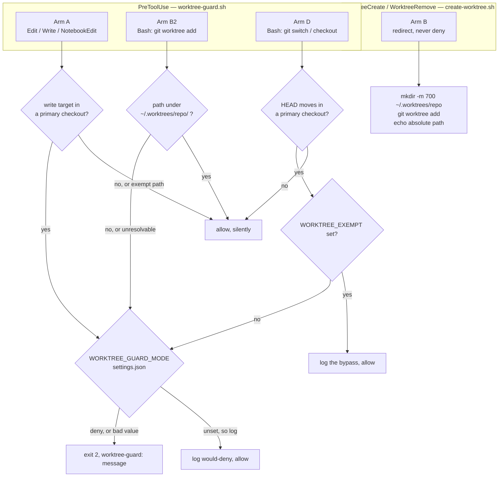
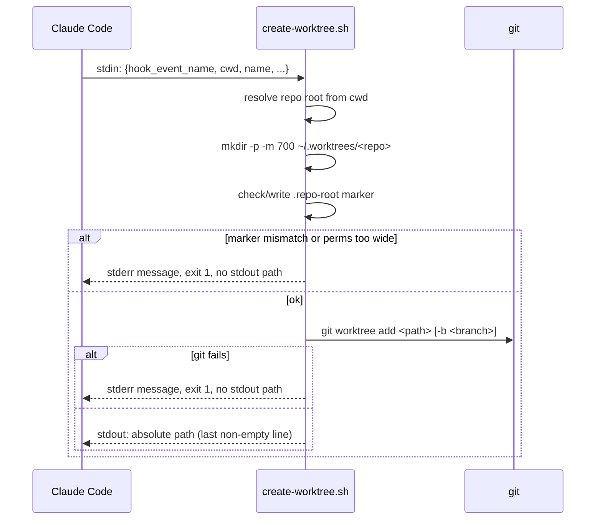

# worktree-guard.sh — worktrees are mandatory, and they live in one place

> Closes the TODO recorded at `session-state.md:79-82`: the standing worktree rule (memory
> `feedback_always_work_in_a_worktree`, 2026-08-23) has lived only in memory and prose. Memory is
> advisory and does not survive into every session's attention; this feature gives the rule a
> computational home.

## Problem

Two related rules currently hold only by convention, and both fail the same way — silently, in the
exact session that forgot them.

**Rule 1 — work happens in a worktree, never the primary checkout.** Several Claude sessions run
against one repo at once. The primary checkout has a single HEAD, so a session that parks it on a
new branch changes the branch out from under every other session sharing it. This has already
happened: one session moved `~/.claude` to a new branch while another had uncommitted `panes/*.sh`
edits in that same checkout, so that session's next commit would have landed on a branch it never
chose.

**Rule 2 — every worktree lives at `~/.worktrees/<repo-name>/<worktree-name>`.** Today they nest
*inside* the working tree at `.claude/worktrees/`, which puts checkouts inside the repo they are
checkouts of. Centralizing them gets worktrees out of the tree entirely and makes "what am I
working on, machine-wide" a single `ls`.

## Design at a glance



The diagram cannot show the two things most likely to bite: Arm A resolves the repo from the
**write target**, never the session cwd (`phase-guard.sh:191-197` records this as its one bug
class, found in round 6), and the primary-vs-linked test is a **fail-open** unless paths are
normalized first (see Detection).

## Decisions taken (user, 2026-08-24)

Settled explicitly via `AskUserQuestion`. Recorded here because several are deliberate acceptances
of a known cost, and a later reader will otherwise re-litigate them.

| Decision | Choice | Note |
|---|---|---|
| Enforcement | **Hard deny** (exit 2) | Arm D alone carries a bypass — see below |
| Trigger surface | `Edit`/`Write`/`NotebookEdit` + two **git-command** Bash arms | The heuristic Bash write arm was **dropped** — see Non-goals |
| Path exemptions | Explicit list, below — **not** "reuse phase-guard verbatim" | Round-1 compliance fix; the prose and the list disagreed |
| Repo opt-in | **None — every git repo on this machine** | Deliberate divergence from `phase-guard.sh:248`; blast radius accepted, see below |
| `<repo-name>` segment | **Directory basename**, collision-detected | A `.repo-root` marker makes a collision a deny, not a silent share |
| Existing 4 worktrees | **Not migrated** | Guard applies to new `git worktree add` only |
| Branch switching | **Arm D added** (2026-08-24, round-1 revision) | The original design never covered the incident in Problem |
| Arm D bypass | `WORKTREE_EXEMPT=<reason>`, logged | User: "I can bypass by manually switching the branch if I really need to" |
| Arming | **Log-only first, then flip to deny** | `settings.json` `env.WORKTREE_GUARD_MODE`; absent means `log` |
| Switch location | **`settings.json`, not `hooks/state/`** | Round-2 fix: `.gitignore:17` ignores `/hooks/state/`, so arming would have left no record in git |
| What the log records | **Refusals only** — never allows | Round-2 fix: one line per evaluation measured at 10–20 MB per three days |

### The exemption list, stated in full

`docs/*`, `.claude/*`, `settings.json`, `projects/*/memory/*`, `rules/*`, `skills/*`,
`CODING_MEMORY.md`, `coding-memory/*`.

The last two matter and were **missing** from the round-1 draft, which claimed to reuse
`phase-guard.sh:294-298` "verbatim" while printing a shorter list beside it. `coding-memory/` holds
`observability-judge/verdicts.jsonl` and `compliance-judge/verdicts.jsonl` — under the shorter
list, a judge running with its cwd in a primary checkout would be denied permission to write its
own verdict, and this feature's own gate would jam. The list is now written out rather than
incorporated by reference, so the two can no longer drift.

### The accepted blast radius

`phase-guard.sh:248` exits silently unless the repo has a `docs/features/` directory — an opt-in
signal, so a repo that never heard of the phase workflow is never blocked by it. **This hook has no
such signal, by explicit user decision.** The consequence was stated plainly before the choice and
is restated here so it is not discovered later as a bug:

> Every fresh `git clone` on this machine will deny guarded writes from its primary checkout until
> a worktree exists for it.

That is the intended behavior, not an oversight. Two things bound it: the guard ships in **log-only
mode**, so the first days produce evidence rather than friction; and `settings.json` is on the
exemption list, so the hook's own registration always remains editable — the same reasoning
`phase-guard.sh:280-283` gives for exempting it there ("a guard that can block edits to its own off
switch is a footgun").

## Detection — verified, not assumed

The primary-vs-linked test is `git rev-parse --git-dir` against `--git-common-dir`. Probed on
git 2.50.1 (Apple Git-155):

| Where | `--git-dir` | `--git-common-dir` |
|---|---|---|
| Primary checkout, at root | `.git` | `.git` |
| Primary checkout, **in a subdirectory** | `~/.claude/.git` | `../../.git` |
| Linked worktree | `<common>/worktrees/close-model-re` | `~/.claude/.git` |

**The naive string compare is a fail-open, and it is the first thing to get right.** From any
subdirectory of a primary checkout the two values differ *in form only* — absolute vs. relative —
so `[ "$d" != "$c" ]` reads "these differ" → "this is a linked worktree" → **allow**. The guard
would be silently off in every subdirectory of every primary checkout, which is most writes. This
is the same fail-open class that cost `phase-guard.sh` six judge rounds, arriving here on day one.

**Fix:** `git rev-parse --path-format=absolute --git-dir` and `--git-common-dir`, which normalize
both sides. Verified above — primary-in-subdirectory collapses to two identical absolute paths, and
the linked worktree still differs.

`--path-format` requires git ≥ 2.31. **Below that floor the guard denies, it does not allow**
(round-1 compliance fix; the draft said fail-open). A guard that switches itself off precisely when
it cannot verify its own precondition is indistinguishable from the feature being absent, and
`git-guard.sh` already fails closed on a checkout it cannot name (ADR 0026). The installed git is
2.50.1, so this path is unreachable here today and costs nothing.

### Repo shapes that are out of scope

- **Bare repository** (`git rev-parse --is-bare-repository` = `true`) → **allow**. No working tree
  exists to write into, so neither rule can be violated.
- **Submodule** (`git rev-parse --show-superproject-working-tree` non-empty) → **allow**. A
  submodule's `--git-common-dir` points into the superproject's `.git/modules/<name>` and equals
  its `--git-dir`, so it reads as "primary checkout" and would be denied wholesale. Excluding
  submodules is a deliberate under-block; the alternative is blocking all submodule work machine
  -wide for a collision risk that does not apply to them.

Both probes must run **before** the primary-vs-linked compare, and both are untested claims about
git behavior rather than measurements — task 2 tests them in a throwaway repo before the guard
depends on them.

## Scope of rule 2 — where worktrees may live

Target layout, nested in this order:

```
~/.worktrees/<repo-name>/<worktree-name>
```

`git worktree add` accepts an arbitrary `<path>` (verified: `git worktree add --help`), so git
itself imposes no obstacle. The obstacle is the harness.

### `~/.worktrees` is a new data store — created default-deny

It does not exist yet (verified). `create-worktree.sh` owns it:

- Creates `~/.worktrees` and `~/.worktrees/<repo-name>` with `mkdir -p -m 700`. It will hold
  working copies of every repo on this machine, including any secrets those trees carry, so it
  starts at owner-only rather than at the ambient umask.
- If either directory already exists with any group or other permission bit set, the hook
  **refuses** and names the fix (`chmod 700 <path>`). It does not silently re-`chmod` a directory
  the user may have widened deliberately.

### Basename collisions are detected, not tolerated

Two repos named `api` in different orgs would share `~/.worktrees/api/`, and two worktrees named
`main` under them would collide outright. On first use, `create-worktree.sh` writes
`~/.worktrees/<repo-name>/.repo-root` containing the absolute repo root. On every later use it
compares; a mismatch is a **refusal** naming both roots, not a silent share. Arm B2 performs the
same check before allowing a hand-rolled `git worktree add`.

### RESOLVED — `WorktreeCreate` is the mechanism; re-entry is one-shot

Probe complete (pane `general-purpose`, against installed Claude Code **2.1.241**). Two claims
independently re-verified here against the binary before being built on, per zero-trust: subagent
output is data.

**There is no setting that moves the CLI's worktree directory.** A `worktree.location` key exists
in the schema, and its own description rules itself out — re-verified verbatim by
`strings <binary> | grep "Directory under which"`:

> "Directory under which **Claude Code Desktop** creates the worktrees of **SSH sessions** … Read
> by the desktop app from the SSH host user settings … **The CLI (`--worktree`, `EnterWorktree`,
> agent isolation) does not read it yet.**"

Complete `worktree.*` key set (probe, from the settings zod schema): `symlinkDirectories`,
`sparsePaths`, `baseRef`, `bgIsolation`, `location`. Only `location` concerns paths, and the CLI
ignores it. The managed path is hardcoded as `join(repoRoot, ".claude", "worktrees")`, taking no
settings or env lookup. No `CLAUDE_CODE_WORKTREE_*` env var exists.

**`WorktreeCreate` / `WorktreeRemove` hooks DO work inside a git repo, and are the only supported
relocation mechanism.** Both re-verified as real event literals in the binary. The tool description
("outside a git repository") is misleading: the creator checks for the hook *before* it checks for
a git repo, so the hook branch wins everywhere. All three creation surfaces — `--worktree`,
`EnterWorktree name:`, and Agent/workflow `isolation: "worktree"` — route through it.

**This inverts the design.** A `WorktreeCreate` hook *redirects* rather than blocks, which is
strictly better than a `PreToolUse` deny: the session gets a worktree in the right place instead of
an error telling it to go make one.

#### The limitation to design around

`EnterWorktree path:` into a path outside the repo, by case:

| Case | Verdict | Detail |
|---|---|---|
| (a) First entry from launch directory | **works** | Only gate is `git worktree list` registration. But `checkPermissions` returns `ask` for any path outside `.claude/worktrees/`, and it is **not** auto-approvable — expect an interactive prompt |
| (b) Switching while already in a worktree | **blocked** | "Switching from this session is limited to worktrees managed by Claude Code" |
| (c) Pinned / `Agent(isolation:"worktree")` subagent | **blocked** | Same error |

Critically, the `requireManagedLocation` branch computes its allowed root as
`<repo>/.claude/worktrees` **with no `WorktreeCreate` hook consultation at all** — so even a
worktree our own hook legitimately created at `~/.worktrees/…` is unreachable in (b) and (c).

Two consequences:
- No mid-session switching between centralized worktrees. Route through a fresh session launched
  with `cwd` at the worktree instead.
- `Agent(isolation: "worktree")` cannot reach one. **Note this is not the same as pane dispatch** —
  `dispatch-pane-agent.sh` passes `--cwd`, launching a fresh session, which is unaffected. Worth
  confirming before relying on it (task 1a).

**The cost of taking the hook path:** our hook owns the entire lifecycle — creating the git
worktree, choosing the branch, and cleanup on `WorktreeRemove`. `worktree.baseRef` and
`worktree.sparsePaths` are **not applied** on the hook path; the hook branch returns before that
code runs. Today `baseRef` is unset (no `worktree` key in `settings.json`), so nothing is lost yet,
but re-implementing `fresh`-vs-`head` base selection is now our job.

## Design sketch

**Two files, not one.** `worktree-guard.sh` handles the three `PreToolUse` arms;
`create-worktree.sh` handles the `WorktreeCreate`/`WorktreeRemove` lifecycle. They share no logic
and fire on different events; a single `worktree-guard.sh` name for both would invite a reader to
expect coupling that does not exist. (Resolves round-1 open question #3.)

**Arm A — the worktree requirement** (`PreToolUse` on `Edit|Write|NotebookEdit`):

1. Read the payload's `file_path` / `notebook_path`; no path → allow, silently.
2. `git --version` — **git absent from `PATH`, or version < 2.31 → deny.** This runs *before* any
   `rev-parse`, because a missing or too-old git makes every later probe fail in a way that is
   indistinguishable from "not a git repository" (round-2 fix: the recipe and the scenarios
   disagreed on exactly this).
3. Resolve the owning repo **from the write target**, never from the session cwd.
4. Not in a git repo → allow, silently. This verdict is taken **only** from
   `git rev-parse --show-toplevel` exiting non-zero *with* the recognizable
   "not a git repository" diagnostic; any other non-zero exit is a validation failure and denies
   (see Failure boundaries).
5. Bare repo or submodule → allow, silently.
6. Path matches the exemption list → allow, silently.
7. `--path-format=absolute` compare: git-dir == common-dir → **deny** (subject to mode).

**Arm B — the location, by redirect** (`WorktreeCreate` hook — *not* a deny):



Registered with no `matcher`:

```json
"WorktreeCreate": [ { "hooks": [ { "type": "command", "command": "<abs path>/create-worktree.sh" } ] } ]
```

Contract (probe-reported; re-verify each before relying on it — task 1b):
- **Input** on stdin: base hook fields (`session_id`, `transcript_path`, `cwd`, `prompt_id?`,
  `permission_mode?`, `agent_id?`, `agent_type?`, `effort?`) plus
  `hook_event_name: "WorktreeCreate"` and `name: string`.
- **Output:** echo the absolute worktree path to stdout; the **last non-empty trimmed line** is
  taken. Must be normalized and absolute — no dot segments. A symlink-ancestry screen runs against
  the repo root, and its error text explicitly offers *"(or emit a path outside the repository)"*,
  so `~/.worktrees/…` is a first-class intended case.
- **The hook must create the worktree itself.** Claude does not. `hookBased: true` means no branch
  is created and none is reported — branch selection becomes ours.
- **`WorktreeRemove`** receives `worktree_path: string`; success is exit 0, no structured output.

**Branch and base selection — the contract, since it is now ours.** `hookBased: true` means Claude
creates no branch and reports none, so the hook must decide. Round 2 found this asserted twice and
defined nowhere.

| Question | Answer |
|---|---|
| Branch name | The payload's `name`, **verbatim** |
| Deliberately *not* applied | The managed path's rename to `worktree-<name>` with `/`→`+` (memory `reference_enterworktree_renames_the_branch_you_asked_for`). We own naming now; silently renaming the caller's branch is the surprise that memory exists to record |
| Base ref | `origin/HEAD`, resolved via `git symbolic-ref refs/remotes/origin/HEAD` |
| `origin/HEAD` unresolvable | **Fail** (boundary 23), naming the ref. Do not silently fall back to local `HEAD` — that is how a worktree gets based on whatever branch the primary checkout happened to be parked on, which is the class of bug this whole feature exists to stop |
| Branch already exists | Reuse it, never `-b` over it, never force (boundary 22) |
| Directory already exists | `git worktree add` fails on its own; boundary 21 reports it |

**Arm B2 — hand-rolled `git worktree add`** (`PreToolUse` on `Bash`), to stop the other route:

1. Lex into segments via `hooks/lib/shell_segments.py`, as `git-guard`/`merge-guard`/`doc-guard`
   already do, so `foo && git worktree add ...` is caught and a flag binds to its own segment.
2. Classify via an extended `hooks/lib/classify-git-command.py` rather than a fourth inline
   classifier (ADR 0029 moved `merge-guard` off exactly that pattern).
3. Require the resolved absolute path to be under `~/.worktrees/<repo-name>/`, with a matching
   `.repo-root` marker. Anything else → **deny**, naming the correct path in the message.

**Arm D — moving a primary checkout's HEAD** (`PreToolUse` on `Bash`) — added in the round-1
revision, widened in round 2. Arms A/B/B2 block *editing files* and *misplacing worktrees*, but the
incident in Problem is a session **moving the primary checkout's HEAD**, which none of them touch.

**The principle, which governs anything the list below misses:** deny a command that changes what
*other* sessions sharing this checkout would see — HEAD moving to a different branch or commit, or
the shared working tree being overwritten wholesale.

- **In scope** (denied when the effective repo is a primary checkout): `git switch` in every form
  (`<branch>`, `-c`/`-C`, `-`, `--detach`, `--orphan`); `git checkout` in its HEAD-moving forms
  (`<branch|sha>`, `-b`/`-B`, `-`, `--detach`, `--orphan`); `git merge`; `git pull`; `git rebase`;
  `git reset` in every form **except** one carrying a `--` pathspec; `git cherry-pick`;
  `git revert`; `git stash pop`/`apply`.
- **Out of scope** (allowed — these touch named paths, not HEAD): `git checkout -- <path>`,
  `git checkout <ref> -- <path>`, `git restore` in any form, `git reset -- <path>`, and every
  read-only git command.
- **The list is a known under-block, and that direction is deliberate.** An unrecognized `git`
  subcommand is **allowed**, because the alternative is denying every git command the classifier
  has not been taught. Recorded in Non-goals rather than left to be discovered.
- **`git merge` matters specifically:** the incident logged at `session-state.md:85` was a stray
  `git merge --ff-only`, which the round-1 design and the first version of this arm both missed.

**Which repository Arm D judges.** Unlike Arm A — which resolves from the *write target* — Arm D
has no target path, so it resolves the repo from the command's **effective** working directory:

1. Start from the session `cwd` on the hook payload.
2. Apply any `cd <path>` in an earlier segment of the same command line, using the same
   `shell_segments.py` lexing the other arms use. `cd ~/.claude && git switch main` therefore
   resolves to `~/.claude`, not to the worktree the session started in — a route round 2 found open.
3. Apply `-C <path>` from `GIT_DIR_OPT` if the git segment carries one; it wins over `cd`.
4. A `cd` whose operand is a variable, a subshell, or otherwise unresolvable → **deny**, naming the
   unresolvable operand. Fail closed: an unresolvable cwd means the guard cannot tell which repo it
   is protecting.

**Bypass:** `WORKTREE_EXEMPT=<reason> git switch main` allows the command and records the reason in
the log. Same shape as `MERGE_EXEMPT`/`TEST_EXEMPT`/`JUDGE_EXEMPT`.

**Stated limit:** this arm governs commands Claude runs through the `Bash` tool. A human typing in
their own terminal is never intercepted by any `PreToolUse` hook, so the user's escape hatch exists
whether or not `WORKTREE_EXEMPT` does. The deny message must not imply otherwise.

### Classifier contract — the new facts

`classify-git-command.py` reads a command line on stdin and writes sorted fact tokens to stdout,
always exiting 0. Verified baseline, probed 2026-08-24 on the current file:

| Input | Current output |
|---|---|
| `git worktree add ../x` | *(none)* |
| `git switch main` | *(none)* |
| `git checkout -b feat/x` | *(none)* |
| `git checkout -- docs/a.md` | *(none)* |
| `git -C /tmp/other worktree add /tmp/x` | `SCOPE_UNKNOWN\t-C` |

Four facts to add, following the file's documented token style:

- `WORKTREE_ADD` — some segment runs `git worktree add`. **Denying** fact.
- `WORKTREE_ADD_PATH<tab><path>` — the `<path>` operand, one per add, option values skipped
  (`-b <branch>` and `--reason <string>` both take values). **Granting** fact, so per the file's
  own rule at `classify-git-command.py:37-41` it is emitted only when **every** `git worktree add`
  on the line names a path this file can vouch for; otherwise `WORKTREE_ADD` stands alone and the
  guard denies for want of a vouched path. This mirrors `COMMIT_PATHSPEC` exactly.
- `BRANCH_MOVE` — some segment runs a git form that moves a checkout's HEAD or overwrites its
  working tree, per the in/out lists above. **Denying** fact.
- `GIT_DIR_OPT<tab><path>` — some segment carries `-C <path>`. **Informational**, emitted per
  segment; see below.

**`SCOPE_UNKNOWN` and `-C`.** For `COMMIT*`/`PUSH*`, `SCOPE_UNKNOWN` suppresses that segment's
facts, because a global option may redirect which repo is inspected — and `-C` is today one of the
options that triggers it (probed above). Two rules, stated separately because the round-2 read
found the first one silently incomplete:

1. **Both denying facts are emitted alongside `SCOPE_UNKNOWN`**, and the guard denies. Suppressing
   them would be a fail-open: `git -C <other> worktree add /wherever` would emit nothing and sail
   through.
2. **The granting `WORKTREE_ADD_PATH` is suppressed** for any segment carrying `SCOPE_UNKNOWN`.
   Without this, `git -C <other> worktree add ~/.worktrees/.claude/x` would emit a vouched path
   against the *wrong* repository and be allowed — the precise fail-open rule 1 exists to close.
   The distinction is not decorative: rule 1 alone leaves the hole, and only a scenario whose path
   *would otherwise pass* can tell the two readings apart (see the Arm B2 scenarios).

This is a decision about which tokens the classifier emits, not a reinterpretation of them by the
guard. It does not breach the granting/denying invariant at `classify-git-command.py:37-41`: that
invariant requires a granting fact to be true of the whole line, and suppression under
`SCOPE_UNKNOWN` makes `WORKTREE_ADD_PATH` strictly more conservative, never less.

**`-C` must not become a blanket refusal.** `git -C <other-repo> …` appears **215 times** in this
repo's own scripts (measured, round 2), so denying every one of them would be unusable. The guard
therefore resolves `GIT_DIR_OPT`'s `<path>` and evaluates the *named* repository, denying only when
that path cannot be resolved. `GIT_DIR_OPT` is emitted **in addition to** the existing
`SCOPE_UNKNOWN\t-C`, never in place of it, so `git-guard` and `doc-guard` see a byte-identical fact
set and their behavior is unchanged; both already ignore tokens they do not recognize.

### Failure boundaries — every external call, enumerated

Rounds 1 and 2 both cited `core-conduct/explicit-error-handling`, each time naming boundaries the
previous revision had not listed. Patching the named instances kept producing the next batch, so
this table is built the other way round: **every place either script calls out to something that
can fail**, enumerated from the design rather than from a review finding. If a boundary is not in
this table, it is not in the design.

**The governing policy, so a new boundary has a default:** once the guard has established that a
git repository is involved, any failure it cannot interpret **denies**. "Allow silently" is
reserved for the four cases that are genuinely none of the guard's business (no path in the
payload, not a git repo, bare repo, submodule). Observability failures are the one deliberate
exception — see boundary 9.

**`worktree-guard.sh` (`PreToolUse`):**

| # | Boundary | Behavior |
|---|---|---|
| 1 | stdin payload is absent, empty, or not valid JSON | **Deny.** The guard cannot identify what it is being asked to permit. |
| 2 | Payload parses but carries no `file_path`/`notebook_path` (Arm A) | **Allow, silently.** Not a write to a path — nothing to judge. |
| 3 | `git` absent from `PATH` | **Deny**, message says the guard could not verify the checkout. Precedent: `test-marker-guard`'s `MSG_NO_PYTHON` blocks everywhere. |
| 4 | `git --version` < 2.31, or unparseable | **Deny**, message names the 2.31 floor. |
| 5 | `git rev-parse --show-toplevel` exits non-zero with the "not a git repository" diagnostic | **Allow, silently.** |
| 6 | Any *other* non-zero exit or empty output from any `rev-parse` probe (`--is-bare-repository`, `--show-superproject-working-tree`, `--path-format=absolute --git-dir`, `--git-common-dir`) | **Deny.** Boundary 5 has already ruled out "not a repo", so this is a validation failure. |
| 7 | `python3` absent, or `shell_segments.py` / `classify-git-command.py` exits non-zero (Arms B2, D) | **Deny.** The command could not be lexed, so its contents are unknown. |
| 8 | `WORKTREE_GUARD_MODE` is unset | **`log`.** This is the documented ship state — the guard arrives unarmed on purpose. |
| 9 | `WORKTREE_GUARD_MODE` is set to anything other than `log` or `deny` | **`deny`**, and the message names the bad value. A *present but wrong* value means someone tried to arm the guard and mistyped; reading a failed configuration attempt as "off" is the silent disarm the git-floor section argues against. Absence and a typo are deliberately not the same case. |
| 10 | Appending to the log fails (disk full, permissions, path missing) | **The decision stands unchanged**, and the failure goes to stderr. This is the one accepted fail-open, and it is on *observability*, not on enforcement: a guard that blocks work because a disk is full is worse than a lost log line. It is not silent — see task 10, whose flip criterion requires the log to be trustworthy. |
| 11 | Arm B2 / Arm D operand is relative, unresolvable, or symlinked | Resolve to an absolute real path first. Cannot resolve → **deny**, naming the operand. |
| 12 | `GIT_DIR_OPT` / `cd` operand cannot be resolved to a directory | **Deny**, naming the operand. The guard cannot tell which repository it is protecting. |
| 13 | `$HOME` is unset or empty | **Deny.** `~/.worktrees` is undefined, so no path test can be performed. |
| 14 | Reading `~/.worktrees/<repo-name>/.repo-root` fails, or it disagrees with the current repo root | **Deny**, naming both roots (collision detection). |

**`create-worktree.sh` (`WorktreeCreate` / `WorktreeRemove`):**

A lifecycle hook has no "deny" — its failure mode is to print no path and exit non-zero. **In every
failing case below it writes the reason to stderr, exits 1, and prints nothing to stdout**, because
emitting a path for a worktree that does not exist would send the session into a nonexistent
directory.

| # | Boundary | Behavior |
|---|---|---|
| 15 | `$HOME` unset or empty | Fail as above. |
| 16 | Repo root cannot be resolved from the payload's `cwd` | Fail as above. |
| 17 | `mkdir -p -m 700 ~/.worktrees/<repo-name>` fails | Fail as above, quoting the OS error. |
| 18 | `~/.worktrees` or `~/.worktrees/<repo-name>` already exists with any group or other permission bit | Fail as above, naming `chmod 700 <path>`. Never silently re-`chmod` a directory the user may have widened deliberately. |
| 19 | `.repo-root` cannot be read or written | Fail as above. |
| 20 | `.repo-root` names a different repo root (basename collision) | Fail as above, naming both roots. |
| 21 | `git worktree add` exits non-zero | Fail as above, quoting the git error. |
| 22 | The requested branch already exists | **Not a failure** — reuse it (`git worktree add <path> <branch>`), never `-b` over it, never force. |
| 23 | The base ref cannot be resolved (see the branch contract below) | Fail as above, naming the ref it tried. |
| 24 | `git worktree remove` exits non-zero (`WorktreeRemove`) | stderr, exit 1, and **leave the directory in place**. Never `rm -rf` a path git declined to remove. |
| 25 | The harness's response to a non-zero exit with empty stdout | **Unverified.** Task 1b measures it before any of rows 15–24 are relied upon. Stated as unknown rather than assumed. |

### Deny message contract

`phase-guard.sh:537-561` sets the house shape and it should be followed: what was blocked, why, the
current state that caused it, the legitimate fixes, and a *narrow* closing claim.

Two elements differ here:

- **Every message is prefixed `worktree-guard:`.** `phase-guard.sh` already prefixes its own, and
  both hooks are `PreToolUse` on the same matchers, so a session must be able to tell which one
  fired. (Resolves round-1 open question #6's naming half.)
- **Element 5 must name the real escape hatch.** `phase-guard` says "no bypass environment
  variable" and can, because its escape hatch is editing a `docs/` file. Here the hatch is
  `settings.json` (exempt, so registration stays editable), plus `WORKTREE_EXEMPT` on Arm D. The
  message must name those and must **not** claim the Bash write surface is covered — it is not
  (see Non-goals). `phase-guard.sh:544-545` declines to overclaim for the same reason: "a safety
  message that overclaims teaches sessions to distrust its true parts too."

**Unverified and deliberately not asserted:** whether two `PreToolUse` denies on one tool call both
reach the session, or only the first survives. A probe of CLI 2.1.241 found the deny path uses a
single `blockingError` slot, which *hints* only one reason survives, but that was not established
for the exit-2 path these hooks use. Task 6 measures it; until then the spec claims nothing about
double-deny behavior.

### Arming — log-only, then deny

**The switch lives in `settings.json`**, as `env.WORKTREE_GUARD_MODE`, holding `log` or `deny`:

```json
"env": { "WORKTREE_GUARD_MODE": "log" }
```

The round-1 draft put it at `hooks/state/worktree-guard.mode`, which cannot work: **`.gitignore:17`
ignores `/hooks/state/`** ("machine-local, never committed"), so arming a hard deny across every
repo on this machine would have left no record in git at all, and task 10's "flip it in a separate
commit" could not have existed. `settings.json` is already tracked, is already on the exemption
list, and is the same file that registers the hook — so arming becomes a one-line reviewable diff
next to the registration it arms. There is no `env` block in `settings.json` today; task 8 adds one.

**Unverified:** that Claude Code exports `settings.json` `env` entries into hook subprocesses. It is
the documented purpose of the key, but this design does not assume it — task 8 measures it first,
and falls back to a tracked file beside the hook if the export does not happen.

Absent → `log`. Any other value → `deny` (boundary 9).

### The log records refusals, never allows

One tab-separated line per **refusal or bypass** — never per evaluation:

```
<iso8601>  <session_id>  <arm>  <mode>  <decision>  <repo-root>  <path-or-command>  [<exempt-reason>]
```

`decision` is one of `deny`, `would-deny` (the same event in `log` mode), or `bypass`.

Three round-2 measurements shaped this:

- **Volume.** One line per *evaluation* was measured against real transcripts at ~14,000 `Bash` and
  ~1,500 `Edit`-family calls, commands averaging 625 characters — roughly **10–20 MB per three
  days**, uncapped. "Review the log before flipping" is not a real instruction at that size. The
  sibling this design cites as precedent, `hooks/state/test-marker.log`, holds **16 lines**,
  precisely because it records refusals only. Same location, and now the same policy.
- **`session_id`.** On the hook payload and already read by two hooks here. The harm this feature
  exists to prevent is *two sessions in one checkout*, which is unreadable from a log that does not
  say which session acted.
- **Newlines.** 21.4% of real commands (1,601 of 7,474) contain a newline; tabs appear in 0.0%. So
  tab separation is safe as chosen, and the `path-or-command` field escapes `\n` as `\\n` — a
  line-oriented log whose fields can contain raw newlines is not parseable.

The log stays at `hooks/state/worktree-guard.log` — untracked and machine-local is correct for
evidence; only the *switch* needed to be in git.

## Acceptance scenarios

Written against Arm A unless stated. `deny` means exit 2 with a `worktree-guard:` message; in
`log` mode every `deny` below becomes "allow, and append a `would-deny` line".

```gherkin
Feature: Arm A — writes are refused from a primary checkout

  Background:
    Given settings.json sets env.WORKTREE_GUARD_MODE to "deny"
    And git version 2.50.1 is installed

  Scenario: Write at the root of a primary checkout
    Given the repo ~/.claude has a primary checkout at ~/.claude
    When Write targets ~/.claude/panes/run-pane-agent.sh
    Then the hook denies
    And the message names ~/.worktrees/.claude/ as the place to work instead

  Scenario: Write from a subdirectory of a primary checkout
    Given the session cwd is ~/.claude/hooks
    When Write targets ~/.claude/hooks/git-guard.sh
    Then the hook denies
    # This is the fail-open the naive --git-dir/--git-common-dir compare produces.

  Scenario: Write inside a linked worktree
    Given a linked worktree at ~/.worktrees/.claude/feat-x
    When Write targets ~/.worktrees/.claude/feat-x/hooks/git-guard.sh
    Then the hook allows silently

  Scenario Outline: Exempt paths are always allowed from a primary checkout
    When Write targets ~/.claude/<path>
    Then the hook allows silently
    Examples:
      | path                                   |
      | docs/features/anything.md              |
      | .claude/settings.local.json            |
      | settings.json                          |
      | projects/-Users-x--claude/memory/a.md  |
      | rules/gates.md                         |
      | skills/treko/SKILL.md                  |
      | CODING_MEMORY.md                       |
      | coding-memory/compliance-judge/verdicts.jsonl |

  Scenario: A path outside any git repository
    When Write targets /private/tmp/scratch/notes.md
    Then the hook allows silently

  Scenario: Detached HEAD in a primary checkout
    Given ~/.claude is at a detached HEAD
    When Write targets ~/.claude/panes/run-pane-agent.sh
    Then the hook denies
    # Detachment does not make a primary checkout safe to share.

  Scenario: Bare repository
    Given the target resolves into a bare repository
    Then the hook allows silently

  Scenario: Submodule
    Given git rev-parse --show-superproject-working-tree is non-empty for the target
    Then the hook allows silently

  Scenario: git is not installed
    Given git is absent from PATH
    When Write targets any path
    Then the hook denies
    And the message says the guard could not verify the checkout

  Scenario: git predates --path-format
    Given git version 2.30.0 is installed
    When Write targets ~/.claude/panes/run-pane-agent.sh
    Then the hook denies
    And the message names the 2.31 floor

  Scenario: git rev-parse errors after the repo is established
    Given step 3 has confirmed a non-bare, non-submodule git repo
    And git rev-parse --git-dir then exits non-zero
    Then the hook denies

Feature: Arm B2 — hand-rolled git worktree add

  Scenario: Add to the centralized root
    When Bash runs "git worktree add ~/.worktrees/.claude/feat-y -b feat/y"
    Then the hook allows

  Scenario: Add anywhere else
    When Bash runs "git worktree add ../scratch-tree"
    Then the hook denies
    And the message names ~/.worktrees/.claude/ as the correct parent

  Scenario: Add chained behind another command
    When Bash runs "cd /tmp && git worktree add ../scratch-tree"
    Then the hook denies
    # shell_segments.py binds the operand to its own segment.

  Scenario: -C names a resolvable repository, and the path is correct for it
    Given /repos/other is a git repository
    When Bash runs "git -C /repos/other worktree add ~/.worktrees/other/feat-a"
    Then the classifier emits WORKTREE_ADD, SCOPE_UNKNOWN and GIT_DIR_OPT
    And the hook evaluates /repos/other, not the session's repo
    And the hook allows
    # 215 uses of git -C exist in this repo's scripts; a blanket deny is unusable.

  Scenario: -C names an unresolvable directory
    When Bash runs "git -C /no/such/dir worktree add ~/.worktrees/.claude/feat-a"
    Then the hook denies
    And the message names /no/such/dir

  Scenario: -C redirects to another repo but the path looks right for this one
    Given the session's repo is ~/.claude
    When Bash runs "git -C /repos/other worktree add ~/.worktrees/.claude/feat-a"
    Then WORKTREE_ADD_PATH is suppressed for that segment
    And the hook denies
    # This is the discriminating case. The path would PASS the ~/.worktrees/.claude/ test,
    # so only suppression of the granting fact distinguishes a correct implementation from
    # one that emits the denying facts and stops there.

  Scenario: The path operand follows an option value
    When Bash runs "git worktree add -b feat/z ~/.worktrees/.claude/feat-z"
    Then the operand is read as ~/.worktrees/.claude/feat-z, not feat/z
    And the hook allows

  Scenario: Basename collision
    Given ~/.worktrees/api/.repo-root contains ~/repos/org-a/api
    And the current repo root is ~/repos/org-b/api
    When Bash runs "git worktree add ~/.worktrees/api/feat-q"
    Then the hook denies
    And the message names both repo roots

Feature: Arm D — moving a primary checkout's HEAD

  Scenario Outline: HEAD-moving commands are denied
    Given the session cwd is a primary checkout
    When Bash runs "<command>"
    Then the hook denies
    Examples:
      | command                    |
      | git switch main            |
      | git switch -c feat/x       |
      | git switch -               |
      | git switch --detach HEAD   |
      | git switch --orphan feat/x |
      | git checkout main          |
      | git checkout -b feat/x     |
      | git checkout -             |
      | git checkout --detach      |
      | git merge --ff-only main   |
      | git pull                   |
      | git rebase main            |
      | git reset --hard HEAD~1    |
      | git reset --soft HEAD~1    |
      | git cherry-pick abc1234    |
      | git revert abc1234         |
      | git stash pop              |
      | git stash apply            |
    # git merge --ff-only is the command in this repo's own logged incident
    # (session-state.md:85); the first version of this arm did not cover it.

  Scenario Outline: Commands that touch named paths, not HEAD, are allowed
    When Bash runs "<command>"
    Then the hook allows
    Examples:
      | command                        |
      | git checkout -- docs/a.md      |
      | git checkout main -- docs/a.md |
      | git restore docs/a.md          |
      | git restore --staged docs/a.md |
      | git reset -- docs/a.md         |
      | git status                     |
      | git log --oneline              |

  Scenario: An unrecognized git subcommand is allowed
    Given the session cwd is a primary checkout
    When Bash runs "git bisect start"
    Then the hook allows
    # Deliberate under-block, recorded in Non-goals. Denying every subcommand the
    # classifier has not been taught would make the guard unusable.

  Scenario: Switching inside a linked worktree
    Given the session cwd is ~/.worktrees/.claude/feat-x
    When Bash runs "git switch main"
    Then the hook allows
    # A linked worktree's HEAD is its own; nobody else shares it.

  Scenario: cd into the primary checkout first
    Given the session cwd is ~/.worktrees/.claude/feat-x
    When Bash runs "cd ~/.claude && git switch main"
    Then the hook denies
    # Arm D resolves the EFFECTIVE cwd. Reading only the payload's cwd leaves this
    # route open, which is the same incident by a narrower path.

  Scenario: cd to an operand that cannot be resolved
    When Bash runs "cd $SOME_VAR && git switch main"
    Then the hook denies
    And the message names the unresolvable operand

  Scenario: The documented bypass
    Given the session cwd is a primary checkout
    When Bash runs "WORKTREE_EXEMPT=hotfix git switch main"
    Then the hook allows
    And worktree-guard.log records arm=D decision=bypass exempt-reason=hotfix

Feature: Arming and the log

  Scenario: WORKTREE_GUARD_MODE is unset
    Given settings.json has no env.WORKTREE_GUARD_MODE
    When any arm would deny
    Then the hook allows
    And worktree-guard.log records decision=would-deny

  Scenario: WORKTREE_GUARD_MODE holds an unrecognized value
    Given env.WORKTREE_GUARD_MODE is "denyy"
    When any arm would deny
    Then the hook denies
    And the message names the value "denyy"
    # Absence and a typo are different cases. Reading a failed attempt to arm the
    # guard as "off" is the silent disarm the git-floor section argues against.

  Scenario: Allows are never logged
    Given env.WORKTREE_GUARD_MODE is "deny"
    When Write targets an exempt path
    Then the hook allows
    And nothing is appended to worktree-guard.log

  Scenario: A refusal is logged once, with the session id
    Given env.WORKTREE_GUARD_MODE is "deny"
    When Arm A denies a write
    Then exactly one tab-separated line is appended to worktree-guard.log
    And that line carries the payload's session_id

  Scenario: A command containing a newline stays on one line
    When Arm D denies a command containing a newline
    Then the logged path-or-command field escapes it as \n
    # 21.4% of real commands contain a newline; tabs appear in 0.0%.

  Scenario: The log cannot be written
    Given hooks/state/worktree-guard.log cannot be appended to
    When any arm reaches a decision
    Then that decision is unchanged
    And the failure is written to stderr
    # The one accepted fail-open, and it is on observability, not enforcement.

Feature: create-worktree.sh

  Scenario: First worktree for a repo
    Given ~/.worktrees does not exist
    When Claude Code fires WorktreeCreate with name "feat-x"
    Then ~/.worktrees and ~/.worktrees/.claude are created with mode 700
    And ~/.worktrees/.claude/.repo-root contains the absolute repo root
    And stdout's last non-empty line is ~/.worktrees/.claude/feat-x

  Scenario: The store has been widened
    Given ~/.worktrees exists with mode 755
    When Claude Code fires WorktreeCreate
    Then the hook writes an error to stderr naming "chmod 700"
    And exits 1
    And prints nothing to stdout

  Scenario: git worktree add fails
    Given git worktree add exits non-zero
    Then the hook writes the git error to stderr
    And exits 1
    And prints nothing to stdout

  Scenario: WorktreeRemove fails
    Given git worktree remove exits non-zero
    Then the hook writes the error to stderr and exits 1
    And the worktree directory is left in place
```

## Non-goals

- **The Bash write surface is not covered.** A `PreToolUse` hook on `Bash` receives the command
  *text*, never its effects; whether `npm install`, `make`, `./gen.sh`, or a heredoc dirties the
  tree is not decidable from a string. A heuristic arm matching `mv`/`cp`/`rm`/`touch`/`mkdir`/
  `tee`/redirection was designed and then **dropped** (user, 2026-08-24), because its exemptions
  are *paths* while its input is *command text*: `echo x > docs/foo.md` would be denied while
  `Write(docs/foo.md)` — the same edit to the same exempt file — is allowed. Same edit, two
  answers, and no amount of specification fixes that without modelling every command's write
  targets. Arms B2 and D cover the two git commands whose effects *are* decidable from the string.
  **The deny message must not claim the Bash surface is covered.**
- **Arm D's command list is deliberately incomplete.** An unrecognized `git` subcommand is allowed,
  because denying every subcommand the classifier has not been taught would make the guard
  unusable. The list covers the commands that move HEAD or overwrite the shared working tree in
  normal use; something exotic will get through, and that is the chosen direction.
- **The log is allowed to fail.** A failed append never changes a decision (failure boundary 10).
  Enforcement is not conditional on observability working; the reverse would let a full disk block
  every write on the machine.
- Not a security boundary. A momentum guardrail, like every Tier 1 guard here.
- Does not migrate the 4 existing worktrees. Two conventions therefore live at once until they are
  retired by hand.
- Does not police worktree *removal* or `git worktree move`.
- Does not make centralized worktrees reachable by mid-session `EnterWorktree` or
  `Agent(isolation: "worktree")` — the harness blocks cases (b) and (c) above, and no hook changes
  that.

## Resolved questions

All six round-1 open questions are closed. Kept as a record so they are not reopened.

1. **Is the harness worktree location overridable?** → A `WorktreeCreate` hook, and only that;
   `worktree.location` is Desktop-SSH-only.
2. **`<repo-name>` collisions?** → Detect and refuse, via a `.repo-root` marker.
3. **One hook or two?** → Two files: `worktree-guard.sh` (PreToolUse) and `create-worktree.sh`
   (lifecycle).
4. **Bare repos and submodules?** → Both allowed (out of scope), with the reasoning above; task 2
   tests the two `rev-parse` probes before the guard relies on them.
5. **Does `~/.worktrees` need creating, and by whom?** → `create-worktree.sh`, `mkdir -p -m 700`,
   refusing a pre-existing directory with wider permissions.
6. **Interaction with `phase-guard`?** → Messages are prefixed `worktree-guard:`. Whether both
   denies reach the session is unverified and asserted nowhere; task 6 measures it.

## Tasks

- [x] 1. Read the probe result; settle open question 1. **DONE** — `WorktreeCreate` hook is the
      mechanism; `worktree.location` is Desktop-SSH-only. Two claims re-verified against the binary.
- [ ] 1a. Confirm `dispatch-pane-agent.sh --cwd` is unaffected by the (b)/(c) re-entry block — it
      launches a fresh session rather than calling `EnterWorktree`, so it should be, but the whole
      pane workflow depends on it.
- [ ] 1b. Re-verify the `WorktreeCreate` payload and stdout contract first-hand in a throwaway repo
      before writing the hook against it, **including what the harness does when the hook exits 1
      with no stdout** — the failure path in the table above depends on it. The probe's claims are
      detailed and internally consistent, but they are subagent output, and the contract is
      load-bearing.
- [ ] 2. Test the bare-repo and submodule `rev-parse` probes, and the git ≥ 2.31 floor check, in a
      throwaway repo. All three are currently reasoned, not measured.
- [ ] 3. Write the failing test suite first — `hooks/worktree-guard.test.sh`, house style per
      `hooks/lib/guard_test_helpers.sh`, one case per scenario in Acceptance scenarios.
- [ ] 4. Implement Arm A.
- [ ] 5. Extend `classify-git-command.py` with `WORKTREE_ADD`, `WORKTREE_ADD_PATH`, `BRANCH_MOVE`,
      `GIT_DIR_OPT` + its own tests. Must include the discriminating `SCOPE_UNKNOWN` case (a `-C`
      redirect whose path *would* otherwise pass) and a regression test proving `git-guard` and
      `doc-guard` see an unchanged fact set.
- [ ] 6. Implement Arms B2 and D against the extended classifier, including effective-cwd
      resolution through `cd` segments. Measure whether two `PreToolUse` denies both reach the
      session, and record the answer here.
- [ ] 7. Implement `create-worktree.sh` (Arm B) including the 0700 store, the `.repo-root` marker,
      the branch/base contract, and failure boundaries 15–24.
- [ ] 8. **First verify that `settings.json` `env` entries reach hook subprocesses** — measure it,
      do not assume. If they do, add the `env` block with `WORKTREE_GUARD_MODE: "log"`. If they do
      not, fall back to a tracked file beside the hook and record the change here. Then implement
      the mode read and the refusals-only log.
- [ ] 9. Register in `settings.json`. **Do this last** — an armed guard blocks edits to its own
      source from the primary checkout, since `hooks/*` is not on the exemption list.
- [ ] 10. Run in `log` mode, then flip to `deny` in a separate, deliberate commit. **Flip criteria,
      all three required** — without them "review the log" is not a decision procedure:
      1. At least 7 days of ordinary use have elapsed.
      2. **Every arm has recorded at least one `would-deny`.** An arm that never fired is an arm
         never shown capable of firing, and arming it is arming something unproven.
      3. Zero recorded `would-deny` entries that you judge to be wrong refusals.
      Record the counts and the date here when flipping.
- [ ] 11. ADR under `docs/decisions/` — this changes a machine-wide invariant and pivots the
      standing worktree rule from advisory to enforced. Verify the next free number against the
      deciding ref, not stale local `main`.
- [ ] 12. Update `rules/gates.md` with a stub carrying the Non-goals wording, and `CLAUDE.md` if a
      skill is warranted.
- [ ] 13. Observability judge, then PR.

## Notes

- Live demonstration of the blast radius, this session: writing to root-level `session-state.md`
  was denied by `phase-guard` because three *unrelated* parked cards
  (`falsify-harness-signatures`, `treko-branch-graph-traversal`, `treko-degraded-no-cmux`) sit at
  `phase: planning`. Repo-global, no path scoping — unrelated work blocks unrelated work. The hook
  designed here is broader still, which is why it ships in `log` mode.
- `claude-code-guide` **cannot be pane-dispatched** — the headless pane session does not register
  it. Available there: `claude, code-simplifier, compliance-judge, Explore, general-purpose,
  observability-judge, pane-echo, Plan, standards-extractor, statusline-setup`. Use
  `general-purpose` for harness-documentation probes.
- Session pane policy recorded this session: `panes max=3`.
- `cmux-layout` warns that cmux 0.64.22 is not the verified 0.64.20; pane placement rides an
  unverified heuristic. Not blocking, but `panes/cmux-layout-probe.sh` is stale.
