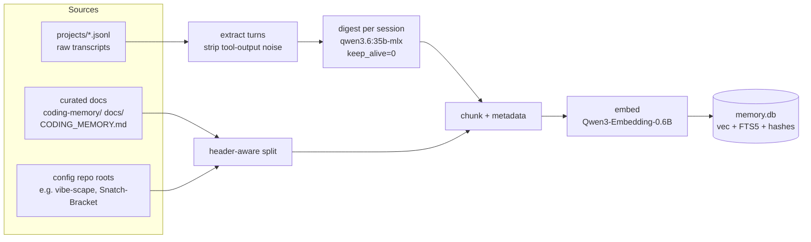

# Memory RAG Index (`memsearch`) — Design

- **Date:** 2026-07-17
- **Status:** Approved (brainstorm) — pending implementation plan
- **Repo:** `suyatdev/.claude` (global Claude Code config)
- **Author:** Mark Suyat + Claude (brainstorming session)

## Problem

Historical context — decisions, past bugs and their fixes, conventions, implementation
details — is spread across curated memory files (`CODING_MEMORY.md`, `coding-memory/`,
`docs/`) and ~597 raw session transcripts (`projects/*/*.jsonl`, ~251 MB). Recalling a past
decision today means either the agent already holding it in context, or loading whole
transcripts/files into a new session — expensive in tokens and unreliable.

We want a **local, regenerable retrieval index** so the agent can pull the few relevant
chunks of history on demand (a few hundred tokens) instead of whole files (thousands),
and so recall works **across repositories**, not just the one currently open.

### Recall use cases (all in scope)

1. **Decision recall** — "why did we choose X in repo Y?" (rationale + trade-offs).
2. **Episodic recall** — "have we hit this bug / built this pattern before, and what did we do?"
3. **Session-start context** — surface relevant past context into a new session, augmenting
   (never replacing) the `CODING_MEMORY.md` restore.
4. **Cross-repo lookup** — conventions/implementations from one repo available while working
   in another.

## Non-Goals

- Not a production runtime RAG service. Single-user, local, on-demand.
- Not a replacement for `CODING_MEMORY.md` — the curated files stay authoritative; this is a cache.
- No always-on daemon, no network service, no new local port.
- No auto-refresh cron on day one (deliberate later opt-in — YAGNI until manual flow proves value).

## Environment

- Mac Studio M4 Max, 64 GB RAM. Headroom at rest is a hard requirement.
- Ollama already installed. Relevant local models present: `nomic-embed-text`,
  `qwen3.6:35b-mlx` (~21 GB), plus others. A cloud-backed model (`deepseek-v4-pro:cloud`)
  exists and **must be excluded** from this system.

## Corpus Sizing (measured)

- `projects/*/*.jsonl`: 251 MB across 597 sessions (raw transcripts, tool output included).
- `coding-memory/` + `docs/`: ~376 KB across ~24 curated markdown files.
- After mechanical extraction (drop tool-output payloads) transcripts reduce to ~20 MB of
  meaningful turns; estimated **~30–50k chunks total**, ~200 MB of 1024-dim vectors.

## Architecture

```
SOURCES                      PIPELINE                       STORE                CONSUMERS
projects/*/*.jsonl ──► extract (mechanical) ─┐
                       digest  (qwen3.6 MLX) ─┼─► chunk ─► embed ─► memory.db ◄─ CLI (agent via Bash)
curated docs ────────────────────────────────┘           (Ollama)   ▲            SessionStart hook (nudge)
config-listed repo roots ─────────────────────────────────────────┐ │
                                                       sqlite-vec + FTS5
```



### Placement & packaging

- Lives at `~/.claude/memsearch/`, versioned in the `.claude` repo alongside `hooks/`,
  `agents/` — global infrastructure available to every session.
- uv-managed Python project. **Only third-party dependency: `sqlite-vec`.** Ollama is called
  over localhost HTTP with the standard library; FTS5 ships inside SQLite. No LangChain, no
  vector-DB service, no orchestration framework. All versions pinned.

### Storage

- One SQLite file: `~/.claude/memory-index/memory.db`, **gitignored and regenerable** (a
  cache, never a source of truth).
- Tables:
  - `chunks` — id, content, and metadata: `repo_id`, `repo_name`, `source_type`
    (`transcript_digest` | `curated_doc` | `repo_doc`), `recall_type`
    (`decision` | `episodic` | `doc`), `session_date`, `file_path`, `line_start`, `line_end`,
    `session_id`, `weight`, `content_hash`.
  - vector table (sqlite-vec) — 1024-dim embeddings keyed to `chunks`.
  - FTS5 table — full-text (BM25) mirror of `chunks.content` for hybrid search.
  - `sources` — per-file/session `content_hash` + `indexed_at` for incremental updates.
- Estimated ~300–500 MB on disk. **Zero idle RAM** — nothing runs between queries.

### Models (local only, pinned in config)

- **Embeddings:** Qwen3-Embedding-0.6B via Ollama (~1 GB, 1024-dim; exact Ollama tag verified
  at implementation). `nomic-embed-text` (already installed, 768-dim) is the configured
  fallback. **Note:** the two models have different vector dimensions, so the vector table's
  dimension is fixed to whichever model config selects; switching the embedding model is a
  full rebuild (`index --full`), not a hot-swap. The active model + its dim are recorded in
  the DB so `status` can detect a config/DB mismatch.
- **Digests:** existing `qwen3.6:35b-mlx`, invoked with `keep_alive=0` so its ~21 GB is
  released the moment a digest run ends. RAM is spent only while indexing, never at rest.
- **Config hard rule:** local models only. Cloud-backed Ollama models (e.g.
  `deepseek-v4-pro:cloud`) are refused — this corpus is the entire private conversation history.

## Indexing Pipeline

Three source types, processed differently, then a common `chunk → embed → store` tail.

### 1. Transcripts (`projects/*.jsonl`) — mechanical extract, then LLM digest

- **Extract (deterministic):** parse JSONL, keep user/assistant text, drop tool-result
  payloads (`<system-reminder>` blocks, file dumps — noise for recall). Retain tool *names*
  as light signal ("ran Bash", "edited X"). This is where 251 MB → ~20 MB.
- **Digest (LLM):** per session, `qwen3.6:35b-mlx` writes a structured summary — what was
  worked on, decisions made + why, bugs hit + fixes, files touched, outcome. Digests are the
  substrate for episodic recall. This is the slow one-time backfill (~597 sessions, batched,
  several hours), run once; afterward only new/changed sessions are digested.

### 2. Curated docs — header-aware split, no LLM

- `CODING_MEMORY.md`, `coding-memory/`, `docs/` chunked by markdown header (never mid-decision),
  embedded verbatim. **Highest retrieval weight** — a hand-written ADR outranks an auto-digest.

### 3. Config-listed repo roots — header-aware split

- An explicit, user-approved config list of repo roots (e.g. vibe-scape, Snatch-Bracket) so
  cross-repo lookup works. **No auto-scan of the whole disk** — only listed roots are indexed.

### Common tail — chunk, embed, store

- Every chunk carries the metadata above. Embedded in batches via Ollama.
- **SHA-256 content hash** per source → re-running only processes changed files/sessions.
  Idempotent: safe to run daily, weekly, or on demand.
- **Backfill order: newest session first**, so the system is useful within minutes while older
  sessions fill in behind it. `--full` backfill is resumable if interrupted.

### Provenance (mandatory, zero-trust guard)

- Every chunk stores its source path (+ session id / line range). Retrieval always cites where
  a fact came from, so a digest's claim is auditable back to the real transcript.
- Digests are **data, presented with their source — never obeyed as instruction.** A
  hallucinated digest cannot silently become "memory": its source is always shown for audit.

## Retrieval

- **Hybrid search:** semantic (vector cosine) fused with keyword (FTS5/BM25), then re-ranked.
  Exact strings (error codes, function names, repo names) are caught by keyword; fuzzy
  "why did we…" intent by vector. Fusion beats either signal alone.
- Curated docs carry higher weight than auto-digests in the final ranking.
- sqlite-vec performs **exact brute-force** cosine similarity → true top-K, 100% recall at this
  corpus size (tens of ms on the M4 Max). Accuracy is a function of embedding model + chunking +
  exact search, **not** of the store choice.

## Consumption

### CLI (primary — agent drives it via Bash)

```
memsearch query "why did we choose header-aware chunking" --repo .claude --type decision --k 6
```

- Returns ranked chunks as compact text: **content + provenance
  (`repo · source · date · path:lines`) + score.**
- Flags: `--repo`, `--type decision|episodic|doc`, `--since <date>`, `--k`.
- Token win: pull ~6 relevant chunks (a few hundred tokens) instead of whole transcripts.

### Session-start hook (additive, silent by default)

- A `SessionStart` hook prints a **one-line availability nudge only** — it does NOT auto-inject
  chunks on every session (protects the context budget, avoids firing on trivial sessions).
- The agent runs a scoped `memsearch query` when a task actually calls for history.
- The existing `CODING_MEMORY.md` restore is untouched; this augments it.

## Operations

- **`memsearch index`** — incremental by default (hash-diff → only new/changed). Newest-first.
- **`memsearch index --full`** — one-time backfill; resumable.
- **`memsearch rename <old> <new>`** — see Repository Renames below.
- **`memsearch status`** — chunk counts, last-indexed, DB size, staleness, and the
  revisit-trigger check.
- **Refresh cadence:** manual to start. Cron/hook auto-refresh is a deliberate later opt-in.

## Repository Renames

Repos will be renamed as branding finalizes (e.g. `Snatch-Bracket` → new name). The index must
survive a rename **without re-embedding**:

- Content is unchanged by a rename → **same content hashes → nothing re-embeds.** Expensive work
  (digests + embeddings) is keyed on content, not path.
- A stable **`repo_id`** (independent of display name) anchors every chunk; the display
  `repo_name` and stored `file_path` are the only things a rename touches.
- **`memsearch rename <old> <new>`** rewrites those metadata fields in place — a millisecond SQL
  `UPDATE`, zero re-embedding. Without this, a rename would orphan chunks under a dead name.

## Store Choice: SQLite (not Qdrant)

**Decision: sqlite-vec + FTS5 now.** Rationale:

- **Scale:** ~30–50k chunks now; years of accumulation to reach the ~500k where brute force
  slows. Query latency is queried a handful of times per session — 50 ms vs 5 ms is imperceptible.
- **Accuracy:** sqlite-vec is exact brute-force (100% recall). Qdrant defaults to HNSW
  (approximate, ~98–99% recall). SQLite is the *more* accurate choice at this size.
- **Cost of Qdrant:** an always-running service holding its HNSW graph resident in RAM, a
  container/daemon, a port, and an ops surface — a standing tax on the headroom we must protect,
  for a latency win never perceived here.
- **Isolation:** storage sits behind an `index.py` / `search.py` interface — nothing else knows
  SQLite exists. Swapping in Qdrant later is a contained change (export chunks, re-load vectors;
  no re-embedding).

### Revisit trigger (written into `memsearch status`)

Reconsider Qdrant when **either**: index exceeds **500k chunks**, or **p95 query latency
exceeds 500 ms**. `memsearch status` checks and flags this.

## Testing & Guardrails

- **Golden-query set:** known question → expected source must appear in top-K (retrieval quality
  measured, not vibed).
- **Digest quality spot-check:** sample digests reviewed against their source transcripts.
- **Idempotency test:** re-running `index` with no source changes writes nothing (hash-diff).
- **Rename test:** `rename` rewrites paths/names, hashes stay stable, zero re-embeds.
- **Local-models-only test:** a configured cloud model is refused.
- **Provenance test:** every returned chunk carries a resolvable source path.

## Open Questions (deferred to planning, not blocking)

- Exact Ollama tag for Qwen3-Embedding-0.6B (verify at implementation; fall back to
  `nomic-embed-text` if unavailable).
- Digest prompt template + token budget per session.
- Whether session-start ever graduates from silent-nudge to a scoped auto-pull for the active
  branch (leaning silent; revisit after real use).

## Success Criteria

- Newest-first backfill makes the index queryable within minutes; full backfill completes
  without manual babysitting.
- A decision-recall query returns the correct curated source in top-K with provenance.
- Idle RAM footprint is zero; peak indexing RAM stays within headroom on the 64 GB machine.
- A repo rename requires no re-embedding.
- Cross-repo query surfaces the right repo's convention from a different working repo.
