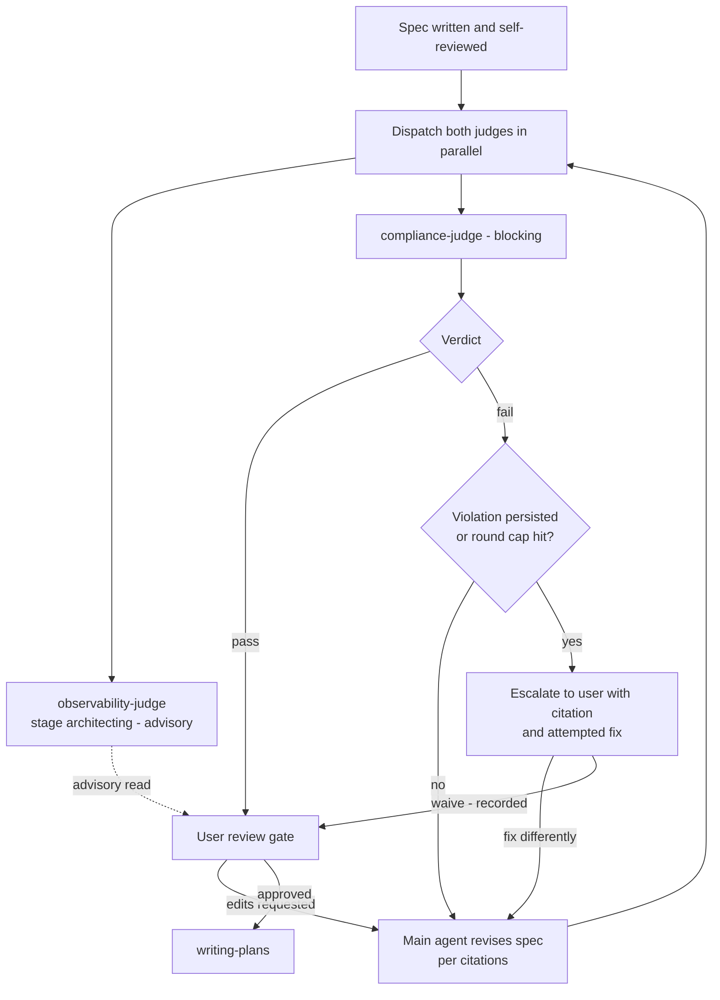

# Compliance Judge — Design

**Date:** 2026-07-18
**Status:** Approved (design). Awaiting spec review before implementation planning.
**Branch:** `feature/compliance-judge`

## Problem

A finished spec is checked twice today, and neither check asks the question that matters most.
The brainstorming flow's self-review catches placeholders and contradictions — but it is the same
model that wrote the spec, checking its own work, against no rule set. The observability judge's
`architecting` run scores the design's *trajectory* — and is explicitly advisory ("surface it and
move on"). Nothing verifies the spec against the rules this setup actually enforces
(`rules/core-conduct.md`, `writing-specs`, the security invariants) before implementation begins.
So a non-compliant spec sails into `writing-plans`, and the rules only bite at diff/PR time —
the expensive place to discover a *design-level* violation. A logic error caught in a spec costs
a paragraph; the same error caught after implementation costs the implementation.

## Decisions (locked)

1. **Separate subagent, parallel run.** `compliance-judge` is its own agent, not an extension of
   the observability judge. At spec-done, both judges dispatch **in parallel, in one message** —
   compliance (blocking) alongside observability `stage: architecting` (advisory, unchanged).
   Each writes to its own store. One agent, one purpose; the shipped judge stays untouched.
2. **Rubric = A + B, applied only where relevant.** A: the spec as artifact, against
   `writing-specs` standards. B: what the spec commits to build, against `core-conduct` +
   security invariants. The judge cites only rules whose territory the spec touches.
3. **Live rules, read at judge runtime.** No baked rubric — the agent definition names *where*
   the rules live, never *what they say*. Single source of truth; the judge stays current as
   rules evolve. Project-level rules (`.claude/project-standards.md`, project `CLAUDE.md`)
   layer on top of global ones and take precedence, mirroring how rules bind the main agent.
4. **Procedure-gated, no hook.** Gate stub in `rules/gates.md` + skill, same deliberate choice
   as `verifying-subagent-commits`. A `spec-guard` hook (block committing a spec without a fresh
   verdict — script-decidable) is deferred until the gate is observed being skipped in practice.
5. **Auto-revise loop; escalation by persistence.** Violations are auto-fixed and re-judged. A
   violation that survives the revision that tried to fix it is by definition "not being fixed"
   and escalates to the user. A 3-round cap is the oscillation tripwire — it hands the decision
   to the user, it never drops anything silently.
6. **Placement:** after the spec self-review, before the user review gate. The user always
   reviews a spec that has already passed compliance, with any escalations bundled into that
   same review.
7. **Fail closed.** No verdict → spec is blocked. Errors are reported, never papered over.

## The loop



The revise step is always the **main agent** — it holds the brainstorm context the stateless judge
cannot see. The judge never edits; the reviser never judges.

## Components

| File | Type | Responsibility |
|------|------|----------------|
| `agents/compliance-judge.md` | Subagent | Reads the live rule sources, judges one spec, writes the verdict (JSONL + markdown), returns a violations/pass summary. Tools: Read, Grep, Glob, Bash, Write. Write restricted by instruction to `coding-memory/compliance-judge/`. |
| `skills/running-the-compliance-judge/SKILL.md` | Skill | The procedure: when to dispatch (alongside the observability judge), the revise loop, persistence tracking, escalation, waiver capture, verdict relay. |
| `rules/gates.md` (new stub) | Gate | 1–2 lines making the spec-compliance check un-skippable at spec-done, pointing at the skill. |
| `CLAUDE.md` Skills Catalog | Catalog | One new line. |
| `coding-memory/compliance-judge/` | Store | `verdicts.jsonl` + per-spec markdown. Separate from the observability judge's store. |

No new dependencies, no new tooling — git + the existing agent/skill machinery only.

## Rubric

**Part A — the spec as artifact** (source: `skills/writing-specs/SKILL.md`):
behavior expressed as BDD/Gherkin scenarios; API contracts / schemas present where the design has
interfaces or data; exact versions pinned for every library/tool the spec names; good, bad, and
edge cases enumerated; background/why present; no placeholders, TBDs, or two-way-interpretable
requirements; spec lives at the canonical path.

**Part B — what it commits to build** (sources: `rules/core-conduct.md`; `skills/writing-secure-code/SKILL.md`
when the design touches external input, auth, databases, shell, or model calls):
KISS/DRY/YAGNI — no speculative features; explicit error handling at boundaries; file/structure
conventions respected by the proposed layout; zero-trust invariants — secrets behind placeholders,
default-deny data stores, vetted registries, pinned dependencies; architecture trade-offs flagged
as human-owned rather than silently decided.

**Repo layer:** if the target repo has `.claude/project-standards.md` or its own `CLAUDE.md`,
those are read too and take precedence over global rules where they conflict.

A rule whose territory the spec does not touch is not cited. Non-blocking observations go to
`notes`, never `violations` — the blocking list stays strictly rule-backed.

## Judge inputs and verdict

Dispatch prompt carries: the spec path, repo root + base branch, a short context summary of what
is being built (so context-dependent rules like YAGNI are judged fairly), and any user-waived
violation ids (the judge records those in `waived` instead of re-citing them as violations).

Each violation: `{id, rule_source, rule, where, why}` — `id` is a stable slug derived from the
rule (e.g. `writing-specs/pinned-versions`), which is what makes persistence detection across
rounds deterministic; `rule_source` is the file the rule lives in; `where` points into the spec;
`why` is one sentence.

`verdicts.jsonl`, one line per round:

```json
{
  "ts": "2026-07-18T00:00:00Z",
  "repo": "dotclaude",
  "branch": "feature/compliance-judge",
  "head_sha": "<full sha>",
  "spec_path": "docs/superpowers/specs/2026-07-18-compliance-judge-design.md",
  "spec_blob_sha": "<git hash-object of the spec file>",
  "round": 1,
  "verdict": "fail",
  "violations": [
    {"id": "writing-specs/pinned-versions", "rule_source": "skills/writing-specs/SKILL.md",
     "rule": "Pin exact versions", "where": "Toolchain section", "why": "names sqlite-vec with no version"}
  ],
  "notes": [],
  "rule_sources_read": ["rules/core-conduct.md", "skills/writing-specs/SKILL.md"],
  "waived": [],
  "confidence": "high",
  "outcome": null
}
```

Markdown writeup per spec: `coding-memory/compliance-judge/<YYYY-MM-DD>-<spec_slug>.md`
(`spec_slug` = spec filename minus date prefix and extension; slash-free by construction), holding
a layman summary, the violations table with citations, and the waiver record. Appended per round;
JSONL line written last, after the markdown — same single-writer discipline as the sibling judge.

**Freshness:** a verdict is fresh only while `spec_blob_sha` matches the current
`git hash-object <spec_path>`. Any edit — including user-requested changes during review —
invalidates it and re-triggers the judge before `writing-plans` runs.

## Scenarios

```gherkin
Scenario: Compliant spec passes first round
  Given a finished spec that satisfies every touched rule
  When both judges run at spec-done
  Then the compliance verdict is pass with zero violations
  And the user review gate opens with the observability advisory read bundled in

Scenario: Objective violation is fixed silently
  Given a spec naming a library with no pinned version
  When the compliance judge fails it citing writing-specs/pinned-versions
  Then the main agent revises the spec and re-dispatches both judges
  And round 2 passes without the user ever being interrupted

Scenario: Persistent violation escalates
  Given a violation cited in round 1 that is still cited in round 2 after a revision
  When the skill detects the same violation id in consecutive rounds
  Then the loop stops and the user is shown the citation and the attempted fix
  And the user either fixes it differently or waives it with the waiver recorded and attributed

Scenario: Round cap trips on oscillation
  Given fixing one violation keeps re-introducing another
  When round 3 completes with violations outstanding
  Then all outstanding violations escalate to the user rather than looping further

Scenario: Compliance judge dies
  Given the compliance-judge subagent errors or returns malformed output
  When the skill receives the result
  Then no verdict is written and none is fabricated
  And the spec stays blocked and the user is told

Scenario: Observability judge dies
  Given the advisory observability run fails while compliance passes
  Then the flow proceeds to user review
  And the user is told the advisory read is missing

Scenario: Core rule source unreadable
  Given rules/core-conduct.md or the writing-specs skill cannot be read
  When the compliance judge starts
  Then it errors out instead of judging partially
  And rule_sources_read makes every pass auditable

Scenario: Spec edited after a pass
  Given a compliance-passed spec the user then edits during review
  When writing-plans is about to run
  Then the stale spec_blob_sha invalidates the verdict and the judge re-runs first
```

## Error handling

- Judge error / malformed output → no verdict, blocked, reported. Fail closed end to end.
- Unreadable core rule source → judge errors out; partial judgment is worse than none.
- Every verdict records `rule_sources_read`, so a pass is auditable.
- Waivers only ever come from an explicit user prompt, and are recorded and attributed.
- Advisory (observability) failure never blocks; compliance failure always does.

## Testing

- **Golden-spec set:** one known-good spec that must pass, plus seeded-violation specs — one per
  rubric area (missing Gherkin, unpinned version, YAGNI bloat, embedded secret, missing error
  handling). Each must fail **with the correct rule_source cited**, judged per
  `evaluating-agents-and-skills` (consistency across repeated runs, not one lucky pass).
  Fixtures live under `skills/running-the-compliance-judge/tests/`.
- **Loop dry-run:** failing spec → revise → re-judge → a deliberately unfixable violation →
  confirm escalation, not looping.
- **Trigger tests:** positive/negative trigger phrases in the skill per the authoring standard.
- **Calibration:** `outcome` backfill (`clean`/`rework`/`bug`) — over time, did compliance-passed
  specs produce clean implementations? Same ledger discipline as the observability judge.

## Out of scope / future work

- **`spec-guard.sh` hook** (block spec commits without a fresh verdict) — deferred until the
  procedure gate is observed being skipped.
- **Judging implementation plans** (`writing-plans` output) — this spec covers specs only.
- **Automatic outcome backfill** — manual JSONL edit for now, same as the sibling judge.

## File manifest

- `agents/compliance-judge.md` (new)
- `skills/running-the-compliance-judge/SKILL.md` (new) + `tests/` fixtures
- `rules/gates.md` (one new stub)
- `CLAUDE.md` Skills Catalog (one new line)
- `coding-memory/compliance-judge/` (new dir; `verdicts.jsonl` created on first verdict)
