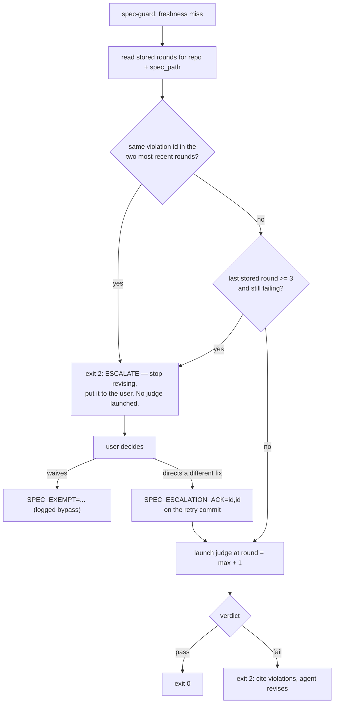

# Spec (companion): Component Contracts & Scenarios — Deterministic Judge Enforcement

- **Parent spec:** `2026-07-20-judge-terminal-enforcement-design.md`. This file is one half of a
  single design; neither half stands alone. Read the parent first — it carries the background, scope,
  architecture, pinned toolchain, data contracts (including §5.3, the spec-unit model this file
  implements), failure matrix, security invariants, testing plan, and deferrals.
- **What lives here:** **§6** component contracts (launcher, both hooks, exemptions, `settings.json`,
  skills, operator view) and **§7** scenarios — the Gherkin acceptance criteria an implementer works
  against.
- **Why it is a separate file:** the parent reached ~1100 lines against `core-conduct`'s 800-line
  ceiling. The user's call at review (2026-07-20) was to split rather than take the exception. §7
  followed §6 here when the spec-unit work pushed the parent back over.
- **Section numbering is unchanged.** This file keeps `§6`, its subsections, and `§7` exactly as they
  were numbered in the single-file revision, so every cross-reference in the parent, in
  `coding-memory/branches/judge-terminal-enforcement.md`, and in the stored round 1–4 verdicts still
  resolves without rewriting. References here to `§1`–`§5` and `§8`–`§12` point back into the parent.
- **Repo:** `suyatdev/.claude` · **Branch:** `feature/judge-terminal-enforcement`

This file is a **part** of the unit rooted at the parent spec, declared in the format §5.3 defines.
Its `part_of` and the parent's `parts` must agree — a one-sided declaration is a broken unit and the
gate refuses it (§5.3):

```yaml
spec_unit:
  part_of: docs/superpowers/specs/2026-07-20-judge-terminal-enforcement-design.md
```

---

## 6. Component contracts

### 6.1 The launcher

#### 6.1.1 Decomposition and size budgets

Seven distinct jobs do not belong in one file. The largest hook in this repo today is
`hooks/scan-invisible-unicode.sh` at 211 lines; `judge-guard.sh` is 144. The launcher ships as a thin
entrypoint over five single-purpose libs, each sourced, each with a stated budget:

| File | Job | Budget |
|---|---|---|
| `bin/judge-launch.sh` | arg parse, orchestration, exit-code mapping | ≤ 120 |
| `bin/lib/judge-validate.sh` | argument + path validation, preflight, mode assertions | ≤ 110 |
| `bin/lib/judge-rundir.sh` | run-id, run dir, `manifest.json`, `prompt.txt`, `run.sh` | ≤ 130 |
| `bin/lib/judge-lock.sh` | acquire / stale-break / piggyback / release | ≤ 100 |
| `bin/lib/judge-spawn.sh` | the terminal ladder | ≤ 110 |
| `bin/lib/judge-wait.sh` | sentinel poll, liveness probe, deadline | ≤ 80 |

Budgets are enforced by the test harness, not by convention: `judge-launch.test.sh` fails if any file
exceeds its number. No file approaches the 400-line convention, and the libs are independently
testable — `judge-lock.sh` in particular, whose regression history (ADR-0005) is the reason it is its
own unit rather than a section of a larger script.

#### 6.1.2 Argument contract

```
judge-launch.sh --judge compliance --spec <path> --round <N>
                [--context-file <path>] [--prior-violations-file <path>]
                [--waived id,id] [--acked id,id] [--wait [--deadline <secs>]]
judge-launch.sh --judge observability --stage architecting|implementation
                [--decisions-file <path>] [--spec <path>] [--test-cmd-file <path>]
                [--wait [--deadline <secs>]]
```

The `*-file` arguments exist because the judges require inputs that no flag-sized value can carry: the
compliance judge scores YAGNI *against a stated need* and, from round 2, reuses ids from the prior
round's `violations` array; the observability judge scores the **decisions summary** as its trajectory
evidence. Passing these as files rather than as argument text is what keeps §9.2 intact — see §6.1.3.

**Every one of them is optional, and that is the point.** A launcher whose required arguments only an
interactive agent can supply is not usable by a hook, and the hook path is the whole reason this design
exists. Each optional input therefore has a **specified deterministic fallback** (§6.2.1) rather than
being merely omittable — an absent input never means the judge silently receives less than its
definition requires. One input is stronger than a fallback: prior-round violations are **derived by
the launcher itself**, awaited from no caller.

**Launcher-computed unit sha.** For `--judge compliance` the launcher resolves `--spec` to its unit
(§5.3), computes `spec_unit_sha` from the members' index blobs, and records it in `manifest.json`
alongside the resolved `unit_members` list. It reaches the judge as one prompt field (§6.1.3) that the
agent echoes into its verdict row without recomputing (§4.1). Resolution lives **here and nowhere
else**: the hook does not compute it, the skill does not compute it, and the judge cannot — one
implementation, so the gate's freshness lookup and the row it matches against can never be computed by
two different rules. For a standalone single-file spec the value is `null` and every downstream
behaviour is unchanged.

**Launcher-derived prior violations.** When `--judge compliance`, `--round > 1`, and no
`--prior-violations-file` override is given, the launcher — *after* creating the run dir — extracts
the `violations` array of the most recent stored round for this `repo` + `spec_path` from the
compliance store and writes it to `<run-dir>/prior-violations.json`, which feeds §6.1.3's PRIOR
VIOLATIONS section. Round 3 of this spec's own review proved why this lives launcher-side: it told
the *hook* to write that file into a directory only the launcher can create, under a run-id only the
launcher can generate. Moving the extraction inside the launcher, after run-dir creation, does not
fix that ordering — it **deletes** it: everything needed is already in the launcher's hands
(`--spec`, `--round`, the store), no caller sequences anything, and no caller can silently disable
the escalation cap by forgetting an argument (§6.2.2). The flag survives as an explicit override for
ad-hoc runs, validated like every other `--*-file`. One asserted edge: if `--round > 1` but the
store holds no prior round for this spec and no override is given, preflight fails (exit 4) — a
round above 1 claims a history, and a claim the store cannot back fails closed rather than judging
with silently absent priors.

**Argument validation — fail closed on any miss:**

| Arg | Rule |
|---|---|
| `--spec` | resolves inside repo, matches `docs/superpowers/specs/*.md`, exists in the index, and is a **unit root** (§5.3) — a path declaring `part_of` is rejected with the root named, rather than silently judged as a fragment. Index blob == worktree blob for **every member** of the unit, not only this path (§5.2, §5.3) |
| `--stage` | enum: `architecting` \| `implementation` |
| `--round` | numeric, `>= 1` |
| `--waived`, `--acked` | comma-separated, charset `^[A-Za-z0-9_.,-]+$` |
| `--*-file` | resolves inside the repo, exists, regular file (not symlink/FIFO), non-empty, ≤ 64 KiB, UTF-8 decodable. (The former "or run dir" branch is gone with the hook-provisioned file: callers only pass files they authored, and the launcher's own `<run-dir>/prior-violations.json` is internal, never an argument) |
| run-dir path | launcher-generated, asserted `^[A-Za-z0-9/_.-]+$` before any interpolation |

Only the **paths** are validated; file *contents* are never validated, never parsed, and never reach a
shell — they are copied bytes-for-bytes into `prompt.txt`. The 64 KiB cap is a prompt-budget guard, not
a safety control.

#### 6.1.3 Prompt contract

`prompt.txt` is assembled by `judge-rundir.sh` from a fixed template plus the validated inputs, written
once before spawn, and never regenerated. Sections are delimited by fixed heredoc markers the launcher
emits; interpolated values come only from the validated arg set, and file contents are streamed in
whole.

```
You are judging as the <judge> agent. Inputs follow.

spec_path: <validated --spec>          # compliance: the unit ROOT to judge (§5.3)
spec_unit_sha: <launcher-computed, or "none — standalone spec">   # compliance only; RECORD, do not recompute
unit_members: <newline list of member paths, root first>          # compliance only; read all of them
round: <validated --round>             # compliance only
stage: <validated --stage>             # observability only
design_doc: <validated --spec, or "none — no design doc supplied">   # observability only
test_command: <contents of --test-cmd-file, or "none — nothing runnable at this stage">
base_branch: main
waived: <validated --waived, or "none">

--- BEGIN CONTEXT SUMMARY ---          # verbatim --context-file / --decisions-file, or the §6.2.2 fallback
<file contents>
--- END CONTEXT SUMMARY ---

--- BEGIN PRIOR VIOLATIONS (round N-1) ---       # launcher-derived from the store (§6.1.2), or the
<file contents>                                  #   override; omitted entirely when round == 1
--- END PRIOR VIOLATIONS ---

Follow your agent definition. Persist your verdict before returning.
```

Both judges' declared inputs are now covered: compliance's `spec_path`, `round`, context summary,
`waived`, base branch, prior violations, and §4.1's two additions `spec_unit_sha` and `unit_members`;
observability's `stage`, decisions summary, design doc, test command and base branch. Those two are the
§4.1 amendment's whole footprint on the prompt — the count matches §2, §4.1 and §12 exactly: the judge
reads every listed member as one artifact, and copies `spec_unit_sha` into its verdict row verbatim. It is explicitly **not** the judge's to derive —
a judge that recomputed it would put unit resolution in two places and reintroduce, one level up, the
two-hash divergence §5.2 exists to close. `--test-cmd-file` is a file rather than a flag value for one reason: a
test command is shell text, and a flag would invite it onto a command line. It is written into
`prompt.txt` as data, and the judge — not the launcher — decides whether to run it.

**Why this does not reopen the injection surface §9.2 closed.** The threat model there is untrusted
text becoming *terminal command text* — an AppleScript `do script` argument. Here no rung ever sees the
prompt: rungs execute `bash <run-dir>/run.sh`, and `run.sh` reads the prompt with
`"$(cat "$RUN_DIR/prompt.txt")"`, which is shell-quoted at the point of use. Content that would be
hostile as shell text is inert as file bytes. §9.3 is amended accordingly: prompts are built from the
validated argument set **and the contents of files named by validated paths**, the latter treated
strictly as data.

The residual risk is prompt injection *against the judge* — a context summary that instructs the judge
to pass. This is accepted and bounded: the summary is authored by the same main agent that authored the
spec, so it crosses no trust boundary the spec itself does not already cross, and the judge's output is
constrained by its own definition and persisted where the user reads it. Delimiters are fixed markers
so a summary containing one is visible in `prompt.txt` rather than silently structural.

**Exit codes** (`2` is deliberately unused, reserved so a launcher status can never be mistaken for a
hook's own `exit 2`):

| Code | Meaning | Hook mapping |
|---|---|---|
| 0 | sentinel observed; caller re-reads store | continue to store re-check |
| 1 | usage / validation error | exit 2, "gate misconfigured" |
| 3 | deadline expired, judge still running | exit 2, "still running in `<ref>`" |
| 4 | preflight failed (`claude` absent, agent def missing, run-dir mode assertion) | exit 2, naming the missing piece |
| 5 | spawn failed on every rung | exit 2, "could not start judge" |

**`run.sh` contract** — the indirection that removes the AppleScript injection risk. No rung ever
interpolates a prompt; every rung executes only `bash <run-dir>/run.sh`.

```bash
set -euo pipefail
RUN_DIR=<absolute run-dir>                 # absolute: cwd is the repo root, not the run dir
cd <repo root>                             # judge must resolve repo-relative paths
export JUDGE_SESSION=1
trap 'echo $? > "$RUN_DIR/done"' EXIT      # sentinel on every path, including crash
claude -p "$(cat "$RUN_DIR/prompt.txt")" --agent <judge> --output-format json \
       --allowed-tools <declared list> \
       > "$RUN_DIR/result.json" 2> "$RUN_DIR/stderr.log"
```

Every run-dir path here is **absolute**. `run.sh` deliberately runs with the repo root as its cwd so
the judge resolves repo-relative paths like `docs/superpowers/specs/...`; relative artifact paths
would therefore land in the repo root, not the run dir.

**Terminal ladder** — first available rung wins; the chosen rung is recorded in the manifest:

| # | Detected by | Spawn | `terminal_ref` | Liveness probe |
|---|---|---|---|---|
| 1 | `CMUX_WORKSPACE_ID` | `cmux new-workspace --name "judge: <judge>" --cwd <repo root> --command "bash <run-dir>/run.sh" --focus false` | workspace ref on stdout | `cmux list-workspaces`, ref still present |
| 2 | `TMUX` | `tmux split-window -d bash <run-dir>/run.sh` | pane id | `tmux list-panes`, id still present |
| 3 | `TERM_PROGRAM=Apple_Terminal` | Terminal `do script "bash <run-dir>/run.sh"` via `osascript` | window id | none available — deadline only |
| 4 | — (always available) | `nohup bash <run-dir>/run.sh &` (`mode=headless`) | PID | `kill -0 <pid>` |

Every rung executes the identical string `bash <run-dir>/run.sh` and differs only in how it is
delivered. Note that rung 1's `--command` takes *text*, so it is an interpolation point exactly like
rung 3's AppleScript — which is why §6.1.2 charset-asserts the launcher-generated run-dir path before
any rung sees it, and why the indirection matters on the first rung as much as the third.

**Why four rungs, not five — and why each exists:** rungs 1–3 are terminals the user actually works
in daily (iTerm2 is dropped — the user does not run it, so a fifth rung would have been speculative
surface); rung 2 is additionally the only rung scriptable in tests (§10); rung 4 is the correctness
floor — if detection silently fails the judge still runs, only its visibility degrades, which is
what keeps S2 (env-var inheritance, §10) a non-blocking spike.

**The `osascript` surface does not go away with iTerm2.** Terminal's `do script` is AppleScript, so
rung 3 keeps the injection surface §9.2 exists to close, and the `run.sh` indirection stays
load-bearing — justified on the Terminal rung specifically. A future change that removed rung 3
could revisit the indirection; nothing else here can.

**Wait mode:** poll the sentinel every **10s**; deadline default **840s**. On each poll also run a
best-effort liveness probe for the chosen rung (tmux pane still exists / headless PID alive) so a
SIGKILLed pane — which leaves no trap and therefore no sentinel — exits early as
"terminated without completing" rather than burning the full deadline.

**Launch lock** — `mkdir`-atomic, per `judge + repo + target-key`:

- Lock dir holds the owning `run-id` and launcher PID.
- A second caller for the same target **piggyback-waits on the first run's sentinel** instead of
  duplicating the judge.
- Stale-lock break re-verifies its justifier (owner PID actually dead) **immediately before**
  breaking, per ADR-0005. Use `mkdir` where "create or fail" is meant — never `mv`, which nests when
  the destination exists.

### 6.2 `hooks/spec-guard.sh` [new]

PreToolUse / Bash.

**Detection — what is reused and what is new.** Reused from `judge-guard.sh` unchanged: the python
`shlex` split, the leading `rtk` strip, the leading `NAME=VALUE` env-assignment walk, and the anchored
subcommand match. **New code, not reuse:** all git global-option handling. `judge-guard.sh` contains no
`-C` handling whatsoever — it matches a three-token `gh pr create` and never needed any. Describing the
`-C` path as "verbatim" reuse would have sent an implementer looking for a function that does not exist.

That distinction matters because the blast radius changes shape. `gh pr create` is rare; `git commit`
is the most-run command in this repo, so a classifier bug here blocks *all* commits rather than an
occasional PR. Global options are therefore handled explicitly:

| Form | Handling |
|---|---|
| `-C <dir>`, `-c <k=v>`, `--git-dir=<d>`, `--work-tree=<d>`, `--namespace=<n>`, `--exec-path=<p>`, `--config-env=<e>` | Consumed with their value; **passed through** to every `git` the hook itself runs (§5.2's hash comparison and the staged-file listing must target the same repo the commit targets) |
| Flag-only globals (`--no-pager`, `--paginate`, `--bare`, `--literal-pathspecs`, …) | Skipped generically as a leading `-*` token |
| An unrecognized **value-taking** option | Unclassifiable → `exit 0` with a logged warning (see below) |
| First non-option token | Must be exactly `commit`, else `exit 0` |

**Two failure directions, deliberately treated differently.** Infrastructure failure — python absent,
store unreadable — **fails closed** (block), matching judge-guard. *Classification ambiguity* on an
exotic git invocation **fails open with a log line**, because this is a momentum guardrail rather than a
security boundary, and blocking every commit in the repo on an unparseable global option is a worse
outcome than missing one gate. This is the same posture as the accepted chained-command limitation
(`foo && git commit`) in judge-guard and git-guard; it is named in §11 rather than left implicit.

**Fast path — a necessary-condition pre-filter.** Before spawning python at all, the hook checks
whether the raw command string contains the substring `commit`; if not, `exit 0` immediately. A second
PreToolUse/Bash hook would otherwise add a python spawn to *every* Bash tool call. This is safe
specifically because it can only ever *skip* work: no string lacking `commit` can be classified as
`git commit` by the anchored classifier, so the filter removes no block that would otherwise happen.
The distinction is load-bearing — this repo has already shipped a substring bug where the substring
*decided* rather than pre-filtered — so the invariant is stated as a test: **every block decision is
made by the anchored classifier; the substring appears in no decision path.** Past the pre-filter, a
commit whose recorded set contains no `docs/superpowers/specs/*.md` exits 0 after one
`git commit --dry-run --porcelain -z` (~10ms, §5.2).

**Decision order:** `JUDGE_SESSION` → `SPEC_EXEMPT` → detection (dry-run, §5.2) → staged==worktree
precondition (§5.2) → freshness → **escalation check** → launch → re-verify.

#### 6.2.1 How the hook populates the launcher's arguments

Round 2 specified the launcher's argument contract but never said where a *hook* — running
non-interactively inside a `git commit`, with no conversation to draw on — obtains those arguments.
Both of round 1's persistent violations trace to that single omission: the interface was designed
without its caller. Every argument the hook passes is derived deterministically from the repo and the
store, with no main-agent input at any point.

| Argument | How the hook produces it |
|---|---|
| `--spec` | the **unit root** that detection's recorded spec entries resolve to (§5.2 → §5.3). One root by construction: a commit spanning two distinct units was already refused at detection, so the hook never has to choose |
| `--round` | `max(stored round for repo + unit root spec_path) + 1`, or `1` if none (§6.2.2) |
| `--prior-violations-file` | **not passed — no caller passes it.** The launcher derives prior violations from the store itself whenever `round > 1` (§6.1.2); the flag exists only as an ad-hoc override, and the hook never uses it |
| `--waived` | the union of `waived` ids across this spec's stored verdicts |
| `--acked` | `SPEC_ESCALATION_ACK`, when set (§6.2.2) |
| `--context-file` | **not passed** — see below |
| `--decisions-file` | **not passed** on the `judge-guard` path — see below |

**Launcher-derived prior violations are what make the cap real.** The "same id in two consecutive
rounds" tripwire depends on the judge *reusing* violation ids, and `agents/compliance-judge.md` only
reuses ids when handed the prior round's array — without it, persistence reads as novelty and the
loop never escalates. Three consecutive review rounds of this spec failed on exactly this hand-off:
no caller, then no data source, then a destination that could not yet exist. Round 4 removed the
hand-off entirely — the launcher extracts the array itself (§6.1.2). The store already holds it;
now nothing else has to.

**Why the hook passes no `--context-file`, and why that is better than passing one.** The compliance
judge scores YAGNI against a *stated need*, and on the hook path the stated need is already in the
artifact under judgment — §1 gives the why, §2 the boundaries. When `--context-file` is absent the
launcher emits, in the context slot, a fixed instruction to read the spec's own Background and Scope
as the stated need. That is not a degradation: an agent-authored summary is precisely the injection
vector §6.1.3 flags — a summary that quietly restates a speculative feature as a requirement turns a
YAGNI violation into a pass. Judging the spec on its own terms removes that lever. The argument
survives for the skill path, where a human-directed summary carries information the spec cannot
(*"the user does not use iTerm2"*), and the skill continues to supply it.

**Same reasoning for `--decisions-file` on the `judge-guard` path.** When absent, the launcher's
fallback names the deterministic trajectory evidence that already exists: the branch's commit messages
(`git log <base>..HEAD`) and the branch log under `coding-memory/branches/`. This repo writes commit
messages that state decisions and their reasons, so the evidence is real rather than a placeholder.
The skill path keeps passing an explicit summary.

**The fallback text is a launcher constant, not a runtime string.** It is compiled into
`judge-rundir.sh`, never derived from the command being gated, so it introduces no new input to
validate.

#### 6.2.2 Round accounting and the escalation cap

`rules/gates.md` requires that persistent violations escalate to the user and are never silently
waived. Today that cap lives in `running-the-compliance-judge`: escalate when the same violation `id`
is cited in two consecutive rounds, or when round 3 completes with anything outstanding. **The whole
premise of this change is that a skill is skippable**, so the deterministic path inherits none of it —
moving the loop into the hook without moving the cap would leave an unbounded loop whose every
iteration costs a full judge session and up to 14 minutes. The cap moves with the loop.

**No new storage is needed.** The compliance store already carries `round` and `violations` per
`spec_blob_sha`, keyed by `repo` + `spec_path`, so attempt history is reconstructible from the file the
hook already reads.

- `round` = `max(stored round for this repo + spec_path) + 1`, and **`1` when the spec has no stored
  verdicts** — the empty case is defined, not inferred.
- Rounds are counted per `spec_path`, deliberately **not** per `spec_blob_sha`: each revision produces
  a new blob, so per-blob counting would reset the cap on every revision and never fire.
- For a multi-file spec, `spec_path` here is the **unit root** (§5.3), so a unit has exactly one round
  counter however many files it spans. Counting per member would let a violation that persists across
  both halves split across two counters and never reach the cap — the same "the cap silently no-ops"
  failure the launcher-derived violations above exist to prevent, arriving by a different route.

**Escalation fires before the launch, not after** — the point is to stop spending judge sessions:



**Releasing an escalation — `SPEC_ESCALATION_ACK=<id,id>`.** Without an escape the cap deadlocks: the
history that triggered escalation is immutable, so every subsequent attempt would re-escalate without
ever launching. The ack is the agent's assertion that *the user has been consulted about these exact
ids*. It is parsed exactly like `SPEC_EXEMPT` (leading env-assignment, value logged to stderr),
suppresses the escalation check and is **single-use**: it authorises one launch and is recorded in the
run manifest. It is not persisted as state, so if the same id recurs on a later round the ack is no
longer set and the escalation fires again — each escalation costs a fresh human decision, which is the
intended price.

**The ack releases both escalation branches, not just the id-scoped one.** An earlier revision scoped
the ack "to precisely the listed ids" while the round-3 branch cites no ids — read strictly, a spec
that reached round 3 failing could never launch a judge again: the deadlock the ack exists to
prevent, merely relocated. Resolved explicitly: a set `SPEC_ESCALATION_ACK` suppresses the
escalation check for that one launch, whichever branch fired; the listed ids are recorded for
attribution, not used as a filter.

**The ack is deliberately not passed to the judge.** It reaches the manifest and the hook's stderr, but
never `prompt.txt`. Telling a judge "the user has been consulted about `core-conduct/yagni`" is an
invitation to soften on exactly the violation under dispute, and the judge's contract is to score the
spec as it stands. Keeping the ack out of the prompt also keeps §4.1 true: the compliance agent's input
list stays exactly what its definition declares — `spec_path`, `round`, context summary, `waived`, base
branch, prior violations, and §4.1's two additions `spec_unit_sha` and `unit_members` — with no
undeclared field to interpret. That list holds **eight** entries; the ack is not one of them and must
not become a ninth.

An ack is **not** a waiver and must not be used as one: it does not suppress the violation, and the
judge still cites it. Only `SPEC_EXEMPT` bypasses the gate, and only the user supplies it.

**Ownership, stated once:** on the deterministic path the **hook owns the cap**; the skill keeps its own
for `Agent`-tool and ad-hoc runs. They cannot drift apart on history, because both derive it from the
same store — but the thresholds are duplicated in two places, and §10 requires a test asserting they
agree.

On a freshness miss that clears the escalation check: launcher `--wait` → re-read the store → `exit 0`,
or `exit 2` with the stored violations on stderr so the main agent revises and retries.

### 6.3 `hooks/judge-guard.sh` [extended]

Unchanged through detection, `JUDGE_EXEMPT`, and the freshness check. Only the terminal
"no fresh verdict → exit 2" branch changes: it now launches `--stage implementation --wait`,
re-checks, then exits 0 or 2. Adds the `JUDGE_SESSION=1` short-circuit.

It passes no `--decisions-file`, taking the §6.2.1 fallback (branch commit messages plus the branch
log) for the same reason `spec-guard` passes no `--context-file`: a hook has no conversation to
summarise, and a summary it could fabricate would be worse than the evidence already in the repo.
`judge-guard` has **no escalation cap** — its loop is bounded by the PR attempt itself rather than by
rounds, and `stage: implementation` verdicts key on `head_sha`, so each retry follows a new commit.

### 6.4 Exemptions

**Separate `SPEC_EXEMPT=<reason>`**, parsed exactly like `JUDGE_EXEMPT` (leading env-assignment,
value logged to stderr). Each gate keeps its own key so a bypass stays as narrow as the gate it
opens — per-door keys, not a master key.

Three keys exist and they are not interchangeable. The distinction is what keeps "nothing is waived
silently" true:

| Key | Opens | Authorised source |
|---|---|---|
| `SPEC_EXEMPT=<reason>` | the whole spec gate, once | user |
| `JUDGE_EXEMPT=<reason>` | the whole PR gate, once | user |
| `SPEC_ESCALATION_ACK=<ids>` | the escalation cap only, once (§6.2.2) | agent, **after** consulting the user |

`SPEC_ESCALATION_ACK` never suppresses a violation and never allows an unjudged commit — the judge
still runs and still cites.

**"Authorised source" is a convention, not an enforcement, and the spec says so rather than implying
otherwise.** All three are indistinguishable leading env-assignments; the hook cannot tell whether a
human or the agent set one, and nothing prevents an agent from re-supplying an ack every round to keep
a loop alive indefinitely. This is stated plainly because the alternative — writing the table as though
the hook enforced provenance — would be a claim the code cannot back, and this branch has already
shipped one of those.

What the design does provide is **visibility, not prevention**: every key's value is echoed to stderr
where the user sees it, the ack is recorded in the run manifest, and every round is a store row with a
timestamp, so a fabricated ack or a spinning loop is reconstructible after the fact. The deterministic
part of the cap is the *detection*; the release is advisory by construction, for the same reason
`SPEC_EXEMPT` is — a gate whose bypass cannot be reached is a gate that gets deleted. Making the
release enforceable would require provenance the hook does not have, and is listed in §11 rather than
pretended here.

### 6.5 `settings.json`

Register `spec-guard.sh` on PreToolUse/Bash alongside `judge-guard.sh`. Both judge hooks get an
explicit `"timeout": 900`, with the launcher's `--deadline 840` deliberately **below** it.

**Why the ordering matters:** a hook that hits the harness timeout **fails OPEN** — the tool call
proceeds. If the harness timer fired first, a slow judge would silently *allow* the very commit the
gate exists to block. Our own 840s deadline guarantees the hook exits 2 under its own control first.

**Both halves of that sentence are assumptions, and neither has been measured here — see blocking
spike S3 (§10).** An earlier revision claimed no hook in `settings.json` sets an explicit timeout;
that was false. **Ten of the seventeen hooks registered on this machine set one — every one of them
`10` seconds** (the machine-local Orca registrations; no repo-committed hook sets any). Verified
2026-07-20. The correction sharpens the concern rather than softening it: the only timeout the
harness has been observed honouring here is 10s, and this design asks for 900 — a 90× extrapolation
with nothing tried in between. Two things must hold: that the harness honours a 900s hook timeout at
all (rather than silently capping it lower), and that a timed-out hook fails open (rather than
blocking, which would be a different but survivable failure). If the harness caps below
840s, the gate fails open **exactly when the judge is slow** — the case it exists for — and it fails
open *silently*, producing a commit that looks judged and never was. That is the worst available
shape, which is why S3 blocks implementation alongside S1 rather than being verified afterwards.

If S3 shows a lower effective cap, the deadline is not simply lowered to fit: a judge that cannot
finish inside the real cap makes the wait-inline model unworkable, and the fallback is to exit 2
immediately on a freshness miss ("judge launched in `<ref>`; re-run the commit when it finishes"),
turning the gate from blocking-and-waiting into blocking-and-retrying. That is a design fork, so it is
resolved by measurement before implementation, not during it.

### 6.6 Skills

Both `running-the-*-judge` skills change "dispatch subagent (Agent tool)" → "run the launcher as a
background Bash task". At spec-done both judges still launch in parallel (two windows); the main
window receives the harness background-task notification on each exit, then reads the stores.

The skills keep supplying `--context-file` / `--decisions-file` explicitly: a human-directed summary
carries information the artifact genuinely cannot (*"the user does not use iTerm2"* decided this
design's ladder), which is exactly why those arguments exist even though the hook path declines them
(§6.2.1). Neither skill passes `--prior-violations-file` any longer — the launcher derives prior
violations for every caller (§6.1.2); the flag remains only for ad-hoc override. Each skill also keeps its own capped loop for the `Agent`-tool and ad-hoc paths, with
thresholds identical to §6.2.2's. `running-the-compliance-judge`'s freshness sentence — *"a verdict is fresh only while its
`spec_blob_sha` matches `git hash-object <spec_path>`"* — stays correct as written **only under §5.2's
staged==worktree precondition**, and the skill gains a sentence saying so. It needs a **second**
sentence for units (§5.3): for a multi-file spec, freshness keys on `spec_unit_sha` covering every
member, so the single-file hash comparison in that sentence is necessary but not sufficient. A skill
that kept only the original wording would report a verdict as fresh after a companion-only edit —
exactly the hole units exist to close.

### 6.7 What the operator sees

A `git commit` that records a spec can now block for **up to 840 seconds**. That is a real change to the
feel of the most-run command in the repo, and it is stated here rather than discovered:

- **Cache hit (the common case):** no spawn, no wait — the freshness check is a store read.
- **Miss:** the commit blocks while a judge runs in its own visible pane. The main session shows the
  Bash tool call pending; the launcher emits a single stderr line naming the run dir and the pane
  (`terminal_ref`) before it starts polling, so the wait is attributable rather than a hang.
- **Escalation:** no wait at all — the cap fires before the launch, so the slow path is never paid to
  reach a conclusion the user must arbitrate anyway.

The wait is inline and blocking by design: a non-blocking gate on `git commit` is one the agent walks
past, which is the failure this whole change exists to fix. The escape for a genuinely urgent commit is
`SPEC_EXEMPT`, logged.

---

## 7. Scenarios

### Good paths

```gherkin
Scenario: Fresh verdict short-circuits
  Given a pass verdict exists for this spec's staged blob sha
  When the agent commits that spec in any form
  Then spec-guard exits 0 without spawning anything

Scenario: Miss launches, judge passes, commit proceeds
  Given no verdict exists for the staged blob sha
  When the agent commits that spec in any form
  Then a judge session starts in its own pane
  And spec-guard waits for the sentinel, re-reads the store, and exits 0

Scenario: Parallel spec-done launches both judges
  Given the skill launches compliance and observability together
  Then each gets its own run-id and its own window
  And neither lock blocks the other, because the target keys differ
```

### Bad paths

```gherkin
Scenario: Judge fails the spec
  Given the judge writes a fail verdict citing two violations
  When spec-guard re-reads the store
  Then it exits 2 with both violations on stderr
  And the commit is blocked so the agent can revise and retry

Scenario: Judge crashes
  Given the judge process dies non-zero
  Then the trap still writes the sentinel with that exit code
  And the hook message says "crashed", points at stderr.log,
    and is distinguishable from "ran and failed the spec"

Scenario: python3 is unavailable
  Then spec-guard cannot classify the command and exits 2 — fail closed

Scenario: The spec has unstaged edits
  Given the spec's index blob differs from its worktree blob
  When any commit form puts that spec in the recorded set
  Then spec-guard exits 2 telling the agent to stage its edits first
  And no judge is launched, because the two hashes would never reconcile

Scenario: The same violation survives the revision meant to fix it
  Given `core-conduct/yagni` was cited in the two most recent stored rounds
  When the agent commits the revised spec
  Then spec-guard exits 2 with an ESCALATE message naming that id
  And no judge is launched, so no session is spent on a decision the user owns

Scenario: Round 3 completes with anything outstanding
  Given the last stored round is 3 and its verdict is fail
  Then spec-guard escalates on the same terms, whatever the ids are
```

### Edge cases

```gherkin
Scenario: The judge's own session hits the same hook
  Given run.sh exported JUDGE_SESSION=1
  When the judge session runs any git commit
  Then both guards exit 0 immediately, and no judge launches a judge

Scenario: Pane killed with SIGKILL, no trap, no sentinel
  Then the liveness probe reports the pane gone
  And the launcher exits early rather than waiting the full 840s

Scenario: A second commit races the first for the same spec
  Then the second caller finds the lock held
  And waits on the FIRST run's sentinel rather than launching a duplicate

Scenario: Deadline expires with the judge still working
  Then the launcher exits 3 and the hook exits 2 "still running in <ref>"
  And the harness 900s timeout never fires, so the gate never fails open

Scenario: Store is being appended to while the hook reads it
  Then unparseable (mid-append) lines are skipped, not treated as corruption

Scenario: Commit records a spec AND source files
  Then the spec gate still applies — extra files are not an escape hatch

Scenario: Commit records no spec file
  Then spec-guard exits 0 silently on the fast path

Scenario: The user is consulted and directs a different fix
  Given an escalation fired for `core-conduct/yagni`
  And the user directed a different fix rather than waiving it
  When the agent retries with SPEC_ESCALATION_ACK=core-conduct/yagni
  Then the escalation check is suppressed for that id only
  And a judge launches at round max+1
  And the ack is recorded in the run manifest but absent from prompt.txt

Scenario: An acknowledged violation recurs on a later round
  Given the ack authorised exactly one launch and was not persisted
  When the same id is cited again
  Then spec-guard escalates again, because a fresh human decision is required

Scenario: An ack is used where a waiver was meant
  Given SPEC_ESCALATION_ACK lists an id the judge still cites
  Then the violation is still cited and the commit is still blocked
  And only SPEC_EXEMPT can bypass the gate itself

Scenario: Commit uses -a with the spec modified but never staged
  When the agent runs `git commit -am "..."`
  Then the dry-run lists the spec as recorded — -a is not an escape hatch
  And the precondition requires one `git add` so every hash agrees before judging

Scenario: -i commits a staged spec past a pathspec naming something else
  Given the spec is staged and `other.txt` is modified
  When the agent runs `git commit -i -- other.txt`
  Then the dry-run lists the spec as recorded and the gate applies
  And the pathspec-only reading that missed this is exactly what §5.2 replaced

Scenario: A pathspec names only unrelated files
  Given the spec is staged but the command is `git commit --only -- other.txt`
  Then the spec is not in the recorded set and spec-guard exits 0
  And the spec stays staged, gated on its own eventual commit

Scenario: Nothing to commit
  Given the dry-run exits 1 — output empty, or only `??` entries for untracked files
  Then spec-guard exits 0 — git itself will refuse the real commit

Scenario: Untracked spec file present
  Given a new spec exists but was never `git add`ed
  Then its `??` entry never reads as detection, because the commit will not record it

Scenario: Amending on top of a spec commit
  Given HEAD records a spec and the agent amends in an unrelated fix
  Then the dry-run lists the amended commit's whole file set, spec included
  And the gate re-applies — an over-block toward fail-closed, by design

Scenario: An escalation fires on the round-3 branch, which cites no ids
  When the agent retries with SPEC_ESCALATION_ACK set
  Then the escalation check is suppressed for that launch regardless of branch
  And the loop is not deadlocked by an id-scoped release

Scenario: Commit runs against another repo via -C
  When the agent runs `git -C ../other commit`
  Then the hook's own hash comparison and staged-file listing use -C ../other too
  And the gate reasons about the repo the commit actually targets

Scenario: An unrecognized value-taking global option appears
  Then the command is unclassifiable, spec-guard exits 0 and logs a warning
  And the ambiguity is visible rather than silently blocking every commit

Scenario: A Bash command that cannot be a commit
  Given the raw command string contains no "commit" substring
  Then spec-guard exits 0 without spawning python
  And no block decision was made by the substring — only by the anchored classifier

Scenario: A commit records both halves of one spec unit
  Given the root spec declares the companion in its parts
  And the commit records both files
  Then both entries resolve to the same unit root
  And exactly one judge is launched, for the unit, at one round number

Scenario: Only the companion is edited and committed
  Given a pass verdict is stored for the unit
  When the companion alone is revised and committed
  Then the unit sha changes even though the root's blob did not
  And freshness misses and a judge relaunches
  # The hole the split opened. A per-file key passes every other unit
  # scenario here and fails exactly this one.

Scenario: A unit member is left unstaged
  Given the commit records the root and the companion has unstaged edits
  Then spec-guard exits 2 naming the companion
  And nothing is launched, because the unit sha and the judge's read would disagree

Scenario: A companion points at a root that does not claim it
  Given the companion declares part_of the root
  And the root's parts list omits the companion
  Then spec-guard exits 2 "broken spec unit" and launches nothing

Scenario: One commit records two unrelated specs
  Given the recorded set resolves to two distinct unit roots
  Then spec-guard exits 2 naming both roots
  And no judge is launched, and the fix is to commit them separately

Scenario: A single-file spec is unaffected
  Given a spec with no spec_unit block
  Then it resolves to a unit of itself
  And spec_unit_sha is null and freshness keys on spec_blob_sha, exactly as before

Scenario: A parts member itself declares parts
  Given the root lists a companion in parts
  And that companion also declares its own parts list
  Then spec-guard exits 2 on the depth-1 rule and launches nothing
  # Nesting is unrepresentable rather than merely detected: resolution
  # terminates by construction and cycles cannot be expressed.

Scenario: A root claims a file that does not claim it back
  Given the root lists a companion in parts
  And that companion declares no part_of pointing at the root
  Then spec-guard exits 2 — consistency is checked in both directions

Scenario: Illustrative yaml in the body is never parsed as a declaration
  Given §5.3 contains example spec_unit blocks below the first "## " heading
  And one of them declares part_of pointing at the file containing it
  When the parser resolves that file
  Then only the header-region block counts
  And the file resolves as a root
  # The design's own first instance. Under a whole-file scan this root
  # presents THREE blocks, so it exits 2 on the multi-block ambiguity row —
  # not on bidirectional or depth-1, which are never reached. A test written
  # against those rules would assert an unreachable branch and pass wrongly.

Scenario: Two declaration blocks in the header region
  Given a file's header region contains two spec_unit blocks
  Then spec-guard exits 2 as ambiguous
  And it does not silently take the first or the last

Scenario: A malformed declaration never reads as absent
  Given a header-region spec_unit block that is unparseable YAML,
    or declares neither parts nor part_of, or declares both
  Then spec-guard exits 2 in every case
  And none of them falls through to the standalone row, which would fail open

Scenario: A spec file is conflicted mid-rebase
  Given a merge or rebase leaves docs/superpowers/specs/s.md unmerged
  When the dry-run lists it with X = U
  Then spec-guard exits 0, because git refuses an unmerged commit itself
  And the precondition is never reached, since git rev-parse ":<path>"
    exits 128 on an unmerged path and would otherwise read as infrastructure failure
```
