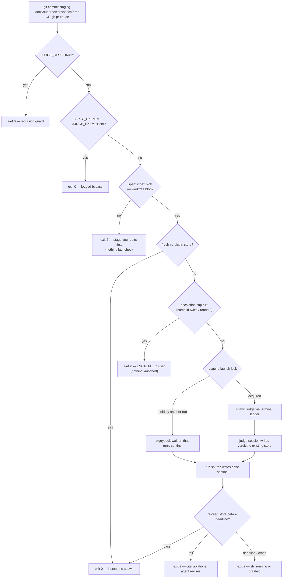
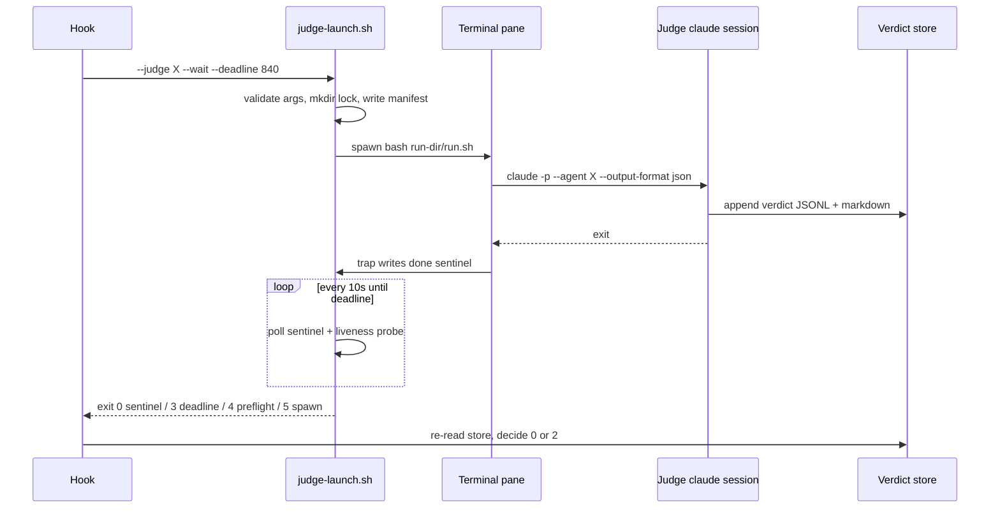
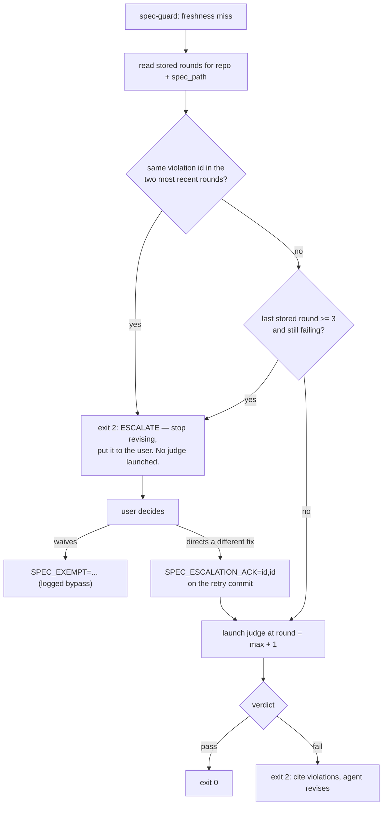

# Spec: Deterministic Judge Enforcement + Per-Judge Terminal Sessions

- **Status:** draft for user review. Design of record: `coding-memory/brainstorms/2026-07-20-judge-terminal-enforcement.md` (§1–§4 approved 2026-07-20).
- **Repo:** `suyatdev/.claude` · **Branch:** `feature/judge-terminal-enforcement`
- **Amends the approved design in two places:** §2's `claude --bare` is dropped (see §4.2), and the
  terminal ladder loses its iTerm2 rung, going from five rungs to four (see §6.1, user decision
  2026-07-20). Both are surfaced here rather than absorbed silently.
- **Round 2 revision** (2026-07-20), addressing round 1's compliance fail (5 violations) and the
  observability advisory (risk=medium, 3 concerns). One further defect was found during the revision
  and is fixed here rather than deferred: the gate and the judge computed `spec_blob_sha` from
  different content, which livelocks the revise loop — see §5.2.
- **Builds on:** ADR-0001 (observability judge), ADR-0003 (compliance judge), ADR-0005 (lock discipline).

This spec is self-contained: an implementer needs nothing but this file and the repo.

---

## 1. Background — why this exists

Both judges are today invoked by *skills*. A skill is guidance the model may skip; the observability
judge is additionally backed by `hooks/judge-guard.sh`, which deterministically blocks `gh pr create`
without a fresh verdict. The compliance judge has **no** such backstop — ADR-0003 deferred it on the
grounds that no script-decidable "the spec is done" moment existed.

Two problems follow:

1. **Asymmetric enforcement.** Spec compliance depends entirely on the model choosing to run the
   judge. The one gate that is genuinely blocking is the one guarding code, not design.
2. **Judges consume the main session.** Run as in-session `Agent`-tool subagents, judge work spends
   the main window's context and token budget, and its progress is invisible except as tool output.

This change resolves both. It also **closes ADR-0003's deferral**: a `git commit` that stages a file
under `docs/superpowers/specs/` *is* the script-decidable spec-done moment.

**Explicit non-goal:** judging every implementation commit. The trigger moments are unchanged in
spirit — compliance at spec-done, observability before a PR. Ordinary code commits stay untouched.

---

## 2. Scope

| In scope | Out of scope |
|---|---|
| `bin/judge-launch.sh` — thin entrypoint, both judges | Changing either judge's rubric or scoring |
| `bin/lib/judge-*.sh` — five focused libs (§6.1) | Changing either **agent definition** (§4.1) |
| `hooks/spec-guard.sh` — new compliance gate | Judging non-spec docs (ADRs, READMEs) |
| `hooks/judge-guard.sh` — miss-branch extension | Replacing the `Agent`-tool path for ad-hoc runs |
| `settings.json` hook registration + timeouts | CI / remote enforcement |
| Both `running-the-*-judge` skills → launcher | Verdict-store schema changes (unchanged, §5) |
| `.gitignore` — `coding-memory/judge-runs/` entry | Multi-repo verdict namespacing (deferred, §11) |
| Test harnesses + falsification | |

---

## 3. Architecture



The gate never trusts terminal output. The pane is a viewport; the **verdict store is the sole
authority**, re-read after the sentinel appears.



---

## 4. Toolchain — pinned

Verified on this machine 2026-07-20. An implementer must not substitute versions.

| Tool | Pinned version | Note |
|---|---|---|
| Claude Code CLI | `2.1.215` | `claude --version` |
| bash | `3.2.57(1)` (`/bin/bash`, arm64-apple-darwin25) | **No bash-4 features** — no associative arrays, no `${v,,}`, no `mapfile` |
| Python | `3.9.6` | JSON + `shlex` parsing, as existing hooks do. No `jq` dependency is introduced |
| tmux | `3.6a` | Only rung that is scriptable in tests |
| git | `2.50.1` | `git rev-parse ":<path>"` for index blob sha |

### 4.1 Judge agents

Both agent definitions already exist and are unchanged:

```yaml
agents:
  compliance-judge:
    path: agents/compliance-judge.md
    tools: [Read, Grep, Glob, Bash, Write]
  observability-judge:
    path: agents/observability-judge.md
    tools: [Read, Grep, Glob, Bash, Write]
```

`--allowed-tools` is pinned to exactly that declared list — the launcher must not widen it.

**"Unchanged" is a constraint on this design, not an observation.** Each definition declares inputs it
requires — compliance: `spec_path`, `round`, a context summary, optional `waived` ids, and on round > 1
the prior round's `violations` array; observability: `stage`, a decisions summary, optional spec path,
test command, base branch. A launcher that cannot supply those is not a drop-in replacement for the
`Agent`-tool path, so §6.1's argument set is designed to carry every one of them (§6.1.2). Likewise
`agents/compliance-judge.md` computes `spec_blob_sha` itself with `git hash-object <spec_path>` — a
**worktree** hash — which the gate reconciles with a precondition rather than an agent edit (§5.2).

### 4.2 The `--bare` amendment [changes the approved design]

The approved §2 specified `claude --bare -p "<prompt>" --agent <judge>`. **`--bare` must not be
used.** Its documented behaviour: *"Anthropic auth is strictly `ANTHROPIC_API_KEY` or `apiKeyHelper`
via `--settings` (OAuth and keychain are never read)."* This machine has neither set and
authenticates by subscription/OAuth, so `--bare` would fail to authenticate; making it work would
bill judge runs as API credits **separate from the subscription**, and would additionally skip
CLAUDE.md auto-discovery that the compliance judge relies on to read live rules.

**Pinned invocation:**

```
claude -p "$(cat prompt.txt)" --agent <judge> --output-format json --allowed-tools <declared list>
```

Consequence, and why the design already covers it: without `--bare`, **hooks do run inside the judge
session**. The `JUDGE_SESSION=1` recursion guard (§6.3) is therefore load-bearing, not
belt-and-braces. Spike S1 (§10) must confirm it before anything else is built.

---

## 5. Data contracts

Both stores keep their **existing schemas unchanged** — freshness keys and the calibration ledger
stay unbroken. Judge sessions write to the same files the `Agent`-tool path writes to.

```yaml
compliance_store:
  path: coding-memory/compliance-judge/verdicts.jsonl
  env_seam: SPEC_VERDICTS_FILE
  keys: [ts, repo, branch, head_sha, spec_path, spec_blob_sha, round,
          verdict, violations, notes, rule_sources_read, waived, confidence, outcome]
  freshness_key:
    match_on: [repo, spec_path, spec_blob_sha]
    require: verdict == "pass"

observability_store:
  path: coding-memory/observability-judge/verdicts.jsonl
  env_seam: JUDGE_VERDICTS_FILE          # already implemented
  keys: [ts, repo, branch, head_sha, stage, dimensions, risk, confidence, concerns, outcome]
  freshness_key:
    match_on: [repo, branch, head_sha]
    require: stage == "implementation"
```

`spec_blob_sha` already exists in the compliance schema — no migration is needed.

**Why the staged blob sha, not the worktree file:** `git rev-parse ":<path>"` returns the **index**
blob — exactly the content the commit will record. Hashing the worktree file instead would let an
unstaged edit pass a gate for content that never ships. Each revision produces a new blob sha, which
forces a new judging round; this is what makes the revise loop terminate honestly.

### 5.2 The two-hash problem, and the precondition that removes it

The gate and the judge do not compute `spec_blob_sha` the same way, and nothing above reconciles them:

| Who | How | Which content |
|---|---|---|
| `spec-guard.sh` (freshness key) | `git rev-parse ":<path>"` | **index** |
| `agents/compliance-judge.md` step 1 | `git hash-object "<spec_path>"` | **worktree** |
| `running-the-compliance-judge` skill (freshness) | `git hash-object <spec_path>` | **worktree** |

When index and worktree agree these are the same 40 characters and everything works. When they
diverge — the agent stages the spec, then edits it again before committing — the failure is not a
missed gate but a **livelock**: the hook looks up the index blob, misses, launches a judge; the judge
reads and records the *worktree* blob; the hook re-reads the store, still misses, and launches again.
Every iteration costs a full judge session. Worse, the judge would be scoring content the commit is
not going to record, which is precisely the substitution the paragraph above rejects.

**Precondition (fail closed).** Before any freshness lookup, `spec-guard.sh` requires the spec's index
blob to equal its worktree blob — `git diff --quiet -- <spec>` **and** `git diff --cached --quiet` is
not the test; the test is `git rev-parse ":<spec>" == git hash-object <spec>`. On mismatch it exits 2
with *"stage your edits to `<spec>` before committing — the gate judges staged content"* and launches
nothing. The agent's fix is one `git add`.

**Why this one check is worth its keep:** it collapses a whole class rather than one bug.

- It makes the judge's existing worktree hash provably equal to the index blob, so **neither agent
  definition needs to change** (§4.1) and the skill's freshness rule stays correct as written.
- `git commit -a` stages tracked modifications *at commit time*, so the committed content is the
  worktree, not the current index — the index-blob key would be reading the wrong side. Under the
  precondition both sides are identical, so `-a` needs no separate handling.
- `git commit -- <path>` commits from the worktree, bypassing the index, with the same resolution.

The precondition is therefore load-bearing for three commit forms, not a tidiness rule, and its
regression test must cover all three (§10).

### 5.1 Run directory

Gitignored (`coding-memory/judge-runs/`) — the stores remain the sole durable record.

**Permission posture — default deny.** A run dir holds the frozen prompt, the judge's full model
output, its stderr, and the launcher's argv. Gitignore governs *committing*, not *reading*, so it is
not a control here. The launcher sets `umask 077` before creating anything and asserts the result:

```
coding-memory/judge-runs/        0700   created by the launcher, never by a rung
coding-memory/judge-runs/<id>/   0700
  every file within                0600   manifest.json, prompt.txt, run.sh, result.json, stderr.log, done
```

`run.sh` is `0600`, never `0700` — every rung invokes it as `bash <run-dir>/run.sh`, so it is read as
data by an interpreter the launcher chose, and is never itself executable. Creation is asserted after
the fact (`stat`-check the mode), not assumed from `umask`: a pre-existing directory with looser modes
would otherwise be inherited silently. A mode assertion failure is a preflight failure (exit 4).

```yaml
run_id: "<UTC ts>-<judge>-<HEAD short sha>-<launcher PID>"   # PID makes parallel launches collision-free
layout:
  coding-memory/judge-runs/<run-id>/:
    manifest.json: "written BEFORE spawn"
    prompt.txt:    "frozen prompt, built from validated args only"
    run.sh:        "the only thing any terminal rung executes"
    result.json:   "claude --output-format json, retains total_cost_usd"
    stderr.log:    "judge stderr; referenced in crash messages"
    done:          "sentinel; contains the judge's exit code"
manifest_fields: [judge, stage_or_spec_path, spec_blob_sha, repo, branch, head_sha,
                  round, waived_ids, ladder_rung, terminal_ref, argv, launcher_pid]
```

---

## 6. Component contracts

### 6.1 The launcher

#### 6.1.1 Decomposition and size budgets

Seven distinct jobs do not belong in one file. The largest hook in this repo today is
`hooks/scan-invisible-unicode.sh` at 211 lines; `judge-guard.sh` is 144. The launcher ships as a thin
entrypoint over five single-purpose libs, each sourced, each with a stated budget:

| File | Job | Budget |
|---|---|---|
| `bin/judge-launch.sh` | arg parse, orchestration, exit-code mapping | ≤ 120 |
| `bin/lib/judge-validate.sh` | argument + path validation, preflight, mode assertions | ≤ 110 |
| `bin/lib/judge-rundir.sh` | run-id, run dir, `manifest.json`, `prompt.txt`, `run.sh` | ≤ 130 |
| `bin/lib/judge-lock.sh` | acquire / stale-break / piggyback / release | ≤ 100 |
| `bin/lib/judge-spawn.sh` | the terminal ladder | ≤ 110 |
| `bin/lib/judge-wait.sh` | sentinel poll, liveness probe, deadline | ≤ 80 |

Budgets are enforced by the test harness, not by convention: `judge-launch.test.sh` fails if any file
exceeds its number. No file approaches the 400-line convention, and the libs are independently
testable — `judge-lock.sh` in particular, whose regression history (ADR-0005) is the reason it is its
own unit rather than a section of a larger script.

#### 6.1.2 Argument contract

```
judge-launch.sh --judge compliance --spec <path> --round <N>
                --context-file <path> [--prior-violations-file <path>]
                [--waived id,id] [--acked id,id] [--wait [--deadline <secs>]]
judge-launch.sh --judge observability --stage architecting|implementation
                --decisions-file <path> [--spec <path>] [--test-cmd-file <path>]
                [--wait [--deadline <secs>]]
```

The `*-file` arguments exist because the judges require inputs that no flag-sized value can carry: the
compliance judge scores YAGNI *against a stated need* and, from round 2, reuses ids from the prior
round's `violations` array; the observability judge scores the **decisions summary** as its trajectory
evidence. Passing these as files rather than as argument text is what keeps §9.2 intact — see §6.1.3.

**Argument validation — fail closed on any miss:**

| Arg | Rule |
|---|---|
| `--spec` | resolves inside repo, matches `docs/superpowers/specs/*.md`, exists in the index, index blob == worktree blob (§5.2) |
| `--stage` | enum: `architecting` \| `implementation` |
| `--round` | numeric, `>= 1` |
| `--waived`, `--acked` | comma-separated, charset `^[A-Za-z0-9_.,-]+$` |
| `--*-file` | resolves inside repo or run dir, exists, regular file (not symlink/FIFO), non-empty, ≤ 64 KiB, UTF-8 decodable |
| run-dir path | launcher-generated, asserted `^[A-Za-z0-9/_.-]+$` before any interpolation |

Only the **paths** are validated; file *contents* are never validated, never parsed, and never reach a
shell — they are copied bytes-for-bytes into `prompt.txt`. The 64 KiB cap is a prompt-budget guard, not
a safety control.

#### 6.1.3 Prompt contract

`prompt.txt` is assembled by `judge-rundir.sh` from a fixed template plus the validated inputs, written
once before spawn, and never regenerated. Sections are delimited by fixed heredoc markers the launcher
emits; interpolated values come only from the validated arg set, and file contents are streamed in
whole.

```
You are judging as the <judge> agent. Inputs follow.

spec_path: <validated --spec>          # compliance only
round: <validated --round>             # compliance only
stage: <validated --stage>             # observability only
base_branch: main
waived: <validated --waived, or "none">

--- BEGIN CONTEXT SUMMARY ---          # verbatim --context-file / --decisions-file
<file contents>
--- END CONTEXT SUMMARY ---

--- BEGIN PRIOR VIOLATIONS (round N-1) ---       # omitted entirely when round == 1
<file contents>
--- END PRIOR VIOLATIONS ---

Follow your agent definition. Persist your verdict before returning.
```

**Why this does not reopen the injection surface §9.2 closed.** The threat model there is untrusted
text becoming *terminal command text* — an AppleScript `do script` argument. Here no rung ever sees the
prompt: rungs execute `bash <run-dir>/run.sh`, and `run.sh` reads the prompt with
`"$(cat "$RUN_DIR/prompt.txt")"`, which is shell-quoted at the point of use. Content that would be
hostile as shell text is inert as file bytes. §9.3 is amended accordingly: prompts are built from the
validated argument set **and the contents of files named by validated paths**, the latter treated
strictly as data.

The residual risk is prompt injection *against the judge* — a context summary that instructs the judge
to pass. This is accepted and bounded: the summary is authored by the same main agent that authored the
spec, so it crosses no trust boundary the spec itself does not already cross, and the judge's output is
constrained by its own definition and persisted where the user reads it. Delimiters are fixed markers
so a summary containing one is visible in `prompt.txt` rather than silently structural.

**Exit codes** (`2` is deliberately unused, reserved so a launcher status can never be mistaken for a
hook's own `exit 2`):

| Code | Meaning | Hook mapping |
|---|---|---|
| 0 | sentinel observed; caller re-reads store | continue to store re-check |
| 1 | usage / validation error | exit 2, "gate misconfigured" |
| 3 | deadline expired, judge still running | exit 2, "still running in `<ref>`" |
| 4 | preflight failed (`claude` absent, agent def missing, run-dir mode assertion) | exit 2, naming the missing piece |
| 5 | spawn failed on every rung | exit 2, "could not start judge" |

**`run.sh` contract** — the indirection that removes the AppleScript injection risk. No rung ever
interpolates a prompt; every rung executes only `bash <run-dir>/run.sh`.

```bash
set -euo pipefail
RUN_DIR=<absolute run-dir>                 # absolute: cwd is the repo root, not the run dir
cd <repo root>                             # judge must resolve repo-relative paths
export JUDGE_SESSION=1
trap 'echo $? > "$RUN_DIR/done"' EXIT      # sentinel on every path, including crash
claude -p "$(cat "$RUN_DIR/prompt.txt")" --agent <judge> --output-format json \
       --allowed-tools <declared list> \
       > "$RUN_DIR/result.json" 2> "$RUN_DIR/stderr.log"
```

Every run-dir path here is **absolute**. `run.sh` deliberately runs with the repo root as its cwd so
the judge resolves repo-relative paths like `docs/superpowers/specs/...`; relative artifact paths
would therefore land in the repo root, not the run dir.

**Terminal ladder** — first available rung wins; the chosen rung is recorded in the manifest:

| # | Detected by | Spawn | Why this rung exists |
|---|---|---|---|
| 1 | `CMUX_WORKSPACE_ID` | cmux pane | The user's primary environment |
| 2 | `TMUX` | `tmux split-window -d` (pane id → `terminal_ref`) | In active use; the only scriptable rung (§10) |
| 3 | `TERM_PROGRAM=Apple_Terminal` | Terminal `do script` via `osascript` | In active use; the only rung when neither multiplexer is running |
| 4 | — (always available) | headless `nohup` (`mode=headless`, `terminal_ref` = PID) | Correctness floor: the gate must work when detection fails |

**Four rungs, not five — and each answers a need the user actually has.** iTerm2 is dropped: the user
does not run it, so a fifth rung would have been speculative surface. The remaining three named rungs
each correspond to a terminal the user works in daily, and rung 4 is not a convenience — it is what
makes S2 (env-var inheritance, §10) a non-blocking spike rather than a blocking one. If detection
silently fails, the judge still runs; only its visibility degrades.

**The `osascript` surface does not go away with iTerm2.** Terminal's `do script` is AppleScript, so
rung 3 keeps the injection surface that §9.2 exists to close, and the `run.sh` indirection stays
load-bearing — justified on the Terminal rung specifically, not on the dropped one. A future change
that removed rung 3 could revisit the indirection; nothing else here can.

**Wait mode:** poll the sentinel every **10s**; deadline default **840s**. On each poll also run a
best-effort liveness probe for the chosen rung (tmux pane still exists / headless PID alive) so a
SIGKILLed pane — which leaves no trap and therefore no sentinel — exits early as
"terminated without completing" rather than burning the full deadline.

**Launch lock** — `mkdir`-atomic, per `judge + repo + target-key`:

- Lock dir holds the owning `run-id` and launcher PID.
- A second caller for the same target **piggyback-waits on the first run's sentinel** instead of
  duplicating the judge.
- Stale-lock break re-verifies its justifier (owner PID actually dead) **immediately before**
  breaking, per ADR-0005. Use `mkdir` where "create or fail" is meant — never `mv`, which nests when
  the destination exists.

### 6.2 `hooks/spec-guard.sh` [new]

PreToolUse / Bash.

**Detection — what is reused and what is new.** Reused from `judge-guard.sh` unchanged: the python
`shlex` split, the leading `rtk` strip, the leading `NAME=VALUE` env-assignment walk, and the anchored
subcommand match. **New code, not reuse:** all git global-option handling. `judge-guard.sh` contains no
`-C` handling whatsoever — it matches a three-token `gh pr create` and never needed any. Describing the
`-C` path as "verbatim" reuse would have sent an implementer looking for a function that does not exist.

That distinction matters because the blast radius changes shape. `gh pr create` is rare; `git commit`
is the most-run command in this repo, so a classifier bug here blocks *all* commits rather than an
occasional PR. Global options are therefore handled explicitly:

| Form | Handling |
|---|---|
| `-C <dir>`, `-c <k=v>`, `--git-dir=<d>`, `--work-tree=<d>`, `--namespace=<n>`, `--exec-path=<p>`, `--config-env=<e>` | Consumed with their value; **passed through** to every `git` the hook itself runs (§5.2's hash comparison and the staged-file listing must target the same repo the commit targets) |
| Flag-only globals (`--no-pager`, `--paginate`, `--bare`, `--literal-pathspecs`, …) | Skipped generically as a leading `-*` token |
| An unrecognized **value-taking** option | Unclassifiable → `exit 0` with a logged warning (see below) |
| First non-option token | Must be exactly `commit`, else `exit 0` |

**Two failure directions, deliberately treated differently.** Infrastructure failure — python absent,
store unreadable — **fails closed** (block), matching judge-guard. *Classification ambiguity* on an
exotic git invocation **fails open with a log line**, because this is a momentum guardrail rather than a
security boundary, and blocking every commit in the repo on an unparseable global option is a worse
outcome than missing one gate. This is the same posture as the accepted chained-command limitation
(`foo && git commit`) in judge-guard and git-guard; it is named in §11 rather than left implicit.

**Fast path — a necessary-condition pre-filter.** Before spawning python at all, the hook checks
whether the raw command string contains the substring `commit`; if not, `exit 0` immediately. A second
PreToolUse/Bash hook would otherwise add a python spawn to *every* Bash tool call. This is safe
specifically because it can only ever *skip* work: no string lacking `commit` can be classified as
`git commit` by the anchored classifier, so the filter removes no block that would otherwise happen.
The distinction is load-bearing — this repo has already shipped a substring bug where the substring
*decided* rather than pre-filtered — so the invariant is stated as a test: **every block decision is
made by the anchored classifier; the substring appears in no decision path.** Past the pre-filter, a
commit staging no `docs/superpowers/specs/*.md` file exits 0 after one `git diff --cached --name-only`.

**Decision order:** `JUDGE_SESSION` → `SPEC_EXEMPT` → staged==worktree precondition (§5.2) → freshness
→ **escalation check** → launch → re-verify.

#### 6.2.1 Round accounting and the escalation cap

`rules/gates.md` requires that persistent violations escalate to the user and are never silently
waived. Today that cap lives in `running-the-compliance-judge`: escalate when the same violation `id`
is cited in two consecutive rounds, or when round 3 completes with anything outstanding. **The whole
premise of this change is that a skill is skippable**, so the deterministic path inherits none of it —
moving the loop into the hook without moving the cap would leave an unbounded loop whose every
iteration costs a full judge session and up to 14 minutes. The cap moves with the loop.

**No new storage is needed.** The compliance store already carries `round` and `violations` per
`spec_blob_sha`, keyed by `repo` + `spec_path`, so attempt history is reconstructible from the file the
hook already reads.

- `round` = `max(stored round for this repo + spec_path) + 1`, and **`1` when the spec has no stored
  verdicts** — the empty case is defined, not inferred.
- Rounds are counted per `spec_path`, deliberately **not** per `spec_blob_sha`: each revision produces
  a new blob, so per-blob counting would reset the cap on every revision and never fire.

**Escalation fires before the launch, not after** — the point is to stop spending judge sessions:



**Releasing an escalation — `SPEC_ESCALATION_ACK=<id,id>`.** Without an escape the cap deadlocks: the
history that triggered escalation is immutable, so every subsequent attempt would re-escalate without
ever launching. The ack is the agent's assertion that *the user has been consulted about these exact
ids*. It is parsed exactly like `SPEC_EXEMPT` (leading env-assignment, value logged to stderr),
suppresses the escalation check for precisely the listed ids, and is **single-use**: it authorises one
launch and is recorded in the run manifest. It is not persisted as state, so if the same id recurs on a
later round the ack is no longer set and the escalation fires again — each escalation costs a fresh
human decision, which is the intended price.

**The ack is deliberately not passed to the judge.** It reaches the manifest and the hook's stderr, but
never `prompt.txt`. Telling a judge "the user has been consulted about `core-conduct/yagni`" is an
invitation to soften on exactly the violation under dispute, and the judge's contract is to score the
spec as it stands. Keeping the ack out of the prompt also keeps §4.1 true: the compliance agent's input
list stays exactly what its definition declares, with no undeclared field to interpret.

An ack is **not** a waiver and must not be used as one: it does not suppress the violation, and the
judge still cites it. Only `SPEC_EXEMPT` bypasses the gate, and only the user supplies it.

**Ownership, stated once:** on the deterministic path the **hook owns the cap**; the skill keeps its own
for `Agent`-tool and ad-hoc runs. They cannot drift apart on history, because both derive it from the
same store — but the thresholds are duplicated in two places, and §10 requires a test asserting they
agree.

On a freshness miss that clears the escalation check: launcher `--wait` → re-read the store → `exit 0`,
or `exit 2` with the stored violations on stderr so the main agent revises and retries.

### 6.3 `hooks/judge-guard.sh` [extended]

Unchanged through detection, `JUDGE_EXEMPT`, and the freshness check. Only the terminal
"no fresh verdict → exit 2" branch changes: it now launches `--stage implementation --wait`,
re-checks, then exits 0 or 2. Adds the `JUDGE_SESSION=1` short-circuit.

### 6.4 Exemptions

**Separate `SPEC_EXEMPT=<reason>`**, parsed exactly like `JUDGE_EXEMPT` (leading env-assignment,
value logged to stderr). Each gate keeps its own key so a bypass stays as narrow as the gate it
opens — per-door keys, not a master key.

Three keys exist and they are not interchangeable. The distinction is what keeps "nothing is waived
silently" true:

| Key | Opens | Who may set it |
|---|---|---|
| `SPEC_EXEMPT=<reason>` | the whole spec gate, once | user only |
| `JUDGE_EXEMPT=<reason>` | the whole PR gate, once | user only |
| `SPEC_ESCALATION_ACK=<ids>` | the escalation cap only, for listed ids, once (§6.2.1) | agent, **after** consulting the user |

`SPEC_ESCALATION_ACK` never suppresses a violation and never allows an unjudged commit — the judge
still runs and still cites. An agent that sets it without having consulted the user has misreported,
which is why its value is logged to stderr where the user sees it.

### 6.5 `settings.json`

Register `spec-guard.sh` on PreToolUse/Bash alongside `judge-guard.sh`. Both judge hooks get an
explicit `"timeout": 900`, with the launcher's `--deadline 840` deliberately **below** it.

**Why the ordering matters:** a hook that hits the harness timeout **fails OPEN** — the tool call
proceeds. If the harness timer fired first, a slow judge would silently *allow* the very commit the
gate exists to block. Our own 840s deadline guarantees the hook exits 2 under its own control first.

**Both halves of that sentence are assumptions, and neither has been measured here — see blocking
spike S3 (§10).** No hook in `settings.json` sets an explicit timeout today; every one runs on the
default, so `900` is unprecedented in this repo. Two things must hold: that the harness honours a
900s hook timeout at all (rather than silently capping it lower), and that a timed-out hook fails open
(rather than blocking, which would be a different but survivable failure). If the harness caps below
840s, the gate fails open **exactly when the judge is slow** — the case it exists for — and it fails
open *silently*, producing a commit that looks judged and never was. That is the worst available
shape, which is why S3 blocks implementation alongside S1 rather than being verified afterwards.

If S3 shows a lower effective cap, the deadline is not simply lowered to fit: a judge that cannot
finish inside the real cap makes the wait-inline model unworkable, and the fallback is to exit 2
immediately on a freshness miss ("judge launched in `<ref>`; re-run the commit when it finishes"),
turning the gate from blocking-and-waiting into blocking-and-retrying. That is a design fork, so it is
resolved by measurement before implementation, not during it.

### 6.6 Skills

Both `running-the-*-judge` skills change "dispatch subagent (Agent tool)" → "run the launcher as a
background Bash task". At spec-done both judges still launch in parallel (two windows); the main
window receives the harness background-task notification on each exit, then reads the stores.

Each skill keeps its own capped loop for the `Agent`-tool and ad-hoc paths, with thresholds identical
to §6.2.1's. `running-the-compliance-judge`'s freshness sentence — *"a verdict is fresh only while its
`spec_blob_sha` matches `git hash-object <spec_path>`"* — stays correct as written **only under §5.2's
staged==worktree precondition**, and the skill gains a sentence saying so.

### 6.7 What the operator sees

A `git commit` that stages a spec can now block for **up to 840 seconds**. That is a real change to the
feel of the most-run command in the repo, and it is stated here rather than discovered:

- **Cache hit (the common case):** no spawn, no wait — the freshness check is a store read.
- **Miss:** the commit blocks while a judge runs in its own visible pane. The main session shows the
  Bash tool call pending; the launcher emits a single stderr line naming the run dir and the pane
  (`terminal_ref`) before it starts polling, so the wait is attributable rather than a hang.
- **Escalation:** no wait at all — the cap fires before the launch, so the slow path is never paid to
  reach a conclusion the user must arbitrate anyway.

The wait is inline and blocking by design: a non-blocking gate on `git commit` is one the agent walks
past, which is the failure this whole change exists to fix. The escape for a genuinely urgent commit is
`SPEC_EXEMPT`, logged.

---

## 7. Scenarios

### Good paths

```gherkin
Scenario: Fresh verdict short-circuits
  Given a pass verdict exists for this spec's staged blob sha
  When the agent runs `git commit` staging that spec
  Then spec-guard exits 0 without spawning anything

Scenario: Miss launches, judge passes, commit proceeds
  Given no verdict exists for the staged blob sha
  When the agent runs `git commit` staging that spec
  Then a judge session starts in its own pane
  And spec-guard waits for the sentinel, re-reads the store, and exits 0

Scenario: Parallel spec-done launches both judges
  Given the skill launches compliance and observability together
  Then each gets its own run-id and its own window
  And neither lock blocks the other, because the target keys differ
```

### Bad paths

```gherkin
Scenario: Judge fails the spec
  Given the judge writes a fail verdict citing two violations
  When spec-guard re-reads the store
  Then it exits 2 with both violations on stderr
  And the commit is blocked so the agent can revise and retry

Scenario: Judge crashes
  Given the judge process dies non-zero
  Then the trap still writes the sentinel with that exit code
  And the hook message says "crashed", points at stderr.log,
    and is distinguishable from "ran and failed the spec"

Scenario: python3 is unavailable
  Then spec-guard cannot classify the command and exits 2 — fail closed

Scenario: The spec has unstaged edits
  Given the spec's index blob differs from its worktree blob
  When the agent runs `git commit` staging that spec
  Then spec-guard exits 2 telling the agent to stage its edits first
  And no judge is launched, because the two hashes would never reconcile

Scenario: The same violation survives the revision meant to fix it
  Given `core-conduct/yagni` was cited in the two most recent stored rounds
  When the agent runs `git commit` staging the revised spec
  Then spec-guard exits 2 with an ESCALATE message naming that id
  And no judge is launched, so no session is spent on a decision the user owns

Scenario: Round 3 completes with anything outstanding
  Given the last stored round is 3 and its verdict is fail
  Then spec-guard escalates on the same terms, whatever the ids are
```

### Edge cases

```gherkin
Scenario: The judge's own session hits the same hook
  Given run.sh exported JUDGE_SESSION=1
  When the judge session runs any git commit
  Then both guards exit 0 immediately, and no judge launches a judge

Scenario: Pane killed with SIGKILL, no trap, no sentinel
  Then the liveness probe reports the pane gone
  And the launcher exits early rather than waiting the full 840s

Scenario: A second commit races the first for the same spec
  Then the second caller finds the lock held
  And waits on the FIRST run's sentinel rather than launching a duplicate

Scenario: Deadline expires with the judge still working
  Then the launcher exits 3 and the hook exits 2 "still running in <ref>"
  And the harness 900s timeout never fires, so the gate never fails open

Scenario: Store is being appended to while the hook reads it
  Then unparseable (mid-append) lines are skipped, not treated as corruption

Scenario: Commit stages a spec AND source files
  Then the spec gate still applies — staging extra files is not an escape hatch

Scenario: Commit stages no spec file
  Then spec-guard exits 0 silently on the fast path

Scenario: The user is consulted and directs a different fix
  Given an escalation fired for `core-conduct/yagni`
  And the user directed a different fix rather than waiving it
  When the agent retries with SPEC_ESCALATION_ACK=core-conduct/yagni
  Then the escalation check is suppressed for that id only
  And a judge launches at round max+1
  And the ack is recorded in the run manifest but absent from prompt.txt

Scenario: An acknowledged violation recurs on a later round
  Given the ack authorised exactly one launch and was not persisted
  When the same id is cited again
  Then spec-guard escalates again, because a fresh human decision is required

Scenario: An ack is used where a waiver was meant
  Given SPEC_ESCALATION_ACK lists an id the judge still cites
  Then the violation is still cited and the commit is still blocked
  And only SPEC_EXEMPT can bypass the gate itself

Scenario: Commit uses -a rather than a staged spec
  Given `git commit -a` will commit worktree content, not the current index
  Then the staged==worktree precondition makes both sides identical
  And the index-blob freshness key is correct without special-casing -a

Scenario: Commit runs against another repo via -C
  When the agent runs `git -C ../other commit`
  Then the hook's own hash comparison and staged-file listing use -C ../other too
  And the gate reasons about the repo the commit actually targets

Scenario: An unrecognized value-taking global option appears
  Then the command is unclassifiable, spec-guard exits 0 and logs a warning
  And the ambiguity is visible rather than silently blocking every commit

Scenario: A Bash command that cannot be a commit
  Given the raw command string contains no "commit" substring
  Then spec-guard exits 0 without spawning python
  And no block decision was made by the substring — only by the anchored classifier
```

---

## 8. Failure matrix

| Failure | Detection | Result |
|---|---|---|
| Judge crash | trap writes sentinel + non-zero code | exit 2, "crashed", cites `stderr.log` |
| Pane SIGKILLed | liveness probe | exit 2 early, "terminated without completing" |
| Deadline hit | 840s timer | exit 2, "still running in `<ref>`" |
| Duplicate launch | `mkdir` lock held | piggyback-wait, no duplicate |
| Stale lock | owner PID dead, re-verified at break time | break, then acquire |
| Spawn failure | rung returns non-zero | fall through ladder toward headless; failures recorded |
| `claude` missing | preflight | exit 4, distinct message |
| Run-dir mode wrong | `stat` assertion after create | exit 4, "run dir not private" |
| Store unreadable | read error | exit 2, fail closed |
| Spec staged ≠ worktree | hash comparison (§5.2) | exit 2, "stage your edits first"; nothing launched |
| Violation survives its fix | same id in two most recent rounds | exit 2 ESCALATE; nothing launched |
| Loop reaches round 3 failing | stored round ≥ 3, verdict fail | exit 2 ESCALATE; nothing launched |
| Exotic git global option | classifier cannot resolve | exit 0 + logged warning (open, by §6.2's stated posture) |
| Harness caps hook timeout < 840s | **S3, unmeasured** | would fail OPEN silently — blocks implementation until measured |

Every path ends in a **closed gate or a clear message — never a hang** — with one exception that is
called out rather than absorbed: an unclassifiable git invocation exits open by design (§6.2), and the
S3 row is a known unknown, not a handled case.

---

## 9. Security invariants

1. **The store is the only authority.** Never parse PASS/FAIL from terminal output.
2. **No interpolation of untrusted text into a terminal command.** Prompts reach the judge only via
   `prompt.txt`; rungs execute only `bash <run-dir>/run.sh`. This is what removes the AppleScript
   injection surface on **rung 3** (Terminal `do script`) — the one rung that still uses `osascript`
   now that iTerm2 is dropped, and therefore the reason the indirection stays (§6.1).
3. **Validated args and validated file paths only.** Prompts are built from the validated argument set
   in §6.1.2 and the *contents* of files named by validated paths, streamed in as data (§6.1.3). Never
   from raw command text. Contents never reach a shell.
4. **Least privilege.** `--allowed-tools` pinned to each agent's declared list.
5. **Fail closed on inability to verify** — missing python, unreadable store, failed mode assertion.
   Distinct from *classification ambiguity*, which fails open with a log line (§6.2); the two are not
   the same failure and are not treated the same way.
6. **Run dirs are default-deny**: `umask 077`, dir `0700`, files `0600`, asserted after creation
   (§5.1). Gitignoring `coding-memory/judge-runs/` governs committing, not reading, and is a
   supplementary control rather than the mechanism.
7. **Every bypass is logged and attributable.** `SPEC_EXEMPT`, `JUDGE_EXEMPT`, and
   `SPEC_ESCALATION_ACK` all write their value to stderr; none is silent and none is persistent.

---

## 10. Testing

New harnesses `hooks/spec-guard.test.sh` and `bin/judge-launch.test.sh`, alongside the existing
`hooks/judge-guard.test.sh`.

**Falsification is mandatory.** Every regression test must be validated by *mutating the code to
re-introduce the bug class* and confirming the test then fails. This branch's history is the reason:
a lock regression test once planted a PID file with a trailing newline — a state the real writer
cannot produce — so re-introducing the bug still passed 44/44. **Lock tests must plant state exactly
as the real writer produces it.**

**Seams:** `SPEC_VERDICTS_FILE`, `JUDGE_VERDICTS_FILE`, `JUDGE_LAUNCH_MODE=headless` (force a rung),
and a fake `claude` injected on `PATH` that writes canned verdicts — enabling full end-to-end runs
with tiny deadlines and zero token cost.

**Integration cases:** block-with-violations, pass→allowed, `JUDGE_SESSION=1` short-circuit,
`SPEC_EXEMPT` logged bypass, deadline expiry, crash-vs-fail distinction, piggyback-wait, staged-blob
vs worktree divergence.

**Cases the round-2 revisions add, each mapped to the scenario it encodes:**

| Case | Asserts |
|---|---|
| Escalation: same id in two most recent rounds | exit 2 ESCALATE **and no judge spawned** (assert on the run-dir count, not just the exit code) |
| Escalation: stored round ≥ 3 still failing | same, independent of ids |
| Ack releases exactly one launch | judge runs; a second attempt without the ack escalates again |
| Ack is not a waiver | violation still cited, commit still blocked |
| Ack never reaches the judge | id present in `manifest.json`, absent from `prompt.txt` |
| Skill/hook threshold agreement | the two-consecutive and round-3 constants match across `spec-guard.sh` and `running-the-compliance-judge` |
| Precondition: unstaged spec edit | exit 2, nothing launched |
| Precondition: `git commit -a` and `git commit -- <path>` | both gated on the same blob as plain `commit` |
| Global options `-C` / `-c` / `--git-dir` / `--work-tree` | consumed **and passed through** to the hook's own git calls |
| Unrecognized value-taking global option | exit 0 + warning logged |
| Pre-filter | no python spawn without the substring; **no block decision reachable from the substring** |
| Run-dir modes | `0700` / `0600` asserted; a pre-loosened dir fails preflight (exit 4) |
| File-arg validation | symlink, FIFO, empty, > 64 KiB, non-UTF-8 each rejected |
| Lib size budgets | every file in §6.1.1 within its stated budget |

**Falsification targets for the new logic.** Per the mandate above, each of these is validated by
re-introducing the bug class: count rounds per `spec_blob_sha` instead of per `spec_path` (cap never
fires); persist the ack (escalation never re-fires); let the substring pre-filter decide a block
(bypass returns); drop `-C` pass-through (hook reasons about the wrong repo). A test that still passes
under its mutation does not count as coverage.

**Spikes — do these first, they gate the design:**

- **S1 [blocking]:** confirm a real `claude -p --agent` run authenticates on subscription auth, and
  that `JUDGE_SESSION=1` exported by `run.sh` reaches the hooks inside the judge session. If the
  guard does not hold, **stop** — without `--bare`, hooks run in the judge session and the design is
  deadlock-shaped.
- **S2 [non-blocking]:** confirm hooks inherit `TMUX` / `TERM_PROGRAM` / `CMUX_WORKSPACE_ID`.
  Undocumented; the headless rung covers a miss, so this bounds visibility, not correctness.
- **S3 [blocking]:** register a hook with `"timeout": 900`, make it sleep past that, and observe
  whether the tool call is **blocked or allowed**. All of §6.5 rests on the answer and no hook in this
  repo has ever set an explicit timeout. Record the measured effective cap. If it is below 840s, take
  the §6.5 fork (blocking-and-retrying) before writing the launcher — not after.

Terminal rungs cmux and Terminal are verified by a manual live checklist recorded in the branch log;
only tmux is scriptable, and no automated test exercises a real judge (the fake `claude` on `PATH`
writes canned verdicts). Both limits are accepted, and both are named in §11 rather than implied by
a green suite.

---

## 11. Deferred

- Multi-repo verdict namespacing (writeup filenames carry no repo component) — revisit if cross-repo
  spec slugs collide.
- Chained-command detection (`foo && git commit`) — accepted limitation, consistent with existing hooks.
- Exotic git global options failing open rather than closed (§6.2) — accepted; revisit if a real
  invocation is ever seen slipping the gate.
- No automated test exercises a real judge; rungs cmux and Terminal rest on a manual checklist (§10).
- A `spec-guard` equivalent for ADRs and READMEs.

## 12. Documentation obligations

- **New ADR** for this decision (class (a), structural).
- **Update ADR-0003** — its "no script-decidable spec-done moment" deferral is resolved here.
- Update `rules/gates.md` (spec-compliance gate becomes hook-enforced) and both judge skills —
  including the freshness sentence in `running-the-compliance-judge` that §5.2's precondition makes
  true (§6.6).
- **Add `coding-memory/judge-runs/` to `.gitignore`** — verified absent as of this revision, and it
  must land *before* any run dir is written, not alongside the launcher.
