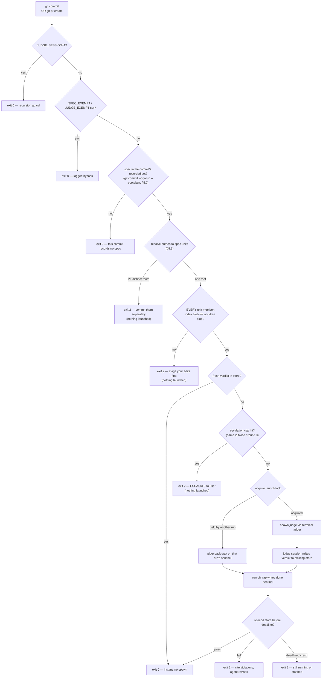
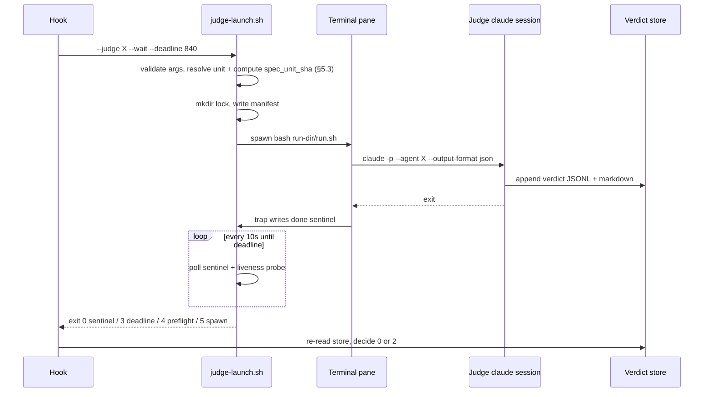

# Spec: Deterministic Judge Enforcement + Per-Judge Terminal Sessions

- **Status:** draft for user review. Design of record: `coding-memory/brainstorms/2026-07-20-judge-terminal-enforcement.md` (§1–§4 approved 2026-07-20).
- **Repo:** `suyatdev/.claude` · **Branch:** `feature/judge-terminal-enforcement`
- **Amends the approved design in two places:** §2's `claude --bare` is dropped (see §4.2), and the
  terminal ladder loses its iTerm2 rung, going from five rungs to four (see §6.1, user decision
  2026-07-20). Both are surfaced here rather than absorbed silently.
- **Round 4 revision** (2026-07-20). Rounds 1–3: five violations cited, four closed, but
  `writing-specs/api-contracts` persisted through all three — the same mistake at three depths
  (interface with no caller → caller with no data source → data with a destination that could not
  yet exist). The escalation rule this spec is about fired on it twice; both times the user directed
  the fix rather than waiving. Nothing here is waived. This round deletes the root cause instead of
  re-sequencing it: no caller provisions prior violations at all — the launcher derives them from
  the store itself (§6.1.2).
- **Two claims in the round 3 text were wrong and are corrected, not quietly patched:** detection
  still enumerated commit forms, and the enumeration leaked a second time — `git commit -i` commits
  staged files past a pathspec-only listing, the same bug class as round 2's `-a` hole, one form
  over. Detection now asks git itself and enumerates nothing (§5.2). And §6.5 claimed no hook in
  `settings.json` sets an explicit timeout; **ten of seventeen do, all at 10s** — which sharpens
  spike S3 rather than softening it (§6.5).
- **Split into two files at user review (2026-07-20).** The single-file revision reached ~1100 lines
  against `core-conduct`'s 800-line ceiling. §11 put the choice to the user rather than deciding it;
  the user chose to split. §6 moved to the companion verbatim, keeping its numbering.
- **Then the split forced a design change, and the design change forced a second move.** Both halves
  match `docs/superpowers/specs/*.md`, so this design's own normal commit became a two-spec commit —
  which the gate had no defined behaviour for, and which per-file freshness keying would have handled
  wrongly (edit one half, the other's verdict still reads fresh). Resolved by user decision to key on
  a **spec unit** (§5.3). That work put this file back over the ceiling, so §7 moved to the companion
  too. **Both halves are now under `core-conduct`'s 800-line maximum** — the invariant, stated instead
  of a line count, because an earlier revision of this sentence carried exact numbers that were
  already stale in the commit that wrote them. Numbers that go stale on the next edit belong in a
  command (`wc -l`), not in prose. The sequence is recorded rather than presented as one clean
  decision, because the second and third steps were consequences of the first that nobody saw coming
  at the time.
- **Builds on:** ADR-0001 (observability judge), ADR-0003 (compliance judge), ADR-0005 (lock discipline).

This spec is the first **spec unit** (§5.3) and declares itself in the format §5.3 defines. The block
is inert until `spec-guard.sh` exists; it is written now so the design's first user is the design
itself:

```yaml
spec_unit:
  parts:
    - docs/superpowers/specs/2026-07-20-judge-terminal-enforcement-contracts.md
```

This spec is self-contained across **two files**: an implementer needs this one, its companion
`2026-07-20-judge-terminal-enforcement-contracts.md` (**§6** component contracts and **§7** scenarios),
and the repo — nothing else. Section numbers are continuous across the pair and were never renumbered,
so every `§6.x` and `§7` reference below resolves in the companion and every other reference resolves
here.

---

## 1. Background — why this exists

Both judges are today invoked by *skills*. A skill is guidance the model may skip; the observability
judge is additionally backed by `hooks/judge-guard.sh`, which deterministically blocks `gh pr create`
without a fresh verdict. The compliance judge has **no** such backstop — ADR-0003 deferred it on the
grounds that no script-decidable "the spec is done" moment existed.

Two problems follow:

1. **Asymmetric enforcement.** Spec compliance depends entirely on the model choosing to run the
   judge. The one gate that is genuinely blocking is the one guarding code, not design.
2. **Judges consume the main session.** Run as in-session `Agent`-tool subagents, judge work spends
   the main window's context and token budget, and its progress is invisible except as tool output.

This change resolves both. It also **closes ADR-0003's deferral**: a `git commit` that records a file
under `docs/superpowers/specs/` *is* the script-decidable spec-done moment.

**Explicit non-goal:** judging every implementation commit. The trigger moments are unchanged in
spirit — compliance at spec-done, observability before a PR. Ordinary code commits stay untouched.

---

## 2. Scope

| In scope | Out of scope |
|---|---|
| `bin/judge-launch.sh` — thin entrypoint, both judges | Changing either judge's rubric or scoring |
| `bin/lib/judge-*.sh` — five focused libs (§6.1) | Changing either judge's **rubric, scoring, or reasoning** |
| `hooks/spec-guard.sh` — new compliance gate | Judging non-spec docs (ADRs, READMEs) |
| `hooks/judge-guard.sh` — miss-branch extension | Replacing the `Agent`-tool path for ad-hoc runs |
| `settings.json` hook registration + timeouts | CI / remote enforcement |
| Both `running-the-*-judge` skills → launcher | Observability store schema (unchanged, §5) |
| `agents/compliance-judge.md` — **two** added declared inputs: `spec_unit_sha` (recorded, never computed) and `unit_members` (read as one artifact) (§4.1) | Any other agent-definition change; the observability agent is untouched |
| Compliance store — **one** additive nullable field, `spec_unit_sha` (§5, §5.3) | Migrating or rewriting existing verdict rows |
| `.gitignore` — `coding-memory/judge-runs/` entry | Multi-repo verdict namespacing (deferred, §11) |
| Test harnesses + falsification | |

---

## 3. Architecture



The gate never trusts terminal output. The pane is a viewport; the **verdict store is the sole
authority**, re-read after the sentinel appears.



---

## 4. Toolchain — pinned

Verified on this machine 2026-07-20. An implementer must not substitute versions.

| Tool | Pinned version | Note |
|---|---|---|
| Claude Code CLI | `2.1.215` | `claude --version` |
| bash | `3.2.57(1)` (`/bin/bash`, arm64-apple-darwin25) | **No bash-4 features** — no associative arrays, no `${v,,}`, no `mapfile` |
| Python | `3.9.6` | JSON + `shlex` parsing, as existing hooks do. No `jq` dependency is introduced |
| tmux | `3.6a` | Only rung that is scriptable in tests |
| cmux | `0.64.20 (100)` (`14e3400b9`) | Ladder rung 1. CLI at `$CMUX_BUNDLED_CLI_PATH`, also on `PATH` |
| git | `2.50.1` | `git rev-parse ":<path>"` for index blob sha |

**cmux sets `TERM_PROGRAM=ghostty`, not `Apple_Terminal`** — it is built on Ghostty. Rung 3's
`TERM_PROGRAM=Apple_Terminal` test therefore cannot false-positive inside cmux, and rung ordering is
not load-bearing for correctness between those two. Verified on this machine 2026-07-20.

### 4.1 Judge agents

Both agent definitions already exist. The observability judge's is unchanged; the compliance judge's
gains **two declared inputs** (§5.3), stated here rather than absorbed:

```yaml
agents:
  compliance-judge:
    path: agents/compliance-judge.md
    tools: [Read, Grep, Glob, Bash, Write]
  observability-judge:
    path: agents/observability-judge.md
    tools: [Read, Grep, Glob, Bash, Write]
```

`--allowed-tools` is pinned to exactly that declared list — the launcher must not widen it.

**"Minimally changed" is a constraint on this design, not an observation.** Each definition declares
inputs it requires — compliance: `spec_path`, `round`, a context summary, optional `waived` ids, and on
round > 1 the prior round's `violations` array; observability: `stage`, a decisions summary, optional
spec path, test command, base branch. A launcher that cannot supply those is not a drop-in replacement
for the `Agent`-tool path, so §6.1's argument set is designed to carry every one of them (§6.1.2).
Likewise `agents/compliance-judge.md` computes `spec_blob_sha` itself with `git hash-object
<spec_path>` — a **worktree** hash — which the gate reconciles with a precondition rather than an agent
edit (§5.2).

**The amendment, and why no design avoids it.** `agents/compliance-judge.md` gains exactly two
declared inputs, and no other change:

| Input | The agent's contract |
|---|---|
| `spec_unit_sha` | **Records it verbatim into its verdict row. Never computes or recomputes it** (§5.3) |
| `unit_members` | Reads every listed path and judges them as **one artifact**; cites file and line within any of them |

*An earlier revision of this section claimed the amendment was a single input while §6.1.3's prompt
contract and §12 both required `unit_members` as well, and §2's scope table barred any second change —
an implementer could not tell whether to declare one input or two. Two it is; the count is now stated
identically in §2, §4.1, §6.1.3 and §12.* Revisions before that claimed both agent definitions were
untouched altogether; the split into two files (see the header note) made that unholdable. Each
correction is recorded rather than quietly kept. Freshness must depend on the content of *every* file in a multi-file spec, or editing one half
leaves the other half's verdict reading fresh. The gate computes freshness from the store, so the store
must carry identity for the whole unit — and the judge, which writes the row, hashes one path and
cannot know a unit exists. Something must carry that value in. The alternatives were the judge
resolving units itself (duplicating resolution in two places) or a sidecar index outside the store
(which would break §9.1, *the store is the only authority*). Passing one launcher-computed value the
agent echoes is the smallest of the three, and the only one that keeps unit resolution in exactly one
place.

### 4.2 The `--bare` amendment [changes the approved design]

The approved §2 specified `claude --bare -p "<prompt>" --agent <judge>`. **`--bare` must not be
used.** Its documented behaviour: *"Anthropic auth is strictly `ANTHROPIC_API_KEY` or `apiKeyHelper`
via `--settings` (OAuth and keychain are never read)."* This machine has neither set and
authenticates by subscription/OAuth, so `--bare` would fail to authenticate; making it work would
bill judge runs as API credits **separate from the subscription**, and would additionally skip
CLAUDE.md auto-discovery that the compliance judge relies on to read live rules.

**Pinned invocation:**

```
claude -p "$(cat prompt.txt)" --agent <judge> --output-format json --allowed-tools <declared list>
```

Consequence, and why the design already covers it: without `--bare`, **hooks do run inside the judge
session**. The `JUDGE_SESSION=1` recursion guard (§6.3) is therefore load-bearing, not
belt-and-braces. Spike S1 (§10) must confirm it before anything else is built.

---

## 5. Data contracts

The observability store's schema is **unchanged**. The compliance store's takes **one additive,
nullable field** (`spec_unit_sha`, §5.3); every existing row stays valid and readable, the calibration
ledger stays unbroken, and a row without the field is read as a standalone single-file spec — which is
what every stored row to date is. Judge sessions write to the same files the `Agent`-tool path writes
to. The addition is additive by design precisely so no migration and no backfill is needed.

```yaml
compliance_store:
  path: coding-memory/compliance-judge/verdicts.jsonl
  env_seam: SPEC_VERDICTS_FILE
  keys: [ts, repo, branch, head_sha, spec_path, spec_blob_sha, spec_unit_sha, round,
          verdict, violations, notes, rule_sources_read, waived, confidence, outcome]
  # spec_unit_sha: NEW, additive, nullable (§5.3).
  #   null / absent -> standalone single-file spec; key on spec_blob_sha exactly as before.
  #   set           -> multi-file spec unit; spec_path is the unit ROOT, and the unit sha
  #                    covers every member, so editing any member invalidates the verdict.
  freshness_key:
    match_on: [repo, spec_path, spec_unit_sha]   # when spec_unit_sha is set
    fallback: [repo, spec_path, spec_blob_sha]   # when it is null/absent — unchanged behaviour
    require: verdict == "pass"

observability_store:
  path: coding-memory/observability-judge/verdicts.jsonl
  env_seam: JUDGE_VERDICTS_FILE          # already implemented
  keys: [ts, repo, branch, head_sha, stage, dimensions, risk, confidence, concerns, outcome]
  freshness_key:
    match_on: [repo, branch, head_sha]
    require: stage == "implementation"
```

`spec_blob_sha` already exists in the compliance schema — no migration is needed.

**Why the staged blob sha, not the worktree file:** `git rev-parse ":<path>"` returns the **index**
blob — exactly the content the commit will record. Hashing the worktree file instead would let an
unstaged edit pass a gate for content that never ships. Each revision produces a new blob sha, which
forces a new judging round; this is what makes the revise loop terminate honestly.

### 5.2 Detection — ask git, then one precondition

**Detection asks git which files the commit will record; it never enumerates commit forms.** Two
revisions of this spec hand-enumerated forms, and the enumeration leaked twice: round 2's staged-only
listing missed `git commit -a` (nothing staged), and round 3's per-form fix missed
`git commit -i -- <path>`, which commits the named paths **plus everything already staged** while a
pathspec-only listing looks the other way. Flag scanning is no sounder — `git commit -ma "x"` parses
as `-m a`, not `-a`. A table that must re-derive git's own argument parser will keep leaking, so the
gate delegates to that parser:

```
git [<global options>] commit --dry-run --porcelain -z <the commit's own args, unchanged>
                       ^^^^^^^^^^^^^^^^^^^^^^^^^^^^^^^ spliced IMMEDIATELY after the `commit` token,
                                                       BEFORE any of the user's arguments
```

**The splice position is load-bearing and is a requirement, not a formatting choice.** The three flags
go immediately after `commit` and before the gated command's own arguments. Appending them instead is
a silent fail-open on the gate's core case — verified on git 2.50.1 with a staged spec:

| Invocation | Result | What the gate would do |
|---|---|---|
| `git commit --dry-run --porcelain -z -- <spec>` (**specified**) | `M  <spec>`, exit 0 | correctly detects the spec |
| `git commit -- <spec> --dry-run --porcelain -z` (appended) | flags consumed as **pathspecs**, exit 1 | routes to the exit-1 "nothing to commit" row → **allows a real spec commit through** |
| `git commit -i -- <spec> --dry-run --porcelain -z` | exit 128 | routes to exit > 1 → false block on a valid commit |

Past `--`, and after any pathspec, git reads further tokens as paths rather than options, so appended
flags never take effect and the gate mistakes their failure for "nothing to commit". An implementer who
follows a sentence describing the flags as merely *added* to the command will build precisely that.
§10 carries this as a falsification target for the same reason.

The gated command's arguments are otherwise unchanged (global options passed through, §6.2), and the
whole thing is re-executed as the **parsed argv list** from the same `shlex` split detection used —
never as re-joined shell text, which would reopen the quoting surface the split closed. Each NUL-delimited
entry is `XY <path>`; column 1 (`X`, the index column) says whether this commit records that path.
**Entries decide first; the exit code is consulted only when no spec entry answers:**

| Dry-run result | Meaning | Gate behaviour |
|---|---|---|
| one or more entries for `docs/superpowers/specs/*.md` with `X` in `M A R C` | commit records new spec content | resolve every such entry to its unit root (§5.3), then continue to the precondition |
| entries resolving to **two or more distinct** unit roots | one commit, several unrelated specs | exit 2 — commit them separately (§5.3) |
| spec entry with `X` = `D` | spec deletion — no new content to judge | exit 0 |
| no spec entry outside `??`/`!!` (untracked/ignored — never recorded), exit 0 **or 1** | commit records no spec; exit 1 means git will itself refuse it as "nothing to commit" — and its output is **not** always empty, because untracked files still print `??` entries | exit 0 |
| spec entry with `X` = `U` (unmerged — a conflicted spec mid-merge/rebase/cherry-pick) | nothing is committable yet; git refuses the real commit itself | exit 0 |
| exit > 1 (usage or repo error) | real error | exit 2 — fail closed |

**The `U` row is load-bearing, not tidiness.** Rebasing a spec branch is routine here, and an
earlier revision of this table had no row for it: `U` is not in the `M A R C` whitelist and not
`??`/`!!`, so a conflicted spec matched nothing and the behaviour was undefined. Routing it into the
record branch would break the precondition itself — verified on git 2.50.1, a `UU` path yields
`git rev-parse ":<path>"` → *"is in the index, but not at stage 0"*, **exit 128**, which the gate
would read as an infrastructure failure and fail closed on, blocking every commit during a conflicted
rebase. Exiting 0 is correct because git refuses an unmerged commit on its own; once the author
resolves and stages, `X` becomes `M` and the gate applies normally.

A rename entry (`R`) carries the **recorded** (new) path; its source path follows as one extra
NUL-terminated field the parser must consume to stay aligned. `-z` also disables C-style path
quoting, so paths compare raw. Verified against real git 2.50.1 on 2026-07-20 — all five forms
re-run this round, plus the untracked and rename cases and both exit-1 shapes (fully clean → exit 1
with empty output; only-untracked → exit 1 with `??` entries — both allow):

| Form (spec staged, `other.txt` modified) | `X` for the spec | recorded |
|---|---|---|
| `git commit` | `M` | yes |
| `git commit -a` | `M` | yes |
| `git commit -- other.txt` | space | no |
| `git commit -i -- other.txt` | `M` | **yes — the hole a form table missed** |
| `git commit --only -- other.txt` | space | no |
| untracked spec, any form | `?` | **no** — `??` must never read as detection |

Safety, measured before adoption (this runs inside every commit that survives §6.2's pre-filter):
the dry-run mutates neither index nor worktree, even on `-a`'s temporary-index path; it launches no
editor when `-m` is absent; and it costs ~10ms in this repo. One deliberate over-block: `--amend`
lists the amended commit's **entire** file set, so amending anything on top of a spec commit
re-triggers the gate — fail-closed, and semantically right, since the amended commit genuinely
re-records that spec blob.

**The two-hash problem, and the one precondition that removes it.** The gate and the judge do not
compute `spec_blob_sha` the same way, and nothing above reconciles them:

| Who | How | Which content |
|---|---|---|
| `spec-guard.sh` (freshness key) | `git rev-parse ":<path>"` | **index** |
| `agents/compliance-judge.md` step 1 | `git hash-object "<spec_path>"` | **worktree** |
| `running-the-compliance-judge` skill (freshness) | `git hash-object <spec_path>` | **worktree** |

When index and worktree agree these are the same 40 characters. When they diverge — the agent stages
the spec, then edits it again before committing — the failure is a **livelock**: the hook looks up
the index blob, misses, launches a judge; the judge records the *worktree* blob; the hook re-reads
the store, still misses, and launches again. Every iteration is a full judge session, spent scoring
content the commit may not even record.

So once detection finds a spec in the recorded set, the gate requires — on **every** commit form, and
for **every member of the resolved unit** rather than only the recorded file (§5.3) — that
`git rev-parse ":<member>"` equal `git hash-object <member>`, and on mismatch exits 2 with *"stage
your edits to `<member>` — the gate needs one unambiguous content hash"*, launching nothing. The fix
is one `git add`. Once the hashes agree, the form stops mattering: whatever content the commit
records *is* the one hash the gate, the judge, and the skill all compute. Extending the precondition
to unstaged *non-recorded* members is deliberate: the unit sha is built from index blobs while the
judge reads the worktree, so a single unstaged companion would reopen the divergence this
precondition closes, one file over. Earlier revisions instead
picked a per-form "effective blob" to spare that `git add`, and the form analysis this required is
where both detection bugs lived. One uniform precondition costs one command and deletes the
analysis.

Neither agent definition changes (§4.1), and the skill's freshness sentence stays correct as written
under this same precondition (§6.6). §10 requires the five forms, the untracked case, and both
caveats tested **against real git** — the form-table claim this section replaces passed review twice
by being read rather than run.

One parsing note, since it is a live ambiguity: `commit`'s own `-c <commit>` (reuse message) is not
git's global `-c <k=v>` (config). The global-option walker stops at the first non-option token, so it
never sees `commit`'s flags, and the two cannot be confused.

### 5.1 Run directory

Gitignored (`coding-memory/judge-runs/`) — the stores remain the sole durable record.

**Permission posture — default deny.** A run dir holds the frozen prompt, the judge's full model
output, its stderr, and the launcher's argv. Gitignore governs *committing*, not *reading*, so it is
not a control here. The launcher sets `umask 077` before creating anything and asserts the result:

```
coding-memory/judge-runs/        0700   created by the launcher, never by a rung
coding-memory/judge-runs/<id>/   0700
  every file within                0600   manifest.json, prompt.txt, run.sh, result.json, stderr.log, done
```

`run.sh` is `0600`, never `0700` — every rung invokes it as `bash <run-dir>/run.sh`, so it is read as
data by an interpreter the launcher chose, and is never itself executable. Creation is asserted after
the fact (`stat`-check the mode), not assumed from `umask`: a pre-existing directory with looser modes
would otherwise be inherited silently. A mode assertion failure is a preflight failure (exit 4).

```yaml
run_id: "<UTC ts>-<judge>-<HEAD short sha>-<launcher PID>"   # PID makes parallel launches collision-free
layout:
  coding-memory/judge-runs/<run-id>/:
    manifest.json: "written BEFORE spawn"
    prompt.txt:    "frozen prompt, built from validated args only"
    run.sh:        "the only thing any terminal rung executes"
    result.json:   "claude --output-format json, retains total_cost_usd"
    stderr.log:    "judge stderr; referenced in crash messages"
    done:          "sentinel; contains the judge's exit code"
manifest_fields: [judge, stage_or_spec_path, spec_blob_sha, spec_unit_sha, unit_members,
                  repo, branch, head_sha, round, waived_ids, ladder_rung, terminal_ref,
                  argv, launcher_pid]
```

### 5.3 Spec units — a spec that spans more than one file

This spec is itself the first instance: it is two files (§6 lives in a companion), and both match
`docs/superpowers/specs/*.md`, so a commit recording the pair puts **two** spec entries in the
recorded set. Keying the gate per file would leave a hole precisely where it matters — edit only the
companion and the root's verdict still reads fresh, because the root's blob never moved. A **unit** is
the fix: one artifact, one round counter, one verdict, one content hash covering every member.

**Declaration is explicit and script-decidable.** Filename-prefix matching was rejected: it is
implicit, and it would silently absorb any future file that happened to share a prefix. Each file
declares its role in a fenced `yaml` block whose top-level key is `spec_unit`.

**Where the parser looks, stated as a rule rather than as "near the top".** *"Near the top" is not
script-decidable, and this very section proves why: the illustrations below are themselves fenced
`yaml` blocks with a top-level `spec_unit:` key, and the second declares `part_of` pointing at this
file. A parser scanning the whole file sees **three** blocks in this root — so the ambiguity row below
(`two or more` → exit 2) fires first and the commit that introduced this design is refused, its
declaration never even classified.* The refusal is the right outcome for an ambiguous file and the
wrong outcome here, since only one of the three is a declaration at all.

*State the mechanism precisely, because a falsification test written to the wrong one passes for the
wrong reason:* the whole-file mutation in §10 must assert **exit 2 on the multi-block row**, not a
bidirectional or depth-1 failure. An earlier revision of this paragraph claimed the root would
"resolve as a companion of itself" and fail those rules — reachable only in a two-block file, which
this is not. So the region is bounded structurally:

> **The declaration is a fenced `yaml` block with a top-level `spec_unit:` key appearing in the
> file's HEADER REGION — strictly before the first `## ` heading. Blocks at or after the first
> `## ` heading are prose and are never parsed.**

**The boundary scan is fence-aware:** a line beginning `## ` *inside* a fenced code block does not end
the header region. Both files here are indifferent (a naive scan and a fence-aware scan agree on them),
so this is specified rather than discovered — a future spec whose header contains a fenced example with
a `## ` line would otherwise have its own declaration fall outside the region and silently resolve as
standalone. §10 asserts the fence-aware reading against a fixture built for it, since neither real file
distinguishes the two.

Both files in this unit satisfy that: each real declaration sits above `## 1.` / `## 6.` respectively,
and §5.3's illustrations sit inside §5, far below the first heading. The rule is structural, not a
convention an author must remember — a declaration written in the body simply does not exist, which
fails toward standalone (visible, ungated) rather than toward a mis-resolved unit.

```yaml
# in the ROOT spec — header region, above the first "## " heading
spec_unit:
  parts:
    - docs/superpowers/specs/2026-07-20-judge-terminal-enforcement-contracts.md
```

```yaml
# in each COMPANION — header region, above the first "## " heading
spec_unit:
  part_of: docs/superpowers/specs/2026-07-20-judge-terminal-enforcement-design.md
```

**Resolution, from any recorded spec path `P`** — read from `P`'s **index** blob, never the worktree,
so resolution sees exactly what the commit records (§5.2's precondition makes the two equal anyway).
The table is total: every input lands on exactly one row, and the malformed rows fail **closed**
rather than falling through to standalone.

| `P`'s header region contains | Unit root | Members |
|---|---|---|
| no `spec_unit` block | `P` | `P` alone — **standalone; behaviour is byte-for-byte what it is today** |
| exactly one block, valid, with `part_of: R` only | `R` | `R` + `R`'s declared `parts` |
| exactly one block, valid, with `parts: [...]` only | `P` | `P` + its `parts` |
| **two or more** `spec_unit` blocks | — | **exit 2** — ambiguous; never first-match or last-match |
| a block that is **not parseable YAML** | — | **exit 2** — never silently treated as absent |
| a block with **neither** `parts` nor `part_of` | — | **exit 2** — a declaration that declares nothing |
| a block with **both** `parts` and `part_of` | — | **exit 2** — a file cannot be root and part at once |

The last four rows exist because the earlier revision of this table had only three rows and no
`otherwise` case, so every malformed declaration fell through to the standalone row — **fail-open, in
a section whose stated posture is fail-closed.** Both judges cited it independently.

**Validation — every one of these fails closed (exit 2), because a half-resolved unit is worse than a
refused commit:**

- **Bidirectional consistency — checked in both directions, not one.** If `P` declares `part_of: R`,
  then `R` must declare `P` in its `parts`; **and** every path in a root's `parts` must declare
  `part_of` pointing back at that root. A companion pointing at a root that does not claim it, and a
  root claiming a file that does not claim it back, are both broken units rather than units. The
  earlier wording stated only the first direction while calling itself bidirectional.
- **Depth 1 only.** A file listed in `parts` must not itself declare `parts`. This makes resolution
  terminate by construction and makes cycles unrepresentable rather than merely detected.
- Every member path must match `docs/superpowers/specs/*.md`, resolve inside the repo, and exist in
  the index.
- Every member must satisfy §5.2's `index == worktree` precondition — **not just the recorded one**.
  The unit sha is computed from index blobs while the judge reads the worktree, so one unstaged member
  reopens the two-hash divergence §5.2 exists to close, one file over.

**Unit sha — deterministic, order-independent:**

```
spec_unit_sha = git hash-object --stdin  <<  "<path> <index blob sha>\n" for each member,
                                             members sorted by path
```

Sorted by path, not declaration order, so reordering the `parts:` list cannot change the hash. Any
member's content change changes its blob, changes the digest input, and invalidates the verdict —
which is the whole point. **A standalone spec sets `spec_unit_sha: null`** and keys on
`spec_blob_sha` exactly as before; the field is only populated for units of more than one member, so
no existing spec and no stored row changes meaning.

**A commit recording two *different* units is refused** — exit 2, naming both roots, nothing
launched. Same-unit multi-file commits (this design's normal path) resolve to one root and judge
once. Distinct units in one commit would force either N judge sessions behind a single blocking
`git commit` or an arbitrary pick of which to judge; refusing is honest, and splitting the commit
costs the author one extra command. `--spec` therefore stays singular: it is always the unit root.

---

## 6. Component contracts

**Moved to a companion file:** `2026-07-20-judge-terminal-enforcement-contracts.md`.

That file carries §6 in full and keeps its original numbering — §6.1 the launcher (decomposition and
size budgets, argument contract, prompt contract, exit codes, `run.sh`, terminal ladder, wait mode,
launch lock), §6.2 `hooks/spec-guard.sh` (detection, argument population, round accounting and the
escalation cap), §6.3 `hooks/judge-guard.sh`, §6.4 exemptions, §6.5 `settings.json`, §6.6 skills, and
§6.7 what the operator sees. Every `§6.x` reference elsewhere in this spec resolves there.

An implementer needs both files.

---

## 7. Scenarios

**Moved to the companion file** alongside §6, for the same reason: the spec-unit model added ~170
lines to this file and put it back over the ceiling the first split existed to respect. The scenarios
are the behavioural acceptance criteria an implementer works against, so they live with the component
contracts rather than apart from them. Numbering is unchanged — `§7` still means §7.

---

## 8. Failure matrix

| Failure | Detection | Result |
|---|---|---|
| Judge crash | trap writes sentinel + non-zero code | exit 2, "crashed", cites `stderr.log` |
| Pane SIGKILLed | liveness probe | exit 2 early, "terminated without completing" |
| Deadline hit | 840s timer | exit 2, "still running in `<ref>`" |
| Duplicate launch | `mkdir` lock held | piggyback-wait, no duplicate |
| Stale lock | owner PID dead, re-verified at break time | break, then acquire |
| Spawn failure | rung returns non-zero | fall through ladder toward headless; failures recorded |
| `claude` missing | preflight | exit 4, distinct message |
| Run-dir mode wrong | `stat` assertion after create | exit 4, "run dir not private" |
| Store unreadable | read error | exit 2, fail closed |
| Spec in recorded set, index ≠ worktree (any form) | universal precondition (§5.2) | exit 2, "stage your edits"; nothing launched |
| Unit member unstaged, though not itself recorded | precondition extended to all members (§5.3) | exit 2 naming that member; nothing launched |
| Companion declares `part_of` a root that omits it | bidirectional consistency check (§5.3) | exit 2, "broken spec unit"; nothing launched |
| A `parts` member itself declares `parts` | depth-1 rule (§5.3) | exit 2 — nesting is unrepresentable, not merely detected |
| `--spec` given a companion rather than a root | unit-root validation (§6.1.2) | exit 1, naming the root to pass instead |
| Commit records two distinct unit roots | unit resolution (§5.3) | exit 2, both roots named; commit them separately |
| Companion edited, root untouched | unit sha covers all members (§5.3) | verdict correctly reads **stale**; re-judged — the hole units exist to close |
| Spec committed via `-a` / `-i` / pathspec / `--amend` | dry-run set-resolution (§5.2) | gate applies iff the spec is in the recorded set |
| Dry-run exits 1 (no recorded spec entry; output may hold `??` noise) | nothing to commit (§5.2) | exit 0 — git refuses the real commit anyway |
| Violation survives its fix | same id in two most recent rounds | exit 2 ESCALATE; nothing launched |
| Loop reaches round 3 failing | stored round ≥ 3, verdict fail | exit 2 ESCALATE; nothing launched |
| Exotic git global option | classifier cannot resolve | exit 0 + logged warning (open, by §6.2's stated posture) |
| Harness caps hook timeout < 840s | **S3, unmeasured** | would fail OPEN silently — blocks implementation until measured |

Every path ends in a **closed gate or a clear message — never an unbounded hang** — with three
exceptions called out rather than absorbed: an unclassifiable git invocation exits open by design
(§6.2); the S3 row is a known unknown, not a handled case; and **"never a hang" is bounded, not
instant, on ladder rung 3.** Terminal's `do script` has no liveness probe (§6.1), so a pane killed
there produces no sentinel and no early exit — the launcher waits the full 840s before reporting.
Rungs 1, 2 and 4 detect it in one poll. The earlier unqualified "never a hang" read as though every
rung failed fast; only three of the four do.

---

## 9. Security invariants

1. **The store is the only authority.** Never parse PASS/FAIL from terminal output.
2. **No interpolation of untrusted text into a terminal command.** Prompts reach the judge only via
   `prompt.txt`; rungs execute only `bash <run-dir>/run.sh`. This is what removes the AppleScript
   injection surface on **rung 3** (Terminal `do script`) — the one rung that still uses `osascript`
   now that iTerm2 is dropped, and therefore the reason the indirection stays (§6.1).
3. **Validated args and validated file paths only.** Prompts are built from the validated argument set
   in §6.1.2 and the *contents* of files named by validated paths, streamed in as data (§6.1.3). Never
   from raw command text. Contents never reach a shell.
4. **Least privilege.** `--allowed-tools` pinned to each agent's declared list.
5. **Fail closed on inability to verify** — missing python, unreadable store, failed mode assertion.
   Distinct from *classification ambiguity*, which fails open with a log line (§6.2); the two are not
   the same failure and are not treated the same way.
6. **Run dirs are default-deny**: `umask 077`, dir `0700`, files `0600`, asserted after creation
   (§5.1). Gitignoring `coding-memory/judge-runs/` governs committing, not reading, and is a
   supplementary control rather than the mechanism.
7. **Every bypass is logged and attributable.** `SPEC_EXEMPT`, `JUDGE_EXEMPT`, and
   `SPEC_ESCALATION_ACK` all write their value to stderr; none is silent and none is persistent.

---

## 10. Testing

New harnesses `hooks/spec-guard.test.sh` and `bin/judge-launch.test.sh`, alongside the existing
`hooks/judge-guard.test.sh`.

**Falsification is mandatory.** Every regression test must be validated by *mutating the code to
re-introduce the bug class* and confirming the test then fails. This branch's history is the reason:
a lock regression test once planted a PID file with a trailing newline — a state the real writer
cannot produce — so re-introducing the bug still passed 44/44. **Lock tests must plant state exactly
as the real writer produces it.**

**Seams:** `SPEC_VERDICTS_FILE`, `JUDGE_VERDICTS_FILE`, `JUDGE_LAUNCH_MODE=headless` (force a rung),
and a fake `claude` injected on `PATH` that writes canned verdicts — enabling full end-to-end runs
with tiny deadlines and zero token cost.

**Integration cases:** block-with-violations, pass→allowed, `JUDGE_SESSION=1` short-circuit,
`SPEC_EXEMPT` logged bypass, deadline expiry, crash-vs-fail distinction, piggyback-wait, staged-blob
vs worktree divergence.

**Cases the revision rounds added, each mapped to the scenario it encodes:**

| Case | Asserts |
|---|---|
| Escalation: same id in two most recent rounds | exit 2 ESCALATE **and no judge spawned** (assert on the run-dir count, not just the exit code) |
| Escalation: stored round ≥ 3 still failing | same, independent of ids |
| Ack releases exactly one launch | judge runs; a second attempt without the ack escalates again |
| Ack is not a waiver | violation still cited, commit still blocked |
| Ack never reaches the judge | id present in `manifest.json`, absent from `prompt.txt` |
| Skill/hook threshold agreement | the two-consecutive and round-3 constants match across `spec-guard.sh` and `running-the-compliance-judge` |
| Precondition: spec in recorded set, index ≠ worktree | exit 2, nothing launched — asserted on `-a` and pathspec forms too, not just plain `commit` |
| **Dry-run set resolution: all five §5.2 forms + untracked + rename** | recorded set matches §5.2's evidence table exactly; `??` never reads as detection; **written against real git**, not against the table — two form-table claims passed review by being read rather than run |
| Dry-run caveats | exit 1 allows on both shapes (empty output, and `??`-only output from an untracked-only tree); `--amend` atop a spec commit re-triggers the gate |
| Prior violations launcher-derived | a `--round 2` launch with **no** file flags still carries round 1's array in `prompt.txt`; an explicit `--prior-violations-file` override wins |
| Context/decisions fallback | with no `--context-file`, `prompt.txt` contains the fixed instruction, not an empty section |
| Ack releases the round-3 branch | escalation with no cited ids is released by a set ack |
| Global options `-C` / `-c` / `--git-dir` / `--work-tree` | consumed **and passed through** to the hook's own git calls |
| Unrecognized value-taking global option | exit 0 + warning logged |
| Pre-filter | no python spawn without the substring; **no block decision reachable from the substring** |
| Run-dir modes | `0700` / `0600` asserted; a pre-loosened dir fails preflight (exit 4) |
| File-arg validation | symlink, FIFO, empty, > 64 KiB, non-UTF-8 each rejected |
| Lib size budgets | every file in §6.1.1 within its stated budget |
| **Unit: companion-only edit invalidates the verdict** | a pass stored for the unit, then an edit to the companion alone → freshness **misses** and a judge relaunches. The single highest-value case here: it is the exact hole the split opened, and a per-file key passes every other unit test while failing this one |
| Unit: resolution from either end | resolving from the root and from the companion yield the same root, members, and `spec_unit_sha` |
| Unit: sha is order-independent | reordering `parts:` leaves `spec_unit_sha` unchanged; editing any member changes it |
| Unit: standalone specs unchanged | a single-file spec stores `spec_unit_sha: null` and keys on `spec_blob_sha` — asserted against a **pre-existing stored row**, so the additive field is proven backward-compatible rather than assumed |
| Unit: precondition spans members | unstaged companion → exit 2 naming it, even when the commit records only the root |
| Unit: malformed declarations | one-sided `part_of` **in either direction**, nested `parts` (depth-1), member outside `docs/superpowers/specs/*.md`, member absent from the index — each exits 2, nothing launched |
| **Unit: declaration block selection** | **written against these two spec files themselves.** Only the header-region block counts; §5.3's illustrative blocks — including the one declaring `part_of` the file that contains it — are ignored, and this spec resolves as a root. Two header blocks, unparseable YAML, neither key, and both keys each exit 2 rather than falling through to standalone |
| **Flag-splice position** | the three dry-run flags spliced **after `commit`, before the user's args**. Assert the appended ordering is *not* what ships: with a staged spec, appending yields exit 1 (flags eaten as pathspecs) which the exit-1 row would **allow** — a real spec commit through the gate |
| Unit: `U` unmerged spec | a conflicted spec mid-rebase exits 0; asserted **against a real conflicted repo**, since `git rev-parse ":<path>"` exits 128 on unmerged paths and the wrong routing would fail closed on every commit during a rebase |
| Unit: header-region scan is fence-aware | a **purpose-built fixture** whose header contains a fenced example with a `## ` line inside it — the declaration below that fence must still be found. Neither real spec file distinguishes fence-aware from naive, so only a fixture can assert it |
| Unit: two distinct roots in one commit | exit 2 naming both; **no judge spawned** (assert on run-dir count) |
| Unit: `--spec <companion>` rejected | exit 1 naming the root, rather than judging a fragment |
| Unit: one round counter | rounds increment per unit root across commits that touch different members |
| Unit: judge records but never computes | `spec_unit_sha` in the verdict row equals the launcher's manifest value bit-for-bit |

**Falsification targets for the new logic.** Per the mandate above, each of these is validated by
re-introducing the bug class: count rounds per `spec_blob_sha` instead of per `spec_path` (cap never
fires); persist the ack (escalation never re-fires); let the substring pre-filter decide a block
(bypass returns); drop `-C` pass-through (hook reasons about the wrong repo); **make the launcher
skip the store extraction** (ids drift, persistence reads as novelty, the cap silently no-ops);
**replace the dry-run with a staged-only listing** (`git commit -am` walks through the gate) **or
with a hand-written form table** (`git commit -i -- <path>` walks a staged spec through);
**key freshness on `spec_blob_sha` instead of `spec_unit_sha`** (a companion-only edit keeps a stale
pass reading fresh — the split's hole, restored); **count rounds per member instead of per unit root**
(a violation persisting across both halves splits across two counters and the cap never fires);
**let the judge recompute `spec_unit_sha` rather than echo it** (resolution in two places, and the
row stops matching the lookup the moment the two rules disagree); **scan the whole file for
`spec_unit` blocks instead of the header region only** — this root then presents **three** blocks and
exits 2 on the *multi-block ambiguity row*, refusing the commit that introduced this design; assert
that row specifically, since a test written against a bidirectional or depth-1 failure would assert an
unreachable branch and pass for the wrong reason; **route a malformed declaration to the standalone row
instead of exit 2** (fail-open in a fail-closed section); **route `U` into the record branch**
(`git rev-parse ":<path>"` exits 128, the gate reads infrastructure failure, and every commit during a
conflicted rebase is blocked); **append the dry-run flags instead of splicing them after `commit`**
(they are consumed as pathspecs, the run exits 1, and the exit-1 row lets a real spec commit through —
silent fail-open on the gate's core case).
A test that still passes under its mutation does not count as coverage.

The detection mutations matter most: the `-a` and `-i` holes were each *present in a reviewed
revision of this spec*, and each was found only by running git — never by reading.

**Spikes — do these first, they gate the design:**

- **S1 [blocking]:** confirm a real `claude -p --agent` run authenticates on subscription auth, and
  that `JUDGE_SESSION=1` exported by `run.sh` reaches the hooks inside the judge session. If the
  guard does not hold, **stop** — without `--bare`, hooks run in the judge session and the design is
  deadlock-shaped.
- **S2 [non-blocking]:** confirm hooks inherit `TMUX` / `TERM_PROGRAM` / `CMUX_WORKSPACE_ID`.
  Undocumented; the headless rung covers a miss, so this bounds visibility, not correctness.
  *Partial evidence, not a result:* a Bash **tool call** in this session does see `CMUX_WORKSPACE_ID`,
  `CMUX_BUNDLED_CLI_PATH` and `TERM_PROGRAM=ghostty` (observed 2026-07-20). A tool call's environment
  is not proven identical to a hook's, so this raises the prior and does not close the spike — the
  measurement is still owed.
- **S3 [blocking]:** register a hook with `"timeout": 900`, make it sleep past that, and observe
  whether the tool call is **blocked or allowed**. All of §6.5 rests on the answer, and the only
  observed precedent is the 10s timeouts §6.5 cites — nothing between 10 and 900 has ever been tried
  here. Record the measured effective cap. If it is below 840s, take
  the §6.5 fork (blocking-and-retrying) before writing the launcher — not after.

Terminal rungs cmux and Terminal are verified by a manual live checklist recorded in the branch log;
only tmux is scriptable, and no automated test exercises a real judge (the fake `claude` on `PATH`
writes canned verdicts). Both limits are accepted, and both are named in §11 rather than implied by
a green suite.

---

## 11. Deferred

- Multi-repo verdict namespacing (writeup filenames carry no repo component) — revisit if cross-repo
  spec slugs collide.
- Chained-command detection (`foo && git commit`) — accepted limitation, consistent with existing hooks.
- Exotic git global options failing open rather than closed (§6.2) — accepted; revisit if a real
  invocation is ever seen slipping the gate.
- **Enforcing the provenance of `SPEC_ESCALATION_ACK`** (§6.4). The hook cannot distinguish a
  user-authorised ack from an agent-fabricated one, so the release is advisory and audited rather than
  prevented. Closing this needs provenance the hook does not have; revisit if the audit trail ever
  shows an ack that no user decision backs.
- **Round counting resets on a spec rename**, because rounds key on `spec_path`. A rename mid-loop
  restarts the count at 1 and clears the cap. Accepted: renames are rare and visible in the store's
  history; keying on content instead would defeat the cap entirely (§6.2.2).
- No automated test exercises a real judge; rungs cmux and Terminal rest on a manual checklist (§10).
- A `spec-guard` equivalent for ADRs and READMEs.
- **The 800-line ceiling — RESOLVED at user review (2026-07-20): split.** The single-file revision
  ran ~1100 lines. Earlier revisions argued for keeping it whole on self-containment grounds; the
  user chose the ceiling over that argument. §6 moved to
  `2026-07-20-judge-terminal-enforcement-contracts.md` verbatim, numbering untouched; §7 followed when
  the spec-unit work pushed the root back over. **Both halves are under the 800 maximum** — the
  invariant rather than a line count, for the reason the header now states. *An earlier revision of
  this bullet claimed "657 and 472 lines", a pair matching no commit that ever existed, in a document
  that had just declared measured numbers belong in `wc -l` rather than prose.* Self-containment is now
  a property of the pair, stated as such at the top rather than quietly dropped.
- **Multi-file specs — RESOLVED at user review (2026-07-20): key the gate on a spec *unit*** (§5.3).
  The split made this design's own normal commit a two-spec commit, and per-file keying would have
  left a stale-pass hole: edit the companion, and the root's verdict still reads fresh. A unit is one
  root, one round counter, one `spec_unit_sha` covering every member. Rejected alternatives: a
  per-recorded-spec loop (N judge sessions behind one blocking `git commit`, and the cap still splits
  across counters) and refusing all multi-spec commits (which would have made this design's own normal
  commit illegal). Distinct units in one commit are still refused — that case is rare, and splitting
  the commit costs one command.

  **What it cost, recorded rather than buried:** two invariants this spec held for four rounds are now
  amended rather than quietly kept — §4.1's "agent definitions unchanged" (the compliance judge gains
  one declared input, which it records and never computes) and §5's "schemas unchanged" (one additive
  nullable field). Both were unavoidable: freshness must depend on every member's content, the gate
  reads freshness from the store, and the judge that writes the row hashes one path and cannot know a
  unit exists. The two ways to dodge an agent change were worse — the judge resolving units itself
  puts resolution in two places, and a sidecar index outside the store breaks §9.1.
- **Unit membership is trusted from the declaration, not verified against intent.** Nothing stops a
  spec declaring a `parts` list that omits a file it depends on; the gate checks that declared members
  are consistent, in-repo and staged, not that the declaration is *complete*. Completeness is an
  authoring property, and the failure is visible rather than silent — an omitted file is simply
  ungated. Revisit if a real spec is ever found under-declaring.

## 12. Documentation obligations

- **New ADR** for this decision (class (a), structural). It must cover the **spec-unit** model (§5.3)
  as its own recorded decision: it amends two invariants (§4.1, §5) that four judge rounds were scored
  against, so the rationale belongs somewhere immutable rather than only in a spec that keeps being
  revised.
- **Update ADR-0003** — its "no script-decidable spec-done moment" deferral is resolved here.
- **Amend `agents/compliance-judge.md`** — exactly **two** added declared inputs: `spec_unit_sha`
  (recorded verbatim into the verdict row, never recomputed) and `unit_members` (every listed path read
  as one artifact) (§4.1, §6.1.3). This is the only agent-definition change in the design and must not
  grow past those two.
- Update `rules/gates.md` (spec-compliance gate becomes hook-enforced) and both judge skills —
  including the freshness sentence in `running-the-compliance-judge` that §5.2's precondition makes
  true (§6.6).
- **Add `coding-memory/judge-runs/` to `.gitignore`** — verified absent as of this revision, and it
  must land *before* any run dir is written, not alongside the launcher.
