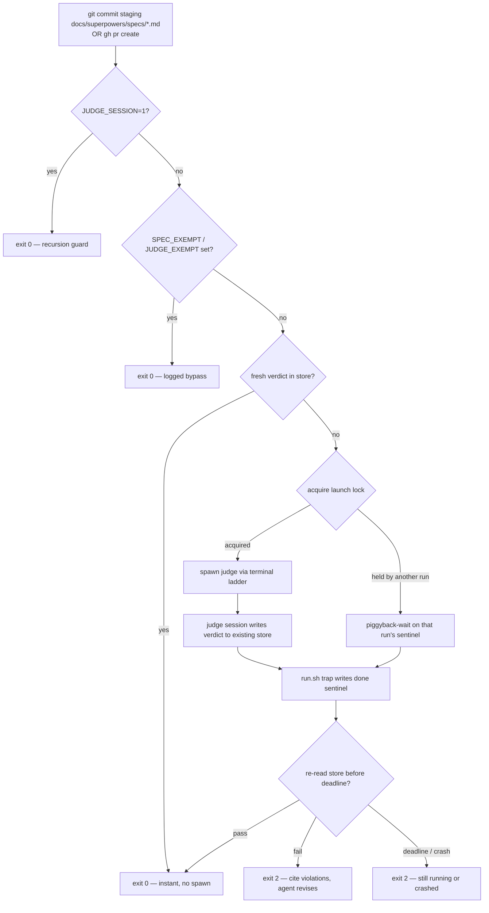
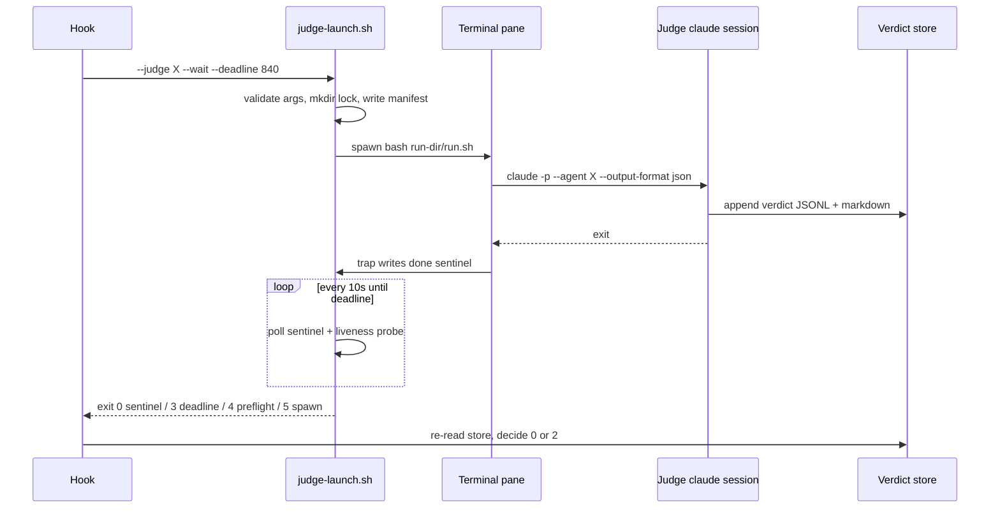

# Spec: Deterministic Judge Enforcement + Per-Judge Terminal Sessions

- **Status:** draft for user review. Design of record: `coding-memory/brainstorms/2026-07-20-judge-terminal-enforcement.md` (§1–§4 approved 2026-07-20).
- **Repo:** `suyatdev/.claude` · **Branch:** `feature/judge-terminal-enforcement`
- **Amends the approved design in one place:** §2's `claude --bare` is dropped. See §4.2.
- **Builds on:** ADR-0001 (observability judge), ADR-0003 (compliance judge), ADR-0005 (lock discipline).

This spec is self-contained: an implementer needs nothing but this file and the repo.

---

## 1. Background — why this exists

Both judges are today invoked by *skills*. A skill is guidance the model may skip; the observability
judge is additionally backed by `hooks/judge-guard.sh`, which deterministically blocks `gh pr create`
without a fresh verdict. The compliance judge has **no** such backstop — ADR-0003 deferred it on the
grounds that no script-decidable "the spec is done" moment existed.

Two problems follow:

1. **Asymmetric enforcement.** Spec compliance depends entirely on the model choosing to run the
   judge. The one gate that is genuinely blocking is the one guarding code, not design.
2. **Judges consume the main session.** Run as in-session `Agent`-tool subagents, judge work spends
   the main window's context and token budget, and its progress is invisible except as tool output.

This change resolves both. It also **closes ADR-0003's deferral**: a `git commit` that stages a file
under `docs/superpowers/specs/` *is* the script-decidable spec-done moment.

**Explicit non-goal:** judging every implementation commit. The trigger moments are unchanged in
spirit — compliance at spec-done, observability before a PR. Ordinary code commits stay untouched.

---

## 2. Scope

| In scope | Out of scope |
|---|---|
| `bin/judge-launch.sh` — one launcher, both judges | Changing either judge's rubric or scoring |
| `hooks/spec-guard.sh` — new compliance gate | Judging non-spec docs (ADRs, READMEs) |
| `hooks/judge-guard.sh` — miss-branch extension | Replacing the `Agent`-tool path for ad-hoc runs |
| `settings.json` hook registration + timeouts | CI / remote enforcement |
| Both `running-the-*-judge` skills → launcher | Verdict-store schema changes (unchanged, §5) |
| Test harnesses + falsification | Multi-repo verdict namespacing (deferred, §11) |

---

## 3. Architecture



The gate never trusts terminal output. The pane is a viewport; the **verdict store is the sole
authority**, re-read after the sentinel appears.



---

## 4. Toolchain — pinned

Verified on this machine 2026-07-20. An implementer must not substitute versions.

| Tool | Pinned version | Note |
|---|---|---|
| Claude Code CLI | `2.1.215` | `claude --version` |
| bash | `3.2.57(1)` (`/bin/bash`, arm64-apple-darwin25) | **No bash-4 features** — no associative arrays, no `${v,,}`, no `mapfile` |
| Python | `3.9.6` | JSON + `shlex` parsing, as existing hooks do. No `jq` dependency is introduced |
| tmux | `3.6a` | Only rung that is scriptable in tests |
| git | `2.50.1` | `git rev-parse ":<path>"` for index blob sha |

### 4.1 Judge agents

Both agent definitions already exist and are unchanged:

```yaml
agents:
  compliance-judge:
    path: agents/compliance-judge.md
    tools: [Read, Grep, Glob, Bash, Write]
  observability-judge:
    path: agents/observability-judge.md
    tools: [Read, Grep, Glob, Bash, Write]
```

`--allowed-tools` is pinned to exactly that declared list — the launcher must not widen it.

### 4.2 The `--bare` amendment [changes the approved design]

The approved §2 specified `claude --bare -p "<prompt>" --agent <judge>`. **`--bare` must not be
used.** Its documented behaviour: *"Anthropic auth is strictly `ANTHROPIC_API_KEY` or `apiKeyHelper`
via `--settings` (OAuth and keychain are never read)."* This machine has neither set and
authenticates by subscription/OAuth, so `--bare` would fail to authenticate; making it work would
bill judge runs as API credits **separate from the subscription**, and would additionally skip
CLAUDE.md auto-discovery that the compliance judge relies on to read live rules.

**Pinned invocation:**

```
claude -p "$(cat prompt.txt)" --agent <judge> --output-format json --allowed-tools <declared list>
```

Consequence, and why the design already covers it: without `--bare`, **hooks do run inside the judge
session**. The `JUDGE_SESSION=1` recursion guard (§6.3) is therefore load-bearing, not
belt-and-braces. Spike S1 (§10) must confirm it before anything else is built.

---

## 5. Data contracts

Both stores keep their **existing schemas unchanged** — freshness keys and the calibration ledger
stay unbroken. Judge sessions write to the same files the `Agent`-tool path writes to.

```yaml
compliance_store:
  path: coding-memory/compliance-judge/verdicts.jsonl
  env_seam: SPEC_VERDICTS_FILE
  keys: [ts, repo, branch, head_sha, spec_path, spec_blob_sha, round,
          verdict, violations, notes, rule_sources_read, waived, confidence, outcome]
  freshness_key:
    match_on: [repo, spec_path, spec_blob_sha]
    require: verdict == "pass"

observability_store:
  path: coding-memory/observability-judge/verdicts.jsonl
  env_seam: JUDGE_VERDICTS_FILE          # already implemented
  keys: [ts, repo, branch, head_sha, stage, dimensions, risk, confidence, concerns, outcome]
  freshness_key:
    match_on: [repo, branch, head_sha]
    require: stage == "implementation"
```

`spec_blob_sha` already exists in the compliance schema — no migration is needed.

**Why the staged blob sha, not the worktree file:** `git rev-parse ":<path>"` returns the **index**
blob — exactly the content the commit will record. Hashing the worktree file instead would let an
unstaged edit pass a gate for content that never ships. Each revision produces a new blob sha, which
forces a new judging round; this is what makes the revise loop terminate honestly.

### 5.1 Run directory

Gitignored (`coding-memory/judge-runs/`) — the stores remain the sole durable record.

```yaml
run_id: "<UTC ts>-<judge>-<HEAD short sha>-<launcher PID>"   # PID makes parallel launches collision-free
layout:
  coding-memory/judge-runs/<run-id>/:
    manifest.json: "written BEFORE spawn"
    prompt.txt:    "frozen prompt, built from validated args only"
    run.sh:        "the only thing any terminal rung executes"
    result.json:   "claude --output-format json, retains total_cost_usd"
    stderr.log:    "judge stderr; referenced in crash messages"
    done:          "sentinel; contains the judge's exit code"
manifest_fields: [judge, stage_or_spec_path, spec_blob_sha, repo, branch, head_sha,
                  round, waived_ids, ladder_rung, terminal_ref, argv, launcher_pid]
```

---

## 6. Component contracts

### 6.1 `bin/judge-launch.sh`

```
judge-launch.sh --judge compliance --spec <path> --round <N> [--waived id,id]
                                   [--wait [--deadline <secs>]]
judge-launch.sh --judge observability --stage architecting|implementation
                                   [--wait [--deadline <secs>]]
```

**Argument validation — fail closed on any miss:**

| Arg | Rule |
|---|---|
| `--spec` | resolves inside repo, matches `docs/superpowers/specs/*.md`, exists in the index |
| `--stage` | enum: `architecting` \| `implementation` |
| `--round` | numeric, `>= 1` |
| `--waived` | comma-separated, charset `^[A-Za-z0-9_.,-]+$` |
| run-dir path | launcher-generated, asserted `^[A-Za-z0-9/_.-]+$` before any interpolation |

**Exit codes:**

| Code | Meaning | Hook mapping |
|---|---|---|
| 0 | sentinel observed; caller re-reads store | continue to store re-check |
| 1 | usage / validation error | exit 2, "gate misconfigured" |
| 3 | deadline expired, judge still running | exit 2, "still running in `<ref>`" |
| 4 | preflight failed (`claude` absent, agent def missing) | exit 2, naming the missing piece |
| 5 | spawn failed on every rung | exit 2, "could not start judge" |

**`run.sh` contract** — the indirection that removes the AppleScript injection risk. No rung ever
interpolates a prompt; every rung executes only `bash <run-dir>/run.sh`.

```bash
set -euo pipefail
RUN_DIR=<absolute run-dir>                 # absolute: cwd is the repo root, not the run dir
cd <repo root>                             # judge must resolve repo-relative paths
export JUDGE_SESSION=1
trap 'echo $? > "$RUN_DIR/done"' EXIT      # sentinel on every path, including crash
claude -p "$(cat "$RUN_DIR/prompt.txt")" --agent <judge> --output-format json \
       --allowed-tools <declared list> \
       > "$RUN_DIR/result.json" 2> "$RUN_DIR/stderr.log"
```

Every run-dir path here is **absolute**. `run.sh` deliberately runs with the repo root as its cwd so
the judge resolves repo-relative paths like `docs/superpowers/specs/...`; relative artifact paths
would therefore land in the repo root, not the run dir.

**Terminal ladder** — first available rung wins; the chosen rung is recorded in the manifest:

1. `CMUX_WORKSPACE_ID` → cmux pane
2. `TMUX` → `tmux split-window -d` (side-by-side pane; pane id captured as `terminal_ref`)
3. `TERM_PROGRAM=iTerm.app` → iTerm2 tab via `osascript`
4. `TERM_PROGRAM=Apple_Terminal` → Terminal `do script`
5. headless `nohup` fallback → manifest records `mode=headless`, `terminal_ref` = PID

**Wait mode:** poll the sentinel every **10s**; deadline default **840s**. On each poll also run a
best-effort liveness probe for the chosen rung (tmux pane still exists / headless PID alive) so a
SIGKILLed pane — which leaves no trap and therefore no sentinel — exits early as
"terminated without completing" rather than burning the full deadline.

**Launch lock** — `mkdir`-atomic, per `judge + repo + target-key`:

- Lock dir holds the owning `run-id` and launcher PID.
- A second caller for the same target **piggyback-waits on the first run's sentinel** instead of
  duplicating the judge.
- Stale-lock break re-verifies its justifier (owner PID actually dead) **immediately before**
  breaking, per ADR-0005. Use `mkdir` where "create or fail" is meant — never `mv`, which nests when
  the destination exists.

### 6.2 `hooks/spec-guard.sh` [new]

PreToolUse / Bash. Detection reuses `judge-guard.sh`'s proven classifier verbatim: python `shlex`
split, leading `rtk` strip, leading `NAME=VALUE` env-assignment walk, anchored match — extended from
`gh pr create` to `git commit`, including `git -C <dir>` global-option handling (`-C` also redirects
the staged-file checks).

**Fast path:** no staged file matching `docs/superpowers/specs/*.md` → silent `exit 0`. Ordinary code
commits therefore pay one `git diff --cached --name-only`.

**Decision order:** `JUDGE_SESSION` → `SPEC_EXEMPT` → freshness → launch → re-verify.

On a freshness miss: `round = max(stored round for this spec) + 1` → launcher `--wait` → re-read the
store → `exit 0`, or `exit 2` with the stored violations on stderr so the main agent revises and
retries. The revise loop survives, now driven through the hook.

**Fails CLOSED** (no python → block), matching judge-guard. The chained-command limitation
(`foo && git commit`) is accepted, as in judge-guard and git-guard: this is a momentum guardrail,
not a security boundary.

### 6.3 `hooks/judge-guard.sh` [extended]

Unchanged through detection, `JUDGE_EXEMPT`, and the freshness check. Only the terminal
"no fresh verdict → exit 2" branch changes: it now launches `--stage implementation --wait`,
re-checks, then exits 0 or 2. Adds the `JUDGE_SESSION=1` short-circuit.

### 6.4 Exemptions

**Separate `SPEC_EXEMPT=<reason>`**, parsed exactly like `JUDGE_EXEMPT` (leading env-assignment,
value logged to stderr). Each gate keeps its own key so a bypass stays as narrow as the gate it
opens — per-door keys, not a master key.

### 6.5 `settings.json`

Register `spec-guard.sh` on PreToolUse/Bash alongside `judge-guard.sh`. Both judge hooks get an
explicit `"timeout": 900`, with the launcher's `--deadline 840` deliberately **below** it.

**Why the ordering matters:** a hook that hits the harness timeout **fails OPEN** — the tool call
proceeds. If the harness timer fired first, a slow judge would silently *allow* the very commit the
gate exists to block. Our own 840s deadline guarantees the hook exits 2 under its own control first.

### 6.6 Skills

Both `running-the-*-judge` skills change "dispatch subagent (Agent tool)" → "run the launcher as a
background Bash task". At spec-done both judges still launch in parallel (two windows); the main
window receives the harness background-task notification on each exit, then reads the stores.

---

## 7. Scenarios

### Good paths

```gherkin
Scenario: Fresh verdict short-circuits
  Given a pass verdict exists for this spec's staged blob sha
  When the agent runs `git commit` staging that spec
  Then spec-guard exits 0 without spawning anything

Scenario: Miss launches, judge passes, commit proceeds
  Given no verdict exists for the staged blob sha
  When the agent runs `git commit` staging that spec
  Then a judge session starts in its own pane
  And spec-guard waits for the sentinel, re-reads the store, and exits 0

Scenario: Parallel spec-done launches both judges
  Given the skill launches compliance and observability together
  Then each gets its own run-id and its own window
  And neither lock blocks the other, because the target keys differ
```

### Bad paths

```gherkin
Scenario: Judge fails the spec
  Given the judge writes a fail verdict citing two violations
  When spec-guard re-reads the store
  Then it exits 2 with both violations on stderr
  And the commit is blocked so the agent can revise and retry

Scenario: Judge crashes
  Given the judge process dies non-zero
  Then the trap still writes the sentinel with that exit code
  And the hook message says "crashed", points at stderr.log,
    and is distinguishable from "ran and failed the spec"

Scenario: python3 is unavailable
  Then spec-guard cannot classify the command and exits 2 — fail closed
```

### Edge cases

```gherkin
Scenario: The judge's own session hits the same hook
  Given run.sh exported JUDGE_SESSION=1
  When the judge session runs any git commit
  Then both guards exit 0 immediately, and no judge launches a judge

Scenario: Pane killed with SIGKILL, no trap, no sentinel
  Then the liveness probe reports the pane gone
  And the launcher exits early rather than waiting the full 840s

Scenario: A second commit races the first for the same spec
  Then the second caller finds the lock held
  And waits on the FIRST run's sentinel rather than launching a duplicate

Scenario: Deadline expires with the judge still working
  Then the launcher exits 3 and the hook exits 2 "still running in <ref>"
  And the harness 900s timeout never fires, so the gate never fails open

Scenario: Store is being appended to while the hook reads it
  Then unparseable (mid-append) lines are skipped, not treated as corruption

Scenario: Commit stages a spec AND source files
  Then the spec gate still applies — staging extra files is not an escape hatch

Scenario: Commit stages no spec file
  Then spec-guard exits 0 silently on the fast path
```

---

## 8. Failure matrix

| Failure | Detection | Result |
|---|---|---|
| Judge crash | trap writes sentinel + non-zero code | exit 2, "crashed", cites `stderr.log` |
| Pane SIGKILLed | liveness probe | exit 2 early, "terminated without completing" |
| Deadline hit | 840s timer | exit 2, "still running in `<ref>`" |
| Duplicate launch | `mkdir` lock held | piggyback-wait, no duplicate |
| Stale lock | owner PID dead, re-verified at break time | break, then acquire |
| Spawn failure | rung returns non-zero | fall through ladder toward headless; failures recorded |
| `claude` missing | preflight | exit 4, distinct message |
| Store unreadable | read error | exit 2, fail closed |

Every path ends in a **closed gate or a clear message — never a hang**.

---

## 9. Security invariants

1. **The store is the only authority.** Never parse PASS/FAIL from terminal output.
2. **No interpolation of untrusted text into a terminal command.** Prompts reach the judge only via
   `prompt.txt`; rungs execute only `bash <run-dir>/run.sh`. This is what removes the AppleScript
   injection surface in rungs 3–4.
3. **Validated args only.** Prompts are built from the validated argument set in §6.1, never from
   raw command text.
4. **Least privilege.** `--allowed-tools` pinned to each agent's declared list.
5. **Fail closed.** Any inability to verify blocks the action.
6. **No secrets in run dirs**, and `coding-memory/judge-runs/` is gitignored.

---

## 10. Testing

New harnesses `hooks/spec-guard.test.sh` and `bin/judge-launch.test.sh`, alongside the existing
`hooks/judge-guard.test.sh`.

**Falsification is mandatory.** Every regression test must be validated by *mutating the code to
re-introduce the bug class* and confirming the test then fails. This branch's history is the reason:
a lock regression test once planted a PID file with a trailing newline — a state the real writer
cannot produce — so re-introducing the bug still passed 44/44. **Lock tests must plant state exactly
as the real writer produces it.**

**Seams:** `SPEC_VERDICTS_FILE`, `JUDGE_VERDICTS_FILE`, `JUDGE_LAUNCH_MODE=headless` (force a rung),
and a fake `claude` injected on `PATH` that writes canned verdicts — enabling full end-to-end runs
with tiny deadlines and zero token cost.

**Integration cases:** block-with-violations, pass→allowed, `JUDGE_SESSION=1` short-circuit,
`SPEC_EXEMPT` logged bypass, deadline expiry, crash-vs-fail distinction, piggyback-wait, staged-blob
vs worktree divergence.

**Spikes — do these first, they gate the design:**

- **S1 [blocking]:** confirm a real `claude -p --agent` run authenticates on subscription auth, and
  that `JUDGE_SESSION=1` exported by `run.sh` reaches the hooks inside the judge session. If the
  guard does not hold, **stop** — without `--bare`, hooks run in the judge session and the design is
  deadlock-shaped.
- **S2:** confirm hooks inherit `TMUX` / `TERM_PROGRAM` / `CMUX_WORKSPACE_ID`. Undocumented; the
  headless rung covers a miss, but the ladder must not be *relied* on before this is measured.

Terminal rungs cmux / iTerm2 / Terminal are verified by a manual live checklist recorded in the
branch log; only tmux is scriptable.

---

## 11. Deferred

- Multi-repo verdict namespacing (writeup filenames carry no repo component) — revisit if cross-repo
  spec slugs collide.
- Chained-command detection (`foo && git commit`) — accepted limitation, consistent with existing hooks.
- A `spec-guard` equivalent for ADRs and READMEs.

## 12. Documentation obligations

- **New ADR** for this decision (class (a), structural).
- **Update ADR-0003** — its "no script-decidable spec-done moment" deferral is resolved here.
- Update `rules/gates.md` (spec-compliance gate becomes hook-enforced) and both judge skills.
