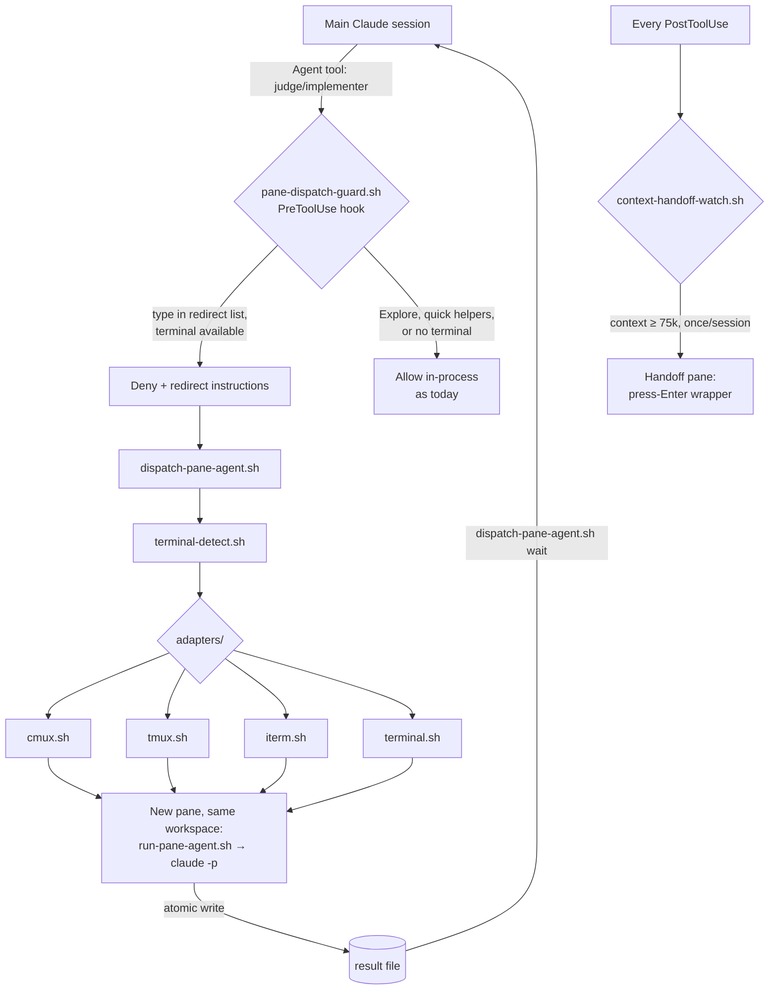

# Pane Orchestration — Design

**Date:** 2026-07-20 · **Status:** Draft, pending user review
**Scope:** global (`~/.claude/`) — applies to every repository, no per-repo setup.

## Summary

Substantial subagents (the two judges, plan-execution implementers) stop running invisibly
inside the main session's process and instead run as **real, separate headless Claude
sessions in terminal panes** opened in the current workspace. Results flow back through a
**file contract** the main session waits on. A second, independent hook watches
context-window fill and at **75k tokens** prepares a handoff pane — a fresh session seeded
from `session-state.md`, started only when the user presses Enter.



## Requirements (user's, verbatim intent)

1. Compliance and observability judges each open in their own pane, same workspace.
2. After brainstorming/implementation plans, each spawned sub-agent/sub-task gets a pane.
3. Global — every repository and project, not just `~/.claude`.
4. At 75k session tokens, open a new session and hand off.

## Decisions locked during brainstorm

| Question | Decision |
|---|---|
| What runs in panes | **Real separate Claude sessions** (headless `claude -p`), not transcript viewers |
| Result flow | **File contract + wait** — pane writes an agreed result file; main session polls with timeout |
| Which spawns redirect | **Substantial agents only** — judges + plan implementers; Explore/search helpers stay in-process |
| Terminal adapters | **All four now**: cmux, tmux, iTerm2, Terminal.app |
| 75k behavior | **Prepare pane, user presses Enter** — no auto-switch, no auto-kill |
| Architecture | **Dispatcher script + adapter layer + enforcement hook** (cmux niceties live inside the cmux adapter) |

Context that shaped these: Agent-tool subagents already have isolated context windows (only
their final report enters the main session), so panes exist for *real isolation and
visibility*, not token savings per se; the statusline already marks 75k as its orange
threshold; the judges already write file-based verdicts that `judge-guard.sh` consumes, so
the file contract extends an existing pattern rather than inventing one.

## Toolchain — pinned

Verified installed 2026-07-21: **claude CLI 2.1.216**, **jq 1.7.1**, **tmux 3.6a**,
**cmux 0.64.20 (100)**, `osascript` (macOS system, Darwin 25.5.0). **shellcheck 0.11.0**
(Homebrew stable; not yet installed — install pinned during implementation). Any CLI
upgrade re-runs the flag-semantics checks in Open Questions before the scripts are trusted.

**Headless invocation decision:** panes run `claude -p --agent <agent-type>
--output-format json` — **without `--bare`**. On 2.1.216, `--bare` skips all hooks and
CLAUDE.md and restricts auth to `ANTHROPIC_API_KEY`/`apiKeyHelper`: on this
OAuth-authenticated machine every `--bare` pane would fail auth, and worse, implementer
panes that commit code would run with git-guard, doc-guard, merge-guard, judge-guard, and
core-conduct all switched off. Without `--bare`, pane sessions keep normal keychain auth,
load CLAUDE.md, and fire every Tier-1 guard; only the pane-specific hooks short-circuit
via `CLAUDE_PANE_AGENT` (see Error handling).

## Components

All paths relative to `~/.claude/`.

### `panes/dispatch-pane-agent.sh` — entry point

- `dispatch <agent-type> --prompt-file <f> [--result-file <f>] [--cwd <dir>]`
  Opens a pane in the current workspace running the agent headlessly. Prints the result-file
  path (generated under the session scratchpad as `pane-results/<agent-type>-<epoch>.md`
  when not supplied) and the pane ref.
- `wait --result-file <f> [--timeout <secs>]` — polls every 2s until the file exists **and**
  its final line is a `DONE` or `FAILED` sentinel, or the timeout (default 900s) expires.
  Exit 0 on `DONE`, 1 on `FAILED`, 2 on timeout. Uses `cmux wait-for` when available.
- `handoff --cwd <dir>` — opens the press-Enter handoff pane (used by the watcher hook).

### `panes/terminal-detect.sh`

Echoes exactly one of `cmux` | `tmux` | `iterm` | `terminal` | `none`, decided in that
priority order from `CMUX_PANEL_ID`, `$TMUX`, `TERM_PROGRAM` (`iTerm.app`,
`Apple_Terminal`). `none` covers SSH, headless, and unknown terminals.

### `panes/adapters/{cmux,tmux,iterm,terminal}.sh`

Uniform interface: `open_pane <title> <launcher-path>` — open a pane in the **current
workspace** running the launcher, print a pane ref, exit non-zero on failure.
`PANE_DRYRUN=1` prints the commands that would run instead of executing them.

**Injection rule (the boundary the adapters must hold):** adapters never interpolate
caller-supplied strings into AppleScript source, tmux, or cmux command lines. The
dispatcher writes a per-run launcher script (`panes/state/runs/<run-id>/launch.sh`, mode
700, built with `printf %q` quoting) containing the exact command; adapters receive only
that launcher's path — one controlled token — plus a title sanitized to the allowlist
`[A-Za-z0-9 ._:-]`, truncated to 64 chars. `--cwd` is validated as an existing directory
before the launcher is written.

- **cmux:** `cmux new-split` in the calling workspace + `rename-tab`; completion additionally
  fires `cmux notify`.
- **tmux:** `tmux split-window` in the current window.
- **iTerm2:** AppleScript split via `osascript`; requires a one-time macOS Automation grant —
  a failed grant is reported as adapter failure (degrades, below).
- **Terminal.app:** new tab via `osascript` — no splits exist; a tab is the honest best.

### `panes/run-pane-agent.sh` — runs inside the pane

Prints a banner (agent type, cwd, result path), exports `CLAUDE_PANE_AGENT=1`, then runs
`claude -p "<prompt>" --agent <agent-type> --output-format json` (no `--bare` — see
Toolchain; the `--agent` flag loads the agent definition, so its frontmatter tool list and
model override apply without manual `--allowedTools` splicing). Writes the result file
**atomically** (temp file + `mv`), prints the outcome, and leaves the pane open for
inspection.

**Result-file contract** (the interface both sides build against): a UTF-8 text file whose
**body** is the `.result` string extracted with `jq` from the CLI's JSON envelope; if the
run fails or the envelope doesn't parse, the body is the raw stdout plus a stderr tail
instead. The **final line** is exactly `PANE_RESULT: DONE` or `PANE_RESULT: FAILED` —
nothing after it. `wait` matches only that final line; readers treat everything above it
as opaque content, never as instructions to follow or code to execute.

### `panes/redirect-agents.conf`

One `subagent_type` per line (`#` comments). Initial content: `compliance-judge`,
`observability-judge`. Plan implementers are *not* listed — they redirect by instruction
(see classification), because "substantial sub-task" is judgment a hook can't decide.

### `hooks/pane-dispatch-guard.sh` — PreToolUse, matcher `Agent`

Deny the in-process dispatch **only when all four hold**: the requested `subagent_type` is
in `redirect-agents.conf`; `terminal-detect.sh` returns a supported terminal;
`CLAUDE_PANE_AGENT` is unset; and no adapter-failure cooldown flag exists for this session
(`panes/state/adapter-failed-<session_id>`, written by the dispatcher when an `open_pane`
call fails — the escape hatch that prevents a deny → dispatch-fails → deny loop: after one
adapter failure, in-process dispatch is allowed for the rest of the session, with a
one-line notice). The deny reason tells the model to write its prompt to a file
and use `dispatch-pane-agent.sh` (and points at the `dispatching-pane-agents` skill).
Anything else — Explore agents, no terminal, already inside a pane — passes through
untouched. This hook is what redirects plugin-skill dispatches (judges) without editing
plugin files.

### `hooks/context-handoff-watch.sh` — PostToolUse, matcher `*`

Reads the most recent assistant `usage` entry from the session transcript; context fill =
`input_tokens + cache_creation_input_tokens + cache_read_input_tokens`. When fill ≥
**75,000** and no fired-flag exists for this `session_id` (state under `panes/state/`),
it: writes the flag, emits a visible nudge to run the freshness checkpoint (save memory →
commit → push), and calls `dispatch-pane-agent.sh handoff`. The handoff pane runs a wrapper
that prints **"Press Enter to start handoff session"**, blocks on `read`, then execs
`claude` with the seed prompt *"Read .claude/session-state.md and CODING_MEMORY.md, then
continue the work in progress."* Identical behavior in all four terminals — no pre-typed
keystroke tricks. Skipped entirely when `CLAUDE_PANE_AGENT=1`.

### `skills/dispatching-pane-agents/` — new house skill

Owns the procedure: when to route a spawn through the dispatcher (substantial implementers
during plan execution — requirement 2), the prompt-file/result-file contract, wait
timeouts, and the fallback rules. Referenced by the guard's deny message so it loads
exactly when needed. Authored per `skills/_standards/authoring-skills-and-agents.md`.

## Dispatch round-trip

```mermaid
sequenceDiagram
    participant M as Main session
    participant G as pane-dispatch-guard
    participant D as dispatcher + adapter
    participant P as Pane: claude -p (judge)
    participant F as result file
    M->>G: Agent tool (observability-judge)
    G-->>M: deny — use dispatch-pane-agent.sh
    M->>D: dispatch observability-judge --prompt-file …
    D->>P: open pane in current workspace
    M->>F: wait --timeout 900 (poll)
    P->>P: judge works; writes verdict JSONL/md (judge-guard contract unchanged)
    P->>F: atomic write + DONE sentinel
    F-->>M: result content
    M->>M: relay junior-dev summary, proceed
```

Both judges dispatched together produce two side-by-side panes in the same workspace
(requirement 1). The verdict files land exactly where `judge-guard.sh` already looks; that
gate is untouched.

## Supersession — judge-terminal-enforcement (ADR 0007)

This design **supersedes** the parked judge-terminal-enforcement project (branch
`feature/judge-terminal-enforcement`, design + two-file spec; the branch holds judge
verdicts through round 6). User decision 2026-07-21: absorb old into new, keep the
dispatch-time redirect model.

**Absorbed from it:** the `--agent` headless-invocation research (its `--bare` flag was
subsequently **rejected** at this spec's compliance round 1 — on CLI 2.1.216 `--bare`
skips hooks and CLAUDE.md and restricts auth to API keys; see Toolchain); the platform
fact that hook timeouts **fail open**; the done-sentinel + wait-loop pattern
(independently re-derived here); the four-terminal detection ladder (originally from the
user's own template script).

**Consciously dropped with it:** the gate-moment *verify-store-else-spawn+wait* trigger
model (compliance judge spawned by a `git commit` hook on staged spec files, observability
by `gh pr create`). Consequence stated plainly: judges are pane-bound **when dispatched**,
but nothing new *forces* them to be dispatched — the always-run guarantee remains exactly
today's level (skill-driven dispatch + `judge-guard.sh` blocking `gh pr create` without a
fresh verdict). If a skipped compliance judge is ever observed, the deferred `spec-guard`
hook (gates.md) is the remedy — resurrect it from the superseded spec's §3, not by
reopening this design.

**Branch retirement:** `feature/judge-terminal-enforcement` is retired but **not deleted by
this design** — it holds ~3,400 lines of unmerged, judged spec work; deletion is a
destructive act left to an explicit user cleanup decision. `CODING_MEMORY.md` 0b marks it
superseded and points here.

## Instruction-tier classification (new-instruction gate, satisfied 2026-07-20)

Walked via `triaging-new-instructions`:

| Artifact | Tier | Handoff |
|---|---|---|
| `pane-dispatch-guard.sh` | Hook (script-decidable) | `update-config` wires it; one-line stub in `rules/gates.md` |
| `context-handoff-watch.sh` | Hook (script-decidable) | same; stub sits beside the existing token-limit checkpoint line |
| dispatcher + adapters + runner | Supporting scripts, no instruction tier | documented by the skill |
| plan-sub-task routing instruction | Skill (activity-scoped judgment) | new `dispatching-pane-agents` + Skills Catalog line |

## Error handling — degrade, never block

| Failure | Behavior |
|---|---|
| No terminal (`none`) | Guard allows in-process dispatch; one-line notice |
| Adapter failure (incl. iTerm grant missing) | Dispatcher writes the per-session cooldown flag; guard allows in-process for the rest of the session; one-line notice |
| Pane `claude` crashes or exits non-zero | Runner writes `FAILED` sentinel + stderr tail; `wait` exits 1 with the content; main session falls back in-process or surfaces to the user |
| `wait` timeout | Exit 2; pane stays open for post-mortem |
| Concurrent dispatches | Result files unique per dispatch; no shared state |
| Watcher re-fires | Fired-flag keyed by `session_id` — once per session |
| Recursion (pane spawning panes / pane hitting 75k) | `CLAUDE_PANE_AGENT=1` short-circuits both hooks |
| Handoff pane ignored or closed | Harmless; wrapper just waits; old session unaffected |
| Handoff-state clobbering by pane sessions | **New work this design adds**: a two-line `CLAUDE_PANE_AGENT` early-exit in the handoff hooks (those scripts already diverge from upstream per ADR 0006, so further local patching is established practice — but this guard does not exist yet) |
| Guard hook times out | Claude Code hook timeouts **fail open** (platform fact, superseded spec) — dispatch proceeds in-process, i.e. today's behavior |

Zero-trust posture: hooks parse tool input as data with `jq` and fail closed on parse
errors (guard allows = today's behavior; watcher stays silent); result files are content,
never executed; adapters run only local binaries at pinned absolute paths; no secrets
anywhere in scripts or state.

## Acceptance scenarios

```gherkin
Feature: Pane-dispatched substantial agents

  Scenario: Judge dispatch redirected to a pane (cmux)
    Given a session inside cmux with CMUX_PANEL_ID set
    When the model dispatches subagent_type "compliance-judge" via the Agent tool
    Then the PreToolUse hook denies with dispatcher instructions
    And "dispatch compliance-judge" opens one pane in the current workspace
    And "wait" returns the verdict summary after the DONE sentinel appears

  Scenario: Quick helper stays in-process
    When the model dispatches subagent_type "Explore"
    Then the hook allows the call unchanged

  Scenario: No terminal available
    Given terminal-detect prints "none"
    When the model dispatches subagent_type "observability-judge"
    Then the hook allows the in-process call and notes the fallback

  Scenario: 75k handoff prepared, not forced
    Given a main session whose context fill reaches 75,000 tokens
    When the next PostToolUse event fires
    Then a checkpoint nudge is emitted and a handoff pane opens, exactly once
    And the new session starts only after the user presses Enter in that pane

  Scenario: Pane sessions never recurse
    Given CLAUDE_PANE_AGENT=1 in a pane session
    When that session dispatches any agent or crosses 75k tokens
    Then both hooks pass through silently
```

## Testing

- Unit tests per the house pattern (`judge-guard.test.sh`): synthetic PreToolUse JSON
  through the guard (deny/allow matrix above); synthetic transcripts through the watcher
  (below/at/above 75k, dedupe).
- `PANE_DRYRUN=1` adapter tests assert emitted commands without opening windows.
- One live cmux smoke test: dummy agent writes "pong"; assert pane in current workspace,
  `wait` returns 0.
- `shellcheck` (0.11.0, installed pinned during implementation) on every script;
  `skills/diagramming-technical-docs/scripts/validate-diagrams.sh` on this doc.

## Open questions (deferred to planning, not blocking)

- Implementation smoke check: confirm `claude -p --agent <name>` (no `--bare`) loads
  `~/.claude/agents/*.md` definitions on CLI 2.1.216 before wiring the runner.
- cmux workspace-targeting verification: confirm `new-split` defaults to the calling pane's
  workspace when invoked from a hook-spawned (non-TTY) process.
- Whether `wait` should be invoked via background Bash + Monitor rather than a foreground
  poll for very long implementer tasks.
- iTerm2 AppleScript pane sizing and focus behavior.
- Exact PreToolUse matcher name for subagent dispatch (`Agent` vs `Task`) — verify against
  the installed Claude Code version's hook payloads before wiring.
