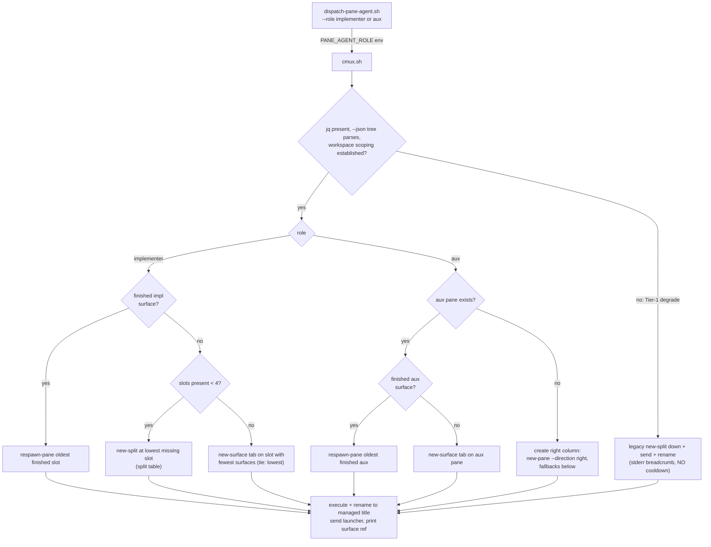

# Pane Layout v2 — Structured Workspace Layout (cmux) — Design

**Date:** 2026-07-21 · **Status:** Draft, pending judges + user review
**Scope:** cmux adapter only. Follow-on to pane orchestration
(`docs/superpowers/specs/2026-07-20-pane-orchestration-design.md`, PR #23); the dispatcher
contract, other adapters, hooks, and result-file contract are untouched except where named.

## Summary

Pane-dispatched agents stop landing as an undifferentiated `new-split down` stack and
instead build a deterministic one-workspace layout: **main session far-left, a progressive
2x2 implementer quadrant in the middle, a far-right "aux" column** for judges, handoff, and
extra sessions, with tab overflow past capacity. Layout is **derived live on every dispatch**
from `cmux --json tree` plus a title convention — no persistent layout state anywhere
(Approach A from the brainstorm; the ref-lifetime probe killed the slot-map alternative).

```
+--------+-----------+-----------+
|        | SA1 | SA2 |           |
|  main  |-----+-----|    aux    |
|        | SA3 | SA4 | (tabs >6) |
+--------+-----------+-----------+
```



Any mutating step whose target vanished between the tree read and execution retries once
with a fresh derivation, then falls to legacy (see Error handling).

## Requirements (user's, verbatim intent)

1. All panes live in ONE workspace; split direction depends on what triggered the dispatch.
2. Sub-agent implementation tasks → far-left main session, each subagent in a 2x2 quadrant
   to its right.
3. Any additional pane opens to the right of the quadrant, as a new session.
4. Sessions past the 6th always open as a new tab on the far-right pane.
5. Hard cap: 6 panes per workspace.

## Decisions locked during brainstorm (Q&A complete 5/5, 2026-07-21)

| Question | Decision |
|---|---|
| Who gets the quadrant | **Implementers/reviewers only** — judges, handoff, and user-requested extras all route to the far-right aux column (user chose over "all agents") |
| Slot reclamation | **Reuse finished slots** — agent exited (result written) ⇒ surface is respawnable; scrollback lost, `state/runs/<id>/` remains the durable record |
| Construction timing | **Progressive splits** — 1st implementer = one middle pane, 2nd stacks it, 3rd/4th complete the 2x2; no empty panes |
| Adapter scope | **cmux-only** — tmux/iterm/terminal keep today's `new-split down` and never read the role hint |
| Quadrant overflow | **Tabs on a quadrant pane** — a 5th+ concurrent implementer becomes a `new-surface` tab there; implementers never leave the quadrant (accepted cost: tabbed implementer hidden until clicked) |
| Architecture | **Approach A: smart cmux adapter, live-derived layout.** No persistent state; tree is ground truth; self-heals manual pane closes. B (persistent slot map) killed by ref lifetime — cmux refs die with the app process, so any stored map must revalidate against live tree anyway. C (adapter-agnostic layout primitives) is generality Q4 declined — YAGNI |

**Extension beyond the literal Q&A, flagged for user sign-off:** aux-surface reuse. Q2
covered only the quadrant; this design also respawns *finished aux surfaces* (oldest first)
before tabbing, for symmetry and bounded tab growth.

## Toolchain — pinned

Same machine and versions verified for PR #23 (2026-07-21): **cmux 0.64.20 (100)**,
**jq 1.7.1**, **claude CLI 2.1.216**, **shellcheck 0.11.0**, macOS Darwin 25.5.0. A cmux
upgrade re-runs the live-probe checklist (Testing) before the adapter is trusted — the
design leans on `--json` output shapes verified against 0.64.20.

cmux primitives used (all verified live in recon rounds 2–3): `--json tree` (per-surface
`title`/refs; pane list is FLAT — no geometry, which is why titles carry position),
`--json new-split` (returns `pane_ref`/`surface_ref`), `new-surface --pane`,
`respawn-pane --surface`, `rename-tab --surface`, `send`. `new-pane --direction right` is
Assumption 4 (unverified).

## Components

All paths relative to `~/.claude/`. **State added: none.**

### `panes/dispatch-pane-agent.sh` — one optional flag (~6 lines)

`dispatch ... --role <implementer|aux>`, allowlist-validated, default `aux`; the `handoff`
subcommand is always `aux`. Its only new job: export `PANE_AGENT_ROLE=<role>` into the
adapter call's environment. No layout knowledge lives here. Garbage `--role` values die
loudly with a usage error before any adapter call (caller bug ⇒ fail fast). One cosmetic
change: the label passed to adapters drops the now-redundant `pane: ` prefix.

### Adapter contract — FROZEN

`open_pane <title> <launcher>` is unchanged, so `common.sh` validation and the
tmux/iterm/terminal adapters are untouched (they never read the env var). This makes Q4's
cmux-only scope structural rather than conventional.

### `panes/adapters/cmux.sh` — the executor

Reads `PANE_AGENT_ROLE` (absent/unknown ⇒ `aux` + stderr note; the **raw env value never
enters a command line or title** — only the adapter's own mapped constant does). Fetches
`cmux --json tree`, asks the decision helper for a plan, executes it
(`respawn-pane` / `new-split` / `new-surface --pane`, plus `rename-tab`), prints the
surface ref, sends the launcher. Legacy `new-split down` disappears as a role path but
**survives as the degradation floor** — today's exact behavior.

### `panes/adapters/cmux-layout.sh` — NEW, sourced pure decision helper

Functions take (tree JSON, role) and return an action plan —
`reuse <surface_ref>` | `split <dir> <target_ref>` | `tab <pane_ref>` — plus the title to
stamp. **Zero cmux invocations inside**, so it unit-tests against canned JSON fixtures with
no cmux app, and keeps `cmux.sh` within file-size norms.

### `panes/run-pane-agent.sh` — completion marker

Writes `state/runs/<run-id>/agent-exit` (containing `DONE` or `FAILED`) immediately
**after** a successful result-file write; run dir derived from `dirname` of the prompt file
with a shape guard (no contract change). `fail_early` paths write **no marker** ⇒ the slot
never auto-reuses ⇒ the error pane is preserved for post-mortem. The in-pane title-restamp
alternative was rejected: unverified `$CMUX_SURFACE_ID` format for `--surface`, role
plumbing into the launcher, and a second title form — all for cosmetics `cmux notify`
already covers.

### `skills/dispatching-pane-agents/` — doc touch

Documents when callers pass `--role implementer` (plan-task implementers/reviewers, per Q1);
everything else takes the `aux` default.

Data flow: caller/skill → `dispatch --role implementer` → env → `cmux.sh` → `--json tree`
→ `cmux-layout.sh` plan → execute + rename → surface ref → send launcher.

## Title convention and slot derivation

Titles are the positional memory — the tree is flat and reuse rewrites run-ids, so
creation order cannot recover which pane is which. Layout state thereby lives in the cmux
app alongside the panes themselves; zero new files.

**Grammar** (inside the frozen, security-reviewed allowlist `[A-Za-z0-9 ._:-]`, ≤64 chars):

```
impl.<slot>:<run-id> <label>     slot ∈ 1-4 (quadrant; tabs carry their pane's slot)
aux:<run-id> <label>             (far-right column)
```

run-id = `[0-9]+-[0-9]+-[0-9]+` (existing epoch-pid-random). Recognition is **anchored**:
`^(impl\.[1-4]|aux):[0-9]+-[0-9]+-[0-9]+ `. The **adapter composes the title**: it extracts
the run-id from the already-validated launcher path (`…/runs/<run-id>/launch.sh`), prefixes
role + slot + run-id to the dispatcher's label, and truncates at 64 **from the right** —
the prefix is never truncated.

**Derivation rules** (per dispatch, from `--json tree`):

- Managed surface ⇔ anchored grammar match. Malformed/near-miss titles are simply unmanaged.
- Impl slot = pane holding ≥1 `impl.` surface. Slot **FINISHED** ⇔ every impl surface's
  run-id has an `agent-exit` marker OR its run dir is gone (7-day cleanup ⇒ finished);
  otherwise RUNNING.
- Aux pane = pane with ≥1 `aux:` surface and no impl surface (impl wins mixed panes).
- Duplicate slot N (shouldn't happen): newest run-id wins; losers become unmanaged, never
  touched.
- **Unmanaged panes — including the user's main session — are invisible**: never reused,
  never tabbed, never split-targets. Main needs no tree identification at all: "split right
  of main" uses cmux's env-implicit targeting (bare `new-split right`, as today); every
  other split targets a managed surface ref read live from the tree.

## Dispatch decision algorithm

**Implementer path, in order:**

1. **REUSE** — any finished impl surface ⇒ `respawn-pane --surface <ref> --command
   "bash <launcher>"` + rename; pick the OLDEST finished (run-id epoch). Never grows the
   quadrant.
2. **CREATE** — no reusable surface and fewer than 4 slots present ⇒ fill the **lowest
   missing slot**:

   | Slot | Command | Target |
   |---|---|---|
   | 1 | `new-split right` (env-implicit) | main's cell |
   | 2 | `new-split down --surface <slot1>` | slot 1 |
   | 3 | `new-split right --surface <slot1>` | slot 1 |
   | 4 | `new-split right --surface <slot2>` | slot 2 |

   Dependencies are well-founded (2, 3 need 1; 4 needs 2; slot 1 missing ⇒ env-implicit
   split from main again), so any interleaving converges to the 2x2 and lowest-missing-first
   self-heals user-closed slots. The new surface gets the launcher via `send` (proven path)
   + rename.
3. **TAB OVERFLOW** — 4 slots present, none finished ⇒ `new-surface --pane` on the slot
   with the FEWEST surfaces (tie ⇒ lowest slot) + send + rename.

**Aux path:** aux pane exists ⇒ respawn a finished aux surface (oldest first; the flagged
extension) else new tab. No aux pane ⇒ create the right column: try
`new-pane --direction right` (full-height column — Assumption 4), fallback
`new-split right --surface <slot3|slot4|newest right-column surface>` (imperfect geometry,
functional), and with no quadrant at all, env-implicit `new-split right`.

**The 6-pane cap is emergent, not counted:** managed layout never creates beyond
slots 1-4 + aux (+ main) = 6. User-made unmanaged panes can push the visual total past 6;
they are invisible to the algorithm and unmolested. `close-surface` ends up unused
(respawn covers reuse). Pane proportions / `resize-pane` are out of scope (user-draggable;
future nicety).

## Error handling — layout smarts only ever fail INTO the dumb path

PR #23's cooldown contract keeps its meaning ("terminal unusable"), never "layout
confused". Derivation runs **before** any mutating call, so a Tier-1 failure performs
exactly one mutation path — no half-built layouts.

| Failure | Behavior |
|---|---|
| jq missing; `--json tree` fails or unparseable; workspace scoping unestablishable (Assumption 1); derivation nonsense | **Tier 1:** legacy `new-split down` + send + rename; one stderr breadcrumb `cmux-layout: degraded (<reason>)`; **never cooldown** |
| Malformed titles | Those surfaces are unmanaged — not an error |
| Duplicate slot N | Newest run-id wins; losers unmanaged, never touched |
| Target surface vanished between tree read and respawn/new-surface/new-split (TOCTOU) | Retry ONCE with a fresh derivation, then legacy. Bounded, deterministic |
| Legacy split itself fails, or `send` fails post-creation | **Tier 2, unchanged from today:** adapter exits non-zero ⇒ dispatcher cooldown flag ⇒ in-process for the session. Pane-exists-but-empty is the same partial state v1 ships; no rollback, no `close-surface` cleanup — destroying panes on error contradicts the post-mortem philosophy |
| Garbage `--role` at the dispatcher | Fail fast, usage exit, before any adapter call |
| Absent/unknown role env at the adapter | Treated as `aux` + stderr note |
| `agent-exit` write fails | Stderr note; slot just never looks finished (never reused; extra splits at worst). PANE_RESULT contract untouched |
| Handoff-wrapper rename fails | `\|\| true` — documented consequence: aux tabs may land on main's pane |
| Run-id extraction from launcher path fails | Unprefixed title (unmanaged surface) + stderr note; dispatch proceeds |

**Accepted risk (explicit):** no timeout wrappers on cmux calls — consistent with every
existing adapter call; the degradation policy targets errors, not hangs (macOS lacks stock
`timeout(1)`; adding machinery is YAGNI until a hang is observed).

## Flagged assumptions (verify at implementation; every one has a degrade path)

1. **Workspace scoping** — managed titles in OTHER workspaces must not attract splits.
   Mechanism: bare `tree` env-scoping OR matching `$CMUX_WORKSPACE_ID` against tree refs.
   Neither works ⇒ Tier-1 legacy.
2. **In-pane rename on handoff adoption** — post-handoff, main runs in an `aux:`-titled
   surface; the handoff wrapper best-effort renames its own tab
   (`rename-tab --surface "$CMUX_SURFACE_ID"`) to strip the managed prefix. Fails ⇒ aux
   tabs land on main's pane — annoying, functional.
3. **Title survival across `restore-session`** — unverified. Lost ⇒ everything looks
   unmanaged ⇒ fresh splits (possible extra panes; never broken). Observational only —
   not probed.
4. **`new-pane --direction right` creates a full-height column** — else fallback split
   right of a right-column slot (imperfect geometry, functional).

## Acceptance scenarios

```gherkin
Feature: Structured cmux workspace layout for pane-dispatched agents

  Scenario: First implementer builds slot 1
    Given a cmux workspace holding only the main session pane
    When an agent is dispatched with --role implementer
    Then the adapter runs env-implicit "new-split right"
    And the new surface title matches "impl.1:<run-id> <label>"

  Scenario: Finished slot is reused before the quadrant grows
    Given slots 1-3 exist and only slot 2's run-id has an agent-exit marker
    When an implementer is dispatched
    Then slot 2's surface is respawn-paned with the new launcher
    And no new pane is created

  Scenario: Full, busy quadrant overflows to a tab
    Given slots 1-4 exist, none finished, and slot 3 has the fewest surfaces
    When an implementer is dispatched
    Then a new surface opens on slot 3 titled "impl.3:<run-id> <label>"

  Scenario: Judge routes to the aux column
    Given a quadrant exists and no aux pane
    When a judge is dispatched (role defaults to aux)
    Then the adapter creates the far-right column titled "aux:<run-id> <label>"

  Scenario: Layout derivation failure degrades to legacy, never cooldown
    Given jq is missing or "--json tree" output is unparseable
    When any dispatch reaches cmux.sh
    Then it performs plain "new-split down" + send + rename
    And prints one stderr breadcrumb and writes no cooldown flag

  Scenario: fail_early preserves the slot for post-mortem
    Given an implementer run that failed before its result write (no marker)
    When later implementers are dispatched
    Then that surface is never respawned

  Scenario: Garbage --role fails fast
    When dispatch is called with --role wizard
    Then it exits with a usage error before any adapter call

  Scenario: Unmanaged panes are invisible
    Given panes whose titles do not match the anchored grammar
    When any dispatch derives the layout
    Then those panes are never reused, tabbed, or split-targeted
```

## Testing

Ground truth: suites are `panes/adapters.test.sh` (table-driven dry-run + validation, no
real panes), `panes/dispatch-pane-agent.test.sh`, `panes/run-pane-agent.test.sh`; adapters
are cmux/tmux/iterm/terminal.

- **Layer 1 — NEW `panes/adapters/cmux-layout.test.sh` (pure decision tests):** source the
  helper, feed canned tree-JSON fixtures + a fake `PANE_STATE_DIR` (runs dirs ± marker),
  assert the emitted plan. Matrix: empty ⇒ create slot 1; lowest-missing-slot fill;
  reuse-oldest-finished; full+busy ⇒ tab fewest-surfaces (tie ⇒ lowest); aux
  exists/absent/reuse; duplicate slot ⇒ newest wins; malformed titles ⇒ unmanaged; missing
  run dir = finished; absent role ⇒ aux. Real jq, no cmux, fast.
- **Layer 2 — fake cmux binary:** `CMUX_BIN` becomes `${PANE_CMUX_BIN:-/Applications/…}`
  (precedent: `PANE_CLAUDE_BIN`/`PANE_STATE_DIR`; env-only, test-only — controlling env =
  controlling process, no boundary weakening). The fake logs argv and replays scripted
  per-subcommand responses from a fixture dir. Asserts **call sequences** (respawn for
  reuse, correct `--surface` targets, rename carries the prefix) and the degradation
  matrix: garbage tree ⇒ legacy call + stderr breadcrumb + NO cooldown flag; respawn fails
  once ⇒ re-derive ⇒ legacy; legacy split fails ⇒ exit non-zero (the cooldown-flag
  assertion lives in `dispatch-pane-agent.test.sh`).
- **Layer 3 — existing suites extended; `PANE_DRYRUN` redefined as derive-then-print:**
  derivation is read-only, so dryrun derives (via `PANE_CMUX_BIN` when set) and prints the
  plan; with no cmux available it prints the legacy plan, so existing `"new-split down"`
  assertions keep passing on cmux-less machines. tmux/iterm/terminal loop cases unchanged.
  `dispatch-pane-agent.test.sh` += `--role` validation (valid/invalid/absent);
  `run-pane-agent.test.sh` += marker cases (written after result write, DONE/FAILED
  content, fail_early ⇒ no marker, shape guard ⇒ no marker outside `runs/`).
- **Falsification discipline (mandatory; token-bar lesson):** every degradation/guard test
  is validated by mutating the code it guards and watching it go red before trusting
  green — e.g. make the helper exit non-zero on missing jq and the "Tier 1 never
  cooldowns" test must catch the flag write.
- **Live probe checklist (implementation start, NOT CI):** scripted scratch-workspace probe
  resolving Assumptions 1, 2, and 4; Assumption 3 stays observational. Results go to the
  branch log. 2x2 visual correctness: one manual live check, not automated.
- `shellcheck` 0.11.0 on every touched script;
  `skills/diagramming-technical-docs/scripts/validate-diagrams.sh` on this doc.

## Constraints carried forward

- The degrade-never-block invariant from PR #23 stands: adapter hard failure ⇒ cooldown ⇒
  in-process fallback. This design narrows when that fires (Tier 2 only), never widens it.
- Model gate: user directed Opus 4.8 for writing-plans + implementation; the formal
  pre-implementation gate is still asked when code starts.

## Open questions (deferred to planning, not blocking)

- Whether `respawn-pane --command` runs through a shell (quoting semantics for
  `bash <launcher>`) — pin during the live probe.
- Whether the `--json new-split` ref should be captured for the rename/send, or the
  `send`-to-focused path from v1 retained where env-implicit splits are used — an
  implementation detail the fixtures will force explicit.
