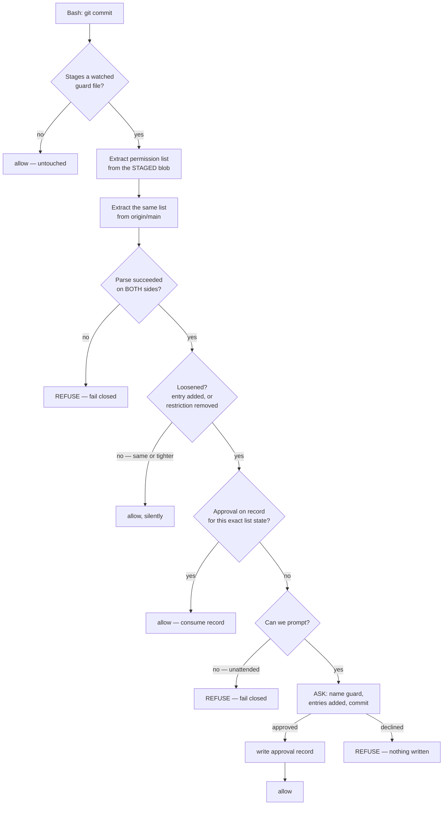

# Guard-loosening approval — design

**Status: SPEC, awaiting human review. No code exists. No implementation branch exists.**
Written 2026-09-20. Card: `docs/features/guard-loosening-approval.md`.

---

## 1. Background — why this exists

Three hooks are treated as security controls in this repo:

| Guard | What it restricts |
|---|---|
| `hooks/secret-command-guard.sh` | Bash commands naming secret-bearing files, and full-environment dumps |
| `hooks/git-guard.sh` | Commits on the default branch; force-pushes |
| `hooks/worktree-guard.sh` | Writes and git operations from the primary checkout |

Each carries a **permission list** — the paths, patterns or literals it allows or refuses. Widening
one of those lists weakens the control. Today **nothing catches that in the moment.**

`hooks/git-guard.replay.sh` exists and would catch it: it replays `main`'s guard and the candidate
guard over the same matrix and reports every case where the base blocks and the candidate allows.
**Nothing runs it.** Measured 2026-09-20: **0** registrations in `settings.json`, and the repo has
no CI workflow directory. It runs only when a human remembers to type it.

The user's stated position, verbatim: *"I don't want to loosen up any security or guards."*

The user accepted wiring the check up but **amended its shape**: it must **stop and ask for approval
in the moment**, not report a change already made.

### 1.1 What this does NOT do — state this before anything else

⚠️ **This gates a loosening being *proposed*, never the moment one goes live.** Hooks execute from
the primary checkout `$HOME/.claude/hooks/`, so a loosening committed on a branch is **inert until
that branch merges**. PR review remains the last line of defence. Any wording that calls this
feature the final defence is wrong and must be corrected on sight.

⚠️ **It is a momentum guardrail, not a security boundary.** The approval record is written by the
agent, so it is forgeable from inside a session. Same honest limit already documented for
`secret-command-guard.sh`. The typed human decision is the load-bearing control.

---

## 2. Decisions already settled with the user — do not relitigate

| Question | Decision | Date |
|---|---|---|
| What to check | Fast targeted check of the guard's permission list, every time — not a full replay | 2026-09-16 |
| Which guards | `secret-command-guard.sh`, `git-guard.sh`, `worktree-guard.sh` | 2026-09-16 |
| Unattended / no prompt possible | **Refuse outright.** Fail closed | 2026-09-16 |
| Approval lifetime | Until that rule changes again — fingerprinted to the list's exact new state | 2026-09-16 |
| One watcher or three | **One shared watcher hook** covering all three guards | 2026-09-20 |
| Approval store | **Reuse `hooks/lib/secret_approval.py`** — but prove the new key shape first | 2026-09-20 |

**Why a targeted check, not a replay:** a full replay takes **164 seconds** (measured 2026-09-16).
That is not viable on every commit.

**Why only these three guards:** the user was explicitly offered "every guard, no exceptions" and
"just the one this PR touched", and chose the security-relevant set. `doc-guard.sh`,
`test-marker-guard.sh` and `judge-guard.sh` were **considered and deliberately excluded** as workflow
nudges rather than security controls. Widening scope later is a new decision for the user, not a gap
to quietly fill.

**Why one watcher rather than three:** one place to read, one to test, one prompt style — and it
avoids building prompt capability into two guards that have none. It also avoids one rule living in
three files, a failure this repo has recorded before.

---

## 3. Measured facts the design rests on

Re-measured **2026-09-20** against the live primary checkout, after 83 commits had landed since the
originals. Anything built on these must re-measure rather than cite this table.

| Fact | Value | How |
|---|---|---|
| Registrations of the replay harness | **0** | `grep -c 'git-guard.replay' ~/.claude/settings.json` |
| `permissionDecision` in `git-guard.sh` | **3** | `grep -c` on the live file |
| `permissionDecision` in `secret-command-guard.sh` | **0** | same |
| `permissionDecision` in `worktree-guard.sh` | **0** | same |
| `hooks/lib/secret_approval.py` exists | yes, 28,647 bytes | `ls -la` |
| Full replay runtime | 164 s | measured 2026-09-16 |

⚠️ **"Guards here can already prompt" is FALSE as a general claim** — two of the three cannot prompt
at all. This is a principal reason the watcher is one shared hook.

⚠️ **Pane subagents launch with `--dangerously-skip-permissions`.** A prompt likely will not stop
them. This is *why* the unattended case must refuse rather than fall through.

---

## 4. ⚠️ Task 0 — a blocking spike. Nothing else starts until this resolves.

**The `ask` path has never been live-verified.** A comment in `git-guard.sh` records it as a pending
manual acceptance test. The entire feature rests on a prompt that genuinely blocks a commit.

```gherkin
Scenario: the ask path actually blocks a commit
  Given a hook registered on PreToolUse for Bash
    And that hook returns permissionDecision "ask" for a specific commit command
   When that exact command is run in an interactive session
   Then the commit must NOT be created
    And the user must see a prompt naming the command
    And declining the prompt must leave the working tree and HEAD unchanged
```

```gherkin
Scenario: the ask path under a pane subagent
  Given the same hook
    And a subagent launched with --dangerously-skip-permissions
   When that subagent runs the same commit command
   Then record what actually happens — blocked, or silently allowed
    And if it is allowed, that is the measured basis for refusing when unattended
```

**Exit conditions — this is a decision point, not a checkbox:**
- **Prompt blocks:** proceed to §5.
- **Prompt does not block:** **STOP and return to the user.** The design needs rethinking, not
  patching. Do not build a prompt-shaped feature on a prompt that does not stop anything.

**Requirement (user-adopted 2026-09-20):** prove the prompt blocks before building on it.

---

## 5. The mechanism

### 5.1 Shape

A new `PreToolUse` hook on `Bash`, registered beside `doc-guard.sh` and `test-marker-guard.sh`.
It fires **only** when the commit stages one of the three watched guard files; every other command
passes untouched.



### 5.2 Direction matters

**Tightening passes silently. Only loosening prompts.** A guard being made stricter is not an event
worth interrupting anyone for. This mirrors `EXPECTED_STRICTER`, which already exists in the replay
harness for the same reason in the opposite direction.

### 5.3 What the user sees

The prompt must name three things, and nothing else:
1. **Which guard** is being loosened.
2. **The exact entries added** — or the restriction removed. Not a diff; the specific change.
3. **The commit** it belongs to.

### 5.4 `EXPECTED_RELAXED` stops being hand-edited

Today `EXPECTED_RELAXED` in `git-guard.replay.sh` is hand-edited to silence the alarm — the
declaration and the approval are separate acts, and the declaration can be made without anyone
approving anything. Under this design it becomes **a record written by the approval**, so the
declaration is a consequence of a human decision rather than a substitute for one.

---

## 6. Scenarios

### 6.1 Good — the cases that must work

```gherkin
Scenario: a loosening is proposed interactively and approved
  Given a commit staging hooks/git-guard.sh
    And the staged permission list allows one path that origin/main's does not
   When the commit runs in an interactive session
   Then the user is prompted, naming the guard and that one added path
    And on approval the commit proceeds
    And an approval record is written, keyed to the new list state
```

```gherkin
Scenario: tightening is silent
  Given a commit staging hooks/secret-command-guard.sh
    And the staged permission list removes a path origin/main's allowed
   When the commit runs
   Then no prompt appears
    And the commit proceeds
```

```gherkin
Scenario: an unrelated commit is untouched
  Given a commit staging only docs/features/example.md
   When the commit runs
   Then this hook takes no action and adds no output
```

```gherkin
Scenario: re-committing the same approved list state does not re-prompt
  Given an approval record exists for a guard's list state S
   When a commit stages that guard with list state S
   Then no prompt appears
```

### 6.2 Bad — the cases that must REFUSE

```gherkin
Scenario: unattended, and a loosening is proposed
  Given a commit staging hooks/worktree-guard.sh with a widened list
    And no interactive prompt is possible
   When the commit runs
   Then the commit is REFUSED
    And the output states that approval cannot be obtained unattended
```

```gherkin
Scenario: the checker cannot parse one side
  Given a commit staging hooks/git-guard.sh
    And the permission list cannot be extracted from either the staged blob or origin/main
   When the commit runs
   Then the commit is REFUSED
    And the output names which side failed to parse
```

```gherkin
Scenario: the user declines
  Given a loosening is proposed and the user is prompted
   When the user declines
   Then the commit is REFUSED
    And no approval record is written
    And HEAD and the working tree are unchanged
```

```gherkin
Scenario: an approval does not transfer to a different list state
  Given an approval record exists for guard G at list state S1
   When a commit stages guard G at a DIFFERENT loosened state S2
   Then the record must NOT satisfy S2
    And the user is prompted again
```

### 6.3 Edge cases — enumerate, do not infer

```gherkin
Scenario Outline: edges that must each have a decided answer
  Given <situation>
   When a commit stages a watched guard
   Then the behaviour is <behaviour>

  Examples:
    | situation                                          | behaviour                           |
    | origin/main has no copy of the guard yet (new file) | treat as all-new: prompt            |
    | the guard file is deleted by the commit             | prompt — removal is not tightening  |
    | the guard is renamed                                | prompt — treat as new file          |
    | the commit stages TWO watched guards at once        | one prompt per guard, both must pass|
    | the staged blob is byte-identical to origin/main    | allow silently — nothing changed    |
    | origin/main is unreachable (offline/no remote)      | REFUSE — cannot establish a baseline|
    | python3 is missing                                  | REFUSE — name the missing tool      |
    | the commit is a merge commit bringing the guard in  | ⚠️ UNDECIDED — see §9 open question |
```

---

## 7. Fail-closed contract

**Requirement (user-adopted 2026-09-20): fail closed on the checker's own parse errors.**

| Condition | Result |
|---|---|
| Either side's permission list unparseable | REFUSE |
| `origin/main` baseline unobtainable | REFUSE |
| `python3` missing | REFUSE |
| Approval store missing or unreadable | REFUSE the bypass; judge the commit on its merits |
| Any internal error in the checker | REFUSE |

⚠️ **This is the OPPOSITE direction from `secret-command-guard.sh`, which fails OPEN.** That is
deliberate and the reasoning differs: this hook fires only when a commit stages one of three
specific files, so its blast radius is tiny, and a false refusal costs one commit. Do not
"harmonise" the two — the asymmetry is the design.

---

## 8. Approval store

Reuse `hooks/lib/secret_approval.py`. It already implements single-use fingerprinted approvals,
keyed to a session, deleted on first use.

⚠️ **It currently fingerprints shell command *text*. Keying it to a guard's permission list is a new
key shape that has never been tested.**

**Requirement (user decision, 2026-09-20): prove the key shape before building on it.**

```gherkin
Scenario: the new key shape discriminates
  Given an approval keyed to guard G at permission-list state S1
   When the key is tested against S1
   Then it matches
   When the key is tested against a different state S2
   Then it does NOT match
```

⚠️ **Falsify against two stubs** — an always-match stub and a never-match stub. Any assertion passed
by both discriminates nothing. A key that silently fails to discriminate fails in the **permissive**
direction, which is the worst way for a security gate to break.

---

## 9. Open questions — NOT decided, must not be guessed

1. **Merge commits.** A merge that brings a loosening in from another branch stages the guard
   without anyone editing it. Prompting on every such merge may be noise; not prompting is a hole.
   **Undecided.**
2. **What exactly is "the permission list"** in each of the three guards? They are three different
   shapes — a `case` allowlist in `git-guard.sh`, pattern literals in `secret-command-guard.sh`, an
   exemption list in `worktree-guard.sh`. Each needs its extraction defined **and verified against
   the real file**, not assumed. ⚠️ Verify a field's or function's real name before building on it;
   a guessed one fails closed, and failing closed is indistinguishable from the feature being off.
3. **Does the prompt block at all?** §4. Until answered, everything downstream is provisional.

---

## 10. Testing requirement

**Requirement (user-adopted 2026-09-20): ship a test proving the check can say *no*.**

A guard never observed refusing is not a guard. The suite must include at least one case that
**fails if the checker is replaced by an always-allow stub**, and one that fails against an
always-deny stub. Passes shared by both stubs discriminate nothing.

Per `rules/core-conduct.md`: the test and the implementation are never edited in the same step.

---

## 11. Toolchain — pinned

| Tool | Version | Note |
|---|---|---|
| `bash` | 3.2 (macOS system) | No `declare -A`, no `mapfile`. Same floor as every existing hook. |
| `python3` | system python3 | Already required by the other guards; absence is a REFUSE condition (§7) |
| Existing libs | `hooks/lib/secret_approval.py`, `hooks/lib/shell_segments.py` | Reuse. Do not fork. |

No new third-party dependency. Adding one is a decision for the user
(`rules/core-conduct.md`: never add a dependency unilaterally).

---

## 12. Human review gate

**This spec must be read end to end by the user before any code is generated.** That is the entire
reason it exists: a logic error caught here costs a paragraph, and the same error caught after
implementation costs everything built on it.

**No branch, no code, until the user types `gate confirmed`.**
