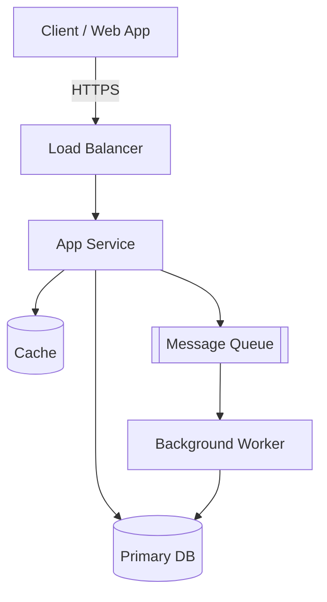
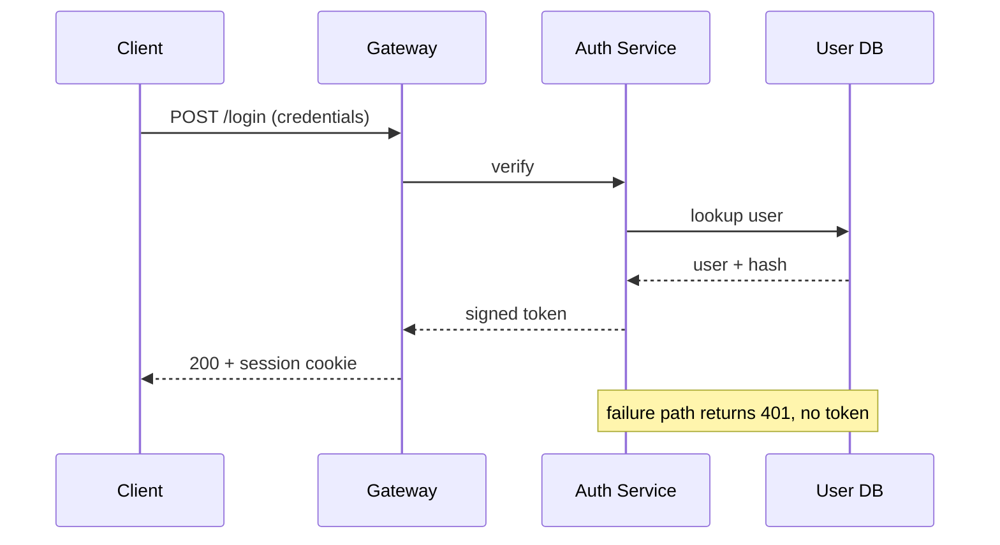
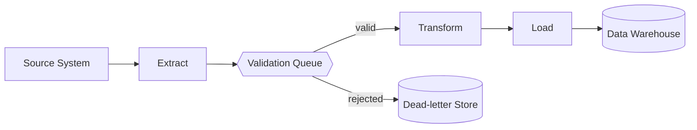
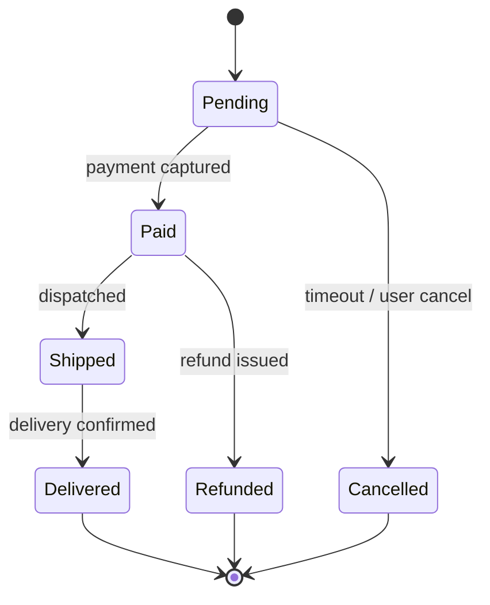
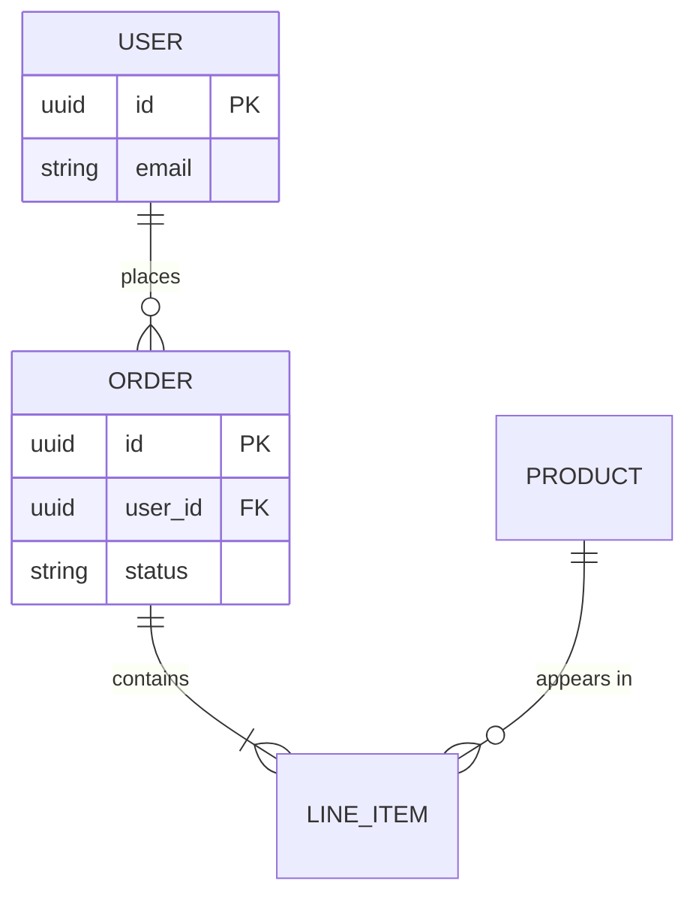
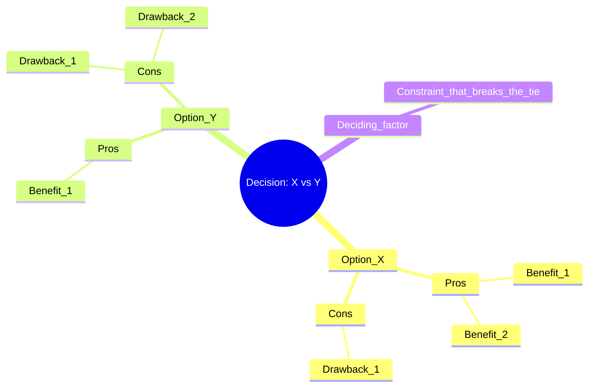
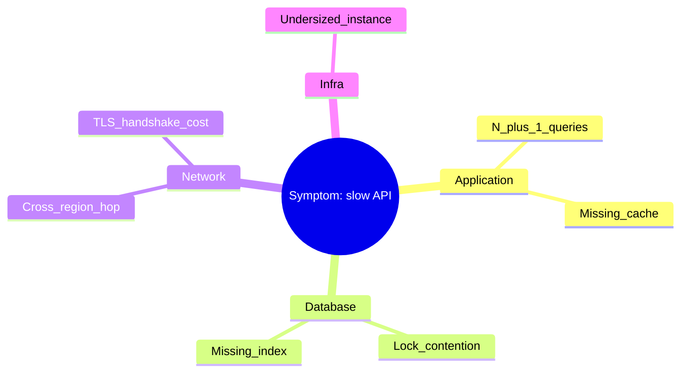

# Mermaid Templates

Fill-in-the-blank starting points. Copy the block, replace the placeholders, delete the
rows you don't need. All render natively in GitHub, VS Code, and Claude Artifacts.

---

## System architecture map

## API authentication — sequence

## Data pipeline / ETL

## State machine — order lifecycle

## Data model — ER diagram

## Decision / tradeoff — mind map

## Root-cause / troubleshooting — mind map

