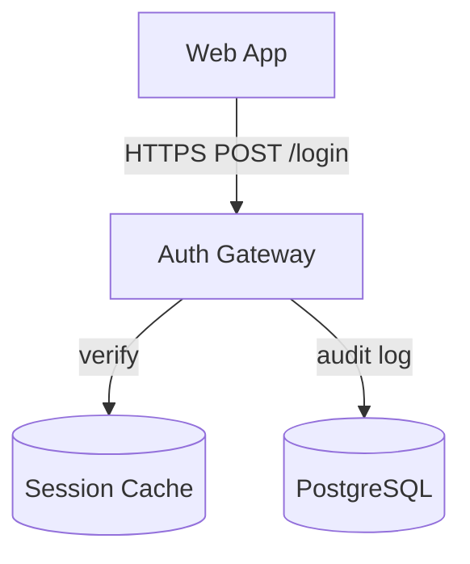
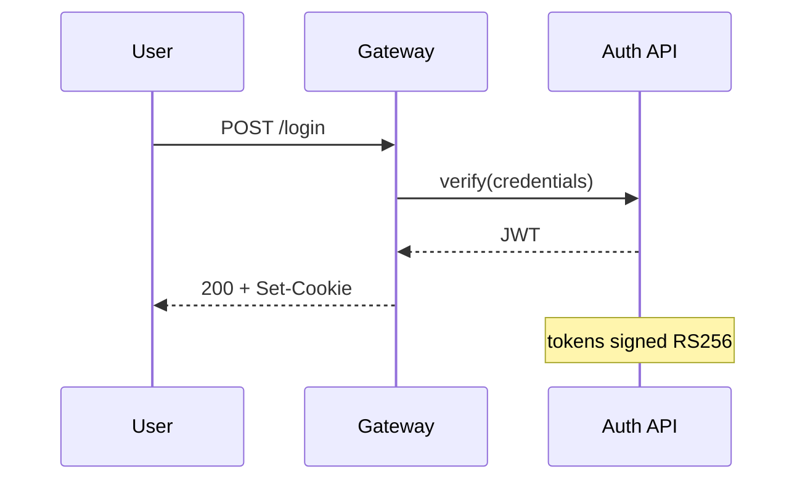
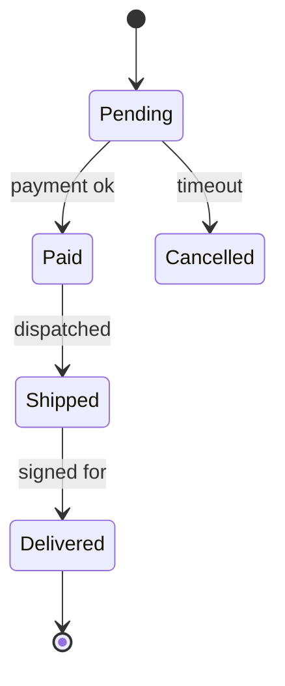
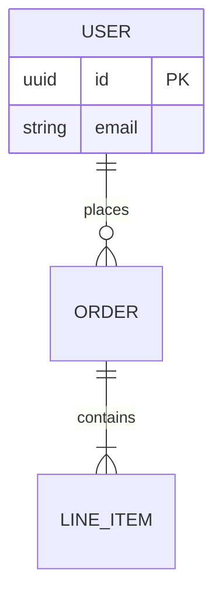
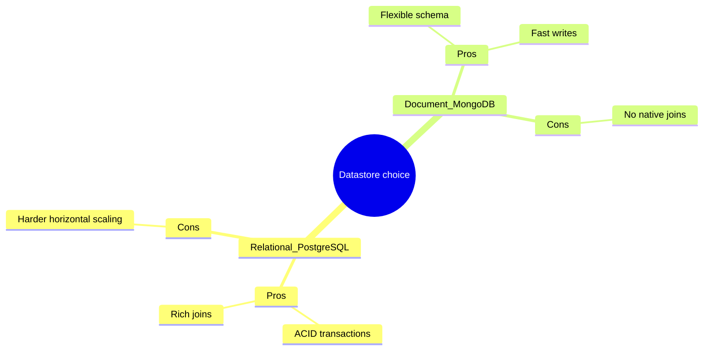

# Mermaid Diagram Types — Reference

Per-type: when to use it, a minimal correct example, and the gotchas that make a block
fail to render. Rendering failures almost always trace to one of the gotchas, not to the
diagram logic.

---

## flowchart — architecture maps, data pipelines

`graph TD` (top-down) for architecture stacks; `flowchart LR` (left-right) for pipelines.

Node shapes carry meaning — use them consistently:
- `[Service]` rectangle = process/service
- `[(Store)]` cylinder = database/cache
- `((Node))` circle = start/external entity
- `{Decision}` diamond = branch
- `>Flag]` asymmetric = a note/edge case

**Gotchas:**
- **`end` is a reserved word.** A node literally named `end` (lowercase) breaks the graph. Capitalize it (`End`) or rename.
- **Special characters in a label need quotes:** `A["auth/login (POST)"]` — parentheses, colons, slashes, or `#` inside an unquoted label break the parse.
- Edge labels use `-->|text|` or `-- text -->`. Don't mix the two forms in one edge.
- `subgraph Name ... end` groups nodes; the closing `end` here is required and correct (distinct from the reserved-word trap above).

---

## sequenceDiagram — interactions over time (auth, request/response)

- `->>` solid arrow (call), `-->>` dashed arrow (return). Keep call/return consistent.
- Declare `participant X as Label` up front to control order and short names.
- `activate`/`deactivate` (or `->>+` / `-->>-`) show lifelines; `Note over X:` and `alt/else/end`, `loop/end` express branches and repetition.

**Gotcha:** every `alt`, `opt`, `loop`, `par` must be closed with `end`.

---

## stateDiagram-v2 — lifecycles (order status, job states)

- `[*]` is both the start and the terminal state (position tells which).
- Transition label after the colon: `A --> B: event`.
- Nested states: `state Active { ... }`.

**Gotcha:** use `stateDiagram-v2`, not the older `stateDiagram` — v2 lays out far more reliably.

---

## erDiagram — data models

Cardinality is the crux — read left-to-right:
- `||` exactly one
- `o{` zero or many
- `|{` one or many
- `o|` zero or one

So `USER ||--o{ ORDER` = one user has zero-or-many orders.

**Gotcha:** the relationship label after the colon is mandatory (`: places`); omitting it fails the parse.

---

## mindmap — decisions, tradeoffs, root-cause, scope breakdown

Indentation defines hierarchy (like an outline). Exactly **one root**.

- Root shape: `root((text))` circle, `root[text]` box, `root(text)` rounded.
- Depth = indentation level; keep it consistent (2 spaces per level is safe).

**Gotchas:**
- **Only one root node.** Two top-level siblings under `mindmap` is the most common failure. Everything hangs off the single root.
- **Avoid parentheses/brackets/colons in plain node text** — they are interpreted as shape syntax. Use underscores or spaces instead (`Relational_PostgreSQL`, not `Relational (PostgreSQL)`), or the node label will mis-parse.
- Indentation must be spaces, not tabs.

---

## Picking the type quickly

| You are documenting… | Type |
|---|---|
| how components connect | `graph TD` |
| data moving through stages | `flowchart LR` |
| who calls whom, in order | `sequenceDiagram` |
| an object's lifecycle | `stateDiagram-v2` |
| tables and relationships | `erDiagram` |
| options, pros/cons, a breakdown | `mindmap` |
